# 事件监听机制

<cite>
**本文档引用的文件**
- [index.html](file://index.html)
- [script.js](file://js/script.js)
- [color-picker.js](file://js/color-picker.js)
- [bootstrap.min.js](file://js/bootstrap.min.js)
- [splitting.min.js](file://js/splitting.min.js)
</cite>

## 目录
1. [简介](#简介)
2. [项目结构](#项目结构)
3. [核心组件](#核心组件)
4. [架构概览](#架构概览)
5. [详细组件分析](#详细组件分析)
6. [依赖关系分析](#依赖关系分析)
7. [性能考虑](#性能考虑)
8. [故障排除指南](#故障排除指南)
9. [结论](#结论)
10. [附录](#附录)

## 简介

本项目是一个基于Web的交互式音频可视化应用，实现了完整的事件监听机制。该系统通过多种事件处理模式（直接绑定、委托模式、原生事件）实现了丰富的用户交互功能，包括按钮点击、触摸手势、键盘输入、窗口调整等。

系统采用模块化设计，将事件处理逻辑分布在多个JavaScript文件中，形成了清晰的职责分离：主逻辑在script.js中处理核心功能，在color-picker.js中处理颜色选择器交互，在bootstrap.min.js中提供UI组件的事件支持。

## 项目结构

项目采用标准的Web项目结构，主要文件组织如下：

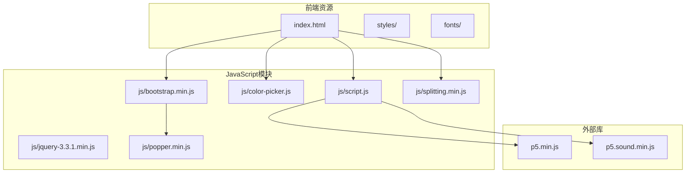

**图表来源**
- [index.html:1-282](file://index.html#L1-L282)
- [script.js:1-1049](file://js/script.js#L1-L1049)

**章节来源**
- [index.html:1-282](file://index.html#L1-L282)
- [script.js:1-100](file://js/script.js#L1-L100)

## 核心组件

### 事件处理器架构

系统实现了多层次的事件处理架构：

1. **直接事件绑定**：针对特定DOM元素的直接事件监听
2. **委托事件处理**：利用事件冒泡机制进行统一处理
3. **原生事件监听**：浏览器原生事件的直接响应
4. **第三方库集成**：通过jQuery和Bootstrap提供的事件系统

### 主要事件类型

系统支持以下主要事件类型：

- **鼠标事件**：click、mousedown、mouseup、mouseenter、mouseleave
- **触摸事件**：touchstart、touchmove、touchend
- **键盘事件**：keydown、keyup、input
- **窗口事件**：resize、pagehide
- **表单事件**：change、focus、blur

**章节来源**
- [script.js:152-155](file://js/script.js#L152-L155)
- [script.js:466-538](file://js/script.js#L466-L538)

## 架构概览

系统采用分层事件处理架构，实现了从底层原生事件到高层业务逻辑的完整处理链：

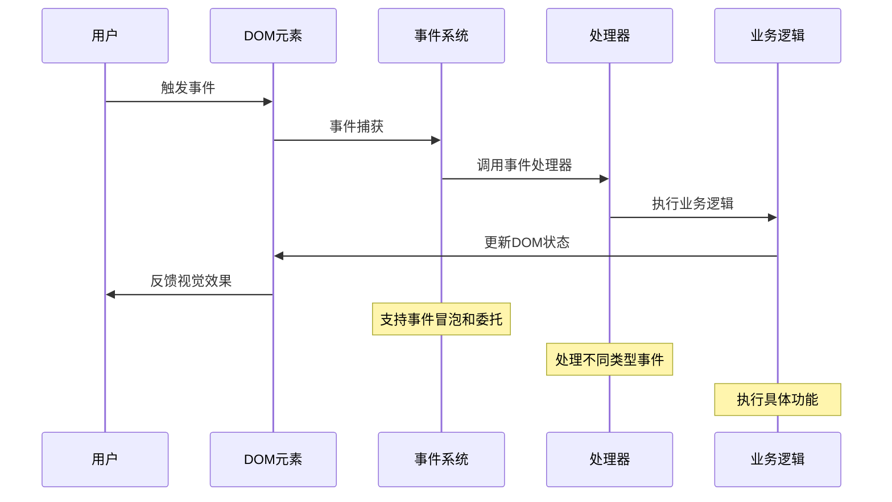

**图表来源**
- [script.js:466-538](file://js/script.js#L466-L538)
- [color-picker.js:95-175](file://js/color-picker.js#L95-L175)

## 详细组件分析

### 主事件处理器 (script.js)

#### 事件绑定策略

系统采用了混合的事件绑定策略：

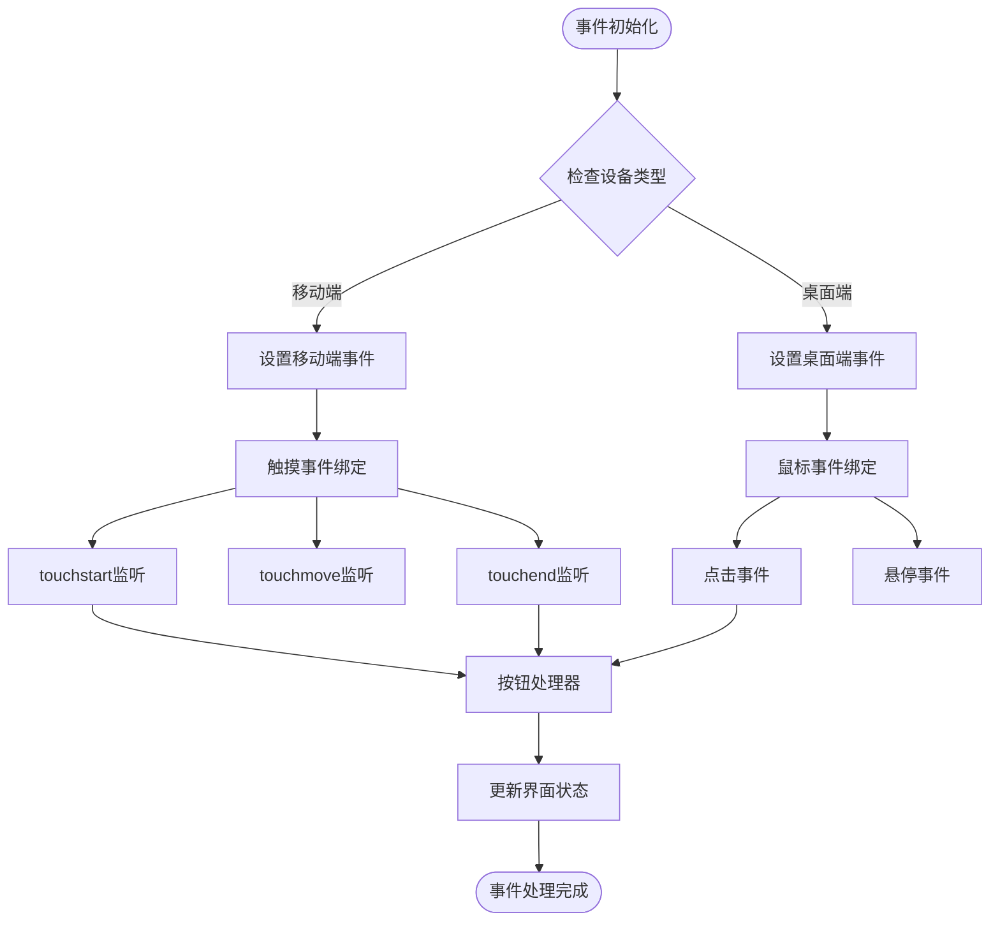

**图表来源**
- [script.js:466-538](file://js/script.js#L466-L538)

#### 按钮事件处理

系统为9个功能按钮提供了完整的事件处理：

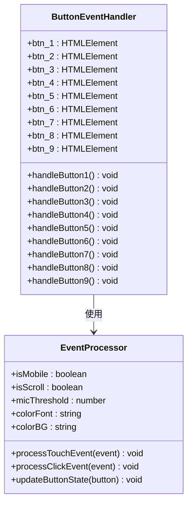

**图表来源**
- [script.js:112-120](file://js/script.js#L112-L120)
- [script.js:552-743](file://js/script.js#L552-L743)

**章节来源**
- [script.js:112-120](file://js/script.js#L112-L120)
- [script.js:552-743](file://js/script.js#L552-L743)

#### 音频控制事件

音频系统的事件处理具有特殊性：

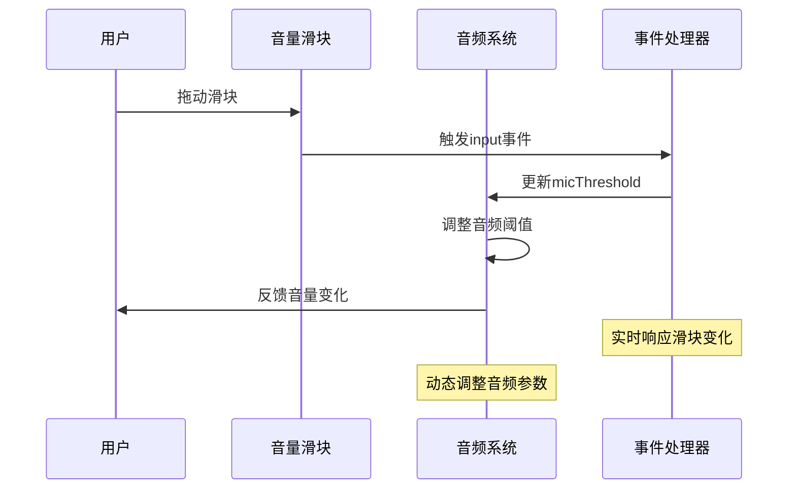

**图表来源**
- [script.js:1005-1012](file://js/script.js#L1005-L1012)

**章节来源**
- [script.js:1005-1012](file://js/script.js#L1005-L1012)

### 颜色选择器事件 (color-picker.js)

#### 委托事件模式

颜色选择器采用了典型的委托事件模式：

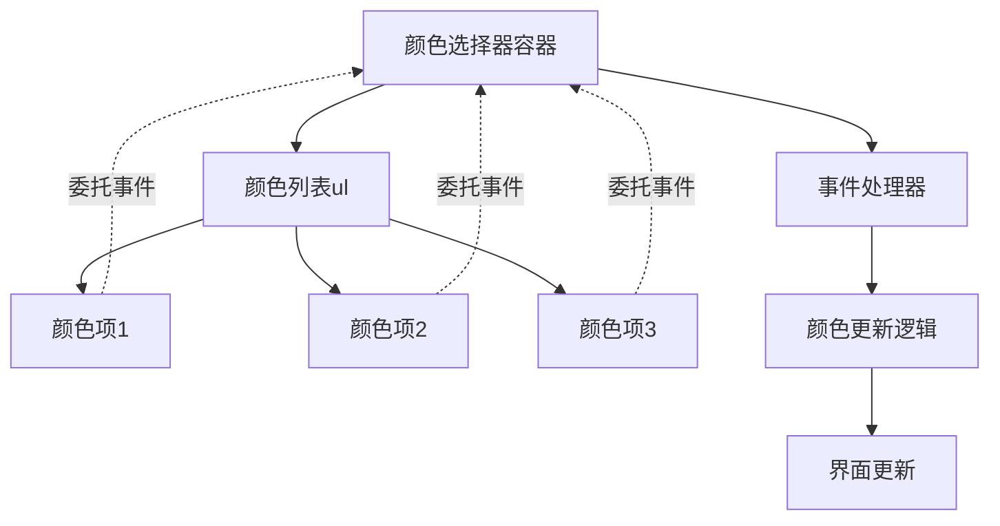

**图表来源**
- [color-picker.js:95-175](file://js/color-picker.js#L95-L175)

#### 事件处理流程

颜色选择器的事件处理流程：

1. **事件捕获**：通过jQuery的on方法实现事件委托
2. **目标识别**：确定被点击的颜色项
3. **状态更新**：更新当前选中的颜色
4. **界面反馈**：应用颜色变化到页面元素

**章节来源**
- [color-picker.js:95-175](file://js/color-picker.js#L95-L175)

### 原生事件处理

#### 窗口事件

系统对窗口大小变化进行了专门处理：

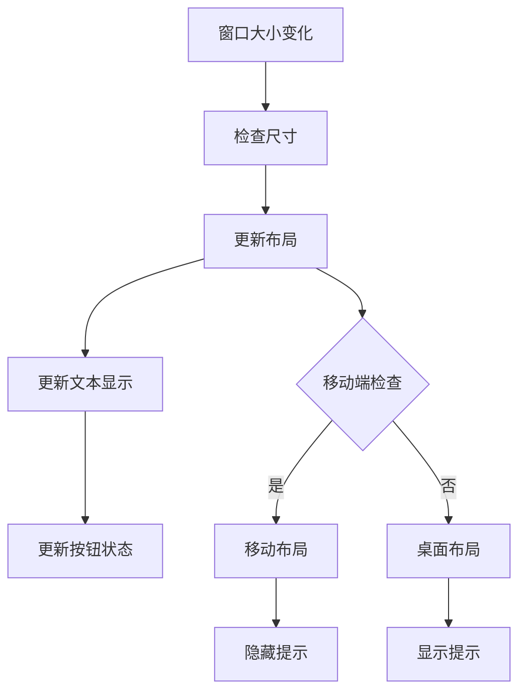

**图表来源**
- [script.js:838-921](file://js/script.js#L838-L921)

**章节来源**
- [script.js:838-921](file://js/script.js#L838-L921)

#### 输入事件处理

文本输入的事件处理：

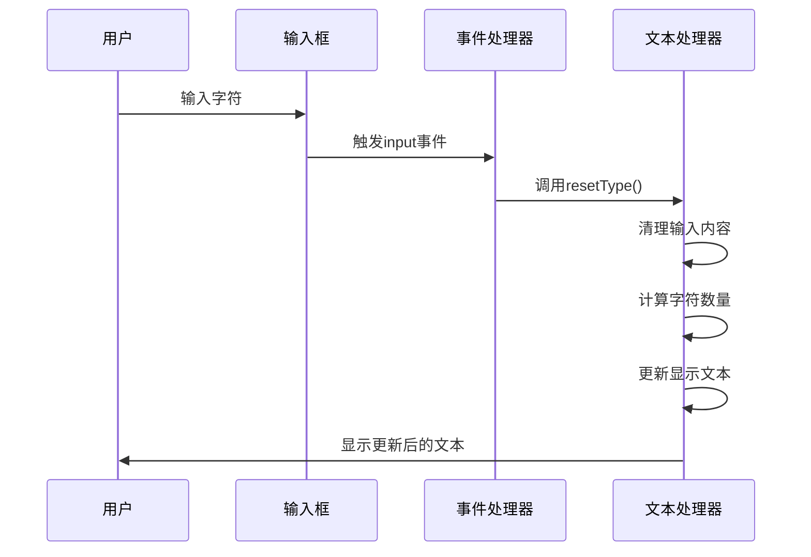

**图表来源**
- [script.js:244-281](file://js/script.js#L244-L281)

**章节来源**
- [script.js:244-281](file://js/script.js#L244-L281)

## 依赖关系分析

### 事件处理依赖图

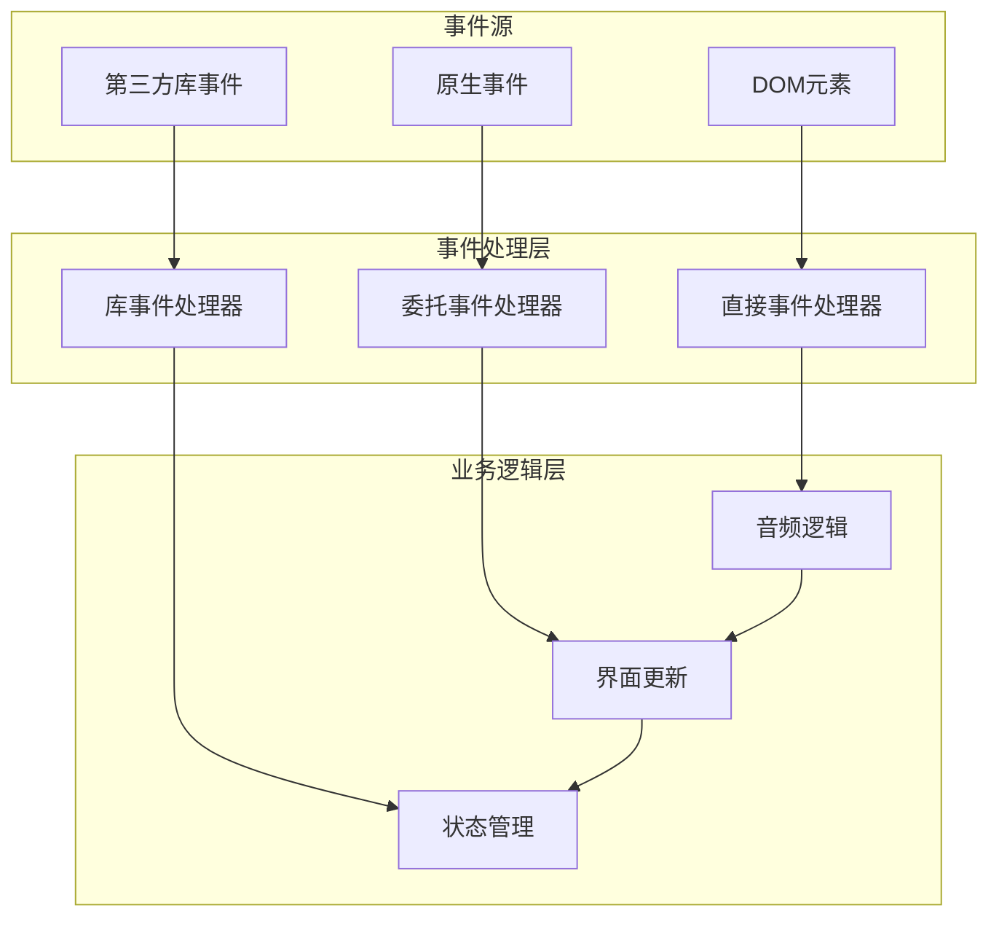

**图表来源**
- [script.js:1-100](file://js/script.js#L1-L100)
- [color-picker.js:1-50](file://js/color-picker.js#L1-L50)

### 第三方库集成

系统集成了多个第三方库来增强事件处理能力：

1. **jQuery**：提供事件委托和DOM操作功能
2. **Bootstrap**：提供UI组件的事件支持
3. **Popper.js**：提供定位计算的事件支持
4. **Splitting.js**：提供文本分割的事件支持

**章节来源**
- [bootstrap.min.js:1-7](file://js/bootstrap.min.js#L1-L7)
- [splitting.min.js:1-13](file://js/splitting.min.js#L1-L13)

## 性能考虑

### 事件处理优化策略

#### 内存管理

系统采用了有效的内存管理策略：

1. **事件处理器清理**：在适当时候移除不需要的事件监听器
2. **DOM引用管理**：避免循环引用导致的内存泄漏
3. **定时器清理**：及时清理定时器和动画帧

#### 性能优化技术

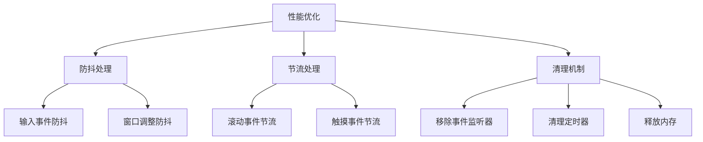

**图表来源**
- [script.js:1005-1020](file://js/script.js#L1005-L1020)

#### 浏览器兼容性

系统通过以下方式确保跨浏览器兼容性：

1. **事件标准化**：统一不同浏览器的事件对象
2. **polyfill支持**：提供必要的功能补丁
3. **降级策略**：在不支持某些功能时提供替代方案

**章节来源**
- [script.js:185-192](file://js/script.js#L185-L192)
- [bootstrap.min.js:1-7](file://js/bootstrap.min.js#L1-L7)

## 故障排除指南

### 常见事件问题

#### 事件未触发

可能的原因和解决方案：

1. **事件绑定时机问题**：确保在DOM加载完成后绑定事件
2. **作用域问题**：检查事件处理器的this指向
3. **事件冒泡阻止**：确认没有意外阻止事件传播

#### 性能问题

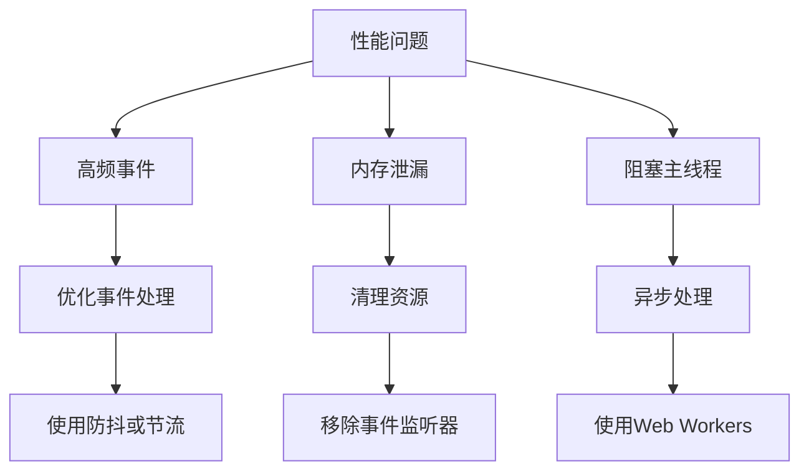

**图表来源**
- [script.js:1005-1020](file://js/script.js#L1005-L1020)

#### 兼容性问题

1. **触摸事件支持**：检查设备是否支持触摸事件
2. **事件对象差异**：处理不同浏览器的事件对象差异
3. **CSS选择器兼容**：确保选择器在所有浏览器中都能正常工作

**章节来源**
- [script.js:466-538](file://js/script.js#L466-L538)
- [color-picker.js:95-175](file://js/color-picker.js#L95-L175)

## 结论

本项目实现了完整的事件监听机制，通过多种事件处理模式满足了复杂交互需求。系统的主要特点包括：

1. **多层次事件处理**：结合直接绑定、委托模式和原生事件
2. **跨平台兼容**：同时支持桌面和移动设备
3. **性能优化**：采用防抖、节流等技术确保流畅体验
4. **内存管理**：有效防止内存泄漏和资源浪费

该事件系统为音频可视化应用提供了稳定可靠的交互基础，可以作为类似项目的参考实现。

## 附录

### 事件API使用示例

#### 基本事件绑定

```javascript
// 直接事件绑定
element.addEventListener('click', handler);

// 委托事件绑定
container.addEventListener('click', function(event) {
    if (event.target.matches('.button')) {
        handleButtonClick(event);
    }
});

// jQuery委托事件
$('.container').on('click', '.button', handler);
```

#### 高级事件处理

```javascript
// 防抖处理
function debounce(func, wait) {
    let timeout;
    return function executedFunction(...args) {
        const later = () => {
            clearTimeout(timeout);
            func(...args);
        };
        clearTimeout(timeout);
        timeout = setTimeout(later, wait);
    };
}

// 节流处理
function throttle(func, limit) {
    let inThrottle;
    return function() {
        const args = arguments;
        const context = this;
        if (!inThrottle) {
            func.apply(context, args);
            inThrottle = true;
            setTimeout(() => inThrottle = false, limit);
        }
    };
}
```

### 性能监控建议

1. **事件处理时间监控**：记录事件处理的执行时间
2. **内存使用监控**：定期检查内存使用情况
3. **FPS监控**：监控动画和渲染性能
4. **错误日志**：收集和分析事件相关的错误信息