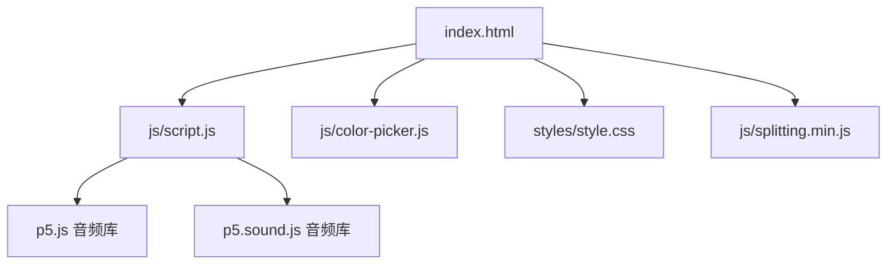
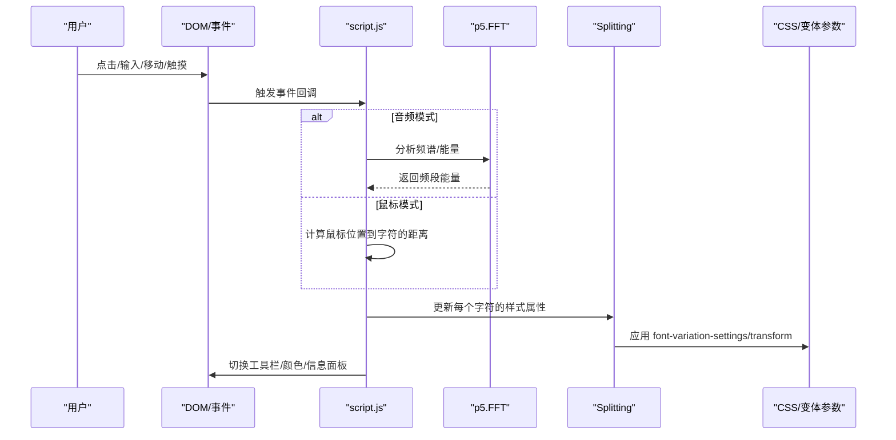
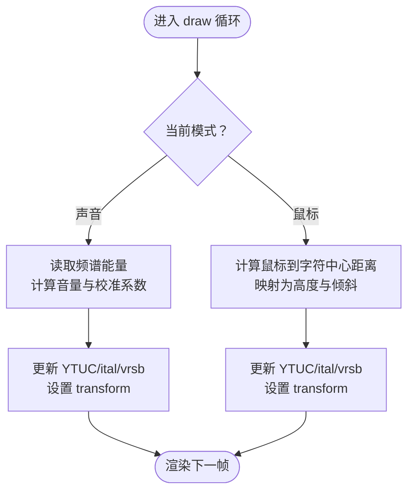
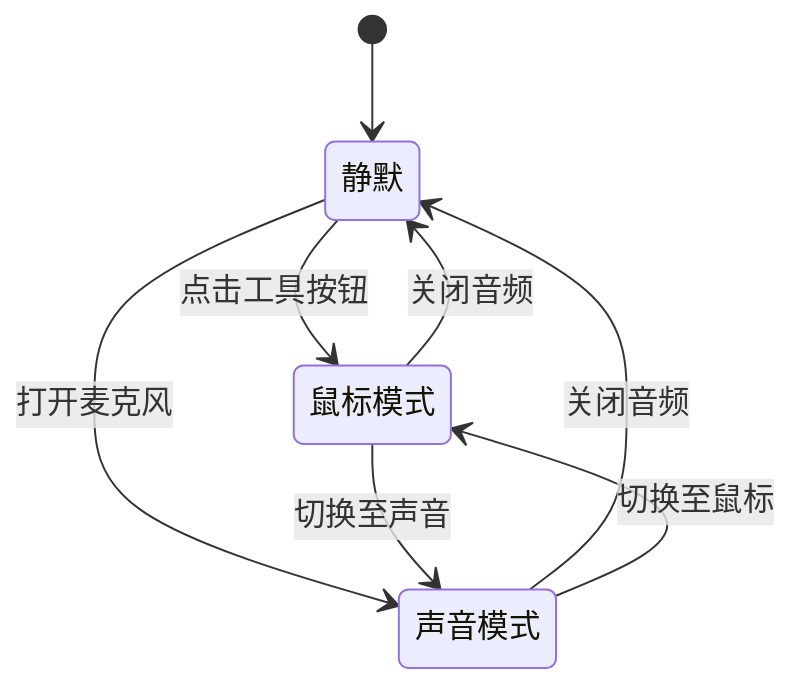
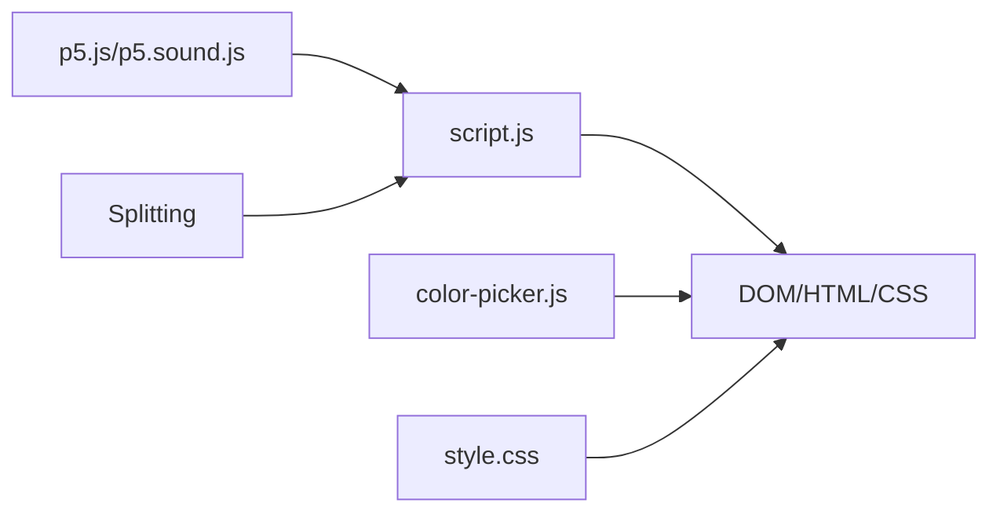

# 交互控制系统

<cite>
**本文引用的文件**
- [index.html](file://index.html)
- [script.js](file://js/script.js)
- [color-picker.js](file://js/color-picker.js)
- [style.css](file://styles/style.css)
- [splitting.min.js](file://js/splitting.min.js)
</cite>

## 目录
1. [简介](#简介)
2. [项目结构](#项目结构)
3. [核心组件](#核心组件)
4. [架构总览](#架构总览)
5. [详细组件分析](#详细组件分析)
6. [依赖关系分析](#依赖关系分析)
7. [性能考量](#性能考量)
8. [故障排查指南](#故障排查指南)
9. [结论](#结论)
10. [附录：交互API与使用示例](#附录交互api与使用示例)

## 简介
本项目是一个基于浏览器的“交互控制系统”，通过麦克风输入、鼠标/触摸交互以及颜色选择等工具，对可变字体进行实时驱动，实现“打字即发声”的动态排版体验。系统采用事件驱动架构，结合音频分析、DOM 动态拆分与 CSS 变体参数（font-variation-settings）实现字符高度、倾斜、形变与缩放的实时响应，并提供移动端与桌面端的差异化适配与可视化反馈。

## 项目结构
- 前端入口与资源组织：
  - HTML 页面负责布局与初始加载，引入样式与脚本。
  - 样式文件定义动画、交互态与响应式布局。
  - 脚本文件承载交互逻辑、事件处理、音频分析与字符变形控制。
  - 字体拆分库用于将文本逐字符拆分以便独立控制。

图表来源
- [index.html](file://index.html)
- [script.js](file://js/script.js)
- [color-picker.js](file://js/color-picker.js)
- [style.css](file://styles/style.css)
- [splitting.min.js](file://js/splitting.min.js)

章节来源
- [index.html](file://index.html)
- [style.css](file://styles/style.css)

## 核心组件
- 音频输入与分析
  - 使用 p5.AudioIn 获取麦克风输入，p5.FFT 分析频谱，基于能量带宽计算字符形变参数。
- 文本拆分与渲染
  - 使用 Splitting 将显示文本逐字符拆分为独立节点，配合 CSS 变体参数实现高度、倾斜、形变与缩放。
- 交互控制
  - 桌面端：鼠标移动检测、位置坐标映射、滑条灵敏度调节。
  - 移动端：触摸事件处理、滚动抑制、按钮点击切换。
- 工具面板与颜色系统
  - 颜色选择器、工具栏切换、信息面板显隐、随机配色。
- 视觉反馈
  - 光标闪烁、工具提示、渐隐渐显动画、菜单遮罩层。

章节来源
- [script.js](file://js/script.js)
- [color-picker.js](file://js/color-picker.js)
- [style.css](file://styles/style.css)

## 架构总览
系统采用“事件驱动 + 实时渲染”的架构：
- 初始化阶段：页面加载后执行预处理与尺寸检测，准备 Splitting、p5 音频上下文与 DOM 结构。
- 运行阶段：draw 循环中根据当前模式（声音/鼠标）更新字符的 font-variation-settings 与 transform，同时维护工具栏与颜色状态。
- 事件阶段：按钮点击、输入框交互、窗口尺寸变化、触摸/鼠标事件驱动状态切换与视觉反馈。

图表来源
- [script.js](file://js/script.js)
- [style.css](file://styles/style.css)

## 详细组件分析

### 鼠标事件处理与字符变形触发
- 鼠标移动检测与位置坐标计算
  - 在非移动端场景下，通过 draw 循环中的 sliderHover 逻辑判断鼠标是否悬停在麦克风滑条区域，以控制滑条容器的显隐与透明度。
  - 在鼠标模式下，按字符数量将画布横向分段，计算鼠标 X 坐标在该段内的相对位置，再通过距离映射得到字符高度（YTUC）与倾斜（ital）参数。
- 字符变形触发逻辑
  - draw 循环遍历每个字符，根据当前模式设置其 font-variation-settings 与 transform，实现高度、倾斜、斜切与整体缩放的平滑过渡。
  - 当处于声音模式且未就绪时，通过频谱能量带宽计算每个字符的高度，再叠加倾斜与斜切效果，形成“响亮”时的夸张形变。

图表来源
- [script.js](file://js/script.js)

章节来源
- [script.js](file://js/script.js)

### 触摸手势识别与多点触控支持
- 触摸事件处理
  - 移动端为每个工具按钮绑定 touchstart/touchmove/touchend 事件，通过 isScroll 标志区分点击与滚动，仅在非滚动时触发对应功能。
- 多点触控与滚动抑制
  - 通过 touch-action 属性限制主轴滚动，避免误触导致的页面滚动干扰。
- 移动设备适配
  - 针对小屏设备调整工具栏布局、颜色选择器宽度与输入框尺寸；在横屏/竖屏下分别优化提示与按钮位置。

章节来源
- [index.html](file://index.html)
- [style.css](file://styles/style.css)
- [script.js](file://js/script.js)

### 键盘快捷键系统与无障碍支持
- 键盘监听与组合键处理
  - 代码中未发现显式的键盘快捷键绑定逻辑。当前交互主要依赖鼠标/触摸与按钮点击。
- 无障碍访问支持
  - 页面具备基础的语义化结构与可聚焦元素，但未见专门的键盘导航与屏幕阅读器增强（如 ARIA 属性或键盘事件监听）。建议后续补充焦点管理与键盘操作路径。

章节来源
- [index.html](file://index.html)
- [script.js](file://js/script.js)

### 事件监听机制与架构设计
- 事件委托与性能优化
  - 采用直接事件绑定（如按钮 onclick/onmousedown、输入框 input 事件），未见显式的事件委托实现。在当前规模下仍可满足性能需求。
  - draw 循环内进行高频 DOM 查询与样式更新，建议在后续版本中减少重复查询、合并样式写入、使用 requestAnimationFrame 优化。
- 内存管理策略
  - 通过局部变量与循环内数组重置（如 smoothH、smoothSpectrum）降低内存占用。
  - 对异常进行 try/catch 包裹，避免单个字符处理失败影响整体渲染。

章节来源
- [script.js](file://js/script.js)

### 交互模式切换机制
- 声音控制模式
  - 启动音频后，使用 FFT 分析频谱，按字符数量与空格数映射到不同频段，计算每个字符的能量并转换为高度、倾斜与斜切。
- 鼠标控制模式
  - 关闭音频后，通过鼠标位置与字符中心距离映射为高度与倾斜，实现“指哪打哪”的字符形变。
- 混合控制
  - 通过工具栏按钮在声音/鼠标模式间切换，同时联动工具栏显隐、颜色选择器与信息面板。

图表来源
- [script.js](file://js/script.js)

章节来源
- [script.js](file://js/script.js)

### 用户反馈系统
- 视觉指示器
  - 输入框光标闪烁（blinking 动画）提示可编辑状态。
  - 工具栏按钮高亮（cur 类）与背景/文字颜色反转表示当前选中项。
  - 工具提示（tooltips）随窗口尺寸变化显隐。
- 状态提示
  - 信息面板（toggleInfo）在桌面端与移动端呈现不同的透明度与可见性。
  - 随机配色（randomColor）与颜色选择器即时更新全局样式。
- 错误处理机制
  - 对字符样式设置与音频分析过程进行异常捕获，避免崩溃并记录错误日志。

章节来源
- [style.css](file://styles/style.css)
- [script.js](file://js/script.js)

## 依赖关系分析
- 外部库
  - p5.js 与 p5.sound.js：提供音频采集与频域分析能力。
  - Splitting：将文本拆分为字符级节点，便于逐字符控制。
- 内部模块
  - script.js：核心交互逻辑、事件处理、渲染循环。
  - color-picker.js：颜色选择器 UI 与状态同步。
  - style.css：动画、响应式布局与视觉样式。

图表来源
- [script.js](file://js/script.js)
- [color-picker.js](file://js/color-picker.js)
- [style.css](file://styles/style.css)

章节来源
- [script.js](file://js/script.js)
- [color-picker.js](file://js/color-picker.js)
- [style.css](file://styles/style.css)

## 性能考量
- 事件节流与防抖
  - 当前未实现显式的节流/防抖。建议对高频事件（如鼠标移动、触摸移动、窗口 resize）增加节流/防抖，减少 draw 循环压力。
- GPU 加速应用
  - 通过 transform 与 font-variation-settings 的组合实现硬件加速的形变与缩放，已在样式中体现。
- 渲染优化
  - 减少不必要的 DOM 查询与样式写入，合并更新批次；对长文本字符列表进行缓存与复用。
- 音频处理
  - FFT 分析与能量映射在 draw 中执行，建议在音频阈值与采样率上做进一步调优，避免过度 CPU 占用。

章节来源
- [script.js](file://js/script.js)
- [style.css](file://styles/style.css)

## 故障排查指南
- 麦克风权限问题
  - 若无法启动音频，请检查浏览器权限与 HTTPS 环境；确保用户手势触发后才初始化音频上下文。
- 字符不响应
  - 检查 Splitting 是否正确拆分文本；确认 CSS 变体参数是否被覆盖；查看控制台是否有异常日志。
- 触摸误触
  - 调整 isScroll 标志逻辑，确保滚动时不触发按钮动作；检查 touch-action 设置。
- 颜色选择器无效
  - 确认颜色选择器的 active/disabled 状态与 CSS 样式同步；检查颜色值转换函数是否正常。

章节来源
- [script.js](file://js/script.js)
- [color-picker.js](file://js/color-picker.js)

## 结论
本交互控制系统通过简洁的事件驱动与高效的渲染管线，实现了从声音到视觉的直观映射。系统在桌面与移动端均提供了良好的可用性，并通过颜色与工具面板增强了个性化与可探索性。未来可在键盘快捷键、事件节流、渲染批处理与无障碍支持方面进一步完善，以提升整体体验与可维护性。

## 附录：交互API与使用示例

- 音频相关
  - 启动音频：调用启动函数以初始化麦克风与 FFT。
  - 关闭音频：停止音频并重置形变参数。
  - 调整灵敏度：通过滑条 oninput 事件更新阈值。
- 文本与拆分
  - 输入框输入：触发重置流程，重新拆分文本并更新字符样式。
  - 点击输入框：激活光标闪烁，准备输入。
- 工具栏与颜色
  - 切换工具栏：旋转按钮切换工具栏显隐与布局。
  - 颜色选择：点击颜色块或自定义颜色，即时更新全局样式。
  - 随机配色：一键生成新的颜色组合。
- 交互模式
  - 声音模式：开启麦克风，根据频谱能量驱动字符形变。
  - 鼠标模式：关闭音频，通过鼠标位置驱动字符形变。
  - 混合模式：在两种模式间切换，结合工具栏与滑条进行精细控制。

章节来源
- [script.js](file://js/script.js)
- [color-picker.js](file://js/color-picker.js)
- [style.css](file://styles/style.css)