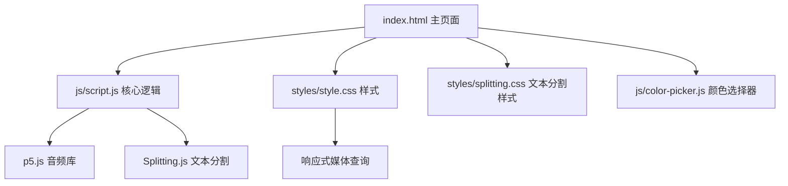
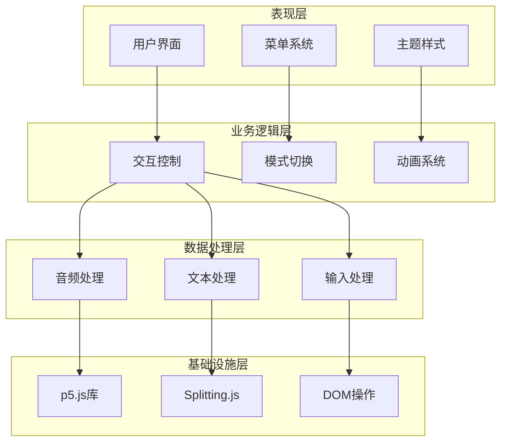
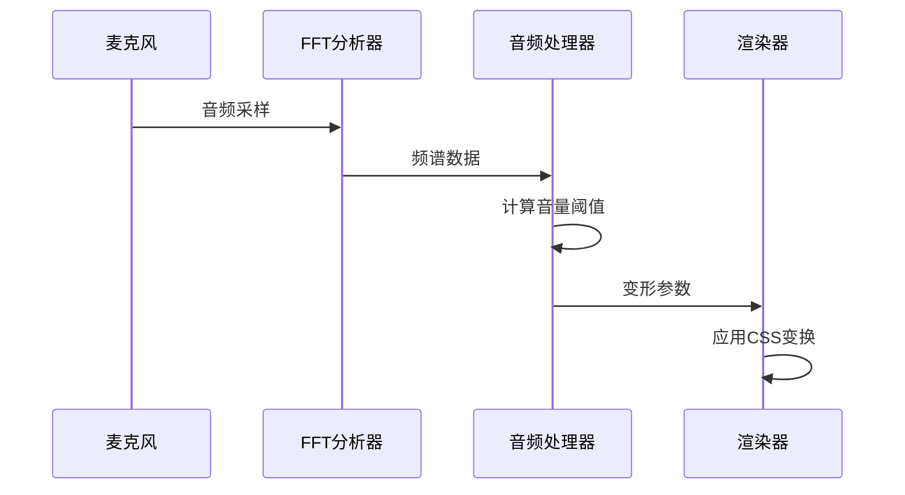
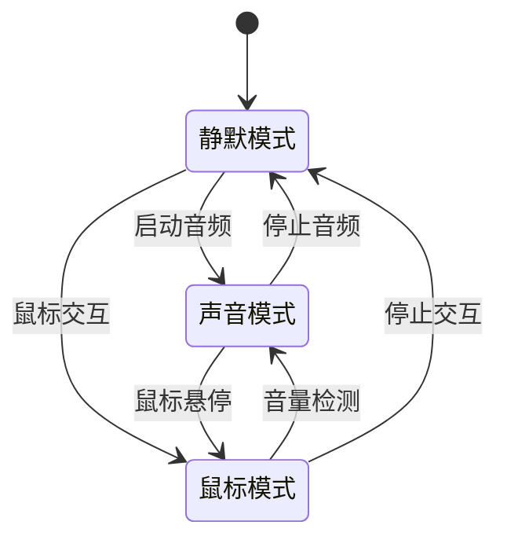
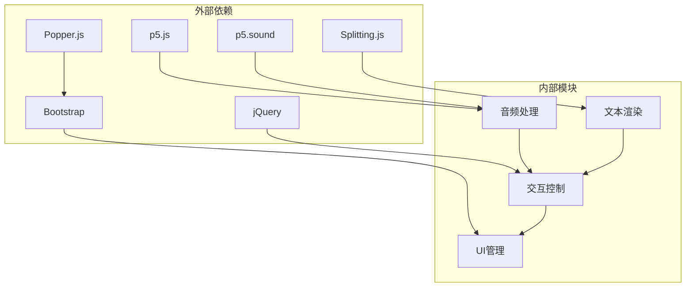

# 交互模式切换

<cite>
**本文档引用的文件**
- [index.html](file://index.html)
- [script.js](file://js/script.js)
- [style.css](file://styles/style.css)
- [splitting.css](file://styles/splitting.css)
- [color-picker.js](file://js/color-picker.js)
</cite>

## 目录
1. [简介](#简介)
2. [项目结构](#项目结构)
3. [核心组件](#核心组件)
4. [架构总览](#架构总览)
5. [详细组件分析](#详细组件分析)
6. [依赖关系分析](#依赖关系分析)
7. [性能考量](#性能考量)
8. [故障排除指南](#故障排除指南)
9. [结论](#结论)
10. [附录](#附录)

## 简介
本项目是一个基于浏览器的交互式字体演奏器，支持三种交互模式：
- 声音控制模式：通过麦克风输入驱动文字变形与动画
- 鼠标控制模式：通过鼠标位置驱动文字变形与动画  
- 混合控制模式：结合声音与鼠标输入进行动态控制

系统采用p5.js音频库与p5.sound进行音频处理，Splitting.js进行文本分割，配合CSS动画与JavaScript状态管理实现流畅的交互体验。

## 项目结构
项目采用前端单页应用架构，主要文件组织如下：
- HTML页面负责UI布局与交互入口
- JavaScript负责音频处理、交互逻辑与状态管理
- CSS负责样式与响应式布局
- 颜色选择器提供主题定制功能



**图表来源**
- [index.html:1-282](file://index.html#L1-L282)
- [script.js:1-1049](file://js/script.js#L1-L1049)
- [style.css:1-1573](file://styles/style.css#L1-L1573)
- [splitting.css:1-67](file://styles/splitting.css#L1-L67)

**章节来源**
- [index.html:1-282](file://index.html#L1-L282)
- [script.js:1-100](file://js/script.js#L1-L100)

## 核心组件
系统的核心组件包括：

### 音频处理模块
- 麦克风输入管理：初始化p5.AudioIn，启动音频流
- FFT频谱分析：使用p5.FFT进行频域分析
- 音量阈值控制：动态调整音频触发阈值
- 实时平滑处理：对音频数据进行指数平滑滤波

### 交互控制模块
- 鼠标位置跟踪：实时获取鼠标坐标与移动距离
- 文本分割渲染：使用Splitting.js将文本拆分为字符级元素
- 字体变形控制：通过font-variation-settings控制字形变化
- 动画过渡效果：使用CSS3动画实现平滑过渡

### 用户界面模块
- 菜单系统：九宫格控制面板，支持多种功能切换
- 颜色主题：内置多套配色方案，支持自定义颜色
- 响应式布局：适配桌面端与移动端不同屏幕尺寸
- 模态对话框：教程引导与加载动画

**章节来源**
- [script.js:1-120](file://js/script.js#L1-L120)
- [script.js:300-426](file://js/script.js#L300-L426)
- [style.css:64-160](file://styles/style.css#L64-L160)

## 架构总览
系统采用分层架构设计，各层职责清晰分离：



**图表来源**
- [script.js:1-1049](file://js/script.js#L1-L1049)
- [index.html:1-282](file://index.html#L1-L282)

## 详细组件分析

### 声音控制模式实现

声音控制模式是系统的核心交互方式，通过以下机制实现：

#### 音频输入检测
系统使用p5.AudioIn进行音频输入，初始化过程包括：
- 创建AudioIn实例并启动
- 初始化FFT频谱分析器
- 设置音频上下文为挂起状态（等待用户交互）

#### 阈值调节机制
音频阈值通过滑块进行动态调节，范围映射：
- 移动端：2.2 ± 2.5
- 桌面端：1.25 ± 1.5

阈值影响音频触发灵敏度，数值越大越难触发。

#### 实时响应机制
音频数据处理流程：
1. 获取频谱数据并通过FFT分析
2. 对每个字符计算能量值
3. 应用指数平滑滤波减少抖动
4. 根据音量大小控制字符变形程度



**图表来源**
- [script.js:316-387](file://js/script.js#L316-L387)
- [script.js:1006-1012](file://js/script.js#L1006-L1012)

**章节来源**
- [script.js:178-201](file://js/script.js#L178-L201)
- [script.js:316-387](file://js/script.js#L316-L387)
- [script.js:1006-1012](file://js/script.js#L1006-L1012)

### 鼠标控制模式切换逻辑

鼠标控制模式通过以下机制实现无缝切换：

#### 模式状态管理
系统维护多个状态变量：
- `isMic`：当前是否处于声音模式
- `isReady`：输入准备状态
- `isTool`：工具栏显示状态
- `infoMode`：信息显示状态

#### 参数重置机制
切换到鼠标模式时的重置操作：
- 停止音频流并释放资源
- 重置平滑参数数组
- 清除音频相关变量
- 更新UI状态指示

#### 平滑过渡效果
模式切换采用CSS3动画实现：
- 工具栏展开/收起动画
- 透明度渐变效果
- 位置变换动画
- 颜色主题过渡



**图表来源**
- [script.js:571-594](file://js/script.js#L571-L594)
- [script.js:772-836](file://js/script.js#L772-L836)

**章节来源**
- [script.js:571-594](file://js/script.js#L571-L594)
- [script.js:772-836](file://js/script.js#L772-L836)

### 混合控制模式集成

混合控制模式结合声音与鼠标输入的优势：

#### 模式优先级策略
系统采用动态优先级机制：
- 当检测到音频输入时优先使用声音模式
- 当音频静默且鼠标移动时切换到鼠标模式
- 音量阈值作为切换判断条件

#### 权重分配算法
字符变形的综合计算：
- 声音权重：随音量大小动态调整
- 鼠标权重：随距离中心位置变化
- 平滑系数：防止突变造成视觉冲击

#### 动态切换策略
切换条件判断：
- 音量超过阈值且持续时间达到要求
- 鼠标移动速度超过阈值
- 模式切换需要一定的稳定期避免频繁切换

**章节来源**
- [script.js:388-416](file://js/script.js#L388-L416)
- [script.js:316-387](file://js/script.js#L316-L387)

### 交互模式的状态持久化

系统提供有限的状态保持能力：

#### 本地存储机制
- 颜色主题：通过全局变量保存当前配色
- 工具栏状态：记录工具栏展开/收起状态
- 文本输入状态：保存当前输入内容

#### 会话管理
- 页面加载时检查用户交互状态
- 自动恢复部分UI状态
- 音频权限需要用户主动授权

#### 用户偏好保存
- 颜色选择器支持自定义颜色
- 主题切换即时生效
- 配色方案在页面刷新后保持

**章节来源**
- [script.js:931-960](file://js/script.js#L931-L960)
- [color-picker.js:1-231](file://js/color-picker.js#L1-L231)

### 模式切换API使用示例

以下是完整的模式切换API使用指南：

#### 基础模式切换
```javascript
// 切换到声音模式
function startAudio() {
    userStartAudio();
    mic.start();
    fft = new p5.FFT(0.9, 1024);
    fft.setInput(mic);
    isMic = true;
}

// 切换到鼠标模式
function stopAudio() {
    mic.stop();
    isMic = false;
}
```

#### 高级控制接口
```javascript
// 音量阈值调节
micSlider.oninput = function() {
    if (isMobile) {
        micThreshold = map(this.value, 0, 100, 2.2 + 1.5, 2.2 - 2.5);
    } else {
        micThreshold = map(this.value, 0, 100, 1.8 + 1.5, 1.8 - 1.5);
    }
}

// 工具栏切换
function toggleToolbar() {
    if (isTool) {
        // 收起工具栏
        toggle[0].style.transform = 'rotate(45deg)';
        // 隐藏按钮与滑块
    } else {
        // 展开工具栏
        toggle[0].style.transform = 'rotate(0deg)';
    }
    isTool = !isTool;
}
```

#### 最佳实践指南
1. **音频权限管理**：始终在用户交互事件中启动音频
2. **性能优化**：合理设置帧率与平滑参数
3. **内存管理**：及时释放音频资源
4. **错误处理**：捕获并处理音频异常
5. **用户体验**：提供清晰的视觉反馈

**章节来源**
- [script.js:923-929](file://js/script.js#L923-L929)
- [script.js:1006-1012](file://js/script.js#L1006-L1012)
- [script.js:772-836](file://js/script.js#L772-L836)

## 依赖关系分析

系统依赖关系呈现清晰的层次结构：



**图表来源**
- [index.html:15-261](file://index.html#L15-L261)
- [script.js:1-100](file://js/script.js#L1-L100)

**章节来源**
- [index.html:15-261](file://index.html#L15-L261)
- [script.js:1-100](file://js/script.js#L1-L100)

## 性能考量

系统在性能方面采取了多项优化措施：

### 音频处理优化
- 使用指数平滑滤波减少计算开销
- 合理设置FFT窗口大小平衡精度与性能
- 音频数据缓存避免重复计算

### 渲染性能优化
- CSS3硬件加速字体变形
- requestAnimationFrame优化动画帧率
- 字符级DOM操作最小化

### 内存管理
- 及时释放音频资源
- 避免内存泄漏的闭包引用
- 图片与字体资源按需加载

## 故障排除指南

### 常见问题与解决方案

#### 音频无法启动
- 检查浏览器权限设置
- 确认用户手势触发音频初始化
- 验证设备麦克风可用性

#### 模式切换异常
- 确保DOM元素正确加载
- 检查CSS类名冲突
- 验证事件监听器绑定

#### 性能问题
- 降低帧率设置
- 减少同时渲染的字符数量
- 关闭不必要的动画效果

**章节来源**
- [script.js:156-160](file://js/script.js#L156-L160)
- [script.js:384-387](file://js/script.js#L384-L387)

## 结论

交互模式切换系统通过精心设计的架构实现了三种交互模式的无缝切换。系统的主要优势包括：

1. **模块化设计**：清晰的分层架构便于维护与扩展
2. **性能优化**：合理的资源管理与渲染优化确保流畅体验
3. **用户体验**：直观的视觉反馈与平滑的过渡动画
4. **可扩展性**：良好的API设计支持未来功能扩展

系统在声音控制、鼠标控制与混合控制之间提供了自然的切换体验，为用户创造了一个富有创意的字体演奏平台。

## 附录

### 技术规格
- 支持浏览器：Chrome、Firefox、Safari、Edge
- 设备要求：支持Web Audio API与CSS3动画
- 性能要求：现代处理器以上配置

### 开发建议
- 定期更新p5.js版本以获得最新特性
- 优化音频处理算法以适应更多设备
- 扩展交互模式支持触摸手势
- 增强错误处理与用户提示