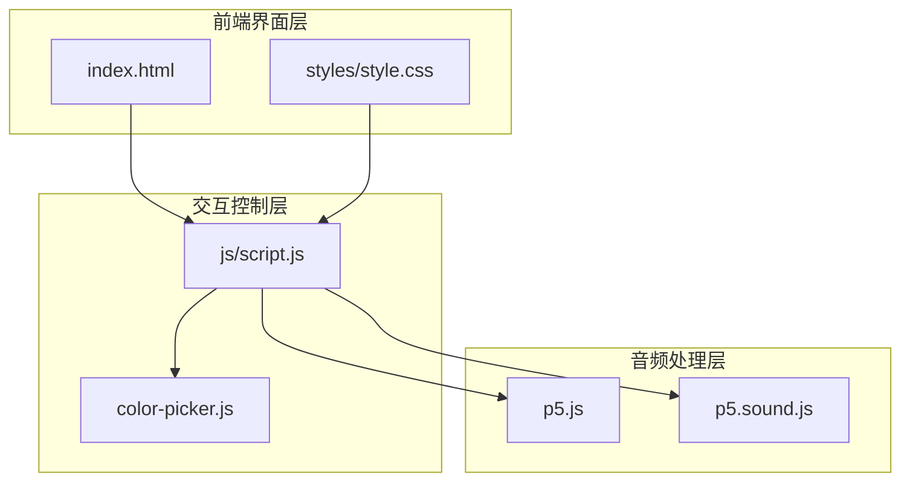
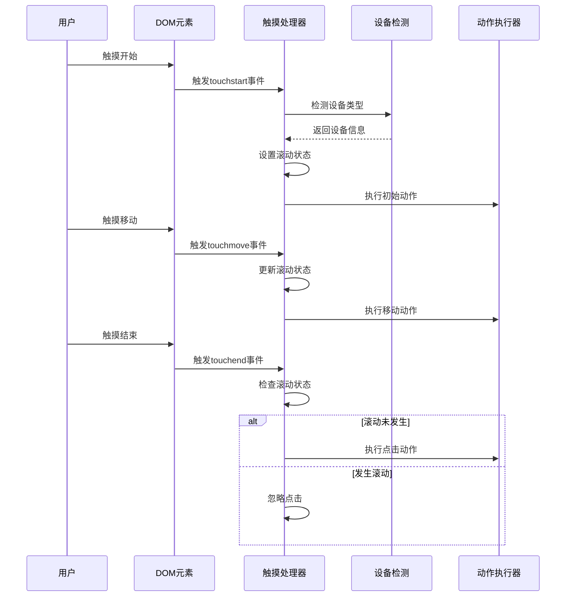
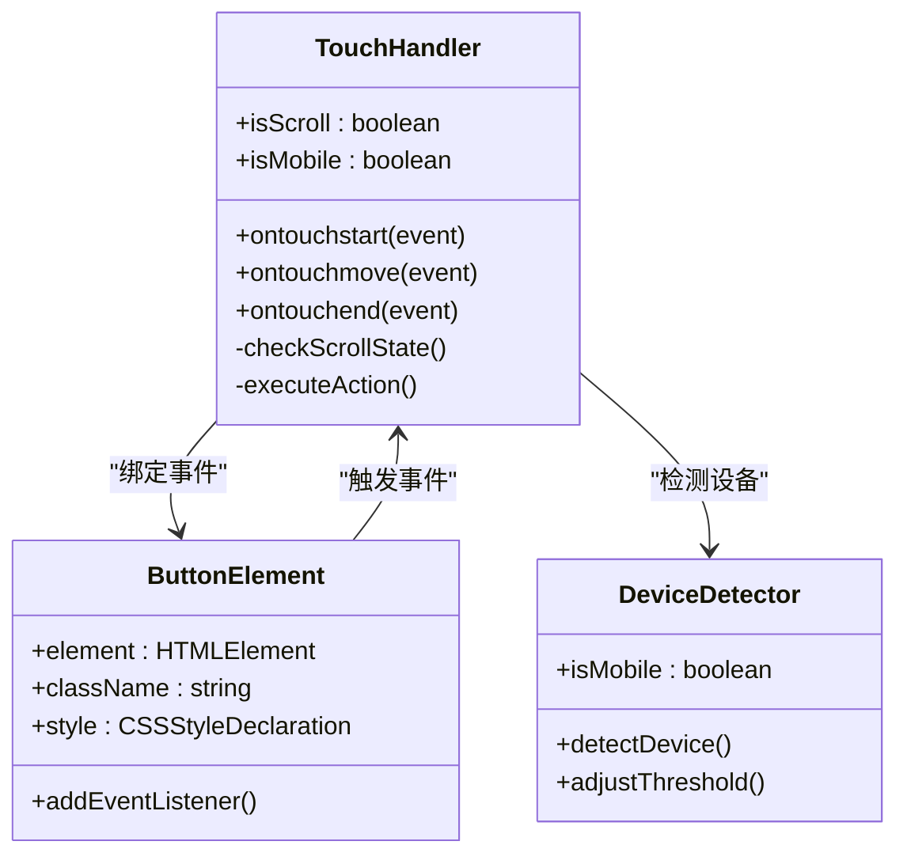
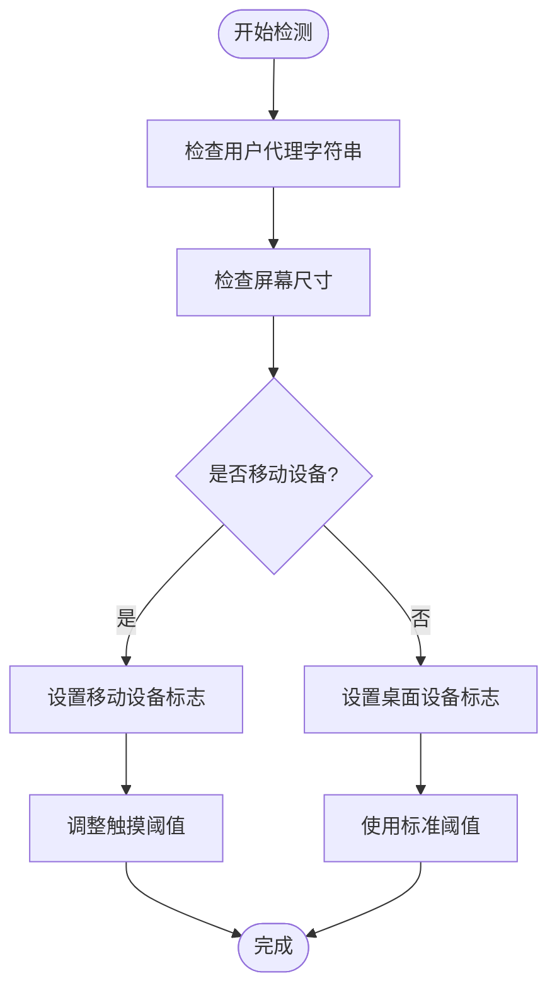
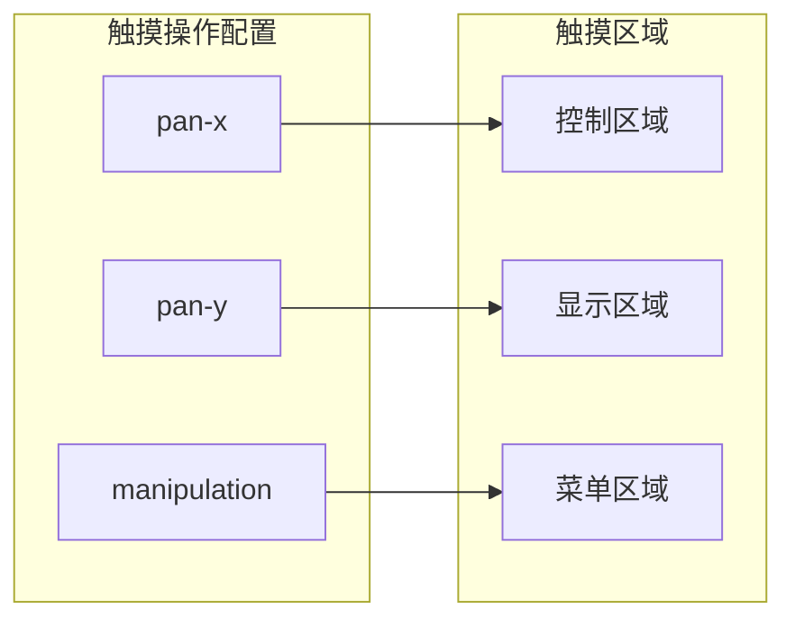
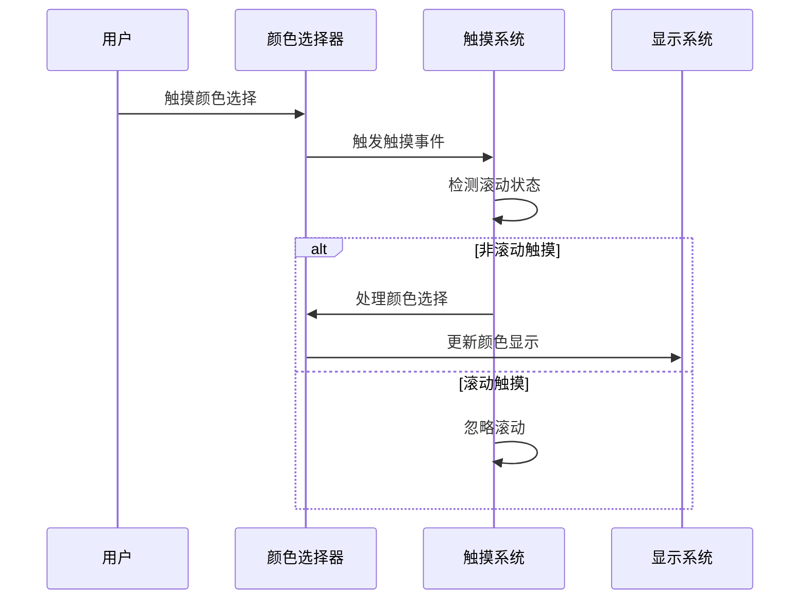
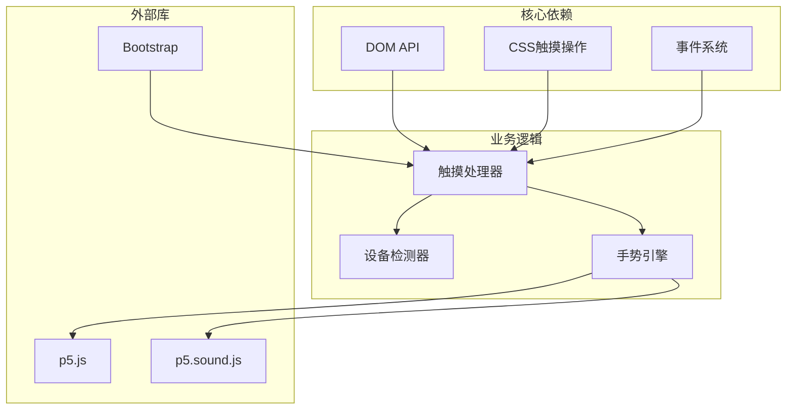

# 触摸手势识别

<cite>
**本文档引用的文件**
- [index.html](file://index.html)
- [script.js](file://js/script.js)
- [color-picker.js](file://js/color-picker.js)
- [style.css](file://styles/style.css)
</cite>

## 目录
1. [简介](#简介)
2. [项目结构](#项目结构)
3. [核心组件](#核心组件)
4. [架构概览](#架构概览)
5. [详细组件分析](#详细组件分析)
6. [依赖关系分析](#依赖关系分析)
7. [性能考虑](#性能考虑)
8. [故障排除指南](#故障排除指南)
9. [结论](#结论)
10. [附录](#附录)

## 简介

本项目是一个基于Web的触摸手势识别系统，实现了完整的触摸事件处理机制，包括单点和多点触控支持。该系统通过JavaScript事件监听器处理触摸开始、移动和结束事件，结合CSS触摸操作属性，为用户提供流畅的触摸交互体验。

项目采用响应式设计，针对不同设备类型（桌面端、移动端）提供差异化的触摸处理策略。通过预设阈值和动态调整机制，系统能够有效区分触摸手势与滚动操作，避免误触发。

## 项目结构

项目采用模块化架构，主要由以下核心部分组成：



**图表来源**
- [index.html:1-282](file://index.html#L1-L282)
- [script.js:1-1049](file://js/script.js#L1-L1049)

**章节来源**
- [index.html:1-282](file://index.html#L1-L282)
- [script.js:1-100](file://js/script.js#L1-L100)

## 核心组件

### 触摸事件处理器

系统实现了完整的触摸事件监听机制，包括：

- **触摸开始事件**：用于初始化触摸状态和检测滚动行为
- **触摸移动事件**：用于跟踪触摸位置变化和执行相应操作
- **触摸结束事件**：用于清理状态和执行最终操作

### 设备适配系统

系统具备智能设备检测能力，能够自动识别移动设备并应用相应的触摸处理策略：

- **移动设备检测**：基于用户代理字符串和屏幕尺寸
- **阈值自适应**：根据设备类型调整触摸敏感度
- **事件绑定差异化**：为不同设备类型绑定相应的事件处理器

### 触摸区域管理

系统通过CSS触摸操作属性精确控制触摸行为：

- **触摸区域划分**：定义可触摸区域和禁用区域
- **滚动行为控制**：防止触摸滚动干扰手势识别
- **多点触控支持**：为未来扩展多点触控功能预留接口

**章节来源**
- [script.js:437-464](file://js/script.js#L437-L464)
- [script.js:466-522](file://js/script.js#L466-L522)
- [style.css:141-148](file://styles/style.css#L141-L148)

## 架构概览

系统采用分层架构设计，确保触摸手势识别的可靠性和可扩展性：



**图表来源**
- [script.js:469-522](file://js/script.js#L469-L522)
- [script.js:153-154](file://js/script.js#L153-L154)

## 详细组件分析

### 触摸事件监听器

系统在按钮元素上绑定了触摸事件处理器，实现了完整的触摸手势识别：



**图表来源**
- [script.js:466-522](file://js/script.js#L466-L522)
- [script.js:437-464](file://js/script.js#L437-L464)

#### 触摸事件处理流程

系统采用状态机模式处理触摸事件：

1. **事件捕获阶段**：阻止默认浏览器行为
2. **状态初始化**：设置滚动检测标志
3. **事件处理阶段**：根据事件类型执行相应操作
4. **状态清理阶段**：重置滚动检测标志

**章节来源**
- [script.js:469-522](file://js/script.js#L469-L522)
- [script.js:153-154](file://js/script.js#L153-L154)

### 设备检测与适配

系统实现了智能的设备检测机制：



**图表来源**
- [script.js:437-464](file://js/script.js#L437-L464)

#### 移动设备特化处理

针对移动设备，系统实施了专门的优化策略：

- **阈值调整**：移动设备使用更高的触摸阈值（2.2）
- **事件绑定**：使用ontouchstart/ontouchmove/ontouchend事件
- **滚动检测**：通过isScroll变量区分滚动和点击操作
- **页面隐藏处理**：监听pagehide事件进行资源清理

**章节来源**
- [script.js:466-468](file://js/script.js#L466-L468)
- [script.js:469-522](file://js/script.js#L469-L522)

### 触摸区域与行为控制

系统通过CSS触摸操作属性精确控制触摸行为：



**图表来源**
- [style.css:141-148](file://styles/style.css#L141-L148)

#### 触摸区域划分策略

系统将界面划分为不同的触摸区域：

- **控制区域**：允许水平滚动的触摸区域
- **显示区域**：用于文本显示和交互的区域
- **菜单区域**：包含工具按钮的交互区域

**章节来源**
- [style.css:141-148](file://styles/style.css#L141-L148)
- [index.html:42-51](file://index.html#L42-L51)

### 颜色选择器集成

颜色选择器组件与触摸手势系统无缝集成：



**图表来源**
- [color-picker.js:95-175](file://js/color-picker.js#L95-L175)

**章节来源**
- [color-picker.js:95-175](file://js/color-picker.js#L95-L175)

## 依赖关系分析

系统各组件之间的依赖关系如下：



**图表来源**
- [script.js:1-100](file://js/script.js#L1-L100)
- [index.html:15-261](file://index.html#L15-L261)

**章节来源**
- [script.js:1-100](file://js/script.js#L1-L100)
- [index.html:15-261](file://index.html#L15-L261)

## 性能考虑

### 事件处理优化

系统采用了多项性能优化措施：

- **事件委托**：使用单一事件监听器处理多个按钮
- **状态缓存**：缓存设备检测结果避免重复计算
- **阈值优化**：根据设备类型调整计算复杂度
- **内存管理**：及时清理事件监听器和临时变量

### 渲染性能优化

- **动画帧率控制**：限制到60FPS以平衡性能和流畅度
- **CSS硬件加速**：利用transform属性启用GPU加速
- **最小化重绘**：批量更新DOM属性减少重排重绘
- **响应式布局**：使用相对单位避免频繁尺寸计算

### 内存管理策略

- **事件监听器清理**：在页面卸载时移除所有事件监听器
- **定时器管理**：使用统一的定时器管理系统
- **对象池模式**：复用临时对象减少垃圾回收压力
- **弱引用使用**：对DOM引用使用弱引用避免内存泄漏

## 故障排除指南

### 常见问题诊断

#### 触摸事件不响应

**症状**：触摸按钮无反应或响应迟缓

**可能原因**：
1. 事件监听器未正确绑定
2. CSS触摸操作属性冲突
3. 设备检测失败
4. 事件被其他元素拦截

**解决方案**：
1. 检查按钮元素的事件绑定状态
2. 验证CSS触摸操作属性设置
3. 确认设备检测逻辑正常工作
4. 使用浏览器开发者工具检查事件冒泡

#### 滚动冲突问题

**症状**：触摸按钮时触发页面滚动

**可能原因**：
1. 滚动检测逻辑失效
2. 事件默认行为未阻止
3. 触摸阈值设置不当

**解决方案**：
1. 确保在touchstart中设置isScroll=true
2. 在touchmove中设置isScroll=false
3. 验证preventDefault调用
4. 调整触摸阈值参数

#### 移动设备兼容性问题

**症状**：在移动设备上触摸手势异常

**可能原因**：
1. 用户代理检测失败
2. 触摸事件类型不匹配
3. 屏幕尺寸检测错误
4. CSS触摸操作属性不支持

**解决方案**：
1. 检查用户代理字符串匹配逻辑
2. 验证触摸事件类型支持情况
3. 确认屏幕尺寸检测算法
4. 测试CSS触摸操作属性兼容性

**章节来源**
- [script.js:469-522](file://js/script.js#L469-L522)
- [script.js:153-154](file://js/script.js#L153-L154)

## 结论

本触摸手势识别系统通过精心设计的架构和优化策略，成功实现了跨平台的触摸交互体验。系统的核心优势包括：

1. **智能设备适配**：自动检测设备类型并应用相应的处理策略
2. **精确的手势识别**：通过滚动状态检测有效区分点击和滚动操作
3. **性能优化**：采用多种优化技术确保流畅的用户体验
4. **可扩展性**：模块化设计为未来功能扩展预留接口

系统在保持高兼容性的同时，提供了优秀的性能表现，为用户创造了直观自然的触摸交互体验。通过持续的优化和维护，该系统可以满足各种触摸交互场景的需求。

## 附录

### API使用示例

#### 基础触摸事件处理

```javascript
// 绑定触摸事件处理器
buttonElement.ontouchstart = function(event) {
    // 处理触摸开始
    isScroll = true;
};

buttonElement.ontouchmove = function(event) {
    // 处理触摸移动
    isScroll = false;
};

buttonElement.ontouchend = function(event) {
    // 处理触摸结束
    if (isScroll) {
        // 执行点击操作
    }
};
```

#### 设备检测示例

```javascript
// 检测移动设备
function detectMobileDevice() {
    const userAgent = navigator.userAgent;
    const mobileAgents = ['Android', 'iPhone', 'iPad'];
    
    return mobileAgents.some(agent => 
        userAgent.indexOf(agent) > 0
    );
}
```

### 兼容性指南

#### 浏览器支持矩阵

| 功能 | Chrome | Firefox | Safari | Edge |
|------|--------|---------|--------|------|
| 触摸事件API | ✅ | ✅ | ✅ | ✅ |
| CSS触摸操作 | ✅ | ❌ | ✅ | ✅ |
| 用户代理检测 | ✅ | ✅ | ✅ | ✅ |

#### 移动设备特性

- **iOS Safari**：需要额外的触摸事件支持
- **Android Chrome**：支持完整的触摸API
- **Windows Phone**：有限的触摸支持
- **iPad**：支持多点触控但需特殊处理

### 最佳实践建议

1. **事件处理优先级**：先处理触摸事件再处理鼠标事件
2. **性能监控**：定期检查事件处理性能
3. **用户反馈**：提供视觉反馈确认触摸操作
4. **错误处理**：添加完善的异常处理机制
5. **测试覆盖**：在多种设备和浏览器上进行全面测试