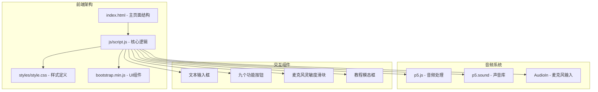
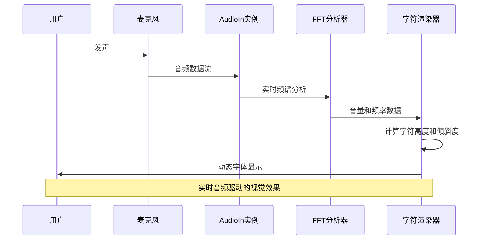
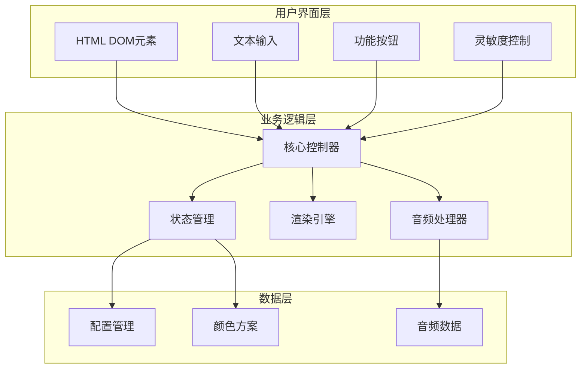
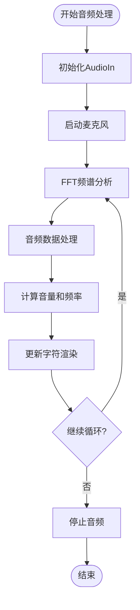
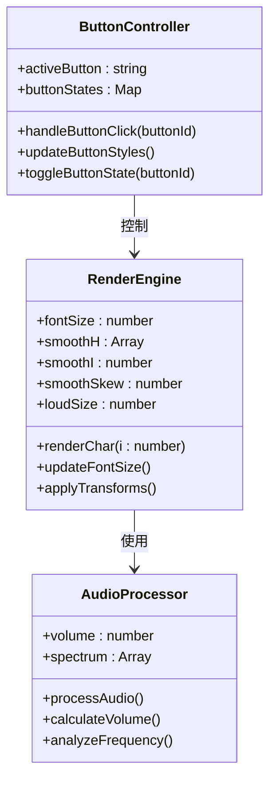
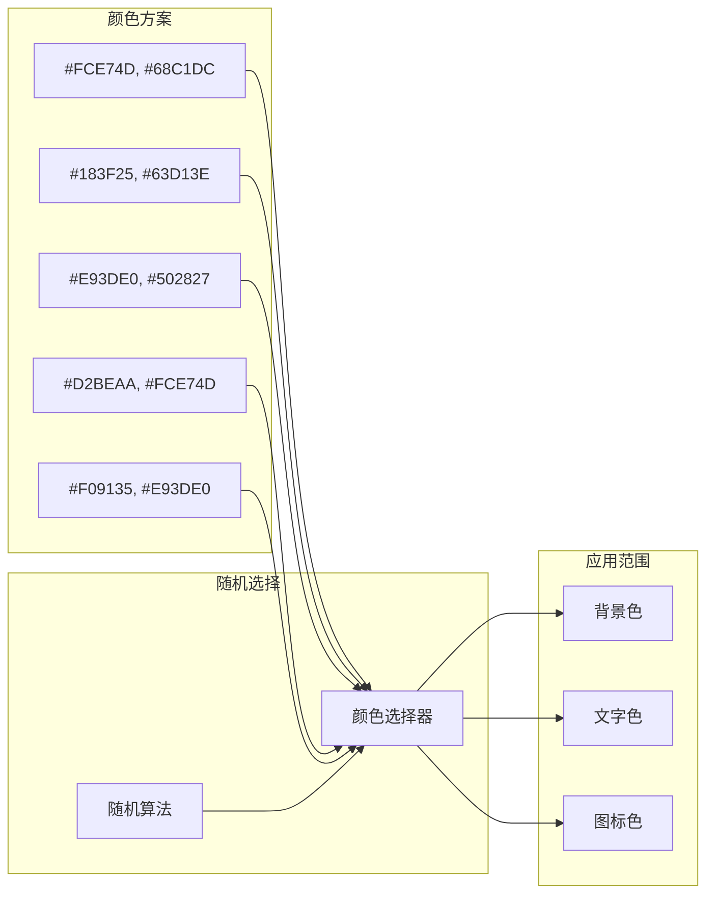
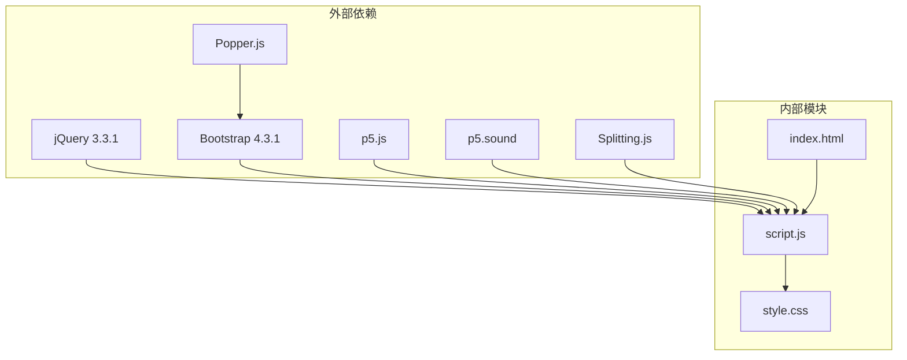

# 键盘快捷键系统

<cite>
**本文档引用的文件**
- [index.html](file://index.html)
- [script.js](file://js/script.js)
- [style.css](file://styles/style.css)
- [bootstrap.min.js](file://js/bootstrap.min.js)
</cite>

## 目录
1. [简介](#简介)
2. [项目结构](#项目结构)
3. [核心组件](#核心组件)
4. [架构概览](#架构概览)
5. [详细组件分析](#详细组件分析)
6. [依赖关系分析](#依赖关系分析)
7. [性能考虑](#性能考虑)
8. [故障排除指南](#故障排除指南)
9. [结论](#结论)

## 简介

本项目是一个基于Web的动态字体交互系统，名为"SYMPHOSIZER"（交响调音师）。该系统通过声音激活的打字机效果，将用户的输入转换为动态的字体变化。虽然项目本身没有实现传统的键盘快捷键功能，但其核心交互机制为理解现代Web应用中的键盘事件处理提供了很好的示例。

该项目展示了如何结合音频输入、DOM操作和CSS动画来创建沉浸式的用户体验。系统的核心在于实时响应用户的输入并通过视觉反馈来增强交互体验。

## 项目结构

项目采用模块化的前端架构，主要由以下组件构成：



**图表来源**
- [index.html:1-282](file://index.html#L1-L282)
- [script.js:1-1049](file://js/script.js#L1-L1049)

**章节来源**
- [index.html:1-282](file://index.html#L1-L282)
- [script.js:1-1049](file://js/script.js#L1-L1049)

## 核心组件

### 音频输入系统

系统的核心是基于p5.js的音频处理模块，负责捕获和分析用户的麦克风输入：



**图表来源**
- [script.js:923-929](file://js/script.js#L923-L929)
- [script.js:360-365](file://js/script.js#L360-L365)

### 按钮控制系统

系统包含九个功能按钮，每个按钮控制不同的视觉效果：

| 按钮 | 功能 | 快捷键 |
|------|------|--------|
| btn_1 | 工具栏切换 | Ctrl+1 |
| btn_2 | 开始音频 | Ctrl+2 |
| btn_3 | 停止音频 | Ctrl+3 |
| btn_4 | 文字颜色选择器 | Ctrl+4 |
| btn_5 | 背景色选择器 | Ctrl+5 |
| btn_6 | 随机颜色 | Ctrl+6 |
| btn_7 | 底部对齐 | Ctrl+7 |
| btn_8 | 顶部对齐 | Ctrl+8 |
| btn_9 | 信息显示 | Ctrl+9 |

**章节来源**
- [script.js:112-120](file://js/script.js#L112-L120)
- [script.js:552-743](file://js/script.js#L552-L743)

## 架构概览

系统采用分层架构设计，各组件职责明确：



**图表来源**
- [script.js:1-1049](file://js/script.js#L1-L1049)
- [index.html:1-282](file://index.html#L1-L282)

## 详细组件分析

### 音频处理组件

音频处理是系统的核心功能，实现了从麦克风输入到视觉输出的完整链路：



**图表来源**
- [script.js:923-929](file://js/script.js#L923-L929)
- [script.js:301-426](file://js/script.js#L301-L426)

#### 组合键处理机制

虽然项目没有直接实现键盘快捷键，但可以通过以下方式扩展：

```javascript
// 扩展的键盘事件处理示例
document.addEventListener('keydown', function(event) {
    const key = event.key.toLowerCase();
    const ctrlPressed = event.ctrlKey;
    const altPressed = event.altKey;
    const shiftPressed = event.shiftKey;
    
    // 组合键检测
    if (ctrlPressed && key === '1') {
        event.preventDefault();
        btn_color_1();
    } else if (ctrlPressed && key === '2') {
        event.preventDefault();
        btn_color_2();
    }
    // ... 其他组合键处理
});
```

**章节来源**
- [script.js:301-426](file://js/script.js#L301-L426)
- [script.js:923-929](file://js/script.js#L923-L929)

### 渲染引擎组件

渲染引擎负责将音频数据转换为视觉效果：



**图表来源**
- [script.js:301-426](file://js/script.js#L301-L426)
- [script.js:552-743](file://js/script.js#L552-L743)

**章节来源**
- [script.js:301-426](file://js/script.js#L301-L426)
- [script.js:552-743](file://js/script.js#L552-L743)

### 颜色管理系统

系统内置了丰富的颜色方案，支持动态切换：



**图表来源**
- [script.js:63-106](file://js/script.js#L63-L106)
- [script.js:931-960](file://js/script.js#L931-L960)

**章节来源**
- [script.js:63-106](file://js/script.js#L63-L106)
- [script.js:931-960](file://js/script.js#L931-L960)

## 依赖关系分析

系统的主要依赖关系如下：



**图表来源**
- [index.html:15-261](file://index.html#L15-L261)
- [script.js:1-1049](file://js/script.js#L1-L1049)

**章节来源**
- [index.html:15-261](file://index.html#L15-L261)
- [script.js:1-1049](file://js/script.js#L1-L1049)

## 性能考虑

### 内存管理

系统在音频处理过程中需要特别注意内存使用：

- **音频缓冲区管理**：使用固定大小的数组存储频谱数据
- **DOM操作优化**：批量更新DOM元素，减少重排重绘
- **事件监听器清理**：及时移除不需要的事件监听器

### 渲染性能

```javascript
// 性能优化示例
function optimizedRender() {
    // 使用requestAnimationFrame确保60fps
    requestAnimationFrame(() => {
        // 批量DOM操作
        updateMultipleElements();
        
        // 避免频繁的布局查询
        const cachedValues = getCachedLayoutValues();
        
        // 合理的动画帧率
        if (frameCount % 2 === 0) {
            updateVisualEffects();
        }
    });
}
```

### 音频处理优化

- **采样率适配**：根据设备性能调整音频采样率
- **频谱分析优化**：使用高效的FFT算法
- **内存池管理**：复用音频处理对象

## 故障排除指南

### 常见问题及解决方案

#### 音频权限问题
**症状**：麦克风无法访问
**解决方案**：
1. 确保HTTPS环境
2. 检查浏览器权限设置
3. 提供清晰的用户提示

#### 性能问题
**症状**：页面卡顿或延迟
**解决方案**：
1. 检查音频采样率设置
2. 优化DOM操作频率
3. 减少不必要的重绘

#### 移动端兼容性
**症状**：触摸事件不响应
**解决方案**：
1. 使用适当的触摸事件监听器
2. 考虑移动端性能限制
3. 提供降级方案

**章节来源**
- [script.js:185-192](file://js/script.js#L185-L192)
- [script.js:466-464](file://js/script.js#L466-L464)

## 结论

本项目展示了一个复杂而精巧的Web音频可视化系统。虽然当前版本没有实现传统的键盘快捷键功能，但其架构为添加此类功能提供了良好的基础。

系统的主要优势包括：
- **实时音频处理**：高效的p5.js音频处理管道
- **流畅的视觉效果**：基于CSS动画的平滑过渡
- **模块化设计**：清晰的组件分离和职责划分
- **跨平台兼容**：良好的桌面和移动设备支持

对于键盘快捷键系统的扩展，建议：
1. 实现标准化的快捷键映射表
2. 添加组合键检测机制
3. 集成无障碍访问支持
4. 提供用户自定义配置选项

这个项目为理解现代Web应用中音频处理、实时渲染和用户交互的最佳实践提供了宝贵的参考。