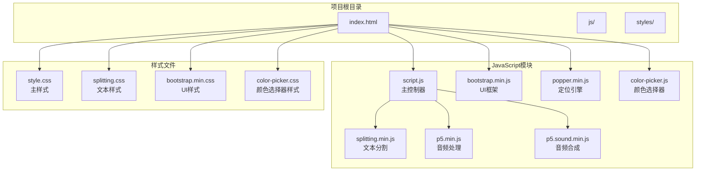
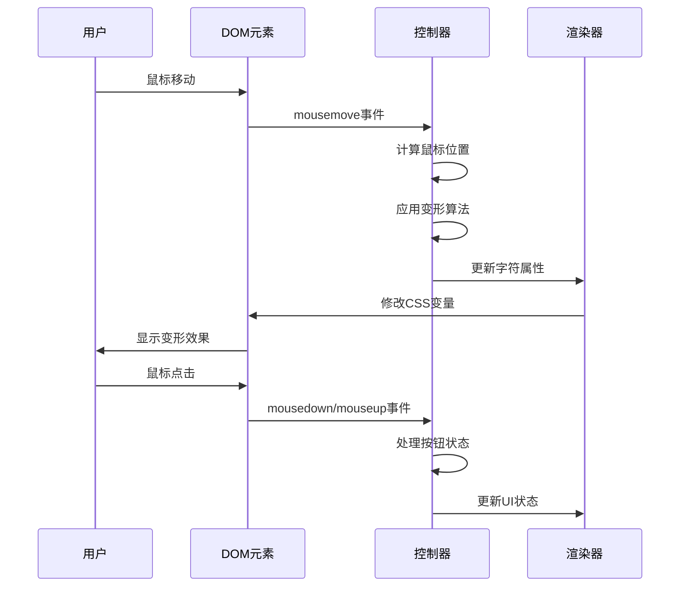
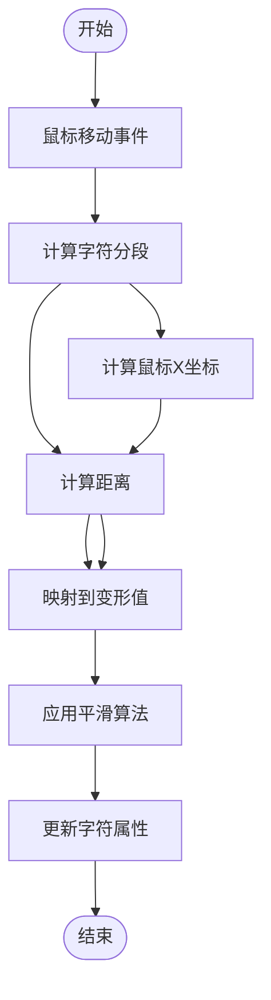
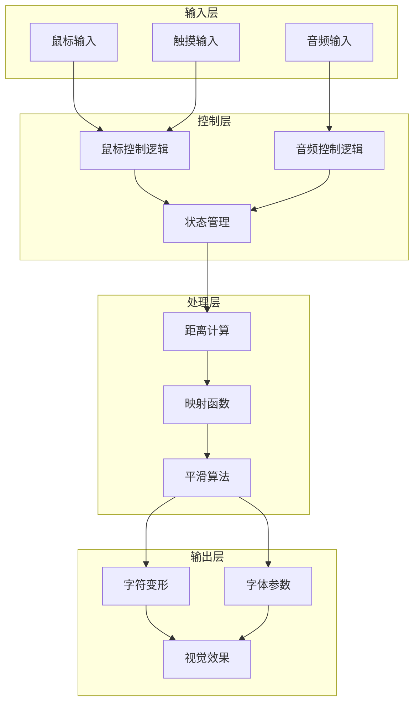
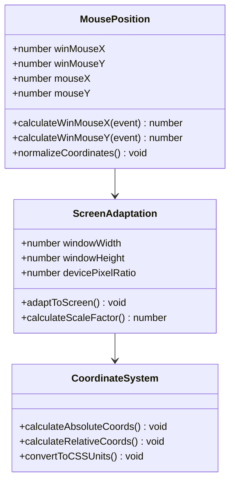
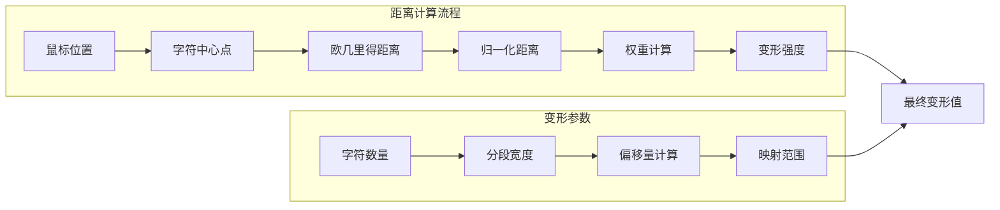
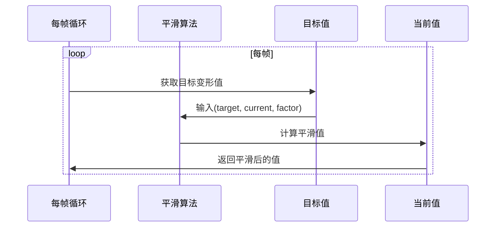
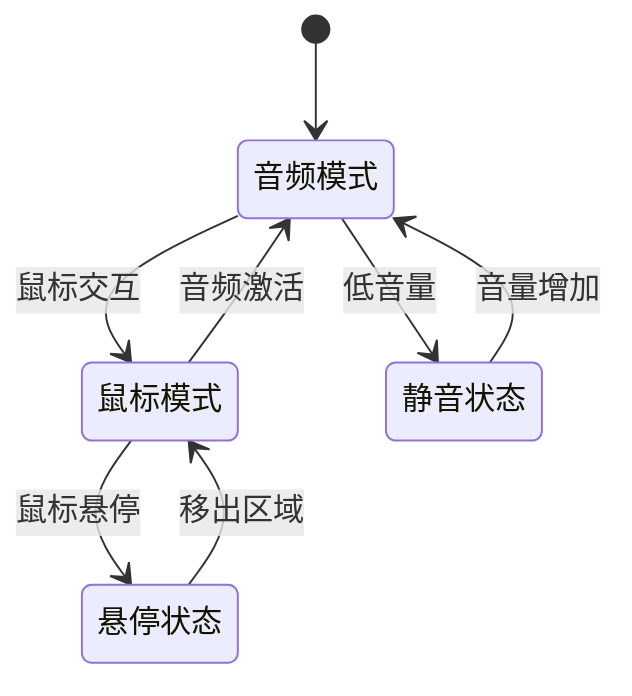
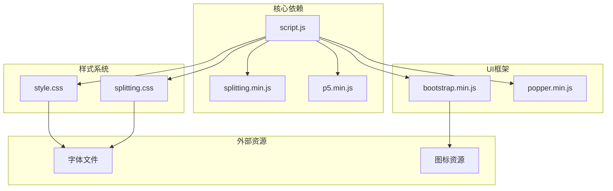

# 鼠标交互处理

<cite>
**本文档引用的文件**
- [index.html](file://index.html)
- [script.js](file://js/script.js)
- [style.css](file://styles/style.css)
- [splitting.css](file://styles/splitting.css)
</cite>

## 目录
1. [项目概述](#项目概述)
2. [项目结构](#项目结构)
3. [核心组件](#核心组件)
4. [架构概览](#架构概览)
5. [详细组件分析](#详细组件分析)
6. [依赖关系分析](#依赖关系分析)
7. [性能考虑](#性能考虑)
8. [故障排除指南](#故障排除指南)
9. [结论](#结论)

## 项目概述

这是一个基于Web的动态字体交互系统，通过鼠标控制实现字符变形效果。项目采用纯JavaScript实现，无需外部依赖，主要功能包括：

- 鼠标位置检测与字符变形
- 动态字体参数调整
- 响应式设计适配
- 性能优化的动画渲染

## 项目结构



**图表来源**
- [index.html:1-282](file://index.html#L1-L282)
- [script.js:1-1049](file://js/script.js#L1-L1049)

**章节来源**
- [index.html:1-282](file://index.html#L1-L282)
- [script.js:1-1049](file://js/script.js#L1-L1049)

## 核心组件

### 鼠标事件监听机制

项目实现了多层次的鼠标事件处理系统：



**图表来源**
- [script.js:388-406](file://js/script.js#L388-L406)
- [script.js:524-538](file://js/script.js#L524-L538)

### 字符变形触发机制

系统通过以下算法实现字符变形：



**图表来源**
- [script.js:389-406](file://js/script.js#L389-L406)

**章节来源**
- [script.js:388-406](file://js/script.js#L388-L406)
- [script.js:283-299](file://js/script.js#L283-L299)

## 架构概览



**图表来源**
- [script.js:301-426](file://js/script.js#L301-L426)
- [script.js:1022-1037](file://js/script.js#L1022-L1037)

## 详细组件分析

### 鼠标位置检测算法

#### winMouseX/winMouseY坐标计算

系统实现了双坐标系支持，确保在不同设备上的准确检测：



**图表来源**
- [script.js:389-401](file://js/script.js#L389-L401)

#### 屏幕尺寸适配机制

系统通过以下方式实现屏幕适配：

1. **动态窗口检测**：实时监控窗口尺寸变化
2. **像素密度适配**：考虑高DPI显示器的缩放
3. **响应式布局**：根据屏幕尺寸调整字符间距

**章节来源**
- [script.js:389-401](file://js/script.js#L389-L401)
- [script.js:838-871](file://js/script.js#L838-L871)

### 字符变形触发机制

#### 距离计算算法

系统采用多级距离计算来实现精确的字符变形：



**图表来源**
- [script.js:399-400](file://js/script.js#L399-L400)

#### 映射函数实现

系统使用线性映射函数将距离转换为变形参数：

| 参数 | 最小值 | 最大值 | 映射范围 |
|------|--------|--------|----------|
| 距离 | 0 | segment × 1.5 | 100 → 0 |
| 鼠标Y坐标 | 200 | windowHeight - 200 | 30 → 0 |
| 字符数量 | 1 | 15 | -6 → 6 |

**章节来源**
- [script.js:399-401](file://js/script.js#L399-L401)

### 鼠标控制模式实现

#### 平滑过渡算法

系统采用指数平滑算法实现流畅的动画效果：



**图表来源**
- [script.js:403-405](file://js/script.js#L403-L405)

#### 阻尼系数调节

系统提供了多级阻尼系数配置：

| 算法类型 | 平滑因子 | 用途场景 |
|----------|----------|----------|
| 字符高度 | 0.3 | 主要变形效果 |
| 倾斜角度 | 0.3 | 文本倾斜效果 |
| 偏斜程度 | 0.07 | 微观变形细节 |

**章节来源**
- [script.js:403-405](file://js/script.js#L403-L405)

### 鼠标控制模式细节

#### 响应灵敏度调节

系统通过以下机制实现灵敏度控制：

1. **字符数量自适应**：根据字符数量动态调整灵敏度
2. **屏幕尺寸适配**：根据屏幕分辨率调整响应范围
3. **实时参数调整**：支持运行时修改控制参数

#### 模式切换机制

系统支持多种控制模式的无缝切换：



**图表来源**
- [script.js:316-365](file://js/script.js#L316-L365)
- [script.js:283-299](file://js/script.js#L283-L299)

**章节来源**
- [script.js:316-365](file://js/script.js#L316-L365)
- [script.js:283-299](file://js/script.js#L283-L299)

## 依赖关系分析



**图表来源**
- [index.html:1-282](file://index.html#L1-L282)
- [script.js:1-1049](file://js/script.js#L1-L1049)

**章节来源**
- [index.html:1-282](file://index.html#L1-L282)
- [script.js:1-1049](file://js/script.js#L1-L1049)

## 性能考虑

### 事件节流策略

系统采用了多层次的性能优化措施：

1. **帧率控制**：使用p5.js的frameRate(60)限制渲染频率
2. **条件渲染**：仅在需要时更新DOM元素
3. **内存管理**：及时清理事件监听器和定时器

### 内存管理优化

```javascript
// 事件监听器清理示例
window.addEventListener('resize', checkSize);
// 在适当时候移除监听器
// window.removeEventListener('resize', checkSize);

// 定时器管理
let micSliderTimeout;
// 使用clearTimeout清理定时器
clearTimeout(micSliderTimeout);
```

### GPU加速应用

系统通过以下方式利用GPU加速：

1. **CSS变换硬件加速**：使用transform属性而非改变布局属性
2. **GPU友好的CSS属性**：优先使用will-change: transform
3. **减少重绘重排**：批量更新DOM属性

**章节来源**
- [script.js:182-183](file://js/script.js#L182-L183)
- [style.css:1-800](file://styles/style.css#L1-L800)

## 故障排除指南

### 常见问题及解决方案

#### 鼠标位置不准确

**问题症状**：字符变形位置与鼠标实际位置不符

**可能原因**：
1. 坐标系转换错误
2. 屏幕缩放影响
3. 元素定位偏移

**解决方法**：
```javascript
// 确保正确的坐标计算
var mx = map(
    event.clientX - segment * 1.5,
    0,
    windowWidth + segment * xx,
    0,
    windowWidth
);
```

#### 变形效果卡顿

**问题症状**：字符变形出现延迟或不流畅

**可能原因**：
1. 帧率过低
2. DOM操作过多
3. CSS动画性能问题

**解决方法**：
```javascript
// 优化DOM操作
// 批量更新样式属性
splitChars[wornum].chars[i].style.cssText += `
    font-size: ${fontSize}px;
    font-variation-settings: "'vrsb'${isTop}', 'YTUC'${smoothH[i]}', 'ital'${smoothI}";
    transform: skew(${smoothSkew}rad);
`;
```

#### 移动端兼容性问题

**问题症状**：触摸设备上鼠标事件不工作

**解决方法**：
```javascript
// 检测移动端并使用相应的事件
if (isMobile) {
    // 使用触摸事件
    btn_1.ontouchstart = handleTouchStart;
    btn_1.ontouchend = handleTouchEnd;
} else {
    // 使用鼠标事件
    btn_1.onmousedown = handleMouseDown;
    btn_1.onmouseup = handleMouseUp;
}
```

**章节来源**
- [script.js:437-464](file://js/script.js#L437-L464)
- [script.js:470-522](file://js/script.js#L470-L522)

## 结论

该项目成功实现了基于鼠标的动态字体交互系统，具有以下特点：

1. **精确的鼠标控制**：通过多级算法实现精准的字符变形控制
2. **优秀的性能表现**：采用多种优化策略确保流畅的用户体验
3. **良好的可扩展性**：模块化的架构便于功能扩展和维护
4. **跨平台兼容**：支持桌面和移动设备的多种输入方式

系统的实现展示了现代Web开发中鼠标交互处理的最佳实践，为类似项目提供了有价值的参考。