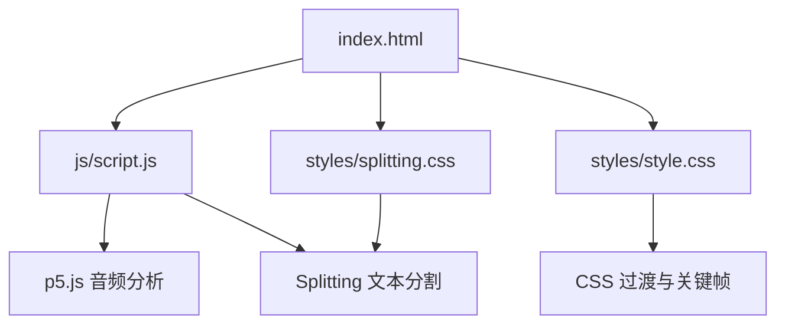
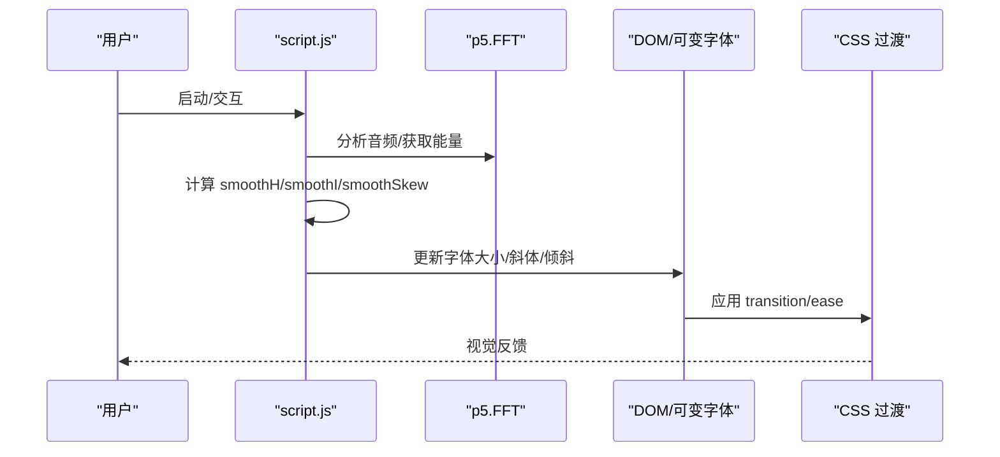
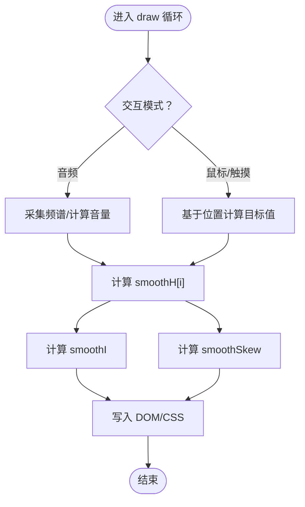
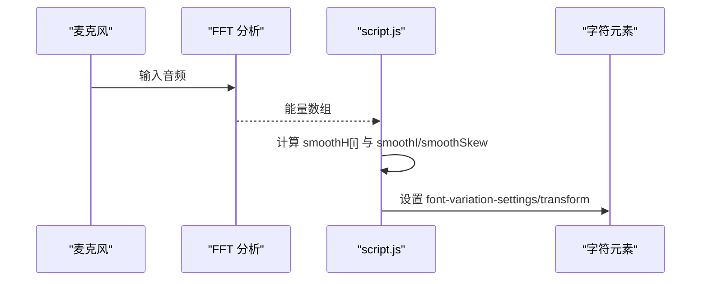
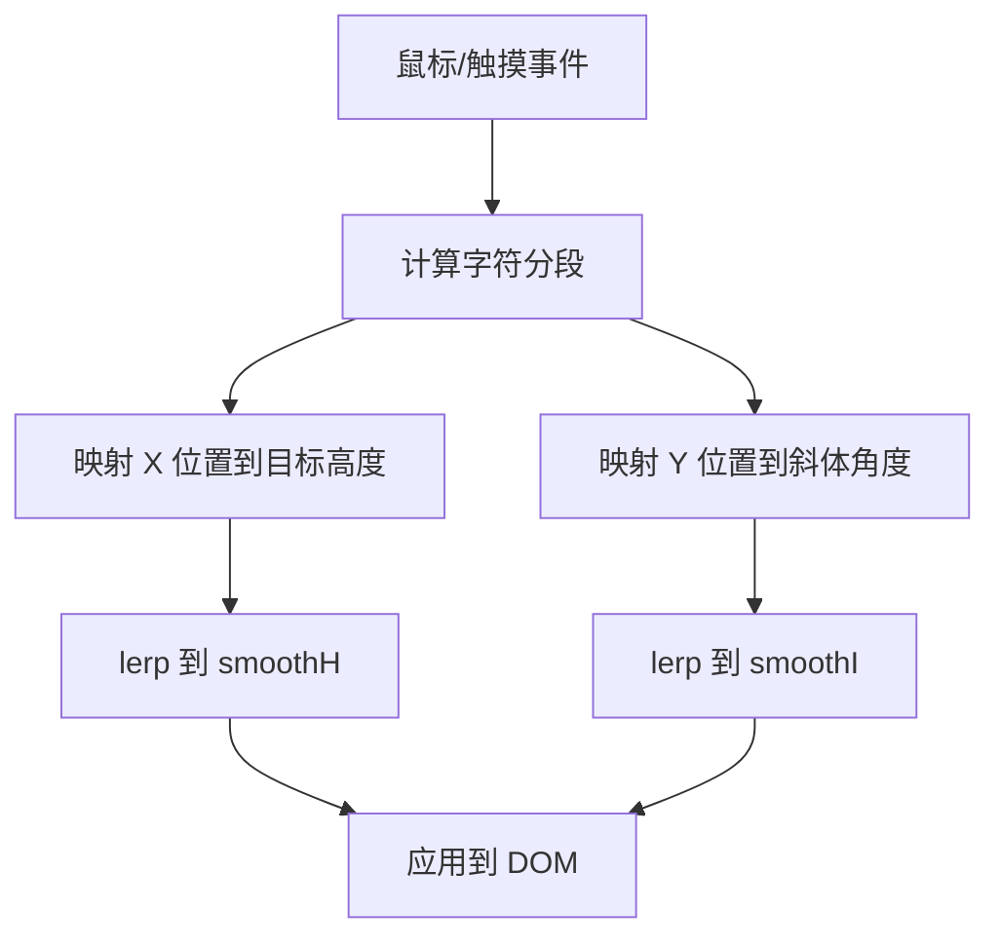
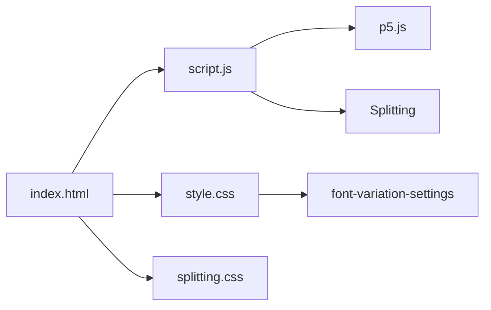

# 动画效果实现

<cite>
**本文档引用的文件**
- [index.html](file://index.html)
- [script.js](file://js/script.js)
- [style.css](file://styles/style.css)
- [splitting.css](file://styles/splitting.css)
</cite>

## 目录
1. [简介](#简介)
2. [项目结构](#项目结构)
3. [核心组件](#核心组件)
4. [架构总览](#架构总览)
5. [详细组件分析](#详细组件分析)
6. [依赖关系分析](#依赖关系分析)
7. [性能考量](#性能考量)
8. [故障排除指南](#故障排除指南)
9. [结论](#结论)
10. [附录](#附录)

## 简介
本项目通过“可变字体”与“p5.js 音频分析”实现动态文字动画，结合 CSS 过渡与 JavaScript 平滑变量，形成多模式交互体验：音频驱动、鼠标控制与触摸手势。动画系统以每帧更新的 draw 循环为核心，使用 lerp 插值、EaseOut 缓动与 constrain 约束函数，确保视觉变化顺滑自然。本文档将深入解析动画实现原理、数据流与性能优化策略，并提供调试与监控建议。

## 项目结构
项目采用“HTML + CSS + JS”的前端单页应用结构，核心逻辑集中在脚本文件中，样式通过 CSS 控制动画与布局，可变字体与分割渲染由第三方库支持。

图表来源
- [index.html:1-282](file://index.html#L1-L282)
- [script.js:1-1049](file://js/script.js#L1-L1049)
- [style.css:1-1571](file://styles/style.css#L1-L1571)
- [splitting.css:1-67](file://styles/splitting.css#L1-L67)

章节来源
- [index.html:1-282](file://index.html#L1-L282)
- [script.js:178-201](file://js/script.js#L178-L201)
- [style.css:851-960](file://styles/style.css#L851-L960)
- [splitting.css:1-67](file://styles/splitting.css#L1-L67)

## 核心组件
- 可变字体渲染与分割：使用 Splitting 将文本拆分为字符级元素，便于逐字控制。
- 音频输入与频谱分析：通过 p5.AudioIn 采集麦克风信号，p5.FFT 分析频域能量。
- 平滑变量系统：smoothH（高度）、smoothI（斜体）、smoothSkew（倾斜）等变量通过 lerp 实现平滑过渡。
- CSS 过渡与动画：通过 transition、animation 与 font-variation-settings 实现视觉平滑。
- 交互模式：音频驱动、鼠标控制、触摸手势三类模式在 draw 中按条件切换。

章节来源
- [script.js:15-52](file://js/script.js#L15-L52)
- [script.js:301-426](file://js/script.js#L301-L426)
- [style.css:156-162](file://styles/style.css#L156-L162)
- [splitting.css:1-67](file://styles/splitting.css#L1-L67)

## 架构总览
动画系统以 draw 循环为驱动，每帧根据当前模式计算平滑变量，再将结果写入 DOM 元素的 CSS 属性或可变字体参数。

图表来源
- [script.js:301-426](file://js/script.js#L301-L426)
- [script.js:1022-1037](file://js/script.js#L1022-L1037)
- [style.css:156-162](file://styles/style.css#L156-L162)

## 详细组件分析

### 组件一：平滑变量与插值系统
- smoothH：每个字符的高度平滑变量，用于控制可变字体的 YTUC 参数。
- smoothI：斜体角度平滑变量，映射到可变字体的 ital 参数。
- smoothSkew：倾斜角度平滑变量，通过 transform: skew 实现。
- smoothAmount：全局平滑系数，影响 lerp 的平滑程度。
- smoothVol：音量平滑值，用于综合判断触发条件。

实现要点
- 使用 lerp(smoothVar, target, amount) 实现指数平滑过渡。
- 使用 EaseOut 对输入进行非线性缓动，增强触动感。
- 使用 constrain 对输出范围进行约束，避免过度抖动。

图表来源
- [script.js:301-426](file://js/script.js#L301-L426)
- [script.js:1022-1037](file://js/script.js#L1022-L1037)

章节来源
- [script.js:301-426](file://js/script.js#L301-L426)
- [script.js:1022-1037](file://js/script.js#L1022-L1037)

### 组件二：音频驱动动画
- 音频阈值与灵敏度：通过 micThreshold 与 micSlider 调整触发敏感度。
- 频带划分：根据字符数量动态计算频带范围，映射到各字符的能量值。
- 触发条件：
  - 音量超过阈值时，启用斜体与倾斜/缩放效果。
  - 不同阈值对应不同的强度与速度。

图表来源
- [script.js:316-365](file://js/script.js#L316-L365)
- [script.js:367-416](file://js/script.js#L367-L416)

章节来源
- [script.js:316-365](file://js/script.js#L316-L365)
- [script.js:367-416](file://js/script.js#L367-L416)
- [script.js:1006-1012](file://js/script.js#L1006-L1012)

### 组件三：鼠标/触摸控制动画
- 鼠标位置映射：根据字符数量与屏幕宽度计算分段，将鼠标横向位置映射到字符目标高度。
- 斜体映射：纵向位置映射到斜体角度。
- 倾斜与缩放：在无音频时默认回零，保持视觉一致性。

图表来源
- [script.js:388-406](file://js/script.js#L388-L406)

章节来源
- [script.js:388-406](file://js/script.js#L388-L406)

### 组件四：CSS 过渡与可变字体
- 可变字体参数：
  - vrsb：垂直分布（顶部/底部对齐）
  - YTUC：高度（控制字符“高度”）
  - ital：斜体
- CSS 过渡：
  - body、按钮、菜单等元素使用 transition 实现平滑显隐与颜色变化。
  - 字符元素通过 font-variation-settings 与 transform 实现平滑过渡。

章节来源
- [style.css:156-162](file://styles/style.css#L156-L162)
- [style.css:861-865](file://styles/style.css#L861-L865)
- [splitting.css:1-67](file://styles/splitting.css#L1-L67)

### 组件五：菜单与工具栏交互
- 工具栏显示/隐藏：通过旋转按钮与透明度动画控制。
- 颜色选择器：支持字体与背景色切换。
- 教程与提示：模态框与 SVG 提示层。

章节来源
- [script.js:552-743](file://js/script.js#L552-L743)
- [style.css:170-185](file://styles/style.css#L170-L185)
- [style.css:427-455](file://styles/style.css#L427-L455)

## 依赖关系分析
- script.js 依赖 p5.js（音频分析与 FFT）、Splitting（文本分割）。
- HTML 引入 CSS 与第三方脚本，CSS 定义动画与过渡。
- 可变字体参数通过 DOM 属性写入，CSS 过渡保证视觉顺滑。

图表来源
- [index.html:15-261](file://index.html#L15-L261)
- [script.js:184-185](file://js/script.js#L184-L185)
- [script.js:242-242](file://js/script.js#L242-L242)

章节来源
- [index.html:15-261](file://index.html#L15-L261)
- [script.js:184-185](file://js/script.js#L184-L185)
- [script.js:242-242](file://js/script.js#L242-L242)

## 性能考量
- 帧率控制：初始化设置 frameRate(60)，确保稳定刷新。
- 平滑系数：通过 amount 控制 lerp 的步进，平衡响应与顺滑。
- DOM 操作最小化：集中更新字符样式，减少重排与重绘。
- 条件渲染：仅在需要时显示工具栏与提示，降低不必要的绘制。
- 移动端适配：移动端阈值与交互方式调整，避免过度计算。

章节来源
- [script.js:182-183](file://js/script.js#L182-L183)
- [script.js:301-426](file://js/script.js#L301-L426)
- [script.js:466-464](file://js/script.js#L466-L464)

## 故障排除指南
- 音频未生效：检查浏览器权限与 userStartAudio 是否调用；确认 mic.start() 与 FFT 初始化。
- 字符不响应：确认 Splitting 已正确初始化，且字符元素存在。
- 过度抖动：提高 constrain 下限或降低 smoothAmount；检查 lerp 的 amount 是否过大。
- 移动端触摸无响应：确认触摸事件绑定与 isMobile 判断逻辑。

章节来源
- [script.js:923-929](file://js/script.js#L923-L929)
- [script.js:242-242](file://js/script.js#L242-L242)
- [script.js:283-299](file://js/script.js#L283-L299)

## 结论
该动画系统通过“可变字体 + 音频分析 + 平滑变量 + CSS 过渡”的组合，实现了多模式、低耦合的动态文字效果。其核心在于：
- 使用 lerp + EaseOut + constrain 构建平滑的视觉过渡；
- 在 draw 循环中按模式分支计算目标值；
- 通过 CSS 过渡与可变字体参数实现高效渲染。

## 附录
- 数学模型参考
  - lerp：线性插值，用于平滑过渡。
  - EaseOut：缓动函数，使动画在末尾更柔和。
  - constrain：限制数值范围，避免异常波动。
- 调试建议
  - 使用浏览器开发者工具观察 DOM 属性变化与 CSS 过渡。
  - 逐步注释 draw 中的分支，定位问题模块。
  - 调整 smoothAmount 与阈值，观察响应与顺滑度平衡。