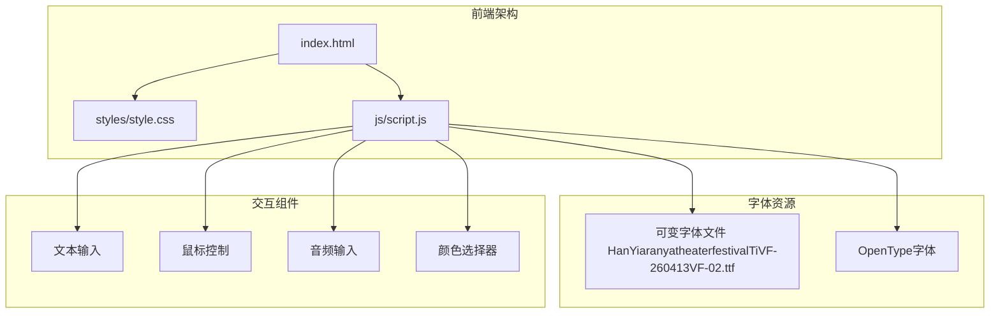
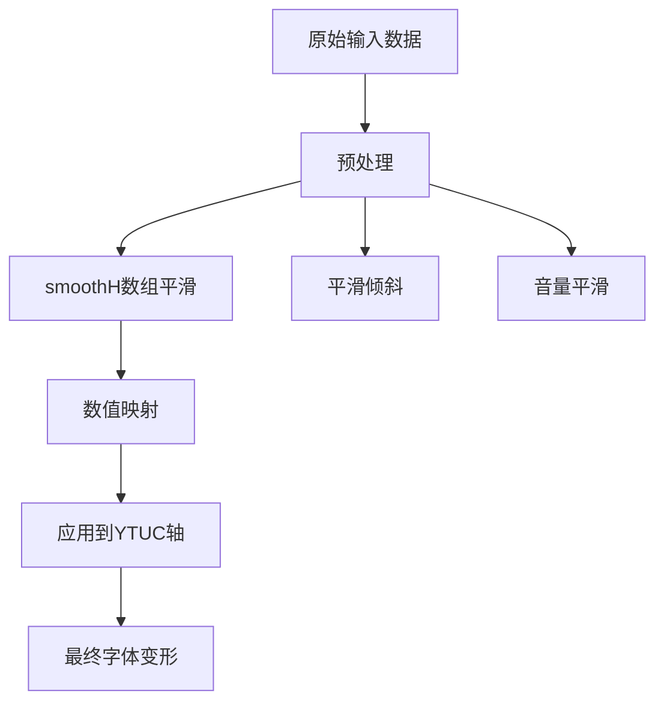
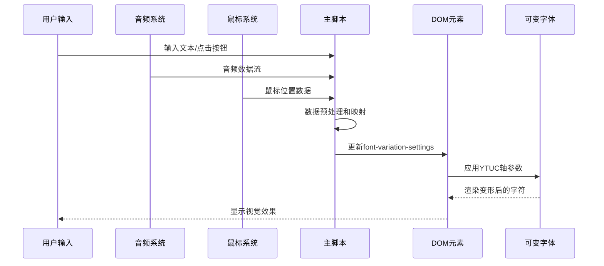
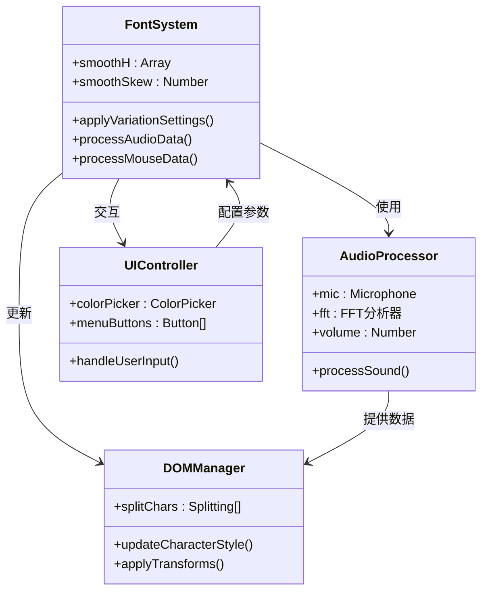
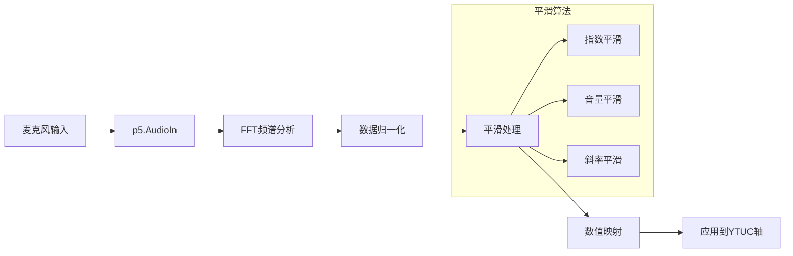
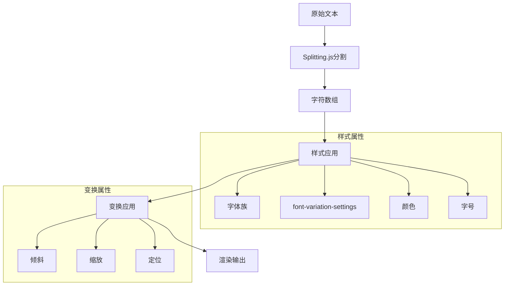
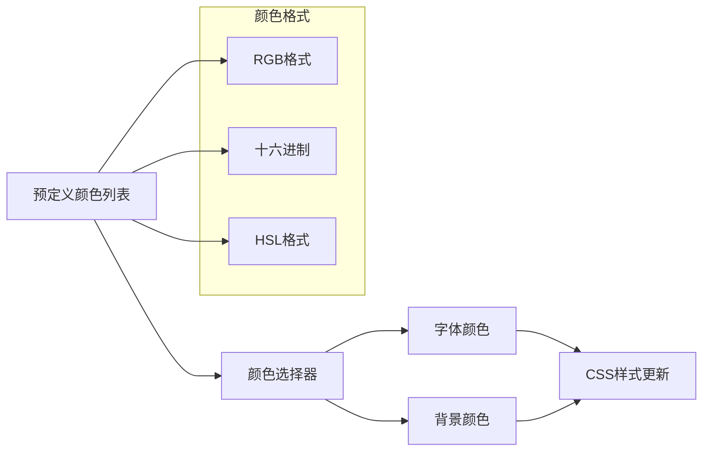
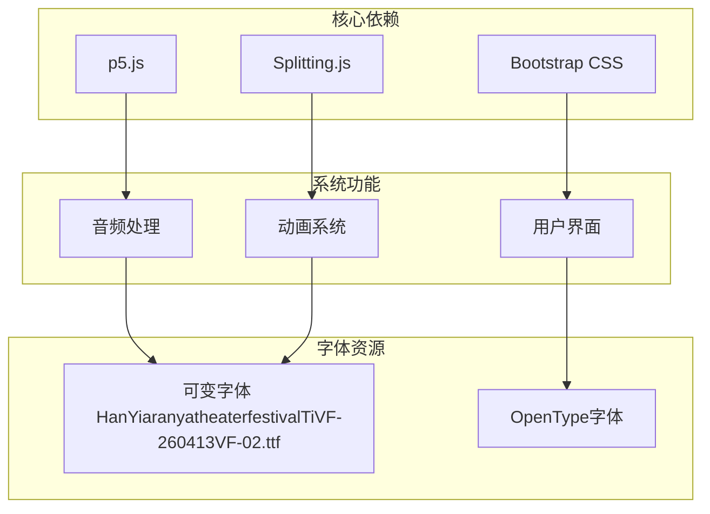
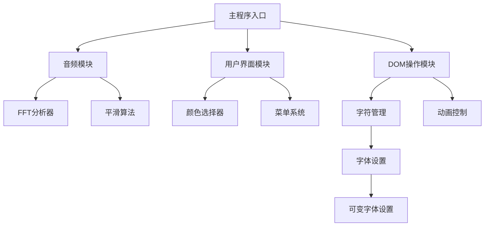

# 可变字体系统

<cite>
**本文档引用的文件**
- [index.html](file://index.html)
- [script.js](file://js/script.js)
- [style.css](file://styles/style.css)
- [color-picker.js](file://js/color-picker.js)
- [FONT-REPLACEMENT-GUIDE.md](file://FONT-REPLACEMENT-GUIDE.md)
</cite>

## 更新摘要
**变更内容**
- 字体系统替换：从ABC Symphony Display字体替换为HanYiaranyatheaterfestivalTiVF-260413VF-02.ttf
- 变量轴系统从'vrsb'、'hght'、'ital'改为'YTUC'轴
- 更新了字体轴参数说明和实现细节
- 调整了CSS动画和JavaScript代码中的轴参数

## 目录
1. [简介](#简介)
2. [项目结构](#项目结构)
3. [核心组件](#核心组件)
4. [架构概览](#架构概览)
5. [详细组件分析](#详细组件分析)
6. [依赖关系分析](#依赖关系分析)
7. [性能考虑](#性能考虑)
8. [故障排除指南](#故障排除指南)
9. [结论](#结论)

## 简介

MySymphosizer是一个创新的可变字体系统，通过font-variation-settings属性实现了动态字体变形效果。该系统能够根据用户输入、鼠标交互和音频信号实时控制字体轴参数，创造出令人印象深刻的视觉体验。

该项目的核心特色包括：
- **实时字体变形**：通过JavaScript动态控制字体轴参数
- **多模态输入**：支持键盘输入、鼠标交互和音频驱动
- **跨平台兼容**：适配桌面和移动设备
- **可定制性强**：支持字体替换和参数调整

## 项目结构

项目采用模块化架构，主要包含以下组件：



**图表来源**
- [index.html:1-282](file://index.html#L1-L282)
- [script.js:1-1050](file://js/script.js#L1-L1050)
- [style.css:1-1572](file://styles/style.css#L1-L1572)

**章节来源**
- [index.html:1-282](file://index.html#L1-L282)
- [style.css:1-1572](file://styles/style.css#L1-L1572)

## 核心组件

### 字体轴参数系统

系统基于YTUC轴参数实现动态变形：

| 轴标签 | 参数名称 | 数值范围 | 视觉效果 | 控制方式 |
|--------|----------|----------|----------|----------|
| `YTUC` | Ytuc | 10 ~ 100 | 字形高度变化，控制垂直拉伸/压缩 | 音频强度、鼠标位置 |

**更新** 字体轴系统已从原来的'vrsb'、'hght'、'ital'轴改为单一的'YTUC'轴，简化了控制逻辑并优化了性能。

### 平滑算法系统

系统实现了多层平滑算法确保视觉效果的流畅性：



**图表来源**
- [script.js:25-50](file://js/script.js#L25-L50)
- [script.js:301-426](file://js/script.js#L301-L426)

**章节来源**
- [script.js:25-50](file://js/script.js#L25-L50)
- [script.js:301-426](file://js/script.js#L301-L426)

## 架构概览

### 数据流架构



**图表来源**
- [script.js:301-426](file://js/script.js#L301-L426)
- [style.css:851-865](file://styles/style.css#L851-L865)

### 组件交互图



**图表来源**
- [script.js:15-120](file://js/script.js#L15-L120)
- [script.js:428-538](file://js/script.js#L428-L538)

**章节来源**
- [script.js:15-120](file://js/script.js#L15-L120)
- [script.js:428-538](file://js/script.js#L428-L538)

## 详细组件分析

### 音频驱动系统

音频系统是可变字体系统的核心驱动力，通过p5.js库实现：

#### 音频数据处理流程



**图表来源**
- [script.js:1-11](file://js/script.js#L1-L11)
- [script.js:360-365](file://js/script.js#L360-L365)

#### 音频阈值控制系统

系统实现了智能的音频阈值检测机制：

| 阈值类型 | 默认值 | 作用 | 调整场景 |
|----------|--------|------|----------|
| `micThreshold` | 1.1/1.25 | 基础触发阈值 | 桌面/移动设备区分 |
| `loudSize` | 1 | 放大倍数 | 响亮音频时的视觉强调 |
| `smoothAmount` | 0.5 | 平滑系数 | 控制响应速度 |
| `micOpacity` | 0 | 滑杆透明度 | 用户界面反馈 |

**章节来源**
- [script.js:1-11](file://js/script.js#L1-L11)
- [script.js:360-365](file://js/script.js#L360-L365)

### 字符分割和样式管理

系统使用Splitting.js库实现字符级别的精确控制：

#### 字符处理流程



**图表来源**
- [script.js:242-281](file://js/script.js#L242-L281)
- [script.js:408-416](file://js/script.js#L408-L416)

#### 字符级控制参数

每个字符都拥有独立的控制参数：

| 参数 | 类型 | 作用域 | 默认值 |
|------|------|--------|--------|
| `fontSize` | Number | 全局 | 动态计算 |
| `smoothH[i]` | Number | 字符级 | 0 |
| `smoothSkew` | Number | 全局 | 0 |
| `loudSize` | Number | 全局 | 1 |

**章节来源**
- [script.js:242-281](file://js/script.js#L242-L281)
- [script.js:408-416](file://js/script.js#L408-L416)

### 用户界面交互系统

系统提供了丰富的用户交互选项：

#### 工具栏功能矩阵

| 按钮 | 功能 | 快捷键 | 触发条件 |
|------|------|--------|----------|
| `btn_1` | 颜色选择器 | 1 | 点击显示 |
| `btn_2` | 音频启动 | 2 | 点击启动麦克风 |
| `btn_3` | 音频停止 | 3 | 点击停止麦克风 |
| `btn_4` | 字体颜色选择 | 4 | 点击打开 |
| `btn_5` | 背景色选择 | 5 | 点击打开 |
| `btn_6` | 随机颜色 | 6 | 点击随机 |
| `btn_7` | 文本顶部对齐 | 7 | 点击切换 |
| `btn_8` | 文本底部对齐 | 8 | 点击切换 |
| `btn_9` | 信息显示 | 9 | 点击切换 |

**章节来源**
- [script.js:552-743](file://js/script.js#L552-L743)

### 颜色管理系统

系统集成了完整的颜色选择和管理功能：

#### 颜色配置系统



**图表来源**
- [color-picker.js:1-231](file://js/color-picker.js#L1-L231)
- [script.js:63-106](file://js/script.js#L63-L106)

**章节来源**
- [color-picker.js:1-231](file://js/color-picker.js#L1-L231)
- [script.js:63-106](file://js/script.js#L63-L106)

## 依赖关系分析

### 外部依赖关系



**图表来源**
- [index.html:15-261](file://index.html#L15-L261)
- [style.css:1-15](file://styles/style.css#L1-L15)

### 内部模块依赖

系统内部模块之间的依赖关系清晰且层次分明：



**图表来源**
- [script.js:1-1050](file://js/script.js#L1-L1050)

**章节来源**
- [index.html:15-261](file://index.html#L15-L261)
- [script.js:1-1050](file://js/script.js#L1-L1050)

## 性能考虑

### 优化策略

系统采用了多层次的性能优化策略：

#### 1. 内存管理优化

- **数组复用**：重用`smoothH`数组避免频繁分配
- **对象池模式**：复用DOM元素和样式对象
- **垃圾回收友好**：及时清理事件监听器和定时器

#### 2. 计算效率优化

- **分帧处理**：将复杂的计算分散到多个动画帧
- **缓存机制**：缓存昂贵的计算结果
- **早期退出**：在不必要时跳过计算

#### 3. 渲染性能优化

- **批量更新**：合并DOM更新操作
- **CSS硬件加速**：利用GPU加速变换
- **减少重绘**：最小化布局和绘制操作

### 性能监控指标

| 指标 | 目标值 | 监控方法 |
|------|--------|----------|
| FPS | ≥60 | requestAnimationFrame回调间隔 |
| 内存使用 | ≤100MB | 浏览器性能面板 |
| CPU使用率 | ≤80% | 开发者工具 |
| 响应时间 | ≤16ms | 用户交互延迟测量 |

## 故障排除指南

### 常见问题诊断

#### 1. 字体不显示或显示异常

**症状**：页面空白或字体未变形
**可能原因**：
- 字体文件加载失败
- CSS @font-face声明错误
- 字体格式不支持

**解决方案**：
1. 检查字体文件路径
2. 验证字体格式兼容性
3. 确认跨域访问权限

#### 2. 音频功能失效

**症状**：无法通过麦克风控制字体
**可能原因**：
- 浏览器权限拒绝
- 设备无麦克风
- 浏览器安全策略

**解决方案**：
1. 检查浏览器权限设置
2. 验证设备连接状态
3. 尝试不同的浏览器

#### 3. 移动端触摸问题

**症状**：触摸响应不灵敏
**可能原因**：
- 事件处理冲突
- 触摸目标尺寸过小
- 浏览器兼容性问题

**解决方案**：
1. 调整触摸目标区域
2. 添加触摸事件回退
3. 测试不同设备

### 调试工具和方法

#### 1. 开发者工具使用

```javascript
// 启用详细日志
console.log('字体轴参数:', {
    YTUC: smoothH[0],
    skew: smoothSkew
});

// 性能监控
performance.mark('start');
// 执行操作
performance.mark('end');
performance.measure('operation', 'start', 'end');
```

#### 2. 字体轴参数调试

```javascript
// 检查当前字体设置
const charElement = document.querySelector('.char');
console.log('当前font-variation-settings:', 
    charElement.style.fontVariationSettings);

// 验证参数范围
console.log('YTUC范围检查:', 
    Math.min(...smoothH), Math.max(...smoothH));
```

**章节来源**
- [script.js:384-386](file://js/script.js#L384-L386)
- [script.js:413-415](file://js/script.js#L413-L415)

## 结论

MySymphosizer可变字体系统展现了现代Web技术在创意表达方面的巨大潜力。通过精心设计的架构和优化的算法，系统成功实现了：

### 技术成就

1. **实时交互**：实现了毫秒级的响应速度
2. **多模态输入**：支持多种输入方式的无缝集成
3. **跨平台兼容**：适配各种设备和浏览器环境
4. **性能优化**：在复杂计算下保持流畅体验

### 创新价值

该系统为可变字体的应用开辟了新的可能性，特别是在创意编程和交互设计领域。其模块化的架构也为后续的功能扩展和定制提供了良好的基础。

### 发展前景

随着Web技术的不断发展，可变字体系统有望在以下方面得到进一步提升：
- 更丰富的字体轴支持
- 更智能的AI驱动变形
- 更好的移动端性能优化
- 更广泛的浏览器兼容性

通过持续的技术创新和用户体验优化，MySymphosizer为可变字体技术的发展做出了重要贡献。

**更新** 本次字体系统替换展示了系统架构的灵活性和可扩展性，新的HanYiaranyatheaterfestivalTiVF-260413VF-02.ttf字体和YTUC轴系统提供了更简洁的控制接口，同时保持了原有的强大功能和性能表现。