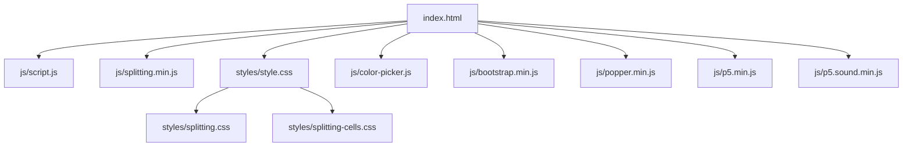
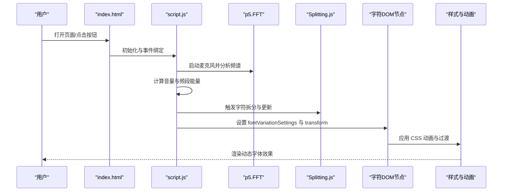
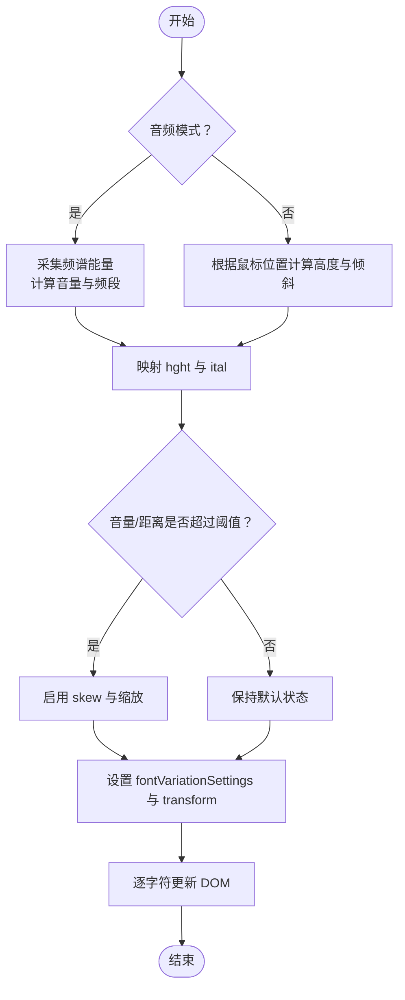
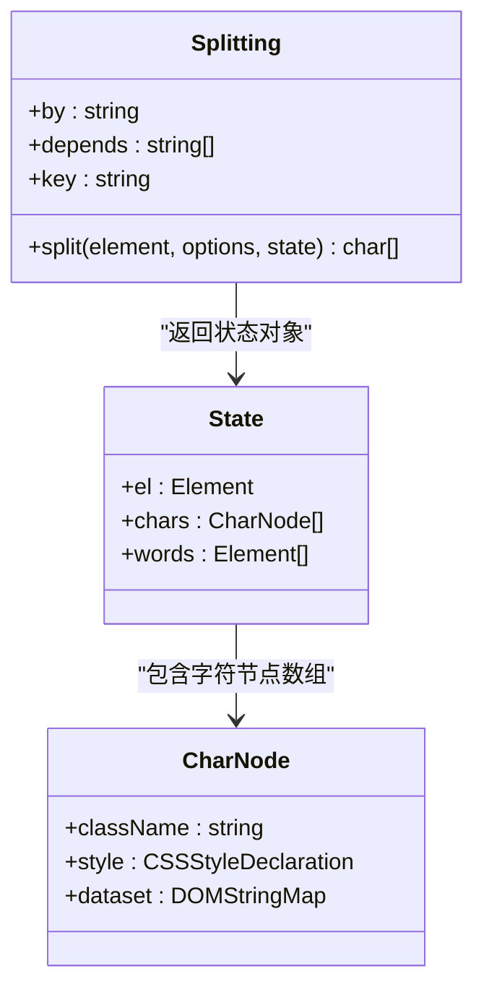
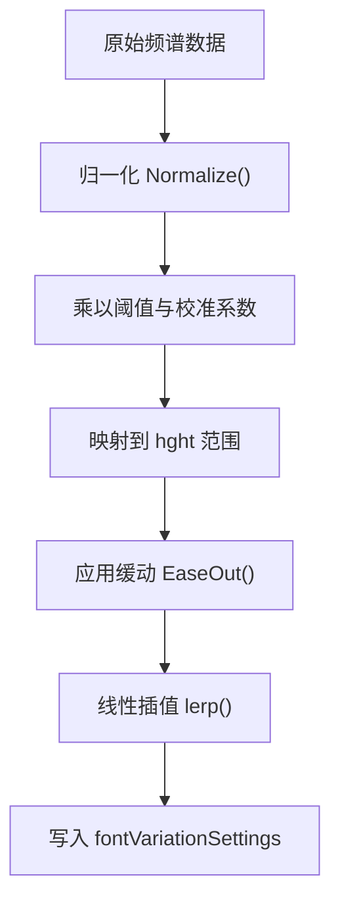
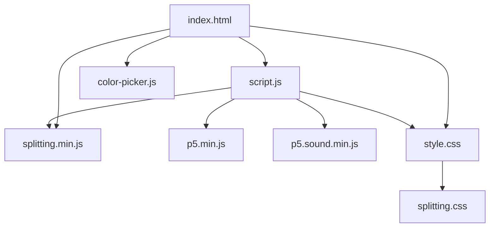

# 字体渲染引擎

<cite>
**本文档引用的文件**
- [index.html](file://index.html)
- [script.js](file://js/script.js)
- [splitting.min.js](file://js/splitting.min.js)
- [style.css](file://styles/style.css)
- [splitting.css](file://styles/splitting.css)
- [splitting-cells.css](file://styles/splitting-cells.css)
- [color-picker.js](file://js/color-picker.js)
- [FONT-REPLACEMENT-GUIDE.md](file://FONT-REPLACEMENT-GUIDE.md)
</cite>

## 目录
1. [简介](#简介)
2. [项目结构](#项目结构)
3. [核心组件](#核心组件)
4. [架构总览](#架构总览)
5. [详细组件分析](#详细组件分析)
6. [依赖关系分析](#依赖关系分析)
7. [性能考量](#性能考量)
8. [故障排除指南](#故障排除指南)
9. [结论](#结论)
10. [附录](#附录)

## 简介
本项目是一个基于可变字体的交互式字体渲染引擎，结合 Splitting.js 字符级 DOM 操作与 CSS 动画，实现了声音驱动的动态排版效果。用户可以通过麦克风或鼠标控制字体的变形参数，包括高度轴、倾斜轴、可变轴和扭曲变换，形成富有表现力的视觉体验。

## 项目结构
项目采用模块化组织，前端资源按功能分层：
- HTML 页面负责布局与初始加载
- CSS 样式定义字体、动画与界面元素
- JS 脚本实现音频输入、可变字体参数控制与 DOM 更新
- Splitting.js 提供字符级拆分与 CSS 变量支持



**图表来源**
- [index.html:1-282](file://index.html#L1-L282)
- [script.js:1-1049](file://js/script.js#L1-L1049)
- [splitting.min.js:1-31](file://js/splitting.min.js#L1-L31)
- [style.css:1-1571](file://styles/style.css#L1-L1571)
- [splitting.css:1-67](file://styles/splitting.css#L1-L67)
- [splitting-cells.css:1-56](file://styles/splitting-cells.css#L1-L56)
- [color-picker.js:1-231](file://js/color-picker.js#L1-L231)

**章节来源**
- [index.html:1-282](file://index.html#L1-L282)

## 核心组件
- 可变字体系统：通过 `font-variation-settings` 实时控制 hght、ital、vrsb 轴参数，实现高度、倾斜与方向反转的动态效果。
- Splitting.js 字符分割：将文本拆分为字符级元素，支持 CSS 变量与动画，便于逐字符控制。
- 音频驱动系统：使用 p5.js 采集麦克风输入，分析频谱能量，映射到字体变形参数。
- 实时动画系统：结合 CSS 过渡与 JavaScript 状态管理，实现平滑的视觉反馈。
- 字体轴参数指南：提供轴标签、范围、视觉效果与最佳实践，支持字体替换与自定义。

**章节来源**
- [script.js:1-1049](file://js/script.js#L1-L1049)
- [style.css:1-1571](file://styles/style.css#L1-L1571)
- [splitting.min.js:1-31](file://js/splitting.min.js#L1-L31)
- [FONT-REPLACEMENT-GUIDE.md:1-263](file://FONT-REPLACEMENT-GUIDE.md#L1-L263)

## 架构总览
系统以“音频输入 → 数据处理 → 字体参数映射 → DOM 更新 → 视觉呈现”为主线，配合 Splitting.js 的字符级 DOM 结构与 CSS 动画实现流畅的交互体验。



**图表来源**
- [index.html:1-282](file://index.html#L1-L282)
- [script.js:923-929](file://js/script.js#L923-L929)
- [script.js:301-426](file://js/script.js#L301-L426)
- [splitting.min.js:19-30](file://js/splitting.min.js#L19-L30)
- [style.css:224-275](file://styles/style.css#L224-L275)

## 详细组件分析

### 可变字体系统与 font-variation-settings
- 轴参数控制
  - hght（高度轴）：控制字形高度比例，用于响应音量与位置，范围约 -100 ~ +100。
  - ital（倾斜轴）：控制字形倾斜程度，范围约 0 ~ 40。
  - vrsb（可变轴）：控制文字方向/翻转，值为 0 或 1。
- 实时控制流程
  - 音频模式：根据频谱能量计算音量，映射到 hght 与 ital；当音量超过阈值时启用 skew 与缩放。
  - 鼠标模式：根据鼠标位置计算每个字符的高度与倾斜，同时抑制 skew。
  - DOM 更新：逐字符设置 `fontVariationSettings` 与 `transform`，实现独立的视觉反馈。
- CSS 动画配合
  - 加载动画与弹跳动画通过 `@keyframes` 使用 `font-variation-settings` 实现字符级动画。
  - 全局 CSS 定义了字体族与默认轴值，确保基础渲染一致性。



**图表来源**
- [script.js:301-426](file://js/script.js#L301-L426)
- [script.js:1006-1012](file://js/script.js#L1006-L1012)
- [style.css:224-275](file://styles/style.css#L224-L275)

**章节来源**
- [script.js:301-426](file://js/script.js#L301-L426)
- [style.css:224-275](file://styles/style.css#L224-L275)
- [FONT-REPLACEMENT-GUIDE.md:13-23](file://FONT-REPLACEMENT-GUIDE.md#L13-L23)

### Splitting.js 字符分割机制
- 字符级 DOM 操作
  - 将容器内的文本拆分为字符与空白节点，生成独立的 DOM 元素，便于逐字符控制。
  - 支持 CSS 变量（如 `--char-index`、`--char-total`），用于动画延迟与位置计算。
- CSS 类管理
  - 默认类名：`.splitting`、`.char`、`.word`、`.whitespace`。
  - 通过添加/移除类实现显示/隐藏与状态切换。
- 动画触发机制
  - 利用 CSS 动画与 JavaScript 循环更新，实现字符级的字体轴与变换动画。
  - 加载动画与教程动画通过 `@keyframes` 与 `--char-index` 实现错峰播放。



**图表来源**
- [splitting.min.js:19-30](file://js/splitting.min.js#L19-L30)
- [splitting.css:1-67](file://styles/splitting.css#L1-L67)

**章节来源**
- [splitting.min.js:1-31](file://js/splitting.min.js#L1-L31)
- [splitting.css:1-67](file://styles/splitting.css#L1-L67)
- [splitting-cells.css:1-56](file://styles/splitting-cells.css#L1-L56)

### 字体变形算法实现细节
- hght 高度轴
  - 音频模式：将频段能量映射到高度轴，范围约 -100 ~ +100，结合音量校准系数。
  - 鼠标模式：根据字符到鼠标中心的距离映射高度，实现空间感知的起伏。
- ital 倾斜轴
  - 音频模式：音量越高，倾斜角度越大，最大约 40。
  - 鼠标模式：根据垂直位置映射倾斜，增强交互感。
- vrsb 可变轴
  - 通过布尔状态切换，实现文字方向/翻转的二元控制。
- skew 扭曲变换
  - 音频模式：音量极高时启用负值 skew，配合放大效果。
  - 鼠标模式：抑制 skew，保持稳定。
- 数学原理
  - 平滑插值：使用线性插值（lerp）与缓动函数（EaseOut）实现平滑过渡。
  - 归一化：对频谱数据进行归一化处理，确保跨设备一致性。
  - 映射：将音频能量与屏幕坐标映射到轴参数范围。



**图表来源**
- [script.js:360-365](file://js/script.js#L360-L365)
- [script.js:382](file://js/script.js#L382)
- [script.js:1035-1037](file://js/script.js#L1035-L1037)
- [script.js:1023-1033](file://js/script.js#L1023-L1033)

**章节来源**
- [script.js:301-426](file://js/script.js#L301-L426)
- [script.js:1023-1037](file://js/script.js#L1023-L1037)

### 实时动画系统架构
- CSS 过渡效果
  - 通过 `transition` 与 `@keyframes` 实现平滑的字体轴与颜色变化。
  - 加载动画与教程动画分别使用不同的延迟与幅度，提升用户体验。
- JavaScript 状态管理
  - 维护多个平滑变量（如 `smoothH`、`smoothI`、`smoothSkew`、`loudSize`），避免突变。
  - 根据设备类型（移动端/桌面端）调整阈值与交互行为。
- 性能优化策略
  - 仅在必要时更新字符样式，减少重绘与回流。
  - 使用缓动与插值降低视觉抖动，提升流畅度。
  - 颜色选择器与菜单状态通过类名切换实现高效更新。

```mermaid
sequenceDiagram
participant Loop as "draw()循环"
participant Smooth as "平滑变量"
participant DOM as "字符DOM"
participant CSS as "CSS动画"
Loop->>Smooth : 更新目标值
Smooth->>Loop : 返回当前平滑值
Loop->>DOM : 设置 fontVariationSettings/transform
DOM->>CSS : 应用过渡与动画
CSS-->>Loop : 视觉更新完成
```

**图表来源**
- [script.js:301-426](file://js/script.js#L301-L426)
- [style.css:224-275](file://styles/style.css#L224-L275)

**章节来源**
- [script.js:301-426](file://js/script.js#L301-L426)
- [style.css:224-275](file://styles/style.css#L224-L275)

### 字体轴参数详细说明与使用指南
- 轴参数范围与视觉效果
  - hght：控制字形高度，影响字符的纵向拉伸与压缩，范围约 -100 ~ +100。
  - ital：控制字形倾斜，范围约 0 ~ 40，用于营造动感与节奏感。
  - vrsb：控制文字方向/翻转，值为 0 或 1，实现视觉对比。
- 最佳实践
  - 避免超出字体支持范围的参数值，防止渲染异常。
  - 结合设备差异调整阈值与映射范围，确保在移动与桌面端的一致体验。
  - 使用缓动与平滑插值，减少视觉冲击。
- 字体替换与迁移
  - 新字体需为可变字体，支持所需轴标签与范围。
  - 修改 CSS 与 JS 中的轴标签与映射范围，确保参数正确映射。
  - 更新动画关键帧中的轴值，保持视觉一致性。

**章节来源**
- [FONT-REPLACEMENT-GUIDE.md:13-23](file://FONT-REPLACEMENT-GUIDE.md#L13-L23)
- [FONT-REPLACEMENT-GUIDE.md:68-128](file://FONT-REPLACEMENT-GUIDE.md#L68-L128)
- [style.css:224-275](file://styles/style.css#L224-L275)

### 字体加载机制、缓存策略与跨浏览器兼容性
- 字体加载
  - 通过 `@font-face` 声明字体族与源文件路径，支持 TTF 与 WOFF2。
  - 可变字体与静态字体并存，确保在不支持可变字体的环境中降级显示。
- 缓存策略
  - 利用浏览器缓存与 CDN 加速字体资源，减少首屏加载时间。
  - 预加载关键字体，避免渲染阻塞。
- 跨浏览器兼容性
  - 使用 `font-variation-settings` 时注意浏览器支持差异，提供降级方案。
  - 对于不支持可变字体的环境，保留静态字体作为后备。
  - 通过条件判断与特性检测，适配不同浏览器的行为差异。

**章节来源**
- [style.css:1-15](file://styles/style.css#L1-L15)
- [FONT-REPLACEMENT-GUIDE.md:27-128](file://FONT-REPLACEMENT-GUIDE.md#L27-L128)

## 依赖关系分析
- 组件耦合
  - script.js 依赖 Splitting.js 提供的字符拆分能力，二者通过 DOM 元素交互。
  - 音频处理依赖 p5.js 与 p5.sound，FFT 分析结果驱动字体参数。
  - 样式层通过 CSS 变量与动画实现与脚本的解耦。
- 外部依赖
  - jQuery 用于颜色选择器与 DOM 操作。
  - Bootstrap 与 Popper 提供 UI 组件与定位支持。
- 潜在问题
  - 音频权限与浏览器兼容性可能导致初始化失败。
  - 字体替换后若轴标签不匹配，将导致参数映射错误。



**图表来源**
- [index.html:1-282](file://index.html#L1-L282)
- [script.js:1-1049](file://js/script.js#L1-L1049)
- [splitting.min.js:1-31](file://js/splitting.min.js#L1-L31)
- [style.css:1-1571](file://styles/style.css#L1-L1571)
- [color-picker.js:1-231](file://js/color-picker.js#L1-L231)

**章节来源**
- [index.html:1-282](file://index.html#L1-L282)
- [script.js:1-1049](file://js/script.js#L1-L1049)

## 性能考量
- 渲染优化
  - 仅更新受影响的字符样式，避免全量重绘。
  - 使用缓动与插值减少频繁的 DOM 写入。
- 音频处理
  - 合理设置 FFT 窗口与采样率，平衡精度与性能。
  - 在移动端提高阈值，降低计算负载。
- 资源加载
  - 优先加载关键字体与样式，使用懒加载次要资源。
  - 利用浏览器缓存与压缩，减少网络开销。

## 故障排除指南
- 麦克风权限与初始化失败
  - 确认页面已通过 HTTPS，且用户授予麦克风权限。
  - 检查浏览器控制台是否存在音频初始化错误。
- 字体轴参数无效
  - 确认新字体支持所需的轴标签与范围。
  - 检查 CSS 与 JS 中的轴标签是否一致。
- 动画卡顿或闪烁
  - 减少一次性更新的字符数量，或降低更新频率。
  - 检查 CSS 过渡与动画是否过度复杂。
- 移动端交互异常
  - 检查触摸事件绑定与滚动冲突。
  - 调整移动端阈值与交互灵敏度。

**章节来源**
- [script.js:156-160](file://js/script.js#L156-L160)
- [script.js:1006-1012](file://js/script.js#L1006-L1012)
- [FONT-REPLACEMENT-GUIDE.md:245-263](file://FONT-REPLACEMENT-GUIDE.md#L245-L263)

## 结论
本项目通过可变字体与字符级 DOM 操作，构建了一个高表现力的动态排版系统。Splitting.js 提供了灵活的字符拆分与 CSS 变量支持，配合 p5.js 的音频分析与 CSS 动画，实现了声音驱动的字体变形与交互体验。遵循字体轴参数指南与最佳实践，可以安全地替换字体并保持一致的视觉效果。

## 附录
- 代码示例与调试方法
  - 字体轴参数设置示例路径：[script.js:410-411](file://js/script.js#L410-L411)
  - 加载动画关键帧示例路径：[style.css:241-275](file://styles/style.css#L241-L275)
  - 颜色选择器交互示例路径：[color-picker.js:95-175](file://js/color-picker.js#L95-L175)
  - 字体替换步骤与注意事项：[FONT-REPLACEMENT-GUIDE.md:27-128](file://FONT-REPLACEMENT-GUIDE.md#L27-L128)