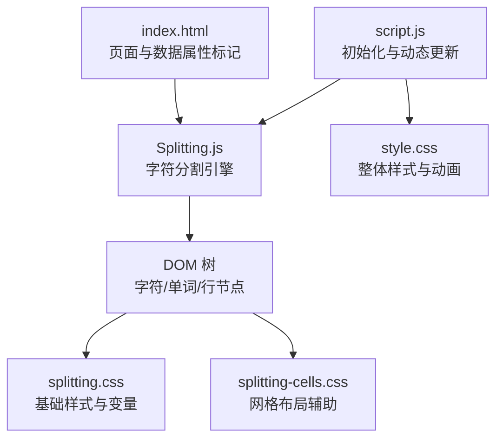
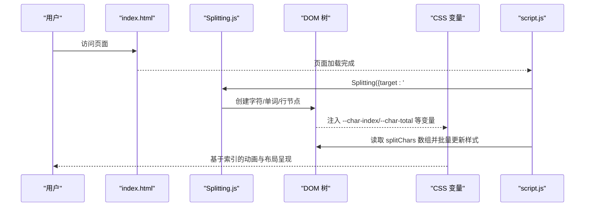
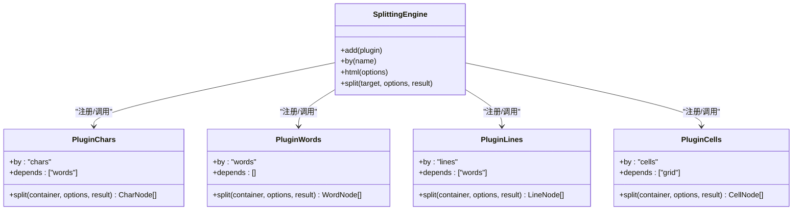
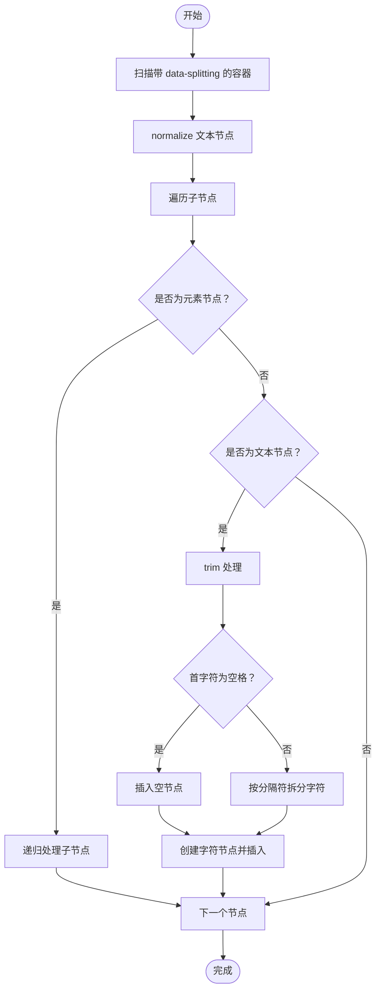
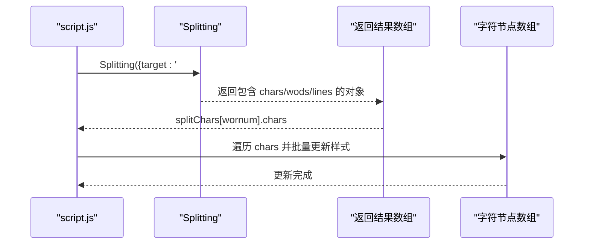
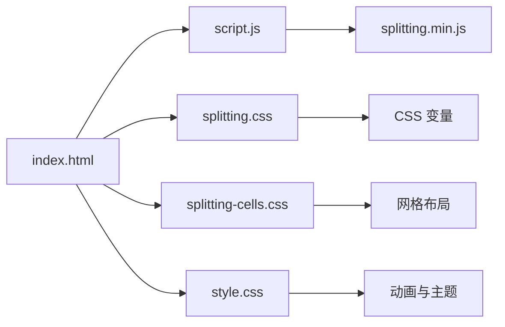

# 字符分割机制

<cite>
**本文档引用的文件**
- [index.html](file://index.html)
- [splitting.min.js](file://js/splitting.min.js)
- [splitting.css](file://styles/splitting.css)
- [splitting-cells.css](file://styles/splitting-cells.css)
- [script.js](file://js/script.js)
- [style.css](file://styles/style.css)
- [FONT-REPLACEMENT-GUIDE.md](file://FONT-REPLACEMENT-GUIDE.md)
</cite>

## 目录
1. [简介](#简介)
2. [项目结构](#项目结构)
3. [核心组件](#核心组件)
4. [架构总览](#架构总览)
5. [详细组件分析](#详细组件分析)
6. [依赖关系分析](#依赖关系分析)
7. [性能考虑](#性能考虑)
8. [故障排除指南](#故障排除指南)
9. [结论](#结论)
10. [附录](#附录)

## 简介
本技术文档围绕字符分割机制展开，系统性解析 Splitting.js 库在项目中的集成与配置，涵盖字符级 DOM 元素的创建流程、CSS 类管理、空白字符处理、字符间距控制、DOM 树结构优化、字符数组管理与索引维护、批量操作策略，以及在移动端与桌面端的差异化适配方案。同时提供性能优化建议与常见问题解决方案，帮助读者在不直接阅读源码的情况下也能高效理解和应用该机制。

## 项目结构
该项目采用“功能模块化 + 样式分离”的组织方式：
- HTML 页面负责挂载目标容器与数据属性标记，触发 Splitting 分割
- Splitting.js 提供字符级分割能力，生成独立的字符节点
- CSS 样式文件定义字符节点的布局、伪元素扩展与变量计算
- JavaScript 脚本负责初始化分割、动态更新字符样式、音频驱动与跨平台适配

图表来源
- [index.html:29-35](file://index.html#L29-L35)
- [splitting.min.js:16-18](file://js/splitting.min.js#L16-L18)
- [splitting.css:1-67](file://styles/splitting.css#L1-L67)
- [splitting-cells.css:1-56](file://styles/splitting-cells.css#L1-L56)
- [script.js:238-242](file://js/script.js#L238-L242)
- [style.css:1-162](file://styles/style.css#L1-L162)

章节来源
- [index.html:1-282](file://index.html#L1-L282)
- [splitting.min.js:1-31](file://js/splitting.min.js#L1-L31)
- [splitting.css:1-67](file://styles/splitting.css#L1-L67)
- [splitting-cells.css:1-56](file://styles/splitting-cells.css#L1-L56)
- [script.js:1-1049](file://js/script.js#L1-L1049)
- [style.css:1-1571](file://styles/style.css#L1-L1571)

## 核心组件
- Splitting.js 分割引擎：提供字符级、单词级、行级等多粒度分割能力，支持插件化扩展与依赖排序
- 字符 DOM 结构：每个字符被包装为独立的 span 节点，支持伪元素扩展与 CSS 变量注入
- CSS 变量体系：通过 --char-index、--char-total、--char-center 等变量实现基于索引的动画与布局
- JavaScript 集成层：负责初始化分割、批量更新字符样式、响应输入与音频事件、移动端/桌面端差异化处理

章节来源
- [splitting.min.js:16-18](file://js/splitting.min.js#L16-L18)
- [splitting.css:28-66](file://styles/splitting.css#L28-L66)
- [script.js:238-242](file://js/script.js#L238-L242)

## 架构总览
字符分割的端到端流程如下：
- 页面加载时，通过 data-splitting 属性标记目标容器
- 初始化阶段调用 Splitting，按需执行字符分割与 DOM 注入
- 渲染阶段，CSS 使用 CSS 变量对字符进行定位与动画
- 运行时，JavaScript 通过 splitChars 数组访问字符节点，批量更新样式

图表来源
- [index.html:29-35](file://index.html#L29-L35)
- [splitting.min.js:16-18](file://js/splitting.min.js#L16-L18)
- [splitting.css:28-66](file://styles/splitting.css#L28-L66)
- [script.js:238-242](file://js/script.js#L238-L242)

## 详细组件分析

### Splitting.js 引擎与插件系统
Splitting.js 以插件形式提供多种分割模式，核心包括：
- 字符级分割（chars）：将文本拆分为单个字符，支持空白字符处理
- 单词级分割（words）：按空白分隔生成单词容器
- 行级分割（lines）：基于 offsetTop 对子元素进行分组
- 网格布局（cells/grid）：将容器切分为 cell-grid，支持行列分组

其内部机制要点：
- 插件注册与依赖排序：通过依赖列表确保执行顺序正确
- DOM 规范化与片段构建：先 normalize 再创建 DocumentFragment，最后一次性注入
- 空白字符处理：trim 后若首尾存在空格则插入空节点，保证 DOM 结构与视觉一致
- CSS 变量注入：为每个字符注入 --char-index 与 --char-total，为容器注入 --word-total、--line-total 等

图表来源
- [splitting.min.js:5-11](file://js/splitting.min.js#L5-L11)
- [splitting.min.js:16-18](file://js/splitting.min.js#L16-L18)
- [splitting.min.js:24-29](file://js/splitting.min.js#L24-L29)

章节来源
- [splitting.min.js:1-31](file://js/splitting.min.js#L1-L31)

### 字符级 DOM 元素创建与 CSS 类管理
- 数据属性标记：HTML 中通过 data-splitting 标记目标容器，Splitting 会自动扫描并处理
- 字符节点生成：每个字符被包装为 span，className 为 "char"；空白字符作为独立节点插入
- CSS 类与变量：容器添加 "splitting" 类，字符节点添加 "char" 类；CSS 变量用于索引与中心点计算
- 伪元素扩展：通过 ::before/::after 伪元素承载字符内容，便于实现扩展动画效果

图表来源
- [splitting.min.js:11-16](file://js/splitting.min.js#L11-L16)
- [splitting.css:2-26](file://styles/splitting.css#L2-L26)

章节来源
- [index.html:29-35](file://index.html#L29-L35)
- [splitting.css:2-26](file://styles/splitting.css#L2-L26)
- [splitting.min.js:11-16](file://js/splitting.min.js#L11-L16)

### whitespace 处理与字符间距控制
- 空白字符处理：首尾空格会被识别并插入空节点，确保视觉与 DOM 结构一致
- 间距控制：通过 CSS 伪元素与 margin-left 实现字符间距，如示例中使用空白节点配合 margin-left
- CSS 变量驱动：利用 --char-index 与 --char-total 计算相对位置，实现基于索引的动画延迟与位移

章节来源
- [splitting.min.js:14-15](file://js/splitting.min.js#L14-L15)
- [splitting.css:49-66](file://styles/splitting.css#L49-L66)
- [script.js:230-231](file://js/script.js#L230-L231)

### DOM 树结构优化
- DocumentFragment 注入：先构建 DocumentFragment，再一次性注入容器，减少回流与重绘
- 节点规范化：在分割前 normalize，避免碎片化文本节点影响分割结果
- 依赖排序：插件按依赖顺序执行，确保上层结构（如单词）先于下层结构（如字符）生成

章节来源
- [splitting.min.js:11-12](file://js/splitting.min.js#L11-L12)
- [splitting.min.js:6-11](file://js/splitting.min.js#L6-L11)

### 字符数组管理与索引维护
- splitChars 数组：脚本中通过 Splitting 返回的结果数组，按顺序保存每个分割后的字符节点集合
- 索引管理：CSS 变量 --char-index 与 --char-total 由引擎注入，JS 可通过读取这些变量或直接遍历数组进行批量操作
- 批量操作策略：在 draw 循环中统一读取 splitChars[wornum].chars.length，按索引批量更新每个字符的样式属性（如字体轴、变换）

图表来源
- [script.js:311-311](file://js/script.js#L311-L311)
- [script.js:409-415](file://js/script.js#L409-L415)

章节来源
- [script.js:25-27](file://js/script.js#L25-L27)
- [script.js:311-311](file://js/script.js#L311-L311)
- [script.js:409-415](file://js/script.js#L409-L415)

### 移动端与桌面端适配
- 设备检测：通过 user agent 与屏幕尺寸判断移动端，设置不同的阈值与交互方式
- 事件差异：移动端使用 touchstart/touchmove/touchend，桌面端使用 mousedown/mouseup/click
- 交互阈值：移动端麦克风阈值更高，适应环境噪声；滑条交互在移动端与桌面端分别映射不同范围
- UI 布局：移动端隐藏部分工具提示与导航，避免遮挡；桌面端保持完整信息展示

章节来源
- [script.js:437-464](file://js/script.js#L437-L464)
- [script.js:466-538](file://js/script.js#L466-L538)
- [script.js:1006-1012](file://js/script.js#L1006-L1012)

### 字体与可变轴集成
- 可变字体轴：通过 font-variation-settings 控制 hght、ital、vrsb 等轴，实现声音驱动的动态排版
- CSS 动画：结合 @keyframes 与 CSS 变量，实现字符级动画延迟与位移
- 字体替换指南：提供完整的字体替换步骤与轴参数映射建议，确保兼容性与效果

章节来源
- [style.css:209-275](file://styles/style.css#L209-L275)
- [script.js:409-415](file://js/script.js#L409-L415)
- [FONT-REPLACEMENT-GUIDE.md:1-263](file://FONT-REPLACEMENT-GUIDE.md#L1-L263)

## 依赖关系分析
- HTML 依赖 Splitting.js 与样式表
- Splitting.js 依赖 DOM API 与 CSS 变量机制
- script.js 依赖 Splitting 返回的数组与 CSS 变量
- 样式文件依赖 CSS 变量与伪元素

图表来源
- [index.html:10-13](file://index.html#L10-L13)
- [splitting.min.js:1-31](file://js/splitting.min.js#L1-L31)
- [splitting.css:1-67](file://styles/splitting.css#L1-L67)
- [splitting-cells.css:1-56](file://styles/splitting-cells.css#L1-L56)
- [style.css:1-162](file://styles/style.css#L1-L162)

章节来源
- [index.html:1-282](file://index.html#L1-L282)
- [splitting.min.js:1-31](file://js/splitting.min.js#L1-L31)
- [splitting.css:1-67](file://styles/splitting.css#L1-L67)
- [splitting-cells.css:1-56](file://styles/splitting-cells.css#L1-L56)
- [style.css:1-1571](file://styles/style.css#L1-L1571)

## 性能考虑
- DOM 操作优化
  - 使用 DocumentFragment 一次性注入，避免多次回流
  - 尽量批量更新样式，减少样式查询与写入次数
- 内存管理
  - 合理缓存 splitChars 数组，避免重复查询 DOM
  - 在不需要时及时释放对 DOM 节点的引用
- 渲染性能提升
  - 利用 CSS 变量与伪元素，减少 JS 对复杂样式的直接操作
  - 限制动画数量与复杂度，优先使用 transform 与 opacity
- 设备差异化
  - 移动端降低动画强度与频率，使用更宽松的阈值
  - 避免在低端设备上启用高成本的滤镜或阴影

[本节为通用性能指导，无需特定文件引用]

## 故障排除指南
- 分割未生效
  - 检查目标容器是否带有 data-splitting 属性
  - 确认 Splitting 已正确加载且初始化调用成功
- 字符间距异常
  - 确认空白字符处理逻辑是否启用（whitespace: true）
  - 检查 CSS 中 margin-left 与伪元素的使用
- 动画不流畅
  - 检查是否存在过多 DOM 查询与样式写入
  - 确认 CSS 变量是否正确注入，索引是否连续
- 移动端交互异常
  - 检查触摸事件绑定与设备检测逻辑
  - 确认移动端阈值与滑条映射范围合理

章节来源
- [index.html:29-35](file://index.html#L29-L35)
- [script.js:238-242](file://js/script.js#L238-L242)
- [splitting.min.js:14-15](file://js/splitting.min.js#L14-L15)

## 结论
本项目通过 Splitting.js 实现了高效的字符级分割与渲染，结合 CSS 变量与伪元素，提供了灵活而强大的动态排版能力。脚本层通过 splitChars 数组实现了对字符节点的集中管理与批量更新，配合移动端/桌面端差异化适配，确保在多设备上的一致体验。遵循本文档的性能优化建议与故障排除方法，可进一步提升系统的稳定性与表现力。

[本节为总结性内容，无需特定文件引用]

## 附录

### 使用示例与最佳实践
- 基础使用
  - 在目标容器上添加 data-splitting 属性
  - 调用 Splitting({ target: '#container', whitespace: true })
  - 通过 splitChars 访问字符数组并批量更新样式
- 动画与交互
  - 使用 CSS 变量 --char-index 实现字符级延迟
  - 结合 font-variation-settings 与 transform 实现动态效果
  - 移动端使用触摸事件，桌面端使用鼠标事件
- 字体替换
  - 按照 FONT-REPLACEMENT-GUIDE.md 的步骤替换字体并调整轴参数映射

章节来源
- [index.html:29-35](file://index.html#L29-L35)
- [script.js:238-242](file://js/script.js#L238-L242)
- [style.css:209-275](file://styles/style.css#L209-L275)
- [FONT-REPLACEMENT-GUIDE.md:27-128](file://FONT-REPLACEMENT-GUIDE.md#L27-L128)