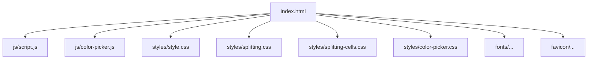
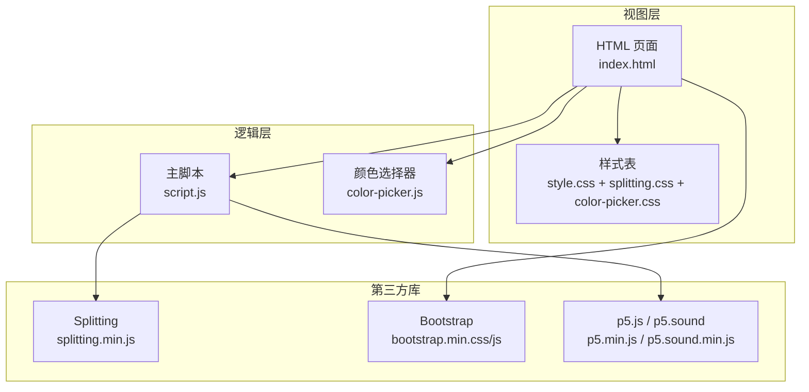
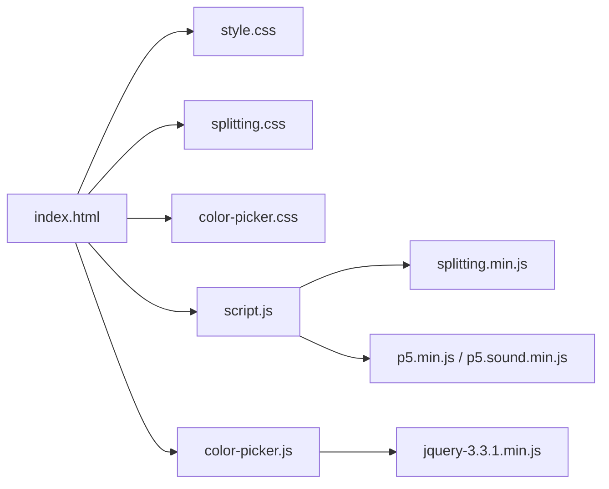

# 代码规范

<cite>
**本文引用的文件**
- [index.html](file://index.html)
- [script.js](file://js/script.js)
- [color-picker.js](file://js/color-picker.js)
- [style.css](file://styles/style.css)
- [splitting.css](file://styles/splitting.css)
- [splitting-cells.css](file://styles/splitting-cells.css)
- [color-picker.css](file://styles/color-picker.css)
- [FONT-REPLACEMENT-GUIDE.md](file://FONT-REPLACEMENT-GUIDE.md)
</cite>

## 目录
1. [简介](#简介)
2. [项目结构](#项目结构)
3. [核心组件](#核心组件)
4. [架构总览](#架构总览)
5. [详细组件分析](#详细组件分析)
6. [依赖关系分析](#依赖关系分析)
7. [性能考虑](#性能考虑)
8. [故障排查指南](#故障排查指南)
9. [结论](#结论)
10. [附录](#附录)

## 简介
本规范文档基于仓库现有代码，总结并提炼出一套适用于该项目的前端编码标准，涵盖：
- JavaScript 编码规范（变量命名、函数声明、注释、缩进）
- CSS 命名约定与组织结构（类名前缀、BEM 方法论、样式分层）
- HTML 结构规范（语义化标签、属性排序、可访问性）
- ES6+ 语法使用建议（箭头函数、模板字符串、模块导入导出）
- 代码格式化工具配置建议（Prettier、ESLint）
- 代码审查检查清单与质量保证标准

本规范旨在统一团队开发风格，提升可维护性与一致性，并与现有代码风格保持一致。

## 项目结构
项目采用“按功能/资源类型”组织的扁平结构：
- 根目录包含入口页面与图标资源
- js 目录存放脚本文件（含第三方库）
- styles 目录存放样式文件（含第三方样式）
- FONT-REPLACEMENT-GUIDE.md 提供字体替换与可变轴参数说明

图表来源
- [index.html](file://index.html)
- [script.js](file://js/script.js)
- [color-picker.js](file://js/color-picker.js)
- [style.css](file://styles/style.css)
- [splitting.css](file://styles/splitting.css)
- [splitting-cells.css](file://styles/splitting-cells.css)
- [color-picker.css](file://styles/color-picker.css)

章节来源
- [index.html](file://index.html)
- [script.js](file://js/script.js)
- [color-picker.js](file://js/color-picker.js)
- [style.css](file://styles/style.css)
- [splitting.css](file://styles/splitting.css)
- [splitting-cells.css](file://styles/splitting-cells.css)
- [color-picker.css](file://styles/color-picker.css)

## 核心组件
- HTML 入口与结构：负责页面骨架、语义化标签使用、可访问性属性、事件绑定与第三方资源加载顺序
- JavaScript 主逻辑：音频处理、文本拆分与动画、菜单与颜色选择器交互、移动端适配
- CSS 样式体系：基础布局、动画关键帧、颜色选择器、Splitting 插件样式扩展
- 字体与可变轴：通过可变字体轴参数驱动动态排版，需遵循统一的命名与映射策略

章节来源
- [index.html](file://index.html)
- [script.js](file://js/script.js)
- [color-picker.js](file://js/color-picker.js)
- [style.css](file://styles/style.css)
- [splitting.css](file://styles/splitting.css)
- [splitting-cells.css](file://styles/splitting-cells.css)
- [color-picker.css](file://styles/color-picker.css)
- [FONT-REPLACEMENT-GUIDE.md](file://FONT-REPLACEMENT-GUIDE.md)

## 架构总览
整体采用“HTML 结构 + CSS 样式 + JS 逻辑”的三层架构，配合第三方库（Splitting、Bootstrap、p5.js 等）实现动态排版与音频可视化。

图表来源
- [index.html](file://index.html)
- [script.js](file://js/script.js)
- [color-picker.js](file://js/color-picker.js)
- [style.css](file://styles/style.css)
- [splitting.css](file://styles/splitting.css)
- [color-picker.css](file://styles/color-picker.css)

## 详细组件分析

### HTML 结构规范
- 语义化标签使用
  - 使用语义化容器与导航结构，如 nav、ul/li、main 等
  - 避免滥用 div，优先选择具有明确含义的元素
- 属性排序
  - 建议按“结构/标识 → 行为/交互 → 样式/外观”的顺序排列属性
  - 例如：id/class → type/role/aria-* → data-* → src/href/style
- 可访问性要求
  - 对交互元素提供 role、aria-* 属性（如 modal 的 aria-labelledby/aria-hidden）
  - 对按钮提供 type="button"，避免默认提交行为
  - 对 SVG 图标提供可读性描述或隐藏文本
- 事件与脚本加载
  - 将脚本置于 body 底部，确保 DOM 已就绪
  - 对第三方库按需引入，避免阻塞主线程

章节来源
- [index.html](file://index.html)

### CSS 命名约定与组织结构
- 类名前缀
  - 组件级类名使用前缀区分作用域，如“.menu-”、“.modal-”、“.tutorial-”
  - 颜色相关类名统一使用“.st0/.st1/.st6/.st7”等语义化前缀
- BEM 方法论应用
  - 基础块：.menu、.modal、.tutorial
  - 元素：.menu__item、.modal__dialog、.tutorial__tooltip
  - 修饰符：.menu--active、.modal--open、.tutorial--hidden
- 样式组织结构
  - 分层：基础样式（reset/normalize）、组件样式（模块化）、工具类（utility）
  - 文件拆分：基础样式集中于 style.css；插件样式拆分至 splitting.css、color-picker.css
  - 变量与动画：将关键帧与 CSS 变量集中管理，便于主题切换与字体替换
- 可变轴参数
  - 通过 CSS 变量与 JavaScript 动态设置 font-variation-settings，确保字体轴映射一致

章节来源
- [style.css](file://styles/style.css)
- [splitting.css](file://styles/splitting.css)
- [splitting-cells.css](file://styles/splitting-cells.css)
- [color-picker.css](file://styles/color-picker.css)
- [FONT-REPLACEMENT-GUIDE.md](file://FONT-REPLACEMENT-GUIDE.md)

### JavaScript 编码规范
- 变量命名
  - 全局变量使用描述性名词，如 container、elInput、micSlider
  - 常量使用全大写下划线风格，如 MAX_VALUE、DEFAULT_COLOR
  - 私有变量或内部状态使用前缀下划线，如 _privateVar
- 函数声明
  - 常用函数使用函数声明形式，便于提升与复用
  - 回调与事件处理器使用具名函数，提高可读性与调试能力
- 注释格式
  - 使用单行注释说明变量用途与关键逻辑
  - 使用块注释说明复杂算法或跨文件协作点
- 缩进与空格
  - 统一使用 2 空格缩进，避免混用 tab 与空格
  - 操作符两侧保留空格，逗号后保留空格
- ES6+ 语法建议
  - 使用 const/let 替代 var
  - 使用模板字符串拼接字符串
  - 使用箭头函数简化回调
  - 使用解构赋值提取对象属性
  - 使用模块化导入导出（若引入构建流程）

章节来源
- [script.js](file://js/script.js)
- [color-picker.js](file://js/color-picker.js)

### ES6+ 语法使用指南
- 箭头函数
  - 用于简短回调与事件处理，避免 this 绑定问题
  - 避免在构造函数或需要 arguments 的场景使用
- 模板字符串
  - 用于拼接 HTML 片段与动态属性值，提升可读性
- 模块导入导出
  - 若引入打包工具，建议使用 ES Module 导入第三方库与自定义模块
  - 保持导入顺序与分组（第三方库、内部模块、样式）

章节来源
- [script.js](file://js/script.js)
- [color-picker.js](file://js/color-picker.js)

### 代码格式化工具配置建议
- Prettier
  - 规则：单引号、尾逗号、2 空格缩进、无分号
  - 覆盖范围：JS、CSS、HTML
- ESLint
  - 规则：禁用 var、强制使用 const/let、禁止未使用变量、禁止魔法数字
  - 与 Prettier 协同：使用 eslint-config-prettier 关闭冲突规则
  - 额外建议：启用 plugin:import/recommended（若使用模块化）

章节来源
- [script.js](file://js/script.js)
- [style.css](file://styles/style.css)

### 代码审查检查清单
- HTML
  - 语义化标签使用是否合理
  - 属性排序是否一致
  - 可访问性属性是否完整
- CSS
  - 类名是否遵循 BEM 前缀规范
  - 动画与关键帧是否集中管理
  - 变量与可变轴参数是否统一
- JavaScript
  - 变量命名是否清晰
  - 函数职责是否单一
  - 是否使用 ES6+ 语法优化
  - 是否存在未捕获异常与潜在性能问题
- 性能
  - 是否避免重复查询 DOM
  - 是否减少重绘与回流
  - 是否按需加载第三方库

章节来源
- [index.html](file://index.html)
- [script.js](file://js/script.js)
- [color-picker.js](file://js/color-picker.js)
- [style.css](file://styles/style.css)

## 依赖关系分析
- HTML 依赖多个样式与脚本文件，需注意加载顺序与缓存策略
- 主脚本依赖 Splitting 与 p5.js，颜色选择器依赖 jQuery
- 字体替换影响 CSS 关键帧与 JS 动态参数映射，需同步更新

图表来源
- [index.html](file://index.html)
- [script.js](file://js/script.js)
- [color-picker.js](file://js/color-picker.js)
- [style.css](file://styles/style.css)
- [splitting.css](file://styles/splitting.css)
- [color-picker.css](file://styles/color-picker.css)

章节来源
- [index.html](file://index.html)
- [script.js](file://js/script.js)
- [color-picker.js](file://js/color-picker.js)
- [style.css](file://styles/style.css)
- [splitting.css](file://styles/splitting.css)
- [color-picker.css](file://styles/color-picker.css)

## 性能考虑
- DOM 查询与缓存
  - 将频繁查询的节点缓存到局部变量，避免重复查询
- 动画与渲染
  - 使用 transform 与 opacity 控制动画，避免触发布局与重绘
  - 合理使用 requestAnimationFrame 与节流/防抖
- 字体与可变轴
  - 可变轴参数映射应与字体实际轴范围匹配，避免无效计算
- 资源加载
  - 将非关键脚本延迟加载，减少首屏阻塞

章节来源
- [script.js](file://js/script.js)
- [style.css](file://styles/style.css)
- [FONT-REPLACEMENT-GUIDE.md](file://FONT-REPLACEMENT-GUIDE.md)

## 故障排查指南
- 字体替换后动画异常
  - 检查 CSS 关键帧中的轴标签与范围是否与新字体一致
  - 检查 JS 中 fontVariationSettings 的映射范围是否调整
- 颜色选择器不生效
  - 确认 jQuery 已加载且颜色列表初始化完成
  - 检查 active/disabled 样式是否正确应用
- 移动端交互异常
  - 确认触摸事件与点击事件的兼容处理
  - 检查 isMobile 判断逻辑与阈值设置

章节来源
- [color-picker.js](file://js/color-picker.js)
- [style.css](file://styles/style.css)
- [FONT-REPLACEMENT-GUIDE.md](file://FONT-REPLACEMENT-GUIDE.md)

## 结论
本规范在现有代码基础上提炼出统一的编码风格与最佳实践，覆盖 HTML、CSS、JS 三大层面，并结合字体替换与可变轴参数的实际需求，形成可执行的质量标准与审查清单。建议在后续迭代中逐步引入构建工具链（打包、ESLint、Prettier），以自动化保障代码质量与一致性。

## 附录
- 示例：正确的变量命名与函数声明
  - 使用描述性变量名与常量命名
  - 使用具名函数与箭头函数优化回调
- 示例：正确的类名与 BEM 结构
  - 使用前缀区分作用域
  - 使用块__元素--修饰符的层级结构
- 示例：正确的 HTML 属性排序与可访问性
  - 按结构/标识 → 行为/交互 → 样式/外观排序
  - 为交互元素提供 aria-* 与 role 属性