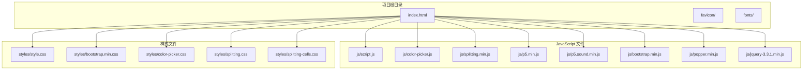
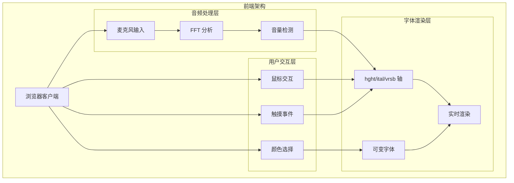
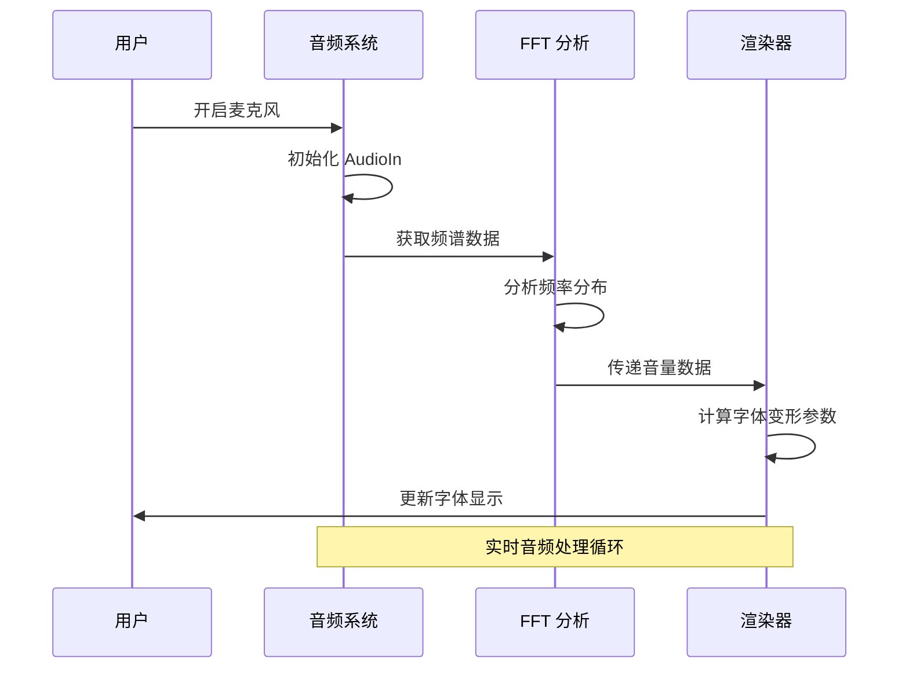
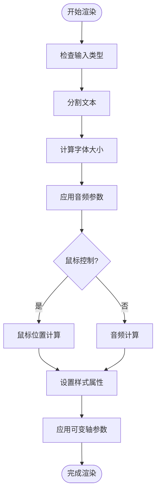
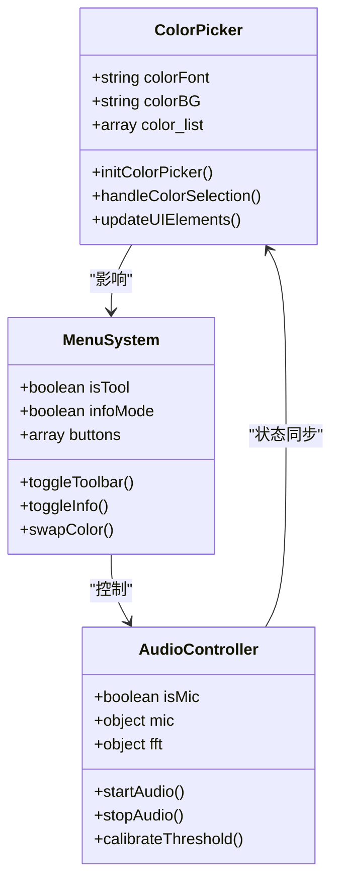
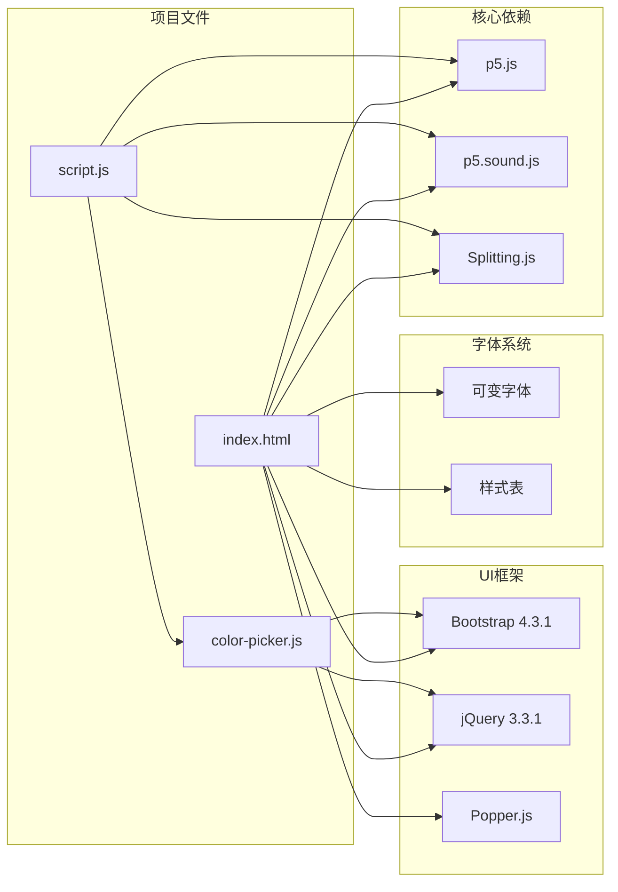

# 开发环境配置

<cite>
**本文档引用的文件**
- [index.html](file://index.html)
- [script.js](file://js/script.js)
- [style.css](file://styles/style.css)
- [color-picker.js](file://js/color-picker.js)
- [splitting.min.js](file://js/splitting.min.js)
- [p5.min.js](file://js/p5.min.js)
- [p5.sound.min.js](file://js/p5.sound.min.js)
- [FONT-REPLACEMENT-GUIDE.md](file://FONT-REPLACEMENT-GUIDE.md)
</cite>

## 目录
1. [项目概述](#项目概述)
2. [项目结构](#项目结构)
3. [核心组件](#核心组件)
4. [架构概览](#架构概览)
5. [详细组件分析](#详细组件分析)
6. [依赖关系分析](#依赖关系分析)
7. [性能考虑](#性能考虑)
8. [故障排除指南](#故障排除指南)
9. [结论](#结论)

## 项目概述

MySymphosizer 是一个基于 Web 的动态字体可视化项目，通过麦克风输入和鼠标交互驱动字体变形动画。该项目展示了现代 Web 技术在音频可视化和动态排版方面的应用。

## 项目结构

**图表来源**
- [index.html:1-282](file://index.html#L1-L282)
- [script.js:1-1049](file://js/script.js#L1-L1049)
- [style.css:1-1571](file://styles/style.css#L1-L1571)

**章节来源**
- [index.html:1-282](file://index.html#L1-L282)
- [script.js:1-1049](file://js/script.js#L1-L1049)
- [style.css:1-1571](file://styles/style.css#L1-L1571)

## 核心组件

### 音频处理系统
项目使用 p5.js 和 p5.sound.js 提供完整的音频处理能力，包括：
- 麦克风输入捕获
- FFT 频谱分析
- 实时音频可视化
- 音量检测和响应

### 动态字体系统
通过可变字体轴参数实现动态字体变形：
- `hght` 轴：控制字形高度比例
- `ital` 轴：控制倾斜程度  
- `vrsb` 轴：控制文字方向/翻转

### 用户界面系统
集成 Bootstrap 4.3.1 提供现代化的用户界面组件，包括：
- 响应式菜单系统
- 颜色选择器
- 模态对话框
- 响应式布局

**章节来源**
- [script.js:1-1049](file://js/script.js#L1-L1049)
- [style.css:1-1571](file://styles/style.css#L1-L1571)
- [color-picker.js:1-231](file://js/color-picker.js#L1-L231)

## 架构概览

**图表来源**
- [script.js:1-1049](file://js/script.js#L1-L1049)
- [p5.min.js:1-3](file://js/p5.min.js#L1-L3)
- [p5.sound.min.js:1-3](file://js/p5.sound.min.js#L1-L3)

## 详细组件分析

### 音频处理组件

**图表来源**
- [script.js:178-426](file://js/script.js#L178-L426)
- [p5.sound.min.js:1-3](file://js/p5.sound.min.js#L1-L3)

音频处理流程包括：
1. **初始化阶段**：设置音频上下文和麦克风输入
2. **实时分析**：每帧执行 FFT 分析
3. **参数计算**：将音频数据转换为字体变形参数
4. **渲染更新**：应用新的字体样式到页面元素

**章节来源**
- [script.js:178-426](file://js/script.js#L178-L426)

### 字体渲染组件

**图表来源**
- [script.js:301-426](file://js/script.js#L301-L426)
- [splitting.min.js:1-31](file://js/splitting.min.js#L1-L31)

字体渲染流程：
1. **文本分割**：使用 Splitting.js 将文本分解为字符级别
2. **参数计算**：根据音频和用户输入计算变形参数
3. **样式应用**：设置字体大小、倾斜度等属性
4. **轴参数应用**：通过 `font-variation-settings` 应用可变轴

**章节来源**
- [script.js:301-426](file://js/script.js#L301-L426)
- [splitting.min.js:1-31](file://js/splitting.min.js#L1-L31)

### 用户界面组件

**图表来源**
- [color-picker.js:1-231](file://js/color-picker.js#L1-L231)
- [script.js:540-770](file://js/script.js#L540-L770)

**章节来源**
- [color-picker.js:1-231](file://js/color-picker.js#L1-L231)
- [script.js:540-770](file://js/script.js#L540-L770)

## 依赖关系分析

**图表来源**
- [index.html:1-282](file://index.html#L1-L282)
- [script.js:1-1049](file://js/script.js#L1-L1049)
- [color-picker.js:1-231](file://js/color-picker.js#L1-L231)

**章节来源**
- [index.html:1-282](file://index.html#L1-L282)

## 性能考虑

### 渲染性能优化
- **帧率控制**：使用 `frameRate(60)` 确保稳定的 60FPS 渲染
- **DOM 操作最小化**：批量更新样式属性而非逐个元素操作
- **内存管理**：及时清理音频上下文和事件监听器

### 音频处理优化
- **采样率适配**：根据设备能力调整音频采样率
- **频谱分析缓存**：复用之前的计算结果减少重复运算
- **阈值校准**：自适应麦克风灵敏度设置

### 字体渲染优化
- **CSS 变量**：使用 CSS 变量存储动态参数提高渲染效率
- **硬件加速**：利用 GPU 加速字体变形动画
- **响应式设计**：针对不同设备优化渲染策略

## 故障排除指南

### 常见问题及解决方案

#### 麦克风权限问题
**症状**：音频功能无法使用
**解决方案**：
1. 确认浏览器支持 Web Audio API
2. 检查 HTTPS 环境下的安全策略
3. 验证麦克风设备可用性

#### 字体显示异常
**症状**：可变字体不生效或显示错误
**解决方案**：
1. 检查字体文件加载状态
2. 验证 `font-variation-settings` 兼容性
3. 确认浏览器对可变字体的支持

#### 性能问题
**症状**：页面卡顿或动画不流畅
**解决方案**：
1. 检查帧率和渲染时间
2. 优化 DOM 结构和样式复杂度
3. 减少不必要的重绘和回流

#### 移动设备兼容性
**症状**：触摸事件响应异常
**解决方案**：
1. 检查触摸事件绑定
2. 验证移动端浏览器支持
3. 实施适当的触摸手势处理

**章节来源**
- [script.js:162-192](file://js/script.js#L162-L192)
- [FONT-REPLACEMENT-GUIDE.md:1-263](file://FONT-REPLACEMENT-GUIDE.md#L1-L263)

## 结论

MySymphosizer 展示了现代 Web 技术在创意编程和音频可视化领域的强大能力。通过合理的架构设计和性能优化，该项目实现了流畅的音频驱动字体动画效果。

### 关键特性总结
- **实时音频处理**：基于 Web Audio API 的高质量音频分析
- **动态字体渲染**：利用可变字体轴实现复杂的视觉效果
- **响应式交互**：支持鼠标和触摸等多种输入方式
- **跨平台兼容**：适配桌面和移动设备的浏览器环境

### 技术亮点
- **模块化架构**：清晰的组件分离和职责划分
- **性能优化**：针对 Web 环境的专门优化策略
- **用户体验**：直观的界面设计和流畅的交互体验
- **可扩展性**：良好的代码结构便于功能扩展和维护

该项目为 Web 音频可视化和动态排版提供了优秀的参考实现，展示了现代前端技术的无限可能性。