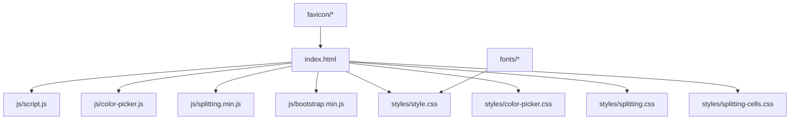
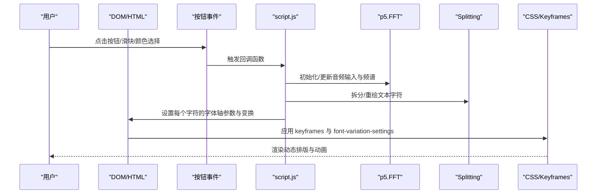
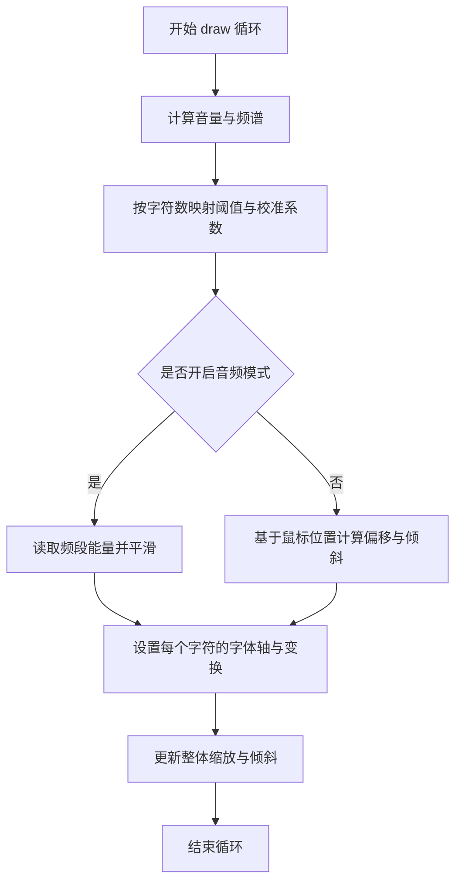
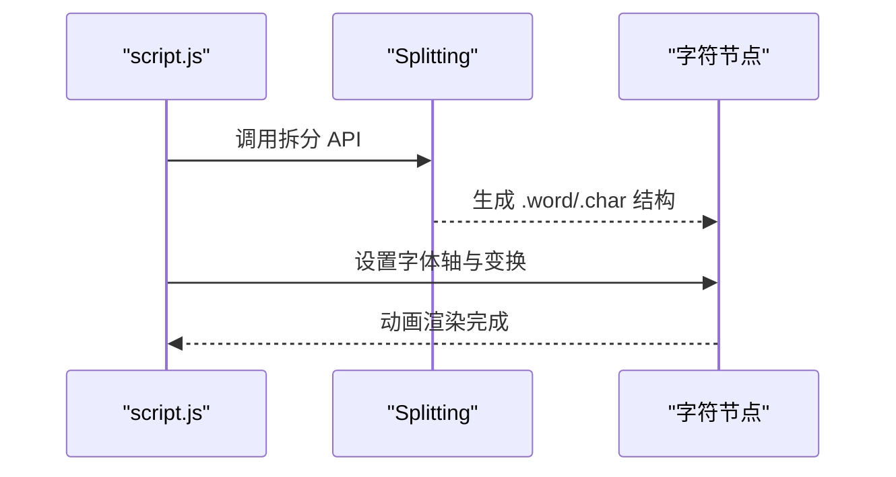
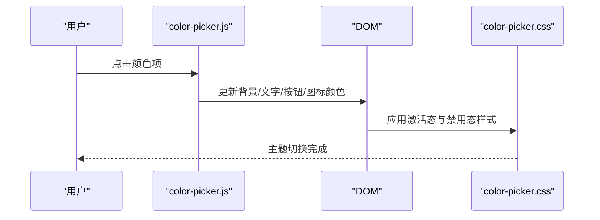
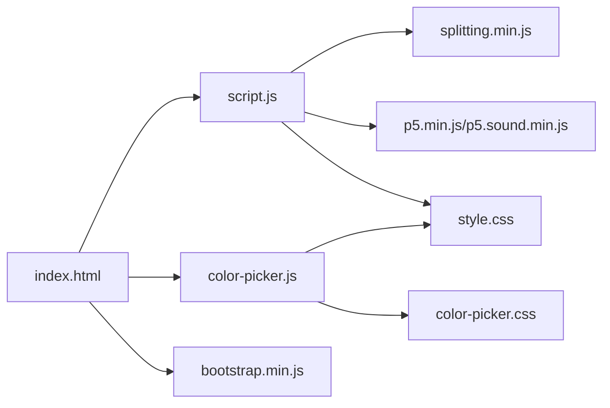

# 开发者指南

<cite>
**本文引用的文件**
- [index.html](file://index.html)
- [script.js](file://js/script.js)
- [style.css](file://styles/style.css)
- [color-picker.js](file://js/color-picker.js)
- [color-picker.css](file://styles/color-picker.css)
- [splitting.css](file://styles/splitting.css)
- [splitting-cells.css](file://styles/splitting-cells.css)
- [splitting.min.js](file://js/splitting.min.js)
- [bootstrap.min.js](file://js/bootstrap.min.js)
- [FONT-REPLACEMENT-GUIDE.md](file://FONT-REPLACEMENT-GUIDE.md)
</cite>

## 目录
1. [简介](#简介)
2. [项目结构](#项目结构)
3. [核心组件](#核心组件)
4. [架构总览](#架构总览)
5. [详细组件分析](#详细组件分析)
6. [依赖关系分析](#依赖关系分析)
7. [性能考虑](#性能考虑)
8. [故障排除指南](#故障排除指南)
9. [结论](#结论)
10. [附录](#附录)

## 简介
本指南面向开发者，帮助您理解并扩展“Symphosizer”项目。项目通过可变字体与音频输入实现“声音驱动的动态排版”，结合颜色选择器、菜单交互与响应式布局，构建出沉浸式的听觉可视化体验。本文档覆盖代码规范与最佳实践、开发环境设置、扩展机制、字体替换、调试与故障排除、测试与质量保障、贡献指南以及开发工具推荐。

## 项目结构
项目采用前端静态资源组织方式，核心文件分布如下：
- HTML 页面负责页面骨架、模态框、菜单、输入与显示区域
- JS 脚本负责音频采集、频谱分析、文本拆分、动态排版与交互
- CSS 负责字体声明、动画、布局与颜色选择器样式
- 字体与图标资源位于 fonts 与 favicon 目录
- 可选的字体替换指南用于指导可变字体的迁移与参数映射

图表来源
- [index.html](file://index.html)
- [script.js](file://js/script.js)
- [style.css](file://styles/style.css)
- [color-picker.js](file://js/color-picker.js)
- [color-picker.css](file://styles/color-picker.css)
- [splitting.css](file://styles/splitting.css)
- [splitting-cells.css](file://styles/splitting-cells.css)
- [splitting.min.js](file://js/splitting.min.js)
- [bootstrap.min.js](file://js/bootstrap.min.js)

章节来源
- [index.html](file://index.html)
- [style.css](file://styles/style.css)

## 核心组件
- 音频与可视化
  - 使用 p5.AudioIn 采集音频，p5.FFT 分析频谱，实时驱动字符的可变字体轴参数与缩放、倾斜变换
  - 通过 Splitting 将文本拆分为字符级元素，逐字符应用动态样式
- 用户界面与交互
  - Bootstrap 提供模态框与基础组件；自定义菜单与颜色选择器实现主题切换与工具面板
  - 响应式布局适配桌面与移动端，移动端使用触摸事件优化
- 字体与动画
  - 通过 @font-face 引入三款字体，Display 字体为可变字体，配合 CSS keyframes 与 JS 动态设置 font-variation-settings 实现加载与播放动画
- 颜色系统
  - 内置颜色组合与颜色选择器，支持背景与文字颜色即时切换，并同步 SVG 元素颜色

章节来源
- [script.js](file://js/script.js)
- [style.css](file://styles/style.css)
- [color-picker.js](file://js/color-picker.js)
- [index.html](file://index.html)

## 架构总览
下图展示了从用户交互到视觉输出的关键调用链路与数据流。

图表来源
- [script.js](file://js/script.js)
- [style.css](file://styles/style.css)
- [index.html](file://index.html)

## 详细组件分析

### 组件A：音频与可视化管线
- 职责
  - 初始化音频输入与频谱分析器
  - 计算音量与频段能量，映射到字符的可变字体轴与几何变换
  - 驱动 Splitting 文本拆分与逐字符样式更新
- 关键流程
  - setup/preload：挂起音频上下文、尺寸检测
  - draw：循环计算平滑后的频谱与音量，按字符映射 font-variation-settings 与 transform
  - startAudio：启动麦克风与 FFT 输入
- 性能要点
  - 使用 lerp 平滑过渡，避免每帧抖动
  - 仅在非移动端时启用滑块悬停显示
  - 通过 constrain 限制字体大小与变换范围

图表来源
- [script.js](file://js/script.js)

章节来源
- [script.js](file://js/script.js)

### 组件B：文本拆分与动态排版
- 职责
  - 使用 Splitting 将字符串拆分为单词与字符层级，生成可操作的 DOM 结构
  - 通过 CSS 变量与 keyframes 实现字符级动画
- 关键点
  - 支持空白符拆分与伪元素辅助
  - CSS 变量提供字符中心、偏移与距离等计算依据
- 扩展建议
  - 新增拆分维度（如行、网格）可复用 Splitting 插件体系
  - 保持与 JS 中的 wornum/charnum 对齐，避免索引错位

图表来源
- [script.js](file://js/script.js)
- [splitting.min.js](file://js/splitting.min.js)
- [splitting.css](file://styles/splitting.css)

章节来源
- [script.js](file://js/script.js)
- [splitting.min.js](file://js/splitting.min.js)
- [splitting.css](file://styles/splitting.css)

### 组件C：颜色选择器与主题切换
- 职责
  - 提供内置颜色集合与自定义颜色入口
  - 实时更新背景、文字、按钮与 SVG 元素的颜色
- 交互流程
  - 点击颜色项 -> 更新 CSS 变量与内联样式 -> 刷新 UI 主题
- 最佳实践
  - 保持前景/背景对比度，确保可读性
  - 使用 CSS 变量集中管理颜色，便于统一切换

图表来源
- [color-picker.js](file://js/color-picker.js)
- [color-picker.css](file://styles/color-picker.css)
- [style.css](file://styles/style.css)

章节来源
- [color-picker.js](file://js/color-picker.js)
- [color-picker.css](file://styles/color-picker.css)
- [style.css](file://styles/style.css)

### 组件D：字体替换与可变轴映射
- 背景
  - Display 字体为可变字体，通过 font-variation-settings 驱动 hght、ital、vrsb 等轴
  - 项目提供详细的字体替换指南，涵盖字体声明、轴参数与动画映射的迁移步骤
- 替换流程
  - 替换 @font-face 源文件与字体族名
  - 更新 CSS keyframes 与 JS 中的 fontVariationSettings 轴标签
  - 调整映射范围以适配新字体的有效轴范围
- 验证清单
  - 加载动画、播放后渲染、鼠标交互、麦克风驱动均正常
  - 控制台无报错

章节来源
- [FONT-REPLACEMENT-GUIDE.md](file://FONT-REPLACEMENT-GUIDE.md)
- [style.css](file://styles/style.css)
- [script.js](file://js/script.js)

## 依赖关系分析
- 外部库
  - p5.js 与 p5.sound：音频采集与频域分析
  - Splitting：文本拆分
  - Bootstrap：模态框与基础组件
- 内部耦合
  - script.js 依赖 Splitting 生成的字符结构与 style.css 的 keyframes
  - color-picker.js 依赖 style.css 中的颜色与 SVG 元素
- 潜在风险
  - 音频 API 权限与上下文需在用户交互后初始化
  - 可变字体轴标签与范围需与 CSS 与 JS 同步

图表来源
- [script.js](file://js/script.js)
- [color-picker.js](file://js/color-picker.js)
- [style.css](file://styles/style.css)
- [color-picker.css](file://styles/color-picker.css)
- [splitting.min.js](file://js/splitting.min.js)
- [bootstrap.min.js](file://js/bootstrap.min.js)
- [index.html](file://index.html)

章节来源
- [script.js](file://js/script.js)
- [color-picker.js](file://js/color-picker.js)
- [style.css](file://styles/style.css)
- [index.html](file://index.html)

## 性能考虑
- 音频处理
  - 使用 lerp 平滑参数，降低高频抖动
  - 仅在需要时启用麦克风与 FFT，避免不必要的计算
- 文本渲染
  - 逐字符设置样式时尽量减少 DOM 查询次数，优先批量更新
  - 合理设置帧率与窗口尺寸监听频率
- 资源加载
  - 字体文件体积较大，建议使用现代格式（如 woff2）并按需加载
  - CSS 动画与 transform 使用 GPU 加速友好的属性

## 故障排除指南
- 麦克风权限与音频初始化
  - 确保在用户交互后调用 userStartAudio 与 mic.start
  - 若无声音输入，检查浏览器权限与设备连接
- 可变字体不生效
  - 确认字体文件格式与 @font-face 路径正确
  - 检查 JS 中 fontVariationSettings 的轴标签与 CSS keyframes 是否一致
- 动画卡顿或闪烁
  - 降低动画复杂度或减少逐字符更新频率
  - 使用浏览器开发者工具的时间线分析帧耗时
- 移动端触摸事件异常
  - 检查 isMobile 判定逻辑与触摸事件绑定
  - 确保触摸滚动与按钮点击互不冲突

章节来源
- [script.js](file://js/script.js)
- [style.css](file://styles/style.css)

## 结论
Symphosizer 通过可变字体与音频的深度融合，实现了独特的“声音驱动排版”。遵循本文的代码规范、扩展机制与调试流程，您可以安全地引入新功能、替换字体与优化性能，同时保持良好的跨平台兼容性与用户体验。

## 附录

### 开发环境设置
- 本地服务器
  - 在项目根目录启动静态服务器（如 Python http.server），访问 http://localhost:端口
- 调试工具
  - 浏览器开发者工具：Elements、Console、Performance、Network
  - 音频可视化：在 Performance 面板录制，观察音频线程与渲染帧率
- 版本控制策略
  - 使用 Git 进行版本管理，建议采用分支策略（feature/xxx、hotfix/xxx）
  - 提交信息采用清晰的类型前缀（feat:、fix:、docs:、chore:）

### 代码规范与最佳实践
- JavaScript
  - 使用常量与局部变量，避免全局污染
  - 事件绑定与解绑成对出现，防止内存泄漏
  - 错误捕获与日志记录，便于定位问题
- CSS
  - 使用 BEM 或类似命名约定，提升可维护性
  - 将动画与过渡封装为独立 keyframes，便于复用
- HTML
  - 语义化标签优先，SVG 图标使用内联或外部引用时注意可访问性

### 扩展机制
- 新功能模块开发
  - 以模块化方式组织 JS，新增功能通过事件驱动接入现有 UI
  - 为新控件编写配套样式与响应式规则
- 插件系统设计
  - 参考 Splitting 的插件注册机制，将拆分维度抽象为插件
- 第三方库集成
  - 统一通过 CDN 或 npm 管理，注意版本锁定与安全扫描

### 字体替换指南（摘要）
- 替换 Display 字体为可变字体，更新 @font-face 与字体族名
- 同步调整 CSS keyframes 与 JS 中的 fontVariationSettings 轴标签
- 根据新字体轴范围调整映射范围与动画幅度
- 使用指南中的快速测试步骤验证

章节来源
- [FONT-REPLACEMENT-GUIDE.md](file://FONT-REPLACEMENT-GUIDE.md)

### 测试策略与质量保证
- 单元测试
  - 对独立函数（如映射、平滑算法）编写小而精的测试用例
- 集成测试
  - 覆盖音频初始化、文本拆分、颜色切换与动画渲染的端到端流程
- 用户验收测试
  - 在多设备与浏览器上验证交互一致性与可访问性

### 贡献指南与开源协作
- 提交前检查
  - 代码风格符合团队规范，注释清晰
  - 本地测试通过，无控制台错误
- 提交流程
  - fork 仓库 -> 创建特性分支 -> 提交并推送 -> 发起 Pull Request -> 评审与合并

### 开发工具推荐
- 编辑器与扩展
  - VS Code + ESLint、Prettier、CSS Peek、Live Server
- 性能分析
  - Chrome DevTools、Lighthouse、WebPageTest
- 字体与图标
  - Wakamai Fondue、FontForge、SVGOMG