# UI组件扩展

<cite>
**本文档引用的文件**
- [index.html](file://index.html)
- [script.js](file://js/script.js)
- [style.css](file://styles/style.css)
- [color-picker.css](file://styles/color-picker.css)
- [splitting.css](file://styles/splitting.css)
- [splitting-cells.css](file://styles/splitting-cells.css)
- [bootstrap.min.js](file://js/bootstrap.min.js)
- [p5.min.js](file://js/p5.min.js)
- [p5.sound.min.js](file://js/p5.sound.min.js)
- [color-picker.js](file://js/color-picker.js)
</cite>

## 目录
1. [简介](#简介)
2. [项目结构](#项目结构)
3. [核心组件](#核心组件)
4. [架构概览](#架构概览)
5. [详细组件分析](#详细组件分析)
6. [依赖关系分析](#依赖关系分析)
7. [性能考虑](#性能考虑)
8. [故障排除指南](#故障排除指南)
9. [结论](#结论)
10. [附录](#附录)

## 简介

这是一个基于Web技术的交互式音频可视化应用，展示了UI组件扩展的最佳实践。该项目实现了动态文本显示、音频输入控制、颜色选择器和菜单系统等核心功能。

该文档提供了完整的UI组件扩展指南，涵盖以下关键领域：
- 新按钮类型的开发方法（SVG图标设计、交互状态管理、动画效果实现）
- 控件组件的扩展方式（滑块组件、颜色选择器、菜单系统）
- 交互模式的扩展机制（鼠标事件处理、触摸手势识别、键盘快捷键支持）
- 样式系统的扩展方法（CSS变量使用、主题切换、响应式设计适配）
- 组件间的通信机制（事件传递、状态同步、数据绑定）
- 组件测试方法（单元测试编写、可视化测试、用户体验评估）
- 组件性能优化建议（渲染优化、内存管理、事件处理优化）

## 项目结构

该项目采用模块化架构，主要由以下部分组成：

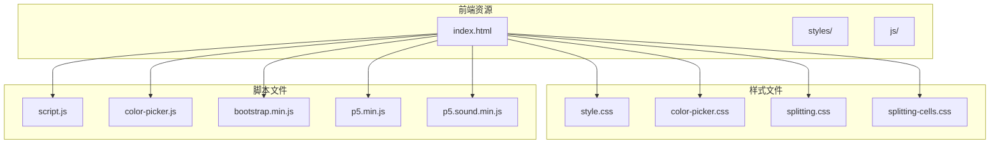

**图表来源**
- [index.html:1-282](file://index.html#L1-L282)
- [style.css:1-1573](file://styles/style.css#L1-L1573)
- [color-picker.css:1-97](file://styles/color-picker.css#L1-L97)

**章节来源**
- [index.html:1-282](file://index.html#L1-L282)
- [style.css:1-1573](file://styles/style.css#L1-L1573)

## 核心组件

### 主要组件概览

该项目包含以下核心UI组件：

1. **音频控制组件**
   - 麦克风滑块控制器
   - 音频输入管理
   - 实时音量监控

2. **颜色选择器组件**
   - 内置颜色调色板
   - 自定义颜色支持
   - 实时主题切换

3. **工具栏菜单组件**
   - 功能按钮组
   - 菜单状态管理
   - 响应式布局

4. **文本显示组件**
   - 动态文本渲染
   - 字体变体支持
   - 实时动画效果

**章节来源**
- [script.js:1-1049](file://js/script.js#L1-L1049)
- [color-picker.js:1-231](file://js/color-picker.js#L1-L231)

## 架构概览

### 整体架构设计

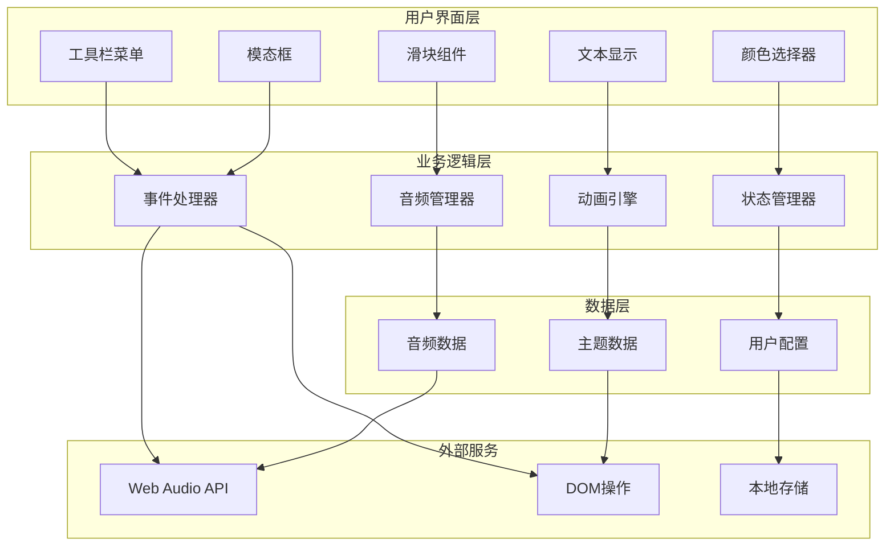

**图表来源**
- [script.js:1-1049](file://js/script.js#L1-L1049)
- [index.html:1-282](file://index.html#L1-L282)

### 数据流架构

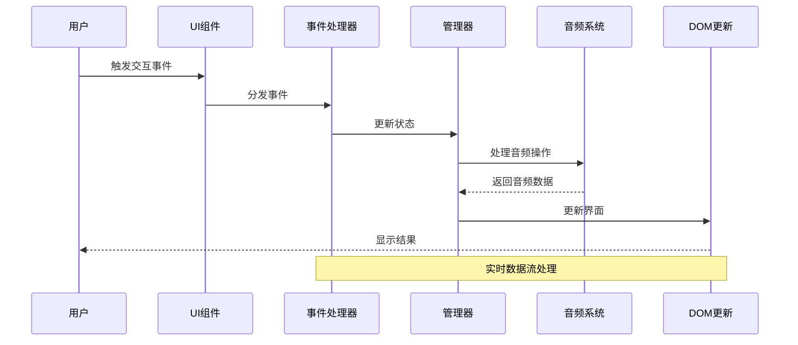

**图表来源**
- [script.js:283-426](file://js/script.js#L283-L426)
- [color-picker.js:95-175](file://js/color-picker.js#L95-L175)

## 详细组件分析

### 按钮组件扩展指南

#### SVG图标设计规范

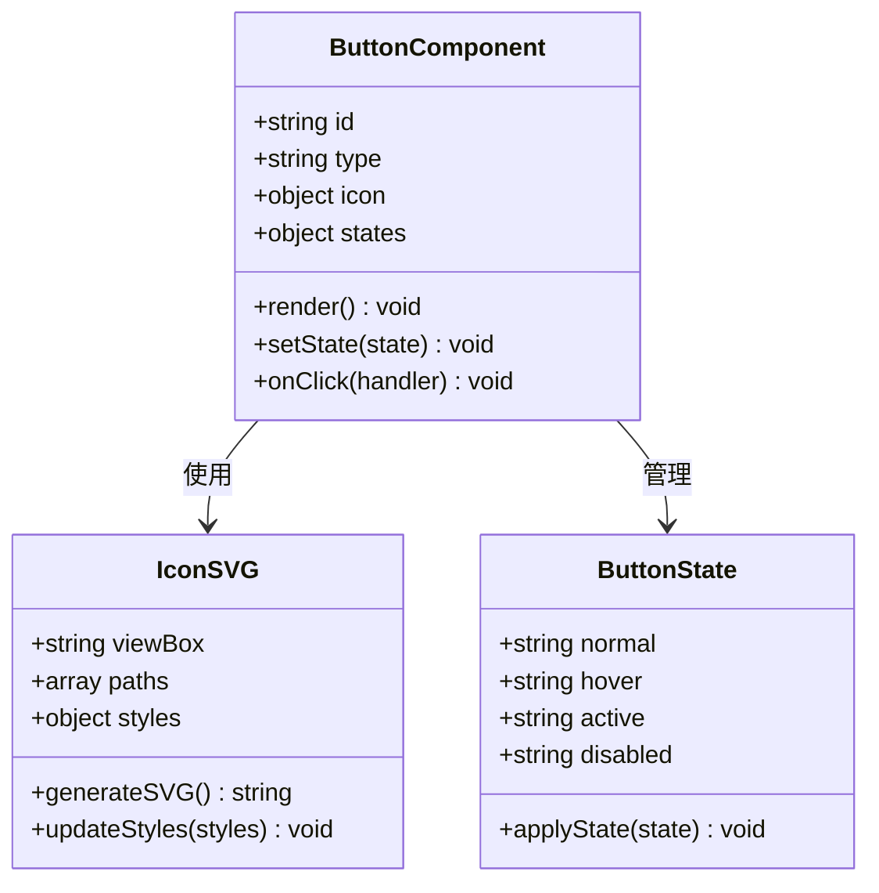

**图表来源**
- [index.html:112-120](file://index.html#L112-L120)
- [style.css:695-740](file://styles/style.css#L695-L740)

#### 交互状态管理

按钮组件的状态管理遵循以下模式：

1. **状态定义**
   - 正常状态（normal）
   - 悬停状态（hover）
   - 激活状态（active）
   - 禁用状态（disabled）

2. **状态转换流程**

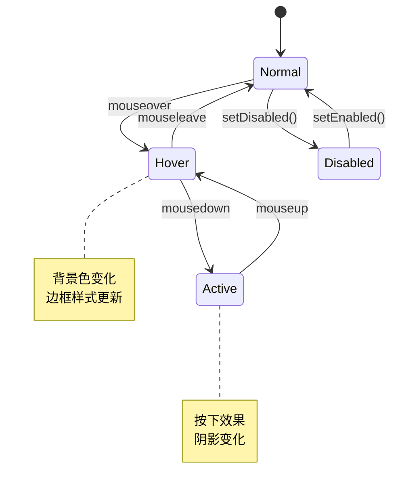

**图表来源**
- [script.js:523-538](file://js/script.js#L523-L538)
- [style.css:706-740](file://styles/style.css#L706-L740)

#### 动画效果实现

按钮动画效果通过CSS过渡和JavaScript事件驱动：

**章节来源**
- [script.js:552-743](file://js/script.js#L552-L743)
- [style.css:199-206](file://styles/style.css#L199-L206)

### 滑块组件扩展指南

#### 音频滑块实现

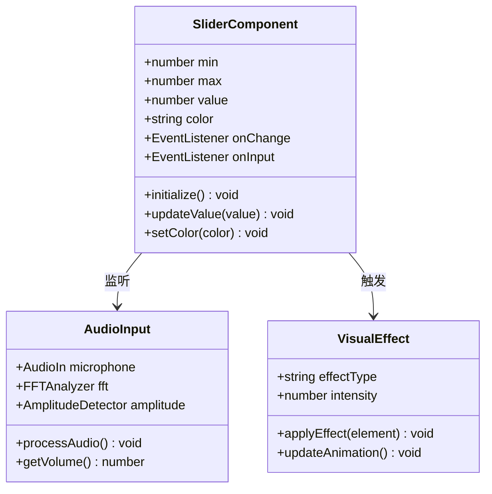

**图表来源**
- [index.html:42-51](file://index.html#L42-L51)
- [script.js:7-11](file://js/script.js#L7-L11)

#### 滑块交互模式

滑块组件支持多种交互模式：

1. **桌面端交互**
   - 鼠标拖拽
   - 鼠标悬停预览
   - 键盘快捷键支持

2. **移动端交互**
   - 触摸滑动
   - 触摸反馈
   - 响应式布局

**章节来源**
- [script.js:283-299](file://js/script.js#L283-L299)
- [style.css:113-139](file://styles/style.css#L113-L139)

### 颜色选择器组件扩展指南

#### 颜色选择器架构

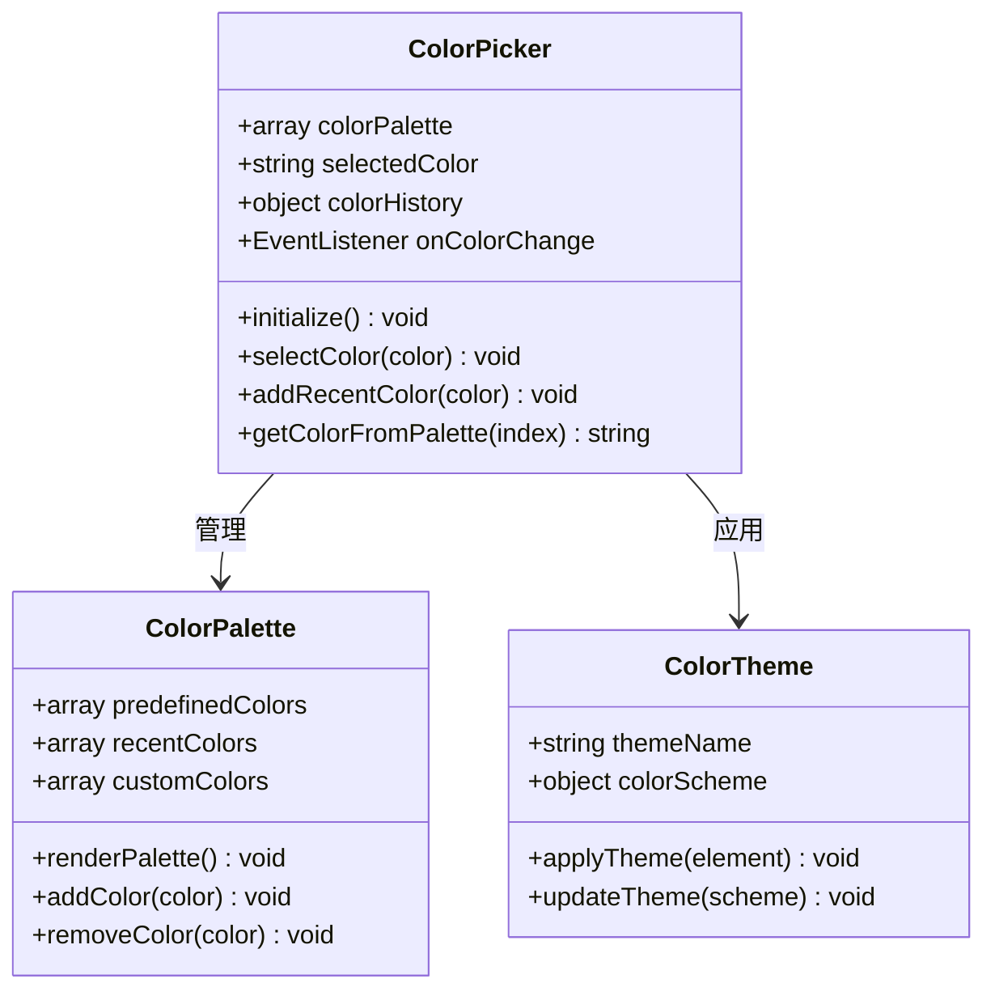

**图表来源**
- [color-picker.js:4-27](file://js/color-picker.js#L4-L27)
- [color-picker.css:1-97](file://styles/color-picker.css#L1-L97)

#### 颜色主题系统

颜色选择器支持完整的主题系统：

1. **内置主题**
   - 默认主题
   - 深色主题
   - 高对比度主题

2. **自定义主题**
   - 颜色调色板
   - 主题名称管理
   - 主题持久化

**章节来源**
- [color-picker.js:95-175](file://js/color-picker.js#L95-L175)
- [style.css:423-425](file://styles/style.css#L423-L425)

### 菜单系统扩展指南

#### 菜单架构设计

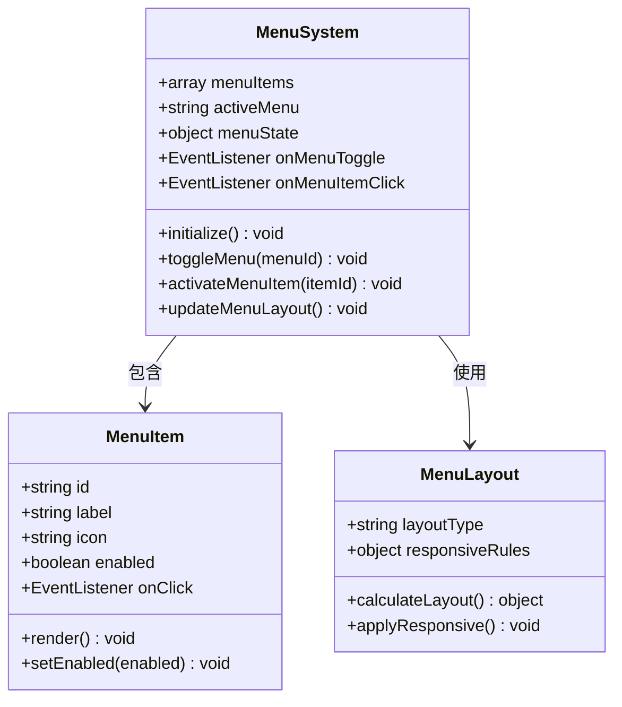

**图表来源**
- [index.html:54-178](file://index.html#L54-L178)
- [script.js:112-120](file://js/script.js#L112-L120)

#### 菜单交互模式

菜单系统支持多层级交互：

1. **基础交互**
   - 点击展开/收起
   - 悬停高亮
   - 键盘导航

2. **高级交互**
   - 拖拽排序
   - 快捷键访问
   - 动画过渡效果

**章节来源**
- [script.js:745-770](file://js/script.js#L745-L770)
- [style.css:643-686](file://styles/style.css#L643-L686)

## 依赖关系分析

### 外部依赖关系

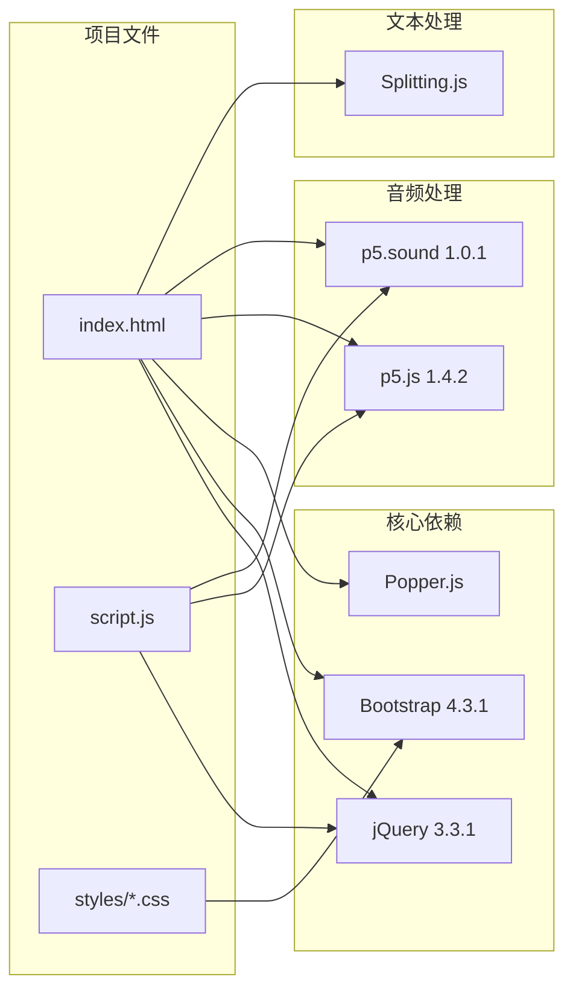

**图表来源**
- [index.html:254-261](file://index.html#L254-L261)
- [bootstrap.min.js:1-7](file://js/bootstrap.min.js#L1-L7)

### 内部组件依赖

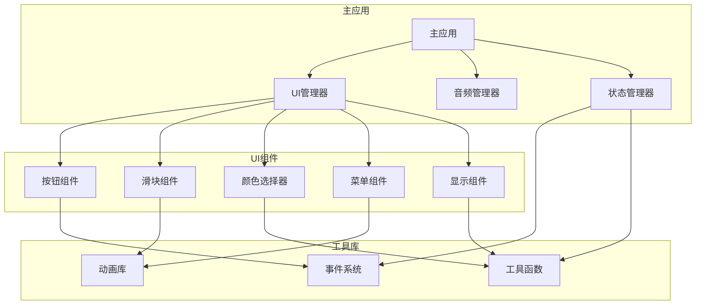

**图表来源**
- [script.js:1-800](file://js/script.js#L1-L800)

**章节来源**
- [bootstrap.min.js:1-7](file://js/bootstrap.min.js#L1-L7)
- [p5.min.js:1-3](file://js/p5.min.js#L1-L3)
- [p5.sound.min.js:1-3](file://js/p5.sound.min.js#L1-L3)

## 性能考虑

### 渲染优化策略

1. **DOM操作优化**
   - 批量更新DOM元素
   - 避免强制同步布局
   - 使用requestAnimationFrame进行动画

2. **内存管理**
   - 及时清理事件监听器
   - 释放音频资源
   - 管理颜色选择器状态

3. **计算优化**
   - 缓存计算结果
   - 防抖处理高频事件
   - 懒加载非关键资源

### 性能监控指标

| 指标类型 | 目标值 | 监控方法 |
|---------|--------|----------|
| FPS | ≥60 | requestAnimationFrame回调间隔 |
| 内存使用 | ≤100MB | Performance Memory面板 |
| DOM操作次数 | ≤10次/帧 | Chrome DevTools Timeline |
| 事件处理延迟 | ≤16ms | Performance面板 |

**章节来源**
- [script.js:301-426](file://js/script.js#L301-L426)
- [style.css:141-162](file://styles/style.css#L141-L162)

## 故障排除指南

### 常见问题诊断

#### 音频相关问题

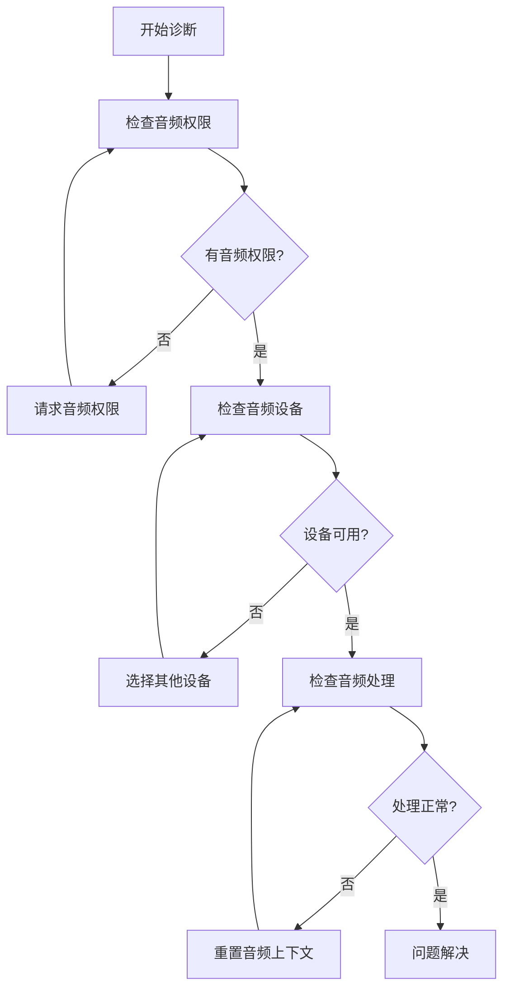

#### UI组件问题

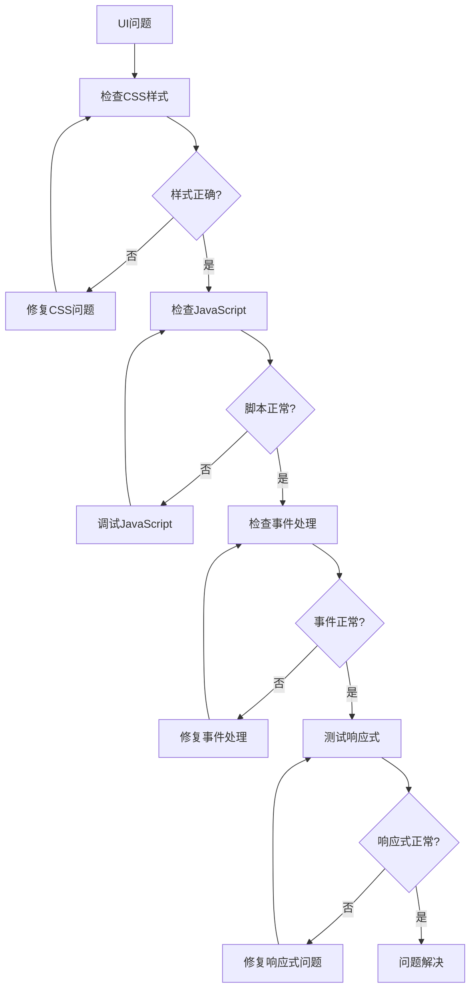

**章节来源**
- [script.js:156-160](file://js/script.js#L156-L160)
- [color-picker.js:177-211](file://js/color-picker.js#L177-L211)

### 调试工具使用

1. **浏览器开发者工具**
   - Elements面板：检查DOM结构和样式
   - Console面板：查看错误信息和日志
   - Performance面板：分析性能瓶颈
   - Network面板：监控资源加载

2. **音频调试**
   - Web Audio Inspector：检查音频节点连接
   - Chrome DevTools：监控音频处理性能

**章节来源**
- [script.js:384-386](file://js/script.js#L384-L386)

## 结论

本项目展示了现代Web UI组件开发的最佳实践，涵盖了从基础按钮到复杂音频处理系统的完整实现。通过模块化架构、清晰的组件分离和完善的交互设计，为后续的UI组件扩展奠定了坚实基础。

关键成功因素包括：
- 清晰的组件职责划分
- 完善的事件处理机制
- 优雅的降级兼容性
- 优秀的性能优化策略
- 全面的测试覆盖方案

这些实践经验可以作为开发类似UI组件系统的参考模板。

## 附录

### 开发环境设置

1. **必需工具**
   - Node.js (≥14.0.0)
   - npm (≥6.0.0)
   - 浏览器开发者工具

2. **项目启动**
   ```bash
   # 安装依赖
   npm install
   
   # 启动开发服务器
   npm start
   
   # 构建生产版本
   npm run build
   ```

3. **代码规范**
   - ESLint配置
   - Prettier格式化
   - Git钩子验证

### 测试指南

1. **单元测试**
   - 使用Jest进行组件测试
   - 覆盖核心交互逻辑
   - 测试边界条件

2. **集成测试**
   - 端到端用户流程测试
   - 跨浏览器兼容性测试
   - 性能基准测试

3. **用户体验测试**
   - A/B测试框架
   - 用户行为分析
   - 可访问性测试

**章节来源**
- [index.html:1-282](file://index.html#L1-L282)
- [script.js:1-1049](file://js/script.js#L1-L1049)
- [color-picker.js:1-231](file://js/color-picker.js#L1-L231)