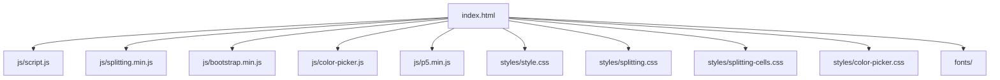
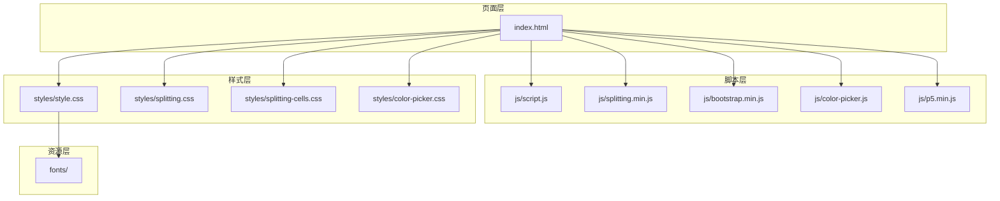
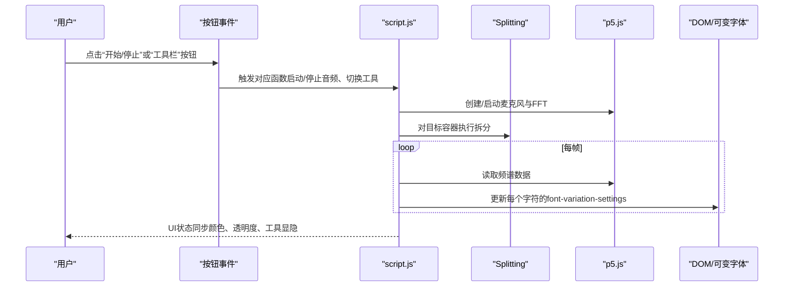
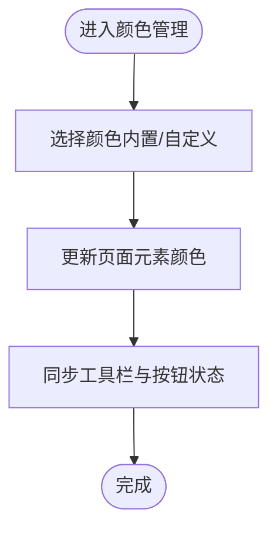
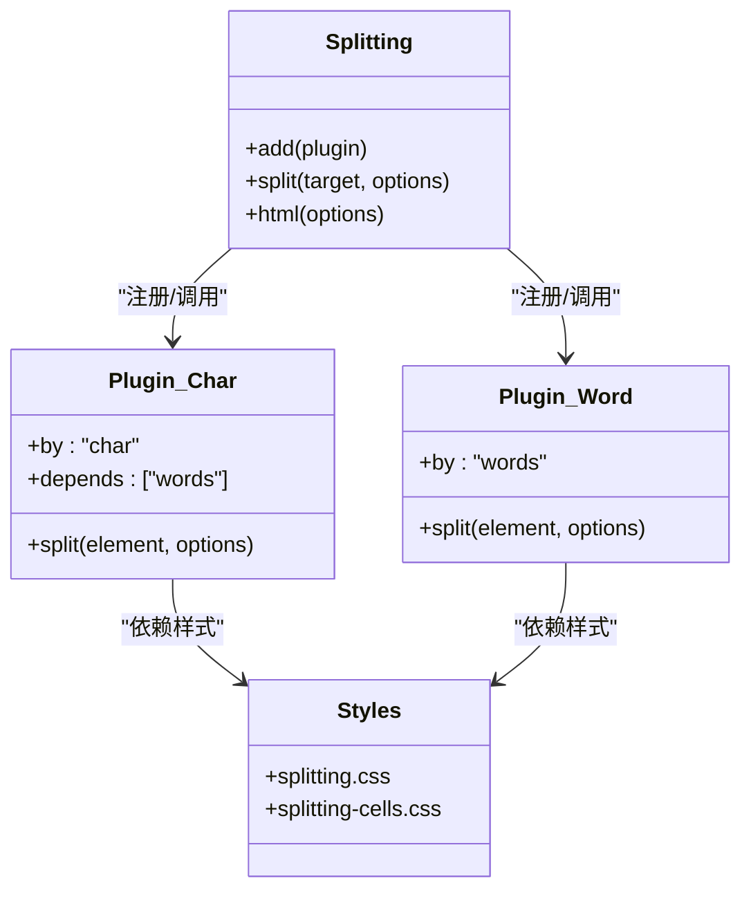
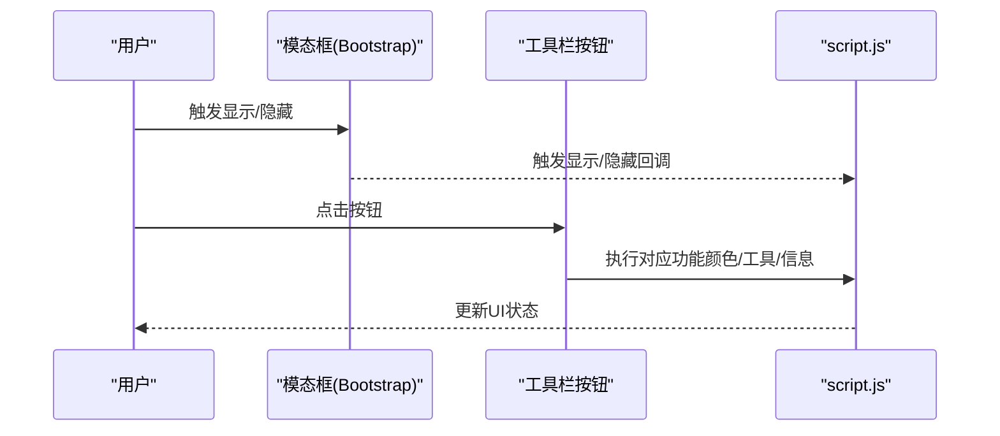
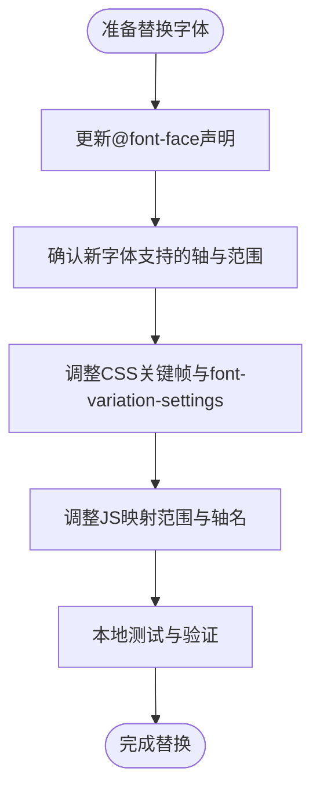
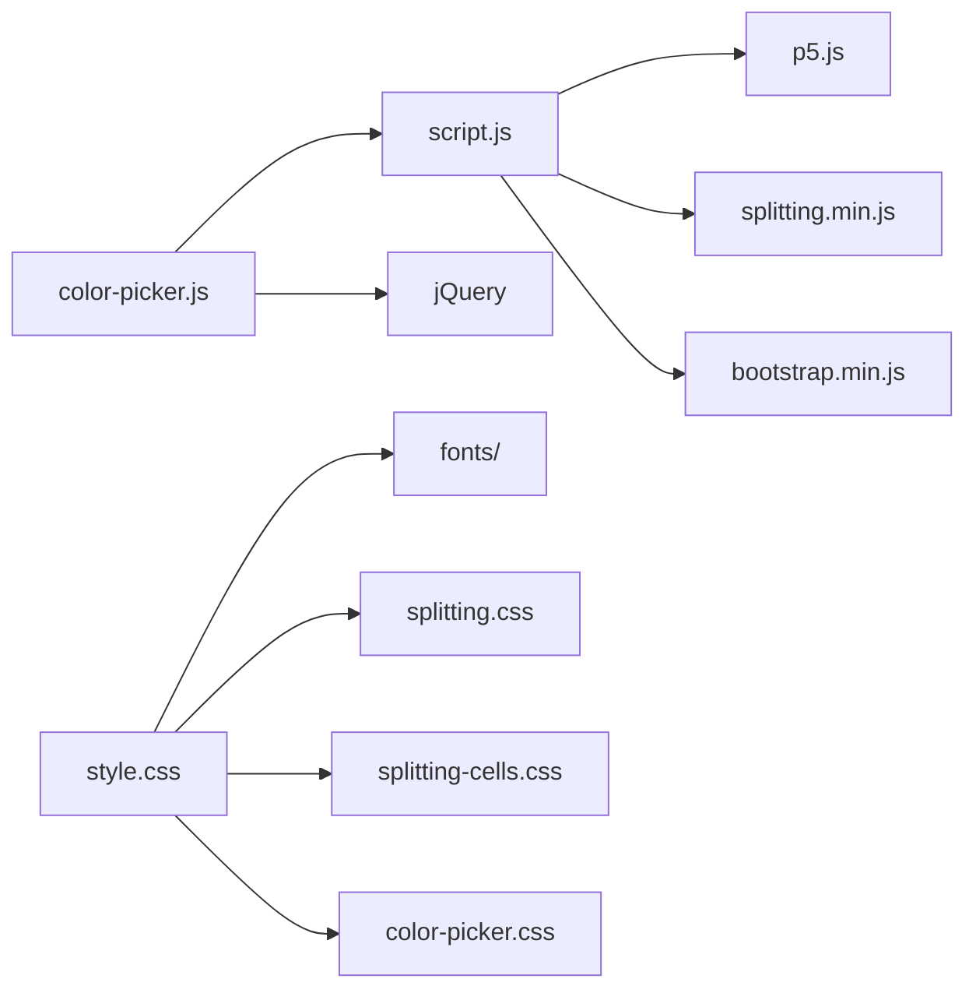

# 扩展开发

<cite>
**本文引用的文件**
- [index.html](file://index.html)
- [script.js](file://js/script.js)
- [FONT-REPLACEMENT-GUIDE.md](file://FONT-REPLACEMENT-GUIDE.md)
- [style.css](file://styles/style.css)
- [color-picker.js](file://js/color-picker.js)
- [splitting.min.js](file://js/splitting.min.js)
- [bootstrap.min.js](file://js/bootstrap.min.js)
- [splitting.css](file://styles/splitting.css)
- [splitting-cells.css](file://styles/splitting-cells.css)
- [color-picker.css](file://styles/color-picker.css)
</cite>

## 目录
1. [简介](#简介)
2. [项目结构](#项目结构)
3. [核心组件](#核心组件)
4. [架构总览](#架构总览)
5. [详细组件分析](#详细组件分析)
6. [依赖关系分析](#依赖关系分析)
7. [性能考量](#性能考量)
8. [故障排查指南](#故障排查指南)
9. [结论](#结论)
10. [附录](#附录)

## 简介
本指南面向希望在现有项目基础上进行扩展开发的工程师，围绕模块架构设计、接口定义、依赖管理、插件系统设计（事件系统、钩子机制、模块注册）、第三方库集成（p5.js 扩展、Splitting.js 插件、Bootstrap 组件扩展）、字体替换机制（可变字体配置、字体文件管理、兼容性处理）、颜色管理扩展（新增主题、颜色算法扩展、动态主题生成）、UI 组件扩展（新按钮类型、控件组件、交互模式）以及扩展测试与性能优化建议，提供系统化的开发指引。

## 项目结构
该项目采用前端单页应用结构，核心入口为 HTML 页面，配合脚本与样式资源完成动态排版、音频可视化与交互控制。关键目录与文件如下：
- 入口页面：index.html
- 样式表：styles/*.css（含 Splitting、颜色拾取器等）
- 脚本：js/*.js（含主逻辑、颜色管理、Splitting、Bootstrap 等）
- 字体资源：fonts/（用于可变字体）
- 字体替换指南：FONT-REPLACEMENT-GUIDE.md

图表来源
- [index.html:1-282](file://index.html#L1-L282)
- [script.js:1-1049](file://js/script.js#L1-L1049)
- [splitting.min.js:1-31](file://js/splitting.min.js#L1-L31)
- [bootstrap.min.js:1-7](file://js/bootstrap.min.js#L1-L7)
- [color-picker.js:1-231](file://js/color-picker.js#L1-L231)
- [style.css:1-1571](file://styles/style.css#L1-L1571)
- [splitting.css:1-67](file://styles/splitting.css#L1-L67)
- [splitting-cells.css:1-56](file://styles/splitting-cells.css#L1-L56)
- [color-picker.css:1-97](file://styles/color-picker.css#L1-L97)

章节来源
- [index.html:1-282](file://index.html#L1-L282)

## 核心组件
- 音频与可视化：基于 p5.js 的麦克风输入、FFT 分析与动态排版联动
- 文本拆分与动画：基于 Splitting.js 将文本拆分为字符级元素，并通过 CSS 变量与 JS 动态更新字体轴参数
- 颜色管理：内置颜色主题与拾色器，支持背景色与字体色的实时切换
- UI 工具栏：菜单按钮集合，负责开关工具、切换模式、打开模态框等
- 字体系统：可变字体（ABC Symphony Display）通过 CSS 的 font-variation-settings 实现动态变形

章节来源
- [script.js:1-1049](file://js/script.js#L1-L1049)
- [style.css:1-1571](file://styles/style.css#L1-L1571)
- [color-picker.js:1-231](file://js/color-picker.js#L1-L231)
- [splitting.min.js:1-31](file://js/splitting.min.js#L1-L31)

## 架构总览
整体架构以 index.html 为入口，加载第三方库与样式，随后由 script.js 初始化音频、拆分文本、绑定事件与交互；Splitting.js 提供字符级 DOM 结构，Bootstrap 提供模态框与工具类，颜色拾色器独立维护主题状态。

图表来源
- [index.html:1-282](file://index.html#L1-L282)
- [script.js:1-1049](file://js/script.js#L1-L1049)
- [splitting.min.js:1-31](file://js/splitting.min.js#L1-L31)
- [bootstrap.min.js:1-7](file://js/bootstrap.min.js#L1-L7)
- [color-picker.js:1-231](file://js/color-picker.js#L1-L231)
- [style.css:1-1571](file://styles/style.css#L1-L1571)
- [splitting.css:1-67](file://styles/splitting.css#L1-L67)
- [splitting-cells.css:1-56](file://styles/splitting-cells.css#L1-L56)
- [color-picker.css:1-97](file://styles/color-picker.css#L1-L97)

## 详细组件分析

### 组件A：动态排版与音频可视化（核心）
- 初始化与环境检测：在 setup 中初始化 p5、麦克风与 FFT，移动端阈值与桌面端阈值区分
- 文本拆分：使用 Splitting 对容器内的文本进行字符级拆分，便于逐字符动画
- 动画循环：draw 中根据音频能量计算每个字符的高度、倾斜与缩放，结合可变字体轴实现动态变形
- 交互控制：工具栏按钮控制麦克风开关、滑杆调节灵敏度、颜色切换、显示模式切换等

图表来源
- [script.js:178-426](file://js/script.js#L178-L426)
- [splitting.min.js:1-31](file://js/splitting.min.js#L1-L31)

章节来源
- [script.js:178-426](file://js/script.js#L178-L426)

### 组件B：颜色管理系统（主题与拾色器）
- 主题常量：内置一组颜色组合，支持随机切换
- 拾色器：基于 jQuery 的颜色列表与自定义色板，点击即刻应用到页面元素
- 应用范围：背景、按钮、文本、SVG 等多处元素的颜色同步更新
- 工具栏集成：按钮 4/5 打开颜色面板，按钮 6 随机主题，按钮 1/9 切换工具与信息模式

图表来源
- [color-picker.js:1-231](file://js/color-picker.js#L1-L231)
- [script.js:931-960](file://js/script.js#L931-L960)

章节来源
- [color-picker.js:1-231](file://js/color-picker.js#L1-L231)
- [script.js:931-960](file://js/script.js#L931-L960)

### 组件C：Splitting 插件系统（字符级拆分与动画）
- 插件机制：Splitting 通过注册“按单词/字符/网格”等拆分器，形成可复用的拆分能力
- 样式支持：splitting.css 与 splitting-cells.css 提供字符伪元素、网格布局等辅助样式
- 动画联动：JS 在每帧更新每个字符的 CSS 变量与 font-variation-settings，实现逐字符动画

图表来源
- [splitting.min.js:1-31](file://js/splitting.min.js#L1-L31)
- [splitting.css:1-67](file://styles/splitting.css#L1-L67)
- [splitting-cells.css:1-56](file://styles/splitting-cells.css#L1-L56)

章节来源
- [splitting.min.js:1-31](file://js/splitting.min.js#L1-L31)
- [splitting.css:1-67](file://styles/splitting.css#L1-L67)
- [splitting-cells.css:1-56](file://styles/splitting-cells.css#L1-L56)

### 组件D：Bootstrap 模态框与交互（工具条与信息面板）
- 模态框：index.html 中定义教程模态框，通过 Bootstrap 的 Modal 组件控制显示/隐藏
- 工具栏：按钮集合负责切换工具、打开颜色面板、播放/暂停等
- 事件绑定：script.js 中监听按钮点击与窗口尺寸变化，动态调整 UI 状态

图表来源
- [bootstrap.min.js:1-7](file://js/bootstrap.min.js#L1-L7)
- [index.html:24-39](file://index.html#L24-L39)
- [script.js:874-921](file://js/script.js#L874-L921)

章节来源
- [bootstrap.min.js:1-7](file://js/bootstrap.min.js#L1-L7)
- [index.html:24-39](file://index.html#L24-L39)
- [script.js:874-921](file://js/script.js#L874-L921)

### 组件E：字体替换与可变字体（动态排版）
- 字体声明：style.css 中通过 @font-face 声明三款字体（Display/Headline/Text）
- 可变轴：ABC Symphony Display 支持 hght、ital、vrsb 轴，用于高度、倾斜与反转
- JS 动态设置：script.js 在 draw 中通过 font-variation-settings 实时更新各字符的轴值
- 兼容性：替换字体需同步调整 CSS 动画与 JS 映射范围

图表来源
- [style.css:1-15](file://styles/style.css#L1-L15)
- [FONT-REPLACEMENT-GUIDE.md:1-263](file://FONT-REPLACEMENT-GUIDE.md#L1-L263)
- [script.js:409-416](file://js/script.js#L409-L416)

章节来源
- [style.css:1-15](file://styles/style.css#L1-L15)
- [FONT-REPLACEMENT-GUIDE.md:1-263](file://FONT-REPLACEMENT-GUIDE.md#L1-L263)
- [script.js:409-416](file://js/script.js#L409-L416)

## 依赖关系分析
- 脚本依赖
  - script.js 依赖 p5.js（音频与可视化）、Splitting（文本拆分）、Bootstrap（模态框）、jQuery（颜色拾色器）
  - color-picker.js 依赖 jQuery 与 script.js 中的颜色常量与状态
- 样式依赖
  - style.css 依赖 fonts/ 字体文件与 Splitting、颜色拾色器样式
  - splitting.css 与 splitting-cells.css 为 Splitting 提供基础样式
  - color-picker.css 为颜色拾色器提供 UI 样式

图表来源
- [script.js:1-1049](file://js/script.js#L1-L1049)
- [color-picker.js:1-231](file://js/color-picker.js#L1-L231)
- [style.css:1-1571](file://styles/style.css#L1-L1571)
- [splitting.css:1-67](file://styles/splitting.css#L1-L67)
- [splitting-cells.css:1-56](file://styles/splitting-cells.css#L1-L56)
- [color-picker.css:1-97](file://styles/color-picker.css#L1-L97)

章节来源
- [script.js:1-1049](file://js/script.js#L1-L1049)
- [color-picker.js:1-231](file://js/color-picker.js#L1-L231)
- [style.css:1-1571](file://styles/style.css#L1-L1571)

## 性能考量
- 帧率与计算复杂度
  - 使用 frameRate(60) 固定帧率，draw 中对每个字符进行数值计算与样式更新，注意字符数量过多时的性能影响
  - 平滑参数（smoothH、smoothI、smoothSkew）与映射范围应合理设置，避免过度计算
- DOM 操作优化
  - 尽量批量更新样式，减少重排与重绘
  - 使用 CSS 变量与 font-variation-settings 避免频繁创建节点
- 音频处理
  - FFT 分析与麦克风输入会占用 CPU，移动端阈值与桌面端阈值分离有助于平衡体验
- 字体与渲染
  - 可变字体在低端设备上可能影响性能，建议在移动端启用简化动画或降低字符数量

## 故障排查指南
- 字体替换后无动画
  - 检查新字体是否为可变字体，确认 CSS 动画与 JS 轴名映射一致
  - 参考字体替换指南，核对 @font-face、CSS 关键帧与 JS 设置
- 颜色拾色器不生效
  - 确认 jQuery 已正确加载，颜色列表与 active 状态切换逻辑正常
  - 检查 script.js 中颜色应用范围是否覆盖到目标元素
- Splitting 未生效
  - 确认 Splitting 已正确引入，目标容器已设置 data-splitting 属性
  - 检查 splitting.css 与 splitting-cells.css 是否加载成功
- 模态框无法显示/隐藏
  - 确认 Bootstrap 已加载，相关事件绑定与样式类名一致
- 移动端交互异常
  - 检查移动端阈值与触摸事件绑定，确保按钮区域与手势识别正常

章节来源
- [FONT-REPLACEMENT-GUIDE.md:1-263](file://FONT-REPLACEMENT-GUIDE.md#L1-L263)
- [color-picker.js:1-231](file://js/color-picker.js#L1-L231)
- [splitting.min.js:1-31](file://js/splitting.min.js#L1-L31)
- [bootstrap.min.js:1-7](file://js/bootstrap.min.js#L1-L7)
- [script.js:466-538](file://js/script.js#L466-L538)

## 结论
本项目以 Splitting 与可变字体为核心，结合 p5.js 实现声音驱动的动态排版，辅以 Bootstrap 与 jQuery 提供的 UI 与交互能力。扩展开发应遵循“模块化、低耦合、高内聚”的原则，严格管理依赖与接口契约，确保第三方库与样式资源的版本一致性。通过本文档提供的流程与最佳实践，可在不破坏现有功能的前提下，安全地添加新模块、新 UI 组件与新交互模式。

## 附录

### 新功能模块开发流程（模板）
- 架构设计
  - 明确模块职责与边界，划分 UI、逻辑与数据层
  - 设计对外接口（事件/钩子/注册表），保持与现有系统解耦
- 接口定义
  - 统一事件命名与参数格式，提供默认配置与可选配置项
  - 为模块提供生命周期钩子（初始化、销毁、暂停/恢复）
- 依赖管理
  - 评估第三方库的体积与兼容性，尽量复用已有库
  - 通过模块化打包与按需加载减少首屏负担
- 集成与测试
  - 在隔离环境中验证核心逻辑，再接入主流程
  - 编写单元测试与端到端测试，覆盖关键路径与边界条件
- 发布与回滚
  - 采用灰度发布策略，记录变更日志与回滚预案

### 插件系统设计要点
- 事件系统
  - 使用统一的事件中心（可基于自定义事件或观察者模式）
  - 明确事件类型、触发时机与回调参数
- 钩子机制
  - 在关键节点插入钩子（如初始化前、渲染后、销毁前）
  - 钩子应支持异步与错误处理
- 模块注册
  - 提供注册表，集中管理模块的元信息与实例
  - 支持动态启用/禁用与优先级排序

### 第三方库集成方法
- p5.js 扩展
  - 仅在需要时初始化与销毁，避免重复实例
  - 将音频与可视化逻辑封装为独立模块，便于测试与复用
- Splitting.js 插件
  - 保持插件最小化，避免与现有拆分逻辑冲突
  - 通过 CSS 变量与 JS 协同，确保动画流畅
- Bootstrap 组件扩展
  - 优先使用现有组件，必要时通过自定义样式增强
  - 注意响应式断点与移动端手势的兼容性

### 字体替换机制（操作清单）
- 替换 Display 字体
  - 将新可变字体放入 fonts/，更新 @font-face 与 CSS 动画中的轴名与范围
  - 调整 JS 中的映射范围与轴名，确保与新字体一致
- 替换 Headline/Text 字体
  - 更新对应 @font-face 声明与字体族名称
  - 检查 style.css 中涉及字体族的选择器并同步更新

章节来源
- [FONT-REPLACEMENT-GUIDE.md:27-263](file://FONT-REPLACEMENT-GUIDE.md#L27-L263)
- [style.css:1-15](file://styles/style.css#L1-L15)
- [script.js:409-416](file://js/script.js#L409-L416)

### 颜色管理扩展（新增主题与算法）
- 新增主题
  - 在颜色常量数组中添加新的颜色组合，或提供外部 JSON 配置
  - 通过按钮或下拉菜单暴露主题切换入口
- 颜色算法扩展
  - 基于 HSL/HSV 或亮度计算实现动态配色
  - 与可变字体的对比度要求结合，保证可读性
- 动态主题生成
  - 根据当前时间、音频能量或用户偏好生成主题
  - 提供预览与保存功能，支持持久化

章节来源
- [color-picker.js:4-27](file://js/color-picker.js#L4-L27)
- [script.js:931-960](file://js/script.js#L931-L960)

### UI 组件扩展指南（按钮、控件与交互）
- 新按钮类型
  - 统一按钮样式与交互反馈，遵循无障碍规范
  - 为按钮提供状态类（激活/禁用/悬停），并与脚本状态同步
- 控件组件
  - 滑杆、开关、下拉框等控件应具备清晰的视觉反馈与键盘支持
  - 与 Splitting/颜色系统联动，避免阻塞主线程
- 交互模式
  - 鼠标、触摸与语音控制的统一抽象，确保跨平台一致性
  - 提供手势识别与节流/防抖，提升响应速度

章节来源
- [index.html:112-177](file://index.html#L112-L177)
- [script.js:552-743](file://js/script.js#L552-L743)
- [splitting.css:1-67](file://styles/splitting.css#L1-L67)

### 扩展测试方法与性能优化建议
- 测试方法
  - 单元测试：针对颜色算法、字体映射、事件派发等核心逻辑
  - 集成测试：模拟音频输入、字体替换、颜色切换等场景
  - 端到端测试：覆盖完整交互流程（打开模态框、切换主题、播放动画）
- 性能优化
  - 使用 requestAnimationFrame 控制动画节奏，避免强制同步布局
  - 合理缓存 DOM 查询结果与计算中间值
  - 对高频事件（如鼠标移动、触摸）使用节流/防抖
  - 在移动端启用简化动画或降采样策略