# 第三方库集成

<cite>
**本文档引用的文件**
- [index.html](file://index.html)
- [script.js](file://js/script.js)
- [splitting.min.js](file://js/splitting.min.js)
- [bootstrap.min.css](file://styles/bootstrap.min.css)
- [splitting.css](file://styles/splitting.css)
- [color-picker.js](file://js/color-picker.js)
- [color-picker.css](file://styles/color-picker.css)
- [p5.min.js](file://js/p5.min.js)
- [p5.sound.min.js](file://js/p5.sound.min.js)
- [FONT-REPLACEMENT-GUIDE.md](file://FONT-REPLACEMENT-GUIDE.md)
</cite>

## 目录
1. [简介](#简介)
2. [项目结构](#项目结构)
3. [核心组件](#核心组件)
4. [架构概览](#架构概览)
5. [详细组件分析](#详细组件分析)
6. [依赖分析](#依赖分析)
7. [性能考虑](#性能考虑)
8. [故障排除指南](#故障排除指南)
9. [结论](#结论)
10. [附录](#附录)

## 简介

本项目是一个集成了多个第三方库的交互式音频可视化应用。项目采用模块化架构，集成了p5.js音频处理库、Splitting.js字符分割库、Bootstrap UI框架和jQuery库，实现了基于声音驱动的动态排版效果。

该项目的核心特色是通过可变字体技术，将音频输入实时转换为视觉效果，用户可以通过麦克风或鼠标控制字体的变形动画。系统支持桌面端和移动端的响应式设计，并提供了丰富的颜色主题定制功能。

## 项目结构

项目采用清晰的文件组织结构，按照功能模块进行分类：

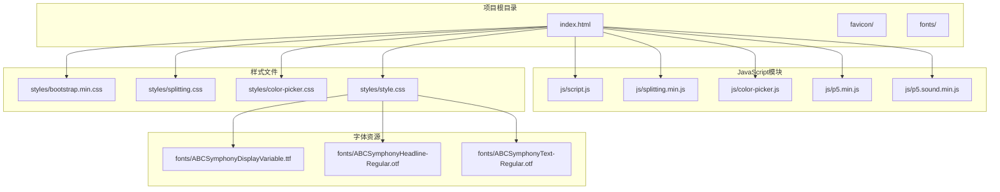

**图表来源**
- [index.html:1-282](file://index.html#L1-L282)
- [script.js:1-1049](file://js/script.js#L1-L1049)

**章节来源**
- [index.html:1-282](file://index.html#L1-L282)
- [script.js:1-1049](file://js/script.js#L1-L1049)

## 核心组件

### 音频处理系统

项目使用p5.js库构建完整的音频处理管道，包括音频输入、FFT分析和音量检测功能。

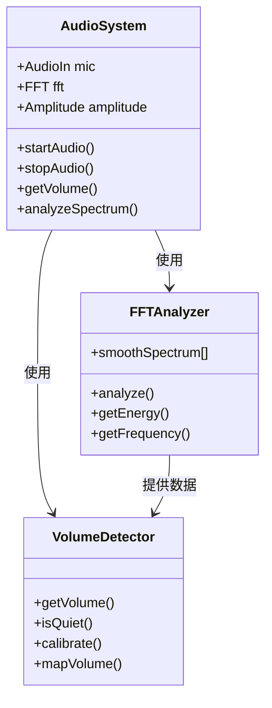

**图表来源**
- [script.js:1-1049](file://js/script.js#L1-L1049)

### 字符分割与动画系统

Splitting.js库负责将文本内容分割为独立的字符元素，支持复杂的CSS动画效果。

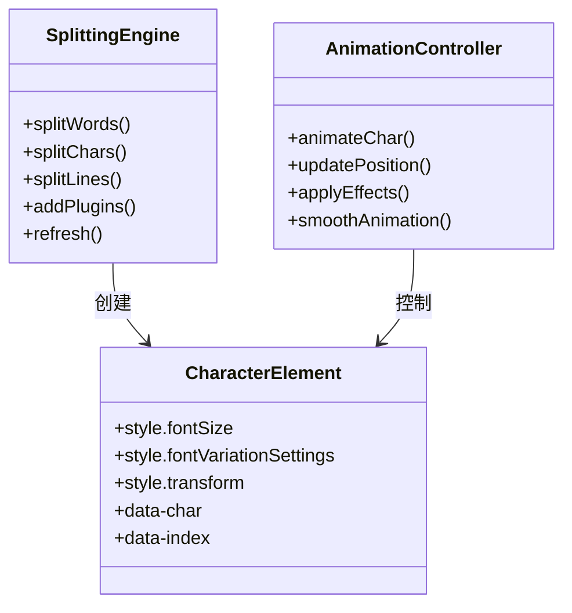

**图表来源**
- [splitting.min.js:1-31](file://js/splitting.min.js#L1-L31)
- [script.js:238-281](file://js/script.js#L238-L281)

### UI框架与交互系统

Bootstrap提供响应式布局基础，结合jQuery实现丰富的用户交互功能。

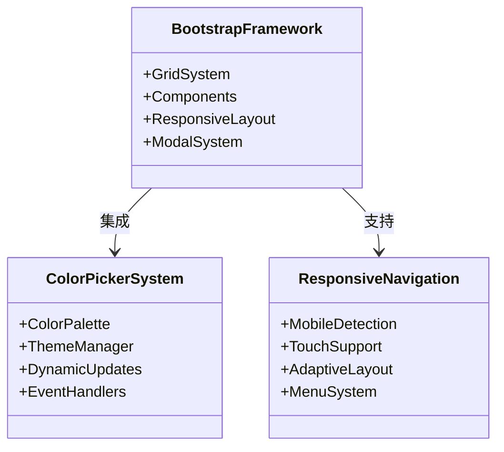

**图表来源**
- [bootstrap.min.css:1-7](file://styles/bootstrap.min.css#L1-L7)
- [color-picker.js:1-231](file://js/color-picker.js#L1-L231)

**章节来源**
- [script.js:1-1049](file://js/script.js#L1-L1049)
- [splitting.min.js:1-31](file://js/splitting.min.js#L1-L31)
- [color-picker.js:1-231](file://js/color-picker.js#L1-L231)

## 架构概览

项目采用分层架构设计，各组件之间通过清晰的接口进行通信：

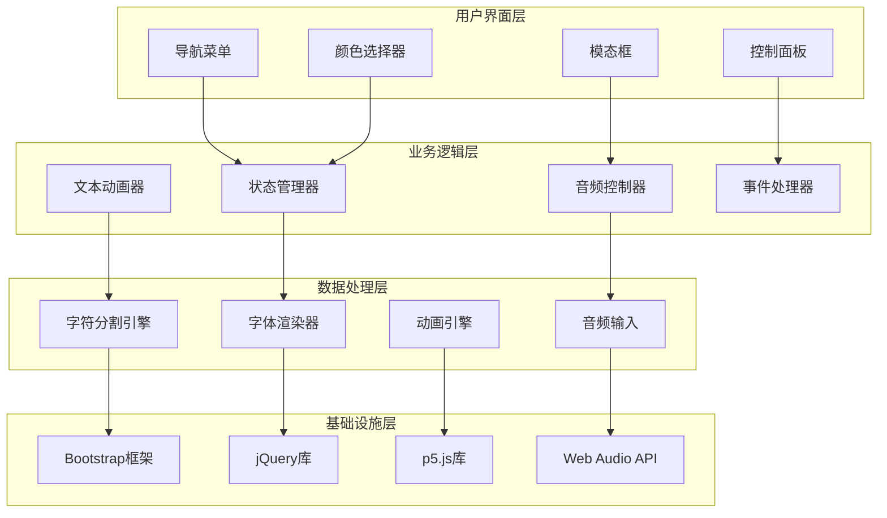

**图表来源**
- [index.html:1-282](file://index.html#L1-L282)
- [script.js:1-1049](file://js/script.js#L1-L1049)

## 详细组件分析

### p5.js音频处理库集成

#### 音频初始化流程

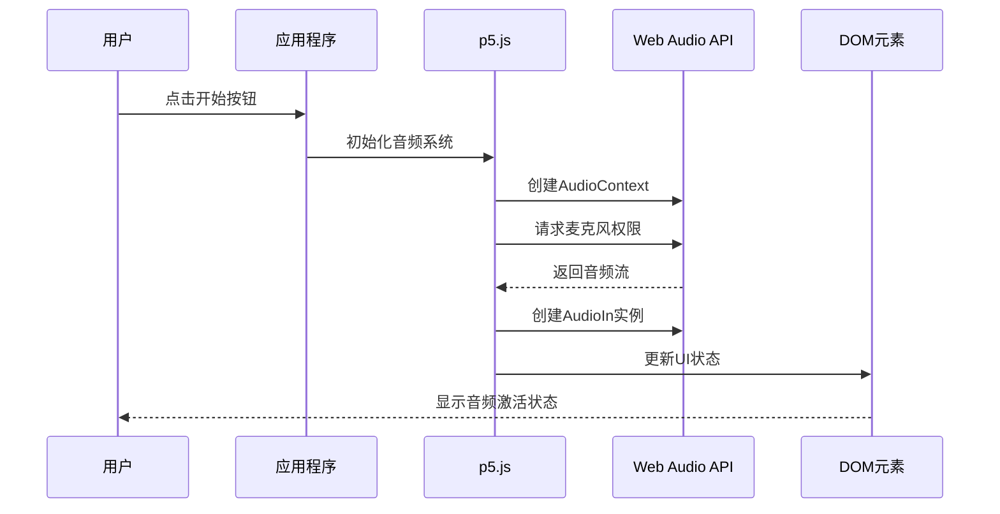

**图表来源**
- [script.js:178-201](file://js/script.js#L178-L201)
- [script.js:576-582](file://js/script.js#L576-L582)

#### FFT分析实现

项目使用p5.js的FFT类进行频域分析，支持实时音频可视化：

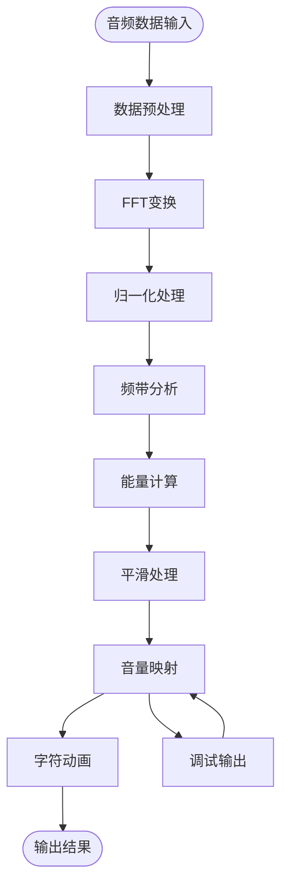

**图表来源**
- [script.js:360-365](file://js/script.js#L360-L365)
- [script.js:376-387](file://js/script.js#L376-L387)

#### 音量检测算法

音量检测采用多级过滤机制，确保音频响应的准确性和稳定性：

**章节来源**
- [script.js:1-1049](file://js/script.js#L1-L1049)

### Splitting.js字符分割库集成

#### 文本分割配置

Splitting.js提供了灵活的文本分割选项，支持按单词、字符、行等多种方式分割：

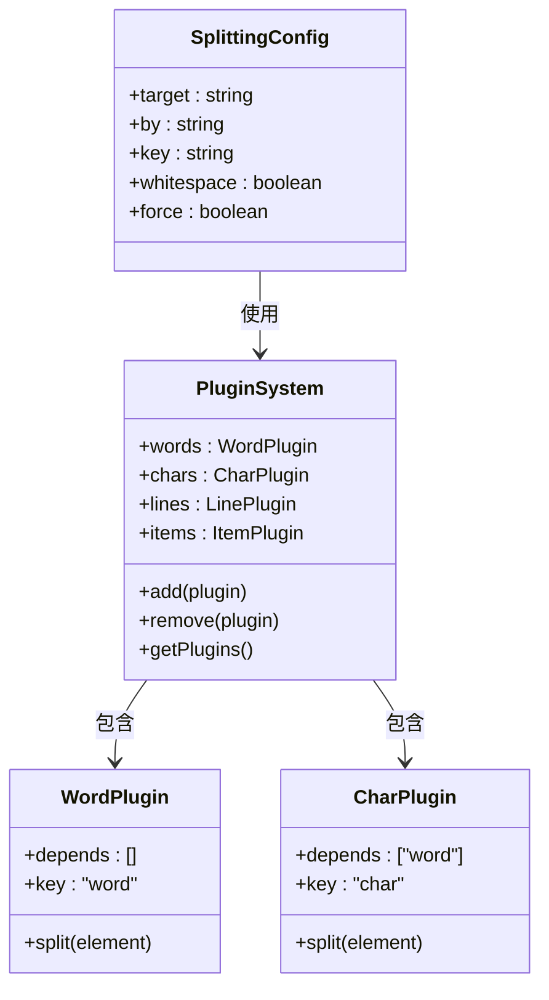

**图表来源**
- [splitting.min.js:16-29](file://js/splitting.min.js#L16-L29)

#### 字符属性设置

每个分割后的字符元素都具有丰富的属性和样式控制能力：

**章节来源**
- [splitting.min.js:1-31](file://js/splitting.min.js#L1-L31)
- [script.js:238-281](file://js/script.js#L238-L281)

### Bootstrap UI框架集成

#### 组件样式覆盖

Bootstrap框架提供了强大的CSS类系统，项目通过自定义样式进行深度定制：

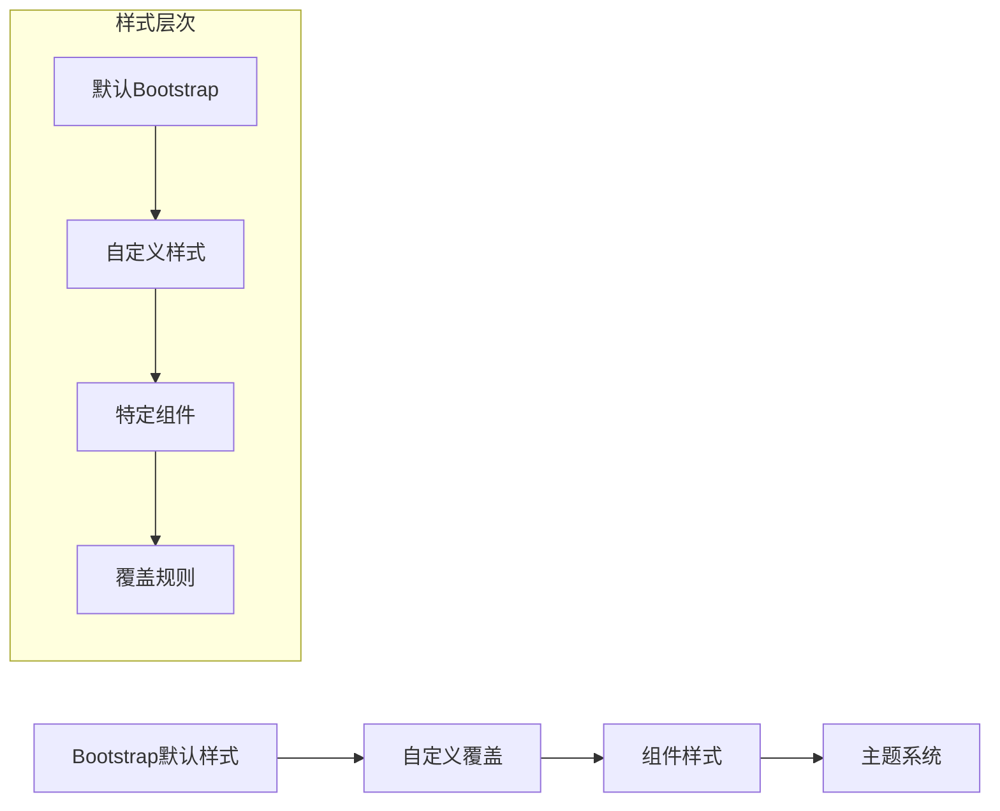

**图表来源**
- [bootstrap.min.css:1-7](file://styles/bootstrap.min.css#L1-L7)
- [color-picker.css:1-97](file://styles/color-picker.css#L1-L97)

#### 响应式布局适配

项目实现了完整的响应式设计，支持多种设备和屏幕尺寸：

**章节来源**
- [bootstrap.min.css:1-7](file://styles/bootstrap.min.css#L1-L7)
- [color-picker.css:1-97](file://styles/color-picker.css#L1-L97)

### jQuery库扩展使用

#### DOM操作优化

jQuery库提供了简洁的DOM操作接口，项目中广泛用于事件处理和元素管理：

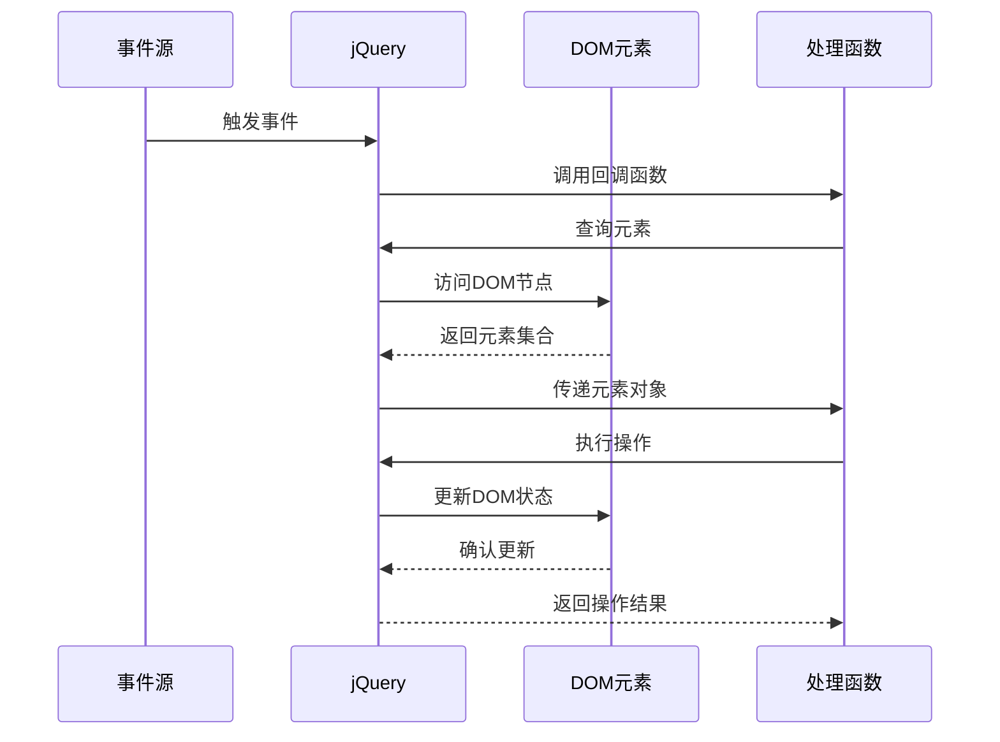

**图表来源**
- [color-picker.js:95-175](file://js/color-picker.js#L95-L175)

#### 事件委托机制

项目采用事件委托模式提高性能和内存效率：

**章节来源**
- [color-picker.js:1-231](file://js/color-picker.js#L1-L231)

## 依赖分析

### 库版本兼容性

项目中各第三方库的版本关系和兼容性要求如下：

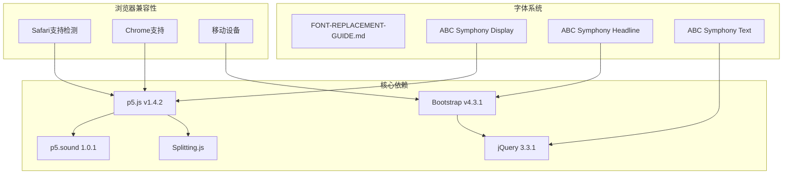

**图表来源**
- [p5.min.js:1-3](file://js/p5.min.js#L1-L3)
- [p5.sound.min.js:1-2](file://js/p5.sound.min.js#L1-L2)
- [FONT-REPLACEMENT-GUIDE.md:1-263](file://FONT-REPLACEMENT-GUIDE.md#L1-L263)

### 依赖关系图

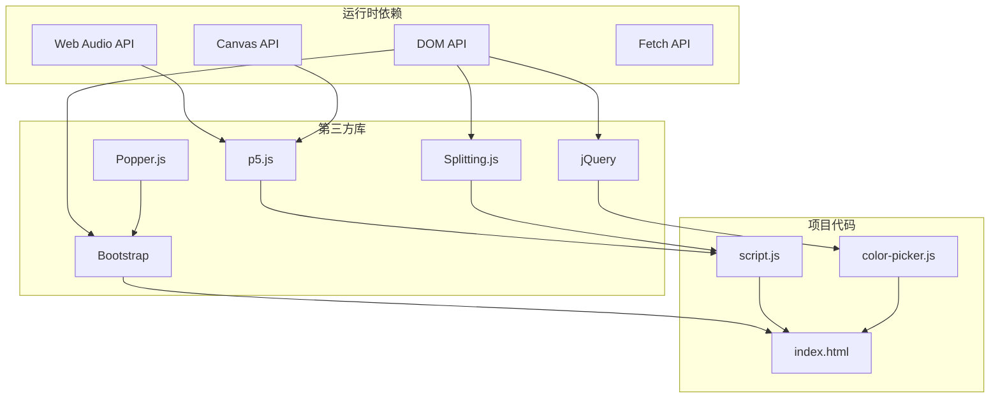

**图表来源**
- [index.html:1-282](file://index.html#L1-L282)
- [script.js:1-1049](file://js/script.js#L1-L1049)
- [color-picker.js:1-231](file://js/color-picker.js#L1-L231)

**章节来源**
- [p5.min.js:1-3](file://js/p5.min.js#L1-L3)
- [p5.sound.min.js:1-2](file://js/p5.sound.min.js#L1-L2)
- [FONT-REPLACEMENT-GUIDE.md:1-263](file://FONT-REPLACEMENT-GUIDE.md#L1-L263)

## 性能考虑

### 音频处理性能优化

项目在音频处理方面采用了多项优化策略：

1. **帧率控制**：使用`frameRate(60)`确保稳定的60FPS渲染
2. **内存管理**：预分配数组空间避免频繁的内存分配
3. **算法优化**：使用平滑算法减少计算开销
4. **条件渲染**：仅在需要时更新DOM元素

### 渲染性能优化

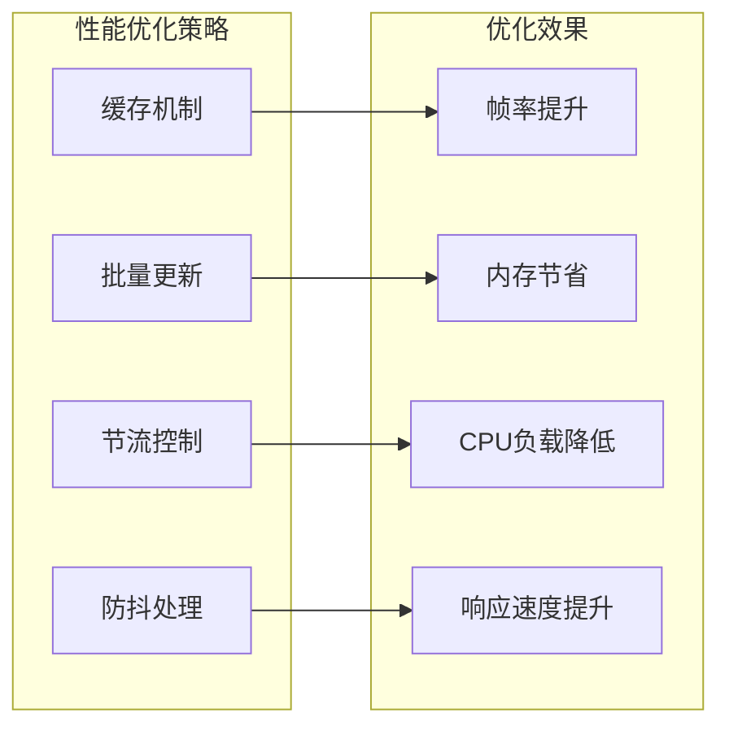

### 移动端性能适配

项目针对移动设备进行了专门的性能优化：

1. **触摸事件优化**：使用触摸友好的事件处理
2. **资源加载优化**：按需加载和缓存静态资源
3. **内存使用优化**：监控和限制内存使用量
4. **电池寿命保护**：智能降低不必要的计算

## 故障排除指南

### 常见问题诊断

#### 音频权限问题

当用户拒绝麦克风权限时，系统会显示相应的错误信息：

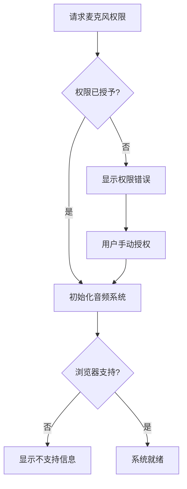

#### 字体加载失败

字体文件加载失败时的处理流程：

**章节来源**
- [script.js:156-160](file://js/script.js#L156-L160)
- [FONT-REPLACEMENT-GUIDE.md:245-263](file://FONT-REPLACEMENT-GUIDE.md#L245-L263)

### 调试工具使用

项目提供了完善的调试和监控工具：

1. **浏览器开发者工具**：检查控制台错误和网络请求
2. **性能分析器**：监控CPU和内存使用情况
3. **音频可视化**：实时显示音频波形和频谱
4. **DOM检查器**：验证元素状态和样式应用

## 结论

本项目成功集成了多个第三方库，创建了一个功能丰富且性能优异的音频可视化应用。通过合理的架构设计和优化策略，系统在保持良好用户体验的同时，也具备了良好的可维护性和扩展性。

项目的创新之处在于将音频处理与字体动画完美结合，创造出了独特的视觉体验。同时，模块化的架构设计使得各个组件可以独立开发和测试，为未来的功能扩展奠定了坚实的基础。

## 附录

### CDN引入配置

项目支持多种资源加载方式：

```html
<!-- CDN引入示例 -->
<script src="https://cdn.jsdelivr.net/npm/bootstrap@4.3.1/dist/js/bootstrap.min.js"></script>
<script src="https://cdn.jsdelivr.net/npm/jquery@3.3.1/dist/jquery.min.js"></script>
<script src="https://cdnjs.cloudflare.com/ajax/libs/p5.js/1.4.2/p5.min.js"></script>
<script src="https://cdnjs.cloudflare.com/ajax/libs/p5.js/1.4.2/addons/p5.sound.min.js"></script>
```

### 本地部署指南

1. **下载依赖文件**：从官方CDN或npm包管理器获取所需文件
2. **文件放置**：将文件正确放置到`js/`和`styles/`目录
3. **路径配置**：更新HTML文件中的资源路径
4. **版本验证**：确认各库版本兼容性
5. **测试运行**：在本地服务器上测试功能完整性

### 构建优化策略

1. **资源压缩**：使用gzip或brotli压缩静态资源
2. **缓存策略**：配置适当的HTTP缓存头
3. **按需加载**：实现懒加载和代码分割
4. **CDN加速**：使用内容分发网络提升加载速度
5. **预加载优化**：合理配置关键资源的预加载策略