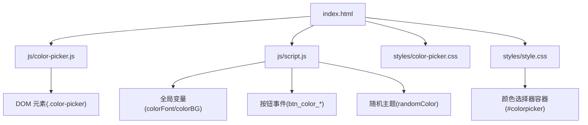
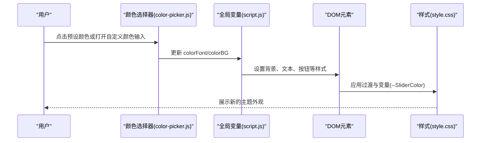
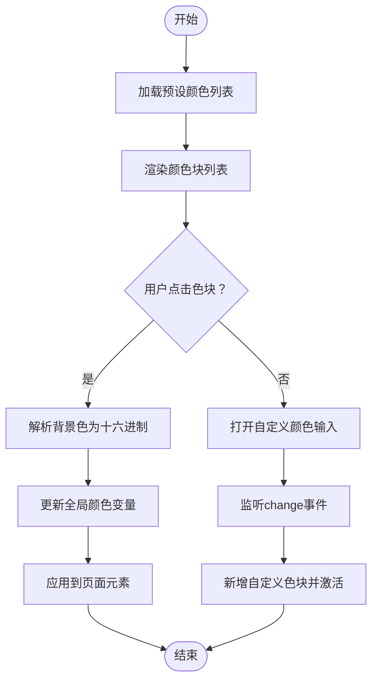
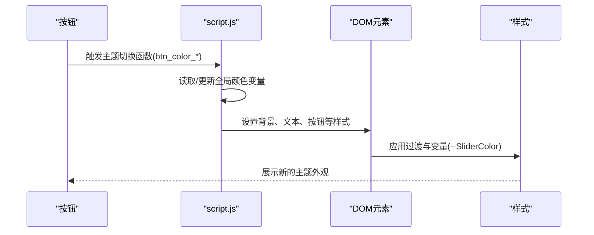
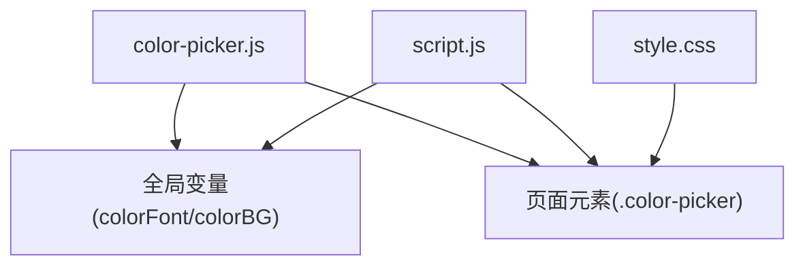

# 颜色管理扩展

<cite>
**本文档引用的文件**
- [index.html](file://index.html)
- [color-picker.js](file://js/color-picker.js)
- [color-picker.css](file://styles/color-picker.css)
- [script.js](file://js/script.js)
- [style.css](file://styles/style.css)
</cite>

## 目录
1. [简介](#简介)
2. [项目结构](#项目结构)
3. [核心组件](#核心组件)
4. [架构总览](#架构总览)
5. [详细组件分析](#详细组件分析)
6. [依赖关系分析](#依赖关系分析)
7. [性能考虑](#性能考虑)
8. [故障排除指南](#故障排除指南)
9. [结论](#结论)
10. [附录](#附录)

## 简介
本指南面向希望在现有颜色管理系统基础上进行扩展与优化的开发者，涵盖以下目标：
- 新颜色主题的添加方法：颜色组合定义、渐变效果实现、主题切换机制
- 颜色算法扩展：色彩理论应用、颜色空间转换、动态配色生成
- 颜色选择器扩展：自定义颜色输入、颜色历史记录、颜色预设管理
- 颜色性能优化：颜色缓存策略、渲染优化、内存管理
- 颜色无障碍设计：对比度检查、色盲友好、可访问性支持
- 颜色测试方法：色彩准确性验证、跨浏览器兼容性测试、用户体验评估
- 最佳实践：颜色命名规范、配置文件管理、维护策略

## 项目结构
该项目采用前端单页应用结构，颜色管理主要由 HTML 模板、CSS 样式与 JavaScript 脚本协同完成。核心文件如下：
- 页面模板与入口：index.html
- 颜色选择器交互逻辑：js/color-picker.js
- 颜色选择器样式：styles/color-picker.css
- 主题切换与动态类型：js/script.js
- 全局样式与响应式布局：styles/style.css

图表来源
- [index.html:240-248](file://index.html#L240-L248)
- [color-picker.js:1-231](file://js/color-picker.js#L1-L231)
- [script.js:1-1049](file://js/script.js#L1-L1049)
- [style.css:423-425](file://styles/style.css#L423-L425)

章节来源
- [index.html:1-282](file://index.html#L1-L282)
- [color-picker.js:1-231](file://js/color-picker.js#L1-L231)
- [script.js:1-1049](file://js/script.js#L1-L1049)
- [style.css:1-1580](file://styles/style.css#L1-L1580)

## 核心组件
- 颜色选择器（Color Picker）
  - 预设颜色列表与交互：通过预设数组与 DOM 动态生成颜色块，点击后更新全局颜色变量并刷新页面元素样式
  - 自定义颜色输入：隐藏的原生颜色输入控件，用于接收用户自定义颜色值
  - 选中状态与视觉反馈：激活态高亮、禁用态不可点击、边框与图标提示
- 主题切换（Theme Switching）
  - 全局颜色变量：colorFont（字体颜色）、colorBG（背景颜色）
  - 按钮驱动的主题切换：不同按钮触发不同的颜色应用范围与界面更新
  - 随机主题：从预设颜色组合数组中随机选取一组颜色组合并应用
- 渐变与过渡（Gradients & Transitions）
  - CSS 变量用于动态控制滑条颜色
  - 全局过渡动画用于平滑的颜色变化体验

章节来源
- [color-picker.js:1-231](file://js/color-picker.js#L1-L231)
- [script.js:606-960](file://js/script.js#L606-L960)
- [style.css:113-140](file://styles/style.css#L113-L140)

## 架构总览
颜色管理的整体流程如下：
- 用户在颜色选择器中选择颜色或输入自定义颜色
- JS 将颜色值写入全局变量，并根据选择器类型（字体/背景）更新对应 DOM 元素
- CSS 响应全局变量与类名变化，实现主题切换与过渡效果
- 随机主题功能从预设组合数组中抽取颜色组合，统一更新页面元素

图表来源
- [color-picker.js:95-175](file://js/color-picker.js#L95-L175)
- [script.js:931-960](file://js/script.js#L931-L960)
- [style.css:113-140](file://styles/style.css#L113-L140)

## 详细组件分析

### 颜色选择器组件分析
- 预设颜色列表与交互
  - 预设颜色数组存储在脚本中，渲染为可点击的色块
  - 点击色块时解析背景色并更新全局颜色变量，同时设置激活态与选中提示
- 自定义颜色输入
  - 使用隐藏的原生颜色输入控件，触发 change 事件后将新颜色加入到色块列表并标记为激活
- 选中状态与视觉反馈
  - 激活态高亮、禁用态不可点击、边框与图标提示，提升可用性

图表来源
- [color-picker.js:29-93](file://js/color-picker.js#L29-L93)
- [color-picker.js:95-175](file://js/color-picker.js#L95-L175)
- [color-picker.js:177-211](file://js/color-picker.js#L177-L211)

章节来源
- [color-picker.js:1-231](file://js/color-picker.js#L1-L231)
- [color-picker.css:1-97](file://styles/color-picker.css#L1-L97)

### 主题切换机制分析
- 全局颜色变量
  - colorFont：当前字体颜色
  - colorBG：当前背景颜色
- 按钮驱动的主题切换
  - 不同按钮负责应用到不同区域（字体/背景），并更新菜单按钮的背景与填充色
- 随机主题
  - 从预设颜色组合数组中随机选取一组颜色，统一更新页面元素

图表来源
- [script.js:606-665](file://js/script.js#L606-L665)
- [script.js:931-960](file://js/script.js#L931-L960)

章节来源
- [script.js:606-960](file://js/script.js#L606-L960)
- [style.css:423-425](file://styles/style.css#L423-L425)

### 渐变效果实现
- 当前项目未直接实现渐变效果，但可通过以下方式扩展：
  - 在预设颜色数组中引入渐变色值（如 CSS 渐变字符串），并在应用时将其赋给元素的背景属性
  - 结合 CSS 变量与过渡动画，实现平滑的颜色变化
  - 对于动态渐变，可在随机主题或音频驱动的场景中，基于音量或频率计算渐变参数并实时更新

章节来源
- [script.js:63-106](file://js/script.js#L63-L106)
- [style.css:113-140](file://styles/style.css#L113-L140)

### 颜色算法扩展
- 色彩理论应用
  - 可在预设颜色数组中引入互补色、三色组、分裂互补色等配色方案，提升视觉层次
- 颜色空间转换
  - 当前脚本包含 RGB 到十六进制的转换函数，可扩展为 HSV/HSL 转换以支持色调、饱和度、亮度的动态调整
- 动态配色生成
  - 基于当前主色，自动生成一组协调的辅助色；或根据用户偏好（明/暗主题）自动调整饱和度与亮度

章节来源
- [color-picker.js:213-229](file://js/color-picker.js#L213-L229)

### 颜色选择器扩展功能
- 自定义颜色输入
  - 已内置隐藏的原生颜色输入控件，建议增强其可见性与可访问性（如添加标签与 ARIA 属性）
- 颜色历史记录
  - 可在本地存储中保存最近使用的颜色，渲染为“最近使用”区域，便于快速选择
- 颜色预设管理
  - 将预设颜色组织为多个主题集合（如“自然风”、“科技感”、“复古风”），通过按钮切换主题

章节来源
- [color-picker.js:39](file://js/color-picker.js#L39)
- [color-picker.js:177-211](file://js/color-picker.js#L177-L211)

## 依赖关系分析
- 组件耦合
  - 颜色选择器与全局变量存在直接耦合：选择器通过更新全局变量驱动主题切换
  - 主题切换函数与 DOM 元素紧密耦合：需要对大量元素进行样式更新
- 外部依赖
  - jQuery：用于 DOM 操作与事件绑定
  - p5.js 与 p5.sound：用于音频可视化与交互（与颜色联动）

图表来源
- [color-picker.js:1-231](file://js/color-picker.js#L1-L231)
- [script.js:1-1049](file://js/script.js#L1-L1049)
- [style.css:1-1580](file://styles/style.css#L1-L1580)

章节来源
- [color-picker.js:1-231](file://js/color-picker.js#L1-L231)
- [script.js:1-1049](file://js/script.js#L1-L1049)
- [style.css:1-1580](file://styles/style.css#L1-L1580)

## 性能考虑
- 颜色缓存策略
  - 将已解析的颜色值缓存至内存，避免重复解析与计算
  - 对频繁更新的颜色应用，使用节流/防抖减少重绘次数
- 渲染优化
  - 使用 CSS 变量与 transform/opacity 等复合属性，减少强制同步布局
  - 合理使用 will-change 或 GPU 加速属性，降低主线程压力
- 内存管理
  - 及时移除不再使用的事件监听器与 DOM 引用
  - 控制颜色历史记录数量，避免无限增长导致内存占用上升

## 故障排除指南
- 颜色不生效或样式异常
  - 检查全局变量是否正确更新，确认 DOM 选择器是否匹配
  - 验证 CSS 变量是否被正确设置（如 --SliderColor）
- 颜色选择器无法点击
  - 确认容器指针事件是否被禁用（如 #colorpicker 的 pointer-events）
  - 检查激活态与禁用态的类名是否正确切换
- 自定义颜色无效
  - 确认原生颜色输入控件的 change 事件是否触发
  - 检查颜色值格式是否符合预期（十六进制或 RGB）

章节来源
- [style.css:423-425](file://styles/style.css#L423-L425)
- [color-picker.js:95-175](file://js/color-picker.js#L95-L175)
- [color-picker.js:177-211](file://js/color-picker.js#L177-L211)

## 结论
本项目提供了简洁而有效的颜色管理基础：预设颜色选择、自定义颜色输入、主题切换与随机主题。通过扩展颜色算法、引入渐变与历史记录、优化渲染与内存管理，可以进一步提升用户体验与可维护性。建议在后续迭代中逐步引入色彩理论与无障碍设计规范，确保在多设备与多浏览器环境下的一致表现。

## 附录

### 颜色命名规范
- 颜色变量命名：colorFont、colorBG（语义化，明确用途）
- 预设颜色数组项：使用十六进制字符串，保持一致性
- CSS 变量：统一前缀（如 --SliderColor），便于维护

章节来源
- [color-picker.js:1-2](file://js/color-picker.js#L1-L2)
- [style.css:123](file://styles/style.css#L123)

### 配置文件管理与维护策略
- 预设颜色集中管理：将颜色组合放入独立配置对象，便于导入导出与版本控制
- 主题分组：按风格或用途划分主题集合，提供切换接口
- 版本迁移：为颜色配置增加版本号，升级时进行兼容性检查与迁移

### 颜色测试方法
- 色彩准确性验证：使用专业工具比对屏幕输出与标准色值差异
- 跨浏览器兼容性测试：在主流浏览器中验证颜色显示与过渡动画一致性
- 用户体验评估：收集用户对颜色搭配、可读性与视觉舒适度的反馈