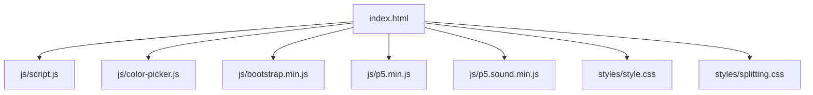
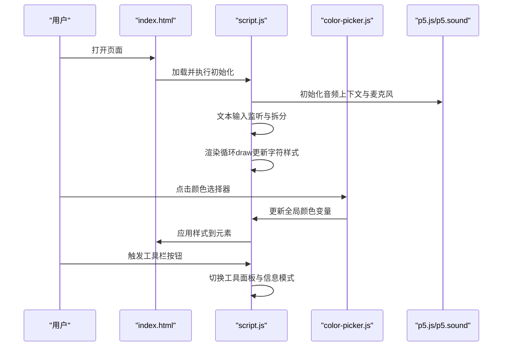
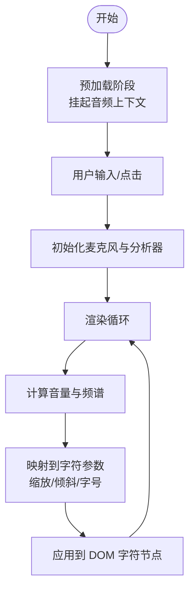
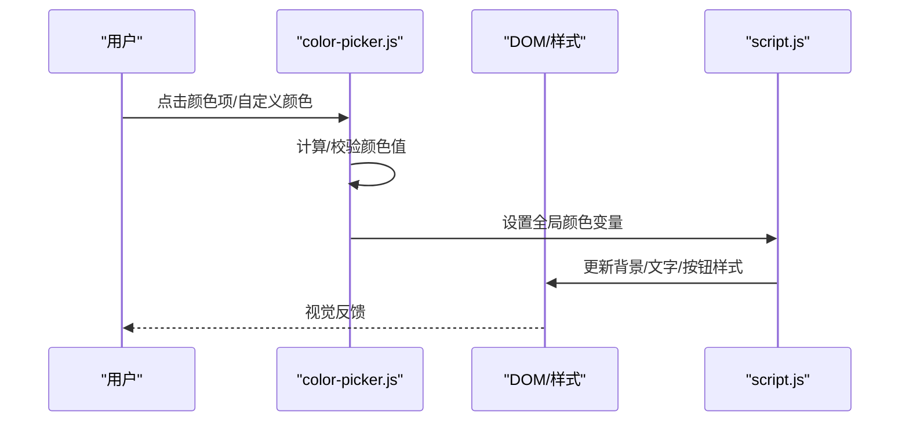
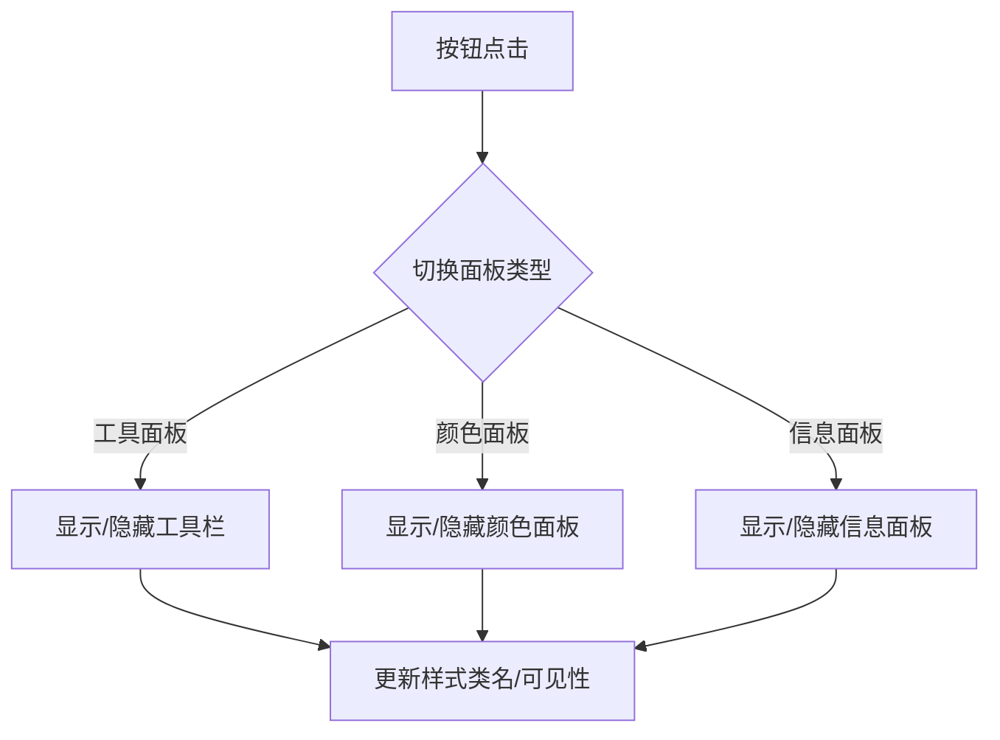
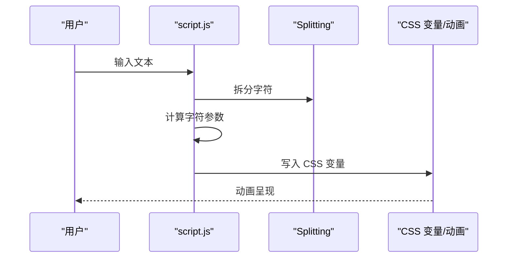
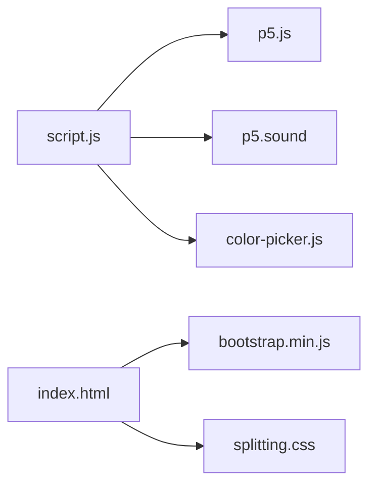

# 测试策略

<cite>
**本文引用的文件**
- [index.html](file://index.html)
- [script.js](file://js/script.js)
- [color-picker.js](file://js/color-picker.js)
- [style.css](file://styles/style.css)
- [splitting.css](file://styles/splitting.css)
- [bootstrap.min.js](file://js/bootstrap.min.js)
- [p5.min.js](file://js/p5.min.js)
- [p5.sound.min.js](file://js/p5.sound.min.js)
</cite>

## 目录
1. [引言](#引言)
2. [项目结构](#项目结构)
3. [核心组件](#核心组件)
4. [架构总览](#架构总览)
5. [详细组件分析](#详细组件分析)
6. [依赖关系分析](#依赖关系分析)
7. [性能考虑](#性能考虑)
8. [故障排查指南](#故障排查指南)
9. [结论](#结论)
10. [附录](#附录)

## 引言
本测试策略文档面向 MySymphosizer 项目，目标是建立一套系统化的测试体系，覆盖单元测试、集成测试、用户体验测试与性能测试，并配套自动化测试配置、测试数据管理与覆盖率分析。由于该项目为前端单页应用，主要涉及 DOM 操作、音频处理（Web Audio API）、第三方库（p5.js 及其扩展）以及 UI 动画效果，测试重点将围绕以下方面展开：
- 单元测试：分离出可独立测试的函数与逻辑（如颜色选择器、工具栏切换等），通过 Mock 对象模拟浏览器 API。
- 集成测试：验证模块间交互（DOM 事件、p5 音频管线、Bootstrap 组件联动）。
- 用户体验测试：基于真实设备与浏览器的可用性、可访问性与跨平台兼容性验证。
- 性能测试：加载性能、渲染性能与内存泄漏检测。
- 自动化测试：CI/CD 集成、测试环境搭建与报告生成。
- 测试数据管理：测试数据准备、数据隔离与测试清理。

## 项目结构
项目采用静态 HTML/CSS/JS 架构，入口页面负责初始化 UI、菜单、颜色选择器与音频处理流程；脚本文件负责状态管理、事件绑定与动画渲染；样式文件控制布局与动画变量；第三方库提供音频与 UI 增强能力。

图表来源
- [index.html](file://index.html)
- [script.js](file://js/script.js)
- [color-picker.js](file://js/color-picker.js)
- [style.css](file://styles/style.css)
- [splitting.css](file://styles/splitting.css)
- [bootstrap.min.js](file://js/bootstrap.min.js)
- [p5.min.js](file://js/p5.min.js)
- [p5.sound.min.js](file://js/p5.sound.min.js)

章节来源
- [index.html](file://index.html)
- [script.js](file://js/script.js)
- [color-picker.js](file://js/color-picker.js)
- [style.css](file://styles/style.css)
- [splitting.css](file://styles/splitting.css)
- [bootstrap.min.js](file://js/bootstrap.min.js)
- [p5.min.js](file://js/p5.min.js)
- [p5.sound.min.js](file://js/p5.sound.min.js)

## 核心组件
- 页面与入口
  - 入口页面负责初始化模态框、输入框、显示区、菜单与工具提示，以及启动音频与渲染循环。
- 脚本引擎
  - 负责音频采集、频谱分析、文本分割与逐字符渲染、工具栏与颜色面板交互、移动端适配与事件处理。
- 颜色选择器
  - 提供预设颜色列表与自定义颜色支持，实时更新页面背景、文字与按钮样式。
- UI 与动画
  - 使用 CSS 变量与动画实现字符缩放、倾斜与字体变化，配合 Splitting 库进行字符级拆分。
- 音频处理
  - 基于 p5.js 与 p5.sound 扩展，提供麦克风输入、频谱分析与音量计算，驱动视觉效果。

章节来源
- [index.html](file://index.html)
- [script.js](file://js/script.js)
- [color-picker.js](file://js/color-picker.js)
- [style.css](file://styles/style.css)
- [splitting.css](file://styles/splitting.css)
- [p5.min.js](file://js/p5.min.js)
- [p5.sound.min.js](file://js/p5.sound.min.js)

## 架构总览
下图展示页面加载到渲染的关键路径，包括音频初始化、文本拆分与逐字符动画、颜色面板交互与菜单工具栏切换。

图表来源
- [index.html](file://index.html)
- [script.js](file://js/script.js)
- [color-picker.js](file://js/color-picker.js)
- [p5.min.js](file://js/p5.min.js)
- [p5.sound.min.js](file://js/p5.sound.min.js)

## 详细组件分析

### 组件一：音频与渲染管线
- 职责
  - 初始化 Web Audio 上下文与麦克风输入。
  - 分析频谱并计算音量，驱动字符级动画参数（缩放、倾斜、字号）。
  - 在移动端与桌面端分别处理交互与事件。
- 关键流程
  - 预加载阶段挂起音频上下文，等待用户交互后恢复。
  - 输入监听触发文本拆分与光标闪烁效果。
  - 渲染循环根据音量与频谱动态更新每个字符的样式。
- 测试要点
  - 单元测试：分离音频分析与渲染参数映射函数，使用 Mock AudioContext 与 Mock Analyser。
  - 集成测试：验证麦克风权限、频谱分析与渲染循环的协同工作。
  - 性能测试：测量渲染帧率、CPU/内存占用与音频延迟。

图表来源
- [script.js](file://js/script.js)
- [p5.min.js](file://js/p5.min.js)
- [p5.sound.min.js](file://js/p5.sound.min.js)

章节来源
- [script.js](file://js/script.js)
- [p5.min.js](file://js/p5.min.js)
- [p5.sound.min.js](file://js/p5.sound.min.js)

### 组件二：颜色选择器与样式应用
- 职责
  - 提供预设颜色列表与自定义颜色输入。
  - 实时更新页面背景、文字颜色、按钮与 SVG 图标的颜色。
- 关键流程
  - 点击颜色项或自定义颜色触发更新。
  - 将颜色值写入全局变量并应用到对应 CSS 选择器。
- 测试要点
  - 单元测试：验证颜色转换（RGB 到 HEX）、颜色应用逻辑与事件绑定。
  - 集成测试：验证颜色面板与主界面样式的联动。
  - 可用性测试：键盘导航、焦点管理与高对比度模式。

图表来源
- [color-picker.js](file://js/color-picker.js)
- [script.js](file://js/script.js)
- [style.css](file://styles/style.css)

章节来源
- [color-picker.js](file://js/color-picker.js)
- [script.js](file://js/script.js)
- [style.css](file://styles/style.css)

### 组件三：菜单与工具栏交互
- 职责
  - 提供工具面板、颜色面板、信息面板与麦克风阈值调节。
  - 控制工具栏显隐、信息面板开关与移动端手势响应。
- 关键流程
  - 按钮点击切换面板状态，更新样式类名与可见性。
  - 移动端通过触摸事件判断滚动与点击，避免误触。
- 测试要点
  - 单元测试：按钮切换逻辑、样式类名切换与移动端事件处理。
  - 集成测试：菜单与颜色面板、信息面板之间的互斥与联动。
  - 可用性测试：焦点顺序、键盘操作与屏幕阅读器支持。

图表来源
- [script.js](file://js/script.js)
- [color-picker.js](file://js/color-picker.js)

章节来源
- [script.js](file://js/script.js)
- [color-picker.js](file://js/color-picker.js)

### 组件四：文本拆分与逐字符动画
- 职责
  - 使用 Splitting 库对输入文本进行字符级拆分。
  - 基于 CSS 变量与动画实现字符缩放、倾斜与字号变化。
- 关键流程
  - 输入变更触发拆分与光标闪烁。
  - 渲染循环根据音量与频谱更新每个字符的样式属性。
- 测试要点
  - 单元测试：拆分算法、字符索引与 CSS 变量映射。
  - 集成测试：拆分结果与渲染循环的同步。
  - 性能测试：大量字符场景下的渲染性能与内存占用。

图表来源
- [script.js](file://js/script.js)
- [splitting.css](file://styles/splitting.css)

章节来源
- [script.js](file://js/script.js)
- [splitting.css](file://styles/splitting.css)

## 依赖关系分析
- 外部依赖
  - p5.js：提供 Web Audio API 的高级封装与音频处理能力。
  - p5.sound：提供音频录制、FFT 分析与可视化工具。
  - Bootstrap：提供模态框、网格与响应式布局组件。
  - Splitting：提供字符级拆分与 CSS 变量支持。
- 内部耦合
  - script.js 与 color-picker.js 存在颜色变量共享与样式应用的耦合。
  - script.js 与 p5.js/p5.sound 存在音频初始化与渲染循环的耦合。
- 潜在问题
  - 全局变量污染与事件重复绑定风险。
  - 移动端与桌面端事件处理差异导致的交互不一致。

图表来源
- [script.js](file://js/script.js)
- [color-picker.js](file://js/color-picker.js)
- [p5.min.js](file://js/p5.min.js)
- [p5.sound.min.js](file://js/p5.sound.min.js)
- [bootstrap.min.js](file://js/bootstrap.min.js)
- [splitting.css](file://styles/splitting.css)

章节来源
- [script.js](file://js/script.js)
- [color-picker.js](file://js/color-picker.js)
- [p5.min.js](file://js/p5.min.js)
- [p5.sound.min.js](file://js/p5.sound.min.js)
- [bootstrap.min.js](file://js/bootstrap.min.js)
- [splitting.css](file://styles/splitting.css)

## 性能考虑
- 加载性能
  - 合理压缩与按需加载第三方库，减少首屏阻塞。
  - 将音频初始化延迟至用户交互后，避免不必要的资源消耗。
- 渲染性能
  - 使用 CSS 变量与 transform 属性替代频繁重排，降低布局抖动。
  - 控制渲染循环频率与批量更新 DOM，避免过度重绘。
- 内存泄漏检测
  - 定期检查事件监听器与定时器的注册与注销，确保页面卸载时释放资源。
  - 对音频上下文与分析器实例进行统一管理，防止重复创建。

## 故障排查指南
- 常见问题
  - 麦克风权限未授权：检查浏览器权限设置与 HTTPS 环境。
  - 音频初始化失败：确认浏览器兼容性与音频上下文状态。
  - 颜色面板不生效：检查全局颜色变量是否正确更新与样式应用链路。
  - 移动端触摸误触：优化触摸事件的防抖与滚动判定逻辑。
- 排查步骤
  - 使用浏览器开发者工具查看网络请求与资源加载情况。
  - 在 Console 中输出关键变量状态，定位逻辑分支错误。
  - 使用 Performance 面板分析渲染瓶颈与内存增长。
  - 使用 Coverage 面板评估未使用的 CSS/JS 以优化体积。

章节来源
- [script.js](file://js/script.js)
- [color-picker.js](file://js/color-picker.js)

## 结论
本测试策略围绕前端特性与第三方库依赖，构建了从单元到集成再到用户体验与性能的完整测试体系。通过合理的 Mock 设计、模块化测试与自动化流水线，可有效提升代码质量与交付稳定性。建议在 CI 中引入自动化测试任务与覆盖率报告，持续监控回归风险。

## 附录
- 测试框架建议
  - 单元测试：Jest 或 Vitest（搭配 jsdom 模拟浏览器环境）。
  - 集成测试：Playwright 或 Cypress（支持多浏览器与移动端）。
  - 性能测试：Lighthouse 或自定义基准测试脚本。
- CI/CD 集成
  - 在流水线中添加安装依赖、运行测试、生成覆盖率报告与上传工件的步骤。
- 测试数据管理
  - 使用测试专用的音频样本与输入文本，确保测试一致性与可重复性。
  - 在测试结束后清理全局状态与 DOM 变更，避免相互影响。