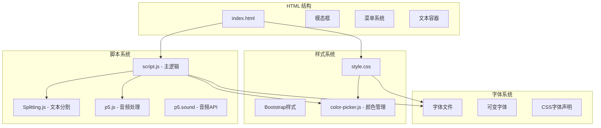
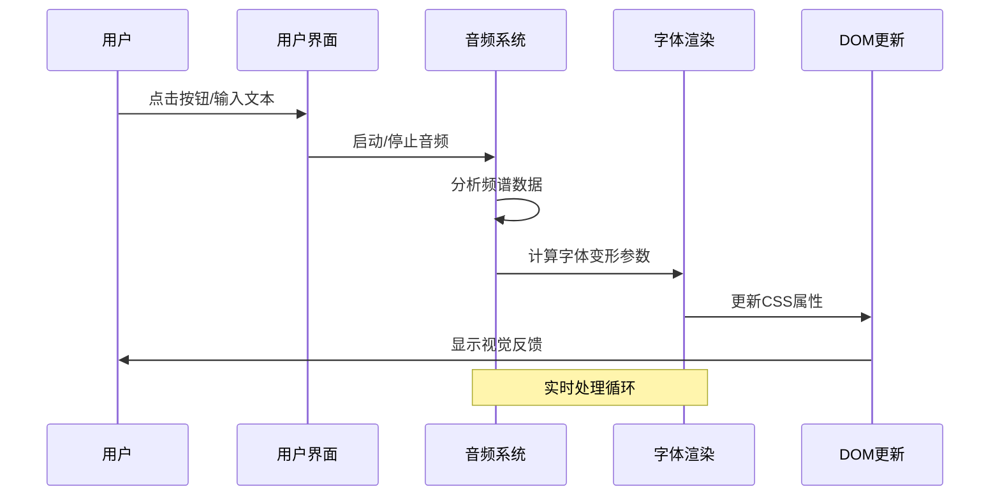
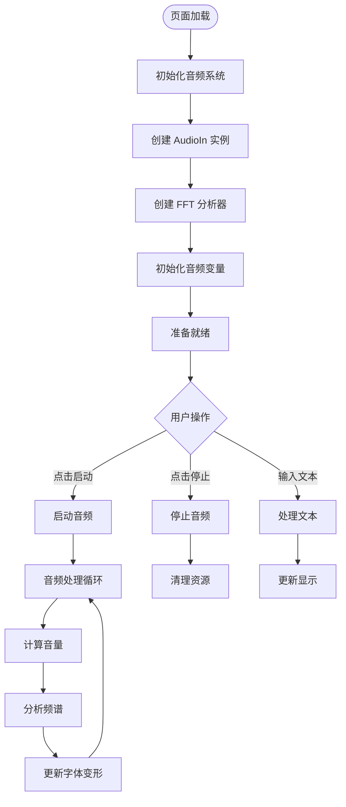
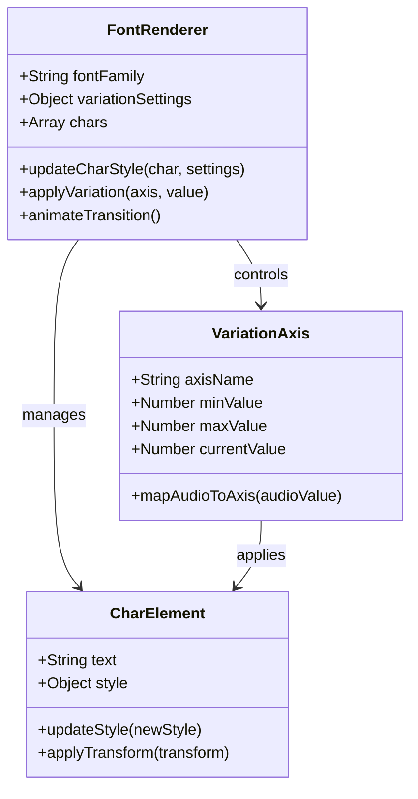
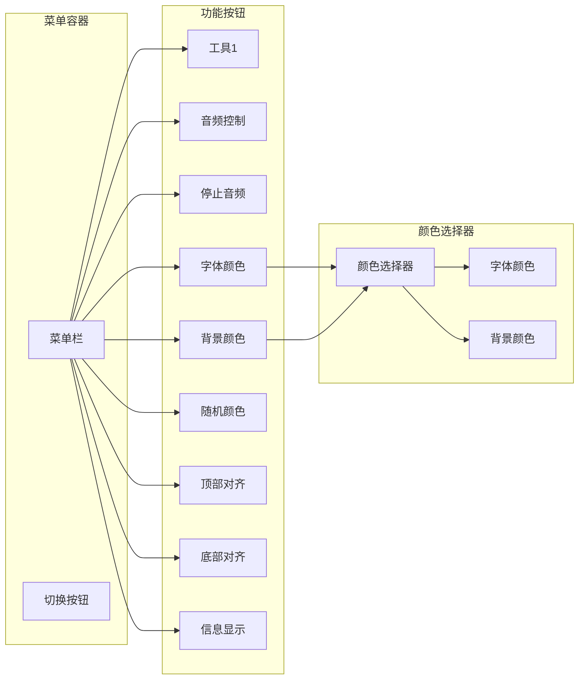
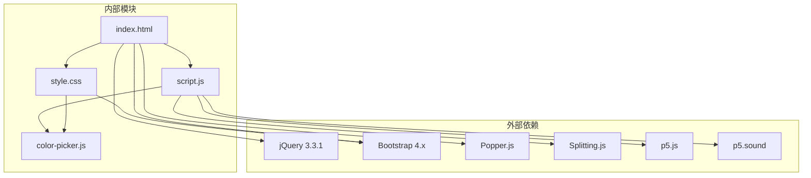
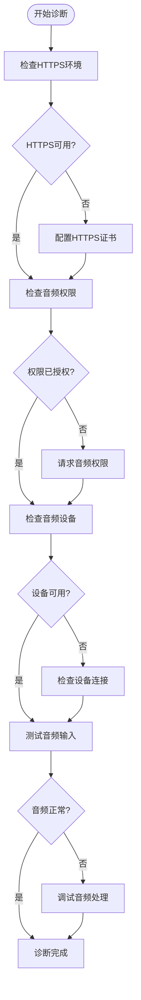

# 调试与故障排除

<cite>
**本文档引用的文件**
- [index.html](file://index.html)
- [script.js](file://js/script.js)
- [style.css](file://styles/style.css)
- [color-picker.js](file://js/color-picker.js)
- [FONT-REPLACEMENT-GUIDE.md](file://FONT-REPLACEMENT-GUIDE.md)
</cite>

## 目录
1. [简介](#简介)
2. [项目结构](#项目结构)
3. [核心组件](#核心组件)
4. [架构概览](#架构概览)
5. [详细组件分析](#详细组件分析)
6. [依赖关系分析](#依赖关系分析)
7. [性能考虑](#性能考虑)
8. [故障排除指南](#故障排除指南)
9. [结论](#结论)

## 简介

MySymphosizer 是一个基于 Web Audio API 和可变字体的交互式音频可视化项目。该项目实现了声音驱动的文字变形效果，通过麦克风输入实时控制字体的可变轴参数，创造出独特的听觉视觉体验。

本指南将提供全面的调试与故障排除方法，涵盖浏览器开发者工具使用、音频处理调试、字体渲染调试、移动端调试以及常见问题诊断流程。

## 项目结构

MySymphosizer 采用模块化的前端架构，主要包含以下组件：

**图表来源**
- [index.html:1-282](file://index.html#L1-L282)
- [style.css:1-1573](file://styles/style.css#L1-L1573)

**章节来源**
- [index.html:1-282](file://index.html#L1-L282)
- [style.css:1-1573](file://styles/style.css#L1-L1573)

## 核心组件

### 音频处理系统

项目使用 p5.js 和 p5.sound 实现音频输入和处理功能：

- **音频输入**: 使用 `p5.AudioIn()` 创建麦克风输入
- **频谱分析**: 通过 `fft.analyze()` 获取频率数据
- **音量检测**: 实现自定义音量计算和阈值判断
- **实时处理**: 在 draw 循环中实时更新字体变形

### 字体渲染系统

- **可变字体**: 支持 `font-variation-settings` 动态控制
- **文本分割**: 使用 Splitting.js 将文本逐字符处理
- **CSS 动画**: 实现平滑的字体变形动画效果

### 用户界面系统

- **菜单系统**: 提供 9 个功能按钮的交互界面
- **颜色管理**: 支持背景色和字体色的实时切换
- **响应式设计**: 适配不同屏幕尺寸的设备

**章节来源**
- [script.js:1-1049](file://js/script.js#L1-L1049)
- [style.css:851-950](file://styles/style.css#L851-L950)

## 架构概览

**图表来源**
- [script.js:301-426](file://js/script.js#L301-L426)
- [script.js:184-201](file://js/script.js#L184-L201)

## 详细组件分析

### 音频处理组件

音频处理是项目的核心功能，主要实现在 `script.js` 中：

#### 音频初始化流程

**图表来源**
- [script.js:178-201](file://js/script.js#L178-L201)
- [script.js:301-426](file://js/script.js#L301-L426)

#### 音频处理算法

音频处理涉及多个复杂的数学计算：

1. **音量计算**: 使用平滑算法处理音频信号
2. **频谱分析**: 通过 FFT 获取频率分布
3. **参数映射**: 将音频数据映射到字体变形参数
4. **实时更新**: 在每帧中更新视觉效果

**章节来源**
- [script.js:316-365](file://js/script.js#L316-L365)
- [script.js:367-416](file://js/script.js#L367-L416)

### 字体渲染组件

字体渲染系统基于可变字体技术，实现动态的视觉效果：

#### 字体变形机制

**图表来源**
- [style.css:851-906](file://styles/style.css#L851-L906)
- [script.js:409-416](file://js/script.js#L409-L416)

#### CSS 动画系统

项目使用多种 CSS 动画实现流畅的视觉效果：

- **加载动画**: `.loading` 类的字符弹跳效果
- **闪烁效果**: `.blinking` 类的光标闪烁
- **过渡动画**: 平滑的颜色和位置变化

**章节来源**
- [style.css:230-275](file://styles/style.css#L230-L275)
- [style.css:867-906](file://styles/style.css#L867-L906)

### 用户界面组件

用户界面采用响应式设计，支持多种设备：

#### 菜单系统架构

**图表来源**
- [index.html:54-178](file://index.html#L54-L178)
- [color-picker.js:1-231](file://js/color-picker.js#L1-L231)

**章节来源**
- [index.html:54-178](file://index.html#L54-L178)
- [color-picker.js:1-231](file://js/color-picker.js#L1-L231)

## 依赖关系分析

**图表来源**
- [index.html:254-261](file://index.html#L254-L261)
- [script.js:178-201](file://js/script.js#L178-L201)

**章节来源**
- [index.html:254-261](file://index.html#L254-L261)
- [script.js:178-201](file://js/script.js#L178-L201)

## 性能考虑

### 音频处理性能优化

1. **采样率管理**: 使用合适的采样率平衡音质和性能
2. **内存管理**: 及时释放音频资源，避免内存泄漏
3. **计算优化**: 使用高效的数学函数减少 CPU 开销
4. **渲染优化**: 限制 DOM 操作频率，使用 requestAnimationFrame

### 渲染性能优化

1. **CSS 动画**: 使用 GPU 加速的 CSS 属性
2. **字体优化**: 使用可变字体减少字体文件数量
3. **响应式设计**: 适配不同设备的性能特点
4. **懒加载**: 延迟加载非关键资源

## 故障排除指南

### 浏览器开发者工具使用

#### 控制台调试

**常用调试技巧**：
- 使用 `console.log()` 输出变量值
- 使用 `console.error()` 标记错误信息
- 使用 `console.table()` 格式化输出数组或对象
- 使用 `console.time()` 和 `console.timeEnd()` 测量执行时间

**调试断点设置**：
- 在 `script.js` 中的关键函数处设置断点
- 监控音频数据流的变化
- 检查 DOM 元素的状态变化

#### 网络请求分析

**音频权限问题诊断**：
1. 检查浏览器控制台的权限错误信息
2. 验证 HTTPS 环境下的音频访问
3. 检查麦克风设备的可用性

**字体加载问题诊断**：
1. 使用 Network 面板检查字体文件的加载状态
2. 验证字体文件的 MIME 类型
3. 检查跨域访问权限

#### 性能分析

**Chrome DevTools 使用**：
1. **Performance 面板**: 录制页面交互，分析性能瓶颈
2. **Memory 面板**: 检测内存泄漏和垃圾回收
3. **Rendering 面板**: 检查合成层和重绘问题

**性能监控指标**：
- FPS（每秒帧数）
- CPU 使用率
- 内存占用
- GPU 使用情况

### 音频处理调试

#### Web Audio API 调试

**音频输入问题**：
1. 检查 `AudioContext` 的状态
2. 验证 `AudioIn` 实例的创建
3. 监控音频流的数据变化

**FFT 分析验证**：
1. 检查频谱数据的范围和数值
2. 验证频率映射的正确性
3. 监控音频阈值的设置

**音量检测问题排查**：
1. 检查音量计算的算法
2. 验证平滑滤波器的参数
3. 监控音频阈值的动态调整

#### 音频权限问题诊断流程

**图表来源**
- [script.js:184-192](file://js/script.js#L184-L192)

**章节来源**
- [script.js:184-192](file://js/script.js#L184-L192)
- [script.js:384-386](file://js/script.js#L384-L386)

### 字体渲染调试

#### CSS 变量检查

**字体轴参数验证**：
1. 检查 `font-variation-settings` 的语法格式
2. 验证可变轴参数的有效范围
3. 监控字体变形的实时变化

**字体加载问题排查**：
1. 检查 `@font-face` 规则的正确性
2. 验证字体文件的路径和格式
3. 监控字体加载的进度和错误

#### 动画性能分析

**CSS 动画优化**：
1. 使用 `will-change` 属性提示浏览器优化
2. 避免触发强制同步布局
3. 使用 `transform` 和 `opacity` 属性实现硬件加速

**字体变形性能监控**：
1. 监控 `font-variation-settings` 的更新频率
2. 检查 CSS 动画的帧率
3. 优化动画的复杂度

#### 字体替换指南

**字体更换流程**：
1. 准备新的可变字体文件
2. 更新 CSS 中的 `@font-face` 声明
3. 调整 `font-variation-settings` 参数
4. 测试新的字体效果

**字体轴参数映射**：
- `YTUC` 轴映射到 `hght` 轴
- 音量值映射到 `YTUC` 参数范围
- 字符间距映射到 `vrsb` 参数

**章节来源**
- [FONT-REPLACEMENT-GUIDE.md:1-263](file://FONT-REPLACEMENT-GUIDE.md#L1-L263)
- [style.css:851-906](file://styles/style.css#L851-L906)

### 移动端调试

#### 触摸事件调试

**触摸事件处理**：
1. 检查 `ontouchstart`、`ontouchmove`、`ontouchend` 事件
2. 验证触摸坐标的位置计算
3. 监控触摸手势的识别

**移动设备兼容性**：
1. 检查 `isMobile` 判断逻辑
2. 验证移动设备的特殊处理
3. 测试不同移动浏览器的兼容性

#### 设备兼容性测试

**用户代理检测**：
1. 检查移动设备的识别规则
2. 验证屏幕尺寸的判断逻辑
3. 测试不同分辨率的适配效果

**移动端性能优化**：
1. 降低音频处理的复杂度
2. 优化字体渲染的性能
3. 减少 DOM 操作的频率

#### 性能监控

**移动端性能指标**：
1. FPS 监控和优化
2. 内存使用情况的跟踪
3. 电池消耗的影响评估

### 常见问题诊断流程

#### UI 响应异常

**界面无响应问题**：
1. 检查事件监听器的绑定状态
2. 验证 DOM 元素的可见性和可交互性
3. 监控 JavaScript 错误的抛出

**菜单系统问题**：
1. 检查按钮的启用/禁用状态
2. 验证颜色选择器的显示逻辑
3. 监控菜单切换的动画效果

#### 音频权限问题

**权限获取失败**：
1. 检查浏览器的安全策略
2. 验证 HTTPS 环境的配置
3. 测试不同浏览器的兼容性

**音频设备不可用**：
1. 检查设备的连接状态
2. 验证设备的权限设置
3. 测试备用音频源

#### 字体加载失败

**字体文件加载错误**：
1. 检查字体文件的路径配置
2. 验证字体文件的格式支持
3. 监控网络请求的响应状态

**字体渲染异常**：
1. 检查 CSS 规则的优先级
2. 验证字体回退机制
3. 监控字体加载的超时处理

### 错误日志分析

#### 错误分类和处理

**音频相关错误**：
- `AudioContext` 初始化失败
- 麦克风权限被拒绝
- 音频设备不可用

**字体相关错误**：
- 字体文件加载失败
- CSS 规则解析错误
- 字体轴参数超出范围

**界面相关错误**：
- DOM 元素不存在
- 事件监听器绑定失败
- CSS 动画执行异常

#### 解决方案收集

**音频问题解决方案**：
1. 确保 HTTPS 环境
2. 提供清晰的权限说明
3. 实现降级的音频处理方案

**字体问题解决方案**：
1. 提供字体回退机制
2. 实现字体加载的错误处理
3. 优化字体文件的大小

**界面问题解决方案**：
1. 实现健壮的 DOM 操作
2. 添加错误边界处理
3. 提供友好的错误提示

**章节来源**
- [script.js:384-386](file://js/script.js#L384-L386)
- [script.js:413-415](file://js/script.js#L413-L415)

## 结论

MySymphosizer 项目展示了现代 Web 技术在音频可视化领域的应用。通过合理的架构设计和调试策略，可以有效解决各种技术挑战。

**关键要点**：
1. **音频处理**: 使用 Web Audio API 实现高质量的音频可视化
2. **字体渲染**: 基于可变字体技术实现动态的视觉效果
3. **性能优化**: 通过多种技术手段确保流畅的用户体验
4. **调试策略**: 建立完善的调试和故障排除体系

**最佳实践建议**：
1. 始终在 HTTPS 环境下开发和部署
2. 实现优雅的降级方案以应对兼容性问题
3. 建立完整的性能监控和日志记录机制
4. 提供详细的用户反馈和错误提示

通过遵循本指南提供的调试和故障排除方法，可以有效提升项目的稳定性和用户体验。