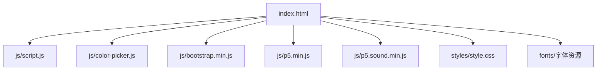
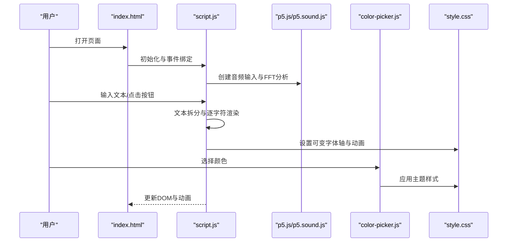
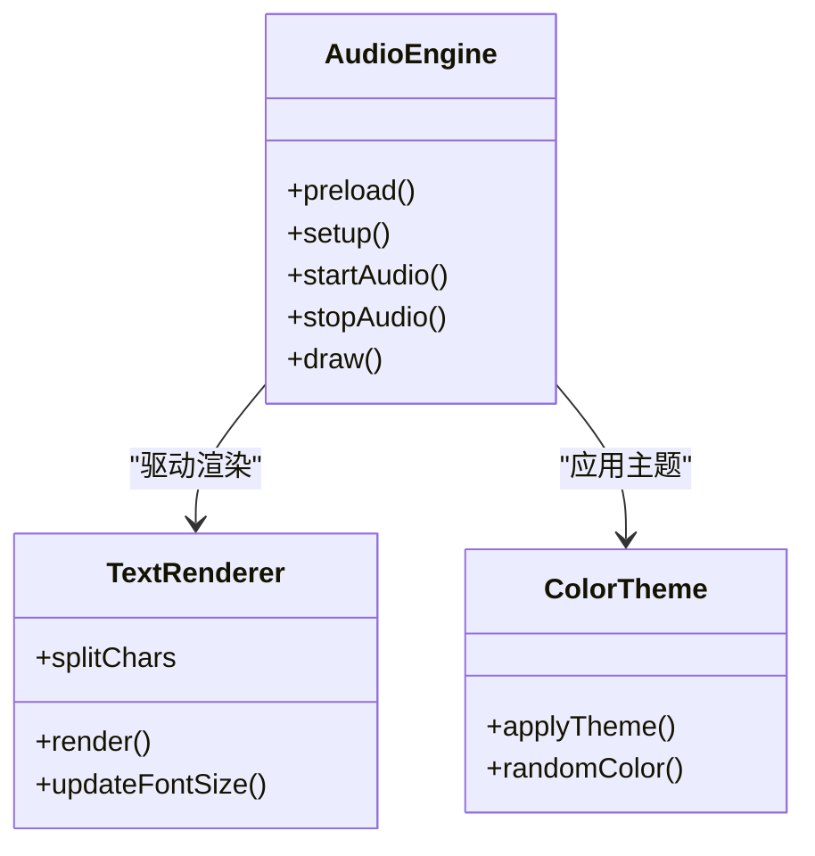
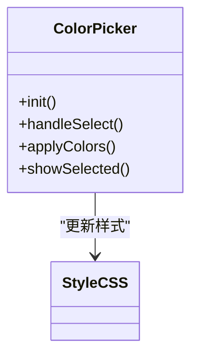
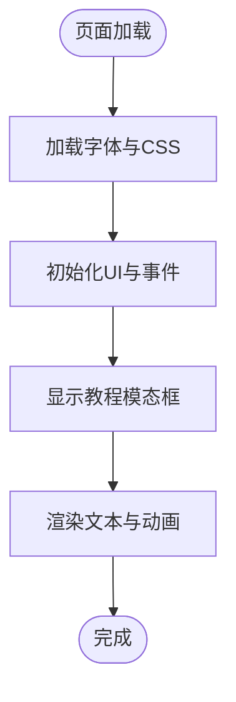
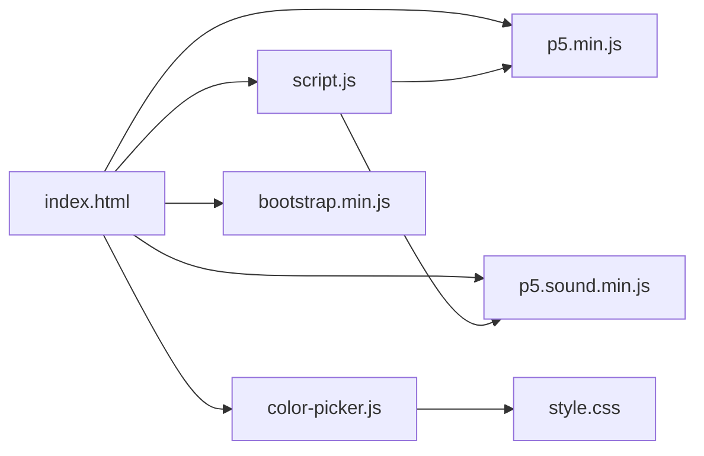

# 贡献指南

<cite>
**本文引用的文件**
- [index.html](file://index.html)
- [script.js](file://js/script.js)
- [color-picker.js](file://js/color-picker.js)
- [style.css](file://styles/style.css)
- [bootstrap.min.js](file://js/bootstrap.min.js)
- [p5.min.js](file://js/p5.min.js)
- [p5.sound.min.js](file://js/p5.sound.min.js)
- [FONT-REPLACEMENT-GUIDE.md](file://FONT-REPLACEMENT-GUIDE.md)
</cite>

## 目录
1. [简介](#简介)
2. [项目结构](#项目结构)
3. [核心组件](#核心组件)
4. [架构总览](#架构总览)
5. [详细组件分析](#详细组件分析)
6. [依赖关系分析](#依赖关系分析)
7. [性能考量](#性能考量)
8. [故障排查指南](#故障排查指南)
9. [结论](#结论)
10. [附录](#附录)

## 简介
本指南面向希望为 MySymphosizer 项目做出贡献的开发者，提供从 Fork 到提交 Pull Request 的完整流程、代码审查标准、问题报告模板、社区行为准则、版本发布流程、贡献者认可机制以及新贡献者入门与导师制度说明。本项目是一个基于 Web 的声音驱动动态排版交互应用，前端采用 HTML/CSS/JavaScript，结合 p5.js 音频处理与 Bootstrap UI 组件。

## 项目结构
项目采用静态网站结构，核心入口为 HTML 页面，通过多个 JS 模块实现音频输入、文本拆分渲染、颜色选择器与交互菜单等功能；样式通过 CSS 控制布局与动画。

图表来源
- [index.html](file://index.html)
- [script.js](file://js/script.js)
- [color-picker.js](file://js/color-picker.js)
- [style.css](file://styles/style.css)
- [bootstrap.min.js](file://js/bootstrap.min.js)
- [p5.min.js](file://js/p5.min.js)
- [p5.sound.min.js](file://js/p5.sound.min.js)

章节来源
- [index.html](file://index.html)
- [style.css](file://styles/style.css)

## 核心组件
- 入口与页面结构：index.html 提供页面骨架、模态框、菜单栏、输入框与显示区域。
- 动态排版与音频处理：script.js 负责音频初始化、频谱分析、文本拆分与逐字符渲染、可变字体轴控制、移动端适配与交互逻辑。
- 颜色选择器：color-picker.js 提供颜色面板与实时主题切换。
- UI 框架：bootstrap.min.js 提供模态框与栅格系统等 UI 组件。
- 音频库：p5.min.js 与 p5.sound.min.js 提供 Web Audio API 封装与音频处理能力。
- 样式与动画：style.css 定义字体加载、关键帧动画、响应式布局与交互样式。
- 字体替换指南：FONT-REPLACEMENT-GUIDE.md 提供可变字体轴映射与替换流程。

章节来源
- [script.js](file://js/script.js)
- [color-picker.js](file://js/color-picker.js)
- [style.css](file://styles/style.css)
- [bootstrap.min.js](file://js/bootstrap.min.js)
- [p5.min.js](file://js/p5.min.js)
- [p5.sound.min.js](file://js/p5.sound.min.js)
- [FONT-REPLACEMENT-GUIDE.md](file://FONT-REPLACEMENT-GUIDE.md)

## 架构总览
下图展示页面加载到音频处理与动态排版渲染的关键调用链：

图表来源
- [index.html](file://index.html)
- [script.js](file://js/script.js)
- [color-picker.js](file://js/color-picker.js)
- [style.css](file://styles/style.css)
- [p5.min.js](file://js/p5.min.js)
- [p5.sound.min.js](file://js/p5.sound.min.js)

## 详细组件分析

### 组件A：音频与动态排版引擎（script.js）
- 职责：初始化音频输入、频谱分析、文本拆分、逐字符渲染、可变字体轴映射与动画、移动端交互。
- 关键流程：
  - 预加载与尺寸检测
  - 音频输入与阈值校准
  - 文本输入监听与重置
  - 音量与频谱计算
  - 逐字符渲染与 transform/font-variation-settings 应用
  - 移动端触摸与滑条控制
- 代码级关系图：

图表来源
- [script.js](file://js/script.js)

章节来源
- [script.js](file://js/script.js)

### 组件B：颜色选择器（color-picker.js）
- 职责：提供颜色面板、主题切换、实时样式应用。
- 关键流程：
  - 初始化颜色列表与选中状态
  - 点击事件处理与样式更新
  - 自定义颜色支持与回显
- 代码级关系图：

图表来源
- [color-picker.js](file://js/color-picker.js)
- [style.css](file://styles/style.css)

章节来源
- [color-picker.js](file://js/color-picker.js)
- [style.css](file://styles/style.css)

### 组件C：页面结构与样式（index.html、style.css）
- 职责：页面骨架、模态框、菜单、输入与显示区域、关键帧动画与响应式布局。
- 关键流程：
  - 页面加载与模态框展示
  - 字体加载与可变轴动画
  - 响应式断点与移动端适配
- 流程图（页面加载与字体动画）：

图表来源
- [index.html](file://index.html)
- [style.css](file://styles/style.css)

章节来源
- [index.html](file://index.html)
- [style.css](file://styles/style.css)

### 组件D：字体替换指南（FONT-REPLACEMENT-GUIDE.md）
- 职责：提供可变字体轴映射、CSS与JS替换步骤、测试验证方法。
- 关键流程：
  - 准备新字体文件
  - 修改CSS与JS中的font-variation-settings
  - 调整映射范围与关键帧动画
  - 快速测试与调试

章节来源
- [FONT-REPLACEMENT-GUIDE.md](file://FONT-REPLACEMENT-GUIDE.md)

## 依赖关系分析
- 外部库依赖：
  - Bootstrap：提供模态框与基础 UI 组件。
  - p5.js 与 p5.sound：提供 Web Audio API 封装与音频处理。
- 内部模块依赖：
  - script.js 依赖 p5.js 与 DOM 结构。
  - color-picker.js 依赖 DOM 与 style.css 样式。
  - index.html 作为入口协调各模块。

图表来源
- [index.html](file://index.html)
- [script.js](file://js/script.js)
- [color-picker.js](file://js/color-picker.js)
- [bootstrap.min.js](file://js/bootstrap.min.js)
- [p5.min.js](file://js/p5.min.js)
- [p5.sound.min.js](file://js/p5.sound.min.js)
- [style.css](file://styles/style.css)

章节来源
- [index.html](file://index.html)
- [script.js](file://js/script.js)
- [color-picker.js](file://js/color-picker.js)
- [style.css](file://styles/style.css)
- [bootstrap.min.js](file://js/bootstrap.min.js)
- [p5.min.js](file://js/p5.min.js)
- [p5.sound.min.js](file://js/p5.sound.min.js)

## 性能考量
- 音频处理：
  - 使用 FFT 分析与平滑算法降低抖动，避免每帧高复杂度计算。
  - 仅在需要时启用麦克风与频谱分析，减少 CPU/GPU 占用。
- 渲染优化：
  - 文本按字符拆分渲染，合理设置帧率与缩放。
  - 使用 transform 与 font-variation-settings 实现硬件加速动画。
- 响应式与移动端：
  - 通过媒体查询与断点优化布局与交互元素大小。
  - 移动端触摸事件与滑条控制需注意性能与交互延迟。

## 故障排查指南
- 常见问题与定位：
  - 音频未启用：检查浏览器权限与麦克风初始化逻辑。
  - 文本不渲染或动画异常：检查 splitChars 初始化与 font-variation-settings 设置。
  - 颜色选择无效：确认 color-picker.js 事件绑定与样式应用。
  - 字体替换后动画异常：核对轴标签与映射范围是否匹配。
- 调试建议：
  - 使用浏览器开发者工具查看 Console 报错与网络加载。
  - 逐步注释与恢复代码以定位问题模块。
  - 参考 FONT-REPLACEMENT-GUIDE.md 的快速测试步骤验证修复。

章节来源
- [script.js](file://js/script.js)
- [color-picker.js](file://js/color-picker.js)
- [style.css](file://styles/style.css)
- [FONT-REPLACEMENT-GUIDE.md](file://FONT-REPLACEMENT-GUIDE.md)

## 结论
本指南提供了从贡献流程到代码审查、问题报告、社区行为、版本发布、贡献者认可与新成员培养的完整方案。请在提交变更前确保遵循审查标准与测试流程，共同维护高质量的开源协作生态。

## 附录

### 贡献流程（Fork → PR）
- Fork 仓库至个人账号
- 创建特性分支（建议以 issue 编号命名）
- 提交代码并撰写清晰的提交信息
- 发起 Pull Request，填写 PR 模板
- 代码审查与讨论，按反馈修改
- 通过审查后合并

### 代码审查标准
- 代码质量
  - 符合现有编码风格与命名约定
  - 注释清晰，关键逻辑有说明
  - 无冗余与重复代码
- 文档更新
  - 新增功能需补充 README 或相关文档
  - 字体替换等技术文档需同步更新
- 测试与验证
  - 在本地环境验证功能与兼容性
  - 提供截图或简要说明验证结果

### 问题报告模板
- Bug 报告
  - 复现步骤、期望结果、实际结果
  - 浏览器与设备信息
  - 截图或最小复现示例
- 功能请求
  - 背景与动机、预期行为、影响范围
- 安全漏洞
  - 详细描述与影响评估
  - 提供 PoC 或修复建议

### 社区行为准则
- 尊重与包容：保持友善与专业
- 开放沟通：及时回复与建设性反馈
- 解决冲突：聚焦问题本身，避免人身攻击
- 团队协作：遵循流程与分工，互相帮助

### 版本发布流程
- 版本号规则
  - 语义化版本：主版本.次版本.修订号
- 发布说明
  - 新增、修复、改进与已知问题
- 向后兼容性
  - 避免破坏性变更；必要时提升主版本
  - 提供迁移指南与兼容策略

### 贡献者认可机制
- 贡献者列表：在 README 或贡献者名单中标注
- 感谢信：对重大贡献给予公开致谢
- 社区活动：组织线上/线下分享与交流

### 新贡献者入门与导师制度
- 入门指导
  - 提供环境搭建与运行说明
  - 推荐从简单任务开始（文档、测试、小修复）
- 导师制度
  - 指派资深贡献者作为导师
  - 定期检查进度与答疑