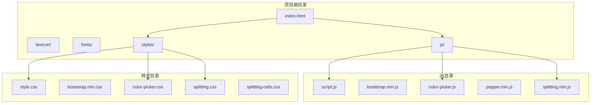
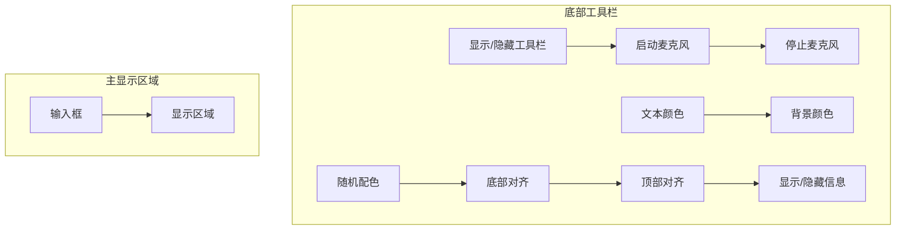
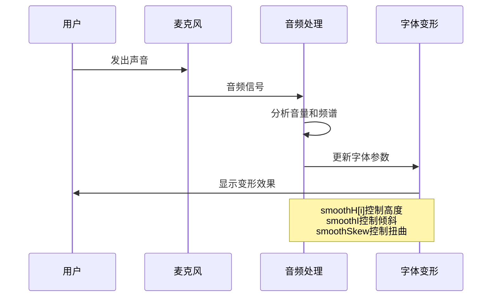
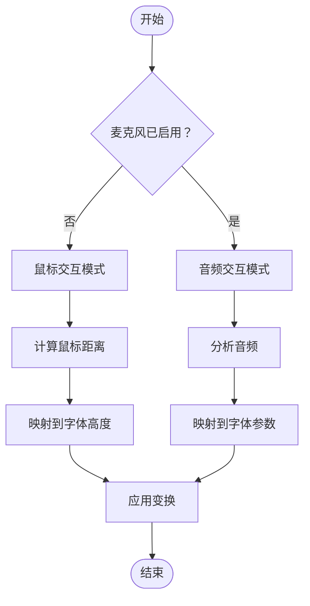
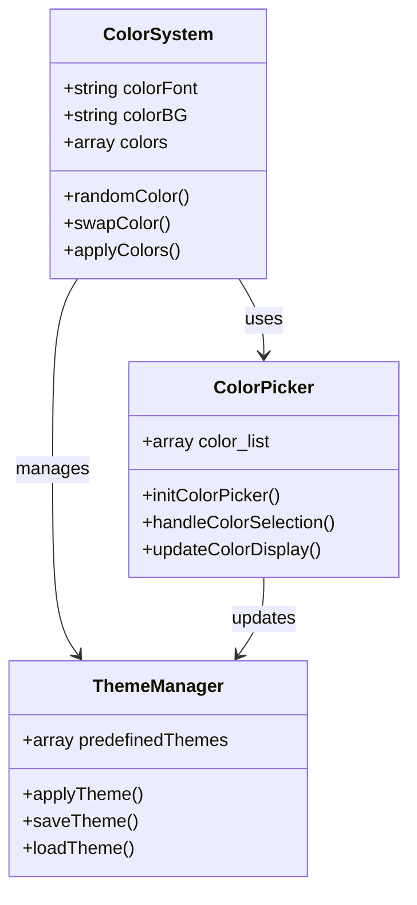
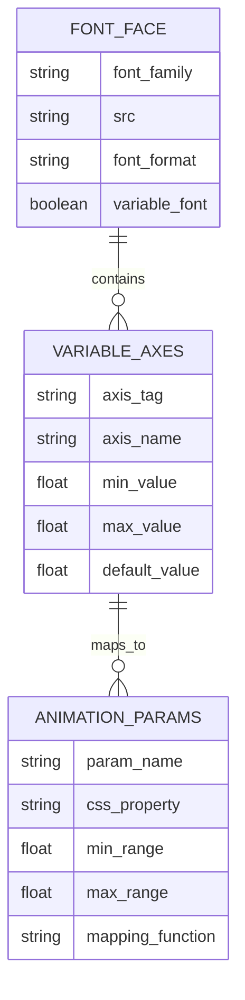

# 快速开始

<cite>
**本文档引用的文件**
- [index.html](file://index.html)
- [script.js](file://js/script.js)
- [style.css](file://styles/style.css)
- [color-picker.js](file://js/color-picker.js)
- [splitting.min.js](file://js/splitting.min.js)
- [FONT-REPLACEMENT-GUIDE.md](file://FONT-REPLACEMENT-GUIDE.md)
</cite>

## 目录
1. [简介](#简介)
2. [项目结构](#项目结构)
3. [安装与环境准备](#安装与环境准备)
4. [首次启动](#首次启动)
5. [基础使用指南](#基础使用指南)
6. [声音控制字体变形](#声音控制字体变形)
7. [鼠标交互操作](#鼠标交互操作)
8. [颜色主题调整](#颜色主题调整)
9. [字体系统详解](#字体系统详解)
10. [常见问题解决](#常见问题解决)
11. [故障排除](#故障排除)
12. [最佳实践](#最佳实践)

## 简介

MySymphosizer是一个创新的声音激活字体变形艺术装置，允许用户通过声音和鼠标交互来控制可变字体的动态变形。该项目基于Web技术栈构建，利用现代浏览器的音频处理能力和可变字体特性，创造出独特的视觉音乐体验。

## 项目结构

MySymphosizer采用简洁而高效的文件组织结构：



**图表来源**
- [index.html](file://index.html)
- [script.js](file://js/script.js)
- [style.css](file://styles/style.css)

**章节来源**
- [index.html](file://index.html)
- [script.js](file://js/script.js)
- [style.css](file://styles/style.css)

## 安装与环境准备

### 系统要求

MySymphosizer对浏览器有以下兼容性要求：

#### 浏览器支持
- **Chrome**: 版本 60+
- **Firefox**: 版本 68+
- **Safari**: 版本 14+
- **Edge**: 版本 79+

#### 硬ware要求
- 支持Web Audio API的设备
- 支持WebRTC的麦克风权限
- 现代GPU加速的图形渲染能力

### 环境准备步骤

1. **下载项目文件**
   - 克隆或下载整个项目到本地目录

2. **字体文件准备**
   - 确保fonts/目录包含以下必需文件：
     - `HanYiaranyatheaterfestivalTiVF-260413VF-02.ttf` (可变字体)
     - `ABCSymphonyHeadline-Regular.otf` (标题字体)
     - `ABCSymphonyText-Regular.otf` (正文字体)

3. **本地服务器设置**
   - 使用Python内置服务器：`python -m http.server 8765`
   - 或使用Node.js http-server：`npx http-server`

**章节来源**
- [index.html](file://index.html)
- [style.css](file://styles/style.css)

## 首次启动

### 启动流程

1. **打开项目**
   ```
   http://localhost:8765/
   ```

2. **初始界面**
   - 页面会显示加载动画
   - 自动弹出教程模态框
   - 显示"LOADING"动画效果

3. **权限授权**
   - 点击"PLAY"按钮
   - 授权麦克风访问权限
   - 授权相机访问权限（用于检测面部表情）

### 首次使用检查清单

- [ ] 浏览器显示"允许使用麦克风？"
- [ ] 页面显示"MAKE SOME NOISE"文本
- [ ] 字体加载完成，显示可变字体效果
- [ ] 工具栏按钮可用

**章节来源**
- [index.html](file://index.html)
- [script.js](file://js/script.js)

## 基础使用指南

### 用户界面组件

MySymphosizer采用底部工具栏设计，包含9个功能按钮：



**图表来源**
- [index.html](file://index.html)

### 基本交互模式

1. **点击输入框**：激活文本编辑模式
2. **拖拽工具栏**：显示/隐藏工具按钮
3. **点击按钮**：执行相应功能
4. **移动鼠标**：控制字体变形

**章节来源**
- [index.html](file://index.html)
- [script.js](file://js/script.js)

## 声音控制字体变形

### 音频处理机制

MySymphosizer使用p5.js的AudioIn模块处理音频输入：



**图表来源**
- [script.js](file://js/script.js)

### 音量控制参数

| 参数 | 默认值 | 作用 | 调整范围 |
|------|--------|------|----------|
| micThreshold | 1.1 | 音量阈值 | 1.0 - 2.5 |
| smoothAmount | 0.5 | 平滑系数 | 0.1 - 0.9 |
| loudSize | 1 | 响度缩放 | 1 - 5 |

### 声音敏感度调节

1. **麦克风滑块**：位于屏幕底部
2. **实时调整**：鼠标悬停时显示
3. **自动隐藏**：移开鼠标后淡出

**章节来源**
- [script.js](file://js/script.js)

## 鼠标交互操作

### 鼠标控制模式

当未启用麦克风时，系统自动切换到鼠标交互模式：



**图表来源**
- [script.js](file://js/script.js)

### 交互参数

| 参数 | 计算方式 | 影响效果 |
|------|----------|----------|
| smoothH[i] | 基于鼠标距离映射 | 控制字符高度 |
| smoothI | 基于垂直位置映射 | 控制倾斜角度 |
| smoothSkew | 音频模式下为0 | 控制扭曲程度 |

**章节来源**
- [script.js](file://js/script.js)

## 颜色主题调整

### 颜色系统架构

MySymphosizer内置了丰富的颜色主题系统：



**图表来源**
- [color-picker.js](file://js/color-picker.js)
- [script.js](file://js/script.js)

### 预定义颜色方案

系统内置32种预定义颜色组合，涵盖各种视觉效果：

| 颜色组合 | 适用场景 | 特点 |
|----------|----------|------|
| 黄色/蓝色 | 清新明亮 | 高对比度 |
| 绿色/蓝色 | 自然和谐 | 舒适感 |
| 粉色/棕色 | 温暖复古 | 温馨感 |
| 黑白配色 | 经典简约 | 专业感 |
| 红色/绿色 | 节日氛围 | 活泼感 |

### 颜色选择器功能

1. **预设颜色**：26种标准颜色
2. **自定义颜色**：HTML5颜色选择器
3. **实时预览**：所选颜色立即生效
4. **颜色同步**：文本颜色和背景颜色独立控制

**章节来源**
- [color-picker.js](file://js/color-picker.js)
- [style.css](file://styles/style.css)

## 字体系统详解

### 可变字体架构

MySymphosizer基于汉仪字体系列构建，支持多轴可变：



**图表来源**
- [style.css](file://styles/style.css)
- [FONT-REPLACEMENT-GUIDE.md](file://FONT-REPLACEMENT-GUIDE.md)

### 字体轴参数

**更新**：字体系统已从ABC Symphony系列字体更新为汉仪字体，轴参数已调整为YTUC轴：

| 轴标签 | 名称 | 范围 | 说明 |
|--------|------|------|------|
| `YTUC` | Universal Control | 10 ~ 100 | 控制字形高度比例，核心动画参数 |

### 字体加载机制

1. **CSS @font-face声明**：定义字体源文件
2. **字体预加载**：页面初始化时加载
3. **动态参数控制**：通过font-variation-settings实时调整
4. **性能优化**：使用Web Workers避免阻塞主线程

**章节来源**
- [style.css](file://styles/style.css)
- [FONT-REPLACEMENT-GUIDE.md](file://FONT-REPLACEMENT-GUIDE.md)

## 常见问题解决

### 麦克风权限问题

**问题症状**：麦克风按钮不可用或显示灰色

**解决方案**：
1. 确认浏览器支持Web Audio API
2. 检查HTTPS环境（本地开发建议使用localhost）
3. 确认浏览器设置允许麦克风访问
4. 尝试刷新页面重新请求权限

### 字体加载失败

**问题症状**：显示默认字体而非汉仪字体

**解决方案**：
1. 确认fonts/目录包含所有必需字体文件
2. 检查字体文件路径是否正确
3. 验证字体文件完整性
4. 清除浏览器缓存后重试

### 性能问题

**问题症状**：页面卡顿或动画不流畅

**解决方案**：
1. 关闭不必要的浏览器标签页
2. 确保有足够的内存资源
3. 使用性能更好的浏览器
4. 调整动画参数减少负载

**章节来源**
- [script.js](file://js/script.js)
- [style.css](file://styles/style.css)

## 故障排除

### 开发者工具调试

1. **打开浏览器开发者工具**（F12）
2. **检查Console标签**：查看JavaScript错误
3. **检查Network标签**：确认字体文件加载
4. **检查Sources标签**：调试JavaScript代码

### 常见错误代码

| 错误类型 | 可能原因 | 解决方案 |
|----------|----------|----------|
| AudioContextError | 音频上下文初始化失败 | 检查HTTPS环境 |
| FontLoadError | 字体文件加载失败 | 验证文件路径 |
| PermissionDenied | 权限被拒绝 | 检查浏览器设置 |
| CanvasError | 画布渲染失败 | 更新显卡驱动 |

### 性能监控

使用浏览器性能面板监控：
- FPS帧率
- 内存使用情况
- CPU占用率
- GPU渲染时间

**章节来源**
- [script.js](file://js/script.js)

## 最佳实践

### 新手使用建议

1. **从简单开始**：先尝试基本的鼠标交互
2. **逐步探索**：了解每个工具按钮的功能
3. **注意音量**：避免过大声响损坏设备
4. **保存创意**：及时记录喜欢的配色组合

### 高级技巧

1. **双模式切换**：在鼠标和音频模式间灵活切换
2. **颜色搭配**：利用随机配色功能发现新的组合
3. **字体对齐**：根据内容选择合适的对齐方式
4. **动画节奏**：配合音乐节拍创造同步效果

### 创作指导

1. **主题一致性**：选择统一的颜色方案
2. **对比度考虑**：确保文字清晰可读
3. **动态平衡**：避免过度的字体变形
4. **情感表达**：通过字体变化传达情感

### 技术维护

1. **定期更新**：保持浏览器版本最新
2. **字体备份**：保留原始字体文件
3. **配置保存**：记录个人偏好的设置
4. **性能优化**：定期清理浏览器缓存

通过遵循这个快速开始指南，新用户应该能够在5分钟内完成基本设置并开始创作。遇到任何问题，请参考故障排除部分或查阅相关文档文件。