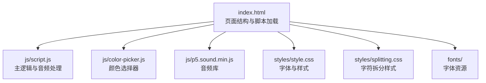
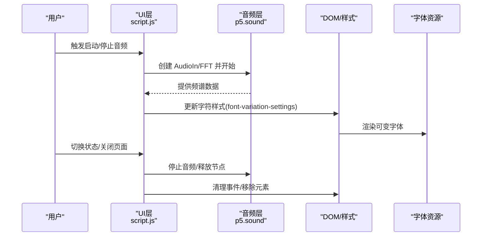
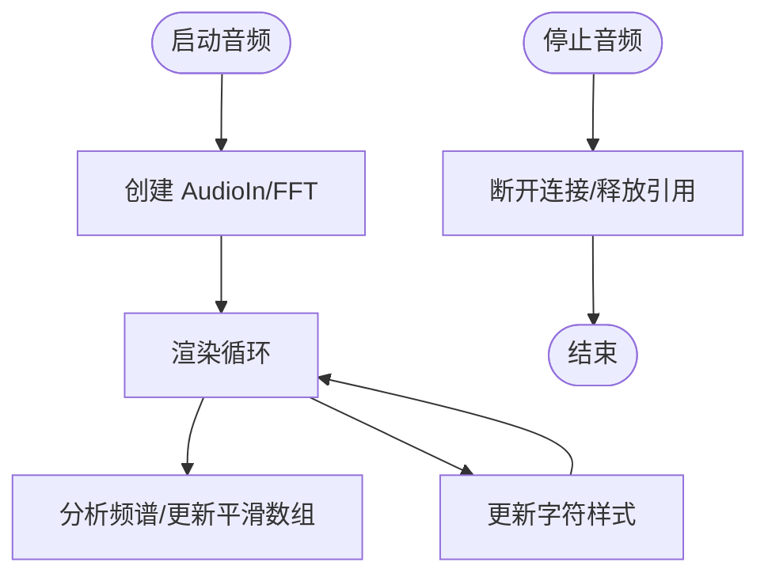
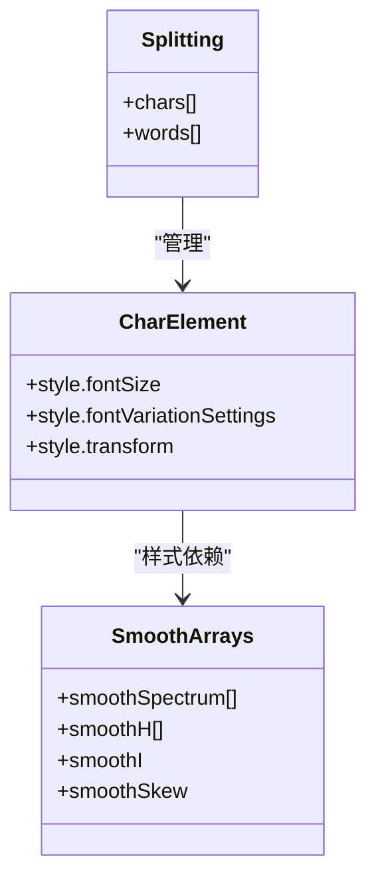
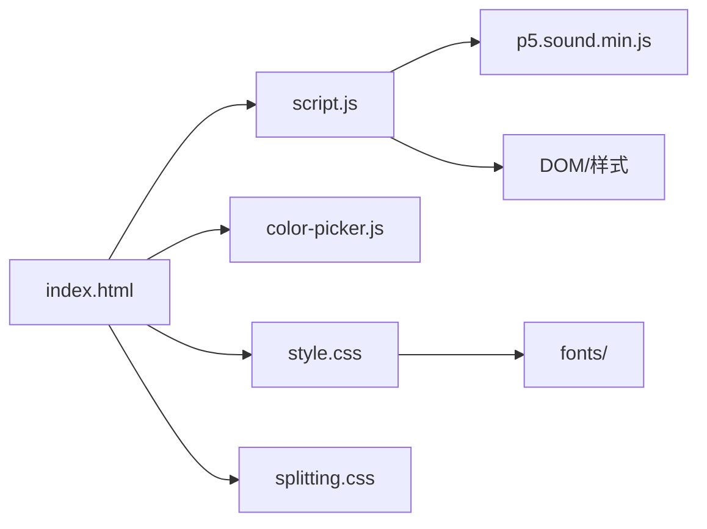

# 内存管理优化

<cite>
**本文档引用的文件**
- [index.html](file://index.html)
- [script.js](file://js/script.js)
- [color-picker.js](file://js/color-picker.js)
- [p5.sound.min.js](file://js/p5.sound.min.js)
- [style.css](file://styles/style.css)
- [splitting.css](file://styles/splitting.css)
- [FONT-REPLACEMENT-GUIDE.md](file://FONT-REPLACEMENT-GUIDE.md)
</cite>

## 目录
1. [简介](#简介)
2. [项目结构](#项目结构)
3. [核心组件](#核心组件)
4. [架构概览](#架构概览)
5. [详细组件分析](#详细组件分析)
6. [依赖关系分析](#依赖关系分析)
7. [性能考量](#性能考量)
8. [故障排除指南](#故障排除指南)
9. [结论](#结论)
10. [附录](#附录)

## 简介
本指南聚焦于该 JavaScript 项目的内存管理优化策略，涵盖闭包与事件监听器清理、DOM 引用释放、对象池与缓存优化（字符对象复用、音频数据缓存、字体资源管理）、垃圾回收优化（主动内存释放、弱引用使用、内存压力监控）、大型数据结构优化（音频频谱数组管理、平滑滤波器缓存、字符数组优化），以及内存使用监控工具与指标分析、内存性能测试方法与基准测试工具、具体优化案例与最佳实践建议。

## 项目结构
该项目是一个基于 Web Audio API 与可变字体的交互式动态排版应用，主要由 HTML 页面、CSS 样式、JavaScript 逻辑与字体资源组成。核心交互流程围绕麦克风输入、音频频谱分析、字符拆分与实时字体变形展开。

图表来源
- [index.html](file://index.html)
- [script.js](file://js/script.js)
- [color-picker.js](file://js/color-picker.js)
- [p5.sound.min.js](file://js/p5.sound.min.js)
- [style.css](file://styles/style.css)
- [splitting.css](file://styles/splitting.css)

章节来源
- [index.html](file://index.html)
- [script.js](file://js/script.js)

## 核心组件
- 音频系统：使用 p5.sound 创建麦克风输入与 FFT 分析，维护频谱数组与平滑滤波器数组。
- 字符拆分与渲染：使用 Splitting 将文本拆分为字符级元素，并通过 CSS 变量与 JavaScript 动态更新字体变形参数。
- 用户界面：菜单、颜色选择器、滑杆等 DOM 元素，负责用户交互与状态切换。
- 字体资源：可变字体通过 CSS 的 @font-face 定义，配合 JavaScript 的 font-variation-settings 实现动态变形。

章节来源
- [script.js](file://js/script.js)
- [style.css](file://styles/style.css)
- [splitting.css](file://styles/splitting.css)

## 架构概览
应用采用“事件驱动 + 循环渲染”的模式：初始化阶段创建音频节点与 DOM 引用；运行阶段在每帧循环中读取音频数据、更新字符样式、响应用户交互；退出或切换状态时执行清理以释放资源。

图表来源
- [script.js](file://js/script.js)
- [p5.sound.min.js](file://js/p5.sound.min.js)
- [style.css](file://styles/style.css)

## 详细组件分析

### 音频系统与内存优化
- 频谱数组与平滑滤波器数组
  - 初始化时创建固定长度数组用于存储频谱与平滑值，避免频繁分配。
  - 在渲染循环中仅更新现有数组元素，不重建数组。
- 音频节点生命周期
  - 启动时创建 AudioIn 与 FFT，停止时应确保断开连接并释放引用。
  - 使用 try/catch 包裹音频操作，防止异常导致资源未释放。
- 音量阈值与移动端适配
  - 不同设备使用不同的阈值，减少不必要的计算与渲染。

图表来源
- [script.js](file://js/script.js)
- [p5.sound.min.js](file://js/p5.sound.min.js)

章节来源
- [script.js](file://js/script.js)
- [p5.sound.min.js](file://js/p5.sound.min.js)

### 字符拆分与对象复用
- 字符拆分
  - 使用 Splitting 将文本拆分为字符级元素，便于逐字符控制。
  - 每帧更新字符的 fontSize、fontVariationSettings 与 transform，避免重复创建 DOM。
- 对象池与缓存
  - 通过复用已拆分的字符数组，减少 DOM 查询与样式计算开销。
  - 字体资源通过 CSS 缓存，避免重复下载与解析。

图表来源
- [script.js](file://js/script.js)
- [splitting.css](file://styles/splitting.css)

章节来源
- [script.js](file://js/script.js)
- [splitting.css](file://styles/splitting.css)

### 事件监听器清理与 DOM 引用释放
- 事件绑定与解绑
  - 在启动/停止音频时正确绑定与解绑事件，避免悬挂监听器。
  - 页面隐藏/卸载时清理定时器与事件监听器。
- DOM 引用释放
  - 通过移除元素或设置 display:none 降低内存占用。
  - 颜色选择器等模块在不需要时隐藏容器，避免持续渲染。

章节来源
- [script.js](file://js/script.js)
- [color-picker.js](file://js/color-picker.js)

### 字体资源管理与缓存优化
- 字体加载
  - 使用 @font-face 声明字体，确保可变字体轴参数与 JS 设置一致。
  - 字体文件放置在 fonts/ 目录，避免跨域与重复请求。
- 字体变形参数
  - 通过 CSS 变量与 JS 动态设置 font-variation-settings，减少重绘成本。
  - 在 GUIDE 中提供了字体轴参数映射与替换步骤，便于迁移与优化。

章节来源
- [style.css](file://styles/style.css)
- [FONT-REPLACEMENT-GUIDE.md](file://FONT-REPLACEMENT-GUIDE.md)

### 垃圾回收优化
- 主动内存释放
  - 在停止音频与切换状态时，显式断开音频节点连接，释放引用。
  - 清理 DOM 引用与事件监听器，避免闭包持有导致的内存泄漏。
- 弱引用与内存压力监控
  - 使用 WeakMap/WeakSet 存储非关键元数据，避免强引用导致的不可回收。
  - 结合浏览器内存面板观察堆增长趋势，定位泄漏点。

章节来源
- [script.js](file://js/script.js)
- [p5.sound.min.js](file://js/p5.sound.min.js)

### 大型数据结构优化
- 音频频谱数组
  - 固定大小数组存储频谱与平滑值，避免频繁扩容与 GC 抖动。
  - 使用 lerp 等函数进行平滑过渡，减少瞬时峰值带来的内存波动。
- 平滑滤波器缓存
  - 将平滑系数与历史值缓存在数组中，避免重复计算。
- 字符数组优化
  - 复用已拆分的字符数组，减少查询与样式计算次数。

章节来源
- [script.js](file://js/script.js)

## 依赖关系分析
- index.html 加载多个脚本与样式，形成 UI、音频、字体与交互的耦合。
- script.js 依赖 p5.sound 进行音频处理，依赖 Splitting 进行字符拆分，依赖 CSS 变量与字体资源进行渲染。
- color-picker.js 独立管理颜色选择器 UI，与主逻辑通过样式与事件交互。

图表来源
- [index.html](file://index.html)
- [script.js](file://js/script.js)
- [color-picker.js](file://js/color-picker.js)
- [p5.sound.min.js](file://js/p5.sound.min.js)
- [style.css](file://styles/style.css)
- [splitting.css](file://styles/splitting.css)

章节来源
- [index.html](file://index.html)
- [script.js](file://js/script.js)

## 性能考量
- 渲染循环优化
  - 限制每帧更新的 DOM 数量，优先更新必要元素。
  - 使用 requestAnimationFrame 控制渲染节奏，避免过度刷新。
- 音频处理优化
  - 合理设置 FFT 窗口大小与采样率，平衡精度与性能。
  - 在移动端使用更高阈值，减少计算量。
- 字体渲染优化
  - 使用 CSS 变量与硬件加速属性，减少重排与重绘。
  - 避免在高频更新中频繁切换字体族，保持字体缓存命中。

## 故障排除指南
- 常见问题
  - 音频权限被拒绝：检查 userStartAudio 调用与浏览器权限设置。
  - 频谱数据异常：确认 FFT 输入源与采样率配置。
  - 字体变形无效：核对 font-variation-settings 与字体轴标签一致性。
- 调试技巧
  - 使用浏览器开发者工具的 Performance 面板记录渲染与音频回调。
  - 使用 Memory 面板进行堆快照对比，识别泄漏对象类型与来源。
  - 在控制台输出关键变量（如 smoothH、smoothSpectrum）的变化趋势。

章节来源
- [script.js](file://js/script.js)
- [style.css](file://styles/style.css)

## 结论
本项目通过合理的音频数据结构、字符拆分与样式更新机制、事件监听器清理与 DOM 引用释放，以及字体资源的统一管理，实现了较好的内存与性能表现。建议在生产环境中进一步完善主动内存释放、弱引用使用与内存压力监控，并结合基准测试工具持续评估优化效果。

## 附录
- 内存监控工具与指标
  - Chrome DevTools Memory 面板：Heap Snapshot、Allocation instrumentation、Record allocation timeline。
  - 关注指标：JS Heap、Documents、Nodes、Listeners、事件计数、字体缓存命中率。
- 基准测试方法
  - 使用 Performance 面板测量帧时间与音频回调延迟。
  - 通过录制内存快照对比不同状态下的内存占用差异。
- 最佳实践清单
  - 启停音频时显式断开连接与清理事件。
  - 复用 DOM 与音频对象，避免频繁创建销毁。
  - 使用固定大小数组与平滑算法，减少 GC 压力。
  - 统一管理字体资源与轴参数，确保渲染稳定性。