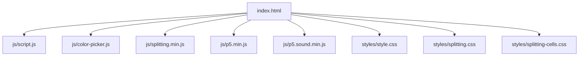
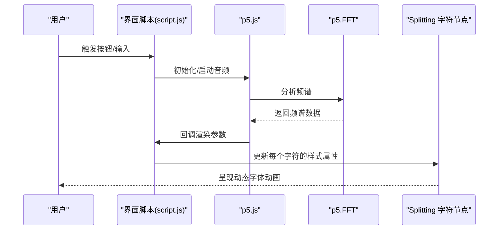
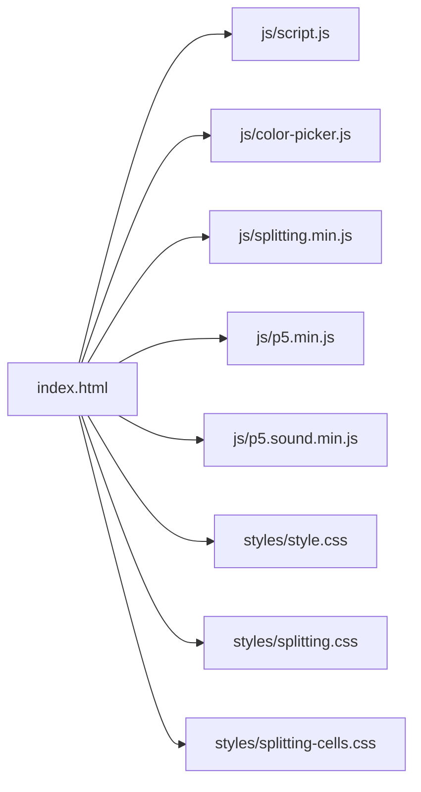

# 性能优化

<cite>
**本文引用的文件**
- [index.html](file://index.html)
- [script.js](file://js/script.js)
- [color-picker.js](file://js/color-picker.js)
- [style.css](file://styles/style.css)
- [splitting.css](file://styles/splitting.css)
- [splitting-cells.css](file://styles/splitting-cells.css)
- [splitting.min.js](file://js/splitting.min.js)
- [p5.min.js](file://js/p5.min.js)
- [p5.sound.min.js](file://js/p5.sound.min.js)
</cite>

## 目录
1. [简介](#简介)
2. [项目结构](#项目结构)
3. [核心组件](#核心组件)
4. [架构总览](#架构总览)
5. [详细组件分析](#详细组件分析)
6. [依赖关系分析](#依赖关系分析)
7. [性能考量](#性能考量)
8. [故障排查指南](#故障排查指南)
9. [结论](#结论)
10. [附录](#附录)

## 简介
本指南聚焦于该交互式“音律字体”项目的性能优化，围绕以下主题展开：
- 渲染性能：requestAnimationFrame 的使用、Canvas 渲染优化、DOM 操作最小化
- 内存使用：对象池管理、垃圾回收优化、内存泄漏预防
- 音频处理：采样率与缓冲区管理、CPU 使用监控
- 移动端优化：触摸事件、电池与网络性能
- 性能监控：FPS、内存、渲染时间测量
- 瓶颈识别与评估：Chrome DevTools 使用、分析报告解读
- 测试与基准：性能测试方法与工具
- 实战案例与最佳实践

## 项目结构
该项目采用前端静态页面结构，核心逻辑集中在单页应用中，通过 p5.js 提供 Canvas 渲染与音频分析能力，并使用 Splitting.js 进行文本拆分与动画。

图表来源
- [index.html](file://index.html)
- [script.js](file://js/script.js)
- [color-picker.js](file://js/color-picker.js)
- [splitting.min.js](file://js/splitting.min.js)
- [p5.min.js](file://js/p5.min.js)
- [p5.sound.min.js](file://js/p5.sound.min.js)
- [style.css](file://styles/style.css)
- [splitting.css](file://styles/splitting.css)
- [splitting-cells.css](file://styles/splitting-cells.css)

章节来源
- [index.html](file://index.html)
- [script.js](file://js/script.js)

## 核心组件
- 音频输入与分析：使用 p5.AudioIn 与 p5.FFT 获取频谱数据，驱动文字高度与倾斜等视觉参数
- 文本拆分与渲染：Splitting.js 将文本拆分为字符级元素，配合 CSS 变量与内联样式实现逐字动画
- 菜单与交互：Bootstrap 与自定义按钮控制音频开关、颜色选择、显示模式切换
- 动画循环：p5.js 的 draw 循环负责每帧更新，结合移动端/桌面端差异进行事件绑定与阈值调整

章节来源
- [script.js](file://js/script.js)
- [index.html](file://index.html)

## 架构总览
整体流程从用户交互开始，进入音频采集与频域分析，随后在每帧渲染中更新字符的尺寸、倾斜与缩放，最终通过 Splitting 生成的字符节点完成视觉呈现。

图表来源
- [script.js](file://js/script.js)
- [p5.min.js](file://js/p5.min.js)
- [p5.sound.min.js](file://js/p5.sound.min.js)

## 详细组件分析

### 渲染循环与 requestAnimationFrame
- 当前实现使用 p5.js 的 draw 循环作为主渲染入口，内部通过 lerp 平滑过渡与 map 映射计算字符高度、倾斜与缩放。
- 建议：
  - 明确使用 p5.frameRate 控制目标帧率（当前已设置为 60），避免过高的帧率导致 CPU 占用。
  - 在移动端或低端设备上可动态降低帧率以节省电量。
  - 对于非必要更新，尽量减少 DOM 查询与写入次数，优先批量更新。

章节来源
- [script.js](file://js/script.js)

### Canvas 渲染优化
- 项目未直接使用 Canvas API，而是通过 p5.js 的无画布模式（noCanvas）进行渲染，将视觉更新委托给 DOM 元素。
- 建议：
  - 若未来需要更高性能的渲染路径，可考虑在 p5 中启用 Canvas 并使用离屏渲染、纹理缓存与批处理绘制。
  - 合理设置 FFT 窗函数与样本长度，平衡精度与性能。

章节来源
- [script.js](file://js/script.js)
- [p5.min.js](file://js/p5.min.js)

### DOM 操作最小化
- 存在多处每帧对字符节点的样式属性进行写入，如 fontSize、fontVariationSettings、transform 等。
- 建议：
  - 批量更新：将同一帧内的多个样式修改合并，减少回流/重绘次数。
  - 缓存查询结果：对 splitChars[wornum].chars[i] 与 words 的引用进行缓存，避免重复查询。
  - 使用 CSS 变量或类名切换替代频繁的内联样式修改，提高浏览器优化效率。
  - 对于大量字符，考虑虚拟滚动或按需渲染可见区域字符。

章节来源
- [script.js](file://js/script.js)
- [splitting.css](file://styles/splitting.css)

### 音频处理性能优化
- 音频输入与分析：
  - 使用 p5.AudioIn 与 p5.FFT，FFT 参数包含平滑系数与样本数，直接影响 CPU 占用与响应速度。
  - 通过 micThreshold 与音量映射校准，避免过度敏感导致的高频更新。
- 建议：
  - 采样率与缓冲区：根据设备能力动态调整 FFT 的样本长度与平滑度；在移动端可适当降低样本长度。
  - CPU 使用监控：在开发阶段使用 Chrome DevTools 的 Performance 面板记录音频线程与主线程占用。
  - 用户手势唤醒：确保首次音频初始化在用户交互事件中触发，避免浏览器限制。

章节来源
- [script.js](file://js/script.js)
- [p5.sound.min.js](file://js/p5.sound.min.js)

### 移动端优化策略
- 触摸事件：
  - 项目区分 isMobile 并针对触摸事件进行处理，避免误触与滚动干扰。
  - 建议：使用 passive 事件监听器减少滚动阻塞；对触摸拖拽场景限制不必要的样式变更频率。
- 电池与性能：
  - 降低帧率与更新频率；在后台标签页时暂停渲染或降低分辨率。
  - 使用 IntersectionObserver 监控可视区域，仅渲染可见字符。
- 网络性能：
  - 合并与压缩 CSS/JS；预加载关键字体资源；使用 CDN 加速静态资源。

章节来源
- [script.js](file://js/script.js)
- [index.html](file://index.html)

### 内存使用优化
- 对象池与复用：
  - 对于频繁创建/销毁的对象（如临时数组），可采用对象池复用，减少 GC 压力。
  - 对于 splitChars 与 words 列表，避免每帧重建，保持引用并在需要时更新。
- 垃圾回收优化：
  - 避免闭包持有大对象；及时释放事件监听器与定时器。
  - 在页面卸载时停止音频与清理全局变量。
- 内存泄漏预防：
  - 定期检查是否存在未移除的 DOM 节点与事件绑定；使用内存快照定位异常增长。

章节来源
- [script.js](file://js/script.js)

### 性能监控与指标
- FPS 监控：可通过 p5.frameRate 或自定义计数器统计帧耗时。
- 内存使用：使用 Performance/Memory 面板记录堆快照，观察对象增长趋势。
- 渲染时间：使用 Performance 面板的录制与火焰图分析，定位长任务与布局抖动。
- 工具与方法：
  - Chrome DevTools：Performance、Memory、Coverage、Lighthouse
  - WebPageTest、Lighthouse CI（持续集成）
  - 自定义埋点：记录 draw 循环耗时、音频分析耗时、DOM 更新耗时

章节来源
- [script.js](file://js/script.js)

### 瓶颈识别与解决方案
- 常见瓶颈：
  - 大量字符的每帧样式写入
  - 频繁的 DOM 查询与属性访问
  - 高频音频分析与 UI 更新耦合
- 解决方案：
  - 使用 requestAnimationFrame 与节流/去抖
  - 将样式更新合并到一帧末尾执行
  - 将音频分析与 UI 更新解耦，使用队列或回调机制

章节来源
- [script.js](file://js/script.js)

### 性能测试与基准
- 方法：
  - 使用 Chrome DevTools Performance 面板录制不同场景（空闲、输入、高负载）
  - 使用 Lighthouse 评估首屏与交互性能
  - 基准测试：固定输入条件，多次运行对比帧率与内存峰值
- 工具：
  - WebPageTest、Lighthouse CLI、Perfume.js（轻量性能观测）

章节来源
- [script.js](file://js/script.js)

### 优化案例与最佳实践
- 案例：将每帧对 splitChars.chars[i] 的多次样式写入合并为一次批量更新，减少回流次数。
- 最佳实践：
  - 优先使用 CSS 动画与 GPU 加速属性（transform、opacity）
  - 控制动画数量与复杂度，避免同时对大量元素进行复杂变换
  - 在移动端启用更低的帧率与更少的字符渲染

章节来源
- [script.js](file://js/script.js)
- [style.css](file://styles/style.css)

## 依赖关系分析

图表来源
- [index.html](file://index.html)
- [script.js](file://js/script.js)
- [color-picker.js](file://js/color-picker.js)
- [splitting.min.js](file://js/splitting.min.js)
- [p5.min.js](file://js/p5.min.js)
- [p5.sound.min.js](file://js/p5.sound.min.js)
- [style.css](file://styles/style.css)
- [splitting.css](file://styles/splitting.css)
- [splitting-cells.css](file://styles/splitting-cells.css)

章节来源
- [index.html](file://index.html)

## 性能考量
- 渲染路径：当前以 DOM 为主，适合中小规模字符；若字符数较多，建议引入虚拟列表或 Canvas 渲染。
- 音频路径：FFT 计算与 UI 更新在同一主线程，建议将音频分析与 UI 解耦，或在 Web Worker 中处理纯计算。
- 资源加载：字体与图片资源应优化加载策略，避免阻塞首屏。

章节来源
- [script.js](file://js/script.js)
- [style.css](file://styles/style.css)

## 故障排查指南
- 常见问题：
  - 音频无法启动：确认用户手势触发与浏览器权限状态
  - 字符动画卡顿：检查每帧 DOM 写入是否过多
  - 移动端触摸误触：验证 isScroll 与事件绑定逻辑
- 排查步骤：
  - 使用 Performance 面板录制并分析长任务
  - 使用 Memory 面板观察堆增长
  - 使用 Coverage 分析未使用的 CSS/JS

章节来源
- [script.js](file://js/script.js)

## 结论
本项目在音律字体与音频可视化方面具备良好创意，但仍有较大空间在渲染与内存层面进行优化。通过合理使用 requestAnimationFrame、减少 DOM 写入、优化音频分析与解耦 UI 更新、以及引入移动端专用策略，可在保证体验的同时显著提升性能与稳定性。

## 附录
- 关键实现位置参考：
  - 渲染循环与参数更新：[script.js](file://js/script.js)
  - 音频初始化与分析：[script.js](file://js/script.js)
  - 文本拆分与样式：[splitting.css](file://styles/splitting.css)
  - 页面结构与资源：[index.html](file://index.html)