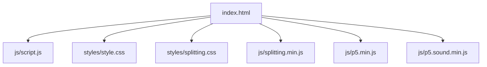
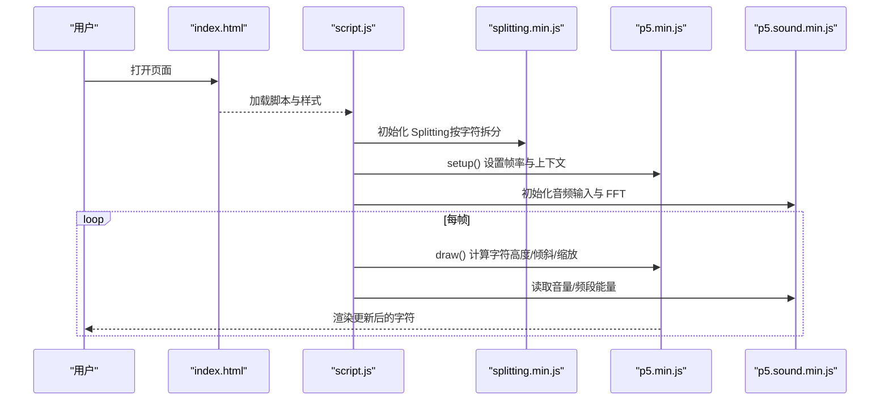
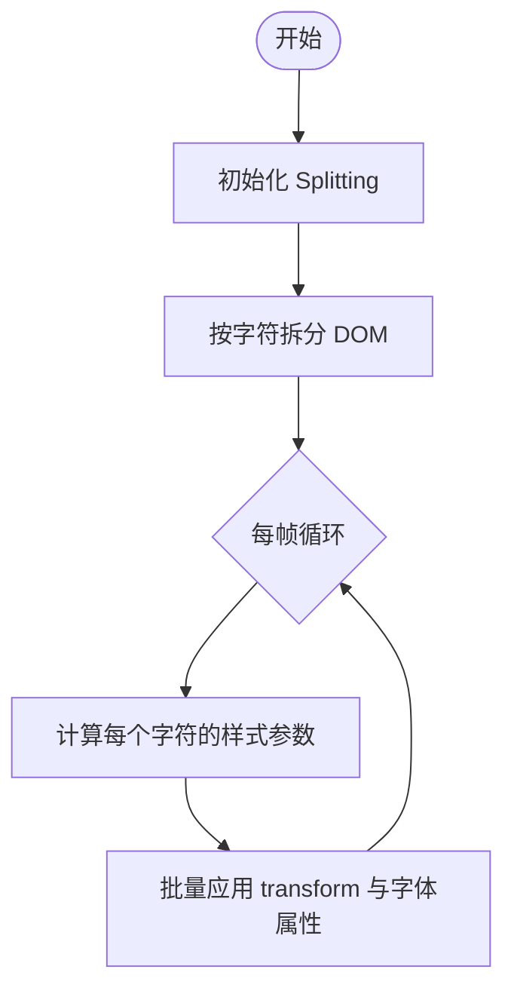
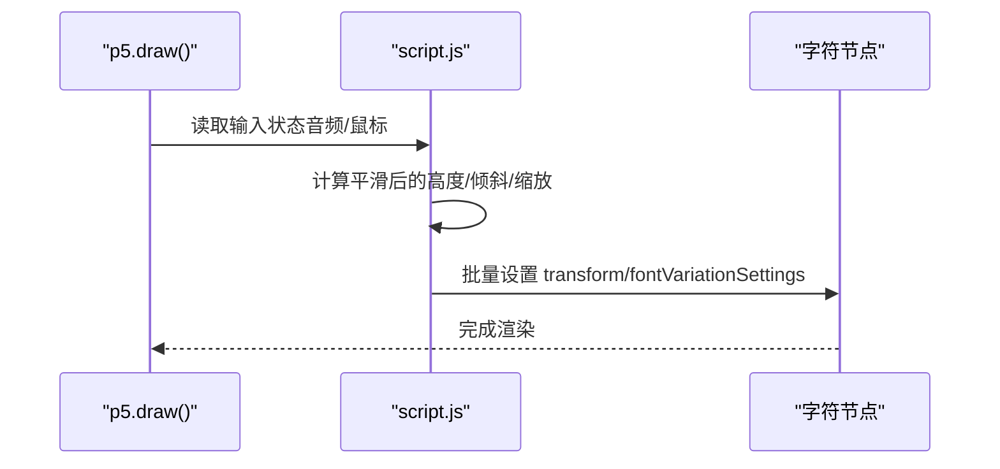
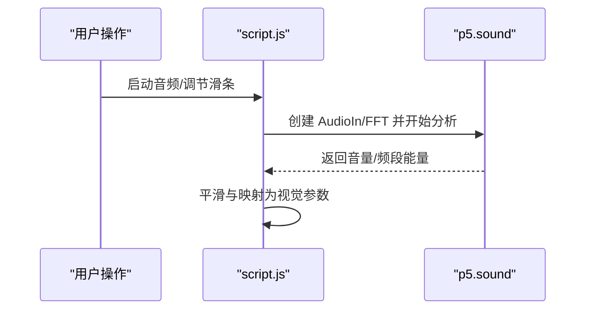
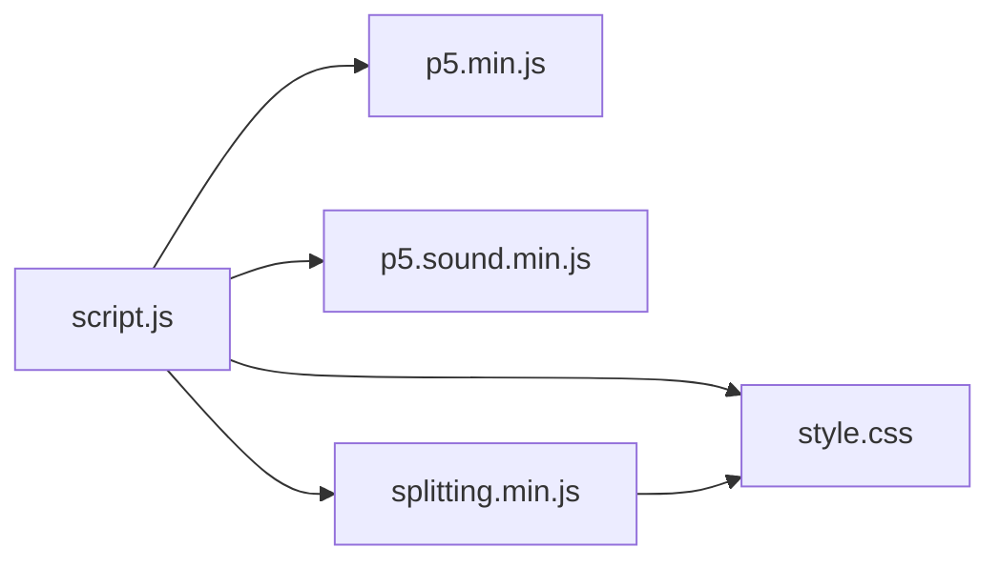

# 性能监控与分析

<cite>
**本文引用的文件**
- [index.html](file://index.html)
- [script.js](file://js/script.js)
- [style.css](file://styles/style.css)
- [splitting.css](file://styles/splitting.css)
- [splitting.min.js](file://js/splitting.min.js)
- [p5.min.js](file://js/p5.min.js)
- [p5.sound.min.js](file://js/p5.sound.min.js)
</cite>

## 目录
1. [简介](#简介)
2. [项目结构](#项目结构)
3. [核心组件](#核心组件)
4. [架构总览](#架构总览)
5. [详细组件分析](#详细组件分析)
6. [依赖关系分析](#依赖关系分析)
7. [性能考量](#性能考量)
8. [故障排除指南](#故障排除指南)
9. [结论](#结论)
10. [附录](#附录)

## 简介
本指南面向前端开发者与性能工程师，围绕该项目在浏览器端的性能监控与分析实践展开，结合 Chrome DevTools 的 Performance、Memory、Rendering 面板，系统讲解 FPS 监控、渲染性能测量、内存使用跟踪与长期内存趋势分析，并给出自动化基准测试思路与报告生成建议。文档同时结合项目实际代码（文本拆分、音频输入、动画帧循环等）进行落地说明，帮助读者快速建立从“发现问题—定位瓶颈—验证修复”的闭环。

## 项目结构
该项目为一个基于浏览器的交互式音视频可视化应用，主要由 HTML 页面、样式表与脚本组成，其中：
- 页面入口与布局：index.html
- 样式与动画：style.css、splitting.css
- 文本拆分与 DOM 操作：splitting.min.js
- 动画与渲染：p5.min.js
- 音频采集与处理：p5.sound.min.js
- 应用逻辑与事件：script.js

图表来源
- [index.html](file://index.html)
- [script.js](file://js/script.js)
- [style.css](file://styles/style.css)
- [splitting.css](file://styles/splitting.css)
- [splitting.min.js](file://js/splitting.min.js)
- [p5.min.js](file://js/p5.min.js)
- [p5.sound.min.js](file://js/p5.sound.min.js)

章节来源
- [index.html](file://index.html)
- [script.js](file://js/script.js)
- [style.css](file://styles/style.css)
- [splitting.css](file://styles/splitting.css)
- [splitting.min.js](file://js/splitting.min.js)
- [p5.min.js](file://js/p5.min.js)
- [p5.sound.min.js](file://js/p5.sound.min.js)

## 核心组件
- 文本拆分与 DOM 更新：通过 Splitting 将显示文本拆分为字符级元素，配合 CSS 变量与 transform 实现逐字符动画。
- 动画与渲染：使用 p5 的 draw 循环驱动每帧更新，控制字符尺寸、倾斜与缩放。
- 音频输入与频谱分析：使用 p5.sound 的 AudioIn 与 FFT 获取音量与频段能量，作为视觉参数的输入源。
- 菜单与交互：按钮切换颜色、音频开关、滑条调节阈值等，影响渲染与音频处理路径。

章节来源
- [script.js](file://js/script.js)
- [splitting.min.js](file://js/splitting.min.js)
- [p5.min.js](file://js/p5.min.js)
- [p5.sound.min.js](file://js/p5.sound.min.js)

## 架构总览
下图展示页面加载到渲染的关键路径：HTML 解析 → 资源加载 → 初始化脚本 → 文本拆分 → 帧循环 → 音频分析 → 视觉更新。

图表来源
- [index.html](file://index.html)
- [script.js](file://js/script.js)
- [splitting.min.js](file://js/splitting.min.js)
- [p5.min.js](file://js/p5.min.js)
- [p5.sound.min.js](file://js/p5.sound.min.js)

## 详细组件分析

### 组件一：文本拆分与逐字符动画
- 功能要点
  - 使用 Splitting 将目标容器内的文本拆分为字符级元素，便于逐字符控制。
  - 利用 CSS 变量（如 --char-index、--char-center）与 transform 属性实现动态效果。
- 性能关注点
  - 字符数量较多时，每帧对大量 DOM 元素设置样式可能带来布局/绘制压力。
  - 建议限制字符数或采用虚拟滚动策略；减少不必要的回流与重绘。

图表来源
- [script.js](file://js/script.js)
- [splitting.min.js](file://js/splitting.min.js)
- [splitting.css](file://styles/splitting.css)

章节来源
- [script.js](file://js/script.js)
- [splitting.min.js](file://js/splitting.min.js)
- [splitting.css](file://styles/splitting.css)

### 组件二：帧循环与渲染管线
- 功能要点
  - 使用 p5 的 draw 循环，每帧根据输入（鼠标/音频）更新字符高度、倾斜与整体缩放。
  - 通过 frameRate 控制目标帧率，避免过度消耗 CPU/GPU。
- 性能关注点
  - draw 中存在对大量字符节点的样式写入，需关注是否触发强制同步布局。
  - 建议将样式更新合并，减少选择器与属性访问次数。

图表来源
- [script.js](file://js/script.js)
- [p5.min.js](file://js/p5.min.js)

章节来源
- [script.js](file://js/script.js)
- [p5.min.js](file://js/p5.min.js)

### 组件三：音频输入与频谱分析
- 功能要点
  - 使用 p5.sound 的 AudioIn 与 FFT 获取音量与频段能量，映射为视觉参数。
  - 支持滑条调节阈值，适配不同设备与环境噪声。
- 性能关注点
  - 音频分析会占用 CPU，建议在不需要时停止麦克风以节省资源。
  - 频谱分析的带宽与采样点数会影响性能，应按需调整。

图表来源
- [script.js](file://js/script.js)
- [p5.sound.min.js](file://js/p5.sound.min.js)

章节来源
- [script.js](file://js/script.js)
- [p5.sound.min.js](file://js/p5.sound.min.js)

### 组件四：菜单与交互
- 功能要点
  - 提供颜色切换、背景/字体色选择、音频开关、滑条等交互入口。
  - 移动端与桌面端分别绑定触摸/鼠标事件。
- 性能关注点
  - 事件绑定与样式切换应避免频繁重排；可使用类名切换替代内联样式。

章节来源
- [script.js](file://js/script.js)
- [style.css](file://styles/style.css)

## 依赖关系分析
- 外部库
  - p5：提供帧循环、数学与渲染能力
  - p5.sound：提供音频输入、FFT 分析与 Web Audio 接口封装
  - Splitting：提供文本拆分与 DOM 结构化
- 内部耦合
  - script.js 依赖 Splitting 生成的字符节点，依赖 p5 进行帧循环，依赖 p5.sound 进行音频分析。
  - 样式层通过 CSS 变量与 transform 影响渲染性能。

图表来源
- [script.js](file://js/script.js)
- [p5.min.js](file://js/p5.min.js)
- [p5.sound.min.js](file://js/p5.sound.min.js)
- [splitting.min.js](file://js/splitting.min.js)
- [style.css](file://styles/style.css)

章节来源
- [script.js](file://js/script.js)
- [p5.min.js](file://js/p5.min.js)
- [p5.sound.min.js](file://js/p5.sound.min.js)
- [splitting.min.js](file://js/splitting.min.js)
- [style.css](file://styles/style.css)

## 性能考量

### FPS 监控与实现
- 浏览器内置方法
  - 使用 Performance 面板记录帧时间，观察是否存在长尾帧。
  - 在代码中插入高精度时间戳，计算每帧耗时与丢帧情况。
- 项目侧实现建议
  - 在 draw 开始与结束处记录时间戳，计算平均帧耗时与 95 分位耗时。
  - 对比开启/关闭音频、不同字符数量下的帧率变化，定位热点。

章节来源
- [script.js](file://js/script.js)
- [p5.min.js](file://js/p5.min.js)

### 渲染性能测量
- 关键指标
  - 合成层数量与层级深度、重排/重绘次数、GPU 使用率。
- 项目侧优化方向
  - 减少对大量字符节点的直接样式写入，优先使用 transform 与 filter。
  - 合理使用 will-change 或 GPU 加速属性，避免过度合成层导致的额外开销。

章节来源
- [script.js](file://js/script.js)
- [style.css](file://styles/style.css)
- [splitting.css](file://styles/splitting.css)

### 内存使用跟踪
- 方法
  - 使用 Memory 面板快照对比，观察对象增长与泄漏迹象。
  - 结合 Timeline 面板观察垃圾回收频率与停顿。
- 项目侧注意事项
  - 音频分析与 FFT 会产生临时缓冲区，确保在不需要时释放资源。
  - 避免在回调中持有长生命周期引用，防止闭包导致的对象滞留。

章节来源
- [script.js](file://js/script.js)
- [p5.sound.min.js](file://js/p5.sound.min.js)

### 基准测试与回归检测
- 自动化思路
  - 使用 Puppeteer 或 Playwright 启动页面，固定输入（如固定音频频段），运行一段时间后收集帧率与内存数据。
  - 将结果与基线对比，发现回归即告警。
- A/B 测试
  - 对比不同渲染策略（如禁用某些特效）下的帧率与内存差异，量化优化收益。

[本节为通用指导，不直接分析具体文件]

### 数据分析与报告
- 指标解读
  - 帧率：关注平均值与 95 分位，长尾帧是性能问题的信号。
  - 内存：峰值与持续增长趋势，GC 停顿频率与时长。
- 报告模板建议
  - 场景描述、测试环境、指标定义、基线与当前版本对比、瓶颈定位、优化方案与验证结果。

[本节为通用指导，不直接分析具体文件]

## 故障排除指南

### 常见问题与排查步骤
- 帧率抖动/掉帧
  - 检查 draw 中是否有昂贵操作（如频繁 DOM 查询、样式读写）。
  - 使用 Performance 面板查看主线程阻塞点，必要时将计算移至 Web Worker。
- 内存持续上涨
  - 使用 Memory 面板快照，确认是否存在未释放的音频节点或监听器。
  - 检查是否存在闭包持有旧对象的引用。
- 移动端卡顿
  - 降低字符数量或禁用部分特效，观察帧率恢复。
  - 检查是否触发了强制同步布局或大范围重绘。

章节来源
- [script.js](file://js/script.js)
- [p5.min.js](file://js/p5.min.js)
- [p5.sound.min.js](file://js/p5.sound.min.js)

## 结论
本项目在文本拆分、音频驱动渲染方面具备良好的表现力，但同时也对主线程与 GPU 带来一定压力。通过合理的 FPS 监控、渲染性能测量与内存跟踪，可以有效定位瓶颈并持续优化。建议在开发与发布流程中引入自动化基准测试与回归检测，形成稳定的性能保障机制。

[本节为总结性内容，不直接分析具体文件]

## 附录

### Chrome DevTools 快速上手清单
- Performance 面板
  - 录制一次完整交互，观察帧时间线与长尾帧。
  - 使用“聚合”视图定位 JavaScript 执行热点。
- Memory 面板
  - 生成堆快照，对比“Allocated”与“Retained”大小。
  - 使用“Allocation instrumentation on timeline”观察分配轨迹。
- Rendering 面板
  - 开启“Paint flashing”与“Layer borders”，检查重绘与合成层。
  - 查看“GPU”标签页，确认 GPU 使用率与合成层数量。

[本节为通用指导，不直接分析具体文件]