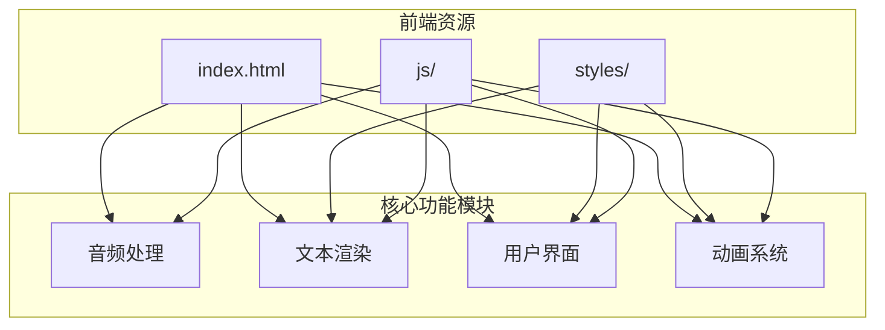
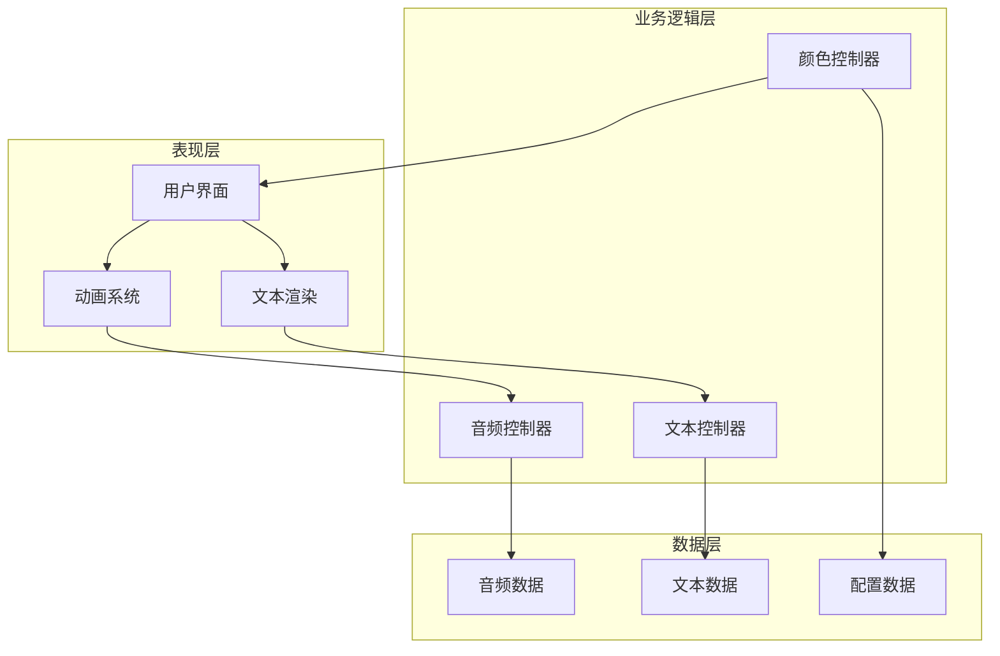
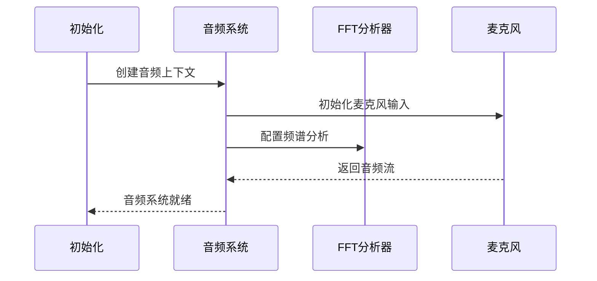
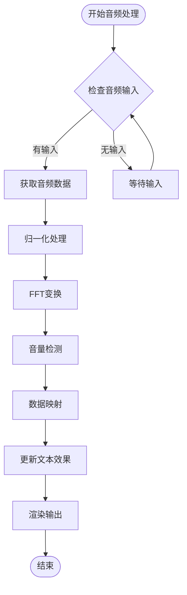
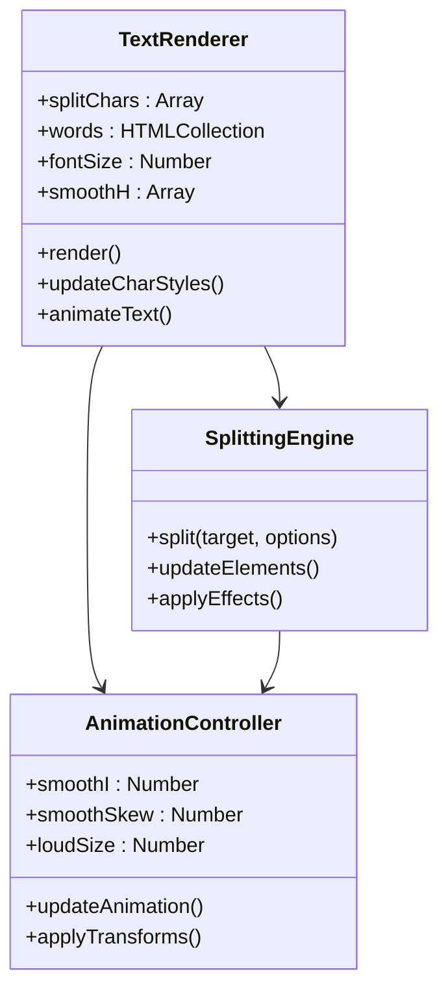
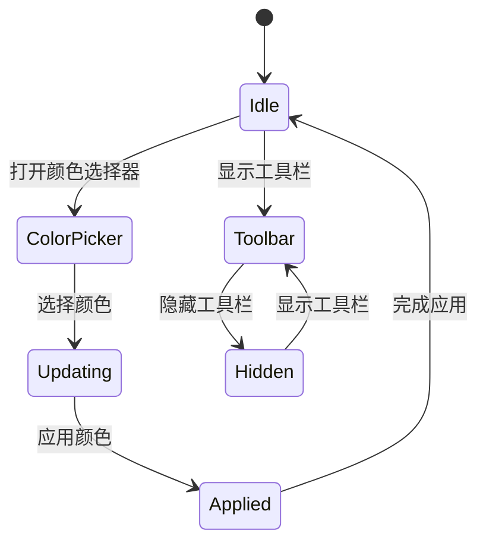

# 渲染性能优化

<cite>
**本文档引用的文件**
- [index.html](file://index.html)
- [script.js](file://js/script.js)
- [style.css](file://styles/style.css)
- [splitting.css](file://styles/splitting.css)
- [splitting-cells.css](file://styles/splitting-cells.css)
- [color-picker.js](file://js/color-picker.js)
- [splitting.min.js](file://js/splitting.min.js)
- [p5.min.js](file://js/p5.min.js)
- [p5.sound.min.js](file://js/p5.sound.min.js)
</cite>

## 目录
1. [项目概述](#项目概述)
2. [项目结构](#项目结构)
3. [核心组件](#核心组件)
4. [架构概览](#架构概览)
5. [详细组件分析](#详细组件分析)
6. [依赖关系分析](#依赖关系分析)
7. [性能考虑因素](#性能考虑因素)
8. [故障排除指南](#故障排除指南)
9. [结论](#结论)

## 项目概述
本项目是一个基于Web的交互式音频可视化应用，结合了文本分割、颜色选择器、音频输入处理和动态字体效果。项目采用现代Web技术栈，包括HTML5、CSS3、JavaScript以及p5.js音频处理库，实现了高性能的实时渲染体验。

## 项目结构
项目采用模块化组织方式，主要分为以下几个部分：



**图表来源**
- [index.html:1-282](file://index.html#L1-L282)
- [script.js:1-1049](file://js/script.js#L1-L1049)

**章节来源**
- [index.html:1-282](file://index.html#L1-L282)
- [script.js:1-1049](file://js/script.js#L1-L1049)

## 核心组件

### 音频处理系统
项目集成了p5.js音频库，提供了完整的音频输入、分析和可视化功能：

- **麦克风输入**: 支持实时音频捕获和处理
- **频谱分析**: 使用FFT进行频率域分析
- **音量检测**: 实时音量监测和响应
- **音频可视化**: 将音频数据映射到视觉效果

### 文本渲染引擎
采用Splitting.js库实现高效的文本分割和动画：

- **字符级分割**: 将文本分解为单个字符元素
- **CSS变量支持**: 利用CSS自定义属性实现动态效果
- **GPU加速**: 通过transform属性利用硬件加速
- **批量更新**: 减少DOM操作次数

### 用户界面系统
集成Bootstrap框架和自定义样式：

- **响应式设计**: 适配不同屏幕尺寸
- **颜色选择器**: 内置颜色管理和主题切换
- **工具栏系统**: 动态显示和隐藏功能区域
- **模态对话框**: 教程和信息展示

**章节来源**
- [script.js:1-1049](file://js/script.js#L1-L1049)
- [style.css:1-1571](file://styles/style.css#L1-L1571)

## 架构概览

项目采用分层架构设计，各组件之间通过清晰的接口进行通信：



**图表来源**
- [script.js:1-1049](file://js/script.js#L1-L1049)
- [style.css:1-1571](file://styles/style.css#L1-L1571)

## 详细组件分析

### 音频渲染组件

#### 音频初始化和配置
音频系统通过p5.js库实现，具备以下特性：



**图表来源**
- [script.js:178-201](file://js/script.js#L178-L201)
- [p5.sound.min.js:1-3](file://js/p5.sound.min.js#L1-L3)

#### 实时音频处理流程
音频数据处理采用高效的缓冲区机制：



**图表来源**
- [script.js:301-426](file://js/script.js#L301-L426)

**章节来源**
- [script.js:178-201](file://js/script.js#L178-L201)
- [script.js:301-426](file://js/script.js#L301-L426)

### 文本渲染组件

#### 字符分割和动画系统
文本渲染采用Splitting.js库实现高效的文字分割：



**图表来源**
- [script.js:238-281](file://js/script.js#L238-L281)
- [splitting.min.js:1-31](file://js/splitting.min.js#L1-L31)

#### 文本效果实现
文本效果通过CSS变量和JavaScript动态更新实现：

**章节来源**
- [script.js:238-281](file://js/script.js#L238-L281)
- [splitting.css:1-67](file://styles/splitting.css#L1-L67)

### 用户界面组件

#### 颜色管理系统
颜色系统提供完整的主题定制功能：



**图表来源**
- [color-picker.js:1-231](file://js/color-picker.js#L1-L231)

**章节来源**
- [color-picker.js:1-231](file://js/color-picker.js#L1-L231)
- [style.css:423-425](file://styles/style.css#L423-L425)

## 依赖关系分析

项目的主要依赖关系如下：

```mermaid
graph LR
subgraph "外部依赖"
p5[p5.js]
splitting[Splitting.js]
bootstrap[Bootstrap]
jquery[jQuery]
end
subgraph "项目内部"
script[script.js]
style[style.css]
splittingCSS[splitting.css]
colorPicker[color-picker.js]
end
p5 --> script
splitting --> script
bootstrap --> style
jquery --> colorPicker
script --> style
script --> splittingCSS
colorPicker --> style
```

**图表来源**
- [index.html:15-261](file://index.html#L15-L261)
- [script.js:1-1049](file://js/script.js#L1-L1049)

**章节来源**
- [index.html:15-261](file://index.html#L15-L261)

## 性能考虑因素

### 帧率控制策略
项目采用多种策略确保60fps的流畅渲染：

1. **requestAnimationFrame优化**
   - 使用浏览器原生动画帧调度
   - 避免过度的DOM操作
   - 合理的数据更新频率

2. **内存管理**
   - 及时释放音频上下文
   - 管理DOM元素生命周期
   - 避免内存泄漏

3. **渲染管道优化**
   - 批量DOM更新减少重排
   - 使用transform属性替代布局属性
   - GPU加速图形变换

### DOM操作最小化技术

#### 批量DOM更新
项目通过以下方式减少DOM操作：

- **一次性更新**: 将多个样式更改合并为一次操作
- **CSS类切换**: 使用类名切换而非直接修改样式属性
- **虚拟DOM模式**: 在内存中构建DOM树再一次性应用

#### CSS类名切换优化
颜色管理和主题切换采用高效的类名切换机制：

**章节来源**
- [script.js:147-150](file://js/script.js#L147-L150)
- [color-picker.js:95-175](file://js/color-picker.js#L95-L175)

### Canvas渲染优化
虽然项目主要使用CSS3动画，但具备Canvas渲染能力：

#### 2D上下文优化
- **上下文复用**: 复用Canvas上下文对象
- **绘制命令合并**: 合并相似的绘制操作
- **脏区域更新**: 只更新变化的区域

#### 图像缓存策略
- **预加载机制**: 提前加载和缓存图像资源
- **纹理池**: 管理重复使用的纹理资源
- **内存回收**: 及时释放不再使用的图像数据

### CSS动画性能优化

#### will-change属性使用
项目通过以下方式优化CSS动画性能：

- **硬件加速**: 使用transform和opacity属性
- **合成层管理**: 合理使用will-change属性
- **GPU加速**: 启用硬件加速渲染

#### 复合层管理
- **层分离**: 将复杂动画元素提升到独立合成层
- **层合并**: 合并简单的动画元素
- **层清理**: 及时移除不需要的合成层

**章节来源**
- [style.css:1-1571](file://styles/style.css#L1-L1571)

## 故障排除指南

### 常见性能问题诊断

#### 帧率下降问题
1. **检查音频处理负载**
   - 监控FFT计算频率
   - 检查音频数据处理效率
   - 优化音频缓冲区大小

2. **DOM操作分析**
   - 使用浏览器开发者工具分析DOM操作
   - 检查重排和重绘频率
   - 优化CSS选择器性能

#### 内存泄漏排查
1. **音频上下文管理**
   - 确保音频节点正确释放
   - 检查事件监听器绑定和解绑
   - 监控音频处理器生命周期

2. **DOM元素清理**
   - 检查定时器和回调函数
   - 确保模态框和工具栏正确销毁
   - 验证颜色选择器状态清理

### 渲染性能监控方法

#### Chrome DevTools使用
1. **Performance面板**
   - 记录渲染性能数据
   - 分析主线程活动
   - 识别长任务和阻塞操作

2. **FPS监控**
   - 使用DevTools的FPS图表
   - 监控帧时间分布
   - 识别性能瓶颈

3. **渲染时间测量**
   - 使用Performance.now() API
   - 测量关键渲染路径
   - 分析渲染延迟

**章节来源**
- [script.js:178-201](file://js/script.js#L178-L201)

## 结论

本项目展示了现代Web应用的高性能渲染实践，通过合理的架构设计和优化策略，在保证丰富视觉效果的同时实现了流畅的用户体验。关键优化点包括：

1. **多层架构设计**: 清晰的组件分离和职责划分
2. **性能优先的实现**: 采用GPU加速和批处理优化
3. **资源管理优化**: 有效的内存管理和资源复用
4. **监控和调试**: 完善的性能监控和故障排除机制

这些实践经验为类似项目的性能优化提供了有价值的参考，特别是在音频可视化和实时渲染场景中的最佳实践。