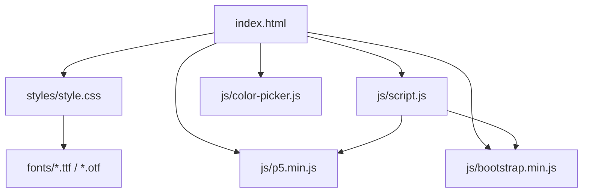
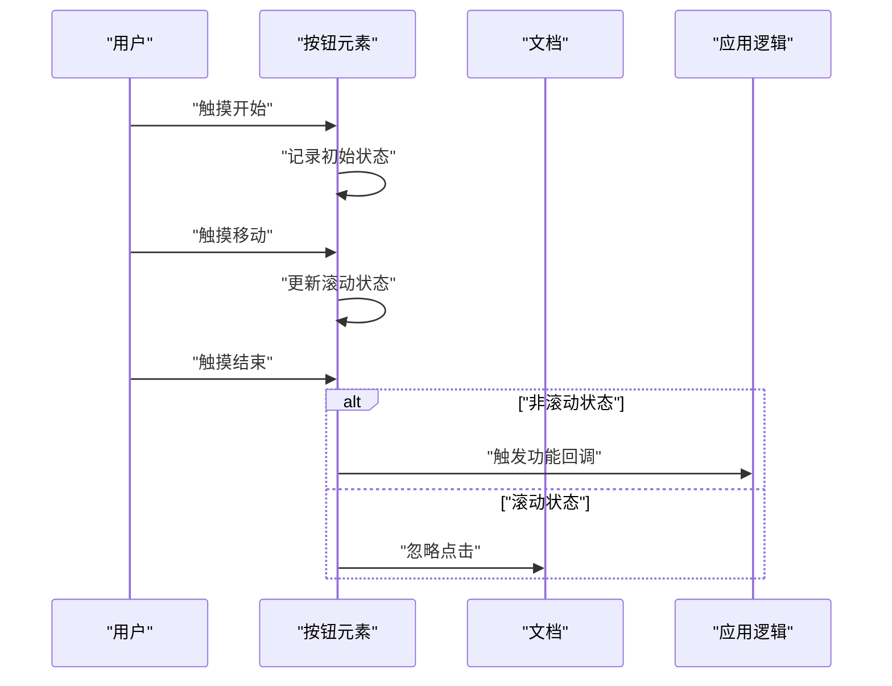
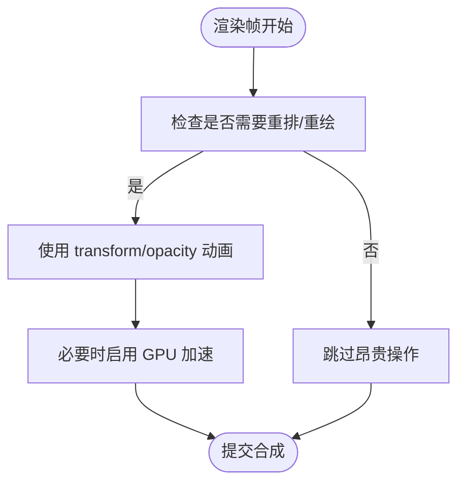
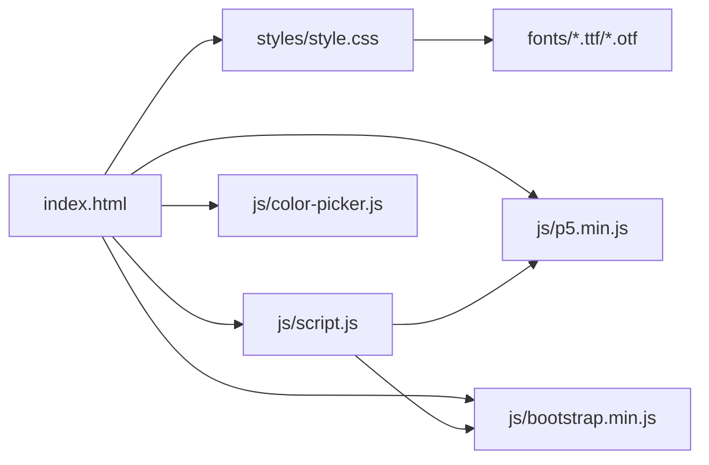

# 移动端优化

<cite>
**本文引用的文件**
- [index.html](file://index.html)
- [script.js](file://js/script.js)
- [style.css](file://styles/style.css)
- [color-picker.js](file://js/color-picker.js)
- [bootstrap.min.js](file://js/bootstrap.min.js)
- [p5.min.js](file://js/p5.min.js)
- [FONT-REPLACEMENT-GUIDE.md](file://FONT-REPLACEMENT-GUIDE.md)
</cite>

## 目录
1. [引言](#引言)
2. [项目结构](#项目结构)
3. [核心组件](#核心组件)
4. [架构总览](#架构总览)
5. [详细组件分析](#详细组件分析)
6. [依赖关系分析](#依赖关系分析)
7. [性能考量](#性能考量)
8. [故障排查指南](#故障排查指南)
9. [结论](#结论)
10. [附录](#附录)

## 引言
本指南面向移动端性能优化，结合项目实际代码，系统梳理触摸事件优化、渲染性能、内存与网络优化、性能监控与兼容性策略，并给出可操作的实践建议。目标是在不改变既有视觉与交互体验的前提下，显著提升移动端首屏速度、流畅度与稳定性。

## 项目结构
该项目采用“静态页面 + 轻量脚本 + 可变字体”的前端架构，核心入口为 HTML，样式集中在 CSS，交互逻辑与音频可视化在 JS 中实现；字体资源通过可变字体轴参数驱动动态排版。

图示来源
- [index.html:1-282](file://index.html#L1-L282)
- [style.css:1-162](file://styles/style.css#L1-L162)
- [script.js:1-100](file://js/script.js#L1-L100)
- [color-picker.js:1-231](file://js/color-picker.js#L1-L231)
- [bootstrap.min.js:1-7](file://js/bootstrap.min.js#L1-L7)
- [p5.min.js:1-3](file://js/p5.min.js#L1-L3)

章节来源
- [index.html:1-282](file://index.html#L1-L282)
- [style.css:1-162](file://styles/style.css#L1-L162)

## 核心组件
- 视觉与布局层：CSS 控制字体、动画、响应式断点与滚动行为，确保在移动端具备良好的可读性与可触达性。
- 交互与事件层：JS 负责触摸事件绑定、按钮交互、颜色选择器与菜单控制，以及基于可变字体轴的动态排版。
- 音频与可视化层：p5.js 提供 Web Audio API 封装，实时分析音频频谱并驱动文本动画。
- 字体与排版层：可变字体通过 CSS 动画与 JS 计算驱动，形成声音到视觉的联动效果。

章节来源
- [style.css:850-1573](file://styles/style.css#L850-L1573)
- [script.js:1-200](file://js/script.js#L1-L200)
- [p5.min.js:1-3](file://js/p5.min.js#L1-L3)

## 架构总览
整体采用“HTML 结构 + CSS 样式 + JS 逻辑 + 字体资源”的分层架构。移动端关键优化点集中在：
- 触摸事件与手势识别：避免默认行为、控制事件冒泡、减少不必要的重绘。
- 渲染性能：合理使用 CSS 动画与 transform，降低合成层压力。
- 内存与资源：按需加载、缓存策略、字体与图片资源优化。
- 兼容性：针对不同浏览器与设备特性做降级与渐进增强。

## 详细组件分析

### 触摸事件与手势识别优化
- 事件绑定与冒泡控制
  - 页面级触摸开始事件用于初始化或全局行为，避免误触干扰主交互。
  - 文本输入区域阻止默认触摸行为，防止滚动与键盘弹起带来的布局抖动。
  - 菜单按钮在移动端使用 touchstart/touchmove/touchend 组合，配合滚动状态判断，仅在非滚动时触发功能，减少误触。
- 手势识别要点
  - 使用 touch-action 与 -ms-touch-action 控制滚动方向，避免横向滚动被纵向滚动抢占。
  - 对于滑块控件，使用 CSS 自定义样式与事件监听，避免默认滚动穿透。
- 事件冒泡与默认行为
  - 对高频事件调用 preventDefault 与 stopPropagation，减少默认行为与回流重绘。
  - 对于模态框与菜单，统一在容器上控制事件捕获与冒泡，避免全局事件污染。

图示来源
- [script.js:466-538](file://js/script.js#L466-L538)
- [style.css:146-148](file://styles/style.css#L146-L148)

章节来源
- [script.js:153-154](file://js/script.js#L153-L154)
- [script.js:466-538](file://js/script.js#L466-L538)
- [style.css:146-148](file://styles/style.css#L146-L148)

### 渲染性能优化
- 视口与缩放
  - 使用 viewport meta 控制初始缩放与宽度，避免双击缩放与布局抖动。
- CSS 动画与 transform
  - 使用 transform 与 opacity 动画，尽量避免 layout 与 paint 开销。
  - 对高频动画使用 CSS 动画而非 JS，必要时使用 requestAnimationFrame。
- 合成层与层级
  - 合理使用 will-change 与 transform3d 触发 GPU 加速，但避免滥用导致过度合成。
- 字体与排版
  - 可变字体通过 font-variation-settings 驱动，避免频繁 DOM 操作。
  - 使用媒体查询与相对单位，减少重复计算。

图示来源
- [style.css:200-275](file://styles/style.css#L200-L275)
- [style.css:850-906](file://styles/style.css#L850-L906)

章节来源
- [index.html:5-6](file://index.html#L5-L6)
- [style.css:200-275](file://styles/style.css#L200-L275)
- [style.css:850-906](file://styles/style.css#L850-L906)

### 内存与资源优化
- 内存限制适配
  - 针对移动端内存限制，避免在循环中创建大量临时对象，复用数组与对象。
  - 及时释放事件监听与定时器，页面隐藏或切换时暂停高负载任务。
- 缓存策略
  - 利用浏览器缓存与 HTTP 头控制静态资源缓存，字体与样式优先缓存。
  - 对动态生成的资源（如音频频谱数据）设置合理的生命周期与清理策略。
- 资源加载
  - 将非关键脚本延迟加载，优先保证首屏渲染。
  - 字体资源采用可变字体，减少多份字体文件带来的体积与请求次数。

章节来源
- [script.js:1-120](file://js/script.js#L1-L120)
- [style.css:1-16](file://styles/style.css#L1-L16)

### 网络性能提升
- 字体资源优化
  - 使用可变字体减少字体文件数量，通过 CSS 动画与 JS 控制轴参数。
  - 字体文件路径与格式选择应兼顾兼容性与体积。
- 图片与图标
  - SVG 图标内联或使用 base64 小图标，减少请求；大图懒加载。
- CDN 与缓存
  - 使用 CDN 分发静态资源，合理设置缓存头与版本号。
  - 对第三方库（如 Bootstrap、p5.js）使用稳定版本与就近节点。

章节来源
- [FONT-REPLACEMENT-GUIDE.md:1-263](file://FONT-REPLACEMENT-GUIDE.md#L1-L263)
- [style.css:1-16](file://styles/style.css#L1-L16)

### 性能监控与调试
- 移动端调试
  - 使用浏览器开发者工具的设备模式与性能面板，观察 FPS、内存与网络。
- 性能分析
  - 使用 Performance 面板录制交互过程，定位长任务与布局抖动。
- 电池使用监控
  - 关注高频动画与音频处理对电量的影响，必要时降低帧率或暂停非关键任务。

章节来源
- [script.js:178-201](file://js/script.js#L178-L201)

### 兼容性与降级策略
- 浏览器差异
  - 对 Safari 等浏览器进行 UA 检测与特性降级，确保音频与动画可用。
- API 降级
  - 对不支持的 API（如某些 CSS 动画属性）提供降级方案。
- 渐进增强
  - 在基础能力之上逐步增强，保证在低端设备上仍可流畅运行。

章节来源
- [script.js:185-192](file://js/script.js#L185-L192)

### 用户体验优化
- 加载速度
  - 首屏关键资源优先加载，非关键脚本异步加载；使用骨架屏或占位符提升感知速度。
- 交互响应
  - 触摸反馈及时，避免长任务阻塞主线程；对高频事件使用节流/防抖。
- 设备适配
  - 针对横竖屏与小屏设备优化交互尺寸与布局，确保可触可达。

## 依赖关系分析
- HTML 依赖 CSS 与 JS；CSS 依赖字体资源；JS 依赖 p5.js 与 Bootstrap。
- 音频可视化依赖 p5.js 的 Web Audio API；颜色选择器依赖 jQuery 与 Bootstrap 的模态框。

图示来源
- [index.html:1-282](file://index.html#L1-L282)
- [style.css:1-16](file://styles/style.css#L1-L16)
- [script.js:1-100](file://js/script.js#L1-L100)
- [color-picker.js:1-231](file://js/color-picker.js#L1-L231)
- [bootstrap.min.js:1-7](file://js/bootstrap.min.js#L1-L7)
- [p5.min.js:1-3](file://js/p5.min.js#L1-L3)

章节来源
- [index.html:1-282](file://index.html#L1-L282)
- [style.css:1-16](file://styles/style.css#L1-L16)
- [script.js:1-100](file://js/script.js#L1-L100)
- [color-picker.js:1-231](file://js/color-picker.js#L1-L231)
- [bootstrap.min.js:1-7](file://js/bootstrap.min.js#L1-L7)
- [p5.min.js:1-3](file://js/p5.min.js#L1-L3)

## 性能考量
- 触摸事件
  - 避免在触摸事件中执行重计算；将复杂逻辑移至空闲时间或后台线程。
  - 使用 passive 事件监听优化滚动性能。
- 渲染
  - 将高频动画交给 CSS；JS 仅负责状态与少量计算。
  - 合理拆分动画，避免同时触发多个昂贵属性变更。
- 内存
  - 复用 DOM 与对象；及时解绑事件；在页面不可见时暂停动画与音频。
- 网络
  - 字体与样式优先缓存；图片懒加载；CDN 与压缩开启。

## 故障排查指南
- 触摸无响应或误触发
  - 检查事件绑定与滚动状态判断逻辑，确认 preventDefault 与冒泡控制生效。
- 动画卡顿
  - 使用性能面板定位长任务；减少强制同步布局；改用 transform/opacity。
- 音频异常
  - 检查浏览器自动播放策略与用户手势要求；在 Safari 上进行 UA 降级处理。
- 字体渲染问题
  - 确认可变字体轴参数与 CSS 设置一致；检查字体文件加载路径与跨域。

章节来源
- [script.js:185-192](file://js/script.js#L185-L192)
- [script.js:466-538](file://js/script.js#L466-L538)
- [style.css:1-16](file://styles/style.css#L1-L16)
- [FONT-REPLACEMENT-GUIDE.md:1-263](file://FONT-REPLACEMENT-GUIDE.md#L1-L263)

## 结论
通过在触摸事件、渲染、内存与网络四个维度的系统优化，可在保持现有动态排版与交互体验的同时，显著提升移动端性能与稳定性。建议以本指南为基线，结合实际设备与浏览器差异持续迭代优化策略。

## 附录
- 可变字体轴参数与映射范围可根据新字体进行调整，详见字体替换指南。
- 第三方库版本与缓存策略应定期评估，确保安全与性能平衡。

章节来源
- [FONT-REPLACEMENT-GUIDE.md:1-263](file://FONT-REPLACEMENT-GUIDE.md#L1-L263)