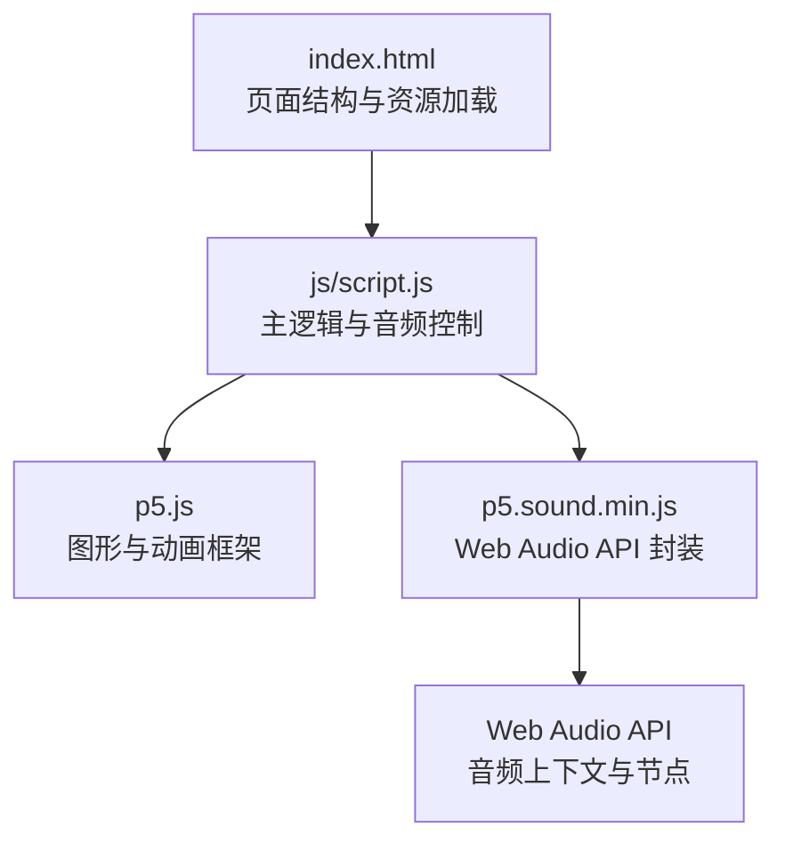
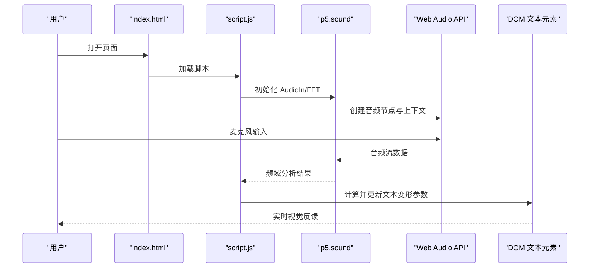
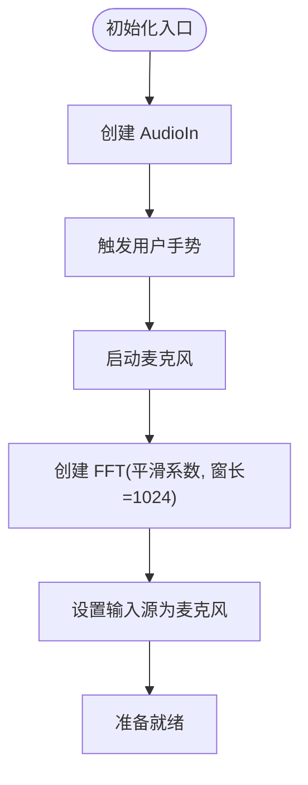
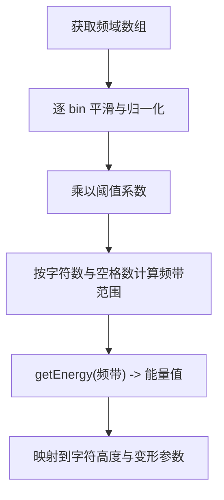
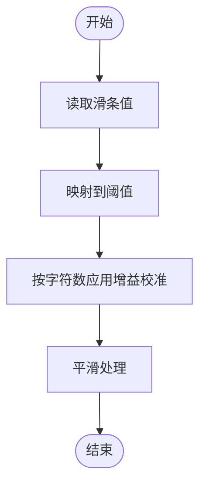
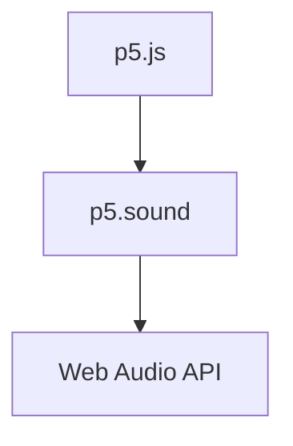

# 音频处理优化

<cite>
**本文档引用的文件**
- [index.html](file://index.html)
- [script.js](file://js/script.js)
- [p5.sound.min.js](file://js/p5.sound.min.js)
</cite>

## 目录
1. [简介](#简介)
2. [项目结构](#项目结构)
3. [核心组件](#核心组件)
4. [架构概览](#架构概览)
5. [详细组件分析](#详细组件分析)
6. [依赖关系分析](#依赖关系分析)
7. [性能考量](#性能考量)
8. [故障排除指南](#故障排除指南)
9. [结论](#结论)
10. [附录](#附录)

## 简介
本指南围绕基于 Web Audio API 的音频处理性能优化展开，结合项目中实际使用的 p5.js 和 p5.sound 库，系统梳理从采样率与缓冲区配置、FFT 分析优化到阈值调节与平滑处理的完整优化路径。同时提供移动端音频优化策略、性能监控与测试方法，帮助在浏览器端实现低延迟、低功耗且稳定的音频可视化与交互体验。

## 项目结构
该项目采用前端单页应用结构，主要逻辑集中在脚本文件中，通过 p5.js 提供图形界面与动画，p5.sound 负责音频输入与频域分析，HTML/CSS 负责界面布局与样式。

图表来源
- [index.html:1-282](file://index.html#L1-L282)
- [script.js:173-184](file://js/script.js#L173-L184)
- [p5.sound.min.js:1-2](file://js/p5.sound.min.js#L1-L2)

章节来源
- [index.html:1-282](file://index.html#L1-L282)
- [script.js:173-184](file://js/script.js#L173-L184)

## 核心组件
- 音频输入与分析
  - 使用 p5.AudioIn 获取麦克风输入，p5.FFT 进行频域分析，默认窗长为 1024 帧。
  - 音量阈值通过滑条动态调节，移动端默认阈值更高以适配环境噪声。
- 动态文本渲染
  - 基于字符数量与空间分布映射到频带，使用平滑算法将能量变化转化为字体变形参数（斜体、倾斜、缩放）。
- 用户交互与菜单
  - 提供颜色选择、工具栏切换、信息显示等交互功能；移动端采用触摸事件优化。

章节来源
- [script.js:183-184](file://js/script.js#L183-L184)
- [script.js:923-929](file://js/script.js#L923-L929)
- [script.js:466-538](file://js/script.js#L466-L538)

## 架构概览
下图展示音频处理在浏览器中的端到端流程：用户麦克风输入经由 Web Audio API 节点链路进入 p5.sound，再由 p5.js 驱动 DOM 文本的实时变形。

图表来源
- [script.js:183-184](file://js/script.js#L183-L184)
- [script.js:923-929](file://js/script.js#L923-L929)
- [p5.sound.min.js:1-2](file://js/p5.sound.min.js#L1-L2)

## 详细组件分析

### 音频输入与初始化
- AudioIn 初始化与启动
  - 在 setup 中创建 p5.AudioIn 并调用 start 启动麦克风权限请求与输入流。
  - 通过 userStartAudio 触发用户手势后才可访问音频上下文，避免静音或阻塞。
- FFT 配置
  - 使用 p5.FFT(平滑系数, 窗长) 初始化，窗长为 1024，平滑系数为 0.9。
  - setInput 指定音频源为麦克风，analyze 返回频域数组用于后续处理。

图表来源
- [script.js:183-184](file://js/script.js#L183-L184)
- [script.js:923-929](file://js/script.js#L923-L929)

章节来源
- [script.js:183-184](file://js/script.js#L183-L184)
- [script.js:923-929](file://js/script.js#L923-L929)

### FFT 分析与频谱处理
- 频谱分析
  - draw 循环中调用 fft.analyze 获取频域数组，长度为窗长（1024），对应 0-1023 个频率 bin。
  - 对每个 bin 进行平滑与归一化处理，乘以阈值系数后参与后续渲染。
- 能量提取与分段映射
  - 通过 fft.getEnergy(起始索引, 结束索引) 获取特定频带的能量值，映射到字符高度变化。
  - 字符数量与空格数影响频带宽度与起止位置，确保不同输入长度下的稳定响应。

图表来源
- [script.js:360-365](file://js/script.js#L360-L365)
- [script.js:376-382](file://js/script.js#L376-L382)

章节来源
- [script.js:360-365](file://js/script.js#L360-L365)
- [script.js:376-382](file://js/script.js#L376-L382)

### 阈值调节与动态范围优化
- 阈值来源
  - 阈值来自滑条映射，移动端默认阈值更高，以适应环境噪声与设备差异。
  - 阈值与字符数量、空间分布共同决定频带划分，避免单一字符过度敏感。
- 动态范围校准
  - 通过 volmap 对不同字符数进行增益补偿，使短文本与长文本在视觉上保持一致的响应强度。
- 平滑处理
  - 使用 lerp 平滑过渡，减少瞬时波动带来的视觉抖动。

图表来源
- [script.js:1006-1012](file://js/script.js#L1006-L1012)
- [script.js:327-342](file://js/script.js#L327-L342)

章节来源
- [script.js:1006-1012](file://js/script.js#L1006-L1012)
- [script.js:327-342](file://js/script.js#L327-L342)

### 移动端优化策略
- 阈值与交互
  - 移动端默认阈值更高，降低误触发概率；触摸事件替代鼠标事件，提升交互稳定性。
- 页面生命周期
  - 监听 pagehide 事件停止音频，避免后台消耗与权限问题。
- 性能自适应
  - 根据屏幕尺寸与设备能力调整渲染策略（如帧率、字体大小范围）。

章节来源
- [script.js:466-468](file://js/script.js#L466-L468)
- [script.js:470-512](file://js/script.js#L470-L512)

## 依赖关系分析
- p5.js 作为渲染与动画框架，负责文本拆分、样式更新与帧驱动。
- p5.sound 封装 Web Audio API，提供 AudioIn、FFT 等高级接口，简化音频节点连接与参数管理。
- Web Audio API 是底层音频处理引擎，负责采样、缓冲与实时处理。

图表来源
- [p5.sound.min.js:1-2](file://js/p5.sound.min.js#L1-L2)

章节来源
- [p5.sound.min.js:1-2](file://js/p5.sound.min.js#L1-L2)

## 性能考量

### 采样率与缓冲区优化
- 当前实现
  - FFT 窗长固定为 1024，平滑系数为 0.9。窗长决定了频率分辨率与计算量的平衡。
- 优化建议
  - 采样率：优先使用浏览器默认采样率，避免强制设置高采样率导致 CPU 占用上升。
  - 缓冲区大小：根据目标延迟与性能需求调整窗长（如 512/1024/2048）。窗长越小延迟越低但分辨率下降，需结合业务场景权衡。
  - 平滑系数：0.9 已具备较好平滑效果，若出现“拖尾”可适度降低至 0.85。

章节来源
- [script.js:926](file://js/script.js#L926)

### FFT 分析优化
- 频率分辨率与计算复杂度
  - 窗长越大，频率分辨率越高但计算量增加。对于文本可视化，1024 窗长已足够覆盖人声主要频段。
- 窗函数选择
  - p5.FFT 默认使用汉宁窗，适合通用语音分析。若需要更锐利的峰值检测，可考虑矩形窗（降低泄漏但易产生旁瓣）。
- 计算复杂度优化
  - 避免在每帧重复分配大数组；项目中已预分配平滑数组，减少 GC 压力。
  - 仅对必要频带进行 getEnergy，避免全频带扫描。

章节来源
- [script.js:193-198](file://js/script.js#L193-L198)
- [script.js:376-382](file://js/script.js#L376-L382)

### 音频阈值与动态范围优化
- 阈值调节
  - 使用滑条动态调节阈值，移动端默认阈值更高，减少误触发。
  - 结合字符数量与空格数进行增益校准，保证不同输入长度下的视觉一致性。
- 平滑处理
  - 通过 lerp 平滑过渡，减少瞬时波动；合理设置平滑系数与时间常数，避免“拖尾”。

章节来源
- [script.js:1006-1012](file://js/script.js#L1006-L1012)
- [script.js:327-342](file://js/script.js#L327-L342)

### p5.js 音频处理优化
- AudioIn 初始化
  - 通过 userStartAudio 触发用户手势后再启动麦克风，避免静音或阻塞。
- 频谱分析缓存
  - 预分配平滑数组，避免每帧重新分配内存；仅在需要时更新频带能量。
- 数据处理效率
  - 将频带能量映射到字符高度与变形参数，尽量减少 DOM 操作次数，批量更新样式属性。

章节来源
- [script.js:183-184](file://js/script.js#L183-L184)
- [script.js:193-198](file://js/script.js#L193-L198)
- [script.js:360-365](file://js/script.js#L360-L365)

### 移动端音频优化
- 电池使用优化
  - 监听页面隐藏事件停止音频，避免后台持续占用；在前台恢复时再启动。
- 后台音频处理
  - 移动端浏览器对后台音频有严格限制，应遵循平台策略，避免长时间后台运行。
- 设备兼容性
  - 区分移动端与桌面端交互方式，使用触摸事件替代鼠标事件；针对不同设备设置不同的默认阈值。

章节来源
- [script.js:466-468](file://js/script.js#L466-L468)
- [script.js:470-512](file://js/script.js#L470-L512)

## 故障排除指南
- 麦克风无响应
  - 确认已通过用户手势触发 userStartAudio；检查浏览器权限与 HTTPS 环境。
- 频谱异常或静音
  - 检查 FFT 输入是否正确绑定到 AudioIn；确认麦克风设备可用。
- 性能抖动或卡顿
  - 减少不必要的 DOM 更新；检查平滑系数与窗长设置；避免在高频循环中执行重操作。
- 移动端后台音频被暂停
  - 监听页面生命周期事件，在 pagehide 时停止音频，在 pageshow 时恢复。

章节来源
- [script.js:156-160](file://js/script.js#L156-L160)
- [script.js:466-468](file://js/script.js#L466-L468)

## 结论
本项目通过 p5.js 与 p5.sound 实现了从麦克风输入到文本可视化的完整音频处理链路。在现有基础上，可通过合理设置窗长与平滑系数、优化阈值与平滑策略、减少 DOM 操作以及移动端生命周期管理等手段进一步提升性能与稳定性。建议在开发与测试阶段结合性能监控工具，持续评估 CPU 占用、音频延迟与电池消耗，确保在多平台上的流畅体验。

## 附录

### 音频性能监控工具与方法
- 浏览器开发者工具
  - 使用 Performance 面板记录帧时间与脚本执行；使用 Memory 面板观察内存分配与垃圾回收。
- Web Audio API 监控
  - 通过 AudioContext 的状态与节点连接情况判断是否存在泄漏或阻塞。
- 自定义指标
  - 记录每帧处理耗时、FFT 分析耗时、DOM 更新耗时，形成性能基线。
- 延迟测量
  - 通过用户输入到视觉反馈的时间差估算总延迟，结合缓冲区大小与窗长推导理论最小延迟。

### 性能测试方法与优化案例
- 测试方法
  - 固定输入（如白噪声或固定音调）测量不同窗长与平滑系数下的 CPU 占用与延迟。
  - 在不同设备与浏览器上对比阈值设置对误触发的影响。
- 优化案例
  - 将窗长从 2048 降至 1024，显著降低 CPU 占用，同时保持可接受的频率分辨率。
  - 通过预分配平滑数组与批量更新样式，减少 GC 抖动与重排重绘。
  - 移动端默认阈值上调 10%-20%，有效降低误触发率并改善用户体验。