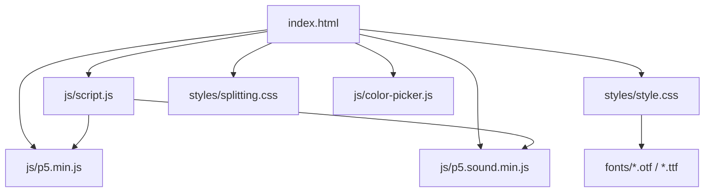
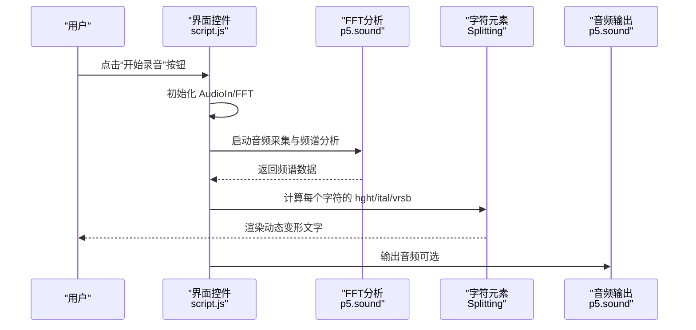
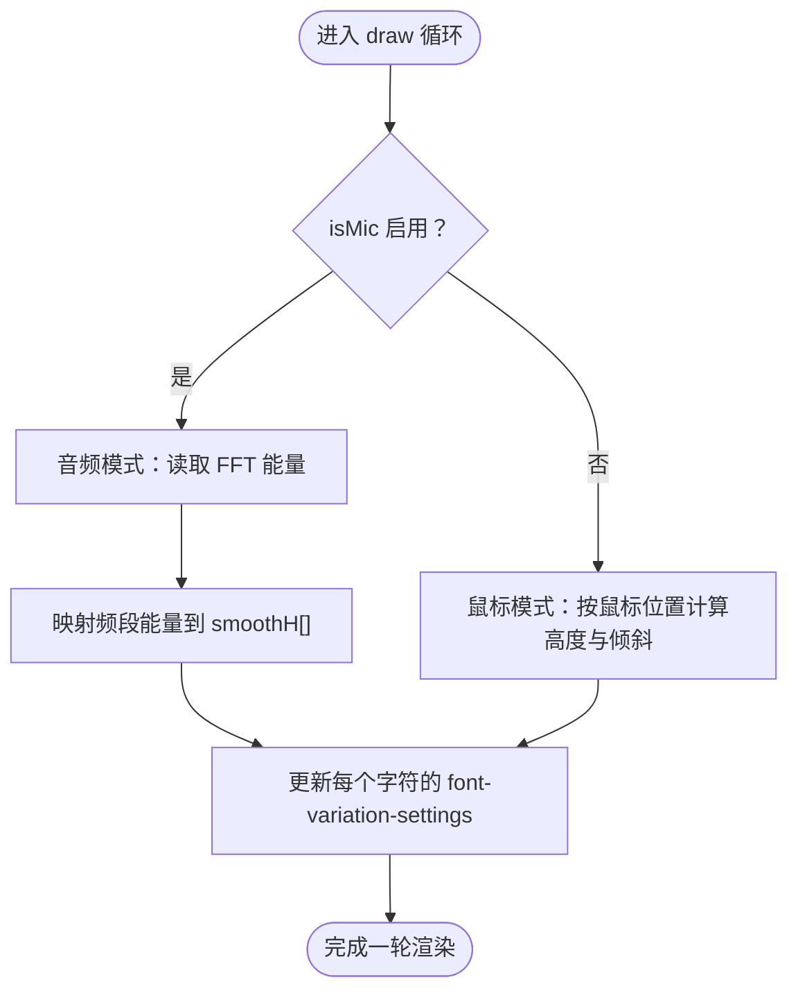
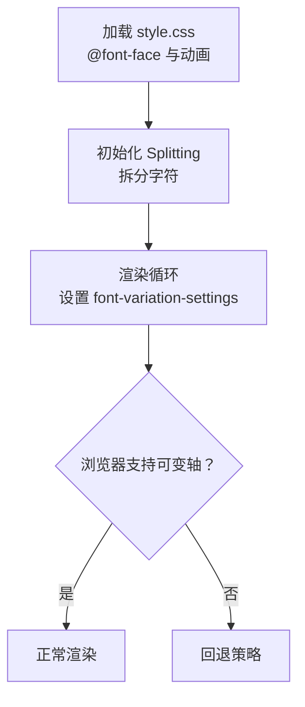
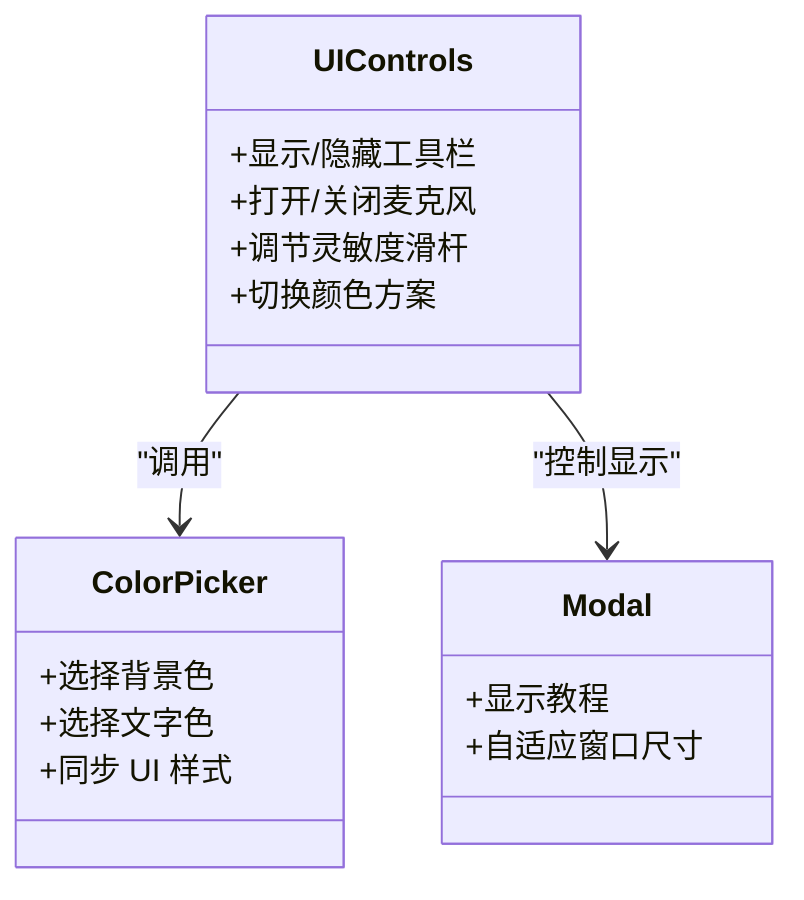
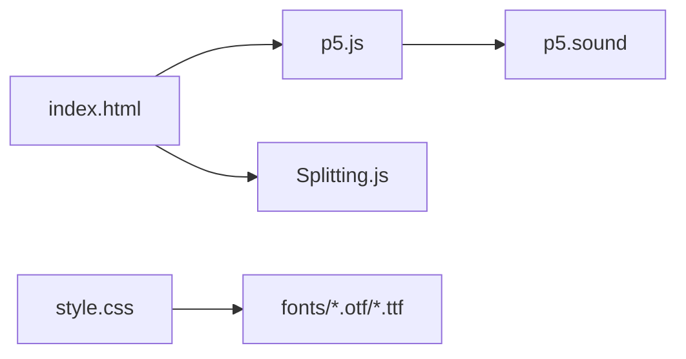

# 故障排除

<cite>
**本文引用的文件**
- [index.html](file://index.html)
- [script.js](file://js/script.js)
- [style.css](file://styles/style.css)
- [splitting.css](file://styles/splitting.css)
- [color-picker.js](file://js/color-picker.js)
- [FONT-REPLACEMENT-GUIDE.md](file://FONT-REPLACEMENT-GUIDE.md)
- [p5.min.js](file://js/p5.min.js)
- [p5.sound.min.js](file://js/p5.sound.min.js)
</cite>

## 目录
1. [简介](#简介)
2. [项目结构](#项目结构)
3. [核心组件](#核心组件)
4. [架构总览](#架构总览)
5. [详细组件分析](#详细组件分析)
6. [依赖关系分析](#依赖关系分析)
7. [性能考虑](#性能考虑)
8. [故障排除指南](#故障排除指南)
9. [结论](#结论)
10. [附录](#附录)

## 简介
本指南面向 Symphosizer 项目的使用者与维护者，提供系统化的故障排除流程与解决方案，覆盖以下主题：
- 音频权限与设备问题
- 字体加载与渲染问题
- 浏览器兼容性问题
- 性能异常与优化建议
- 用户界面问题定位与修复
- 错误代码参考与解决方案索引
- 社区支持与问题反馈渠道

## 项目结构
Symphosizer 是一个基于 Web 的交互式动态排版应用，结合可变字体与 Web Audio API 实现“声音驱动”的文字变形效果。前端采用 HTML/CSS/JavaScript 构建，使用 p5.js 与 p5.sound 提供音频输入与处理能力，Splitting.js 实现字符级拆分与动画。

图表来源
- [index.html](file://index.html)
- [script.js](file://js/script.js)
- [style.css](file://styles/style.css)
- [splitting.css](file://styles/splitting.css)
- [color-picker.js](file://js/color-picker.js)
- [p5.min.js](file://js/p5.min.js)
- [p5.sound.min.js](file://js/p5.sound.min.js)

章节来源
- [index.html](file://index.html)
- [style.css](file://styles/style.css)

## 核心组件
- 音频子系统：使用 p5.AudioIn 获取麦克风输入，p5.FFT 分析频谱，p5.SoundOut 输出到扬声器；通过 draw 循环将音频能量映射到字符的可变轴参数。
- 字体与排版：使用可变字体 ABC Symphony Display，通过 font-variation-settings 动态控制 hght、ital、vrsb 轴，实现声音驱动的字符高度、倾斜与翻转。
- UI 控件：菜单按钮、颜色选择器、滑杆（麦克风灵敏度）、教程模态框等，通过事件绑定与 DOM 操作实现交互。
- 动画与拆分：Splitting.js 将文本拆分为字符级元素，配合 CSS 动画与 JS 计算实现逐字符动画。

章节来源
- [script.js](file://js/script.js)
- [style.css](file://styles/style.css)
- [color-picker.js](file://js/color-picker.js)

## 架构总览
下图展示了从用户交互到音频采集、再到字符变形的端到端流程：

图表来源
- [script.js](file://js/script.js)
- [p5.sound.min.js](file://js/p5.sound.min.js)

## 详细组件分析

### 音频子系统
- 组件职责
  - 音频输入：初始化 p5.AudioIn，启动麦克风权限请求与音频流。
  - 频谱分析：使用 p5.FFT 分析音频频段能量，作为字符变形强度的依据。
  - 输出控制：可选地将音频输出到扬声器或外部设备。
- 关键实现点
  - setup 中初始化 mic 与 FFT，并对 Safari 做特殊判断。
  - draw 中循环读取频谱，计算每个字符的高度、倾斜与缩放。
  - 通过按钮控制麦克风开关与灵敏度滑杆显示。

图表来源
- [script.js](file://js/script.js)

章节来源
- [script.js](file://js/script.js)
- [p5.sound.min.js](file://js/p5.sound.min.js)

### 字体与排版系统
- 组件职责
  - 字体声明：通过 @font-face 引入 ABC Symphony 系列字体。
  - 可变轴控制：在 JS 中动态设置 font-variation-settings，驱动 hght、ital、vrsb。
  - 动画与关键帧：定义加载与播放时的字符动画，配合 JS 实时更新。
- 关键实现点
  - style.css 中声明 Display/Headline/Text 字体族与关键帧。
  - script.js 中在 draw 循环内设置每个字符的样式属性。
  - FONT-REPLACEMENT-GUIDE.md 提供字体替换与轴参数迁移指南。

图表来源
- [style.css](file://styles/style.css)
- [script.js](file://js/script.js)
- [FONT-REPLACEMENT-GUIDE.md](file://FONT-REPLACEMENT-GUIDE.md)

章节来源
- [style.css](file://styles/style.css)
- [script.js](file://js/script.js)
- [FONT-REPLACEMENT-GUIDE.md](file://FONT-REPLACEMENT-GUIDE.md)

### UI 控件与交互
- 组件职责
  - 菜单按钮：控制工具栏显示、颜色选择器、麦克风开关、灵敏度调节等。
  - 颜色选择器：提供背景与文字颜色切换，实时更新 UI。
  - 教程模态框：首次加载时显示引导信息。
- 关键实现点
  - 通过按钮点击事件切换状态与样式。
  - 颜色选择器通过 CSS 类与内联样式即时生效。
  - 模态框尺寸随窗口大小自适应。

图表来源
- [script.js](file://js/script.js)
- [color-picker.js](file://js/color-picker.js)

章节来源
- [script.js](file://js/script.js)
- [color-picker.js](file://js/color-picker.js)

## 依赖关系分析
- 外部库
  - p5.js：提供基础图形与音频上下文。
  - p5.sound：提供音频输入、FFT 分析、音频输出与工作线程处理器。
  - Splitting.js：将文本拆分为字符级元素，便于逐字符动画。
- 样式依赖
  - style.css 依赖 fonts 目录下的字体文件。
  - splitting.css 为 Splitting 提供必要的 CSS 变量与布局支撑。

图表来源
- [index.html](file://index.html)
- [p5.min.js](file://js/p5.min.js)
- [p5.sound.min.js](file://js/p5.sound.min.js)
- [style.css](file://styles/style.css)

章节来源
- [index.html](file://index.html)
- [p5.min.js](file://js/p5.min.js)
- [p5.sound.min.js](file://js/p5.sound.min.js)
- [style.css](file://styles/style.css)

## 性能考虑
- 渲染性能
  - 控制每帧更新的字符数量与动画复杂度，避免过度重排与重绘。
  - 使用 requestAnimationFrame 与帧率限制（frameRate）保持稳定渲染。
- 音频性能
  - FFT 分析与频段映射应尽量轻量，避免在主线程做重型计算。
  - Safari 等浏览器的音频上下文差异需注意，必要时降低采样率或禁用某些特性。
- 内存与资源
  - 字体文件体积较大，建议启用压缩与缓存策略。
  - 音频工作线程与缓冲区大小需合理配置，防止内存泄漏。

[本节为通用指导，不直接分析具体文件]

## 故障排除指南

### 一、音频权限与设备问题
- 症状
  - 点击“开始录音”按钮无效或报错
  - 页面无声音输入，字符不随声音变化
- 诊断步骤
  - 打开浏览器开发者工具，查看 Console 是否出现权限或设备相关的错误信息。
  - 确认页面使用 HTTPS（部分浏览器要求安全上下文以启用麦克风）。
  - 检查浏览器设置中的麦克风权限是否已允许该站点。
  - 在 script.js 中确认 setup 阶段是否正确初始化 AudioIn 与 FFT。
- 解决方案
  - 若 Safari 报错，检查 isSafari 判断逻辑与降级处理。
  - 降低音频采样率或禁用某些音频特性以适配低端设备。
  - 确保 p5.sound 已正确加载且版本兼容。

章节来源
- [script.js](file://js/script.js)
- [p5.sound.min.js](file://js/p5.sound.min.js)

### 二、字体加载与渲染问题
- 症状
  - 页面文字未显示或显示为方块
  - 字符无法变形或动画异常
- 诊断步骤
  - 在 Network 面板检查字体文件是否成功加载（.otf/.ttf）。
  - 在 Elements 面板确认 @font-face 生效，字体族名称与 CSS 中一致。
  - 检查可变轴参数（hght、ital、vrsb）是否被浏览器支持。
- 解决方案
  - 如需替换字体，请参考 FONT-REPLACEMENT-GUIDE.md，确保：
    - 新字体为可变字体（若需声音驱动效果）
    - 更新 style.css 中的 @font-face 与 font-variation-settings
    - 更新 script.js 中的轴映射范围与赋值逻辑
  - 对于不支持可变轴的浏览器，可提供回退字体或禁用动态轴。

章节来源
- [style.css](file://styles/style.css)
- [script.js](file://js/script.js)
- [FONT-REPLACEMENT-GUIDE.md](file://FONT-REPLACEMENT-GUIDE.md)

### 三、浏览器兼容性问题
- 症状
  - 页面在某些浏览器上无法正常渲染或功能缺失
  - 音频在特定浏览器中不可用或延迟高
- 诊断步骤
  - 在不同浏览器中打开页面，对比 Console 错误与功能差异。
  - 检查 script.js 中对 Safari 的特殊处理逻辑。
  - 确认 p5.js 与 p5.sound 的版本与目标浏览器兼容性。
- 解决方案
  - 针对 Safari：启用 isSafari 分支逻辑，必要时禁用某些高级特性。
  - 针对移动端：检查触摸事件与指针事件的兼容性，确保按钮与滑杆可用。
  - 对于不支持 Web Audio 的旧浏览器，提供降级提示或静态页面。

章节来源
- [script.js](file://js/script.js)
- [p5.min.js](file://js/p5.min.js)
- [p5.sound.min.js](file://js/p5.sound.min.js)

### 四、性能异常
- 症状
  - 页面卡顿、掉帧严重
  - 音频输入延迟高或失真
- 诊断步骤
  - 使用 Performance 面板录制一段交互过程，观察主线程占用与 GC 情况。
  - 检查是否存在大量 DOM 查询与样式变更导致的重排。
  - 确认 draw 循环中是否有昂贵操作（如频繁创建对象）。
- 优化建议
  - 限制同时渲染的字符数量，或减少动画复杂度。
  - 合理设置帧率，避免过高的渲染频率。
  - 将音频处理与 UI 更新分离到独立线程或工作线程。
  - 缓存字体与图片资源，减少重复加载。

章节来源
- [script.js](file://js/script.js)

### 五、用户界面问题
- 症状
  - 颜色选择器不生效或样式错乱
  - 模态框尺寸异常或遮挡内容
  - 按钮点击无响应
- 诊断步骤
  - 在 Elements 面板检查颜色选择器的 CSS 类与内联样式是否正确应用。
  - 检查模态框的定位与 z-index 设置。
  - 确认按钮事件绑定是否成功，是否存在阻止默认行为的代码。
- 解决方案
  - 修复 color-picker.js 中的颜色同步逻辑，确保样式正确写入。
  - 调整模态框的居中与自适应逻辑，避免被滚动条影响。
  - 检查事件委托与选择器，确保按钮点击事件触发。

章节来源
- [color-picker.js](file://js/color-picker.js)
- [script.js](file://js/script.js)

### 六、错误代码参考与解决方案索引
- 常见错误类型
  - 权限拒绝：麦克风权限未授权，需引导用户手动开启。
  - 设备不可用：无可用音频输入设备，提示更换设备或检查连接。
  - 浏览器不支持：Web Audio 或可变字体不支持，提供降级方案。
  - 资源加载失败：字体文件 404 或跨域问题，检查路径与服务端配置。
- 解决方案索引
  - 音频权限：在 UI 中添加显式的权限引导与重试机制。
  - 字体加载：使用相对路径与正确的 MIME 类型，启用缓存头。
  - 兼容性：针对 Safari 与移动端提供特性检测与回退策略。
  - 性能：减少每帧计算量，使用 requestAnimationFrame 与节流。

章节来源
- [script.js](file://js/script.js)
- [style.css](file://styles/style.css)

### 七、社区支持与问题反馈渠道
- 官方仓库与问题跟踪
  - 在项目仓库提交 Issue，附带浏览器版本、操作系统、复现步骤与截图/录屏。
- 社区交流
  - 可在相关技术论坛或社区讨论，分享问题与解决方案。
- 反馈模板建议
  - 浏览器与系统版本
  - 期望行为与实际行为
  - 复现步骤与最小化示例
  - Console 截图与网络面板信息

[本节为通用指导，不直接分析具体文件]

## 结论
Symphosizer 的故障排除应围绕“音频权限与设备、字体加载与渲染、浏览器兼容性、性能与 UI 交互”五个维度展开。通过系统化的诊断流程与针对性的优化建议，可以有效提升用户体验与稳定性。建议在开发与发布前进行多浏览器与多设备的回归测试，并持续收集用户反馈以完善兼容性与性能表现。

[本节为总结性内容，不直接分析具体文件]

## 附录
- 快速自检清单
  - HTTPS 环境与麦克风权限
  - 字体文件可访问且加载成功
  - 浏览器支持可变轴与 Web Audio
  - 性能面板显示无明显卡顿
  - 颜色选择器与模态框功能正常

[本节为通用指导，不直接分析具体文件]