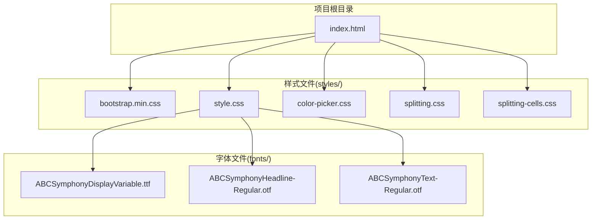
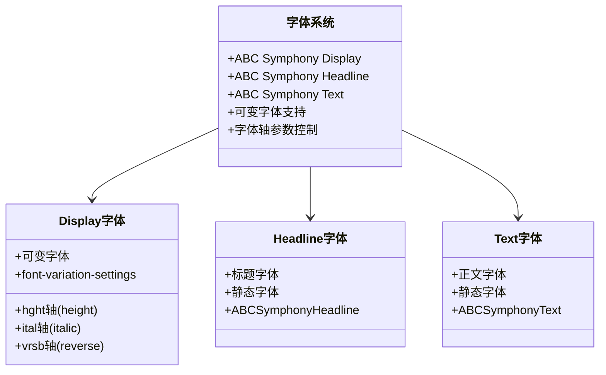
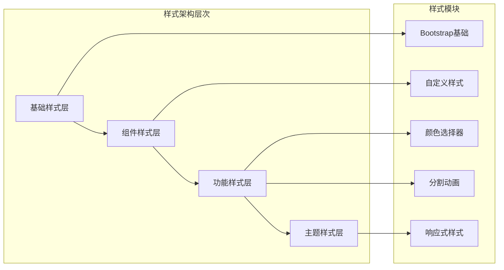
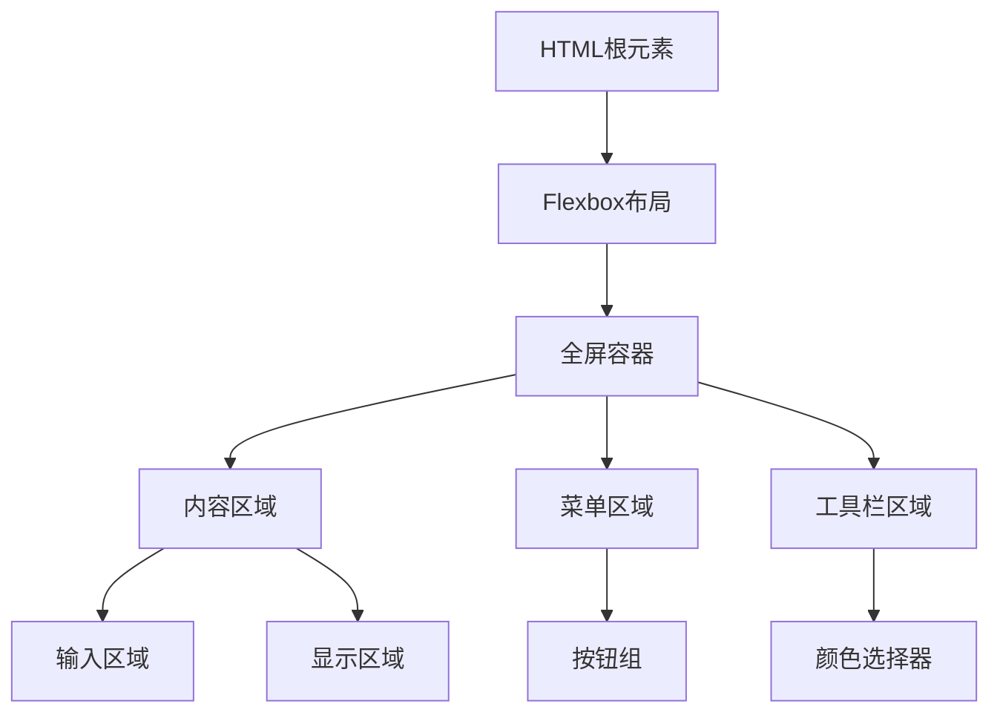
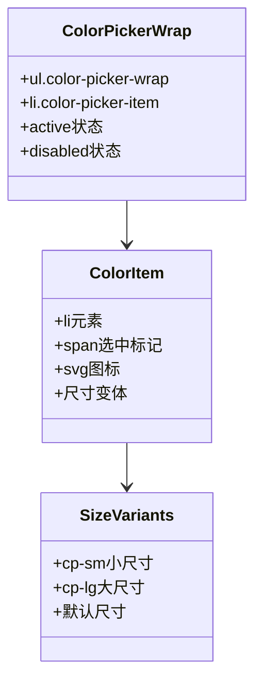
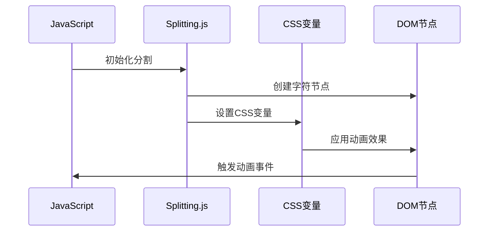
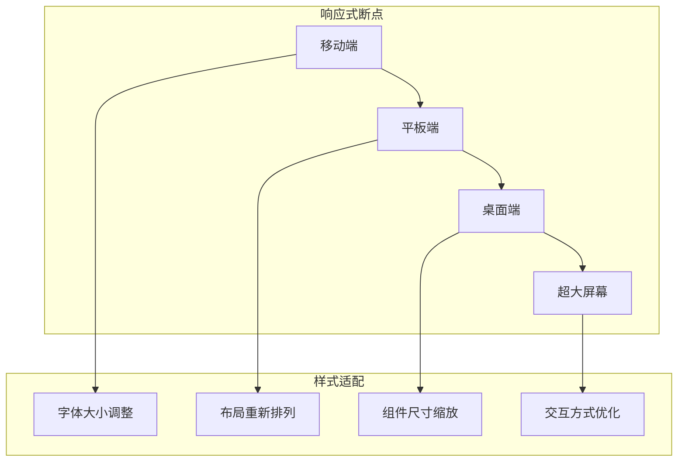
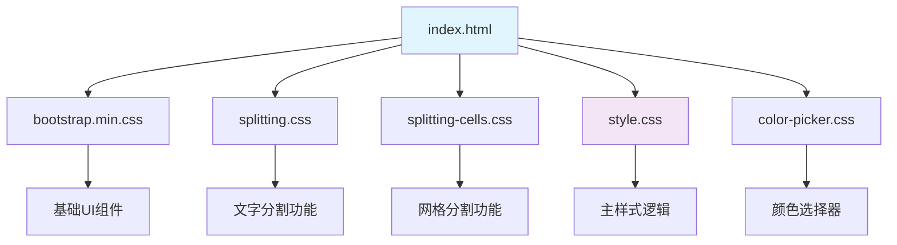
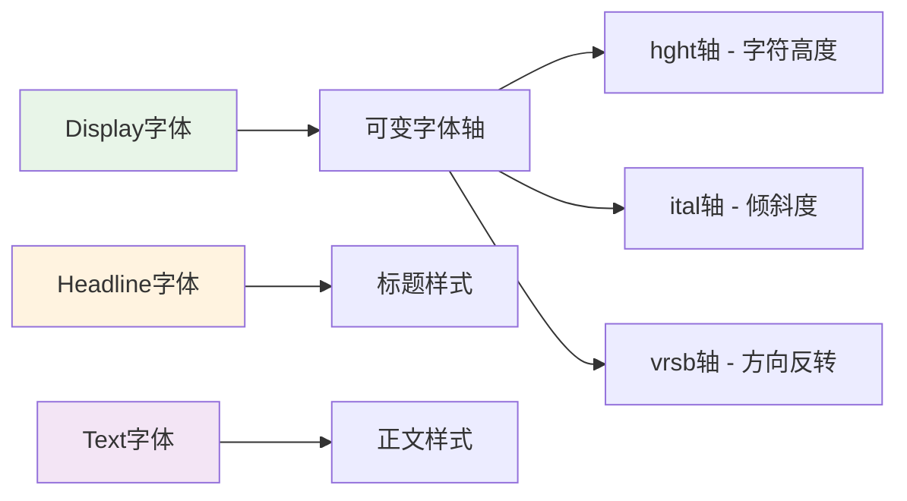

# CSS架构设计

<cite>
**本文档引用的文件**
- [index.html](file://index.html)
- [style.css](file://styles/style.css)
- [bootstrap.min.css](file://styles/bootstrap.min.css)
- [color-picker.css](file://styles/color-picker.css)
- [splitting.css](file://styles/splitting.css)
- [splitting-cells.css](file://styles/splitting-cells.css)
- [FONT-REPLACEMENT-GUIDE.md](file://FONT-REPLACEMENT-GUIDE.md)
</cite>

## 目录
1. [项目概述](#项目概述)
2. [项目结构](#项目结构)
3. [核心组件](#核心组件)
4. [架构概览](#架构概览)
5. [详细组件分析](#详细组件分析)
6. [依赖关系分析](#依赖关系分析)
7. [性能考虑](#性能考虑)
8. [故障排除指南](#故障排除指南)
9. [结论](#结论)

## 项目概述

这是一个基于CSS的动态排版系统，名为Symphosizer，通过声音和交互驱动字体的动态变形效果。该项目采用模块化的CSS架构设计，实现了从基础样式到组件样式的完整组织体系。

## 项目结构

项目采用清晰的模块化文件组织结构：

**图表来源**
- [index.html:1-282](file://index.html#L1-L282)
- [style.css:1-1571](file://styles/style.css#L1-L1571)

**章节来源**
- [index.html:1-282](file://index.html#L1-L282)
- [style.css:1-1571](file://styles/style.css#L1-L1571)

## 核心组件

### 基础样式系统

项目的基础样式系统采用了分层架构：

1. **Bootstrap框架集成**：作为基础UI组件库，提供网格系统、组件样式和响应式基础
2. **自定义主样式**：覆盖和扩展Bootstrap样式，实现项目特定的设计需求
3. **功能模块样式**：针对特定功能的独立样式模块

### 字体系统架构

项目实现了三层字体架构：

**图表来源**
- [style.css:1-15](file://styles/style.css#L1-L15)
- [FONT-REPLACEMENT-GUIDE.md:13-23](file://FONT-REPLACEMENT-GUIDE.md#L13-L23)

### 组件样式模块

项目包含多个专门的功能样式模块：

| 模块名称 | 功能描述 | 样式文件 |
|---------|----------|----------|
| 基础布局 | 页面基础布局和容器样式 | style.css |
| 颜色选择器 | 调色板组件样式 | color-picker.css |
| 分割动画 | 文字分割和动画效果 | splitting.css, splitting-cells.css |
| 响应式设计 | 设备适配和媒体查询 | style.css |

**章节来源**
- [style.css:851-1571](file://styles/style.css#L851-L1571)
- [color-picker.css:1-97](file://styles/color-picker.css#L1-L97)
- [splitting.css:1-67](file://styles/splitting.css#L1-L67)
- [splitting-cells.css:1-56](file://styles/splitting-cells.css#L1-L56)

## 架构概览

### 整体架构设计

项目采用模块化CSS架构，实现了高内聚、低耦合的样式组织：

### 样式继承和优先级规则

项目严格遵循CSS优先级规则：

1. **!important声明**：仅用于特殊场景，避免过度使用
2. **选择器特异性**：类选择器 > 元素选择器 > 通用选择器
3. **层叠顺序**：浏览器默认样式 < 用户代理样式 < 用户样式 < 开发者样式
4. **作用域隔离**：通过命名空间避免样式冲突

**章节来源**
- [style.css:141-162](file://styles/style.css#L141-L162)
- [style.css:39-55](file://styles/style.css#L39-L55)

## 详细组件分析

### 主样式系统分析

主样式系统是整个项目的样式核心，包含了页面的基础布局、组件样式和动画效果。

#### 布局系统

**图表来源**
- [style.css:141-162](file://styles/style.css#L141-L162)
- [style.css:193-197](file://styles/style.css#L193-L197)

#### 动画系统

项目实现了多层次的动画效果：

1. **加载动画**：渐隐渐现的加载效果
2. **字符动画**：基于可变字体的动态变形
3. **界面过渡**：平滑的界面切换效果

**章节来源**
- [style.css:17-37](file://styles/style.css#L17-L37)
- [style.css:241-275](file://styles/style.css#L241-L275)
- [style.css:310-332](file://styles/style.css#L310-L332)

### 颜色选择器组件

颜色选择器组件采用了模块化设计：

**图表来源**
- [color-picker.css:1-97](file://styles/color-picker.css#L1-L97)

### 文字分割系统

文字分割系统实现了复杂的文本处理功能：

**图表来源**
- [splitting.css:1-67](file://styles/splitting.css#L1-L67)
- [splitting-cells.css:1-56](file://styles/splitting-cells.css#L1-L56)

**章节来源**
- [splitting.css:28-67](file://styles/splitting.css#L28-L67)
- [splitting-cells.css:3-56](file://styles/splitting-cells.css#L3-L56)

### 响应式设计架构

项目实现了多层次的响应式设计：

**图表来源**
- [style.css:981-1102](file://styles/style.css#L981-L1102)
- [style.css:1149-1371](file://styles/style.css#L1149-L1371)

**章节来源**
- [style.css:981-1102](file://styles/style.css#L981-L1102)
- [style.css:1149-1371](file://styles/style.css#L1149-L1371)

## 依赖关系分析

### 样式文件依赖关系

**图表来源**
- [index.html:7-13](file://index.html#L7-L13)

### 字体依赖关系

项目字体系统具有明确的依赖关系：

**图表来源**
- [style.css:1-15](file://styles/style.css#L1-L15)
- [FONT-REPLACEMENT-GUIDE.md:13-23](file://FONT-REPLACEMENT-GUIDE.md#L13-L23)

**章节来源**
- [index.html:7-13](file://index.html#L7-L13)
- [style.css:1-15](file://styles/style.css#L1-L15)

## 性能考虑

### 样式性能优化策略

1. **CSS变量使用**：减少重复计算，提高动画性能
2. **媒体查询优化**：避免过度频繁的重排重绘
3. **选择器优化**：使用高效的CSS选择器
4. **动画性能**：利用硬件加速属性

### 响应式性能优化

项目在不同设备上实现了性能优化：

- **移动端优化**：减少动画复杂度，优化触摸交互
- **桌面端优化**：增强视觉效果，保持流畅动画
- **高分辨率屏幕**：优化字体渲染质量

## 故障排除指南

### 常见问题及解决方案

1. **字体加载问题**
   - 检查字体文件路径
   - 验证字体格式兼容性
   - 确认跨域访问权限

2. **动画效果异常**
   - 检查CSS变量定义
   - 验证JavaScript初始化
   - 确认浏览器兼容性

3. **响应式布局问题**
   - 检查媒体查询断点
   - 验证视口设置
   - 测试不同设备尺寸

**章节来源**
- [FONT-REPLACEMENT-GUIDE.md:245-263](file://FONT-REPLACEMENT-GUIDE.md#L245-L263)

## 结论

该项目的CSS架构设计体现了现代前端开发的最佳实践：

1. **模块化设计**：清晰的文件组织和职责分离
2. **可维护性**：标准化的命名约定和代码结构
3. **性能优化**：合理的样式优化和动画实现
4. **可扩展性**：灵活的主题系统和组件架构

通过采用这种架构设计，项目实现了高质量的动态排版效果，同时保持了良好的可维护性和扩展性。建议在后续开发中继续遵循这些设计原则，确保项目的长期健康发展。