# UI组件样式

<cite>
**本文档引用的文件**
- [index.html](file://index.html)
- [style.css](file://styles/style.css)
- [color-picker.css](file://styles/color-picker.css)
- [splitting.css](file://styles/splitting.css)
- [splitting-cells.css](file://styles/splitting-cells.css)
- [bootstrap.min.css](file://styles/bootstrap.min.css)
- [script.js](file://js/script.js)
- [color-picker.js](file://js/color-picker.js)
</cite>

## 目录
1. [简介](#简介)
2. [项目结构](#项目结构)
3. [核心组件](#核心组件)
4. [架构概览](#架构概览)
5. [详细组件分析](#详细组件分析)
6. [依赖关系分析](#依赖关系分析)
7. [性能考虑](#性能考虑)
8. [故障排除指南](#故障排除指南)
9. [结论](#结论)
10. [附录](#附录)

## 简介

这是一个基于Splitting.js的动态字体组件项目，实现了声音激活的排版乐器功能。该项目展示了现代Web UI组件的完整样式实现，包括按钮、导航栏、模态框、工具提示以及颜色选择器等组件的样式设计。

项目采用模块化的CSS架构，结合响应式设计原则，为不同设备和屏幕尺寸提供了优化的用户体验。通过Splitting.js实现字符级别的文本分割，配合CSS变量和动画效果，创造出了独特的视觉体验。

## 项目结构

项目采用清晰的模块化组织结构，每个组件都有独立的样式文件和JavaScript逻辑：

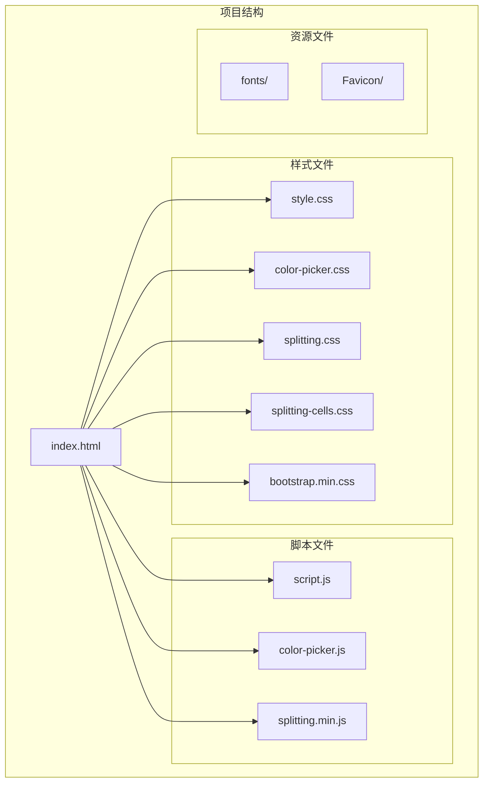

**图表来源**
- [index.html:1-282](file://index.html#L1-L282)

**章节来源**
- [index.html:1-282](file://index.html#L1-L282)

## 核心组件

### 主要UI组件概览

项目实现了以下核心UI组件：

1. **按钮系统** - 九个功能按钮，每个都有独特的SVG图标
2. **导航栏** - 响应式导航系统，显示项目标题和副标题
3. **模态框** - 教程和加载界面
4. **颜色选择器** - 集成的颜色选择组件
5. **滑块控件** - 麦克风灵敏度调节
6. **工具提示** - 屏幕底部的操作说明

### 组件分类与职责

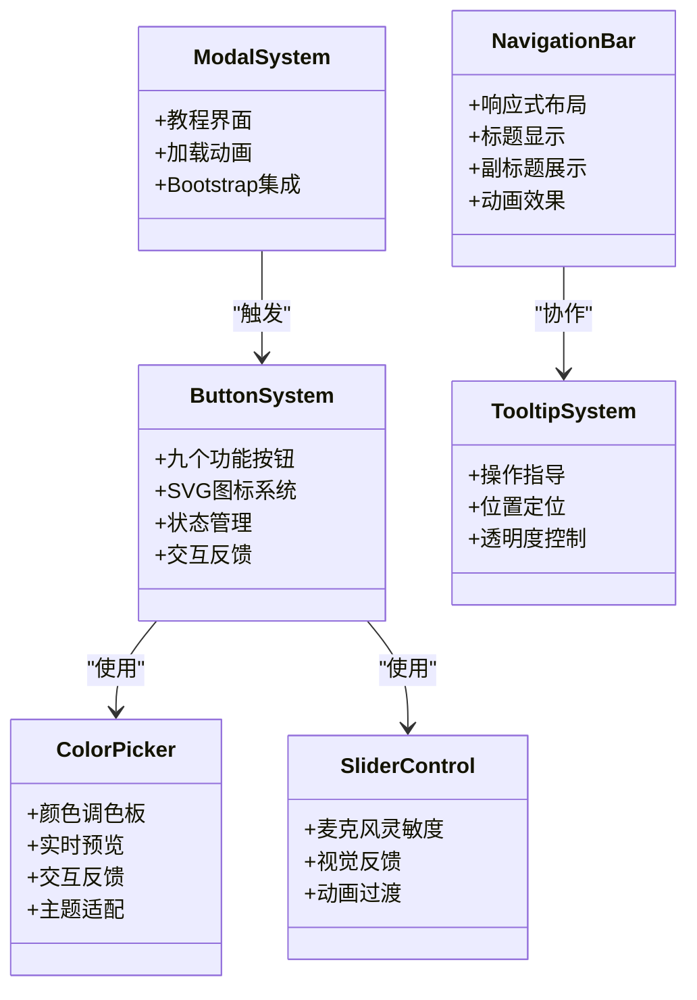

**图表来源**
- [style.css:581-813](file://styles/style.css#L581-L813)
- [index.html:54-178](file://index.html#L54-L178)

**章节来源**
- [style.css:581-813](file://styles/style.css#L581-L813)
- [index.html:54-178](file://index.html#L54-L178)

## 架构概览

### 整体架构设计

项目采用了分层架构，将样式、逻辑和数据分离：

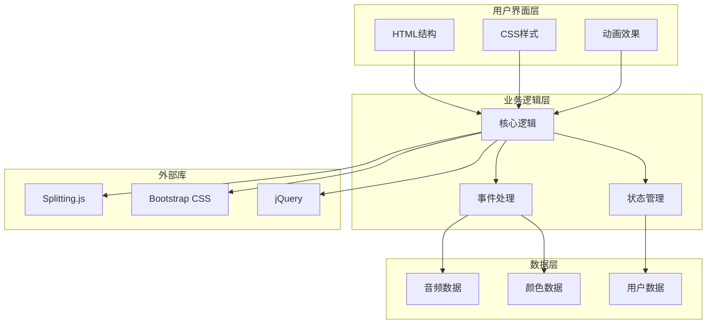

**图表来源**
- [script.js:1-1049](file://js/script.js#L1-L1049)
- [index.html:1-282](file://index.html#L1-L282)

### 样式架构模式

项目采用了以下样式架构模式：

1. **模块化CSS** - 每个组件有独立的样式文件
2. **CSS变量系统** - 使用CSS自定义属性进行主题管理
3. **响应式设计** - 多断点适配不同屏幕尺寸
4. **动画系统** - 关键帧动画和过渡效果
5. **SVG集成** - 矢量图形和图标系统

**章节来源**
- [style.css:1-1573](file://styles/style.css#L1-L1573)
- [script.js:1-1049](file://js/script.js#L1-L1049)

## 详细组件分析

### 按钮组件系统

#### 设计特点

按钮系统是项目的核心交互组件，包含九个功能按钮，每个按钮都有独特的SVG图标和交互行为：

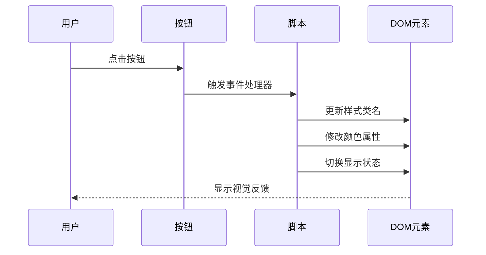

**图表来源**
- [script.js:552-743](file://js/script.js#L552-L743)
- [style.css:706-807](file://styles/style.css#L706-L807)

#### 按钮样式实现

每个按钮都具有统一的设计语言：

- **尺寸规格**：60px × 60px的正方形设计
- **边框系统**：1px实线边框，圆角4px
- **颜色方案**：背景黑色(#000000)，前景白色(#FFFFFF)
- **交互效果**：悬停时透明度变化，点击时状态切换
- **定位系统**：绝对定位和相对定位相结合

**章节来源**
- [style.css:706-807](file://styles/style.css#L706-L807)
- [script.js:552-743](file://js/script.js#L552-L743)

### 导航栏组件

#### 设计特点

导航栏采用固定定位设计，位于页面顶部，包含三个主要区域：

```mermaid
flowchart TD
Nav[导航栏容器] --> SubText1[副标题1]
Nav --> Title[主标题]
Nav --> SubText2[副标题2]
SubText1 --> SoundActivated[声音激活]
SubText1 --> TypographyInstrument[排版乐器]
Title --> Symphosizer[SYMPHOSIZER]
SubText2 --> Collaboration[合作信息]
SubText2 --> SF Symphony[旧金山交响乐团]
```

**图表来源**
- [index.html:181-193](file://index.html#L181-L193)
- [style.css:581-632](file://styles/style.css#L581-L632)

#### 导航栏样式特性

- **定位系统**：固定在视口顶部，z-index: 1000
- **布局系统**：Flexbox布局，居中对齐
- **动画系统**：淡入淡出动画效果
- **响应式设计**：不同屏幕尺寸下的字体大小调整

**章节来源**
- [index.html:181-193](file://index.html#L181-L193)
- [style.css:581-632](file://styles/style.css#L581-L632)

### 模态框组件

#### 设计特点

模态框是教程和加载界面的主要容器：

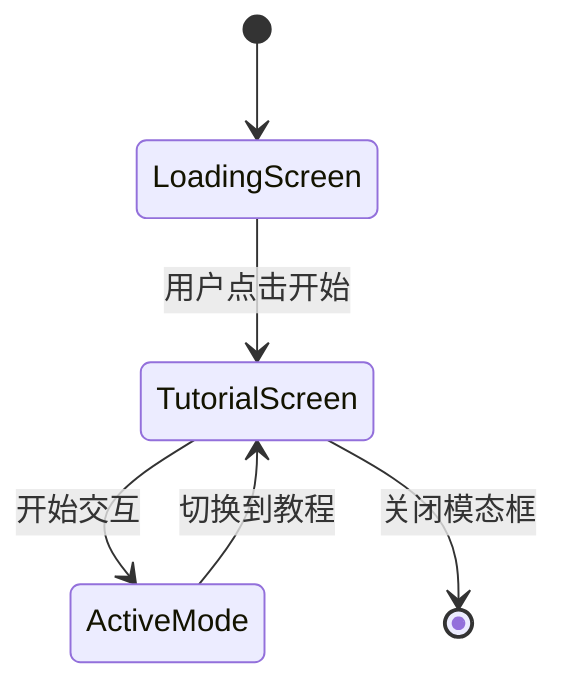

**图表来源**
- [index.html:24-39](file://index.html#L24-L39)
- [script.js:874-921](file://js/script.js#L874-L921)

#### 模态框样式实现

- **Bootstrap集成**：使用Bootstrap的模态框组件
- **自定义样式**：覆盖默认样式以适应项目需求
- **动画系统**：平滑的显示和隐藏动画
- **响应式设计**：适配不同屏幕尺寸

**章节来源**
- [index.html:24-39](file://index.html#L24-L39)
- [style.css:543-579](file://styles/style.css#L543-L579)

### 工具提示组件

#### 设计特点

工具提示位于屏幕底部，提供操作指导：

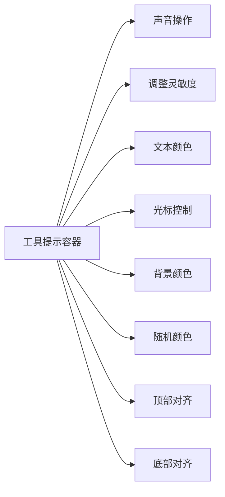

**图表来源**
- [index.html:202-238](file://index.html#L202-L238)
- [style.css:427-461](file://styles/style.css#L427-L461)

#### 工具提示样式特性

- **SVG矢量图形**：使用SVG路径创建图标
- **透明度控制**：根据屏幕尺寸调整可见性
- **响应式布局**：不同断点下的布局调整
- **颜色系统**：与整体主题保持一致

**章节来源**
- [index.html:202-238](file://index.html#L202-L238)
- [style.css:427-461](file://styles/style.css#L427-L461)

### 颜色选择器组件

#### 设计特点

颜色选择器是项目最复杂的UI组件之一，集成了多种功能：

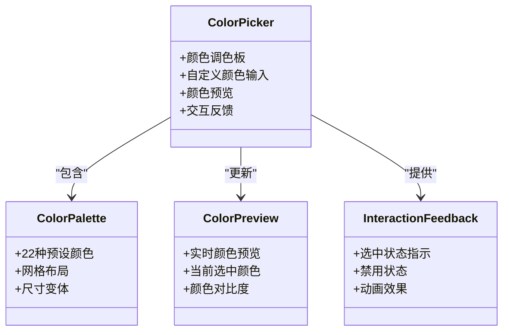

**图表来源**
- [color-picker.css:1-97](file://styles/color-picker.css#L1-L97)
- [color-picker.js:1-231](file://js/color-picker.js#L1-L231)

#### 颜色选择器样式实现

- **调色板布局**：Flexbox网格布局，支持不同尺寸
- **选中状态**：使用伪元素和SVG图标显示选中状态
- **禁用状态**：灰色过滤器和指针事件控制
- **尺寸变体**：sm、lg、默认三种尺寸
- **交互反馈**：悬停效果和过渡动画

**章节来源**
- [color-picker.css:1-97](file://styles/color-picker.css#L1-L97)
- [color-picker.js:1-231](file://js/color-picker.js#L1-L231)

### Splitting.js组件样式

#### 设计特点

Splitting.js实现了字符级别的文本分割和动画：

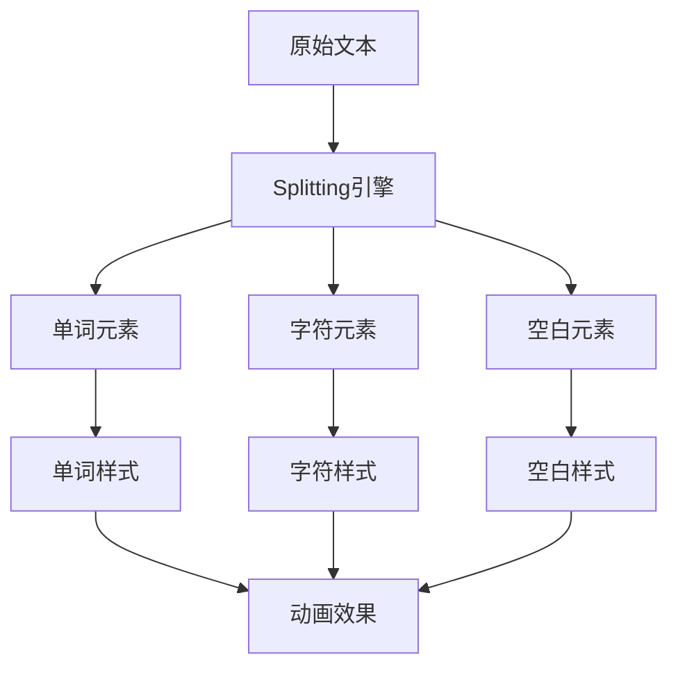

**图表来源**
- [splitting.css:1-67](file://styles/splitting.css#L1-L67)
- [splitting-cells.css:1-56](file://styles/splitting-cells.css#L1-L56)

#### Splitting样式系统

- **基础样式**：字符和单词的内联块显示
- **伪元素系统**：使用::before和::after创建额外的字符层
- **CSS变量**：计算字符位置、距离和偏移量
- **网格系统**：cells变体支持网格分割效果
- **动画支持**：为分割后的元素提供动画接口

**章节来源**
- [splitting.css:1-67](file://styles/splitting.css#L1-L67)
- [splitting-cells.css:1-56](file://styles/splitting-cells.css#L1-L56)

### 滑块控件

#### 设计特点

滑块控件用于调节麦克风灵敏度：

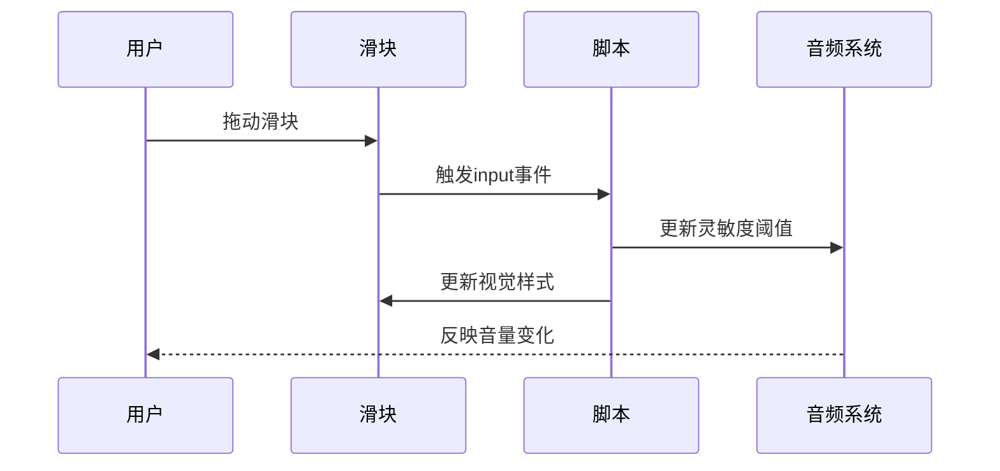

**图表来源**
- [script.js:1006-1012](file://js/script.js#L1006-L1012)
- [style.css:113-139](file://styles/style.css#L113-L139)

#### 滑块样式实现

- **自定义样式**：覆盖浏览器默认样式
- **CSS变量**：动态颜色绑定
- **视觉反馈**：悬停和焦点状态
- **响应式设计**：适配不同屏幕尺寸

**章节来源**
- [script.js:1006-1012](file://js/script.js#L1006-L1012)
- [style.css:113-139](file://styles/style.css#L113-L139)

## 依赖关系分析

### 样式依赖关系

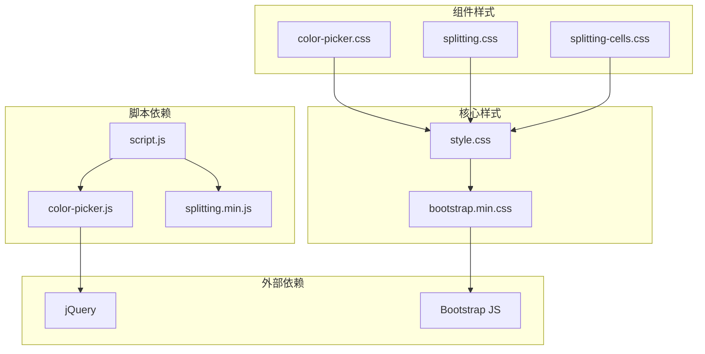

**图表来源**
- [index.html:7-16](file://index.html#L7-L16)
- [script.js:254-261](file://js/script.js#L254-L261)

### 组件交互关系

项目中的组件通过JavaScript进行紧密协作：

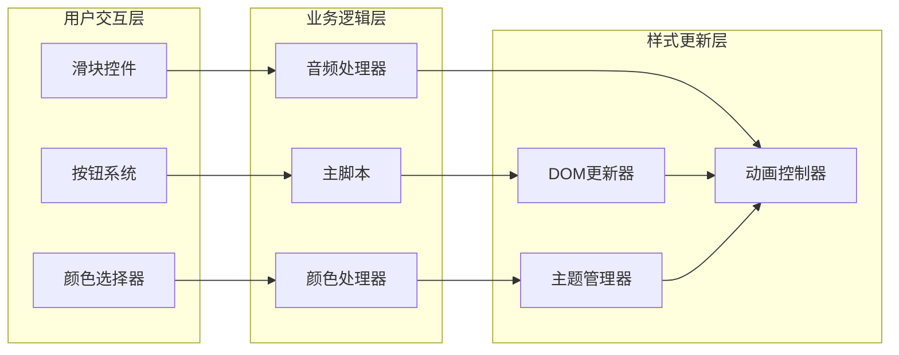

**图表来源**
- [script.js:1-1049](file://js/script.js#L1-L1049)
- [color-picker.js:1-231](file://js/color-picker.js#L1-L231)

**章节来源**
- [index.html:7-16](file://index.html#L7-L16)
- [script.js:1-1049](file://js/script.js#L1-L1049)

## 性能考虑

### 样式性能优化

项目采用了多项性能优化策略：

1. **CSS变量缓存**：使用CSS自定义属性减少重绘
2. **硬件加速**：利用transform和opacity属性启用GPU加速
3. **媒体查询优化**：针对不同设备优化样式加载
4. **动画性能**：关键帧动画和过渡效果的性能考量

### JavaScript性能优化

- **事件委托**：使用事件委托减少事件监听器数量
- **DOM缓存**：缓存频繁访问的DOM元素
- **节流防抖**：对resize和scroll事件进行优化
- **懒加载**：延迟加载非关键资源

## 故障排除指南

### 常见问题及解决方案

#### 样式冲突问题

**问题**：组件样式相互影响
**解决方案**：
- 使用更具体的选择器
- 避免全局样式污染
- 使用CSS模块化命名约定

#### 动画性能问题

**问题**：动画卡顿或不流畅
**解决方案**：
- 使用transform和opacity属性
- 避免频繁的布局计算
- 合理设置动画持续时间

#### 响应式问题

**问题**：在移动设备上显示异常
**解决方案**：
- 检查媒体查询断点
- 验证触摸事件处理
- 测试不同屏幕尺寸

**章节来源**
- [style.css:837-849](file://styles/style.css#L837-L849)
- [script.js:153-154](file://js/script.js#L153-L154)

## 结论

该项目展示了现代Web UI组件样式的完整实现，通过模块化设计和响应式架构，成功创建了一个功能丰富且视觉效果出色的动态字体系统。

主要成就包括：

1. **组件化设计**：每个UI组件都有独立的样式和逻辑
2. **响应式架构**：完美适配不同设备和屏幕尺寸
3. **动画系统**：流畅的过渡效果和视觉反馈
4. **主题系统**：灵活的颜色管理和主题切换
5. **性能优化**：高效的样式和脚本实现

该项目为类似项目的UI组件开发提供了优秀的参考模板，特别是在动态字体、颜色管理和响应式设计方面。

## 附录

### 样式参考表

#### 颜色系统

| 颜色名称 | 十六进制值 | RGB值 |
|---------|-----------|-------|
| 白色 | #FFFFFF | rgb(255, 255, 255) |
| 黑色 | #000000 | rgb(0, 0, 0) |
| 黄色 | #FCE74D | rgb(252, 231, 77) |
| 蓝色 | #68C1DC | rgb(104, 193, 220) |
| 绿色 | #63D13E | rgb(99, 209, 62) |

#### 字体系统

| 字体名称 | 文件名 | 字体族 |
|---------|--------|--------|
| ABC Symphony Display | ABCSymphonyDisplayVariable.ttf | ABC Symphony Display |
| ABC Symphony Headline | ABCSymphonyHeadline-Regular.otf | ABC Symphony Headline |
| ABC Symphony Text | ABCSymphonyText-Regular.otf | ABC Symphony Text |

#### 动画系统

| 动画名称 | 持续时间 | 缓动函数 | 触发条件 |
|---------|----------|----------|----------|
| fadein | 0.2s | ease | 元素显示 |
| fadeout | 2.9s | ease | 元素隐藏 |
| blink | 0.8s | infinite | 光标闪烁 |
| load-bounce | 3s | infinite | 加载动画 |

**章节来源**
- [style.css:1-15](file://styles/style.css#L1-L15)
- [style.css:17-37](file://styles/style.css#L17-L37)
- [style.css:310-332](file://styles/style.css#L310-L332)