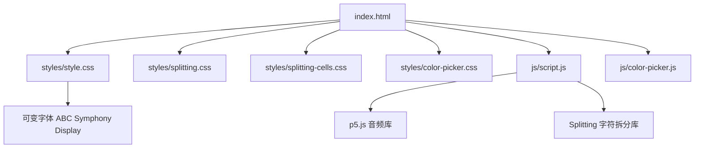
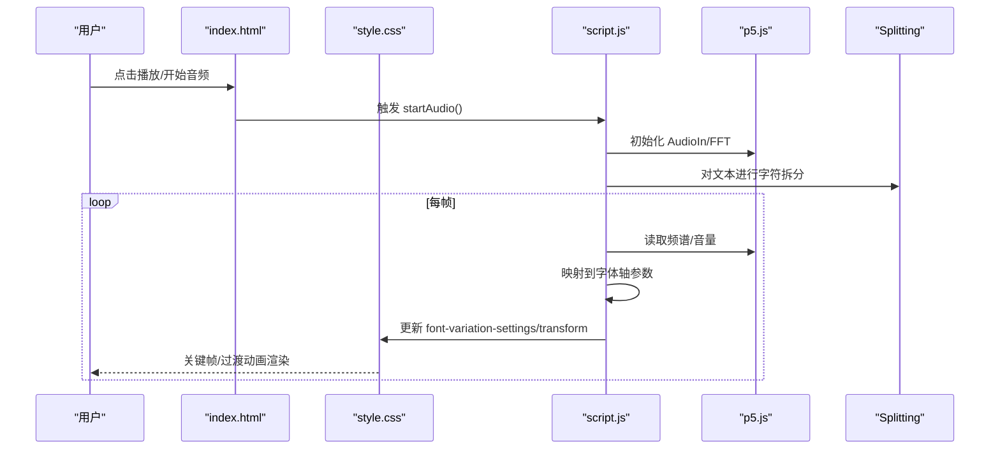
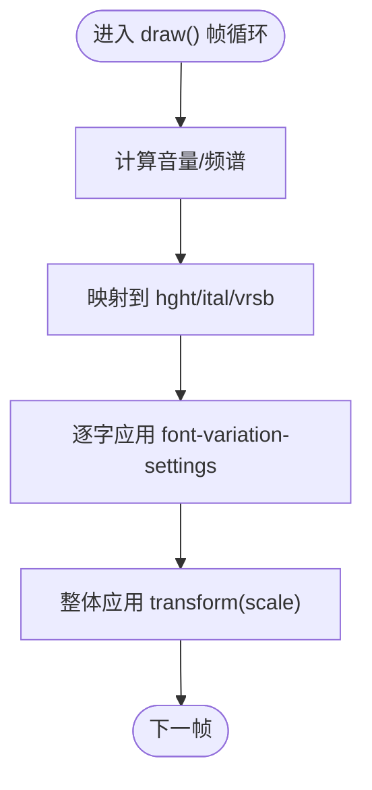
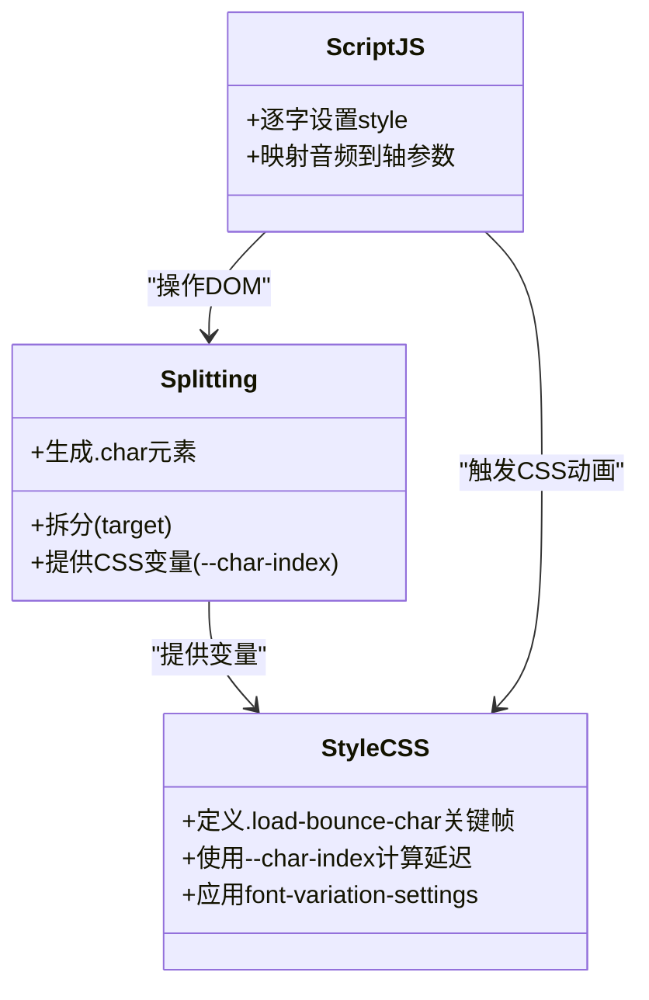
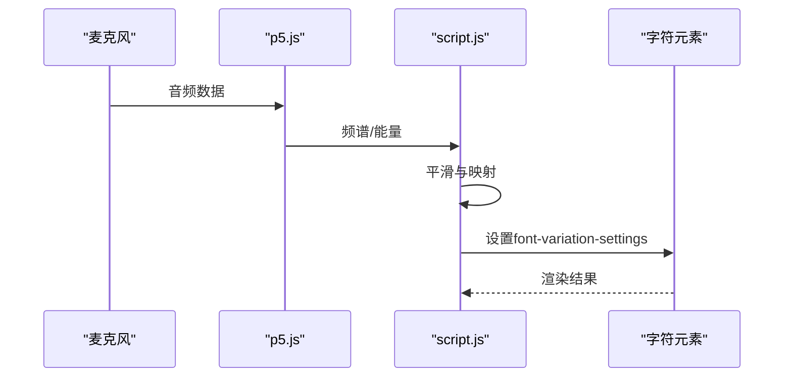
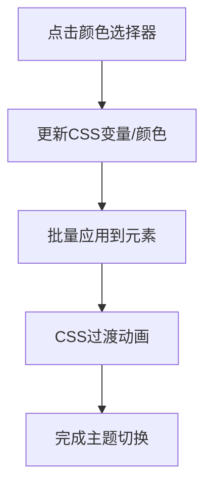
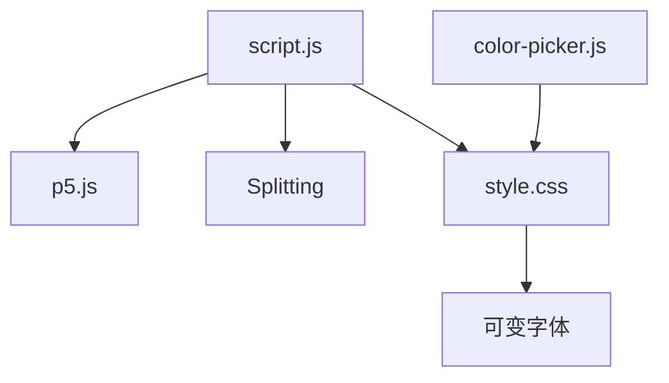

# 动画效果实现

<cite>
**本文档引用的文件**
- [index.html](file://index.html)
- [style.css](file://styles/style.css)
- [splitting.css](file://styles/splitting.css)
- [splitting-cells.css](file://styles/splitting-cells.css)
- [color-picker.css](file://styles/color-picker.css)
- [script.js](file://js/script.js)
- [color-picker.js](file://js/color-picker.js)
- [FONT-REPLACEMENT-GUIDE.md](file://FONT-REPLACEMENT-GUIDE.md)
</cite>

## 目录
1. [简介](#简介)
2. [项目结构](#项目结构)
3. [核心组件](#核心组件)
4. [架构总览](#架构总览)
5. [详细组件分析](#详细组件分析)
6. [依赖关系分析](#依赖关系分析)
7. [性能考虑](#性能考虑)
8. [故障排除指南](#故障排除指南)
9. [结论](#结论)
10. [附录](#附录)

## 简介
本项目是一个“声音驱动的动态排版”交互体验，结合了可变字体的实时轴参数动画、字符级拆分与逐字动画、以及基于音频输入的视觉反馈。项目通过 CSS3 关键帧动画、过渡动画与变换动画实现流畅的视觉效果，并通过 JavaScript 实时计算音频频谱与鼠标位置，驱动每个字符的字体轴参数与几何变换，形成“听觉可视化”的动态排版。

## 项目结构
项目采用模块化的前端组织方式：
- HTML 页面负责页面骨架与初始加载动画
- CSS 样式负责字体声明、关键帧动画、过渡与布局
- JS 脚本负责音频处理、DOM 操作、颜色管理与交互逻辑
- 字体与拆分库用于字符级拆分与动画变量

图表来源
- [index.html:1-282](file://index.html#L1-L282)
- [style.css:1-1571](file://styles/style.css#L1-L1571)
- [script.js:1-1049](file://js/script.js#L1-L1049)

章节来源
- [index.html:1-282](file://index.html#L1-L282)
- [style.css:1-1571](file://styles/style.css#L1-L1571)
- [script.js:1-1049](file://js/script.js#L1-L1049)

## 核心组件
- 可变字体与轴参数动画
  - 使用可变字体 ABC Symphony Display 的 `hght`（高度）、`ital`（斜体）、`vrsb`（反转）轴参数，通过 CSS 关键帧与 JavaScript 实时设置 `font-variation-settings`，实现字符级动画与整体布局动画。
- 字符拆分与逐字控制
  - 通过 Splitting 库对文本进行词、字级别的拆分，配合 CSS 变量与 JavaScript 循环，逐字设置样式与动画延迟，形成“波浪式”或“渐进式”的字符动画。
- 音频驱动的动态排版
  - 使用 p5.js 的 AudioIn 与 FFT 分析音频频谱，将能量值映射到字符的 `YTUC`（高度轴）与 `ital`（斜体轴），实现声音驱动的字体变形。
- 颜色与界面动画
  - 通过 CSS 过渡与关键帧动画实现菜单、提示、加载屏等 UI 元素的淡入淡出与位移动画；颜色选择器通过 CSS 变量与 JavaScript 切换主题色。

章节来源
- [style.css:1-1571](file://styles/style.css#L1-L1571)
- [script.js:1-1049](file://js/script.js#L1-L1049)
- [splitting.css:1-67](file://styles/splitting.css#L1-L67)
- [FONT-REPLACEMENT-GUIDE.md:1-263](file://FONT-REPLACEMENT-GUIDE.md#L1-L263)

## 架构总览
系统以“HTML + CSS + JS”为核心，结合外部库与可变字体，形成“数据驱动的动画管线”：
- 输入层：用户交互（点击、滑动、颜色选择）、音频输入（麦克风）
- 处理层：JavaScript 计算音频频谱、映射到字体轴参数、更新 DOM 样式
- 渲染层：CSS3 动画与过渡、可变字体实时渲染、Splitting 字符拆分

图表来源
- [script.js:923-929](file://js/script.js#L923-L929)
- [script.js:301-426](file://js/script.js#L301-L426)
- [style.css:17-37](file://styles/style.css#L17-L37)
- [style.css:208-228](file://styles/style.css#L208-L228)

## 详细组件分析

### 组件A：可变字体轴参数动画
- 关键帧动画
  - 加载屏与教程页使用 `fadein`、`fadeout`、`splashfade` 等关键帧控制透明度与背景色变化。
  - 字符级动画使用 `load-bounce-char`、`bounce-char`、`bounce-end`，通过 `font-variation-settings` 在不同时间点切换 `hght`、`ital`、`vrsb`。
- 字体轴参数
  - `hght`：控制字符高度，用于表现音量与能量。
  - `ital`：控制斜体角度，用于强调或节奏感。
  - `vrsb`：控制字符方向/反转，用于视觉对比。
- 实现要点
  - CSS 中定义关键帧与动画属性，JavaScript 在每帧根据音频/鼠标数据更新每个字符的 `fontVariationSettings` 与 `transform`。

图表来源
- [script.js:301-426](file://js/script.js#L301-L426)
- [style.css:241-275](file://styles/style.css#L241-L275)
- [style.css:387-421](file://styles/style.css#L387-L421)

章节来源
- [style.css:17-37](file://styles/style.css#L17-L37)
- [style.css:208-228](file://styles/style.css#L208-L228)
- [style.css:241-275](file://styles/style.css#L241-L275)
- [style.css:387-421](file://styles/style.css#L387-L421)
- [script.js:301-426](file://js/script.js#L301-L426)

### 组件B：字符级拆分与逐字动画
- 拆分机制
  - 使用 Splitting 对目标容器进行词/字拆分，生成独立的 `.char` 元素，便于逐字控制。
  - CSS 变量（如 `--char-index`）用于计算每个字符的动画延迟，形成“波浪式”推进。
- 动画策略
  - 通过 `animation-delay: calc(150ms * var(--char-index))` 实现字符序列动画。
  - 结合 `font-variation-settings` 与 `transform`，实现高度、倾斜与几何变换的组合动画。

图表来源
- [splitting.css:1-67](file://styles/splitting.css#L1-L67)
- [style.css:230-239](file://styles/style.css#L230-L239)
- [script.js:238-281](file://js/script.js#L238-L281)

章节来源
- [splitting.css:1-67](file://styles/splitting.css#L1-L67)
- [splitting-cells.css:1-56](file://styles/splitting-cells.css#L1-L56)
- [style.css:230-239](file://styles/style.css#L230-L239)
- [script.js:238-281](file://js/script.js#L238-L281)

### 组件C：音频驱动的动态排版
- 音频采集与分析
  - 使用 p5.AudioIn 获取麦克风输入，p5.FFT 分析频谱，输出能量值。
- 参数映射
  - 将频谱能量映射到字符高度（`YTUC` 对应 `hght`）与斜体（`ital`），并通过平滑算法（如 lerp）避免抖动。
- 交互控制
  - 提供滑条调节灵敏度，移动端与桌面端阈值不同，适配不同设备。

图表来源
- [script.js:923-929](file://js/script.js#L923-L929)
- [script.js:301-426](file://js/script.js#L301-L426)

章节来源
- [script.js:923-929](file://js/script.js#L923-L929)
- [script.js:301-426](file://js/script.js#L301-L426)
- [script.js:1005-1012](file://js/script.js#L1005-L1012)

### 组件D：颜色与界面动画
- 颜色管理
  - 通过颜色选择器切换前景/背景色，JavaScript 动态更新 CSS 变量与元素样式，实现主题切换。
- 界面动画
  - 菜单、提示、加载屏使用 CSS 过渡与关键帧动画，实现淡入淡出与位移。
- 交互反馈
  - 按钮悬停与激活状态通过 CSS 过渡与背景色变化提供即时反馈。

图表来源
- [color-picker.js:1-231](file://js/color-picker.js#L1-L231)
- [style.css:423-455](file://styles/style.css#L423-L455)
- [script.js:571-660](file://js/script.js#L571-L660)

章节来源
- [color-picker.js:1-231](file://js/color-picker.js#L1-L231)
- [color-picker.css:1-97](file://styles/color-picker.css#L1-L97)
- [style.css:423-455](file://styles/style.css#L423-L455)
- [script.js:571-660](file://js/script.js#L571-L660)

## 依赖关系分析
- 外部库
  - p5.js：音频采集与频域分析
  - Splitting：字符级拆分
  - Bootstrap：模态框与基础样式
- 内部耦合
  - script.js 依赖 style.css 中的关键帧与过渡定义，以及字体声明
  - 字体更换需同步修改 CSS 与 JS 中的轴参数映射

图表来源
- [script.js:1-1049](file://js/script.js#L1-L1049)
- [style.css:1-1571](file://styles/style.css#L1-L1571)
- [color-picker.js:1-231](file://js/color-picker.js#L1-L231)

章节来源
- [script.js:1-1049](file://js/script.js#L1-L1049)
- [style.css:1-1571](file://styles/style.css#L1-L1571)
- [color-picker.js:1-231](file://js/color-picker.js#L1-L231)

## 性能考虑
- 硬件加速与合成
  - 使用 `transform` 与 `font-variation-settings` 等可由 GPU 加速的属性，减少重排与重绘。
- 帧率控制
  - 使用 p5 的 `frameRate(60)` 固定帧率，避免过高的计算负载。
- 优化策略
  - 逐字更新时仅修改必要的样式属性，避免频繁的 DOM 查询。
  - 使用 CSS 过渡与关键帧动画代替 JavaScript 高频计算。
  - 在移动端适当降低动画复杂度与频率。
- 可选优化
  - 对于大量字符，可考虑虚拟滚动或按需渲染，减少一次性更新的元素数量。

章节来源
- [script.js:178-201](file://js/script.js#L178-L201)
- [style.css:208-228](file://styles/style.css#L208-L228)

## 故障排除指南
- 字体轴参数不生效
  - 确认字体为可变字体，且轴标签正确（如 `hght`、`ital`、`vrsb`）。
  - 检查 CSS 中关键帧与 JS 中 `fontVariationSettings` 的轴标签一致。
- 动画卡顿或掉帧
  - 检查是否过度使用 JavaScript 动画，优先使用 CSS 过渡与关键帧。
  - 确认 `transform` 与 `opacity` 等属性未被阻塞。
- 颜色切换无效
  - 检查颜色选择器是否正确更新 CSS 变量与元素样式。
  - 确认颜色切换函数是否被调用且作用域正确。
- 音频无响应
  - 确认浏览器允许麦克风权限，且音频初始化成功。
  - 检查滑条阈值设置是否合理，避免过高或过低导致误判。

章节来源
- [FONT-REPLACEMENT-GUIDE.md:68-128](file://FONT-REPLACEMENT-GUIDE.md#L68-L128)
- [script.js:923-929](file://js/script.js#L923-L929)
- [color-picker.js:95-175](file://js/color-picker.js#L95-L175)

## 结论
本项目通过可变字体与字符级拆分技术，实现了声音驱动的动态排版动画。CSS3 关键帧与过渡提供了高效的视觉表现，JavaScript 则承担了音频分析与参数映射的核心职责。整体架构清晰、模块化良好，具备良好的扩展性与可维护性。通过合理的性能优化与故障排查流程，可以进一步提升用户体验与稳定性。

## 附录

### 动画参考手册（关键帧与属性）
- 加载与教程动画
  - `fadein`、`fadeout`：控制透明度渐变
  - `splashfade`：背景色从黑到透明的渐变
- 字符级动画
  - `load-bounce-char`：字符高度的弹跳动画
  - `bounce-char`、`bounce-end`：音量驱动的高度与斜体变化
- UI 动画
  - 菜单、提示、滑条的淡入淡出与位移

章节来源
- [style.css:17-37](file://styles/style.css#L17-L37)
- [style.css:208-228](file://styles/style.css#L208-L228)
- [style.css:241-275](file://styles/style.css#L241-L275)
- [style.css:387-421](file://styles/style.css#L387-L421)
- [style.css:507-529](file://styles/style.css#L507-L529)

### 动画定制指南
- 自定义动画效果
  - 在 CSS 中新增关键帧，使用 `font-variation-settings` 与 `transform` 组合实现目标效果。
- 动画时序调整
  - 通过 `animation-duration`、`animation-delay` 与 `calc()` 控制字符序列与时长。
- 动画组合技巧
  - 将高度、斜体、反转等轴参数组合使用，形成更丰富的视觉层次。
- 字体轴参数映射
  - 参考字体轴范围与项目中的映射函数，确保数值在有效区间内。

章节来源
- [FONT-REPLACEMENT-GUIDE.md:68-128](file://FONT-REPLACEMENT-GUIDE.md#L68-L128)
- [style.css:230-239](file://styles/style.css#L230-L239)
- [script.js:301-426](file://js/script.js#L301-L426)