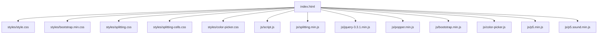
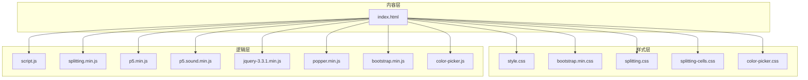
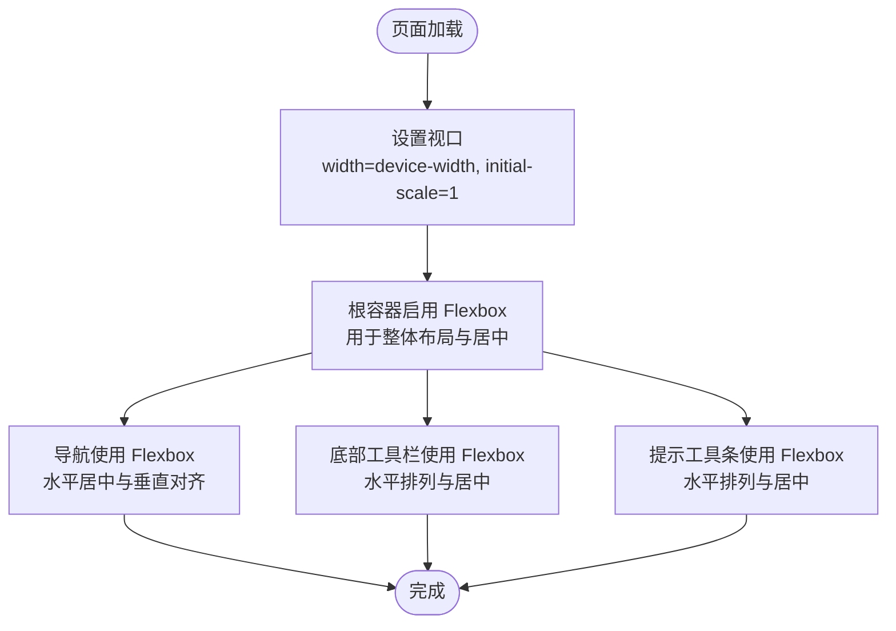
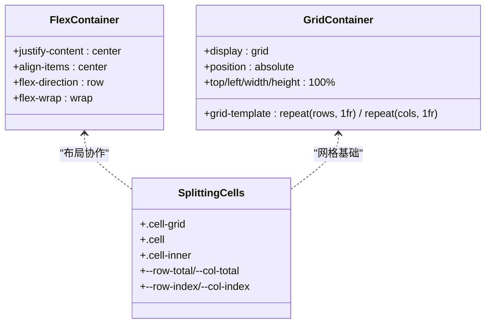
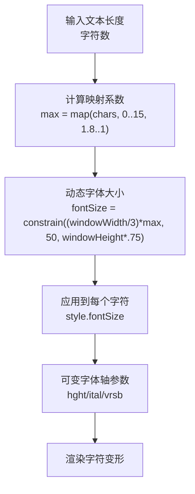
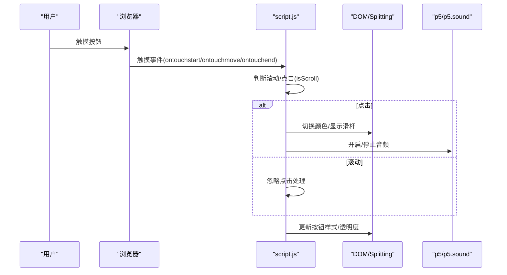
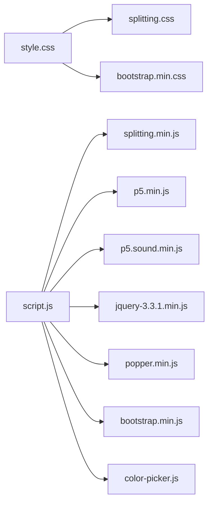

# 响应式设计策略

<cite>
**本文档引用的文件**
- [index.html](file://index.html)
- [style.css](file://styles/style.css)
- [bootstrap.min.css](file://styles/bootstrap.min.css)
- [script.js](file://js/script.js)
- [splitting.css](file://styles/splitting.css)
- [splitting-cells.css](file://styles/splitting-cells.css)
- [color-picker.css](file://styles/color-picker.css)
- [splitting.min.js](file://js/splitting.min.js)
- [FONT-REPLACEMENT-GUIDE.md](file://FONT-REPLACEMENT-GUIDE.md)
</cite>

## 目录
1. [简介](#简介)
2. [项目结构](#项目结构)
3. [核心组件](#核心组件)
4. [架构总览](#架构总览)
5. [详细组件分析](#详细组件分析)
6. [依赖关系分析](#依赖关系分析)
7. [性能考量](#性能考量)
8. [故障排查指南](#故障排查指南)
9. [结论](#结论)
10. [附录](#附录)

## 简介
本项目是一个基于声音驱动的动态排版交互应用，结合了可变字体技术、音频输入与实时渲染，形成独特的“听觉驱动视觉”的体验。本文档围绕该应用的响应式设计策略展开，系统阐述流式布局、弹性图片、媒体查询、断点设计、Flexbox/Grid 布局、响应式字体与间距、移动端适配（视口、触摸交互、性能优化）等主题，并提供完整示例与最佳实践建议，帮助读者在类似项目中构建高质量的跨设备体验。

## 项目结构
该项目采用模块化的前端组织方式：
- HTML 页面负责结构与脚本加载
- CSS 样式分为基础样式、Bootstrap 响应式框架、Splitting 动效样式、颜色选择器样式
- JS 脚本负责音频处理、动态排版、交互逻辑与移动端适配

图表来源
- [index.html](file://index.html)
- [style.css](file://styles/style.css)
- [bootstrap.min.css](file://styles/bootstrap.min.css)
- [script.js](file://js/script.js)
- [splitting.css](file://styles/splitting.css)
- [splitting-cells.css](file://styles/splitting-cells.css)
- [color-picker.css](file://styles/color-picker.css)
- [splitting.min.js](file://js/splitting.min.js)

章节来源
- [index.html](file://index.html)
- [style.css](file://styles/style.css)
- [bootstrap.min.css](file://styles/bootstrap.min.css)
- [script.js](file://js/script.js)

## 核心组件
- 视口与基础布局
  - 视口设置确保移动端正确缩放与触摸行为
  - Flexbox 用于整体页面布局与居中
- 响应式网格与工具栏
  - 使用 Flexbox 实现底部工具栏的水平排列与居中
  - 工具按钮组在不同屏幕尺寸下保持可用性
- 动态排版与可变字体
  - Splitting 库将文本拆分为字符级元素，配合可变字体轴参数实现声音驱动的动态效果
- 音频输入与交互
  - p5.js 与 p5.sound 提供音频采集与频谱分析
  - 鼠标/触摸事件驱动非音频模式下的字符变形
- 移动端适配
  - 针对移动设备的阈值调整、触摸事件处理与性能优化

章节来源
- [index.html](file://index.html)
- [style.css](file://styles/style.css)
- [script.js](file://js/script.js)
- [splitting.css](file://styles/splitting.css)
- [splitting.min.js](file://js/splitting.min.js)

## 架构总览
整体架构围绕“内容层（HTML）—样式层（CSS）—逻辑层（JS）”展开，Bootstrap 提供基础栅格与组件，Splitting 提供字符级拆分能力，p5.js 提供音频处理，最终通过 CSS 变量与动画实现响应式动态效果。

图表来源
- [index.html](file://index.html)
- [style.css](file://styles/style.css)
- [bootstrap.min.css](file://styles/bootstrap.min.css)
- [splitting.css](file://styles/splitting.css)
- [splitting-cells.css](file://styles/splitting-cells.css)
- [color-picker.css](file://styles/color-picker.css)
- [script.js](file://js/script.js)
- [splitting.min.js](file://js/splitting.min.js)

## 详细组件分析

### 视口与基础布局
- 视口设置
  - 通过 meta viewport 确保页面按设备宽度渲染，初始缩放为 1，避免移动端默认缩放导致的布局抖动
- Flexbox 布局
  - html/body 使用 Flexbox 作为根容器，便于垂直居中与整体布局控制
  - 导航、菜单、提示工具条均采用 Flexbox 实现水平/垂直居中与响应式排列

图表来源
- [index.html](file://index.html)
- [style.css](file://styles/style.css)

章节来源
- [index.html](file://index.html)
- [style.css](file://styles/style.css)

### 媒体查询与断点策略
- Bootstrap 断点
  - 项目引入了 Bootstrap 的断点变量与网格系统，包含 xs、sm、md、lg、xl 等断点，适用于栅格与组件的响应式行为
- 自定义断点
  - 在 JavaScript 中通过窗口尺寸判断（如小于 900×400）调整布局细节（如顶部偏移），体现自定义断点的灵活性
- 建议的断点组合
  - 移动端：≤ 576px（小屏手机）
  - 平板：576px–992px（竖屏平板）
  - 桌面：≥ 992px（桌面与大屏）

章节来源
- [bootstrap.min.css](file://styles/bootstrap.min.css)
- [script.js](file://js/script.js)

### 弹性图片与媒体处理
- 图片弹性
  - 使用 Bootstrap 的图片弹性类（如 img-fluid）保证图片在容器内按比例缩放，避免溢出
- SVG 媒体
  - 项目中大量使用 SVG，通过 viewBox 与 CSS 尺寸控制实现矢量缩放，保证高分辨率屏幕清晰度
- 媒体查询优化
  - 结合断点与媒体查询，针对不同 DPR 与屏幕尺寸选择合适的资源与渲染策略

章节来源
- [bootstrap.min.css](file://styles/bootstrap.min.css)
- [index.html](file://index.html)

### Flexbox 与 Grid 布局在响应式中的应用
- Flexbox
  - 导航栏、工具栏、提示工具条均采用 Flexbox，实现水平/垂直居中与弹性排列
  - 在移动端通过隐藏/显示与透明度过渡提升可用性
- Grid
  - Splitting Cells 模块使用 CSS Grid 将图像分割为网格单元，支持复杂动画与过渡
  - Grid 的模板行/列与绝对定位配合，实现逐单元的精细控制

图表来源
- [style.css](file://styles/style.css)
- [splitting.css](file://styles/splitting.css)
- [splitting-cells.css](file://styles/splitting-cells.css)

章节来源
- [style.css](file://styles/style.css)
- [splitting.css](file://styles/splitting.css)
- [splitting-cells.css](file://styles/splitting-cells.css)

### 响应式字体与间距
- 相对单位
  - 使用 vw/vh、em/rem、% 等相对单位控制字号与间距，确保在不同设备上保持视觉比例
- 动态字体大小
  - 通过 JavaScript 计算字符数量与窗口尺寸，映射到动态字体大小，实现“字符越多越小”的视觉平衡
- 可变字体轴
  - 利用可变字体的 hght、ital、vrsb 轴参数，结合音频能量与鼠标位置，实现动态变形
- 字体替换指南
  - 提供完整的字体替换流程，包括可变轴标签与范围的迁移与映射

图表来源
- [script.js](file://js/script.js)
- [style.css](file://styles/style.css)
- [FONT-REPLACEMENT-GUIDE.md](file://FONT-REPLACEMENT-GUIDE.md)

章节来源
- [script.js](file://js/script.js)
- [style.css](file://styles/style.css)
- [FONT-REPLACEMENT-GUIDE.md](file://FONT-REPLACEMENT-GUIDE.md)

### 移动端适配方案
- 视口与触摸
  - 设置视口以适配移动端缩放；使用 touch-action 限制滚动方向，提升触摸稳定性
  - 针对触摸设备调整麦克风阈值与滑杆可见性逻辑，避免误触
- 交互设计
  - 工具按钮在移动端使用触摸事件（ontouchstart/ontouchmove/ontouchend）区分滚动与点击
  - 工具栏在移动端通过透明度与显示/隐藏控制，减少遮挡
- 性能优化
  - 在移动端降低音频处理复杂度，使用更少的平滑参数与更短的频谱数组
  - 通过帧率控制与条件渲染减少不必要的重绘

图表来源
- [script.js](file://js/script.js)
- [index.html](file://index.html)

章节来源
- [script.js](file://js/script.js)
- [index.html](file://index.html)

### 响应式字体与间距实现要点
- 相对单位优先：vw/vh 用于大标题与全屏元素；em/rem 用于组件内间距与字号
- 动态映射：根据字符数与窗口尺寸计算字体大小，避免固定像素导致的不一致
- 可变轴映射：将音频能量与鼠标位置映射到可变轴参数，确保在不同字体下保持一致的视觉效果
- 字体替换：遵循字体替换指南，更新 CSS 与 JS 中的轴标签与范围映射

章节来源
- [style.css](file://styles/style.css)
- [script.js](file://js/script.js)
- [FONT-REPLACEMENT-GUIDE.md](file://FONT-REPLACEMENT-GUIDE.md)

## 依赖关系分析
- 样式依赖
  - style.css 依赖 Splitting 样式以实现字符级动画
  - Bootstrap 提供栅格与组件的基础响应式能力
- 脚本依赖
  - script.js 依赖 Splitting、p5.js、p5.sound、jQuery、Popper、Bootstrap JS
- 组件耦合
  - Splitting 与可变字体紧密耦合，共同实现动态排版
  - 音频处理与渲染逻辑解耦，便于独立优化与替换

图表来源
- [style.css](file://styles/style.css)
- [bootstrap.min.css](file://styles/bootstrap.min.css)
- [script.js](file://js/script.js)
- [splitting.css](file://styles/splitting.css)
- [splitting.min.js](file://js/splitting.min.js)

章节来源
- [style.css](file://styles/style.css)
- [bootstrap.min.css](file://styles/bootstrap.min.css)
- [script.js](file://js/script.js)
- [splitting.css](file://styles/splitting.css)
- [splitting.min.js](file://js/splitting.min.js)

## 性能考量
- 渲染优化
  - 使用 requestAnimationFrame 与帧率控制，避免过度重绘
  - 条件渲染：仅在需要时更新字符样式与动画
- 音频处理
  - 在移动端降低频谱数组长度与平滑参数，减少 CPU 占用
  - 使用音频阈值与能量映射，避免高频更新
- 资源加载
  - 图片与字体采用相对路径与缓存策略，减少首屏加载时间
  - SVG 作为矢量资源，适合高 DPI 屏幕，减少位图资源体积

## 故障排查指南
- 字体不生效或变形异常
  - 检查 @font-face 路径与字体格式
  - 若替换可变字体，需同步更新 CSS 与 JS 中的轴标签与映射范围
- 响应式布局错乱
  - 确认视口设置与 Flexbox 属性
  - 检查断点与媒体查询是否覆盖目标设备
- 移动端触摸无响应
  - 确认触摸事件绑定与滚动/点击判定逻辑
  - 检查 touch-action 与指针事件冲突
- 颜色选择器不可用
  - 确认颜色选择器容器的 pointer-events 与显示状态
  - 检查颜色选择器样式与交互逻辑

章节来源
- [style.css](file://styles/style.css)
- [script.js](file://js/script.js)
- [color-picker.css](file://styles/color-picker.css)

## 结论
本项目通过视口设置、Flexbox 布局、可变字体与音频驱动的动态排版，构建了跨设备的一致体验。借助 Bootstrap 的断点体系与 Splitting 的字符级控制，实现了从桌面到移动端的无缝适配。建议在实际项目中：
- 优先使用相对单位与媒体查询
- 以可变字体为核心，统一轴参数映射
- 在移动端进行性能权衡与交互简化
- 建立完善的字体替换与断点维护流程

## 附录
- 断点参考
  - xs: ≤ 576px
  - sm: 576px–768px
  - md: 768px–992px
  - lg: 992px–1200px
  - xl: ≥ 1200px
- 常用相对单位
  - vw/vh：视口相对单位，适合大标题与全屏元素
  - em/rem：文本相对单位，适合组件内间距与字号
  - %：百分比，适合容器内相对布局
- 最佳实践
  - 先布局后细节，先桌面后移动端
  - 使用 CSS 变量管理断点与颜色，便于维护
  - 对可变轴进行统一命名与映射，避免跨模块差异