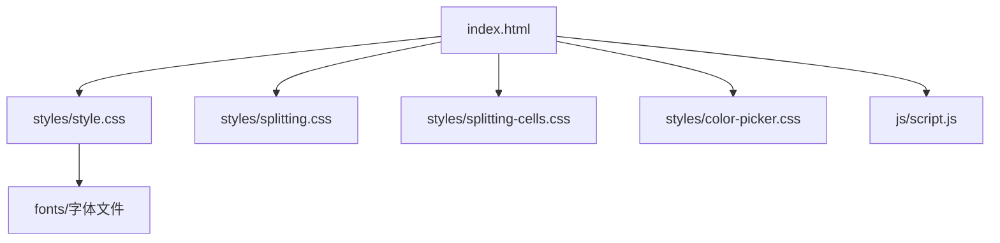
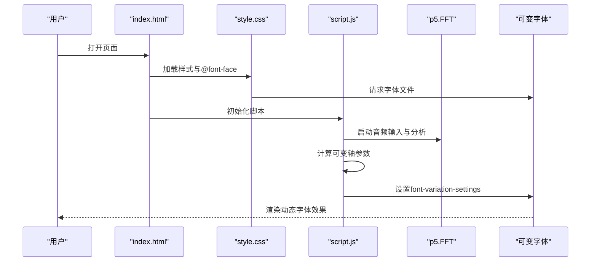
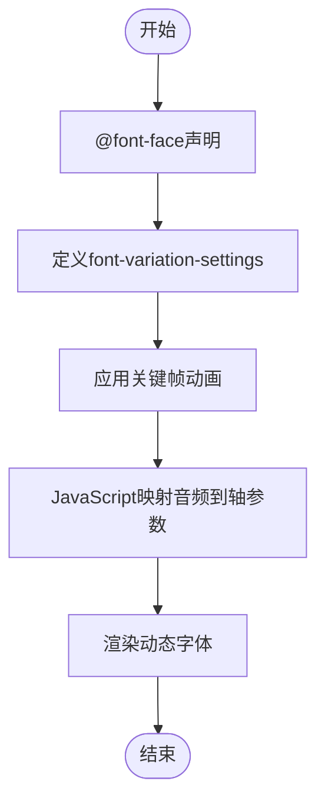
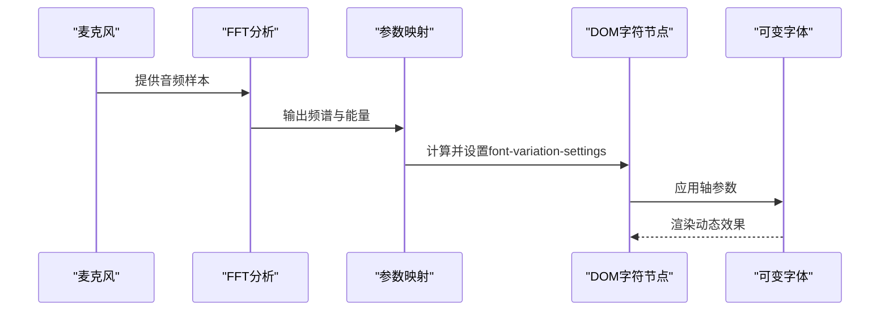
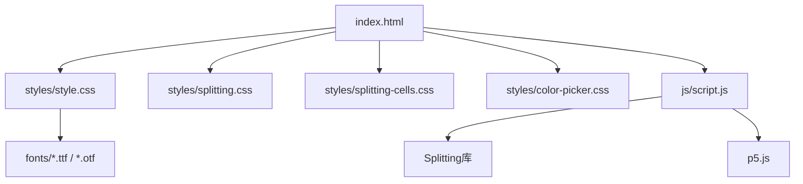

# 字体加载机制

<cite>
**本文档引用的文件**
- [index.html](file://index.html)
- [style.css](file://styles/style.css)
- [FONT-REPLACEMENT-GUIDE.md](file://FONT-REPLACEMENT-GUIDE.md)
- [script.js](file://js/script.js)
- [splitting.css](file://styles/splitting.css)
- [splitting-cells.css](file://styles/splitting-cells.css)
- [color-picker.css](file://styles/color-picker.css)
</cite>

## 目录
1. [简介](#简介)
2. [项目结构](#项目结构)
3. [核心组件](#核心组件)
4. [架构总览](#架构总览)
5. [详细组件分析](#详细组件分析)
6. [依赖关系分析](#依赖关系分析)
7. [性能考虑](#性能考虑)
8. [故障排除指南](#故障排除指南)
9. [结论](#结论)
10. [附录](#附录)

## 简介
本文件系统性梳理该项目的字体加载机制，重点覆盖可变字体的CSS声明与使用、font-variation-settings的配置与轴参数控制、字体回退策略、字体加载性能优化、@font-face规则的使用、字体定制与主题切换、以及完整的字体加载示例与性能监控方法。文档基于仓库现有实现进行深入分析，并提供可操作的实践建议。

## 项目结构
项目采用按功能模块组织的结构，字体相关资源主要分布在以下位置：
- 样式层：styles/style.css 定义字体声明与可变轴动画；splitting.css/splitting-cells.css 提供文本拆分与布局支持；color-picker.css 提供颜色选择器样式。
- 脚本层：js/script.js 负责音频输入、FFT分析与可变轴参数的实时映射，驱动字体动态变形。
- 页面层：index.html 引入样式与脚本，承载字体加载与交互界面。

**图表来源**
- [index.html](file://index.html)
- [style.css](file://styles/style.css)
- [script.js](file://js/script.js)

**章节来源**
- [index.html](file://index.html)
- [style.css](file://styles/style.css)

## 核心组件
- @font-face声明与字体文件路径：在样式表中通过@font-face声明三款字体（Display、Headline、Text），并指定字体文件路径。
- 可变字体与font-variation-settings：在关键选择器与动画中使用font-variation-settings控制字形高度、斜度与翻转等轴参数。
- 音频驱动的动态排版：JavaScript通过p5.js的FFT分析音频能量，将能量映射到可变轴参数，实现实时字体变形。
- 字体回退与降级：通过sans-serif与serif作为后备字体族，确保在字体加载失败或不支持时仍可渲染文本。
- 字体主题与品牌规范：通过CSS变量与颜色选择器，实现字体颜色与背景色的主题切换，保持品牌一致性。

**章节来源**
- [style.css](file://styles/style.css)
- [script.js](file://js/script.js)
- [FONT-REPLACEMENT-GUIDE.md](file://FONT-REPLACEMENT-GUIDE.md)

## 架构总览
字体加载与动态排版的整体流程如下：
- 页面加载时，样式表中的@font-face开始加载字体文件。
- 文本被拆分为字符单元（Splitting），以便逐字符应用可变轴参数。
- 音频输入经FFT分析，提取频谱能量并映射到可变轴（如高度、斜度、翻转）。
- 每帧更新每个字符的font-variation-settings，实现流畅的动态排版效果。
- 若字体加载失败，浏览器会自动回退到后备字体族，保证可读性。

**图表来源**
- [index.html](file://index.html)
- [style.css](file://styles/style.css)
- [script.js](file://js/script.js)

## 详细组件分析

### 组件A：可变字体的CSS声明与使用
- @font-face声明：在样式表中为每种用途声明独立的字体族，并指向对应字体文件路径。
- font-variation-settings配置：在关键选择器（如加载动画、按钮、标题等）中设置轴参数，实现动态效果。
- 轴参数说明：高度（hght）、斜度（ital）、翻转（vrsb）等，用于控制字形高度、倾斜与方向。
- 动画与映射：通过关键帧动画与JavaScript映射，将音频能量转换为轴参数变化。

**图表来源**
- [style.css](file://styles/style.css)
- [script.js](file://js/script.js)

**章节来源**
- [style.css](file://styles/style.css)
- [script.js](file://js/script.js)
- [FONT-REPLACEMENT-GUIDE.md](file://FONT-REPLACEMENT-GUIDE.md)

### 组件B：字体回退策略
- 后备字体族：在字体声明与全局样式中使用sans-serif与serif作为后备，确保在字体不可用时仍可渲染。
- 兼容性保障：通过明确的字体族顺序与后备，避免因字体加载失败导致的布局破坏。
- 降级体验：即使可变轴不生效，文本仍可按常规字体显示，维持可用性。

**章节来源**
- [style.css](file://styles/style.css)

### 组件C：字体加载性能优化
- 字体格式选择：优先使用现代格式（如WOFF2），以获得更好的压缩比与加载速度。
- 字体压缩：在构建阶段对字体文件进行压缩，减少传输体积。
- 预加载策略：通过延迟加载非关键字体或使用资源提示（如preload）优化首屏渲染。
- 渐进式增强：在字体未完全加载时，允许文本先以后备字体显示，随后再替换为自定义字体，避免阻塞渲染。

**章节来源**
- [style.css](file://styles/style.css)
- [FONT-REPLACEMENT-GUIDE.md](file://FONT-REPLACEMENT-GUIDE.md)

### 组件D：@font-face规则与跨域加载
- 字体文件路径：@font-face中的src指向fonts目录下的字体文件，确保相对路径正确。
- 格式兼容性：通过多种格式声明（如TTF、OTF）提升浏览器兼容性。
- 跨域字体：若字体托管于CDN或跨域服务器，需确保服务器返回正确的CORS头，允许当前域名访问字体资源。

**章节来源**
- [style.css](file://styles/style.css)

### 组件E：字体定制与主题切换
- 自定义字体集成：通过修改@font-face声明与相关选择器，替换为新的字体文件与字体族名称。
- 字体主题切换：结合颜色选择器与CSS变量，实现字体颜色与背景色的主题切换，保持品牌一致性。
- 品牌字体使用规范：遵循字体使用指南，确保在不同场景下正确应用字体族与轴参数。

**章节来源**
- [style.css](file://styles/style.css)
- [color-picker.css](file://styles/color-picker.css)
- [FONT-REPLACEMENT-GUIDE.md](file://FONT-REPLACEMENT-GUIDE.md)

### 组件F：音频驱动的动态排版实现
- 音频输入与分析：使用p5.AudioIn与p5.FFT获取音频能量与频谱数据。
- 轴参数映射：将音频能量映射到可变轴参数（如高度、斜度、翻转），并通过font-variation-settings实时更新。
- 性能优化：通过平滑算法与阈值控制，避免过度抖动，提升视觉稳定性。

**图表来源**
- [script.js](file://js/script.js)

**章节来源**
- [script.js](file://js/script.js)

## 依赖关系分析
- 样式依赖：index.html依赖多个CSS文件，其中style.css负责字体声明与可变轴动画，splitting.css提供文本拆分能力，color-picker.css提供颜色选择器样式。
- 脚本依赖：script.js依赖Splitting库进行文本拆分，依赖p5.js进行音频分析，依赖DOM元素进行动态更新。
- 字体依赖：style.css中的@font-face声明依赖fonts目录下的字体文件。

**图表来源**
- [index.html](file://index.html)
- [style.css](file://styles/style.css)
- [script.js](file://js/script.js)

**章节来源**
- [index.html](file://index.html)
- [style.css](file://styles/style.css)
- [script.js](file://js/script.js)

## 性能考虑
- 字体加载阻塞：避免在关键渲染路径上强制同步字体加载，优先使用异步加载与预加载策略。
- 字体格式与压缩：优先使用WOFF2，配合压缩工具减少体积；必要时提供多种格式以提升兼容性。
- 渐进式增强：允许文本先以后备字体显示，随后再替换为自定义字体，避免长时间阻塞渲染。
- 动画性能：在JavaScript中对参数进行平滑处理，减少频繁DOM写入，提升动画流畅度。

[本节为通用性能指导，无需具体文件分析]

## 故障排除指南
- 字体不显示或显示为方块：检查@font-face中的src路径是否正确，确认字体文件存在且格式受支持。
- 可变轴无效：确认浏览器支持font-variation-settings，核对轴标签与范围是否匹配目标字体。
- 跨域问题：若字体来自CDN，检查服务器CORS头是否允许当前域名访问。
- 动画异常：检查JavaScript中对font-variation-settings的赋值逻辑，确保参数范围与目标轴一致。

**章节来源**
- [style.css](file://styles/style.css)
- [script.js](file://js/script.js)
- [FONT-REPLACEMENT-GUIDE.md](file://FONT-REPLACEMENT-GUIDE.md)

## 结论
本项目通过@font-face声明与font-variation-settings实现了可变字体的动态排版效果，结合音频分析与逐字符控制，创造出独特的“声音驱动”字体体验。通过合理的回退策略、性能优化与主题定制，既保证了可用性与兼容性，又提升了视觉表现力。建议在后续维护中持续关注字体格式与加载策略的演进，以进一步优化用户体验。

[本节为总结性内容，无需具体文件分析]

## 附录
- 字体更换步骤与注意事项详见字体更换指南文档，涵盖Display、Headline与Text三类字体的替换流程与参数映射调整。
- 快速测试方法：启动本地服务器，打开页面后检查加载动画、播放按钮与音频驱动效果，使用浏览器开发者工具查看Console错误。

**章节来源**
- [FONT-REPLACEMENT-GUIDE.md](file://FONT-REPLACEMENT-GUIDE.md)