# 样式系统设计

<cite>
**本文档引用的文件**
- [index.html](file://index.html)
- [style.css](file://styles/style.css)
- [bootstrap.min.css](file://styles/bootstrap.min.css)
- [color-picker.css](file://styles/color-picker.css)
- [splitting.css](file://styles/splitting.css)
- [splitting-cells.css](file://styles/splitting-cells.css)
- [script.js](file://js/script.js)
- [FONT-REPLACEMENT-GUIDE.md](file://FONT-REPLACEMENT-GUIDE.md)
</cite>

## 目录
1. [项目概述](#项目概述)
2. [项目结构](#项目结构)
3. [核心组件](#核心组件)
4. [架构概览](#架构概览)
5. [详细组件分析](#详细组件分析)
6. [依赖关系分析](#依赖关系分析)
7. [性能考虑](#性能考虑)
8. [故障排除指南](#故障排除指南)
9. [结论](#结论)

## 项目概述

MySymphosizer 是一个创新的声音激活排版系统，结合了可变字体技术、CSS3 动画和响应式设计，创造出独特的视觉体验。该系统通过麦克风输入实时驱动字体变形，实现了"听觉到视觉"的转换效果。

该项目采用模块化的样式架构，包含三个主要字体系列：
- **ABC Symphony Display**：可变字体，用于主显示文字和动态效果
- **ABC Symphony Headline**：标题字体，用于品牌标识
- **ABC Symphony Text**：正文字体，用于界面元素

## 项目结构

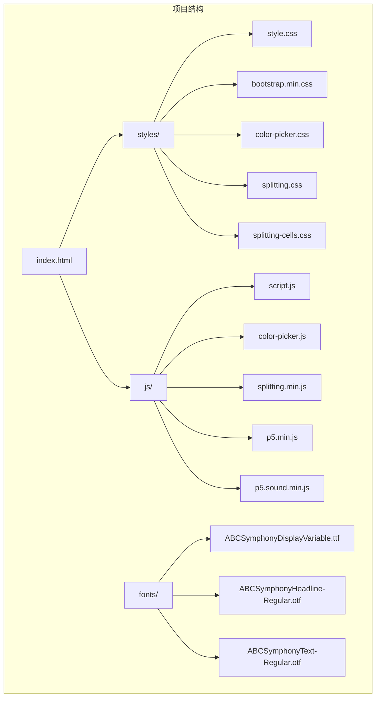

**图表来源**
- [index.html:1-282](file://index.html#L1-L282)
- [style.css:1-1571](file://styles/style.css#L1-L1571)

**章节来源**
- [index.html:1-282](file://index.html#L1-L282)
- [style.css:1-1571](file://styles/style.css#L1-L1571)

## 核心组件

### 字体系统架构

系统采用三层字体架构，每层都有特定的职责和用途：

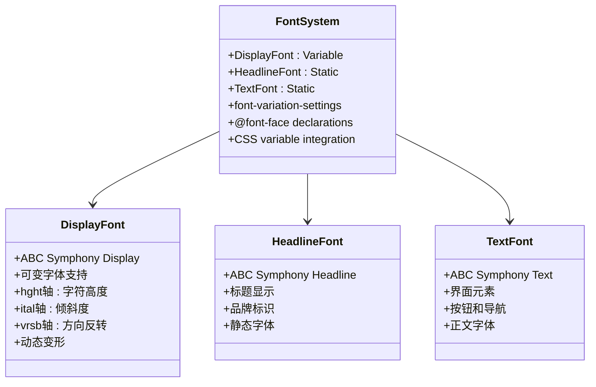

**图表来源**
- [style.css:1-15](file://styles/style.css#L1-L15)
- [FONT-REPLACEMENT-GUIDE.md:7-23](file://FONT-REPLACEMENT-GUIDE.md#L7-L23)

### 动画系统

系统实现了多层次的动画效果，从基础的淡入淡出到复杂的可变字体变形：

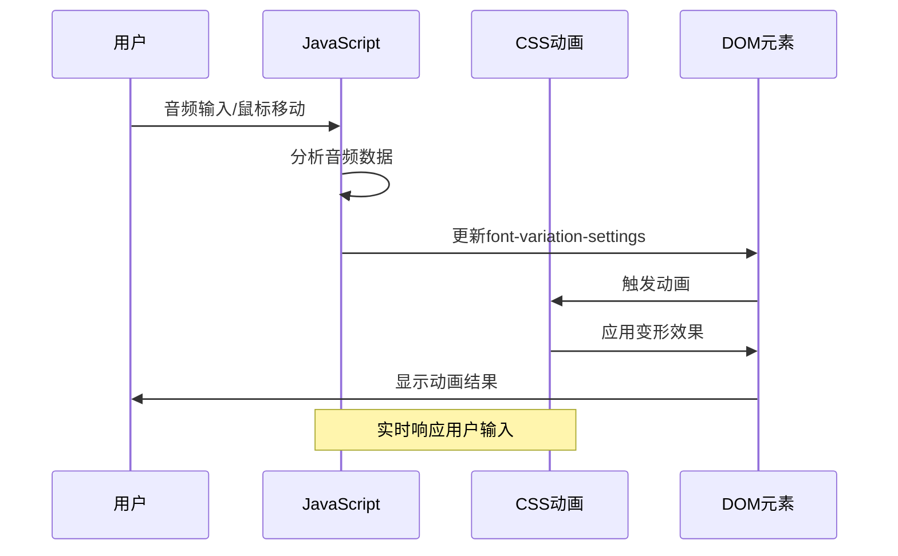

**图表来源**
- [script.js:301-426](file://js/script.js#L301-L426)
- [style.css:17-37](file://styles/style.css#L17-L37)

**章节来源**
- [style.css:1-1571](file://styles/style.css#L1-L1571)
- [script.js:1-1049](file://js/script.js#L1-L1049)

## 架构概览

### 样式模块化设计

系统采用模块化样式组织，每个功能区域都有独立的CSS文件：

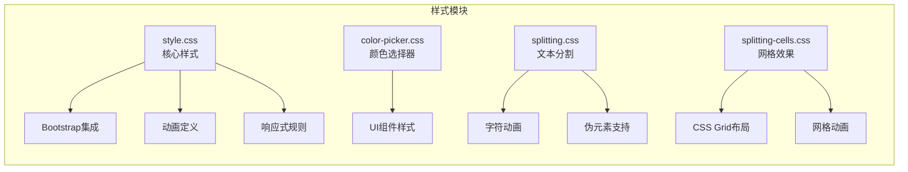

**图表来源**
- [style.css:851-865](file://styles/style.css#L851-L865)
- [color-picker.css:1-97](file://styles/color-picker.css#L1-L97)
- [splitting.css:1-67](file://styles/splitting.css#L1-L67)
- [splitting-cells.css:1-56](file://styles/splitting-cells.css#L1-L56)

### 组件关系图

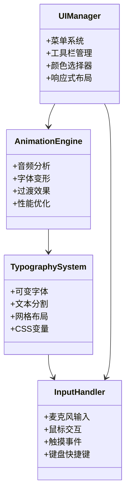

**图表来源**
- [script.js:15-121](file://js/script.js#L15-L121)
- [style.css:851-946](file://styles/style.css#L851-L946)

**章节来源**
- [index.html:1-282](file://index.html#L1-L282)
- [style.css:1-1571](file://styles/style.css#L1-L1571)
- [script.js:1-1049](file://js/script.js#L1-L1049)

## 详细组件分析

### 核心样式系统 (style.css)

#### 字体加载机制

系统通过 `@font-face` 规则实现字体加载，支持多种字体格式以确保兼容性：

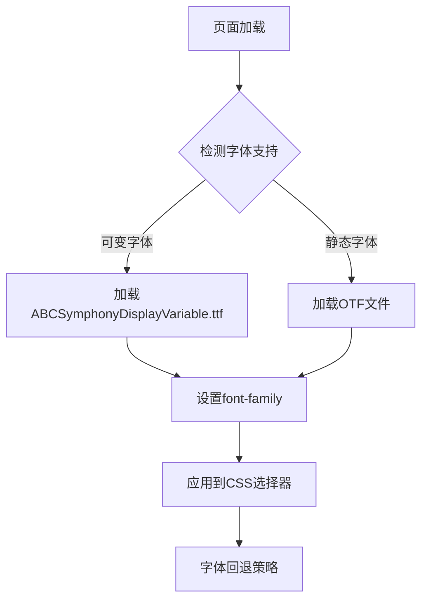

**图表来源**
- [style.css:1-15](file://styles/style.css#L1-L15)

#### 动画关键帧定义

系统实现了多个关键帧动画，用于不同的视觉效果：

| 动画名称 | 描述 | 使用场景 |
|---------|------|---------|
| fadein | 淡入效果 | 元素显示 |
| fadeout | 淡出效果 | 元素隐藏 |
| load-bounce-char | 加载动画 | LOADING文字 |
| bounce-char | 声音弹跳 | 音频驱动变形 |
| splashfade | 水花效果 | 页面过渡 |

**章节来源**
- [style.css:17-37](file://styles/style.css#L17-L37)
- [style.css:241-275](file://styles/style.css#L241-L275)
- [style.css:375-421](file://styles/style.css#L375-L421)

### 响应式设计策略

#### 断点管理系统

系统采用多级断点策略，针对不同屏幕尺寸优化布局：

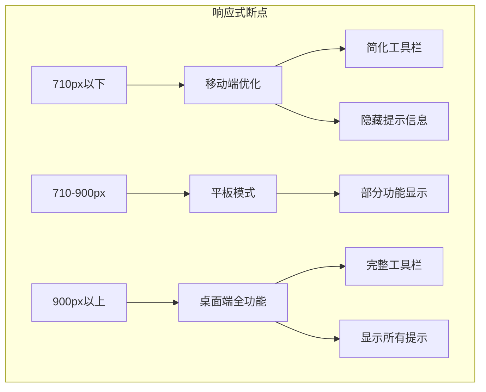

**图表来源**
- [style.css:981-1371](file://styles/style.css#L981-L1371)

#### 弹性布局实现

系统广泛使用Flexbox和CSS Grid实现响应式布局：

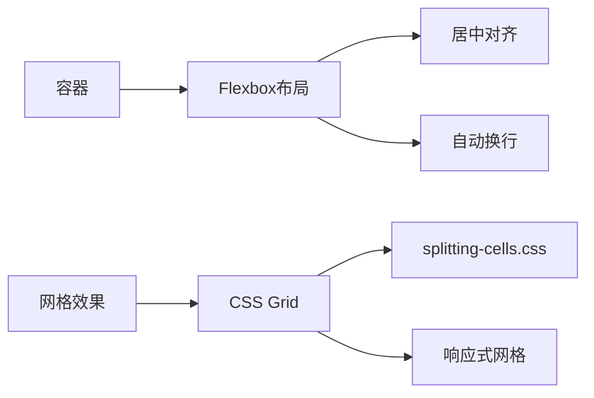

**图表来源**
- [style.css:65-92](file://styles/style.css#L65-L92)
- [splitting-cells.css:3-20](file://styles/splitting-cells.css#L3-L20)

**章节来源**
- [style.css:981-1571](file://styles/style.css#L981-L1571)
- [splitting-cells.css:1-56](file://styles/splitting-cells.css#L1-L56)

### 字体加载机制详解

#### 可变字体配置

系统使用可变字体实现动态效果，通过 `font-variation-settings` 控制字体参数：

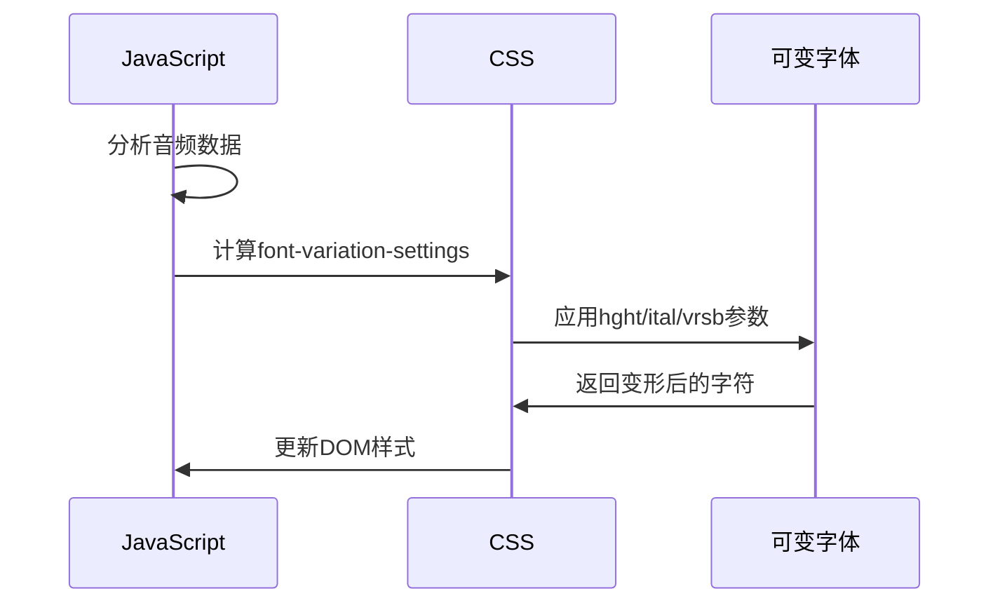

**图表来源**
- [script.js:409-416](file://js/script.js#L409-L416)
- [style.css:225](file://styles/style.css#L225)

#### 字体回退策略

系统实现了完整的字体回退机制，确保在字体加载失败时仍能正常显示：

**章节来源**
- [style.css:1-15](file://styles/style.css#L1-L15)
- [script.js:173-201](file://js/script.js#L173-L201)

### 样式定制指南

#### CSS变量使用

系统大量使用CSS变量实现主题定制：

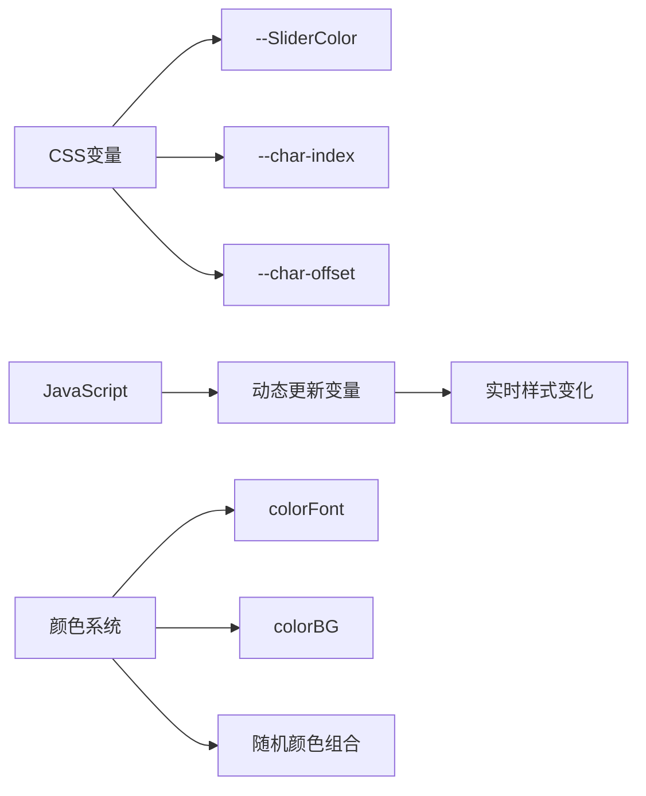

**图表来源**
- [style.css:123](file://styles/style.css#L123)
- [script.js:63-106](file://js/script.js#L63-L106)

#### 主题切换实现

系统支持动态主题切换，通过JavaScript更新CSS变量实现：

**章节来源**
- [script.js:931-960](file://js/script.js#L931-L960)
- [style.css:815-849](file://styles/style.css#L815-L849)

### 扩展方法

#### 新增样式模块

要添加新的样式模块，建议遵循以下步骤：

1. **创建独立CSS文件**：将新功能相关的样式分离到独立文件
2. **定义命名空间**：使用特定前缀避免冲突
3. **集成到HTML**：在 `index.html` 中引入新样式文件
4. **测试兼容性**：确保在不同设备上正常工作

#### 自定义动画效果

添加自定义动画效果的流程：

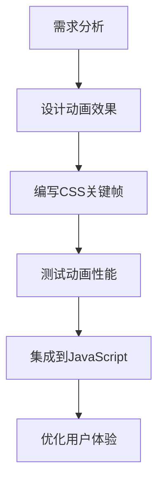

**图表来源**
- [style.css:17-37](file://styles/style.css#L17-L37)

**章节来源**
- [style.css:1-1571](file://styles/style.css#L1-L1571)
- [script.js:1-1049](file://js/script.js#L1-L1049)

## 依赖关系分析

### 样式文件依赖图

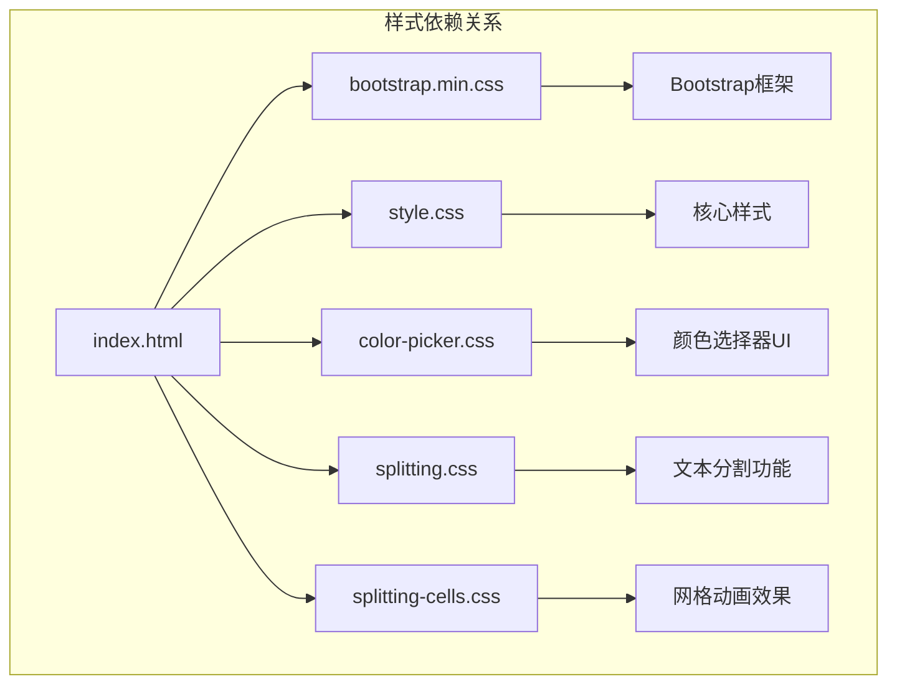

**图表来源**
- [index.html:7-13](file://index.html#L7-L13)

### JavaScript依赖关系

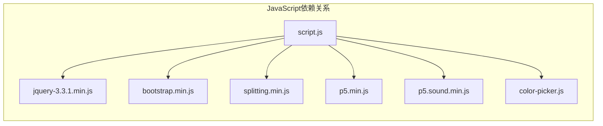

**图表来源**
- [index.html:254-261](file://index.html#L254-L261)

**章节来源**
- [index.html:1-282](file://index.html#L1-L282)
- [style.css:1-1571](file://styles/style.css#L1-L1571)
- [script.js:1-1049](file://js/script.js#L1-L1049)

## 性能考虑

### CSS性能优化技巧

系统采用了多项性能优化措施：

1. **硬件加速**：使用 `transform` 和 `opacity` 属性触发GPU加速
2. **动画优化**：避免使用会触发布局的属性（如 `width`、`height`）
3. **媒体查询优化**：合理使用断点减少不必要的样式计算
4. **字体优化**：使用可变字体减少字体文件数量

### JavaScript性能监控

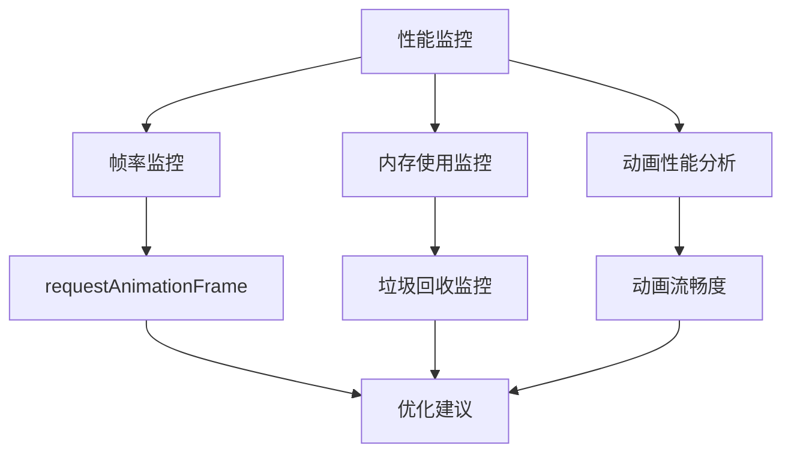

**图表来源**
- [script.js:178-201](file://js/script.js#L178-L201)

**章节来源**
- [style.css:141-162](file://styles/style.css#L141-L162)
- [script.js:301-426](file://js/script.js#L301-L426)

## 故障排除指南

### 常见问题诊断

#### 字体加载问题

**症状**：文字显示为方块或默认字体
**解决方案**：
1. 检查字体文件路径是否正确
2. 验证字体文件格式支持
3. 确认跨域字体加载设置

#### 动画性能问题

**症状**：动画卡顿或掉帧
**解决方案**：
1. 检查硬件加速是否启用
2. 优化关键帧动画复杂度
3. 减少重绘和重排操作

#### 响应式布局问题

**症状**：移动端显示异常
**解决方案**：
1. 检查视口设置
2. 验证媒体查询断点
3. 测试不同设备分辨率

**章节来源**
- [FONT-REPLACEMENT-GUIDE.md:245-263](file://FONT-REPLACEMENT-GUIDE.md#L245-L263)

### 调试工具和方法

#### 样式调试工具

1. **浏览器开发者工具**：检查CSS属性和计算样式
2. **性能面板**：监控动画性能和内存使用
3. **网络面板**：验证字体文件加载状态

#### 性能分析方法

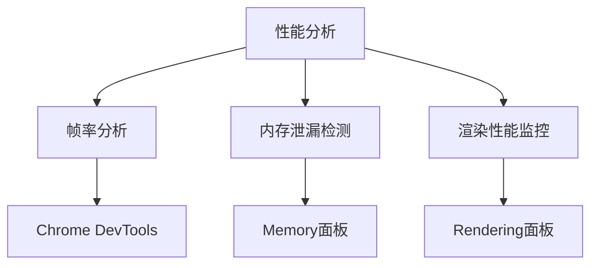

**图表来源**
- [script.js:1022-1037](file://js/script.js#L1022-L1037)

## 结论

MySymphosizer 的样式系统展现了现代Web开发的最佳实践，通过模块化设计、响应式架构和性能优化实现了卓越的用户体验。系统的核心优势包括：

1. **模块化架构**：清晰的样式分离和组件化设计
2. **响应式优先**：多层级断点策略适应各种设备
3. **性能优化**：硬件加速和动画优化确保流畅体验
4. **可扩展性**：良好的架构支持功能扩展和定制

该系统为类似的声音激活界面提供了优秀的参考模板，其设计理念和实现方法值得在其他项目中借鉴和应用。