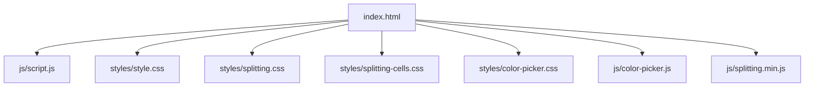
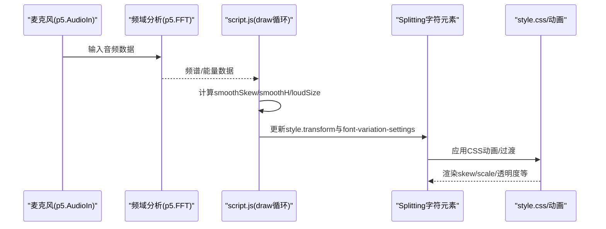
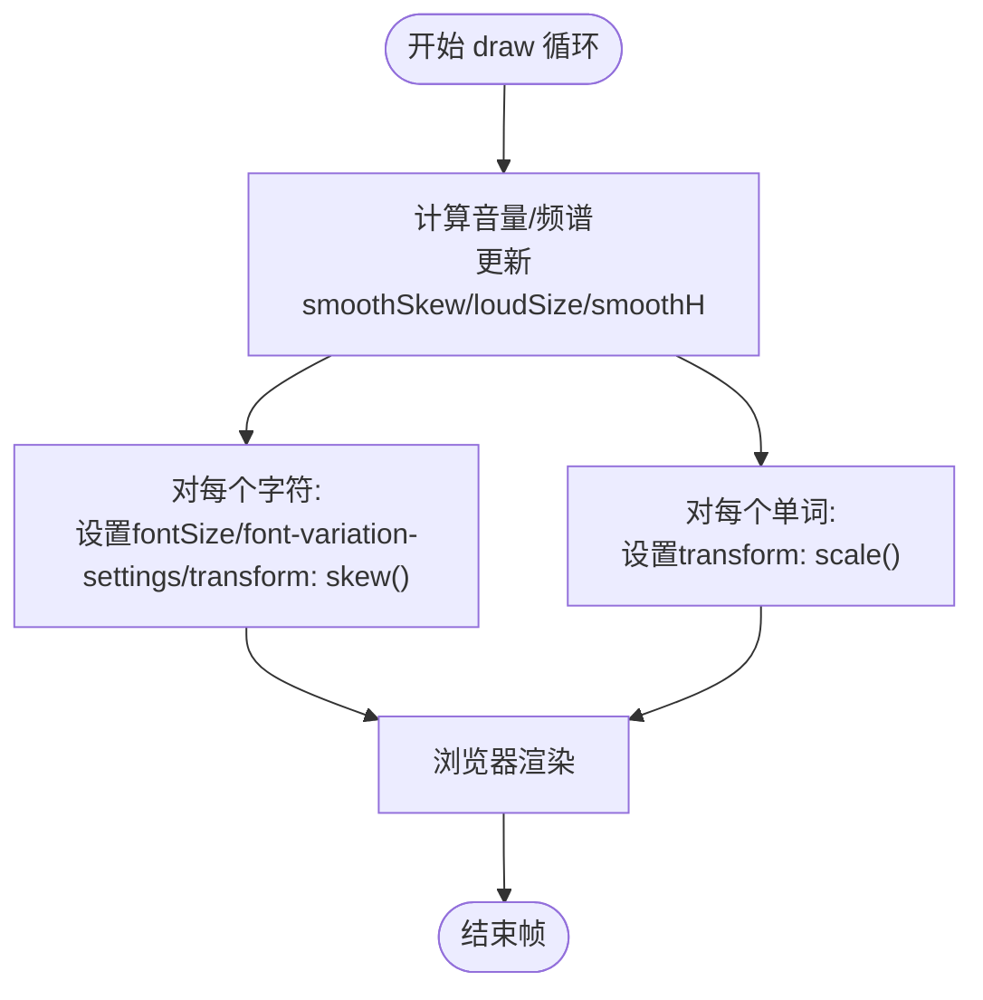
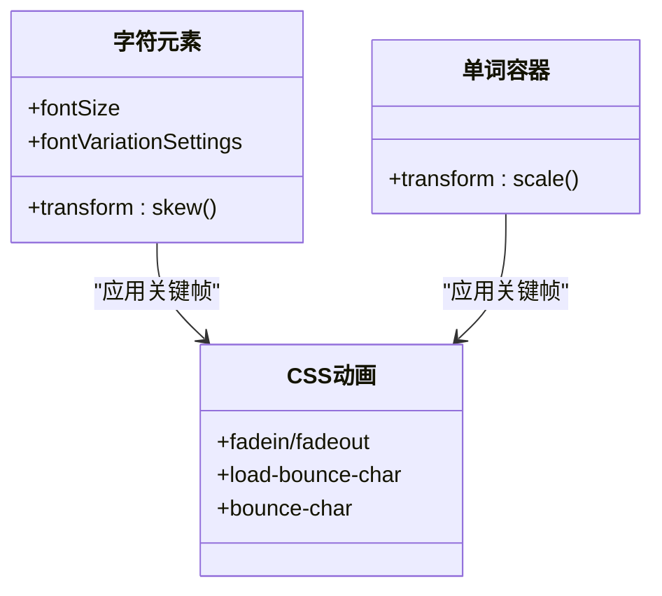
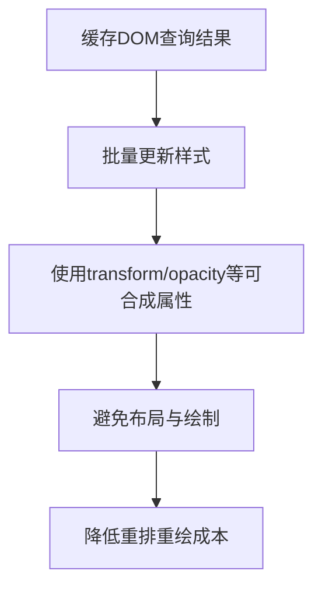
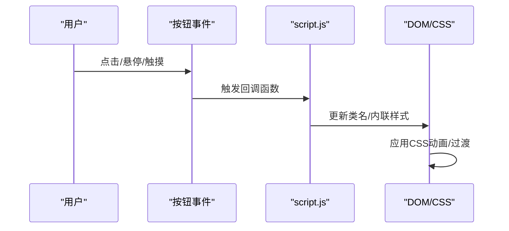
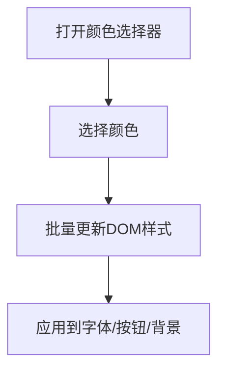
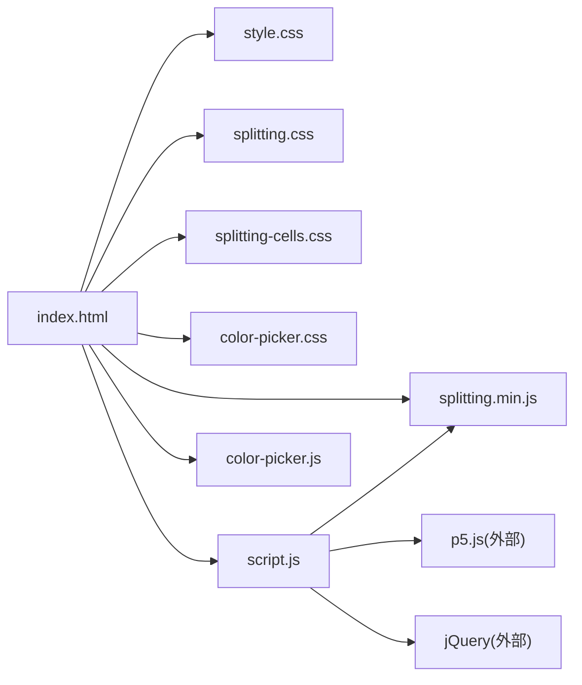

# CSS变换与动画

<cite>
**本文档引用的文件**
- [index.html](file://index.html)
- [script.js](file://js/script.js)
- [style.css](file://styles/style.css)
- [splitting.css](file://styles/splitting.css)
- [splitting-cells.css](file://styles/splitting-cells.css)
- [color-picker.css](file://styles/color-picker.css)
- [color-picker.js](file://js/color-picker.js)
- [splitting.min.js](file://js/splitting.min.js)
</cite>

## 目录
1. [简介](#简介)
2. [项目结构](#项目结构)
3. [核心组件](#核心组件)
4. [架构总览](#架构总览)
5. [详细组件分析](#详细组件分析)
6. [依赖关系分析](#依赖关系分析)
7. [性能考量](#性能考量)
8. [故障排查指南](#故障排查指南)
9. [结论](#结论)
10. [附录](#附录)

## 简介
本文件面向MySymphosizer的CSS变换与动画系统，系统性梳理了以下内容：
- CSS transform属性在字体渲染中的应用：skew扭曲、scale缩放、translate位移的实现原理与使用场景
- CSS动画性能优化策略：硬件加速、GPU渲染管线利用、帧率控制
- 实时CSS属性更新优化：CSSOM批量更新、减少重绘重排、DOM查询缓存
- 调试与性能监控：浏览器开发者工具使用、瓶颈识别、流畅度评估
- CSS变换与JavaScript协同：事件驱动的动画触发、状态同步

## 项目结构
该项目采用“HTML页面 + 多个CSS样式表 + 多个JS脚本”的模块化组织方式，核心交互由JavaScript驱动，CSS负责视觉表现与动画。

**图表来源**
- [index.html:1-282](file://index.html#L1-L282)
- [script.js:1-1049](file://js/script.js#L1-L1049)
- [style.css:1-800](file://styles/style.css#L1-L800)
- [splitting.css:1-67](file://styles/splitting.css#L1-L67)
- [splitting-cells.css:1-56](file://styles/splitting-cells.css#L1-L56)
- [color-picker.css:1-97](file://styles/color-picker.css#L1-L97)
- [color-picker.js:1-231](file://js/color-picker.js#L1-L231)
- [splitting.min.js:1-31](file://js/splitting.min.js#L1-L31)

**章节来源**
- [index.html:1-282](file://index.html#L1-L282)

## 核心组件
- 字体拆分与渲染：通过Splitting库对文本进行逐字拆分，配合CSS变量与动画实现字符级动态效果
- 音频驱动的动态类型：基于p5.js音频输入，将音量与频谱映射到字符的skew、scale与font-variation-settings
- 工具栏与颜色选择：通过按钮切换工具状态与颜色主题，实时更新CSS变量与DOM样式
- 动画与过渡：大量使用CSS keyframes与transition，结合JavaScript在draw循环中更新transform与font属性

**章节来源**
- [script.js:1-1049](file://js/script.js#L1-L1049)
- [style.css:1-800](file://styles/style.css#L1-L800)
- [splitting.css:1-67](file://styles/splitting.css#L1-L67)
- [splitting-cells.css:1-56](file://styles/splitting-cells.css#L1-L56)
- [color-picker.css:1-97](file://styles/color-picker.css#L1-L97)
- [color-picker.js:1-231](file://js/color-picker.js#L1-L231)
- [splitting.min.js:1-31](file://js/splitting.min.js#L1-L31)

## 架构总览
整体架构围绕“音频输入 → 数据处理 → DOM/CSS更新 → 视觉呈现”展开。JavaScript在每帧中计算字符的skew、scale与字体变化，直接写入DOM元素的style属性；CSS负责定义动画与过渡，形成流畅的视觉反馈。

**图表来源**
- [script.js:300-426](file://js/script.js#L300-L426)
- [style.css:170-240](file://styles/style.css#L170-L240)

## 详细组件分析

### 组件A：CSS transform在字体渲染中的应用
- skew扭曲变换
  - 实现：在每帧中将smoothSkew值写入每个字符的transform: skew()
  - 效果：字符在音量阈值触发后产生倾斜，营造动感
  - 参考路径：[script.js:408-416](file://js/script.js#L408-L416)
- scale缩放变换
  - 实现：将loudSize写入单词容器的transform: scale()
  - 效果：在极高音量时整体放大，增强冲击感
  - 参考路径：[script.js:418-421](file://js/script.js#L418-L421)
- translate位移变换
  - 实现：通过CSS定位与动画（如fadein/fadeout）实现位置与透明度变化
  - 效果：菜单、加载界面、提示信息的出现/消失
  - 参考路径：[style.css:17-55](file://styles/style.css#L17-L55), [style.css:310-332](file://styles/style.css#L310-L332)

**图表来源**
- [script.js:300-426](file://js/script.js#L300-L426)

**章节来源**
- [script.js:300-426](file://js/script.js#L300-L426)
- [style.css:170-240](file://styles/style.css#L170-L240)

### 组件B：CSS动画与过渡
- 关键帧动画
  - fadein/fadeout：用于模态框、加载屏、菜单的显隐
  - load-bounce-char/bounce-char：字符级弹跳/抖动效果
  - 参考路径：[style.css:17-55](file://styles/style.css#L17-L55), [style.css:241-275](file://styles/style.css#L241-L275), [style.css:375-421](file://styles/style.css#L375-L421)
- 过渡动画
  - transform-origin、transition-duration：控制旋转、滑入等过渡
  - 参考路径：[style.css:199-206](file://styles/style.css#L199-L206), [style.css:156-157](file://styles/style.css#L156-L157)

**图表来源**
- [style.css:170-240](file://styles/style.css#L170-L240)
- [style.css:241-275](file://styles/style.css#L241-L275)
- [style.css:375-421](file://styles/style.css#L375-L421)

**章节来源**
- [style.css:17-55](file://styles/style.css#L17-L55)
- [style.css:241-275](file://styles/style.css#L241-L275)
- [style.css:375-421](file://styles/style.css#L375-L421)

### 组件C：实时CSS属性更新优化
- CSSOM批量更新
  - 将多个字符或单词的样式更新合并到同一帧，避免多次DOM写入
  - 参考路径：[script.js:408-421](file://js/script.js#L408-L421)
- 减少重绘重排
  - 使用transform与opacity等可合成属性，尽量不触发布局与绘制
  - 参考路径：[style.css:199-206](file://styles/style.css#L199-L206)
- DOM查询缓存
  - 将常用DOM节点缓存在变量中，减少重复查询
  - 参考路径：[script.js:16-23](file://js/script.js#L16-L23), [script.js:428-435](file://js/script.js#L428-L435)

**图表来源**
- [script.js:16-23](file://js/script.js#L16-L23)
- [script.js:408-421](file://js/script.js#L408-L421)
- [style.css:199-206](file://styles/style.css#L199-L206)

**章节来源**
- [script.js:16-23](file://js/script.js#L16-L23)
- [script.js:408-421](file://js/script.js#L408-L421)
- [style.css:199-206](file://styles/style.css#L199-L206)

### 组件D：CSS变换与JavaScript协同
- 事件驱动的动画触发
  - 按钮点击、鼠标移动、触摸事件触发工具栏显隐、颜色切换、音量调节
  - 参考路径：[script.js:524-538](file://js/script.js#L524-L538), [script.js:1006-1012](file://js/script.js#L1006-L1012)
- 状态同步
  - 通过类名与内联样式的切换，保持UI状态与业务状态一致
  - 参考路径：[script.js:966-1003](file://js/script.js#L966-L1003), [color-picker.js:95-175](file://js/color-picker.js#L95-L175)

**图表来源**
- [script.js:524-538](file://js/script.js#L524-L538)
- [script.js:1006-1012](file://js/script.js#L1006-L1012)
- [script.js:966-1003](file://js/script.js#L966-L1003)
- [color-picker.js:95-175](file://js/color-picker.js#L95-L175)

**章节来源**
- [script.js:524-538](file://js/script.js#L524-L538)
- [script.js:1006-1012](file://js/script.js#L1006-L1012)
- [script.js:966-1003](file://js/script.js#L966-L1003)
- [color-picker.js:95-175](file://js/color-picker.js#L95-L175)

### 组件E：颜色选择器与主题切换
- 颜色选择器
  - 基于自定义UI与CSS，支持字体色与背景色切换
  - 参考路径：[color-picker.css:1-97](file://styles/color-picker.css#L1-L97), [color-picker.js:1-231](file://js/color-picker.js#L1-L231)
- 主题同步
  - 切换颜色后批量更新相关DOM的color/background/stroke等样式
  - 参考路径：[color-picker.js:95-175](file://js/color-picker.js#L95-L175)

**图表来源**
- [color-picker.css:1-97](file://styles/color-picker.css#L1-L97)
- [color-picker.js:95-175](file://js/color-picker.js#L95-L175)

**章节来源**
- [color-picker.css:1-97](file://styles/color-picker.css#L1-L97)
- [color-picker.js:1-231](file://js/color-picker.js#L1-L231)

## 依赖关系分析
- HTML依赖多个CSS与JS文件，其中style.css是主样式，splitting系列样式用于字符拆分与网格布局，color-picker.css用于颜色选择器UI
- JavaScript通过Splitting库操作DOM，通过p5.js进行音频处理，通过jQuery进行DOM选择与批量样式更新
- CSS动画与过渡依赖浏览器的合成层与GPU加速能力

**图表来源**
- [index.html:1-282](file://index.html#L1-L282)
- [script.js:1-1049](file://js/script.js#L1-L1049)
- [style.css:1-800](file://styles/style.css#L1-L800)
- [splitting.css:1-67](file://styles/splitting.css#L1-L67)
- [splitting-cells.css:1-56](file://styles/splitting-cells.css#L1-L56)
- [color-picker.css:1-97](file://styles/color-picker.css#L1-L97)
- [color-picker.js:1-231](file://js/color-picker.js#L1-L231)
- [splitting.min.js:1-31](file://js/splitting.min.js#L1-L31)

**章节来源**
- [index.html:1-282](file://index.html#L1-L282)
- [script.js:1-1049](file://js/script.js#L1-L1049)

## 性能考量
- 硬件加速与GPU渲染
  - 使用transform与opacity等可合成属性，避免触发强制同步布局与绘制
  - 参考路径：[style.css:199-206](file://styles/style.css#L199-L206)
- 帧率控制
  - 在setup中设置frameRate(60)，确保动画以稳定帧率运行
  - 参考路径：[script.js:182](file://js/script.js#L182)
- 批量更新与缓存
  - 缓存DOM查询结果，批量更新样式，减少重排重绘
  - 参考路径：[script.js:16-23](file://js/script.js#L16-L23), [script.js:408-421](file://js/script.js#L408-L421)
- 动画与过渡优化
  - 合理使用CSS keyframes与transition，避免复杂滤镜与阴影导致的GPU压力
  - 参考路径：[style.css:17-55](file://styles/style.css#L17-L55), [style.css:241-275](file://styles/style.css#L241-L275)

**章节来源**
- [script.js:182](file://js/script.js#L182)
- [script.js:16-23](file://js/script.js#L16-L23)
- [script.js:408-421](file://js/script.js#L408-L421)
- [style.css:17-55](file://styles/style.css#L17-L55)
- [style.css:241-275](file://styles/style.css#L241-L275)
- [style.css:199-206](file://styles/style.css#L199-L206)

## 故障排查指南
- 动画卡顿
  - 检查是否频繁修改布局相关属性（如width/height/left/top），改用transform与opacity
  - 参考路径：[style.css:199-206](file://styles/style.css#L199-L206)
- 颜色选择器无效
  - 确认color-picker.js的事件绑定与DOM结构匹配，检查active/disabled类的切换逻辑
  - 参考路径：[color-picker.js:95-175](file://js/color-picker.js#L95-L175)
- 音频无响应
  - 确认startAudio已调用且p5.AudioIn初始化成功，检查mic.start()与FFT输入链路
  - 参考路径：[script.js:923-929](file://js/script.js#L923-L929)
- 文本拆分异常
  - 检查Splitting初始化与target选择器，确认data-splitting属性正确
  - 参考路径：[script.js:239-242](file://js/script.js#L239-L242), [splitting.min.js:1-31](file://js/splitting.min.js#L1-L31)

**章节来源**
- [style.css:199-206](file://styles/style.css#L199-L206)
- [color-picker.js:95-175](file://js/color-picker.js#L95-L175)
- [script.js:923-929](file://js/script.js#L923-L929)
- [script.js:239-242](file://js/script.js#L239-L242)
- [splitting.min.js:1-31](file://js/splitting.min.js#L1-L31)

## 结论
MySymphosizer通过“音频驱动 + 字符级CSS变换 + 批量DOM更新”的组合，实现了高帧率、低开销的动态字体动画。其关键在于：
- 使用transform与opacity等可合成属性，最大化利用GPU加速
- 在draw循环中进行批量样式更新，减少重排重绘
- 通过CSS keyframes与transition实现平滑的显隐与弹跳效果
- 通过Splitting与p5.js实现字符级与频域级的精确控制

## 附录
- 开发者工具建议
  - 使用Performance面板记录每帧耗时，关注脚本执行时间与渲染时间
  - 使用Layers/Rendering面板查看合成层与GPU使用情况
  - 使用FPS Meter与Rendering面板的GPU刷新线程监控帧率稳定性
- 评估标准
  - 目标帧率：60fps
  - 可接受抖动：单帧超过16.7ms的丢帧不超过1%
  - 合成层：尽量保持transform/opacity相关的合成层，避免布局与绘制