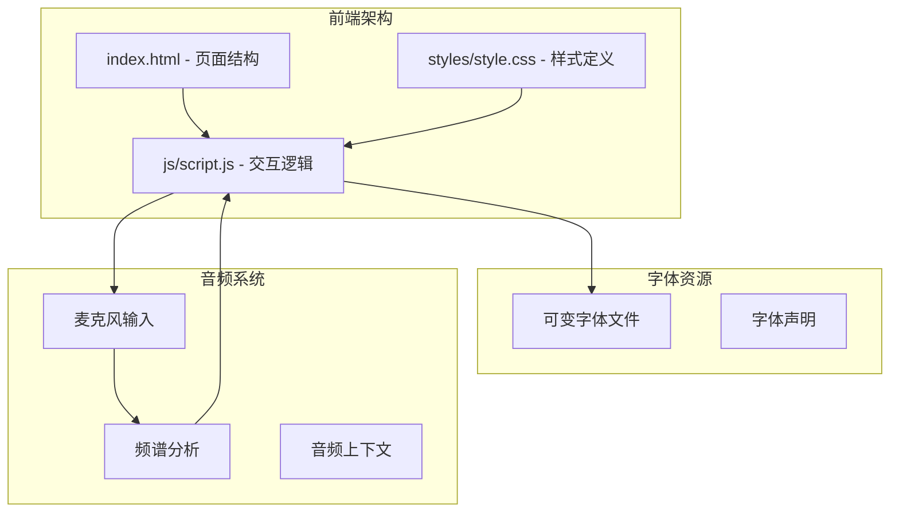
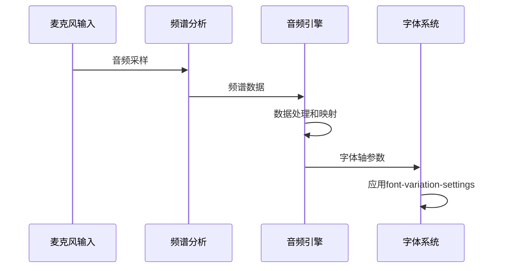
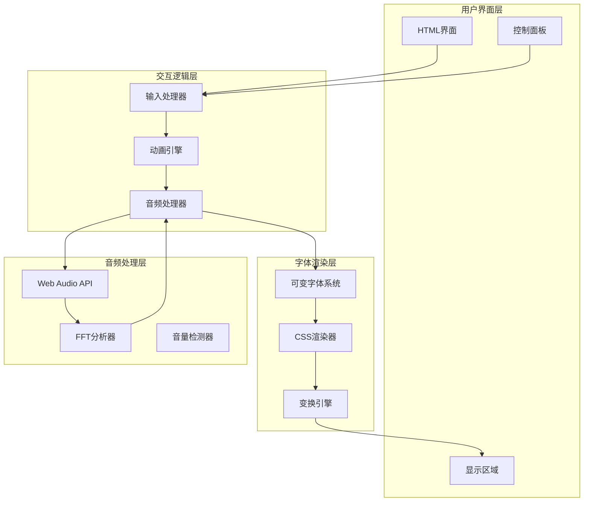
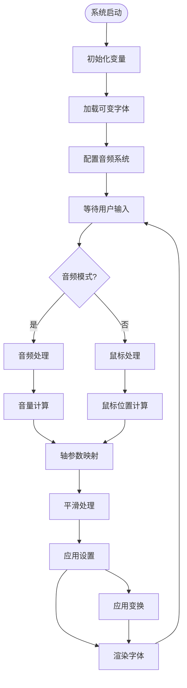
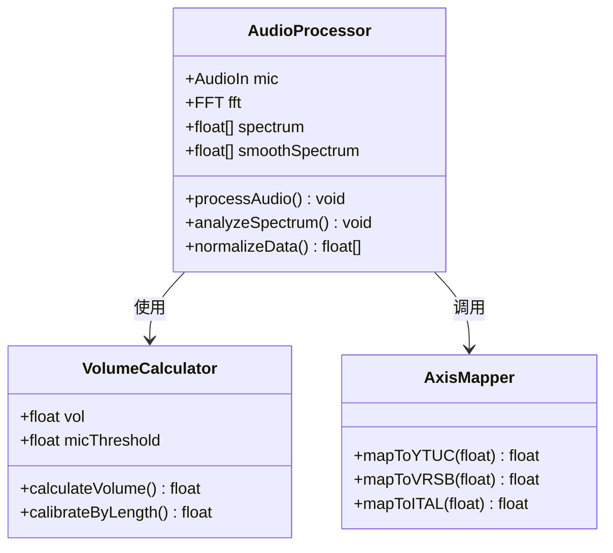
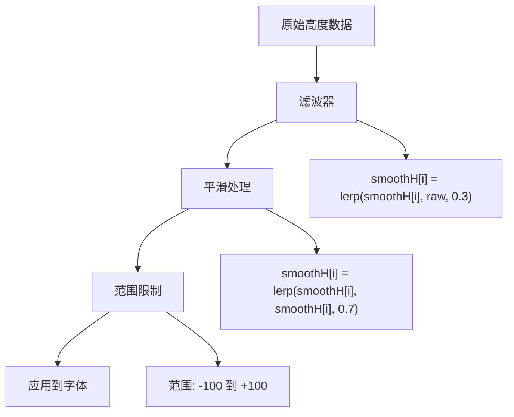
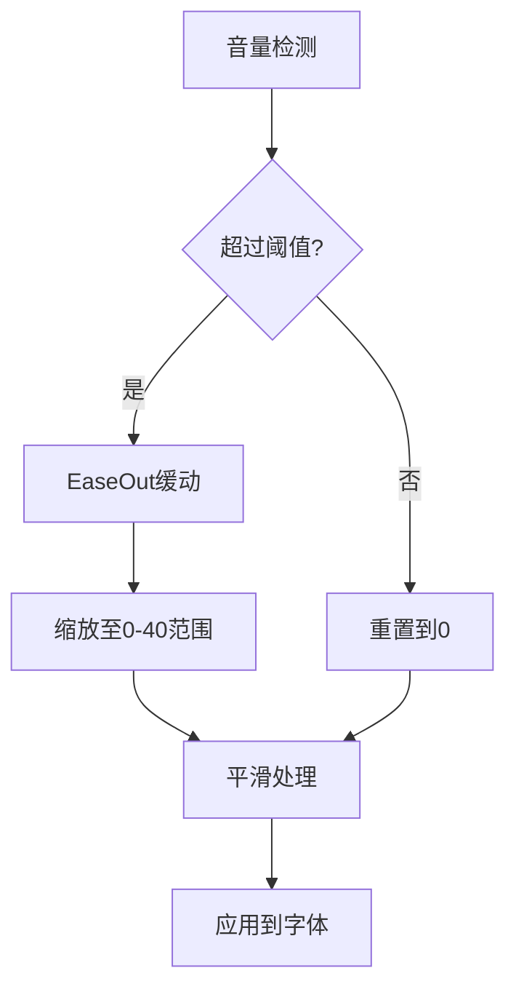
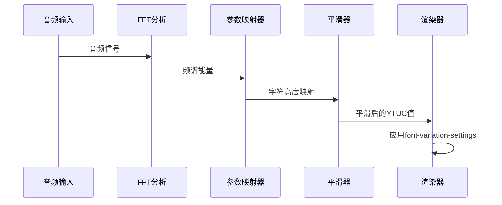

# 可变字体系统

<cite>
**本文档引用的文件**
- [index.html](file://index.html)
- [script.js](file://js/script.js)
- [style.css](file://styles/style.css)
- [FONT-REPLACEMENT-GUIDE.md](file://FONT-REPLACEMENT-GUIDE.md)
</cite>

## 目录
1. [简介](#简介)
2. [项目结构](#项目结构)
3. [核心组件](#核心组件)
4. [架构概览](#架构概览)
5. [详细组件分析](#详细组件分析)
6. [依赖关系分析](#依赖关系分析)
7. [性能考虑](#性能考虑)
8. [故障排除指南](#故障排除指南)
9. [结论](#结论)

## 简介

MySymphosizer是一个创新的可变字体系统，通过音频驱动实现动态排版效果。该系统利用可变字体技术，结合Web Audio API和CSS动画，创造出随声音变化而实时响应的文字变形效果。

该项目的核心特色在于其独特的字体轴参数控制系统，包括YTUC（高度轴）、vrsb（反转轴）和ital（倾斜轴）的实时调节机制。系统能够将音频频谱数据转换为视觉字体参数，实现从声音到字体变形的完整转换流程。

## 项目结构

MySymphosizer项目采用模块化的前端架构，主要包含以下核心组件：



**图表来源**
- [index.html:1-282](file://index.html#L1-L282)
- [script.js:1-1049](file://js/script.js#L1-L1049)
- [style.css:1-1573](file://styles/style.css#L1-L1573)

**章节来源**
- [index.html:1-282](file://index.html#L1-L282)
- [script.js:166-201](file://js/script.js#L166-L201)

## 核心组件

### 可变字体轴参数系统

MySymphosizer使用三个核心字体轴参数来实现动态效果：

| 轴标签 | 参数名 | 范围 | 作用机制 |
|--------|--------|------|----------|
| YTUC | Height | 约 -100 ~ +100 | 控制字形高度比例，核心动画参数 |
| vrsb | Reverse | 0 ~ 1 | 控制文字方向/翻转，实现顶部显示模式切换 |
| ital | Italic | 0 ~ 约 40 | 控制倾斜程度，配合音量动态调整 |

### 音频驱动引擎

系统通过Web Audio API实现音频到字体参数的实时转换：



**图表来源**
- [script.js:923-929](file://js/script.js#L923-L929)
- [script.js:360-365](file://js/script.js#L360-L365)

**章节来源**
- [script.js:1-50](file://js/script.js#L1-L50)
- [style.css:1-20](file://styles/style.css#L1-L20)

## 架构概览

### 整体系统架构



**图表来源**
- [script.js:301-426](file://js/script.js#L301-L426)
- [script.js:923-929](file://js/script.js#L923-L929)

### 字体轴参数控制流



**图表来源**
- [script.js:316-416](file://js/script.js#L316-L416)
- [script.js:360-387](file://js/script.js#L360-L387)

**章节来源**
- [script.js:301-426](file://js/script.js#L301-L426)

## 详细组件分析

### 音频驱动系统

#### 音频采集和处理

系统使用p5.js的AudioIn类进行音频采集，通过FFT分析器获取频谱数据：



**图表来源**
- [script.js:1-15](file://js/script.js#L1-L15)
- [script.js:923-929](file://js/script.js#L923-L929)

#### 平滑处理算法

系统实现了多层平滑处理来确保字体变形的流畅性：

**章节来源**
- [script.js:29-48](file://js/script.js#L29-L48)

### 实时控制算法

#### smoothH高度轴平滑处理

高度轴的平滑处理采用了指数移动平均算法：



**图表来源**
- [script.js:381-382](file://js/script.js#L381-L382)
- [script.js:409-415](file://js/script.js#L409-L415)

#### smoothI倾斜轴计算逻辑

倾斜轴的计算基于音量检测和缓动函数：



**图表来源**
- [script.js:344-349](file://js/script.js#L344-L349)
- [script.js:1023-1033](file://js/script.js#L1023-L1033)

#### isTop顶部显示模式切换机制

顶部显示模式通过vrsb轴参数实现：

**章节来源**
- [script.js:61-61](file://js/script.js#L61-L61)
- [script.js:681-693](file://js/script.js#L681-L693)

### 音频驱动动态响应原理

#### 频谱数据到字体参数映射

系统将音频频谱数据转换为字体轴参数的关键流程：



**图表来源**
- [script.js:360-387](file://js/script.js#L360-L387)
- [script.js:410-415](file://js/script.js#L410-L415)

#### 音量检测和校准

系统实现了基于字符长度的音量校准机制：

**章节来源**
- [script.js:316-342](file://js/script.js#L316-L342)

## 依赖关系分析

### 字体系统依赖

```mermaid
graph TB
subgraph "字体声明"
CSSFonts[styles/style.css]
VFFile[可变字体文件]
end
subgraph "JavaScript控制"
Script[script.js]
Splitting[Splitting库]
P5JS[p5.js]
end
subgraph "CSS动画"
Keyframes[@keyframes规则]
Transforms[CSS变换]
end
CSSFonts --> VFFile
Script --> CSSFonts
Script --> Splitting
Script --> P5JS
CSSFonts --> Keyframes
CSSFonts --> Transforms
Script --> Keyframes
```

**图表来源**
- [style.css:1-15](file://styles/style.css#L1-L15)
- [script.js:173-201](file://js/script.js#L173-L201)

### 音频系统集成

系统集成了多个音频处理组件：

**章节来源**
- [script.js:923-929](file://js/script.js#L923-L929)
- [script.js:1006-1012](file://js/script.js#L1006-L1012)

## 性能考虑

### 优化策略

#### 帧率管理
- 固定60fps帧率，确保动画流畅性
- 使用lerp函数实现平滑插值，避免突变

#### 内存优化
- 预分配数组空间，减少动态内存分配
- 合理使用变量作用域，避免内存泄漏

#### 计算优化
- 使用map函数进行范围映射，提高计算效率
- 缓存计算结果，避免重复计算

### 最佳实践建议

#### 参数范围限制
- YTUC轴范围：-100到+100
- ital轴范围：0到约40
- vrsb轴范围：0或1

#### 动画缓动函数应用
- EaseOut函数用于平滑音量响应
- lerp函数用于平滑参数过渡
- constrain函数用于边界保护

**章节来源**
- [script.js:1023-1037](file://js/script.js#L1023-L1037)
- [style.css:225](file://styles/style.css#L225)

## 故障排除指南

### 常见问题和解决方案

#### 麦克风权限问题
- 确保HTTPS环境
- 检查浏览器权限设置
- 验证音频设备连接

#### 字体加载失败
- 检查字体文件路径
- 验证字体格式兼容性
- 确认字体文件完整性

#### 音频处理异常
- 检查音频上下文状态
- 验证FFT分析器配置
- 确认音频输入源可用

### 调试技巧

#### 开发者工具使用
- 使用浏览器开发者工具监控音频数据
- 检查CSS变量和font-variation-settings
- 监控性能指标和帧率

#### 错误处理
- 实现try-catch块处理异常
- 添加日志输出便于调试
- 提供降级方案保证基本功能

**章节来源**
- [script.js:384-386](file://js/script.js#L384-L386)
- [script.js:413-415](file://js/script.js#L413-L415)

## 结论

MySymphosizer的可变字体系统展现了现代Web技术在创意表达方面的巨大潜力。通过巧妙地结合音频处理、字体技术和动画系统，实现了从声音到视觉的无缝转换。

该系统的主要优势包括：
- 实时音频驱动的动态效果
- 精确的字体轴参数控制
- 流畅的动画过渡效果
- 良好的跨平台兼容性

未来可以进一步优化的方向包括：
- 增强移动端性能表现
- 扩展更多字体轴参数支持
- 提供更丰富的用户自定义选项
- 优化内存使用和计算效率

这个项目为可变字体技术的实际应用提供了优秀的参考案例，展示了如何将复杂的音频处理算法与字体渲染技术有机结合，创造出独特的用户体验。