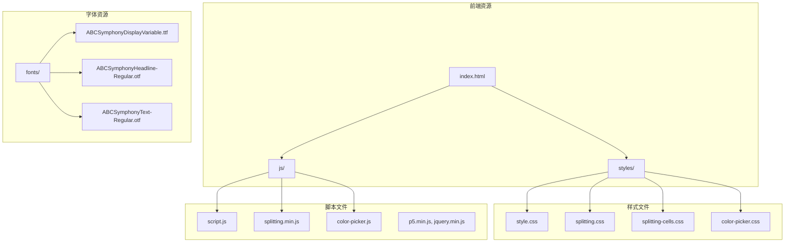
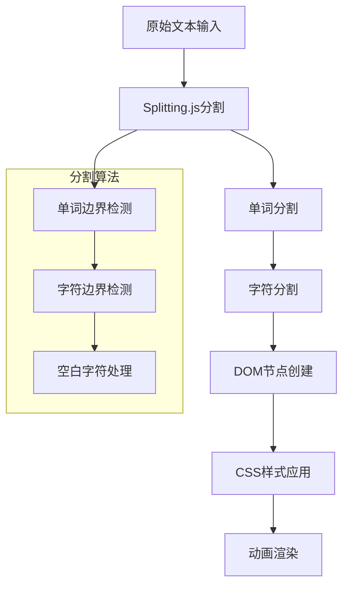
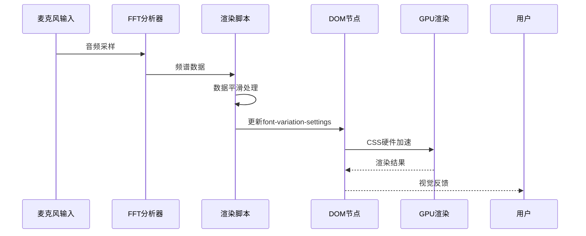
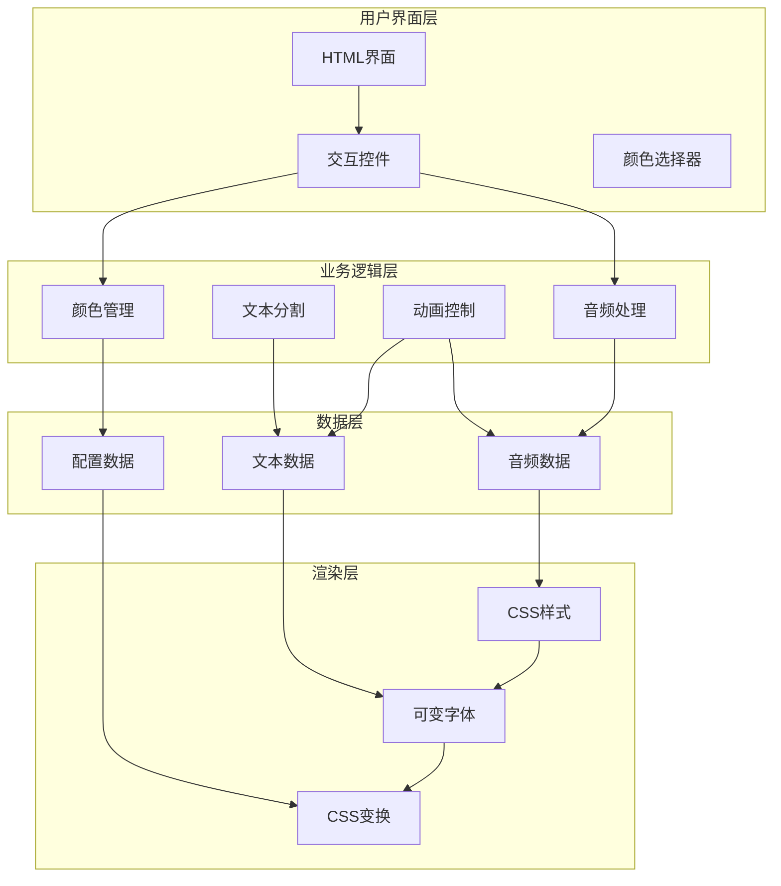
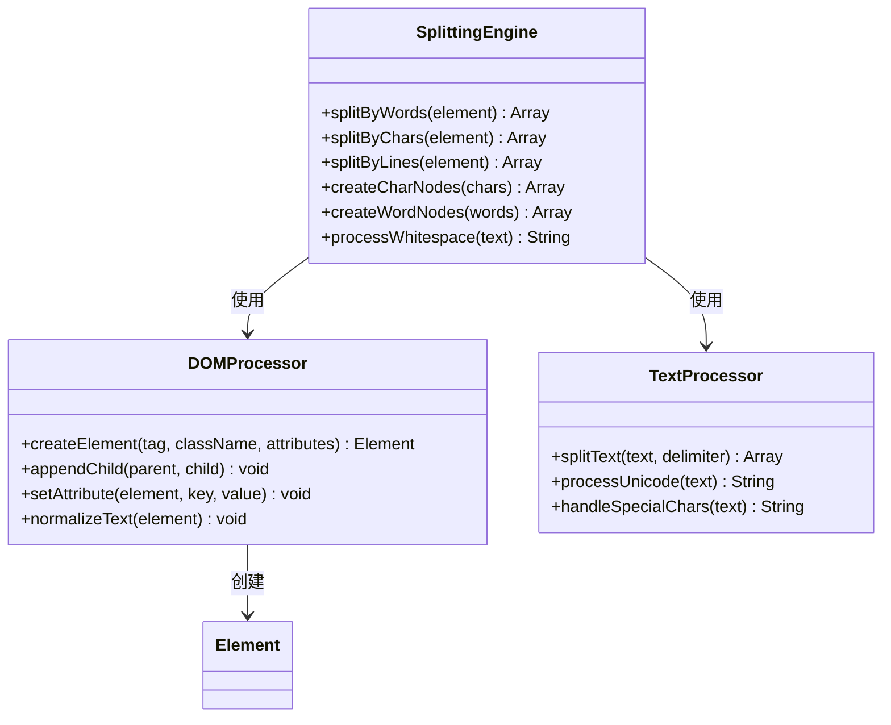
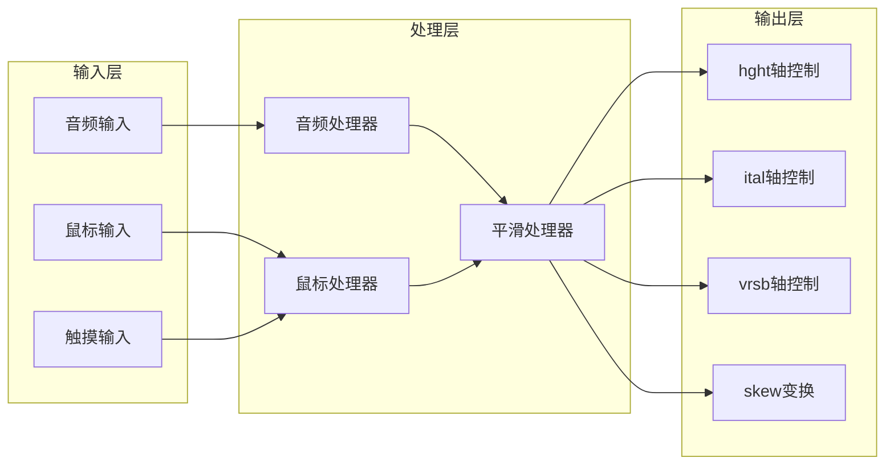
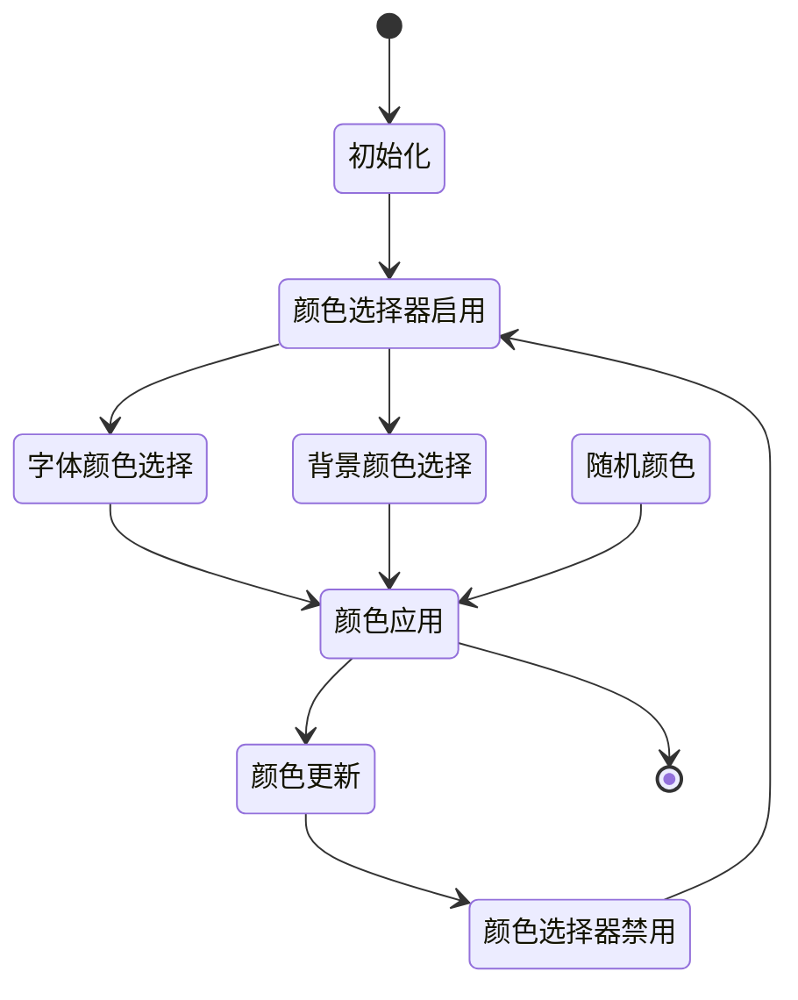
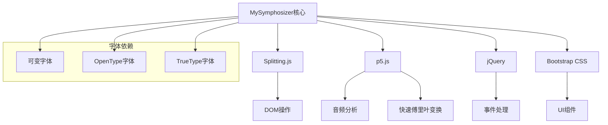
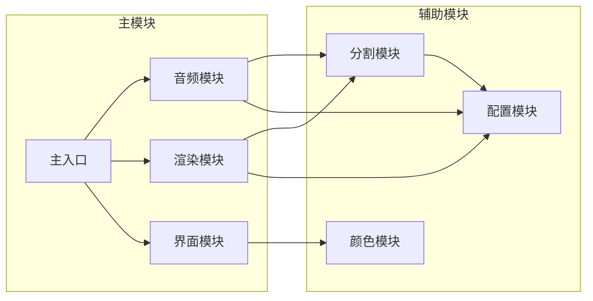
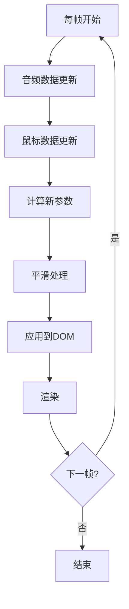

# 字体渲染引擎

<cite>
**本文档引用的文件**
- [index.html](file://index.html)
- [script.js](file://js/script.js)
- [splitting.min.js](file://js/splitting.min.js)
- [style.css](file://styles/style.css)
- [splitting.css](file://styles/splitting.css)
- [splitting-cells.css](file://styles/splitting-cells.css)
- [color-picker.js](file://js/color-picker.js)
- [FONT-REPLACEMENT-GUIDE.md](file://FONT-REPLACEMENT-GUIDE.md)
</cite>

## 目录
1. [简介](#简介)
2. [项目结构](#项目结构)
3. [核心组件](#核心组件)
4. [架构概览](#架构概览)
5. [详细组件分析](#详细组件分析)
6. [依赖关系分析](#依赖关系分析)
7. [性能考虑](#性能考虑)
8. [故障排除指南](#故障排除指南)
9. [结论](#结论)

## 简介

MySymphosizer是一个创新的可变字体渲染引擎，它将音频输入与动态字体变形技术相结合，创造出独特的"声音激活的排版乐器"体验。该系统通过Splitting.js实现字符级文本分割，结合CSS可变字体轴参数控制和JavaScript实时动画，实现了从音频数据到视觉字体效果的完整转换管道。

该项目的核心特色包括：
- **可变字体系统**：支持hght高度轴、ital倾斜轴、vrsb可变轴的实时控制
- **字符级分割技术**：基于Splitting.js的高效文本分解算法
- **音频驱动渲染**：利用p5.js音频分析实现声音可视化
- **高性能动画**：通过CSS硬件加速和优化的DOM操作实现流畅动画

## 项目结构

MySymphosizer采用模块化的文件组织结构，将功能清晰分离：



**图表来源**
- [index.html:1-282](file://index.html#L1-L282)
- [style.css:1-1571](file://styles/style.css#L1-L1571)

**章节来源**
- [index.html:1-282](file://index.html#L1-L282)
- [style.css:1-200](file://styles/style.css#L1-L200)

## 核心组件

### 可变字体系统

MySymphosizer的核心在于其可变字体渲染系统，该系统支持三个主要轴参数：

| 轴参数 | 轴标签 | 范围 | 功能描述 |
|--------|--------|------|----------|
| 高度轴 | `hght` | -100 ~ +100 | 控制字形高度比例，实现垂直拉伸和压缩效果 |
| 倾斜轴 | `ital` | 0 ~ 40 | 控制字形倾斜角度，模拟手写笔触效果 |
| 反转轴 | `vrsb` | 0 ~ 1 | 控制文字方向/翻转，实现镜像效果 |

### Splitting.js字符分割引擎

系统使用Splitting.js实现高效的字符级文本处理：



**图表来源**
- [splitting.min.js:1-31](file://js/splitting.min.js#L1-L31)
- [script.js:238-281](file://js/script.js#L238-L281)

### 音频驱动渲染管道

系统通过p5.js实现音频分析和可视化：



**图表来源**
- [script.js:923-929](file://js/script.js#L923-L929)
- [script.js:301-426](file://js/script.js#L301-L426)

**章节来源**
- [script.js:15-52](file://js/script.js#L15-L52)
- [style.css:13-23](file://styles/style.css#L13-L23)
- [splitting.min.js:16-29](file://js/splitting.min.js#L16-L29)

## 架构概览

MySymphosizer采用分层架构设计，确保各组件间的松耦合和高内聚：



**图表来源**
- [index.html:22-252](file://index.html#L22-L252)
- [script.js:178-201](file://js/script.js#L178-L201)
- [color-picker.js:1-231](file://js/color-picker.js#L1-L231)

## 详细组件分析

### 字符分割组件

Splitting.js提供了强大的文本分割能力，支持多种分割模式：

#### 分割算法实现



**图表来源**
- [splitting.min.js:3-29](file://js/splitting.min.js#L3-L29)

#### 字符单元管理

每个分割后的字符都会被包装成独立的DOM节点：

| 属性 | 描述 | 默认值 |
|------|------|--------|
| `data-char` | 原始字符内容 | 空字符串 |
| `data-char-index` | 字符在单词中的索引 | 0 |
| `data-word-index` | 单词在文本中的索引 | 0 |
| `data-line-index` | 行在文本中的索引 | 0 |
| `data-total-chars` | 总字符数 | 0 |
| `data-total-words` | 总单词数 | 0 |
| `data-total-lines` | 总行数 | 0 |

**章节来源**
- [splitting.min.js:16-29](file://js/splitting.min.js#L16-L29)
- [splitting.css:28-66](file://styles/splitting.css#L28-L66)

### 可变字体渲染引擎

#### 字体轴参数控制系统



**图表来源**
- [script.js:301-426](file://js/script.js#L301-L426)
- [style.css:241-275](file://styles/style.css#L241-L275)

#### 实时参数控制机制

系统实现了多层参数控制机制：

1. **音频驱动参数** (`smoothH[i]`)
   - 基于频谱能量的动态高度控制
   - 支持音量阈值和灵敏度调节
   - 实现平滑过渡效果

2. **鼠标驱动参数** (`smoothI`, `smoothSkew`)
   - 基于鼠标位置的倾斜和扭曲控制
   - 支持空间距离感应
   - 实现局部交互效果

3. **全局参数** (`isTop`, `loudSize`)
   - 文字顶部对齐控制
   - 整体缩放级别
   - 颜色主题切换

**章节来源**
- [script.js:316-426](file://js/script.js#L316-L426)
- [style.css:225](file://styles/style.css#L225)

### 颜色管理系统

系统提供了灵活的颜色管理功能：



**图表来源**
- [color-picker.js:1-231](file://js/color-picker.js#L1-L231)
- [script.js:931-960](file://js/script.js#L931-L960)

**章节来源**
- [color-picker.js:1-231](file://js/color-picker.js#L1-L231)
- [script.js:63-106](file://js/script.js#L63-L106)

## 依赖关系分析

### 外部库依赖

MySymphosizer依赖于多个关键库来实现其功能：



**图表来源**
- [index.html:15-261](file://index.html#L15-L261)
- [script.js:178-201](file://js/script.js#L178-L201)

### 内部模块依赖



**图表来源**
- [script.js:178-201](file://js/script.js#L178-L201)
- [color-picker.js:1-231](file://js/color-picker.js#L1-L231)

**章节来源**
- [index.html:15-261](file://index.html#L15-L261)
- [script.js:178-201](file://js/script.js#L178-L201)

## 性能考虑

### CSS硬件加速优化

系统充分利用现代浏览器的硬件加速能力：

1. **变换属性优化**
   - 使用 `transform` 属性而非改变布局属性
   - 利用 `will-change` 提示浏览器优化
   - 避免强制同步布局

2. **合成层管理**
   - 合理使用 `transform3d` 触发GPU加速
   - 避免不必要的重绘和回流
   - 优化CSS选择器复杂度

### 动画帧率控制



**图表来源**
- [script.js:183](file://js/script.js#L183)
- [script.js:301-426](file://js/script.js#L301-L426)

### DOM操作优化策略

1. **批量DOM更新**
   - 合并多个样式变更
   - 使用 `requestAnimationFrame`
   - 避免频繁的DOM查询

2. **内存管理**
   - 及时清理事件监听器
   - 释放不再使用的对象
   - 监控内存使用情况

3. **渲染优化**
   - 使用CSS变量减少重排
   - 避免强制同步布局
   - 优化选择器性能

**章节来源**
- [script.js:183](file://js/script.js#L183)
- [script.js:408-421](file://js/script.js#L408-L421)

## 故障排除指南

### 常见问题诊断

#### 字体加载问题

**症状**：页面显示为默认字体而非自定义字体

**解决方案**：
1. 检查字体文件路径是否正确
2. 验证字体文件格式兼容性
3. 确认跨域字体加载权限

#### 可变字体轴不生效

**症状**：`font-variation-settings` 属性无效

**解决方案**：
1. 验证字体确实支持目标轴参数
2. 检查轴参数范围是否在有效范围内
3. 确认CSS语法正确

#### 动画卡顿问题

**症状**：页面动画不流畅

**解决方案**：
1. 检查是否有过多DOM元素同时更新
2. 验证是否使用了硬件加速属性
3. 优化CSS选择器性能

### 调试技巧

#### 开发者工具使用

1. **性能分析**
   - 使用Chrome DevTools的Performance面板
   - 监控FPS和内存使用
   - 识别性能瓶颈

2. **网络监控**
   - 检查字体文件加载状态
   - 监控网络延迟和带宽
   - 验证缓存策略

3. **样式检查**
   - 使用Elements面板检查CSS属性
   - 验证font-variation-settings应用
   - 检查变换矩阵

#### 日志记录

系统提供了完善的错误处理机制：

```javascript
try {
    // 字体参数设置
    splitChars[wornum].chars[i].style.fontVariationSettings = 
        "'vrsb'" + isTop + ", 'YTUC'" + smoothH[i] + ", 'ital'" + smoothI + '';
} catch (err) {
    console.error("splitChars :" + err.message);
}
```

**章节来源**
- [script.js:413-415](file://js/script.js#L413-L415)
- [FONT-REPLACEMENT-GUIDE.md:245-263](file://FONT-REPLACEMENT-GUIDE.md#L245-L263)

### 最佳实践建议

1. **字体选择**
   - 优先选择支持多轴的可变字体
   - 确保字体文件大小适中
   - 考虑字体的跨平台兼容性

2. **性能优化**
   - 使用CSS硬件加速属性
   - 避免频繁的DOM操作
   - 实现适当的节流和防抖

3. **用户体验**
   - 提供字体加载状态指示
   - 实现渐进式增强
   - 考虑低性能设备的降级方案

## 结论

MySymphosizer的字体渲染引擎展现了现代Web技术的强大能力，通过巧妙地结合可变字体、字符分割技术和音频分析，创造出了独特的交互体验。该系统的设计体现了以下关键优势：

1. **技术创新性**：将音频输入与字体变形完美融合
2. **性能优化**：充分利用硬件加速和现代浏览器特性
3. **扩展性**：模块化设计便于功能扩展和定制
4. **用户体验**：直观的交互界面和流畅的动画效果

该引擎为Web字体渲染提供了新的思路和实现方案，展示了可变字体在创意Web应用中的巨大潜力。通过持续的优化和改进，这个系统有望成为Web字体技术发展的里程碑。