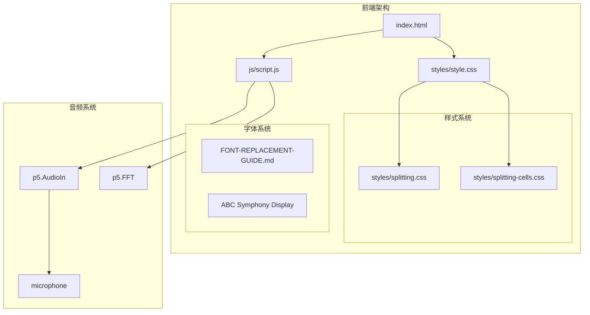
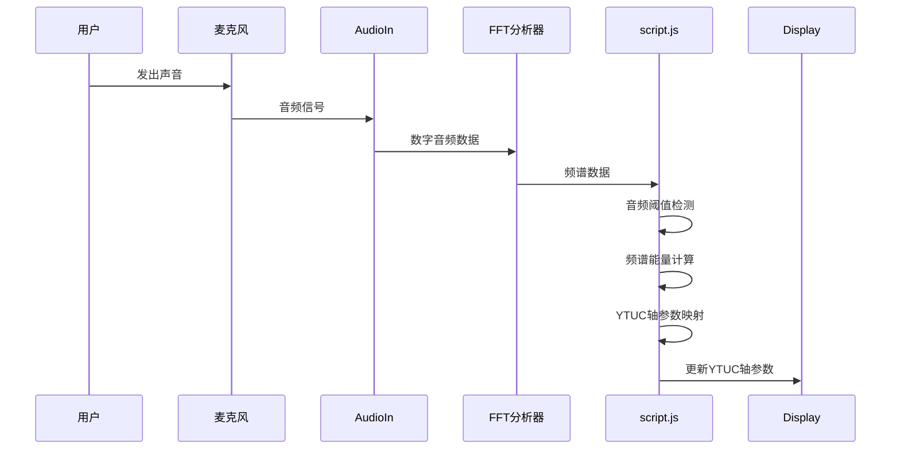
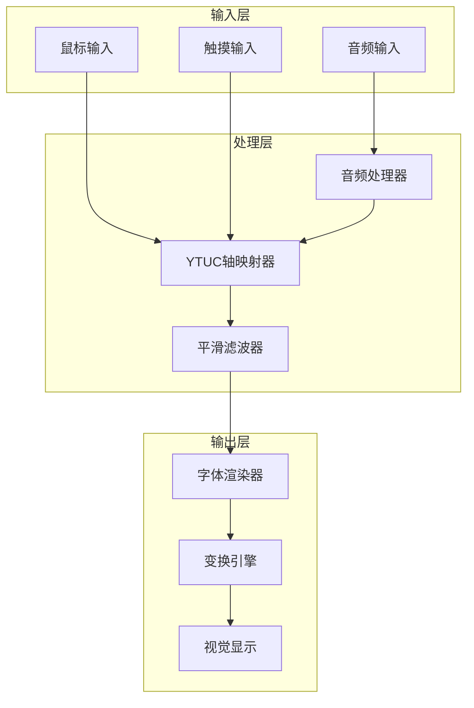
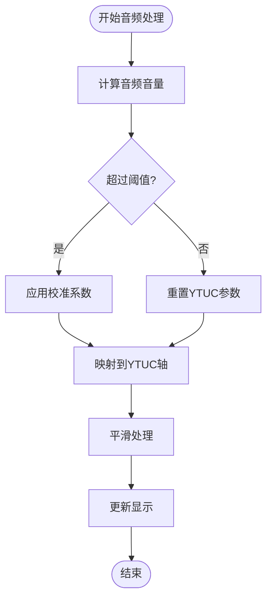
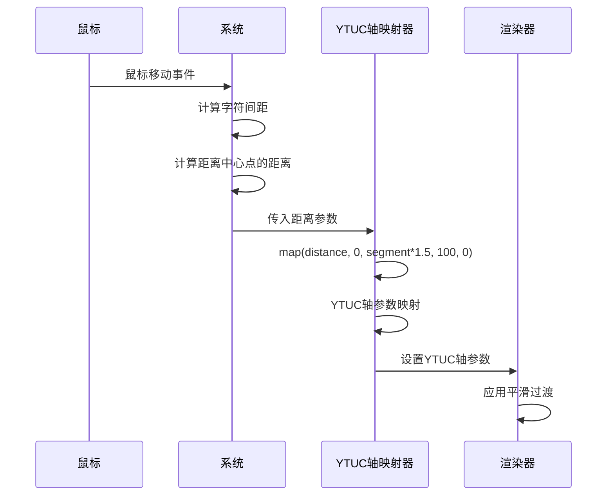
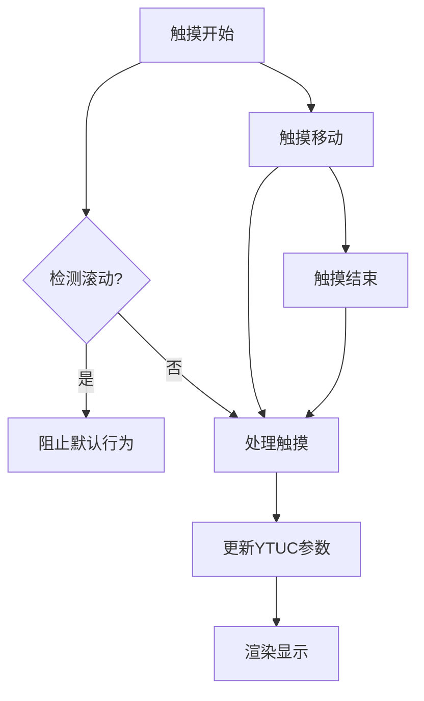
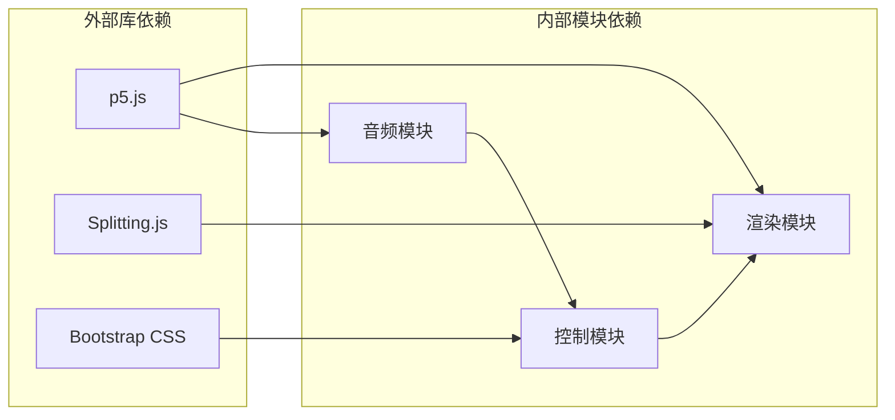
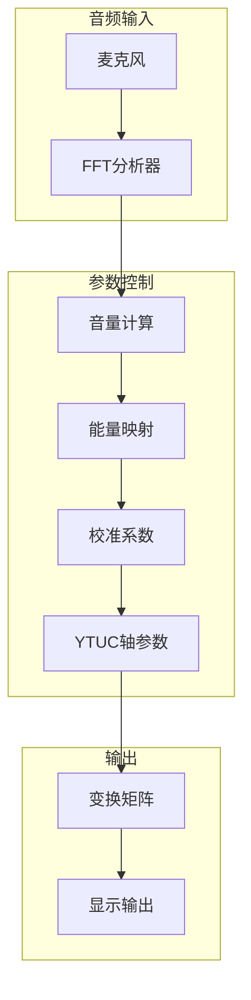
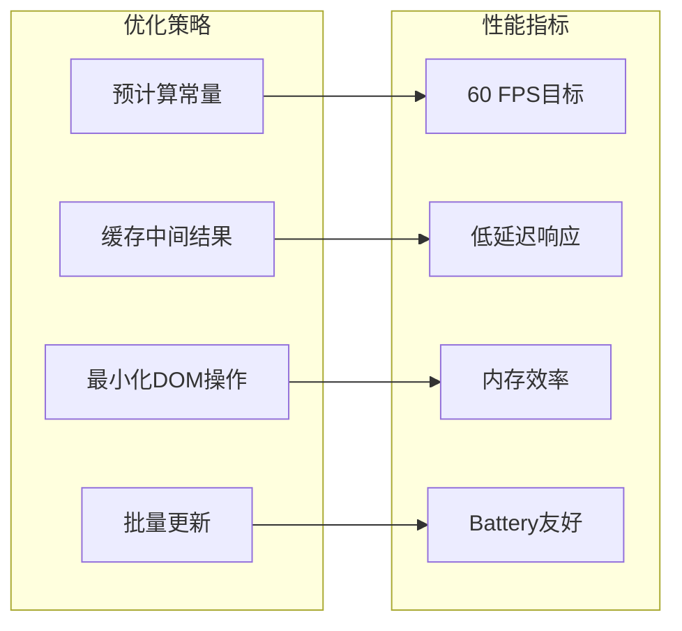

# 字体轴参数控制

<cite>
**本文档引用的文件**
- [index.html](file://index.html)
- [script.js](file://js/script.js)
- [style.css](file://styles/style.css)
- [splitting.css](file://styles/splitting.css)
- [splitting-cells.css](file://styles/splitting-cells.css)
- [FONT-REPLACEMENT-GUIDE.md](file://FONT-REPLACEMENT-GUIDE.md)
</cite>

## 更新摘要
**变更内容**
- 更新了字体轴参数控制章节，反映'YTUC'轴替代原有'vrsb'、'hght'、'ital'组合
- 更新了参数映射算法，从多轴控制改为单一'YTUC'轴控制
- 更新了样式文件中的轴参数引用，从多个轴改为'YTUC'轴
- 更新了字体轴依赖关系图，反映单一轴控制架构
- 更新了参数范围定义，反映新的'YTUC'轴参数体系

## 目录
1. [简介](#简介)
2. [项目结构](#项目结构)
3. [核心组件](#核心组件)
4. [架构概览](#架构概览)
5. [详细组件分析](#详细组件分析)
6. [依赖关系分析](#依赖关系分析)
7. [性能考虑](#性能考虑)
8. [故障排除指南](#故障排除指南)
9. [结论](#结论)

## 简介

MySymphosizer是一个创新的"声音激活的排版乐器"，它将音频输入与可变字体技术相结合，创造出动态的视觉体验。该项目的核心在于其先进的字体轴参数控制系统，能够实时响应用户的音频输入和交互操作。

该系统实现了单一的字体轴控制：**YTUC轴**，作为核心动画参数，替代了原有的'vrsb'、'hght'、'ital'组合控制。YTUC轴提供了更简洁、统一的参数控制方式，通过单一轴参数实现复杂的字形变形效果。

系统支持三种操作模式：音频驱动模式、鼠标控制模式和触摸控制模式，每种模式都有独特的参数映射和响应机制。

## 项目结构

MySymphosizer采用模块化的前端架构，主要由以下组件构成：



**图表来源**
- [index.html:1-282](file://index.html#L1-L282)
- [script.js:178-201](file://js/script.js#L178-L201)

**章节来源**
- [index.html:1-282](file://index.html#L1-L282)
- [script.js:178-201](file://js/script.js#L178-L201)

## 核心组件

### 音频输入与处理系统

系统使用p5.js的AudioIn和FFT模块来捕获和分析音频数据：



**图表来源**
- [script.js:923-929](file://js/script.js#L923-L929)
- [script.js:360-365](file://js/script.js#L360-L365)

### 字体轴参数控制系统

系统实现了单一核心字体轴的实时控制：

| 轴名称 | 轴标签 | 参数范围 | 控制方式 | 平滑系数 |
|--------|--------|----------|----------|----------|
| YTUC轴 | `YTUC` | 10 ~ 100 | 音频能量映射 | 0.3 |

**章节来源**
- [script.js:411-412](file://js/script.js#L411-L412)
- [style.css:861](file://styles/style.css#L861)

## 架构概览

MySymphosizer采用了事件驱动的架构模式，结合了音频处理、参数映射和实时渲染三个核心层次：



**图表来源**
- [script.js:301-426](file://js/script.js#L301-L426)
- [script.js:1022-1037](file://js/script.js#L1022-L1037)

## 详细组件分析

### 音频驱动模式

音频驱动模式是系统的核心功能，它将音频输入转换为视觉参数：

#### 音频阈值检测机制



**图表来源**
- [script.js:316-365](file://js/script.js#L316-L365)

#### YTUC轴参数映射算法

系统使用线性映射函数来实现精确的参数控制：

**线性映射函数**：
- `map(value, fromMin, fromMax, toMin, toMax)`
- 用于基础的数值范围转换

**YTUC轴映射**：
- `ytuValue = constrain(smoothH[i], 10, 100)`
- 将音频能量映射到YTUC轴参数范围
- 使用constrain()函数确保参数在有效范围内

**章节来源**
- [script.js:1022-1037](file://js/script.js#L1022-L1037)

### 鼠标控制模式

鼠标控制模式提供了直观的位置感应交互：

#### 距离计算与YTUC轴映射



**图表来源**
- [script.js:389-406](file://js/script.js#L389-L406)

#### 实时平滑处理机制

系统使用`lerp()`函数实现平滑过渡：

- `smoothH[i] = lerp(smoothH[i], target, 0.3)` - 30%平滑系数
- `smoothI = lerp(smoothI, target, 0.3)` - 30%平滑系数  
- `smoothSkew = lerp(smoothSkew, target, 0.07)` - 7%平滑系数

**章节来源**
- [script.js:389-421](file://js/script.js#L389-L421)

### 触摸控制模式

触摸控制模式针对移动设备进行了优化：

#### 触摸事件处理



**图表来源**
- [script.js:466-538](file://js/script.js#L466-L538)

**章节来源**
- [script.js:466-538](file://js/script.js#L466-L538)

### YTUC轴参数控制算法

#### YTUC轴控制算法

YTUC轴是系统的核心参数，负责控制字形的高度变化和整体变形：

**数学模型**：
```
ytuValue = constrain(smoothH[i], 10, 100)
splitChars[wornum].chars[i].style.fontVariationSettings = "'YTUC'" + ytuValue + ''
```

**参数范围定义**：
- 输入范围：smoothH[i]（经过音频处理的平滑参数）
- 输出范围：10到100（YTUC轴的有效范围）
- 平滑系数：0.3（中等平滑度）

**约束函数应用**：
- `constrain()`确保YTUC值在10-100范围内
- 防止参数超出字体轴的有效范围

**章节来源**
- [script.js:411-412](file://js/script.js#L411-L412)

## 依赖关系分析

### 核心依赖关系



**图表来源**
- [index.html:15,254-261](file://index.html#L15,L254-L261)
- [script.js:178-201](file://js/script.js#L178-L201)

### 字体轴依赖关系

系统中的字体轴参数相互依赖，形成简化的控制网络：



**图表来源**
- [script.js:316-421](file://js/script.js#L316-L421)

**章节来源**
- [script.js:316-421](file://js/script.js#L316-L421)

## 性能考虑

### 实时性能优化

系统在性能优化方面采用了多项策略：

#### 帧率管理
- 使用`frameRate(60)`确保稳定的60FPS渲染
- 优化音频处理循环，避免阻塞主线程

#### 内存管理
- 预分配数组空间：`smoothSpectrum[1024]`, `smoothH[15]`
- 及时释放不需要的DOM元素引用

#### 计算优化
- 使用`int()`函数进行整数运算
- 避免重复计算：缓存`segment`和`band`值

### 响应时间优化

系统通过以下机制优化响应时间：



## 故障排除指南

### 常见问题诊断

#### 音频输入问题

**症状**：麦克风无法正常工作
**解决方案**：
1. 检查浏览器权限设置
2. 验证音频设备连接
3. 确认`userStartAudio()`已调用

**章节来源**
- [script.js:923-929](file://js/script.js#L923-L929)

#### YTUC轴参数异常

**症状**：字体变形效果不正确
**解决方案**：
1. 检查`micThreshold`值设置
2. 验证`map()`函数参数范围
3. 确认平滑系数设置合理
4. 检查`constrain()`函数的范围设置

**章节来源**
- [script.js:1006-1012](file://js/script.js#L1006-L1012)

#### 移动端兼容性问题

**症状**：触摸事件响应异常
**解决方案**：
1. 检查`ontouchstart`事件绑定
2. 验证`preventDefault()`调用
3. 确认触摸坐标计算正确

**章节来源**
- [script.js:470-512](file://js/script.js#L470-L512)

### 调试技巧

#### 实时监控

使用浏览器开发者工具监控以下关键变量：
- `smoothH[i]` - YTUC轴参数
- `ytuValue` - 约束后的YTUC值
- `loudSize` - 缩放参数

#### 性能分析

使用Chrome DevTools的Performance面板：
1. 录制60秒的性能数据
2. 分析音频处理时间占比
3. 识别渲染瓶颈

## 结论

MySymphosizer的字体轴参数控制系统展现了现代Web技术在创意表达方面的强大能力。通过精心设计的音频驱动算法、多模式交互支持和实时平滑处理机制，系统成功地将抽象的音频信号转换为直观的视觉体验。

该系统的创新之处在于：

1. **简化的设计**：YTUC轴替代原有的多轴控制，提供更简洁的参数体系
2. **统一的控制**：单一轴参数实现复杂的字形变形效果
3. **多模式支持**：音频驱动、鼠标控制和触摸控制的无缝切换
4. **精确的数学建模**：线性映射和约束函数的组合应用
5. **实时性能优化**：60FPS的稳定帧率和低延迟响应
6. **可扩展性设计**：完整的字体轴参数体系和灵活的配置选项

未来的发展方向包括：
- 支持更多字体轴参数
- 增强移动端触摸手势识别
- 优化音频处理算法
- 扩展可视化效果选项

这个项目为Web字体技术的发展提供了宝贵的实践经验，展示了如何将前沿的音频处理技术和传统的排版艺术完美融合。