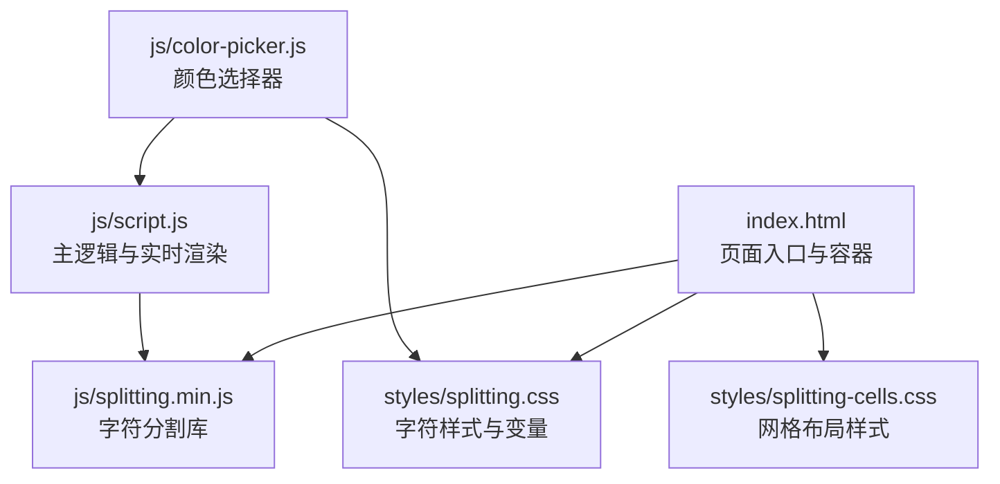
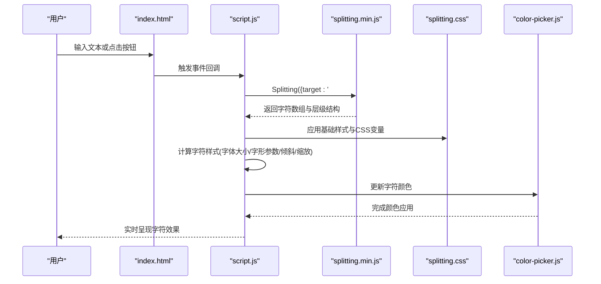
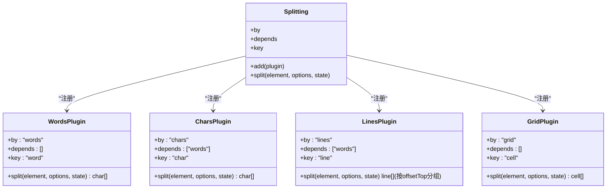
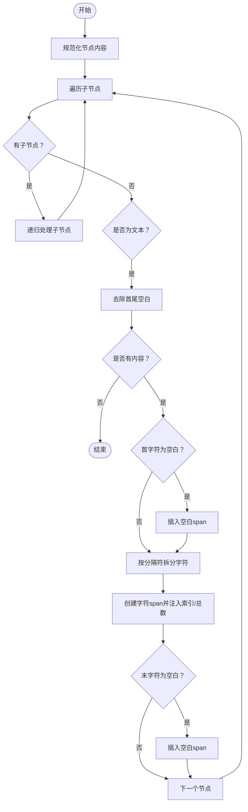
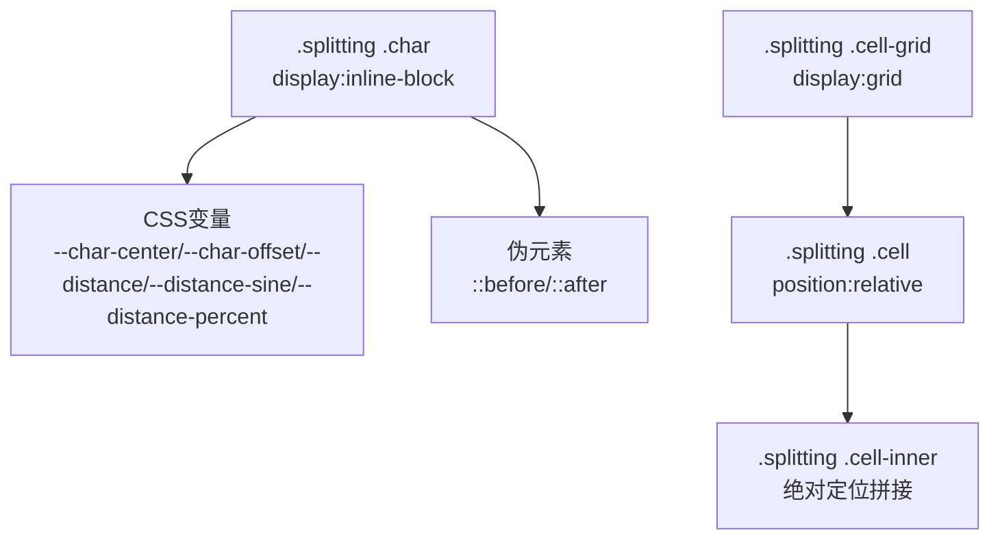
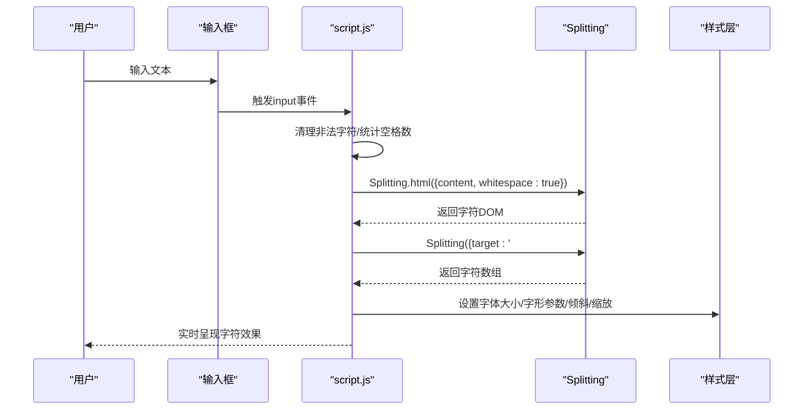
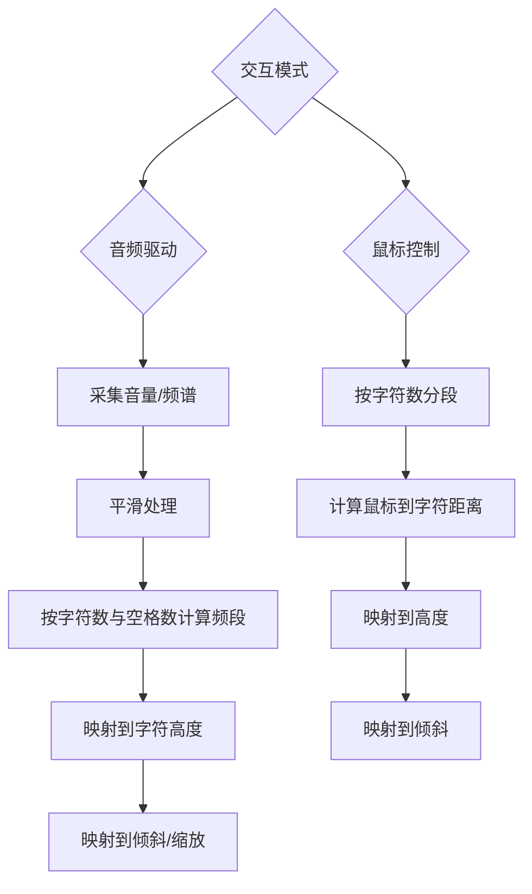
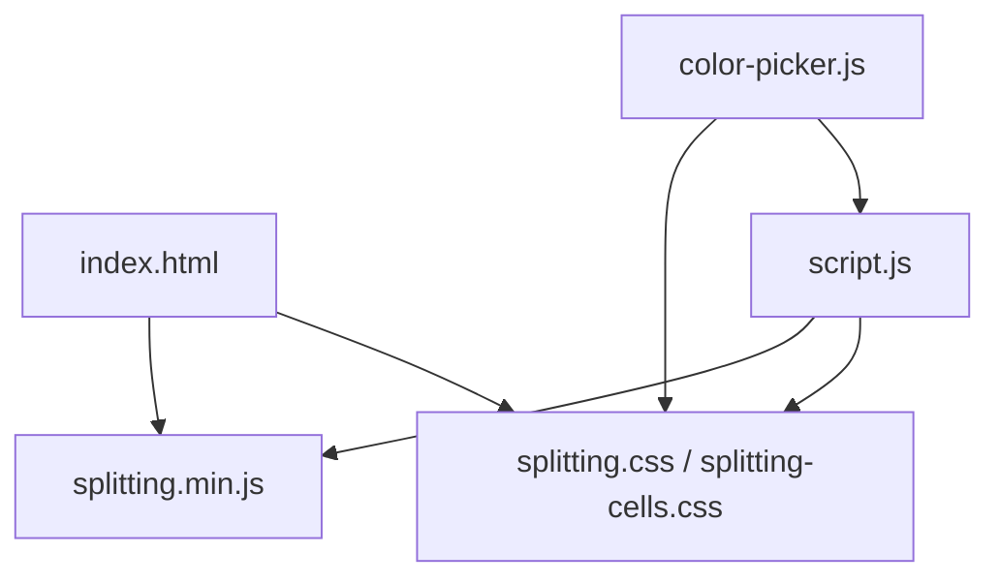

# 字符分割机制

<cite>
**本文档引用的文件**
- [splitting.min.js](file://js/splitting.min.js)
- [splitting.css](file://styles/splitting.css)
- [splitting-cells.css](file://styles/splitting-cells.css)
- [index.html](file://index.html)
- [script.js](file://js/script.js)
- [color-picker.js](file://js/color-picker.js)
</cite>

## 目录
1. [简介](#简介)
2. [项目结构](#项目结构)
3. [核心组件](#核心组件)
4. [架构总览](#架构总览)
5. [详细组件分析](#详细组件分析)
6. [依赖关系分析](#依赖关系分析)
7. [性能考虑](#性能考虑)
8. [故障排除指南](#故障排除指南)
9. [结论](#结论)

## 简介
本文件面向MySymphosizer项目中的字符分割机制，系统性解析Splitting.js库的集成与使用方式，涵盖以下关键主题：
- 文本分割算法的实现原理与数据流
- 字符单元的DOM结构生成与CSS类名自动分配
- 实时处理流程：从原始文本输入到字符数组的构建、空白字符处理、字符间距动态调整与样式统一管理
- 不同交互模式（音频驱动与鼠标控制）下字符响应与位置计算的差异
- 性能优化策略：DOM批量处理、字符单元复用与内存优化

## 项目结构
MySymphosizer采用模块化组织，字符分割相关的核心文件如下：
- js/splitting.min.js：第三方字符分割库（压缩版）
- styles/splitting.css：字符分割推荐样式与CSS变量
- styles/splitting-cells.css：网格分格布局样式
- index.html：页面入口，包含带有data-splitting属性的容器
- js/script.js：主逻辑脚本，负责文本输入、分割触发、实时渲染与交互
- js/color-picker.js：颜色选择器逻辑，配合字符样式更新

**图表来源**
- [index.html:10-15](file://index.html#L10-L15)
- [splitting.min.js:1-31](file://js/splitting.min.js#L1-L31)
- [splitting.css:1-67](file://styles/splitting.css#L1-L67)
- [splitting-cells.css:1-56](file://styles/splitting-cells.css#L1-L56)
- [script.js:238-242](file://js/script.js#L238-L242)
- [color-picker.js:123-126](file://js/color-picker.js#L123-L126)

**章节来源**
- [index.html:1-282](file://index.html#L1-L282)
- [splitting.min.js:1-31](file://js/splitting.min.js#L1-L31)
- [splitting.css:1-67](file://styles/splitting.css#L1-L67)
- [splitting-cells.css:1-56](file://styles/splitting-cells.css#L1-L56)
- [script.js:238-281](file://js/script.js#L238-L281)
- [color-picker.js:1-231](file://js/color-picker.js#L1-L231)

## 核心组件
- Splitting.js库：提供按单词、字符、行等粒度的文本拆分能力，支持自定义插件扩展与索引/总数CSS变量注入。
- 样式层：splitting.css定义字符与单词的基础显示与伪元素策略；splitting-cells.css提供网格布局与单元定位。
- 主逻辑脚本：负责文本输入监听、调用Splitting进行分割、实时更新字符样式（字体大小、字形参数、倾斜与缩放），以及根据交互模式（音频或鼠标）计算字符响应。
- 颜色选择器：动态更新所有字符与空白的色彩，确保视觉一致性。

**章节来源**
- [splitting.min.js:17-18](file://js/splitting.min.js#L17-L18)
- [splitting.css:2-66](file://styles/splitting.css#L2-L66)
- [splitting-cells.css:3-55](file://styles/splitting-cells.css#L3-L55)
- [script.js:238-281](file://js/script.js#L238-L281)
- [color-picker.js:123-126](file://js/color-picker.js#L123-L126)

## 架构总览
字符分割机制的整体工作流如下：
- 页面加载时，通过data-splitting属性标记需要分割的容器。
- 初始化阶段对目标容器执行Splitting，生成字符与单词层级的DOM结构。
- 运行时根据用户输入或交互（音频/鼠标）实时更新每个字符的样式属性。
- 样式层通过CSS变量提供字符中心、偏移、距离等相对位置信息，便于动画与特效。

**图表来源**
- [index.html:196-199](file://index.html#L196-L199)
- [script.js:238-242](file://js/script.js#L238-L242)
- [splitting.min.js:19-22](file://js/splitting.min.js#L19-L22)
- [splitting.css:2-66](file://styles/splitting.css#L2-L66)
- [color-picker.js:123-126](file://js/color-picker.js#L123-L126)

## 详细组件分析

### Splitting.js库实现与插件机制
Splitting.js通过插件注册与依赖排序实现可扩展的分割能力：
- 插件注册：通过add函数注册按单词、字符、行等分割插件。
- 依赖解析：根据插件声明的依赖顺序进行拓扑排序，确保先解析父级再解析子级。
- DOM生成：遍历节点，按规则生成字符span、空白span，并注入索引与总数CSS变量。
- 数据结构：返回包含words、chars、lines等字段的对象，供上层逻辑使用。

**图表来源**
- [splitting.min.js:6-11](file://js/splitting.min.js#L6-L11)
- [splitting.min.js:17-18](file://js/splitting.min.js#L17-L18)
- [splitting.min.js:26-29](file://js/splitting.min.js#L26-L29)

**章节来源**
- [splitting.min.js:1-31](file://js/splitting.min.js#L1-L31)

### 字符单元的DOM结构与CSS类名
- DOM生成：对每个字符创建span元素，空白字符单独处理并插入空白span。
- 类名与属性：字符span添加“char”类，空白span添加“whitespace”类；同时注入索引与总数属性，用于CSS变量计算。
- 层级关系：字符位于单词内部，单词位于行内部，形成清晰的层级结构，便于样式与动画控制。

**图表来源**
- [splitting.min.js:11-16](file://js/splitting.min.js#L11-L16)

**章节来源**
- [splitting.min.js:11-16](file://js/splitting.min.js#L11-L16)

### 样式体系与CSS变量
- 基础样式：字符与单词默认inline-block显示，字符支持伪元素以扩展效果。
- CSS变量：提供字符中心、偏移、距离与百分比等变量，便于基于位置的动画与特效。
- 网格布局：当启用cells布局时，通过CSS Grid生成单元格，支持行列索引与中心点计算。

**图表来源**
- [splitting.css:2-66](file://styles/splitting.css#L2-L66)
- [splitting-cells.css:3-55](file://styles/splitting-cells.css#L3-L55)

**章节来源**
- [splitting.css:2-66](file://styles/splitting.css#L2-L66)
- [splitting-cells.css:3-55](file://styles/splitting-cells.css#L3-L55)

### 实时处理流程：从输入到渲染
- 文本输入：监听输入框事件，清理非法字符并重新生成带光标的HTML片段。
- 分割触发：使用Splitting.html生成字符DOM，并再次调用Splitting以获取字符数组。
- 样式更新：根据字符数量与窗口尺寸计算字体大小，设置字形参数、倾斜与缩放。
- 颜色同步：颜色选择器更新后，统一修改所有字符与空白的颜色。

**图表来源**
- [script.js:244-281](file://js/script.js#L244-L281)
- [script.js:306-426](file://js/script.js#L306-L426)

**章节来源**
- [script.js:244-281](file://js/script.js#L244-L281)
- [script.js:306-426](file://js/script.js#L306-L426)

### 交互模式差异：音频驱动 vs 鼠标控制
- 音频驱动模式：
  - 采集麦克风音量与频谱，平滑处理后映射到每个字符的高度与倾斜。
  - 根据字符数量与空格数动态确定频段范围，提升响应精度。
  - 当音量超过阈值时，增大倾斜与缩放，营造动态律动感。
- 鼠标控制模式：
  - 将画布宽度按字符数平均分段，计算鼠标到各字符的距离。
  - 基于距离映射到高度，结合垂直方向映射到倾斜，实现空间感知的字符响应。

**图表来源**
- [script.js:316-387](file://js/script.js#L316-L387)
- [script.js:388-406](file://js/script.js#L388-L406)

**章节来源**
- [script.js:316-387](file://js/script.js#L316-L387)
- [script.js:388-406](file://js/script.js#L388-L406)

### 样式统一管理与颜色联动
- 统一着色：颜色选择器通过更新所有字符与空白的color属性，保证整体视觉一致。
- 全局影响：背景、按钮、SVG等元素也随颜色变化，维持界面协调。
- 实时更新：每次颜色切换后，立即应用到当前字符DOM，无需重新分割。

**章节来源**
- [color-picker.js:123-126](file://js/color-picker.js#L123-L126)
- [script.js:946-948](file://js/script.js#L946-L948)

## 依赖关系分析
- 页面依赖：index.html引入Splitting库与样式表，并在容器上标注data-splitting。
- 脚本依赖：script.js依赖Splitting库进行分割，依赖jQuery进行DOM操作与颜色更新。
- 样式依赖：splitting.css与splitting-cells.css为字符与网格布局提供基础样式与变量。
- 颜色依赖：color-picker.js与script.js共同维护颜色状态并同步到字符样式。

**图表来源**
- [index.html:10-15](file://index.html#L10-L15)
- [splitting.min.js:1-31](file://js/splitting.min.js#L1-L31)
- [splitting.css:1-67](file://styles/splitting.css#L1-L67)
- [splitting-cells.css:1-56](file://styles/splitting-cells.css#L1-L56)
- [script.js:238-242](file://js/script.js#L238-L242)
- [color-picker.js:123-126](file://js/color-picker.js#L123-L126)

**章节来源**
- [index.html:10-15](file://index.html#L10-L15)
- [script.js:238-242](file://js/script.js#L238-L242)
- [color-picker.js:123-126](file://js/color-picker.js#L123-L126)

## 性能考虑
- DOM批量处理
  - 使用DocumentFragment减少回流重绘：Splitting在生成字符时先收集到DocumentFragment，最后一次性写入容器，降低多次DOM操作带来的开销。
  - 批量样式更新：在每帧中统一设置字符样式，避免逐个元素频繁访问DOM。
- 字符单元复用
  - 通过Splitting返回的chars数组直接更新现有DOM，避免重复创建与销毁元素。
  - 在颜色切换时仅更新color属性，不重建DOM结构。
- 内存优化
  - 平滑数组与历史数据长度固定，避免无限增长导致内存泄漏。
  - 事件绑定与定时器在不需要时及时清理，减少常驻内存对象。
- 动画与计算
  - 使用CSS变量与GPU加速的transform属性，减少JavaScript直接操作复杂样式带来的性能损耗。
  - 对高频计算（如距离映射、平滑过渡）采用缓存与限制更新频率的方式，平衡流畅度与性能。

**章节来源**
- [splitting.min.js:11-16](file://js/splitting.min.js#L11-L16)
- [script.js:306-426](file://js/script.js#L306-L426)
- [script.js:193-198](file://js/script.js#L193-L198)

## 故障排除指南
- 分割未生效
  - 检查容器是否包含data-splitting属性，确认Splitting初始化时target正确指向该容器。
  - 确认Splitting库已正确加载且无版本冲突。
- 样式异常
  - 确保splitting.css与splitting-cells.css已加载，且优先级高于其他样式。
  - 若使用伪元素效果，请显式设置伪元素的display属性。
- 颜色不同步
  - 检查颜色选择器逻辑是否正确更新所有字符与空白的color属性。
  - 确认颜色更新后未被其他样式覆盖。
- 性能问题
  - 避免在每帧中重复创建DOM结构，尽量使用现有chars数组进行更新。
  - 控制平滑数组长度与更新频率，防止过度计算。

**章节来源**
- [index.html:196-199](file://index.html#L196-L199)
- [splitting.css:17-26](file://styles/splitting.css#L17-L26)
- [color-picker.js:123-126](file://js/color-picker.js#L123-L126)
- [script.js:306-426](file://js/script.js#L306-L426)

## 结论
MySymphosizer的字符分割机制通过Splitting.js实现了高效的文本拆分与DOM生成，配合样式层的CSS变量与网格布局，提供了灵活而强大的字符级控制能力。主逻辑脚本在音频驱动与鼠标控制两种模式下分别计算字符响应，结合颜色选择器实现全局样式统一。通过DocumentFragment批量处理、字符数组复用与内存优化策略，系统在保证视觉效果的同时兼顾了性能表现。未来可在以下方面进一步完善：
- 增加对多语言与复杂文本段落的分割策略（如Intl.Segmenter）。
- 提供更丰富的插件接口，支持自定义分割粒度与特效。
- 引入Web Workers或请求帧调度，进一步降低主线程压力。