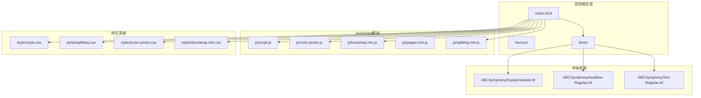
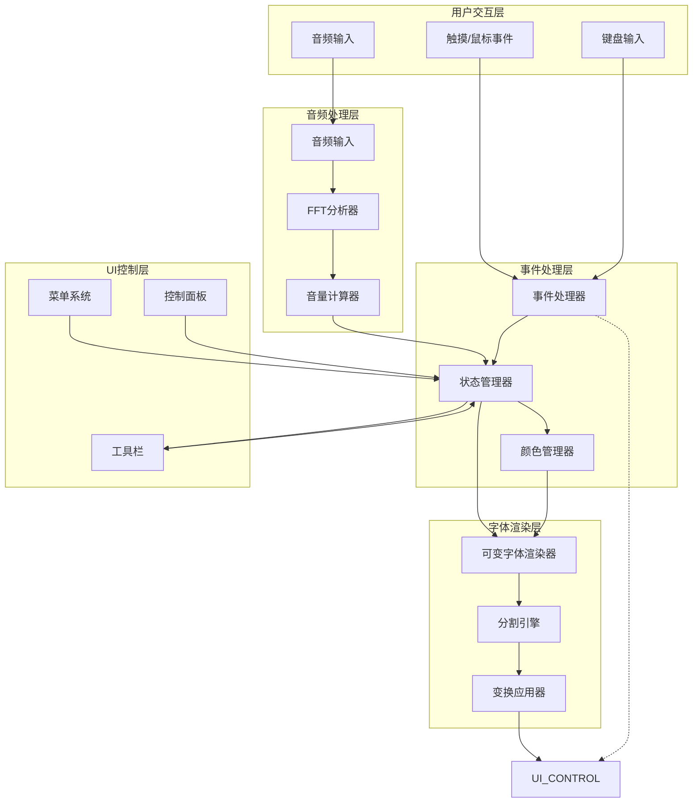
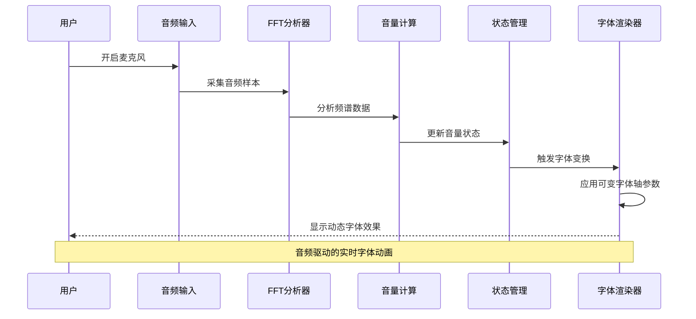
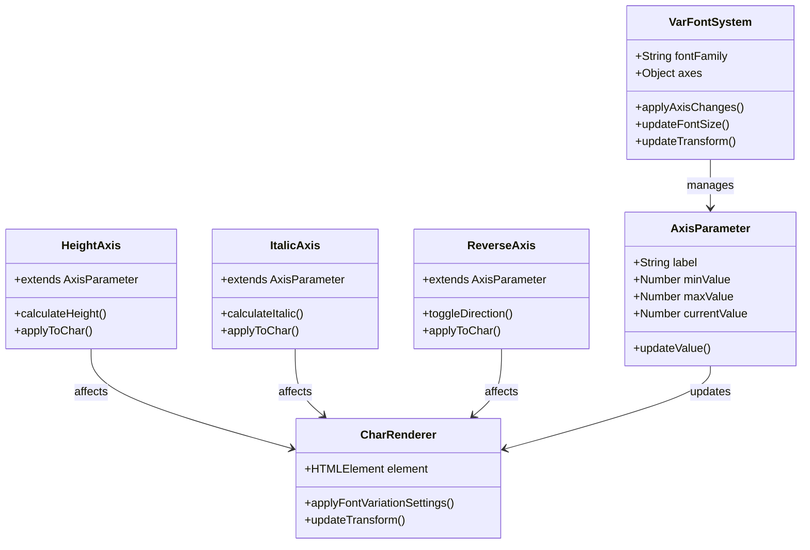
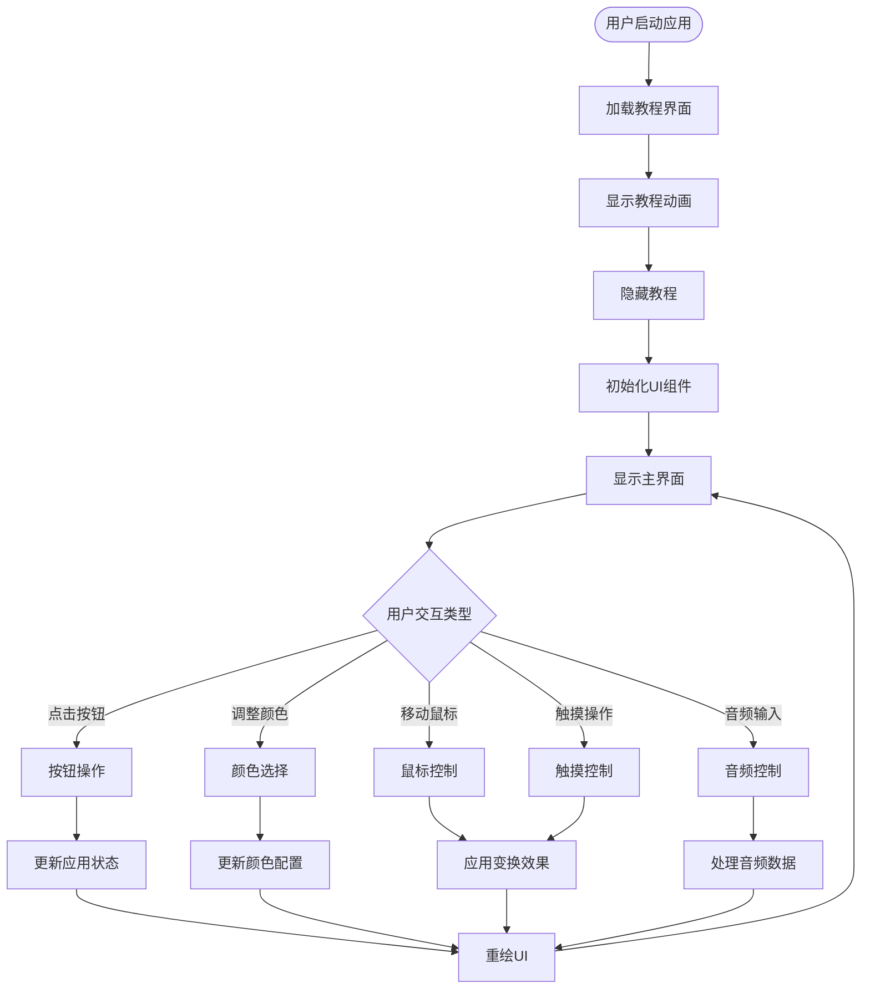
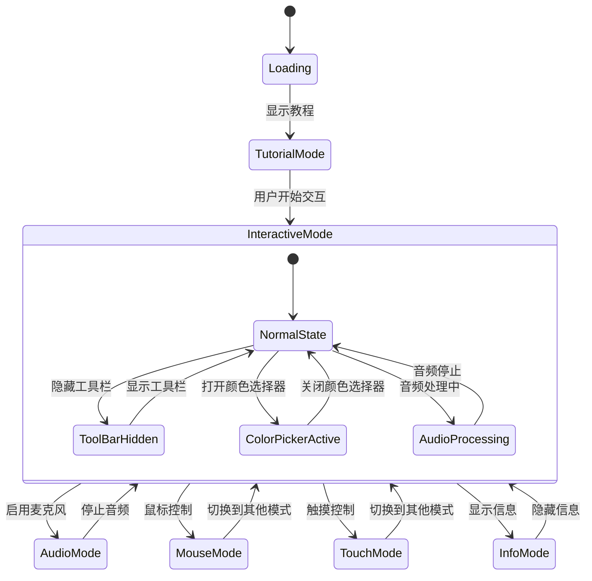
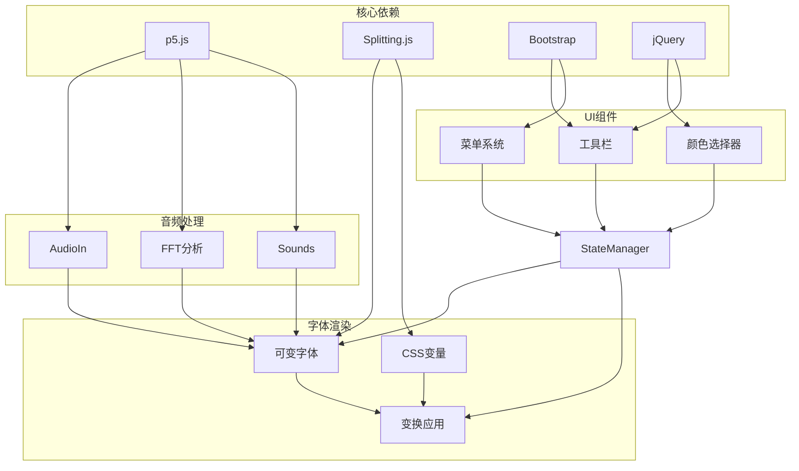

# 核心架构设计

<cite>
**本文档引用的文件**
- [index.html](file://index.html)
- [script.js](file://js/script.js)
- [color-picker.js](file://js/color-picker.js)
- [style.css](file://styles/style.css)
- [splitting.css](file://styles/splitting.css)
- [color-picker.css](file://styles/color-picker.css)
- [FONT-REPLACEMENT-GUIDE.md](file://FONT-REPLACEMENT-GUIDE.md)
- [bootstrap.min.js](file://js/bootstrap.min.js)
</cite>

## 目录
1. [简介](#简介)
2. [项目结构](#项目结构)
3. [核心组件](#核心组件)
4. [架构概览](#架构概览)
5. [详细组件分析](#详细组件分析)
6. [依赖关系分析](#依赖关系分析)
7. [性能考虑](#性能考虑)
8. [故障排除指南](#故障排除指南)
9. [结论](#结论)

## 简介

MySymphosizer是一个创新的交互式音频可视化字体渲染系统，它将声音输入转换为动态的可变字体动画效果。该系统通过实时音频分析驱动字体的几何变换，创造出独特的"听觉字体"体验。项目采用模块化架构设计，实现了音频处理层、字体渲染层、用户界面层和状态管理层的清晰分离。

## 项目结构

MySymphosizer项目采用简洁而功能明确的文件组织结构：

**图表来源**
- [index.html:1-282](file://index.html#L1-L282)
- [script.js:1-1049](file://js/script.js#L1-L1049)

**章节来源**
- [index.html:1-282](file://index.html#L1-L282)
- [script.js:1-1049](file://js/script.js#L1-L1049)

## 核心组件

MySymphosizer系统由四个主要层次构成，每个层次都有明确的职责和接口：

### 音频处理层
负责声音输入捕获、频谱分析和音频特征提取。该层使用Web Audio API和p5.js库实现高性能的音频处理。

### 字体渲染层  
基于可变字体技术，通过实时调整字体轴参数实现动态视觉效果。支持高度、倾斜度和反转等轴参数的实时控制。

### 用户界面层
提供直观的交互控件，包括颜色选择器、工具栏按钮和菜单系统。所有UI元素都经过精心设计以增强用户体验。

### 状态管理层
管理应用程序的整体状态，包括音频激活状态、工具栏可见性、颜色配置和用户偏好设置。

**章节来源**
- [script.js:1-800](file://js/script.js#L1-L800)
- [style.css:1-800](file://styles/style.css#L1-L800)

## 架构概览

系统采用事件驱动的模块化架构，各组件通过清晰的接口进行通信：

**图表来源**
- [script.js:301-426](file://js/script.js#L301-L426)
- [color-picker.js:1-231](file://js/color-picker.js#L1-L231)

## 详细组件分析

### 音频处理系统

音频处理系统是MySymphosizer的核心，实现了从声音输入到视觉反馈的完整链路：

**图表来源**
- [script.js:178-201](file://js/script.js#L178-L201)
- [script.js:301-426](file://js/script.js#L301-L426)

音频处理的关键特性包括：
- **实时频谱分析**：使用FFT算法分析音频频率分布
- **音量阈值检测**：智能识别声音强度变化
- **平滑过渡效果**：避免音频变化造成的视觉闪烁
- **多平台兼容**：支持桌面和移动设备的音频输入

**章节来源**
- [script.js:178-201](file://js/script.js#L178-L201)
- [script.js:301-426](file://js/script.js#L301-L426)

### 可变字体系统

MySymphosizer采用先进的可变字体技术，通过实时调整字体轴参数实现动态效果：

**图表来源**
- [script.js:409-416](file://js/script.js#L409-L416)
- [FONT-REPLACEMENT-GUIDE.md:13-23](file://FONT-REPLACEMENT-GUIDE.md#L13-L23)

可变字体系统的核心轴参数：
- **Height (`hght`)**：控制字形高度比例，范围约-100到+100
- **Italic (`ital`)**：控制字体倾斜程度，范围约0到40
- **Reverse (`vrsb`)**：控制文字方向/翻转，值为0或1

**章节来源**
- [FONT-REPLACEMENT-GUIDE.md:13-23](file://FONT-REPLACEMENT-GUIDE.md#L13-L23)
- [script.js:409-416](file://js/script.js#L409-L416)

### 用户界面系统

用户界面采用模块化设计，提供了丰富的交互控制选项：

**图表来源**
- [script.js:540-743](file://js/script.js#L540-L743)
- [color-picker.js:95-175](file://js/color-picker.js#L95-L175)

UI系统的主要功能模块：
- **工具栏系统**：提供九个功能按钮，每个按钮控制不同的视觉效果
- **颜色管理系统**：集成颜色选择器，支持字体颜色和背景色的实时切换
- **音频控制面板**：提供麦克风开关和音量调节功能
- **信息显示系统**：支持教程模式和信息显示的切换

**章节来源**
- [script.js:540-743](file://js/script.js#L540-L743)
- [color-picker.js:95-175](file://js/color-picker.js#L95-L175)

### 状态管理系统

状态管理系统负责维护应用程序的全局状态，确保各个组件之间的协调一致：

**图表来源**
- [script.js:745-770](file://js/script.js#L745-L770)
- [script.js:540-743](file://js/script.js#L540-L743)

状态管理的关键特性：
- **多模式支持**：支持音频、鼠标、触摸和教程等多种操作模式
- **状态持久化**：保持用户偏好的状态信息
- **模式切换**：平滑的模式间切换机制
- **响应式设计**：自动适应不同设备和屏幕尺寸

**章节来源**
- [script.js:745-770](file://js/script.js#L745-L770)
- [script.js:540-743](file://js/script.js#L540-L743)

## 依赖关系分析

MySymphosizer的模块间依赖关系清晰且松耦合：

**图表来源**
- [index.html:15-261](file://index.html#L15-L261)
- [script.js:178-201](file://js/script.js#L178-L201)

主要外部依赖：
- **p5.js**：提供Web Audio API和图形渲染能力
- **Splitting.js**：实现文本分割和动画效果
- **Bootstrap**：提供响应式UI框架和组件
- **jQuery**：简化DOM操作和事件处理

**章节来源**
- [index.html:15-261](file://index.html#L15-L261)
- [script.js:178-201](file://js/script.js#L178-L201)

## 性能考虑

MySymphosizer在设计时充分考虑了性能优化：

### 渲染性能优化
- **requestAnimationFrame**：使用浏览器的原生动画循环，确保60fps的流畅动画
- **CSS变换缓存**：利用GPU加速的CSS变换属性，避免重排重绘
- **对象池模式**：复用DOM元素和音频对象，减少内存分配

### 音频处理优化
- **采样率适配**：根据设备性能动态调整音频采样率
- **异步处理**：音频分析在独立线程中执行，避免阻塞主线程
- **阈值过滤**：智能过滤微弱音频信号，减少不必要的计算

### 内存管理
- **垃圾回收友好**：及时释放不再使用的音频和DOM对象
- **事件监听器清理**：在组件销毁时移除所有事件监听器
- **资源池管理**：复用音频缓冲区和字体对象

## 故障排除指南

### 常见问题诊断

**音频无法正常工作**
1. 检查浏览器权限设置，确保麦克风访问被允许
2. 验证音频设备连接状态
3. 尝试在不同浏览器中测试
4. 检查音频阈值设置是否过高

**字体渲染异常**
1. 确认可变字体文件正确加载
2. 验证CSS `font-variation-settings` 属性支持
3. 检查字体轴参数范围设置
4. 测试基础字体渲染功能

**UI交互问题**
1. 检查JavaScript错误控制台输出
2. 验证CSS样式文件加载状态
3. 确认事件监听器正确绑定
4. 测试触摸和鼠标事件响应

**性能问题**
1. 使用浏览器性能分析工具检测瓶颈
2. 检查帧率和内存使用情况
3. 优化音频采样率设置
4. 减少不必要的DOM操作

**章节来源**
- [script.js:384-386](file://js/script.js#L384-L386)
- [FONT-REPLACEMENT-GUIDE.md:245-263](file://FONT-REPLACEMENT-GUIDE.md#L245-L263)

## 结论

MySymphosizer展现了现代Web应用架构的最佳实践，通过模块化设计实现了音频处理、字体渲染和用户界面的完美融合。系统的核心优势包括：

**技术创新**：成功将音频分析与可变字体技术结合，创造了独特的交互体验。

**架构优势**：清晰的分层设计和模块化结构确保了代码的可维护性和扩展性。

**用户体验**：直观的界面设计和流畅的动画效果提供了优秀的用户交互体验。

**性能优化**：通过多种优化策略确保了在各种设备上的流畅运行。

该架构为类似的声音可视化项目提供了宝贵的参考，展示了如何在Web环境中实现复杂的多媒体应用。