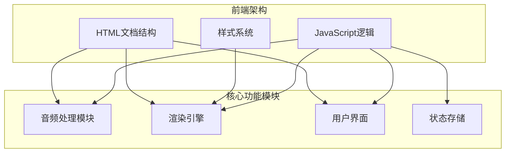
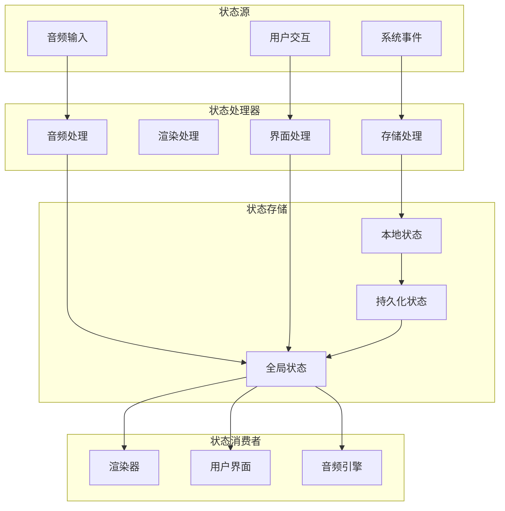
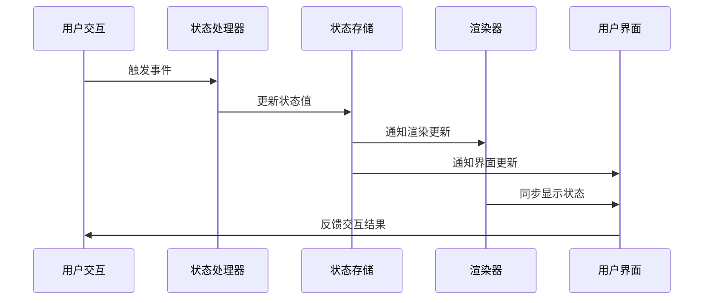
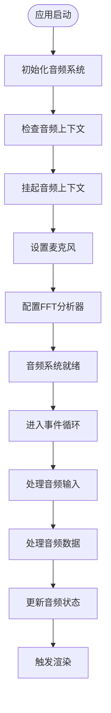
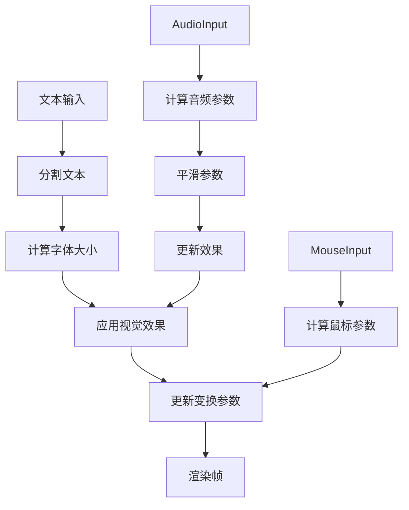
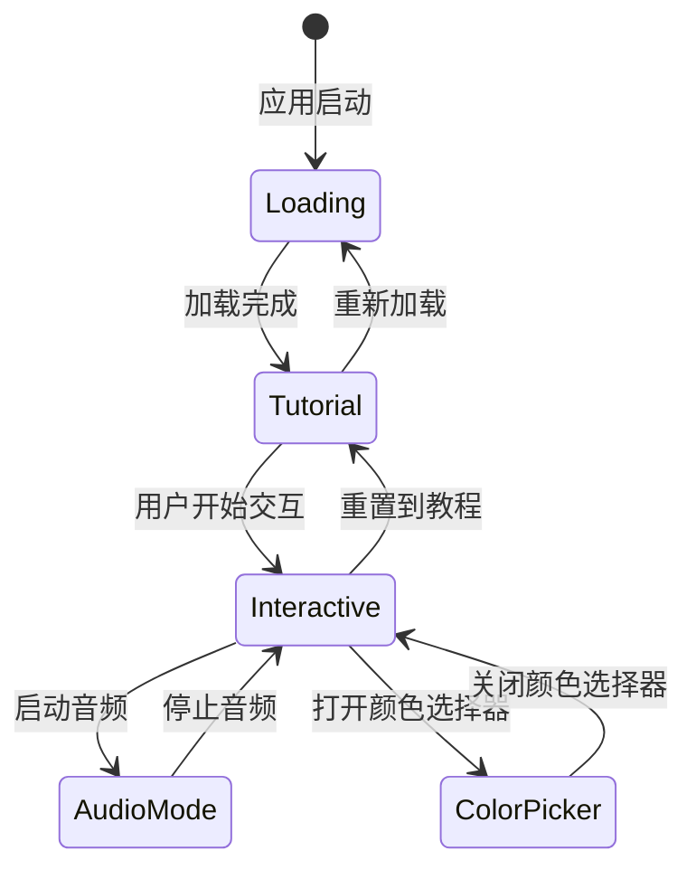
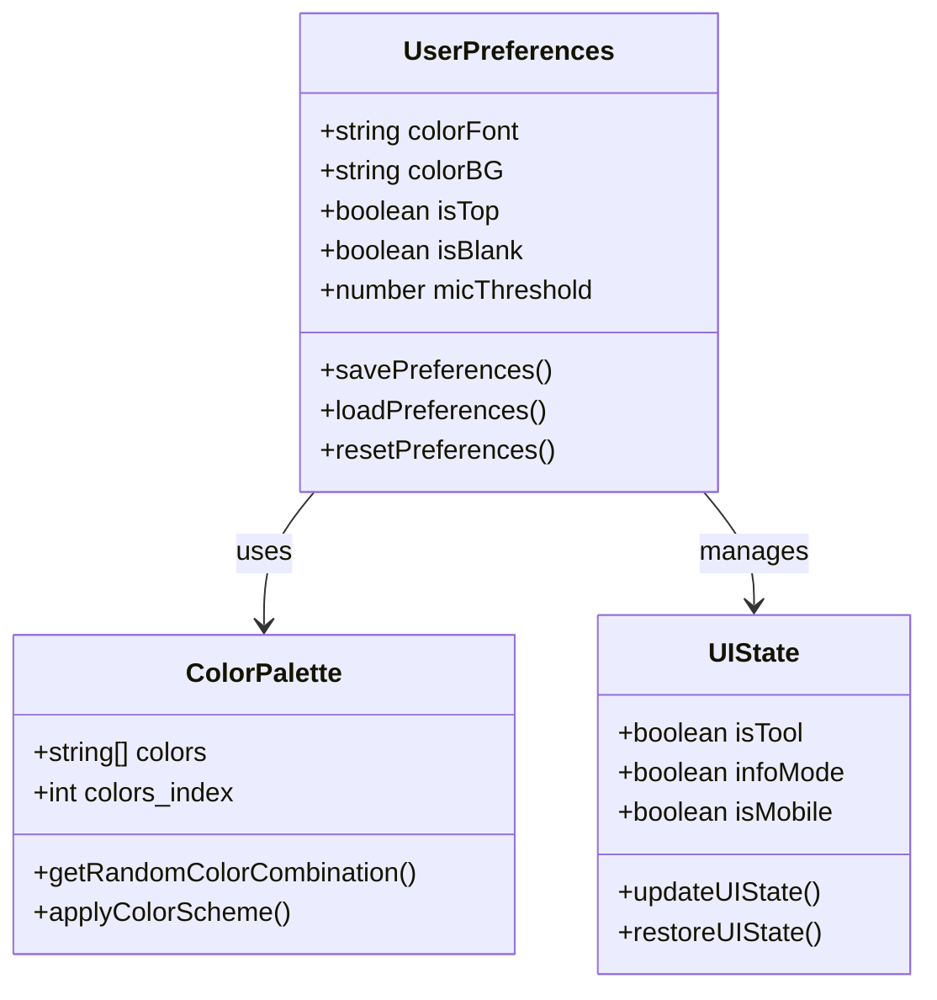
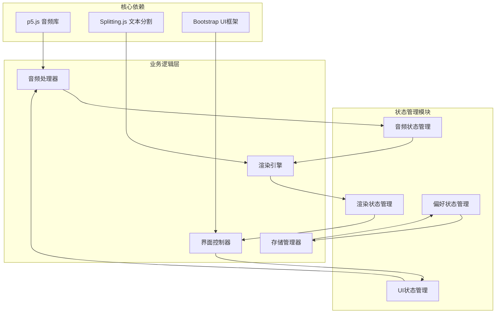

# 状态管理系统

<cite>
**本文档引用的文件**
- [index.html](file://index.html)
- [script.js](file://js/script.js)
- [color-picker.js](file://js/color-picker.js)
- [style.css](file://styles/style.css)
- [splitting.css](file://styles/splitting.css)
</cite>

## 目录
1. [简介](#简介)
2. [项目结构](#项目结构)
3. [核心组件](#核心组件)
4. [架构概览](#架构概览)
5. [详细组件分析](#详细组件分析)
6. [依赖关系分析](#依赖关系分析)
7. [性能考虑](#性能考虑)
8. [故障排除指南](#故障排除指南)
9. [结论](#结论)

## 简介

MySymphosizer是一个基于Web的动态字体交互式应用程序，通过麦克风输入和鼠标交互来控制文本的视觉表现。该项目实现了复杂的状态管理系统，涵盖了音频状态、渲染状态、UI状态和用户偏好状态的完整生命周期管理。

该状态管理系统采用事件驱动的架构设计，通过JavaScript变量和DOM操作实现状态的实时更新和同步。系统支持多种交互模式，包括声音激活、鼠标控制和颜色选择等，并提供了完整的状态持久化机制。

## 项目结构

MySymphosizer项目采用模块化架构，主要由以下核心部分组成：

**图表来源**
- [index.html:1-282](file://index.html#L1-L282)
- [script.js:1-1049](file://js/script.js#L1-L1049)

**章节来源**
- [index.html:1-282](file://index.html#L1-L282)
- [script.js:1-1049](file://js/script.js#L1-L1049)

## 核心组件

### 状态分类体系

MySymphosizer的状态管理系统按照功能域进行清晰的分类：

#### 音频状态 (Audio State)
- 麦克风输入状态：`isMic`, `mic`, `micThreshold`
- 音频分析状态：`fft`, `spectrum`, `vol`
- 音频渲染参数：`smoothSpectrum`, `smoothH`

#### 渲染状态 (Render State)
- 文本渲染状态：`fontSize`, `splitChars`, `charnum`
- 字体变形参数：`smoothI`, `smoothSkew`, `loudSize`
- 动画状态：`smoothAmount`, `smoothVol`

#### UI状态 (UI State)
- 工具栏状态：`isTool`, `isSliderActive`
- 菜单状态：`infoMode`, `isInitial`
- 颜色状态：`colorFont`, `colorBG`, `colors`
- 响应式状态：`isMobile`, `windowWidth`, `windowHeight`

#### 用户偏好状态 (User Preference State)
- 主题设置：`colorFont`, `colorBG`
- 显示模式：`isTop`, `isBlank`
- 交互设置：`micThreshold`, `spacesCount`

**章节来源**
- [script.js:1-100](file://js/script.js#L1-L100)
- [script.js:1000-1049](file://js/script.js#L1000-L1049)

## 架构概览

### 状态管理架构图

**图表来源**
- [script.js:165-200](file://js/script.js#L165-L200)
- [script.js:301-426](file://js/script.js#L301-L426)

### 状态同步机制

系统采用多层状态同步机制确保各组件间的状态一致性：

**图表来源**
- [script.js:540-743](file://js/script.js#L540-L743)
- [color-picker.js:95-175](file://js/color-picker.js#L95-L175)

## 详细组件分析

### 音频状态管理

#### 音频初始化流程

**图表来源**
- [script.js:173-192](file://js/script.js#L173-L192)
- [script.js:923-929](file://js/script.js#L923-L929)

#### 音频状态更新机制

音频状态通过事件驱动的方式实时更新：

| 状态属性 | 更新频率 | 更新条件 | 影响范围 |
|---------|---------|---------|---------|
| `isMic` | 实时 | 麦克风开关 | 所有音频相关功能 |
| `micThreshold` | 滑块调整 | 用户交互 | 音量检测阈值 |
| `smoothSpectrum` | 60fps | FFT分析 | 频谱可视化 |
| `smoothH` | 60fps | 音量计算 | 字符高度动画 |

**章节来源**
- [script.js:178-200](file://js/script.js#L178-L200)
- [script.js:301-426](file://js/script.js#L301-L426)

### 渲染状态管理

#### 文本渲染流程

**图表来源**
- [script.js:238-281](file://js/script.js#L238-L281)
- [script.js:367-416](file://js/script.js#L367-L416)

#### 渲染状态优化

系统采用多种优化技术确保渲染性能：

- **状态缓存**：使用`smoothSpectrum`和`smoothH`数组缓存历史数据
- **插值算法**：使用`lerp`函数实现平滑过渡效果
- **条件渲染**：根据设备类型调整渲染复杂度

**章节来源**
- [script.js:29-35](file://js/script.js#L29-L35)
- [script.js:344-358](file://js/script.js#L344-L358)

### UI状态管理

#### 界面状态转换

**图表来源**
- [script.js:745-770](file://js/script.js#L745-L770)
- [script.js:838-921](file://js/script.js#L838-L921)

#### UI状态持久化

界面状态通过CSS类名和内联样式实现持久化：

- **工具栏状态**：通过`isTool`变量控制显示/隐藏
- **菜单状态**：通过`infoMode`控制信息面板显示
- **颜色状态**：通过`colorFont`和`colorBG`变量控制主题

**章节来源**
- [script.js:772-836](file://js/script.js#L772-L836)
- [style.css:643-800](file://styles/style.css#L643-L800)

### 用户偏好状态管理

#### 偏好设置系统

**图表来源**
- [script.js:63-106](file://js/script.js#L63-L106)
- [color-picker.js:1-231](file://js/color-picker.js#L1-L231)

**章节来源**
- [color-picker.js:1-231](file://js/color-picker.js#L1-L231)
- [script.js:931-960](file://js/script.js#L931-L960)

## 依赖关系分析

### 组件依赖图

**图表来源**
- [index.html:15-261](file://index.html#L15-L261)
- [script.js:1-1049](file://js/script.js#L1-L1049)

### 状态传播路径

系统中的状态传播遵循以下路径：

1. **用户交互** → **事件处理器** → **状态更新**
2. **状态更新** → **状态验证** → **状态同步**
3. **状态同步** → **相关组件** → **界面更新**

**章节来源**
- [script.js:540-743](file://js/script.js#L540-L743)
- [script.js:1005-1020](file://js/script.js#L1005-L1020)

## 性能考虑

### 状态管理性能优化

#### 内存管理策略

- **数组预分配**：在初始化阶段预分配固定大小的数组
- **对象复用**：避免频繁创建和销毁对象
- **垃圾回收优化**：及时清理不再使用的状态引用

#### 计算优化技术

- **状态缓存**：缓存计算结果避免重复计算
- **增量更新**：只更新发生变化的状态
- **批量处理**：合并多个状态更新操作

#### 渲染性能优化

- **60fps渲染**：确保每帧渲染时间不超过16.7ms
- **条件渲染**：根据设备能力调整渲染复杂度
- **硬件加速**：利用CSS3变换和GPU加速

**章节来源**
- [script.js:193-198](file://js/script.js#L193-L198)
- [script.js:301-426](file://js/script.js#L301-L426)

## 故障排除指南

### 常见问题诊断

#### 音频相关问题

| 问题症状 | 可能原因 | 解决方案 |
|---------|---------|---------|
| 麦克风无响应 | 权限未授权 | 引导用户授权麦克风访问 |
| 音频延迟 | 浏览器限制 | 提示用户刷新页面或更换浏览器 |
| 声音异常 | 设备兼容性 | 自动切换到鼠标控制模式 |

#### 渲染相关问题

| 问题症状 | 可能原因 | 解决方案 |
|---------|---------|---------|
| 文字不显示 | Splitting.js初始化失败 | 检查字体加载状态 |
| 动画卡顿 | CPU占用过高 | 降低渲染复杂度或关闭特效 |
| 颜色不正确 | CSS变量未更新 | 强制刷新页面或检查样式表 |

#### 状态同步问题

| 问题症状 | 可能原因 | 解决方案 |
|---------|---------|---------|
| 状态不同步 | 事件监听器缺失 | 重新绑定事件处理器 |
| 状态丢失 | 页面刷新 | 实现状态持久化机制 |
| 状态冲突 | 多个处理器同时修改 | 使用状态锁或队列机制 |

**章节来源**
- [script.js:384-386](file://js/script.js#L384-L386)
- [script.js:413-415](file://js/script.js#L413-L415)

### 调试工具和方法

#### 状态监控

- **控制台日志**：使用`console.log`记录关键状态变化
- **性能分析**：使用浏览器开发者工具分析性能瓶颈
- **内存监控**：定期检查内存使用情况避免泄漏

#### 错误追踪

- **异常捕获**：使用`try-catch`语句捕获运行时错误
- **错误报告**：收集错误信息用于问题诊断
- **回滚机制**：实现状态回滚防止系统崩溃

**章节来源**
- [script.js:384-386](file://js/script.js#L384-L386)
- [script.js:413-415](file://js/script.js#L413-L415)

## 结论

MySymphosizer的状态管理系统展现了现代Web应用的优秀实践，通过清晰的状态分类、事件驱动的更新机制和完善的性能优化策略，实现了复杂的交互式体验。

该系统的主要优势包括：

1. **模块化设计**：清晰的状态分类便于维护和扩展
2. **事件驱动架构**：确保状态更新的实时性和一致性
3. **性能优化**：通过多种技术手段保证流畅的用户体验
4. **错误处理**：完善的异常处理机制提高系统稳定性

未来可以考虑的改进方向：

- 实现更完善的状态持久化机制
- 添加状态版本控制和回滚功能
- 优化移动端的性能表现
- 增强系统的可测试性和可维护性

这个状态管理系统为类似的交互式Web应用提供了优秀的参考模板，展示了如何在前端环境中实现复杂的状态管理需求。