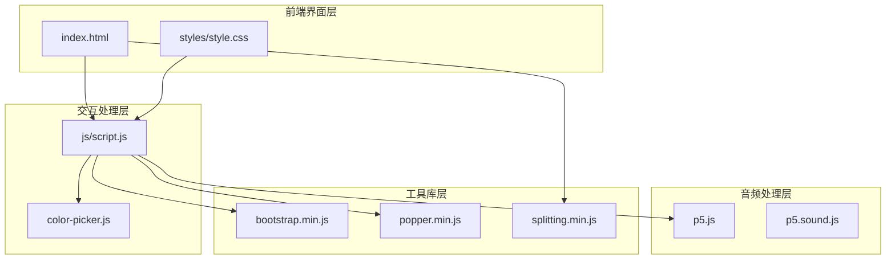
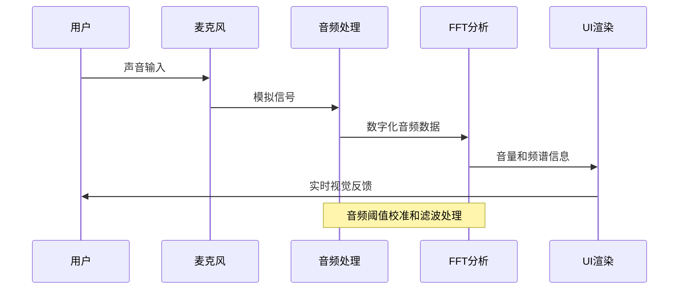
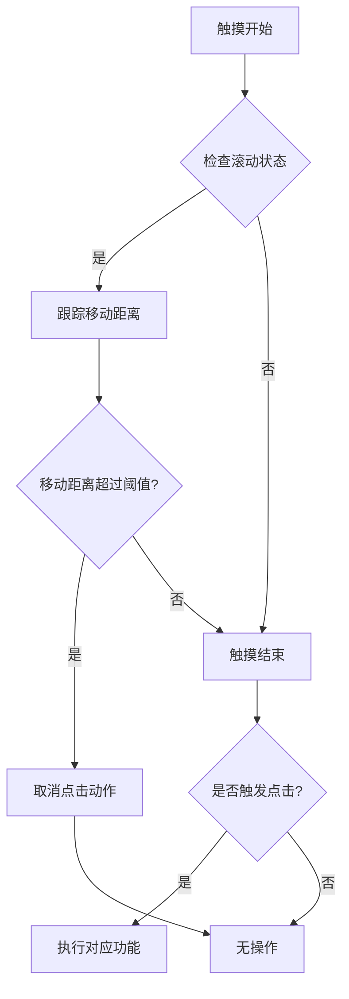
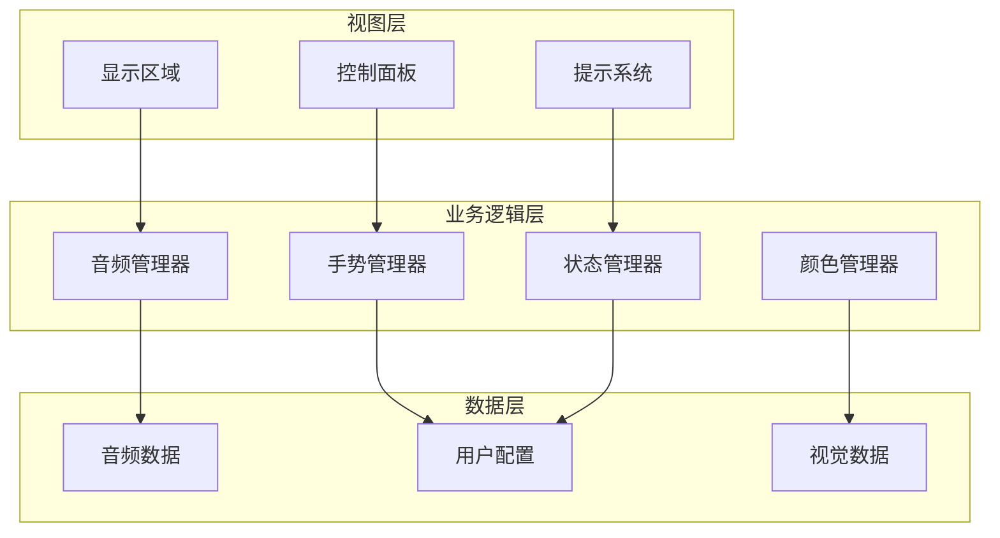
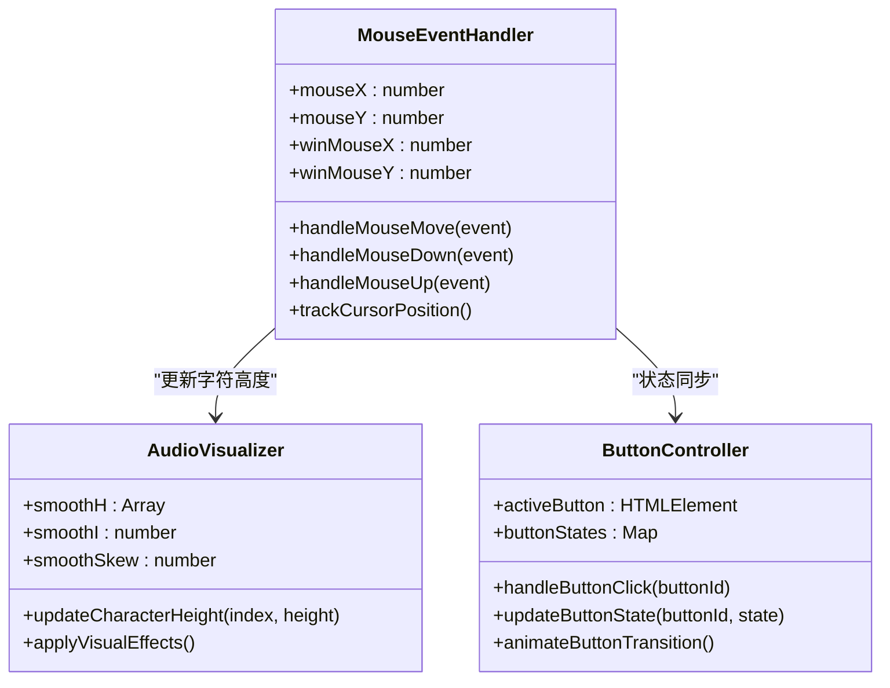
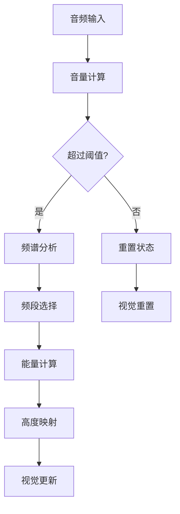
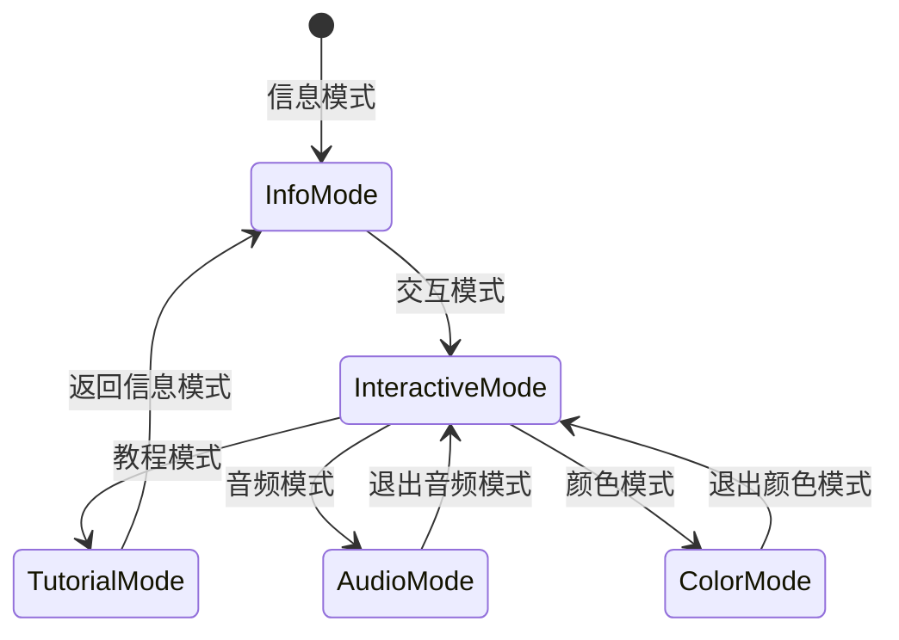
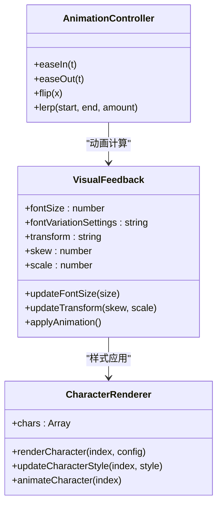
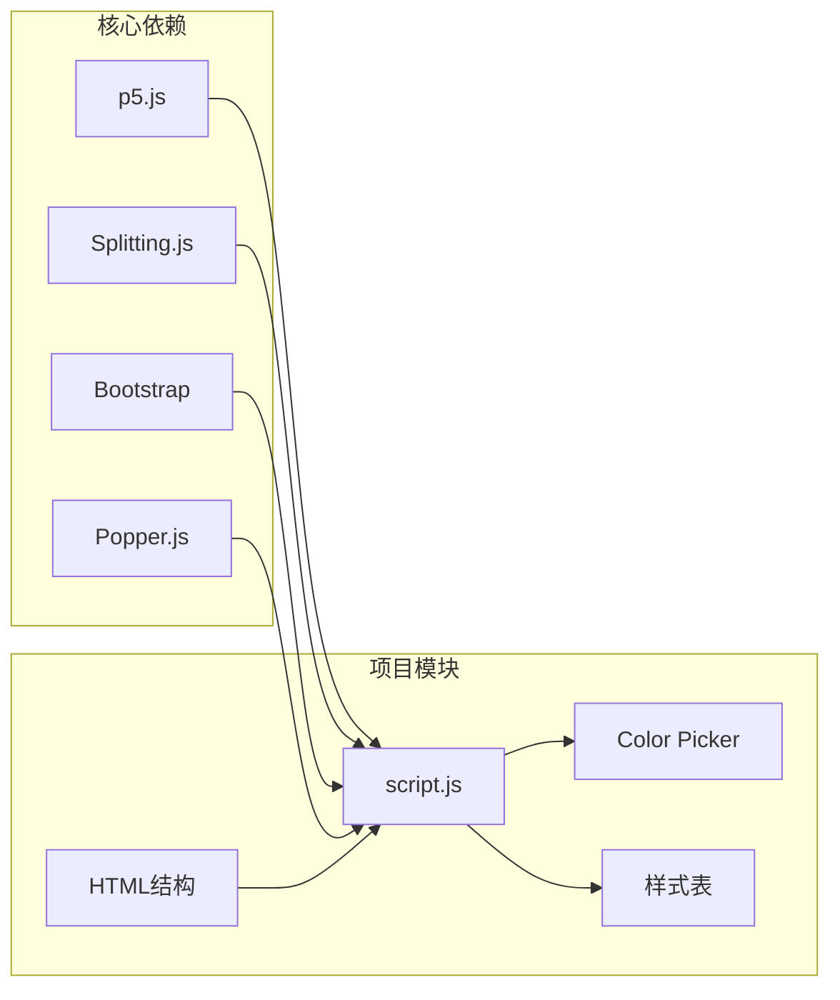
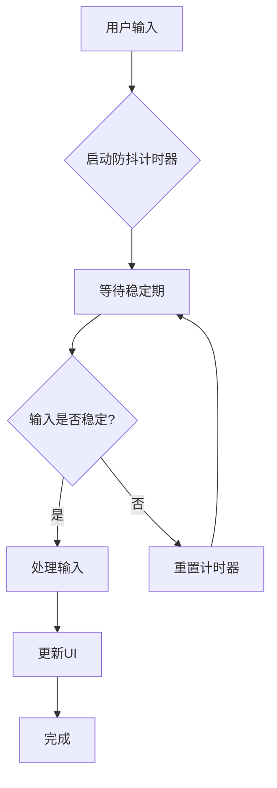

# UI交互处理

<cite>
**本文档引用的文件**
- [index.html](file://index.html)
- [script.js](file://js/script.js)
- [style.css](file://styles/style.css)
- [color-picker.js](file://js/color-picker.js)
- [bootstrap.min.js](file://js/bootstrap.min.js)
- [popper.min.js](file://js/popper.min.js)
</cite>

## 目录
1. [简介](#简介)
2. [项目结构](#项目结构)
3. [核心组件](#核心组件)
4. [架构概览](#架构概览)
5. [详细组件分析](#详细组件分析)
6. [依赖关系分析](#依赖关系分析)
7. [性能考虑](#性能考虑)
8. [故障排除指南](#故障排除指南)
9. [结论](#结论)

## 简介

MySymphosizer是一个基于Web的动态字体交互系统，通过音频输入检测、实时手势识别和视觉反馈机制，为用户提供沉浸式的音乐可视化体验。该项目采用p5.js音频库和Splitting.js文本分割技术，实现了从音频到视觉效果的完整转换流程。

## 项目结构

项目采用模块化架构设计，主要包含以下核心模块：



**图表来源**
- [index.html:1-282](file://index.html#L1-L282)
- [script.js:1-1050](file://js/script.js#L1-L1050)

**章节来源**
- [index.html:1-282](file://index.html#L1-L282)
- [script.js:1-1050](file://js/script.js#L1-L1050)

## 核心组件

### 音频输入处理系统

系统通过p5.AudioIn类实现高精度音频输入检测，支持实时音量分析和频谱分析：



**图表来源**
- [script.js:178-365](file://js/script.js#L178-L365)

### 触摸手势识别系统

针对移动设备优化的手势识别机制，支持滑动、点击和长按等操作：



**图表来源**
- [script.js:471-523](file://js/script.js#L471-L523)

### 颜色管理系统

集成的颜色选择器支持实时颜色预览和主题切换：

**章节来源**
- [script.js:1-1050](file://js/script.js#L1-L1050)
- [color-picker.js:1-231](file://js/color-picker.js#L1-L231)

## 架构概览

系统采用分层架构设计，确保各组件间的松耦合和高内聚：



**图表来源**
- [script.js:1-1050](file://js/script.js#L1-L1050)
- [style.css:1-1589](file://styles/style.css#L1-L1589)

## 详细组件分析

### 鼠标事件处理机制

系统采用统一的事件监听机制，支持桌面端的精确控制：



**图表来源**
- [script.js:388-422](file://js/script.js#L388-L422)
- [script.js:524-539](file://js/script.js#L524-L539)

### 触摸事件处理策略

移动端采用专门的触摸事件处理，优化用户体验：

**章节来源**
- [script.js:467-523](file://js/script.js#L467-L523)

### 键盘事件响应逻辑

系统支持键盘快捷键操作，提供增强的可访问性：

**章节来源**
- [script.js:874-922](file://js/script.js#L874-L922)

### 音频输入检测算法



**图表来源**
- [script.js:316-365](file://js/script.js#L316-L365)

**章节来源**
- [script.js:316-422](file://js/script.js#L316-L422)

### 光标位置跟踪系统

系统实时跟踪光标位置，实现精确的视觉反馈：

**章节来源**
- [script.js:388-406](file://js/script.js#L388-L406)

### 手势识别算法

```mermaid
stateDiagram-v2
[*] --> Idle : 初始状态
Idle --> TouchStart : 触摸开始
TouchStart --> Tracking : 开始跟踪
Tracking --> Moving : 移动中
Moving --> Scrolling : 滚动检测
Moving --> Click : 点击检测
Scrolling --> Tracking : 继续跟踪
Click --> ExecuteAction : 执行动作
ExecuteAction --> Idle : 动作完成
Scrolling --> Idle : 滚动结束
Click --> Idle : 点击结束
```

**图表来源**
- [script.js:471-523](file://js/script.js#L471-L523)

**章节来源**
- [script.js:471-523](file://js/script.js#L471-L523)

### UI状态管理系统

系统采用状态机模式管理复杂的UI状态：



**图表来源**
- [script.js:746-771](file://js/script.js#L746-L771)
- [script.js:924-930](file://js/script.js#L924-L930)

**章节来源**
- [script.js:746-771](file://js/script.js#L746-L771)

### 动画控制系统

系统使用CSS3动画和JavaScript补间函数实现流畅的动画效果：

**章节来源**
- [style.css:17-88](file://styles/style.css#L17-L88)
- [script.js:1023-1038](file://js/script.js#L1023-L1038)

### 视觉反馈机制



**图表来源**
- [script.js:408-422](file://js/script.js#L408-L422)
- [script.js:1023-1038](file://js/script.js#L1023-L1038)

**章节来源**
- [script.js:408-422](file://js/script.js#L408-L422)
- [script.js:1023-1038](file://js/script.js#L1023-L1038)

## 依赖关系分析

系统依赖关系清晰，各模块职责明确：



**图表来源**
- [index.html:15-261](file://index.html#L15-L261)
- [script.js:1-1050](file://js/script.js#L1-L1050)

**章节来源**
- [index.html:15-261](file://index.html#L15-L261)

## 性能考虑

### 交互延迟优化

系统采用多种策略优化交互延迟：

1. **事件节流**: 使用requestAnimationFrame优化动画帧率
2. **内存管理**: 及时清理DOM元素和事件监听器
3. **计算优化**: 使用lerp函数平滑数值插值，减少计算开销

### 防抖处理策略



**图表来源**
- [script.js:1007-1021](file://js/script.js#L1007-L1021)

### 跨平台兼容性

系统通过以下方式确保跨浏览器兼容：

1. **事件标准化**: 统一处理不同浏览器的事件模型
2. **渐进增强**: 基础功能在所有浏览器中可用
3. **特性检测**: 运行时检测浏览器支持的功能

**章节来源**
- [script.js:1007-1021](file://js/script.js#L1007-L1021)

## 故障排除指南

### 常见交互问题及解决方案

#### 音频权限问题
- **症状**: 麦克风无法访问，出现权限错误
- **解决方案**: 确保使用HTTPS协议，检查浏览器权限设置

#### 触摸事件冲突
- **症状**: 触摸操作不响应或响应迟缓
- **解决方案**: 检查CSS中的touch-action属性，确保适当的事件冒泡

#### 动画性能问题
- **症状**: 动画卡顿或掉帧
- **解决方案**: 减少DOM操作，使用transform属性替代布局属性

### 调试技巧

1. **开发者工具**: 使用浏览器开发者工具监控事件流
2. **性能分析**: 分析CPU和内存使用情况
3. **网络监控**: 检查资源加载状态

**章节来源**
- [script.js:384-386](file://js/script.js#L384-L386)

## 结论

MySymphosizer的UI交互处理系统展现了现代Web应用的复杂性和精密性。通过精心设计的事件处理机制、高效的音频处理算法和优雅的视觉反馈系统，为用户提供了流畅而富有表现力的交互体验。

系统的模块化架构确保了代码的可维护性和扩展性，而全面的跨平台兼容性保证了在各种设备和浏览器上的稳定运行。通过持续的性能优化和用户体验改进，该系统为Web音频可视化应用树立了优秀的实践标准。