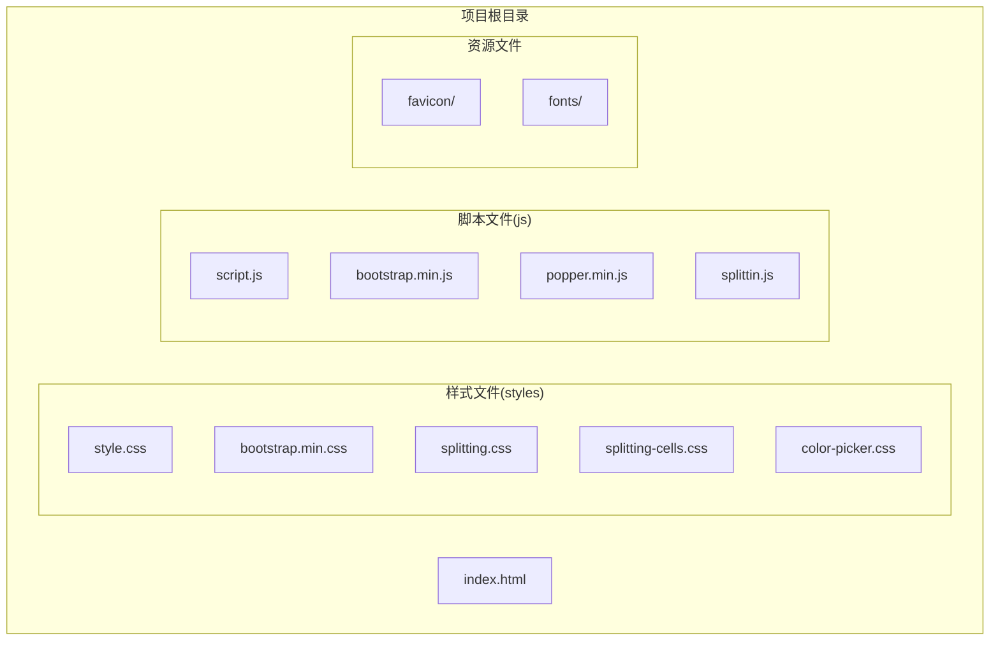
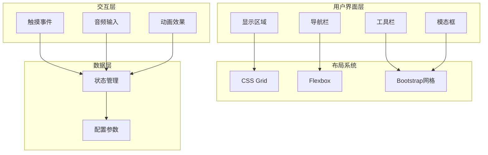
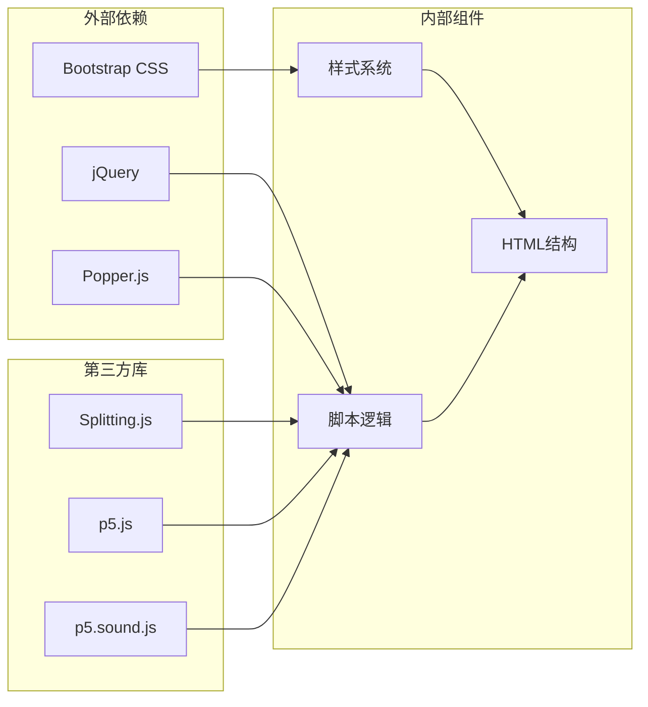

# 响应式布局设计

<cite>
**本文档引用的文件**
- [index.html](file://index.html)
- [style.css](file://styles/style.css)
- [bootstrap.min.css](file://styles/bootstrap.min.css)
- [splitting.css](file://styles/splitting.css)
- [splitting-cells.css](file://styles/splitting-cells.css)
- [color-picker.css](file://styles/color-picker.css)
- [script.js](file://js/script.js)
- [bootstrap.min.js](file://js/bootstrap.min.js)
- [popper.min.js](file://js/popper.min.js)
</cite>

## 目录
1. [项目概述](#项目概述)
2. [项目结构](#项目结构)
3. [核心组件](#核心组件)
4. [架构概览](#架构概览)
5. [详细组件分析](#详细组件分析)
6. [依赖关系分析](#依赖关系分析)
7. [性能考虑](#性能考虑)
8. [故障排除指南](#故障排除指南)
9. [结论](#结论)

## 项目概述

MySymphosizer是一个基于Web的交互式音频可视化应用程序，采用响应式设计理念构建。该项目集成了Bootstrap框架，结合原生CSS Grid和Flexbox布局系统，实现了跨设备的自适应界面设计。

该应用程序的核心特点是通过声音输入驱动文本动画效果，用户可以通过触摸屏进行交互操作，支持多种设备类型的响应式布局。

## 项目结构

项目采用模块化组织方式，主要包含以下核心目录结构：



**图表来源**
- [index.html](file://index.html)
- [style.css](file://styles/style.css)
- [bootstrap.min.css](file://styles/bootstrap.min.css)

**章节来源**
- [index.html](file://index.html)
- [style.css](file://styles/style.css)

## 核心组件

### 视口配置与基础设置

项目在HTML头部正确配置了视口元数据，确保移动设备上的正确显示：

```html
<meta name="viewport" content="width=device-width,initial-scale=1" />
```

同时设置了IE兼容性头，确保在旧版本IE浏览器中的正确渲染。

### Bootstrap框架集成

项目引入了完整的Bootstrap 4.3.1框架，包含以下核心功能：

- **网格系统**: 基于12列的响应式网格系统
- **断点设置**: xs(0px), sm(576px), md(768px), lg(992px), xl(1200px)
- **组件库**: 模态框、下拉菜单、工具提示等交互组件
- **JavaScript插件**: 完整的Bootstrap JavaScript功能

### 原生CSS Grid与Flexbox

项目采用了现代CSS布局技术：

- **Flexbox布局**: 主要用于导航栏、工具栏和内容区域的弹性布局
- **CSS Grid**: 用于复杂的网格布局需求，特别是在splitting-cells组件中
- **CSS变量**: 支持动态主题切换和响应式设计

**章节来源**
- [index.html](file://index.html)
- [bootstrap.min.css](file://styles/bootstrap.min.css)
- [style.css](file://styles/style.css)

## 架构概览

### 响应式架构设计



**图表来源**
- [style.css](file://styles/style.css)
- [script.js](file://js/script.js)

### 媒体查询实现机制

项目通过多种方式实现响应式设计：

1. **Bootstrap内置断点**: 使用框架预定义的标准断点
2. **自定义媒体查询**: 针对特定组件的响应式调整
3. **JavaScript检测**: 动态检测设备类型和屏幕尺寸

**章节来源**
- [bootstrap.min.css](file://styles/bootstrap.min.css)
- [style.css](file://styles/style.css)
- [script.js](file://js/script.js)

## 详细组件分析

### 导航栏响应式设计

导航栏采用Flexbox布局，实现了居中对齐和响应式行为：

```css
.nav {
    display: -webkit-box;
    display: -ms-flexbox;
    display: flex;
    -webkit-box-pack: center;
    -ms-flex-pack: center;
    justify-content: center;
    -webkit-box-align: center;
    -ms-flex-align: center;
    align-items: center;
}
```

导航栏在不同屏幕尺寸下具有不同的行为：
- 大屏幕：固定在顶部，内容居中显示
- 小屏幕：自动隐藏或简化显示

### 工具栏布局系统

工具栏使用Bootstrap网格系统和Flexbox相结合的方式：

```css
.menu {
    display: -webkit-box;
    display: -ms-flexbox;
    display: flex;
    -webkit-box-orient: horizontal;
    -webkit-box-direction: normal;
    -ms-flex-direction: row;
    flex-direction: row;
    -webkit-box-pack: center;
    -ms-flex-pack: center;
    justify-content: center;
    -webkit-box-align: center;
    -ms-flex-align: center;
    align-items: center;
}
```

工具栏按钮组采用Flexbox的`justify-content: center`和`align-items: center`属性，确保按钮在容器中水平和垂直居中。

### 显示区域响应式布局

显示区域使用CSS Grid布局系统，支持动态网格生成：

```css
.cell-grid {
    display: grid;
    grid-template: repeat(var(--row-total), 1fr) / repeat(var(--col-total), 1fr);
}
```

这种设计允许根据内容动态调整网格布局，同时保持响应式特性。

### 模态框响应式设计

模态框组件使用Bootstrap的响应式模态框系统：

```javascript
$('#tutorial').modal('show');
```

模态框在不同设备上具有不同的尺寸和定位策略，确保最佳的用户体验。

**章节来源**
- [style.css](file://styles/style.css)
- [bootstrap.min.css](file://styles/bootstrap.min.css)
- [script.js](file://js/script.js)

### 触摸友好交互设计

项目实现了完整的触摸事件处理机制：

```javascript
elDisplay.addEventListener('touchstart', function (e) { 
    e.preventDefault(); 
});
```

触摸事件处理包括：
- **触摸开始**: 阻止默认的触摸行为
- **触摸移动**: 支持滑动操作
- **触摸结束**: 触发相应的交互动作

**章节来源**
- [script.js](file://js/script.js)

### 字体和排版响应式设计

项目采用相对单位和动态字体缩放技术：

```css
.loading {
    font-size: min(max(20vw, 50px), 200px);
}
```

这种技术确保文本在不同屏幕尺寸下都能保持适当的可读性和视觉平衡。

## 依赖关系分析

### 组件耦合度分析



**图表来源**
- [index.html](file://index.html)
- [bootstrap.min.js](file://js/bootstrap.min.js)
- [popper.min.js](file://js/popper.min.js)
- [script.js](file://js/script.js)

### 关键依赖关系

1. **Bootstrap依赖**: 样式系统依赖Bootstrap的网格和组件系统
2. **jQuery依赖**: JavaScript功能依赖jQuery的DOM操作能力
3. **Popper.js依赖**: 位置计算和定位功能
4. **Splitting.js依赖**: 文本分割和动画效果
5. **p5.js依赖**: 音频分析和可视化

**章节来源**
- [bootstrap.min.js](file://js/bootstrap.min.js)
- [popper.min.js](file://js/popper.min.js)
- [script.js](file://js/script.js)

## 性能考虑

### 响应式性能优化

项目在性能方面采用了多项优化策略：

1. **CSS Grid优化**: 使用CSS Grid替代复杂的JavaScript布局计算
2. **Flexbox优化**: 利用Flexbox的硬件加速特性
3. **媒体查询优化**: 减少不必要的重绘和回流
4. **触摸事件优化**: 防止默认触摸行为影响性能

### 内存管理

- **事件监听器**: 正确移除不再使用的事件监听器
- **DOM操作**: 批量更新DOM以减少重排
- **动画性能**: 使用CSS3硬件加速

### 跨设备兼容性

项目通过以下方式确保跨设备兼容性：

- **渐进增强**: 基础功能在所有设备上可用
- **优雅降级**: 高级功能在不支持的设备上提供替代方案
- **特性检测**: 运行时检测浏览器支持的功能

## 故障排除指南

### 常见响应式问题

1. **布局错乱**
   - 检查CSS媒体查询是否正确应用
   - 确认视口元标签配置正确
   - 验证Bootstrap类名使用是否正确

2. **触摸事件问题**
   - 确认`touchstart`事件处理器正确绑定
   - 检查CSS `user-select`属性设置
   - 验证触摸目标元素的尺寸

3. **字体显示问题**
   - 检查自定义字体文件路径
   - 确认字体加载优先级设置
   - 验证字体回退机制

### 调试技巧

1. **开发者工具**: 使用浏览器开发者工具检查响应式断点
2. **设备模拟**: 使用浏览器的设备模拟功能测试不同屏幕尺寸
3. **性能分析**: 使用性能面板分析布局和绘制性能

**章节来源**
- [style.css](file://styles/style.css)
- [script.js](file://js/script.js)

## 结论

MySymphosizer项目展示了现代Web应用的响应式设计最佳实践。通过合理集成Bootstrap框架、采用原生CSS Grid和Flexbox布局，以及实现完整的触摸事件处理机制，该项目成功实现了跨设备的优秀用户体验。

项目的关键优势包括：

1. **完整的响应式架构**: 从基础的视口配置到复杂的布局系统
2. **现代化的CSS技术**: 充分利用CSS Grid、Flexbox和CSS变量
3. **优秀的交互设计**: 完整的触摸事件处理和用户反馈机制
4. **良好的性能表现**: 通过硬件加速和优化的布局策略

这些设计原则和实现模式可以作为其他Web应用响应式开发的参考模板，帮助开发者构建更加用户友好和性能优异的跨设备应用。