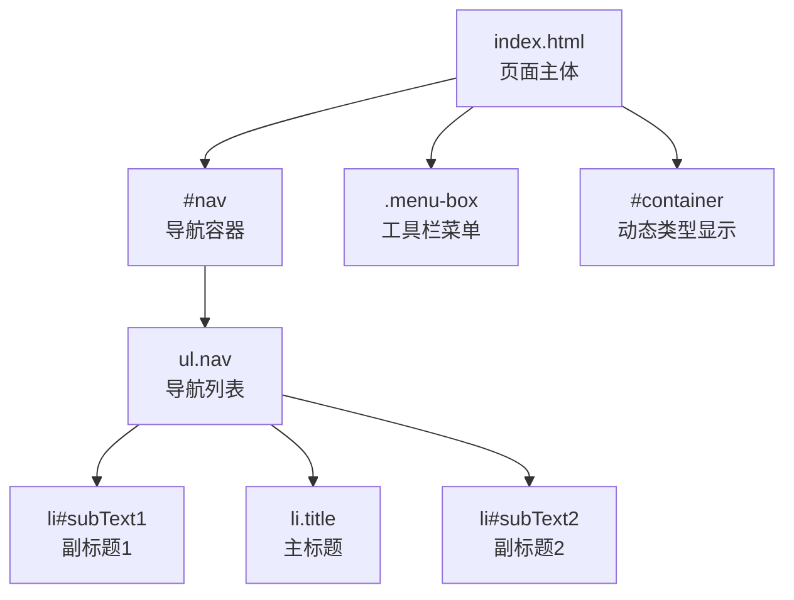
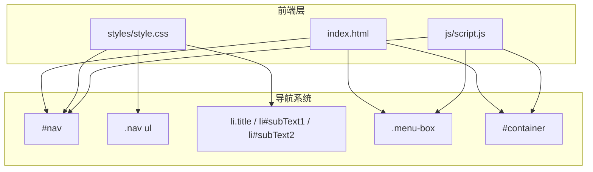
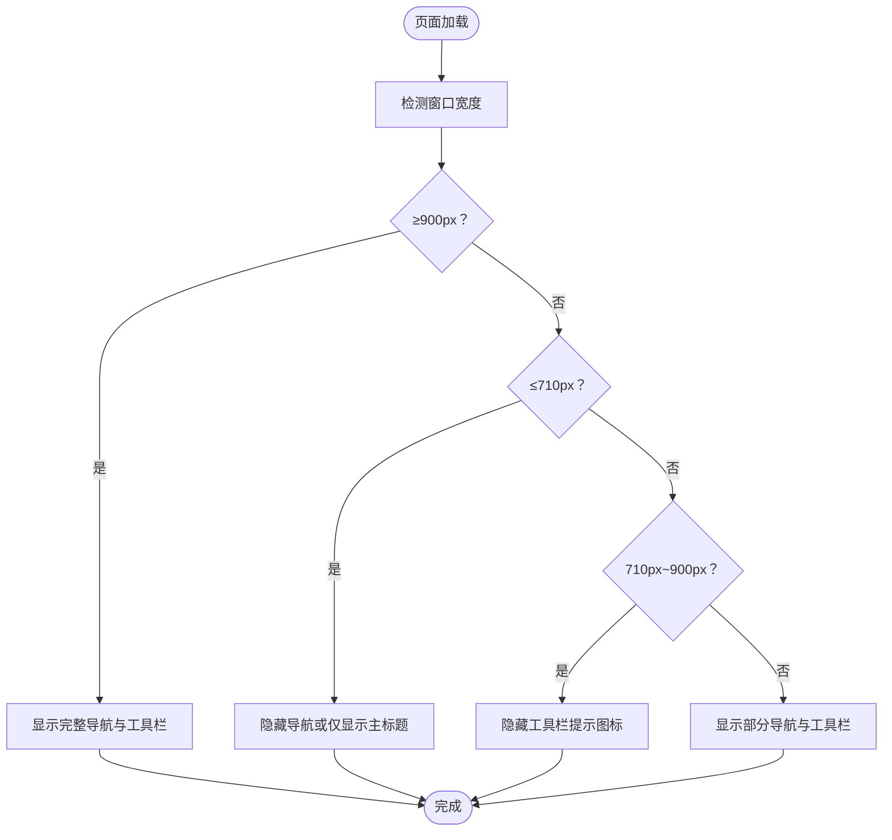
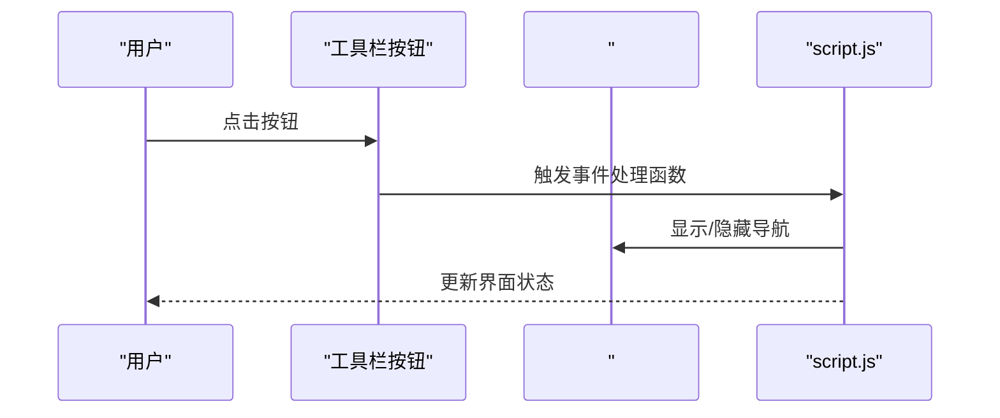
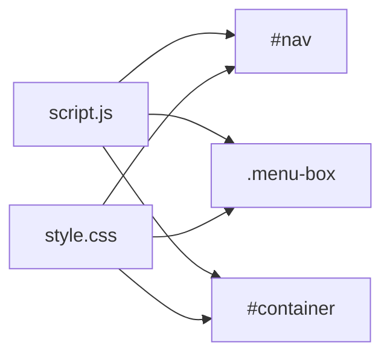

# 导航系统

<cite>
**本文档引用的文件**
- [index.html](file://index.html)
- [style.css](file://styles/style.css)
- [script.js](file://js/script.js)
</cite>

## 目录
1. [简介](#简介)
2. [项目结构](#项目结构)
3. [核心组件](#核心组件)
4. [架构总览](#架构总览)
5. [详细组件分析](#详细组件分析)
6. [依赖关系分析](#依赖关系分析)
7. [性能考量](#性能考量)
8. [故障排查指南](#故障排查指南)
9. [结论](#结论)
10. [附录](#附录)

## 简介
本文件针对 MySymphosizer 的导航系统进行深入技术文档化，重点覆盖以下方面：
- 标题栏布局设计：品牌标识展示与文字排版规则
- 导航元素组织结构：主标题、副标题与版权信息的层级关系
- 导航样式实现：字体家族、颜色搭配与间距控制
- 响应式行为：移动端折叠/展开机制
- 导航链接实现方案：平滑滚动、锚点定位与页面跳转控制
- SEO 优化与可访问性设计

## 项目结构
导航系统位于页面顶部，采用固定定位，使用列表容器承载三个文本节点（副标题1、主标题、副标题2），并配合工具栏菜单与动态类型显示区域共同构成整体界面。

图表来源
- [index.html:180-193](file://index.html#L180-L193)
- [index.html:54-178](file://index.html#L54-L178)
- [index.html:196-199](file://index.html#L196-L199)

章节来源
- [index.html:180-193](file://index.html#L180-L193)
- [index.html:54-178](file://index.html#L54-L178)
- [index.html:196-199](file://index.html#L196-L199)

## 核心组件
- 导航容器：固定于页面顶部，负责承载标题与副标题信息，支持透明度过渡与动画。
- 列表项：三个文本节点分别对应副标题1、主标题、副标题2，采用统一的字号与行高，居中对齐。
- 工具栏菜单：底部固定工具条，包含多个功能按钮，用于切换导航可见性、显示信息面板等。
- 动态类型显示：输入框与显示区，用于实时渲染用户输入的文本，与导航系统协同工作。

章节来源
- [index.html:180-193](file://index.html#L180-L193)
- [index.html:54-178](file://index.html#L54-L178)
- [index.html:196-199](file://index.html#L196-L199)

## 架构总览
导航系统由 HTML 结构、CSS 样式与 JavaScript 控制逻辑三部分组成，通过媒体查询实现响应式布局，通过事件监听实现交互控制。

图表来源
- [index.html:180-193](file://index.html#L180-L193)
- [index.html:54-178](file://index.html#L54-L178)
- [index.html:196-199](file://index.html#L196-L199)
- [style.css:580-638](file://styles/style.css#L580-L638)
- [script.js:435-436](file://js/script.js#L435-L436)

## 详细组件分析

### 标题栏布局设计与品牌标识
- 品牌标识展示：主标题“SYMPHOSIZER”作为品牌标识，采用专用字体家族，字号在桌面端随分辨率递增，移动端默认隐藏，仅在特定状态下显示。
- 文字排版规则：
  - 字体家族：主标题使用“ABC Symphony Headline”，副标题使用“ABC Symphony Text”。
  - 字号与行高：主标题在桌面端按屏幕宽度自适应增大；副标题统一使用较小字号与行高，确保信息密度适中。
  - 对齐与间距：列表项水平居中，垂直方向上通过外边距控制上下间距，保证视觉平衡。

章节来源
- [index.html:180-193](file://index.html#L180-L193)
- [style.css:613-641](file://styles/style.css#L613-L641)
- [style.css:990-1088](file://styles/style.css#L990-L1088)

### 导航元素组织结构与层级关系
- 层级关系：
  - 副标题1：位于主标题上方，用于强调项目特性与定位。
  - 主标题：品牌标识，位于中央位置，是导航的核心焦点。
  - 副标题2：位于主标题下方，用于展示合作方与版权信息。
- 居中与对齐：通过 Flexbox 实现水平与垂直居中，确保在不同分辨率下保持一致的视觉重心。

章节来源
- [index.html:180-193](file://index.html#L180-L193)
- [style.css:580-638](file://styles/style.css#L580-L638)

### 导航样式实现
- 字体家族：主标题使用“ABC Symphony Headline”，副标题使用“ABC Symphony Text”，体现品牌一致性。
- 颜色搭配：导航文本颜色与主题色保持一致，通过 JavaScript 在颜色切换时同步更新。
- 间距控制：列表项通过外边距控制上下间距，确保三段信息在视觉上分层清晰。

章节来源
- [style.css:613-641](file://styles/style.css#L613-L641)
- [style.css:990-1088](file://styles/style.css#L990-L1088)
- [script.js:946-954](file://js/script.js#L946-L954)

### 响应式行为与移动端折叠/展开
- 桌面端（≥900px）：导航与工具栏均完全可见，副标题内容完整显示。
- 中等屏（710px–900px）：工具栏提示图标隐藏，导航透明度过渡至不透明。
- 移动端（≤710px）：
  - 导航默认隐藏或仅显示主标题，避免遮挡输入与显示区域。
  - 工具栏按钮在触摸事件中触发导航显示或信息面板切换。
  - 颜色选择器与滑杆控件在移动端尺寸与布局上进行适配。

图表来源
- [style.css:990-1088](file://styles/style.css#L990-L1088)
- [style.css:1113-1156](file://styles/style.css#L1113-L1156)
- [style.css:1158-1350](file://styles/style.css#L1158-L1350)

章节来源
- [style.css:990-1088](file://styles/style.css#L990-L1088)
- [style.css:1113-1156](file://styles/style.css#L1113-L1156)
- [style.css:1158-1350](file://styles/style.css#L1158-L1350)

### 导航链接实现方案
- 平滑滚动：当前导航系统未直接实现平滑滚动到锚点的功能，但可通过扩展在点击导航项时添加滚动行为。
- 锚点定位：建议在主标题与副标题处设置锚点，结合 JavaScript 实现点击后平滑滚动至目标区域。
- 页面跳转控制：工具栏按钮通过事件绑定实现功能切换，如显示/隐藏导航、打开信息面板等。可在此基础上扩展为页面跳转控制。

图表来源
- [script.js:518-537](file://js/script.js#L518-L537)
- [script.js:745-770](file://js/script.js#L745-L770)
- [script.js:839-922](file://js/script.js#L839-L922)

章节来源
- [script.js:518-537](file://js/script.js#L518-L537)
- [script.js:745-770](file://js/script.js#L745-L770)
- [script.js:839-922](file://js/script.js#L839-L922)

### SEO 优化与可访问性设计
- SEO 优化：
  - 使用语义化标签与结构，主标题作为品牌标识，副标题提供上下文信息。
  - 可在主标题处添加 meta 描述与关键词，提升搜索引擎识别度。
- 可访问性设计：
  - 当前导航系统未包含 ARIA 属性与键盘导航支持，建议补充：
    - 为导航容器添加 role="banner" 或 aria-label。
    - 为主标题与副标题添加适当的语义角色与标题层级。
    - 为工具栏按钮添加 aria-expanded、aria-controls 等属性以指示状态。

章节来源
- [index.html:180-193](file://index.html#L180-L193)
- [style.css:580-638](file://styles/style.css#L580-L638)

## 依赖关系分析
导航系统与工具栏、动态类型显示之间存在紧密耦合关系，主要体现在：
- 尺寸检测与状态切换：根据窗口尺寸决定导航与工具栏的显示状态。
- 颜色同步：颜色切换时同步更新导航文本颜色。
- 交互联动：工具栏按钮事件会触发导航显示/隐藏与信息面板切换。

图表来源
- [script.js:435-436](file://js/script.js#L435-L436)
- [script.js:839-922](file://js/script.js#L839-L922)
- [style.css:580-638](file://styles/style.css#L580-L638)

章节来源
- [script.js:435-436](file://js/script.js#L435-L436)
- [script.js:839-922](file://js/script.js#L839-L922)
- [style.css:580-638](file://styles/style.css#L580-L638)

## 性能考量
- 渲染优化：导航使用固定定位与透明度过渡，避免频繁重排。
- 媒体查询：通过断点控制不同设备下的显示策略，减少不必要的 DOM 操作。
- 事件节流：工具栏按钮事件在移动端通过触摸事件绑定，避免重复触发。

## 故障排查指南
- 导航不显示或显示异常：
  - 检查窗口尺寸是否满足断点条件。
  - 确认工具栏按钮事件是否正确触发导航显示/隐藏。
- 颜色不一致：
  - 确认颜色切换函数是否正确更新导航文本颜色。
- 响应式布局错乱：
  - 检查媒体查询断点与样式优先级，确保在目标分辨率下应用正确的样式。

章节来源
- [script.js:839-922](file://js/script.js#L839-L922)
- [script.js:946-954](file://js/script.js#L946-L954)
- [style.css:1158-1350](file://styles/style.css#L1158-L1350)

## 结论
MySymphosizer 的导航系统以简洁的三层信息结构为核心，通过响应式断点与工具栏联动实现跨设备的一致体验。建议在未来版本中增强可访问性与 SEO 支持，并考虑引入锚点与平滑滚动以提升导航可用性。

## 附录
- 相关文件路径与行号：
  - [index.html 导航结构:180-193](file://index.html#L180-L193)
  - [index.html 工具栏结构:54-178](file://index.html#L54-L178)
  - [index.html 动态类型显示:196-199](file://index.html#L196-L199)
  - [style.css 导航样式定义:580-638](file://styles/style.css#L580-L638)
  - [style.css 响应式断点:990-1350](file://styles/style.css#L990-L1350)
  - [script.js 导航控制逻辑:435-922](file://js/script.js#L435-L922)