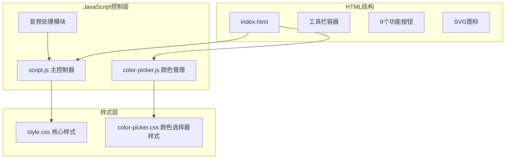
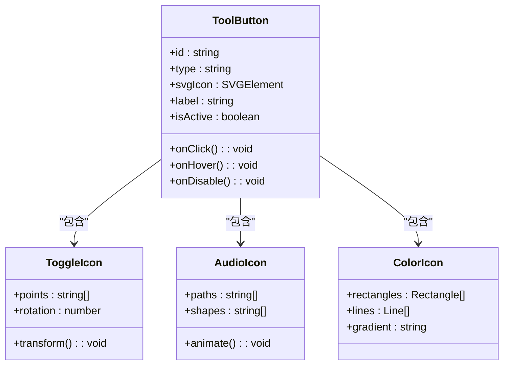
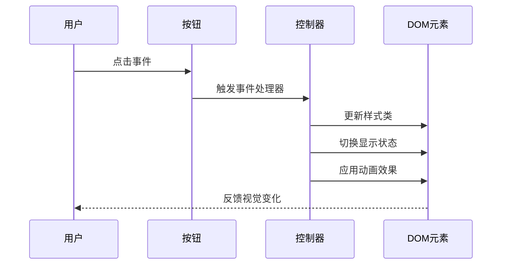
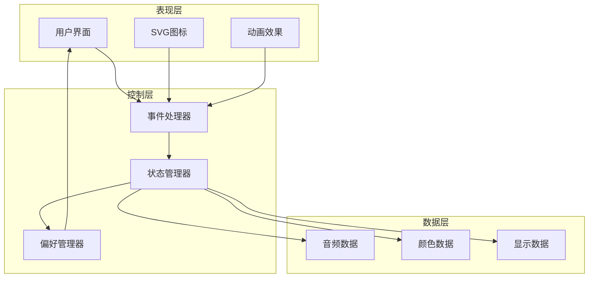
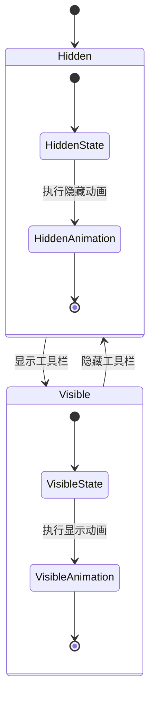
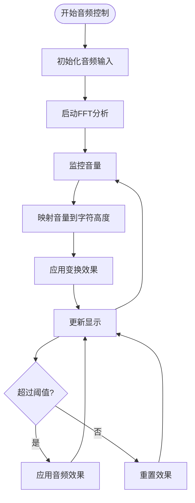
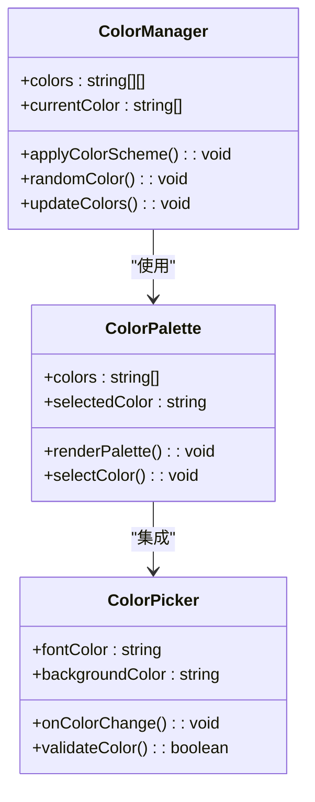
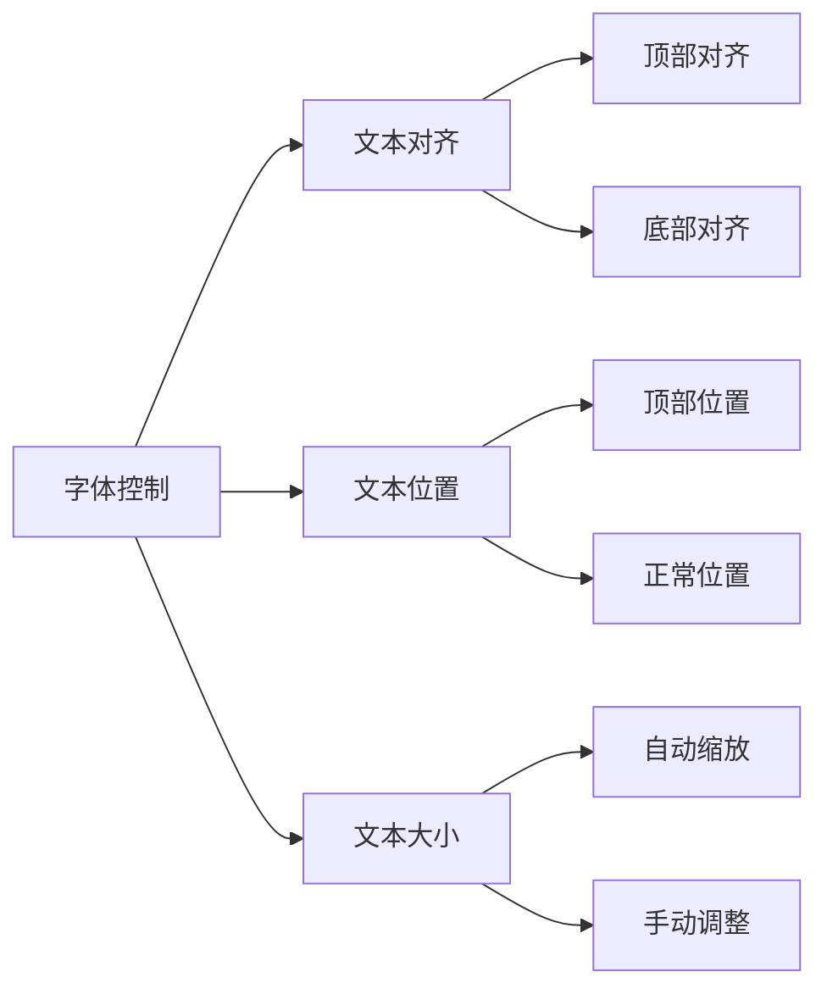
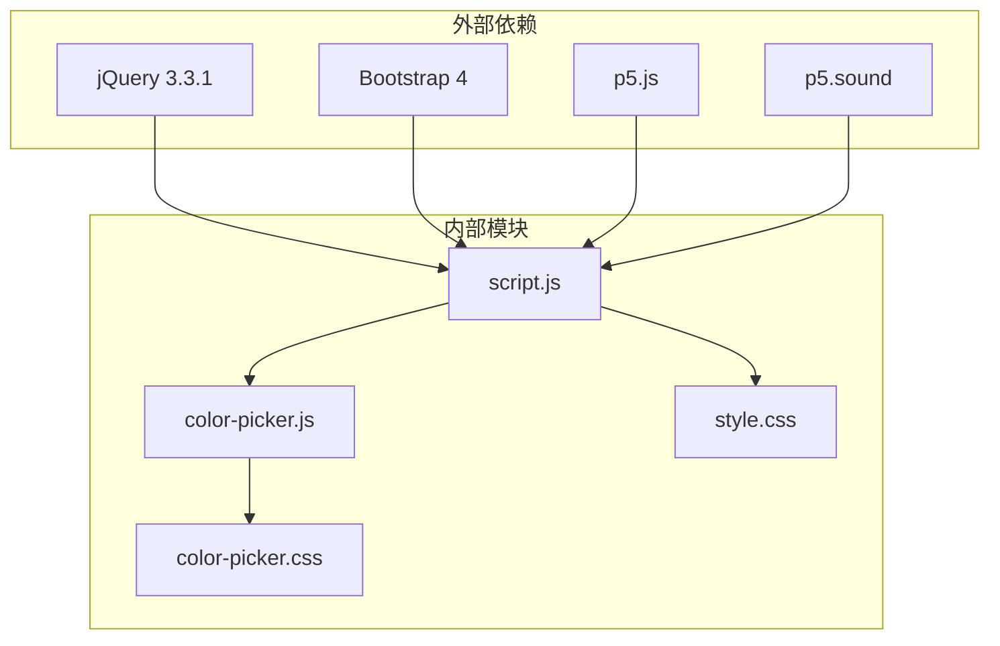
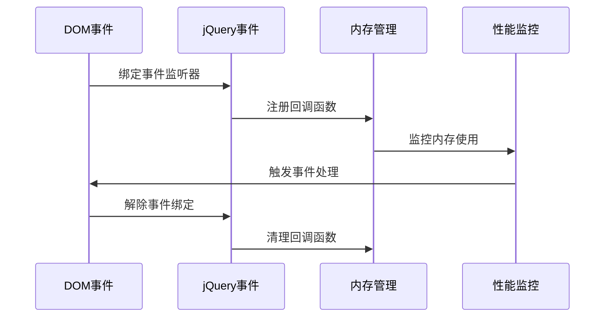

# 工具栏控制系统

<cite>
**本文档引用的文件**
- [index.html](file://index.html)
- [script.js](file://js/script.js)
- [style.css](file://styles/style.css)
- [color-picker.js](file://js/color-picker.js)
- [color-picker.css](file://styles/color-picker.css)
</cite>

## 目录
1. [简介](#简介)
2. [项目结构](#项目结构)
3. [核心组件](#核心组件)
4. [架构概览](#架构概览)
5. [详细组件分析](#详细组件分析)
6. [依赖关系分析](#依赖关系分析)
7. [性能考虑](#性能考虑)
8. [故障排除指南](#故障排除指南)
9. [结论](#结论)

## 简介

MySymphosizer的工具栏控制系统是一个集成了SVG图标系统、音频控制、颜色管理和显示选项的综合界面组件。该系统通过精美的矢量图形和流畅的动画效果，为用户提供直观的交互体验。

系统的核心功能包括：
- SVG图标驱动的工具栏界面
- 实时音频可视化控制
- 多种颜色主题管理
- 响应式显示控制
- 流畅的动画过渡效果

## 项目结构

工具栏控制系统主要由以下组件构成：

**图表来源**
- [index.html:53-178](file://index.html#L53-L178)
- [script.js:111-121](file://js/script.js#L111-L121)
- [style.css:643-820](file://styles/style.css#L643-L820)

**章节来源**
- [index.html:1-282](file://index.html#L1-L282)
- [script.js:1-1049](file://js/script.js#L1-L1049)
- [style.css:1-1573](file://styles/style.css#L1-L1573)

## 核心组件

### SVG图标系统

工具栏使用精心设计的SVG图标作为视觉元素，每个按钮都包含矢量图形和文本标签：

**图表来源**
- [index.html:67-175](file://index.html#L67-L175)

### 按钮交互逻辑

系统实现了完整的按钮交互生命周期：

**图表来源**
- [script.js:552-743](file://js/script.js#L552-L743)

**章节来源**
- [index.html:53-178](file://index.html#L53-L178)
- [script.js:111-145](file://js/script.js#L111-L145)

## 架构概览

工具栏控制系统采用分层架构设计，确保了良好的模块化和可维护性：

**图表来源**
- [script.js:540-836](file://js/script.js#L540-L836)
- [style.css:170-206](file://styles/style.css#L170-L206)

## 详细组件分析

### 工具栏显示/隐藏控制

工具栏的显示和隐藏控制是通过CSS类切换和动画过渡实现的：

**图表来源**
- [script.js:772-836](file://js/script.js#L772-L836)
- [style.css:310-356](file://styles/style.css#L310-L356)

#### 显示控制机制

工具栏的显示控制通过以下步骤实现：

1. **状态检测**：检查当前工具栏状态（显示/隐藏）
2. **位置计算**：根据屏幕尺寸计算按钮位置
3. **透明度控制**：渐变显示/隐藏按钮
4. **动画应用**：应用CSS动画效果

**章节来源**
- [script.js:772-836](file://js/script.js#L772-L836)
- [style.css:643-668](file://styles/style.css#L643-L668)

### 音频控制功能

音频控制功能通过麦克风输入和FFT分析实现动态可视化：

**图表来源**
- [script.js:301-426](file://js/script.js#L301-L426)
- [script.js:923-929](file://js/script.js#L923-L929)

#### 音频阈值管理

系统实现了智能的音频阈值管理机制：

- **移动设备阈值**：2.2
- **桌面设备阈值**：1.25
- **动态调整**：根据设备类型自动调整敏感度

**章节来源**
- [script.js:466-538](file://js/script.js#L466-L538)
- [script.js:1006-1012](file://js/script.js#L1006-L1012)

### 颜色管理系统

颜色管理系统提供了丰富的配色方案和实时预览功能：

**图表来源**
- [script.js:63-106](file://js/script.js#L63-L106)
- [color-picker.js:1-231](file://js/color-picker.js#L1-L231)

#### 颜色主题库

系统内置了32种精心设计的颜色组合，每种组合都经过优化以确保最佳的视觉效果：

**经典配色方案**：
- 黄金与蓝色：#FCE74D/#68C1DC
- 绿色与蓝色：#183F25/#63D13E
- 紫色与红色：#E93DE0/#502827

**章节来源**
- [script.js:63-106](file://js/script.js#L63-L106)
- [color-picker.js:4-27](file://js/color-picker.js#L4-L27)

### 字体调整功能

字体调整功能允许用户控制文本的显示方式和位置：

**图表来源**
- [script.js:673-693](file://js/script.js#L673-L693)
- [style.css:979-981](file://styles/style.css#L979-L981)

**章节来源**
- [script.js:673-693](file://js/script.js#L673-L693)
- [style.css:979-981](file://styles/style.css#L979-L981)

### 菜单按钮功能分类

工具栏包含9个功能按钮，每个按钮都有特定的功能：

| 按钮编号 | 功能名称 | 图标类型 | 主要作用 |
|---------|----------|----------|----------|
| btn_1 | 工具栏切换 | 旋转箭头 | 显示/隐藏工具栏 |
| btn_2 | 音频启动 | 音符图标 | 启动音频输入 |
| btn_3 | 音频停止 | 停止符号 | 停止音频输入 |
| btn_4 | 字体颜色 | 矩形块 | 更改字体颜色 |
| btn_5 | 背景色 | 网格图案 | 更改背景颜色 |
| btn_6 | 随机颜色 | 波浪线 | 应用随机颜色组合 |
| btn_7 | 文本顶部 | 上箭头 | 文本顶部对齐 |
| btn_8 | 文本底部 | 下箭头 | 文本底部对齐 |
| btn_9 | 信息显示 | 问号图标 | 显示/隐藏帮助信息 |

**章节来源**
- [index.html:67-175](file://index.html#L67-L175)
- [script.js:552-743](file://js/script.js#L552-L743)

## 依赖关系分析

工具栏控制系统各组件之间的依赖关系如下：

**图表来源**
- [index.html:254-261](file://index.html#L254-L261)
- [script.js:1-10](file://js/script.js#L1-L10)

### 事件监听机制

系统采用了多种事件监听机制来确保响应性和性能：

**图表来源**
- [script.js:523-538](file://js/script.js#L523-L538)
- [script.js:1006-1020](file://js/script.js#L1006-L1020)

**章节来源**
- [script.js:523-538](file://js/script.js#L523-L538)
- [script.js:1006-1020](file://js/script.js#L1006-L1020)

## 性能考虑

### 动画性能优化

系统在动画性能方面采用了多项优化策略：

1. **硬件加速**：使用CSS3 transform属性启用GPU加速
2. **减少重绘**：通过批量DOM操作减少页面重绘
3. **动画队列**：合理安排动画执行顺序避免冲突

### 内存管理

- **事件解绑**：在适当时机解除事件监听器绑定
- **对象复用**：重用DOM元素避免频繁创建销毁
- **垃圾回收**：及时清理不再使用的变量和引用

## 故障排除指南

### 常见问题及解决方案

**问题1：按钮无响应**
- 检查按钮是否被禁用
- 验证事件监听器是否正确绑定
- 确认CSS样式未阻止交互

**问题2：SVG图标显示异常**
- 检查SVG路径定义是否正确
- 验证CSS样式覆盖情况
- 确认浏览器兼容性

**问题3：音频控制失效**
- 检查麦克风权限设置
- 验证音频上下文初始化
- 确认FFT分析参数配置

**章节来源**
- [script.js:122-145](file://js/script.js#L122-L145)
- [script.js:923-929](file://js/script.js#L923-L929)

## 结论

MySymphosizer的工具栏控制系统展现了现代Web应用的优秀实践，通过精心设计的SVG图标系统、流畅的动画效果和完善的交互逻辑，为用户提供了卓越的使用体验。

系统的主要优势包括：
- **模块化设计**：清晰的组件分离便于维护和扩展
- **响应式布局**：适配各种设备和屏幕尺寸
- **性能优化**：合理的资源管理和动画优化
- **用户体验**：直观的交互设计和即时反馈

未来可以考虑的改进方向：
- 增加键盘导航支持
- 优化移动端触摸体验
- 扩展颜色主题数量
- 添加用户偏好持久化