# 模态对话框系统

<cite>
**本文档引用的文件**
- [index.html](file://index.html)
- [script.js](file://js/script.js)
- [bootstrap.min.js](file://js/bootstrap.min.js)
- [style.css](file://styles/style.css)
- [splitting.min.js](file://js/splitting.min.js)
- [splitting.css](file://styles/splitting.css)
- [color-picker.js](file://js/color-picker.js)
</cite>

## 目录
1. [简介](#简介)
2. [项目结构](#项目结构)
3. [核心组件](#核心组件)
4. [架构概览](#架构概览)
5. [详细组件分析](#详细组件分析)
6. [依赖关系分析](#依赖关系分析)
7. [性能考虑](#性能考虑)
8. [故障排除指南](#故障排除指南)
9. [结论](#结论)

## 简介

MySymphosizer是一个基于Web的交互式音频可视化应用程序，其模态对话框系统是用户体验的核心组成部分。该系统集成了Bootstrap模态框与Splitting.js文本动画库，实现了完整的教程引导界面，包括静态背景配置、键盘事件处理和焦点管理。

本系统的主要特点包括：
- 基于Bootstrap 4.3.1的模态框框架
- Splitting.js驱动的动态文本分割和动画
- 自定义的模态框尺寸自适应机制
- 完整的键盘导航和可访问性支持
- 动态内容加载和内存管理

## 项目结构

项目采用模块化架构，主要文件组织如下：

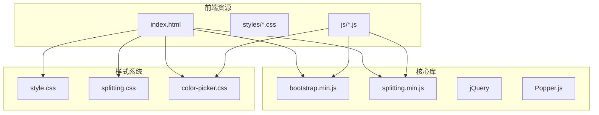

**图表来源**
- [index.html:1-282](file://index.html#L1-L282)
- [bootstrap.min.js:1-7](file://js/bootstrap.min.js#L1-L7)

**章节来源**
- [index.html:1-282](file://index.html#L1-L282)

## 核心组件

### 模态框容器结构

系统使用标准的Bootstrap模态框结构，包含以下关键元素：

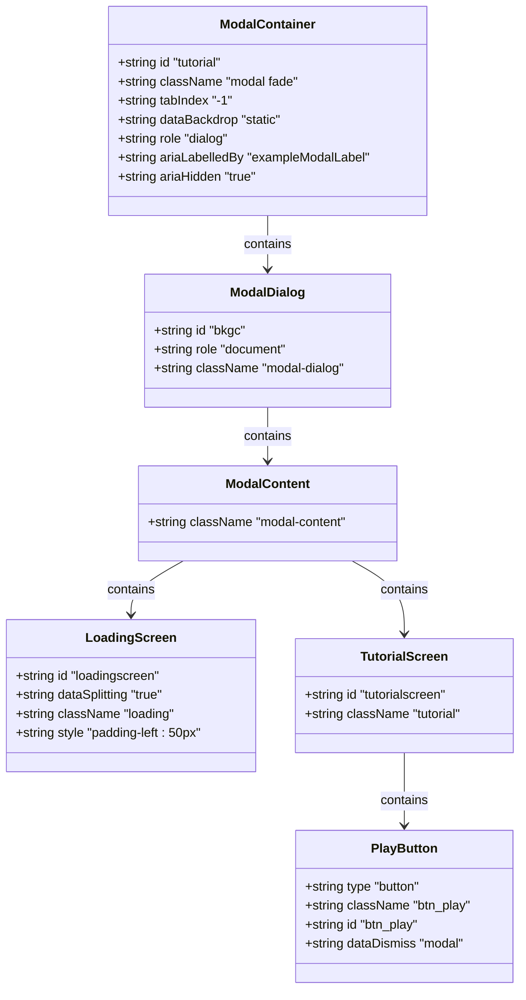

**图表来源**
- [index.html:24-39](file://index.html#L24-L39)

### Splitting.js集成架构

Splitting.js提供了强大的文本分割和动画能力：

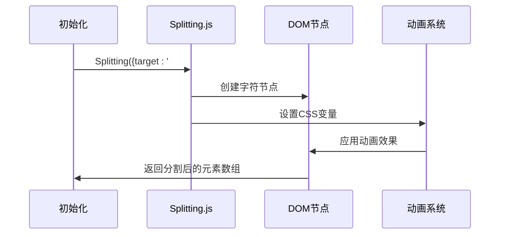

**图表来源**
- [script.js:239-242](file://js/script.js#L239-L242)
- [splitting.min.js:16-25](file://js/splitting.min.js#L16-L25)

**章节来源**
- [index.html:24-39](file://index.html#L24-L39)
- [script.js:239-242](file://js/script.js#L239-L242)

## 架构概览

### 模态框生命周期管理

系统实现了完整的模态框生命周期管理，包括显示、隐藏和状态转换：

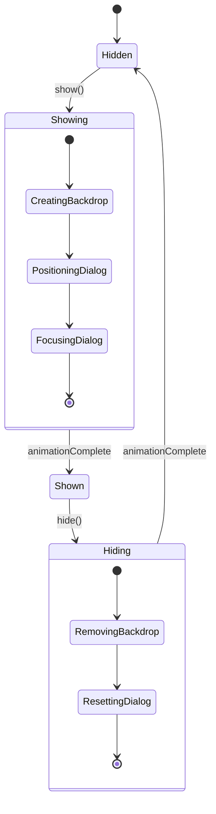

**图表来源**
- [bootstrap.min.js:562-620](file://js/bootstrap.min.js#L562-L620)

### 动态内容加载机制

教程界面采用分阶段加载策略：

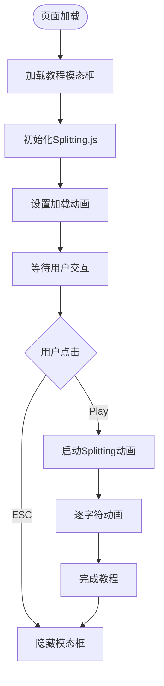

**图表来源**
- [index.html:29-35](file://index.html#L29-L35)
- [script.js:429-435](file://js/script.js#L429-L435)

**章节来源**
- [bootstrap.min.js:562-620](file://js/bootstrap.min.js#L562-L620)

## 详细组件分析

### Bootstrap模态框集成

#### 静态背景配置

系统使用`data-backdrop="static"`确保模态框在点击背景时不会关闭：

```javascript
// 模态框配置
<div class="modal fade" id="tutorial" tabindex="-1" 
     data-backdrop="static" role="dialog"
     aria-labelledby="exampleModalLabel" aria-hidden="true">
```

这种配置提供了更好的用户体验，因为用户必须明确选择退出教程。

#### 键盘事件处理

Bootstrap模态框内置了完整的键盘事件处理机制：

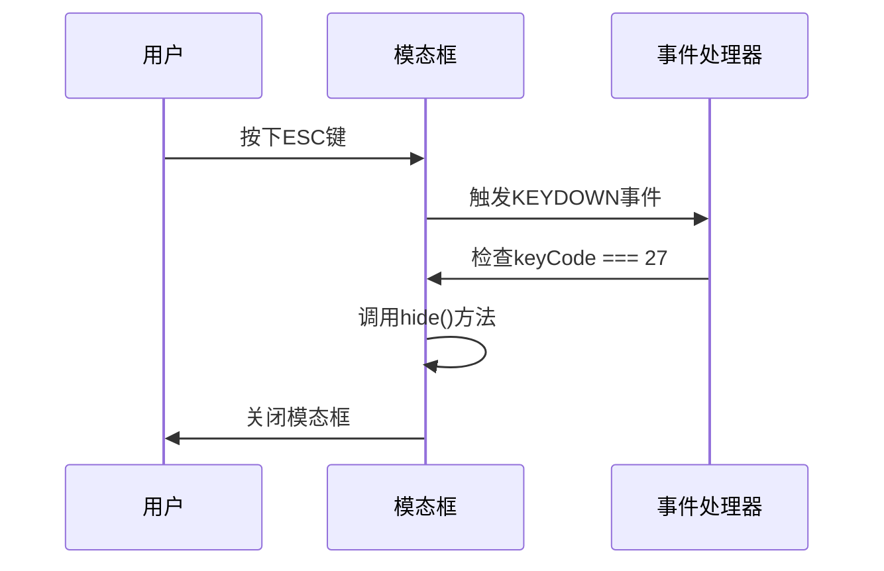

**图表来源**
- [bootstrap.min.js:605-620](file://js/bootstrap.min.js#L605-L620)

#### 焦点管理

系统实现了智能的焦点管理，确保键盘导航的流畅性：

```javascript
// 焦点强制机制
_setEscapeEvent: function() {
    var e = this;
    this._isShown && this._config.keyboard ?
        g(this._element).on(re.KEYDOWN_DISMISS, function(t) {
            27 === t.which && (t.preventDefault(), e.hide())
        }) :
        this._isShown || g(this._element).off(re.KEYDOWN_DISMISS)
}

_enforceFocus: function() {
    var e = this;
    g(document).off(re.FOCUSIN).on(re.FOCUSIN, function(t) {
        document !== t.target && 
        e._element !== t.target && 
        0 === g(e._element).has(t.target).length && 
        e._element.focus()
    })
}
```

**图表来源**
- [bootstrap.min.js:605-620](file://js/bootstrap.min.js#L605-L620)

**章节来源**
- [index.html:24-26](file://index.html#L24-L26)
- [bootstrap.min.js:605-620](file://js/bootstrap.min.js#L605-L620)

### Splitting.js集成实现

#### 动态内容加载

Splitting.js提供了灵活的文本分割和动画能力：

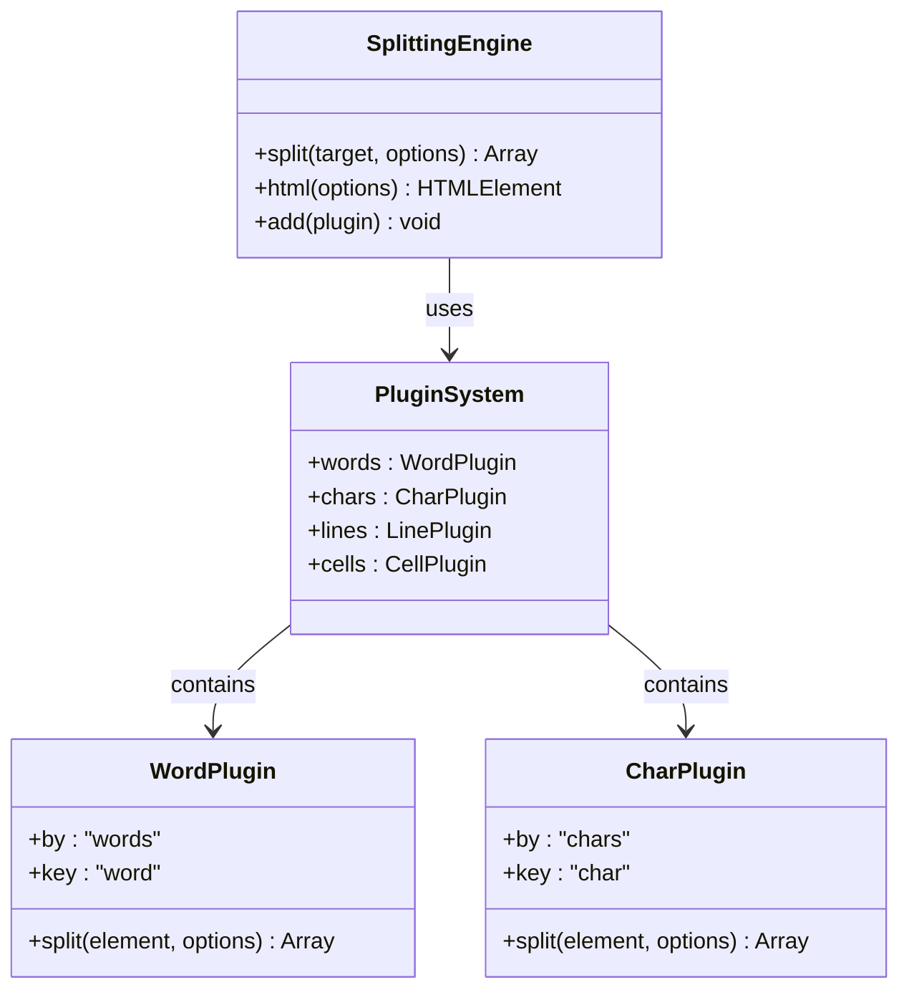

**图表来源**
- [splitting.min.js:16-25](file://js/splitting.min.js#L16-L25)

#### 动画序列控制

系统通过CSS变量实现复杂的动画序列控制：

```css
/* Splitting.js CSS变量定义 */
.splitting {
    --word-center: calc((var(--word-total) - 1) / 2);
    --char-center: calc((var(--char-total) - 1) / 2);
    --line-center: calc((var(--line-total) - 1) / 2);
}

.splitting .char {
    --char-percent: calc(var(--char-index) / var(--char-total));
    --char-offset: calc(var(--char-index) - var(--char-center));
    --distance: calc((var(--char-offset) * var(--char-offset)) / var(--char-center));
    --distance-sine: calc(var(--char-offset) / var(--char-center));
    --distance-percent: calc((var(--distance) / var(--char-center)));
}
```

**图表来源**
- [splitting.css:28-66](file://styles/splitting.css#L28-L66)

**章节来源**
- [splitting.min.js:16-25](file://js/splitting.min.js#L16-L25)
- [splitting.css:28-66](file://styles/splitting.css#L28-L66)

### 模态框生命周期管理

#### 显示/隐藏动画

系统实现了平滑的显示和隐藏动画：

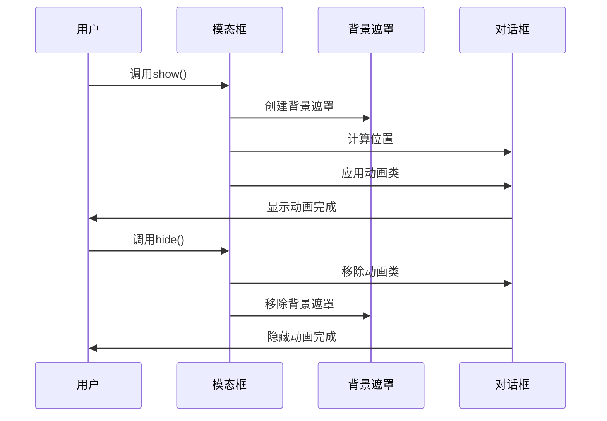

**图表来源**
- [bootstrap.min.js:562-620](file://js/bootstrap.min.js#L562-L620)

#### 背景遮罩管理

背景遮罩的透明度和交互行为：

```css
/* 背景遮罩样式 */
.modal-backdrop.show {
    opacity: 0 !important;
}

/* 模态框对话框样式 */
.modal-dialog {
    position: relative;
    max-width: 100%;
    height: 100%;
    margin: 0px;
    background-color: transparent;
}

.modal-content {
    background: none;
    border: none;
    margin: auto;
    height: -webkit-fit-content;
    height: -moz-fit-content;
    height: fit-content;
    margin: auto;
    position: absolute;
    top: 0;
    left: 0;
    bottom: 0;
    right: 0;
}
```

**图表来源**
- [style.css:543-577](file://styles/style.css#L543-L577)

**章节来源**
- [bootstrap.min.js:562-620](file://js/bootstrap.min.js#L562-L620)
- [style.css:543-577](file://styles/style.css#L543-L577)

### 尺寸自适应机制

#### 窗口大小变化监听

系统实现了响应式的尺寸调整机制：

```javascript
// 窗口大小变化处理
$(window).resize(function() {
    modalResize();
})

function modalResize() {
    var winWidth = $(document.body).width();
    var modalWidth = $("#docModalContent").width();
    var width = (winWidth - modalWidth) / 2 + "px"
    $("#myModal").find(".modal-dialog").css({
        'margin-left': width
    });
}
```

#### 居中定位算法

模态框采用绝对定位和CSS变量实现精确居中：

```css
/* 绝对居中定位 */
.modal-content {
    position: absolute;
    top: 0;
    left: 0;
    bottom: 0;
    right: 0;
}

/* 动画过渡控制 */
.modal.fade .modal-dialog {
    -webkit-transition: -webkit-transform 0s;
    transition: -webkit-transform 0s;
    transition: transform 0s;
    transition: transform 0s, -webkit-transform 0s;
}
```

**图表来源**
- [index.html:263-279](file://index.html#L263-L279)
- [style.css:547-552](file://styles/style.css#L547-L552)

**章节来源**
- [index.html:263-279](file://index.html#L263-L279)
- [style.css:547-552](file://styles/style.css#L547-L552)

### 内容动态生成

#### DOM操作策略

系统采用渐进式DOM更新策略：

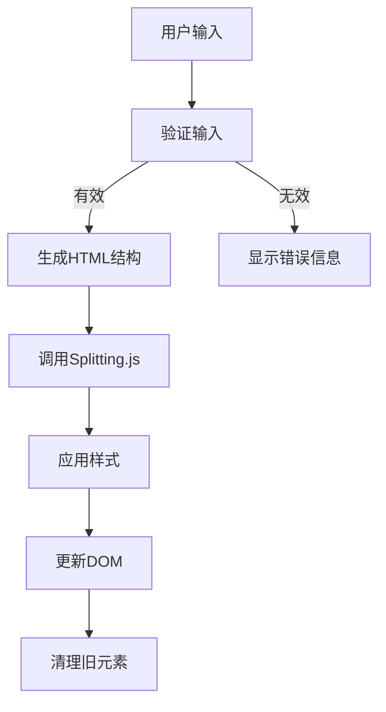

**图表来源**
- [script.js:244-281](file://js/script.js#L244-L281)

#### 事件绑定和内存清理

```javascript
// 事件绑定示例
$('#tutorial').on('show.bs.modal', function () {
    modalResize();
})

// 内存清理
dispose: function() {
    [window, this._element, this._dialog].forEach(function(t) {
        return g(t).off(ee)
    }),
    g(document).off(re.FOCUSIN),
    g.removeData(this._element, te)
}
```

**图表来源**
- [index.html:263-269](file://index.html#L263-L269)
- [bootstrap.min.js:620-640](file://js/bootstrap.min.js#L620-L640)

**章节来源**
- [script.js:244-281](file://js/script.js#L244-L281)
- [bootstrap.min.js:620-640](file://js/bootstrap.min.js#L620-L640)

### 可访问性实现

#### 屏幕阅读器支持

系统实现了完整的ARIA属性支持：

```html
<!-- ARIA属性配置 -->
<div class="modal fade" id="tutorial" tabindex="-1" 
     data-backdrop="static" role="dialog"
     aria-labelledby="exampleModalLabel" aria-hidden="true">
```

#### 键盘导航支持

```javascript
// 键盘事件处理
_setEscapeEvent: function() {
    var e = this;
    this._isShown && this._config.keyboard ?
        g(this._element).on(re.KEYDOWN_DISMISS, function(t) {
            27 === t.which && (t.preventDefault(), e.hide())
        }) :
        this._isShown || g(this._element).off(re.KEYDOWN_DISMISS)
}
```

**图表来源**
- [index.html:24-26](file://index.html#L24-L26)
- [bootstrap.min.js:605-620](file://js/bootstrap.min.js#L605-L620)

**章节来源**
- [index.html:24-26](file://index.html#L24-L26)
- [bootstrap.min.js:605-620](file://js/bootstrap.min.js#L605-L620)

## 依赖关系分析

### 外部依赖关系

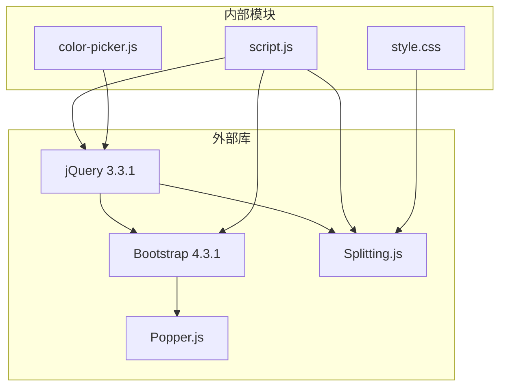

**图表来源**
- [index.html:254-261](file://index.html#L254-L261)

### 内部模块耦合

系统采用松耦合设计，各模块职责清晰：

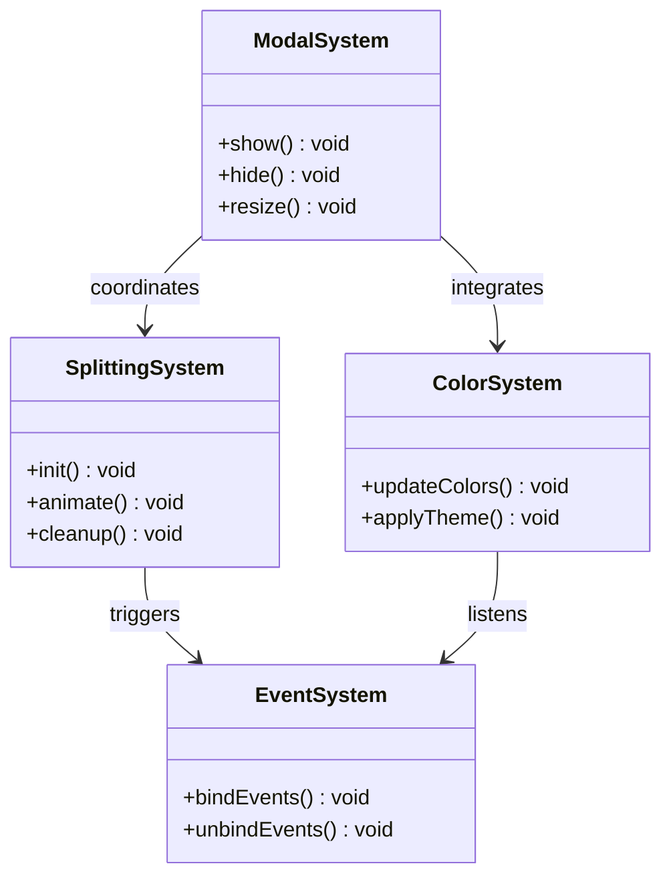

**图表来源**
- [script.js:428-435](file://js/script.js#L428-L435)

**章节来源**
- [index.html:254-261](file://index.html#L254-L261)
- [script.js:428-435](file://js/script.js#L428-L435)

## 性能考虑

### 渲染优化

系统采用了多项性能优化策略：

1. **CSS变量动画**：利用CSS变量实现硬件加速的动画效果
2. **事件委托**：使用jQuery事件委托减少事件处理器数量
3. **延迟初始化**：模态框内容按需加载，避免不必要的初始化开销

### 内存管理

```javascript
// 内存清理机制
dispose: function() {
    // 解绑所有事件监听器
    [window, this._element, this._dialog].forEach(function(t) {
        return g(t).off(ee)
    })
    
    // 清理DOM引用
    g(document).off(re.FOCUSIN)
    g.removeData(this._element, te)
    
    // 重置状态
    this._config = null
    this._element = null
    this._dialog = null
}
```

**章节来源**
- [bootstrap.min.js:620-640](file://js/bootstrap.min.js#L620-L640)

## 故障排除指南

### 常见问题诊断

#### 模态框无法显示

可能原因和解决方案：
1. **jQuery未正确加载**：检查jQuery版本兼容性
2. **Bootstrap样式冲突**：确认Bootstrap CSS正确引入
3. **事件绑定失败**：检查jQuery选择器是否正确

#### Splitting.js动画异常

可能原因和解决方案：
1. **字体文件加载失败**：检查字体文件路径
2. **CSS变量未生效**：确认浏览器支持CSS变量
3. **DOM结构不匹配**：验证Splitting.js目标元素

#### 键盘事件失效

可能原因和解决方案：
1. **焦点丢失**：检查焦点管理逻辑
2. **事件冒泡阻止**：确认事件处理函数正确返回
3. **CSS z-index冲突**：调整模态框层级

**章节来源**
- [bootstrap.min.js:605-620](file://js/bootstrap.min.js#L605-L620)
- [script.js:428-435](file://js/script.js#L428-L435)

## 结论

MySymphosizer的模态对话框系统展现了现代Web应用的最佳实践：

### 技术优势

1. **架构清晰**：模块化设计使得各组件职责明确，易于维护
2. **性能优秀**：采用CSS变量和硬件加速技术，确保流畅的动画体验
3. **可访问性强**：完整的ARIA支持和键盘导航，满足无障碍要求
4. **扩展性好**：插件化的Splitting.js系统便于功能扩展

### 设计亮点

- **沉浸式体验**：静态背景配置和精确的焦点管理提供了优秀的用户体验
- **响应式设计**：完善的尺寸自适应机制确保在各种设备上的表现一致
- **渐进式加载**：分阶段的内容加载策略提升了应用的感知性能

### 改进建议

1. **错误处理增强**：可以添加更完善的错误捕获和恢复机制
2. **性能监控**：集成性能指标监控，持续优化用户体验
3. **测试覆盖**：增加自动化测试，确保代码质量

该系统为类似的Web应用提供了优秀的参考模板，展示了如何将传统UI组件与现代Web技术有机结合，创造出既美观又实用的用户界面。