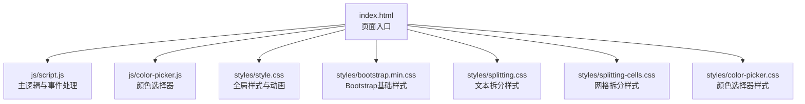
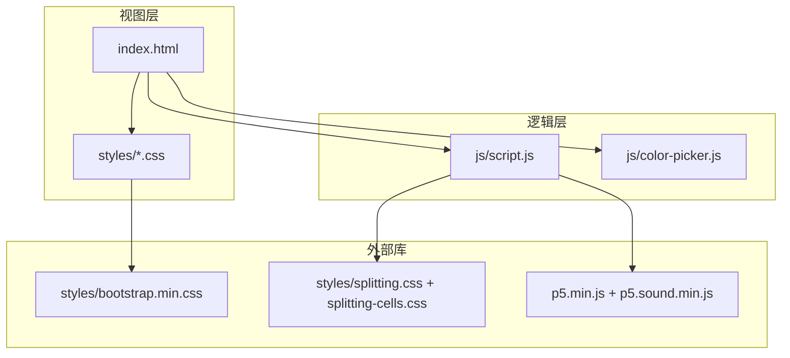
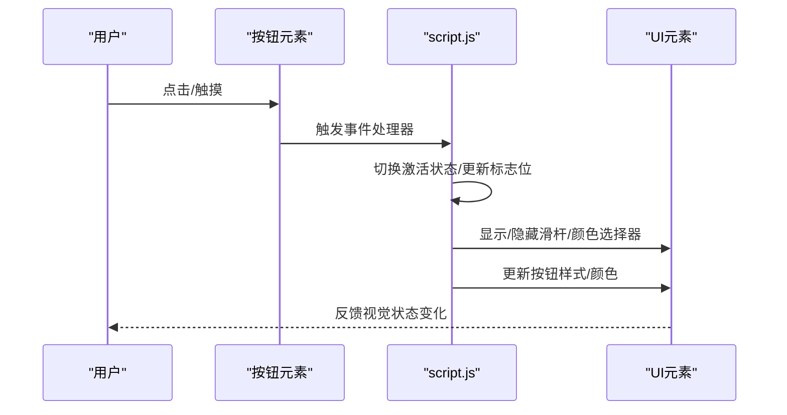
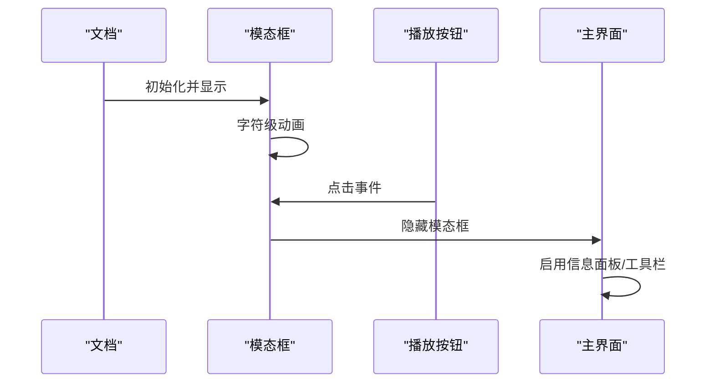
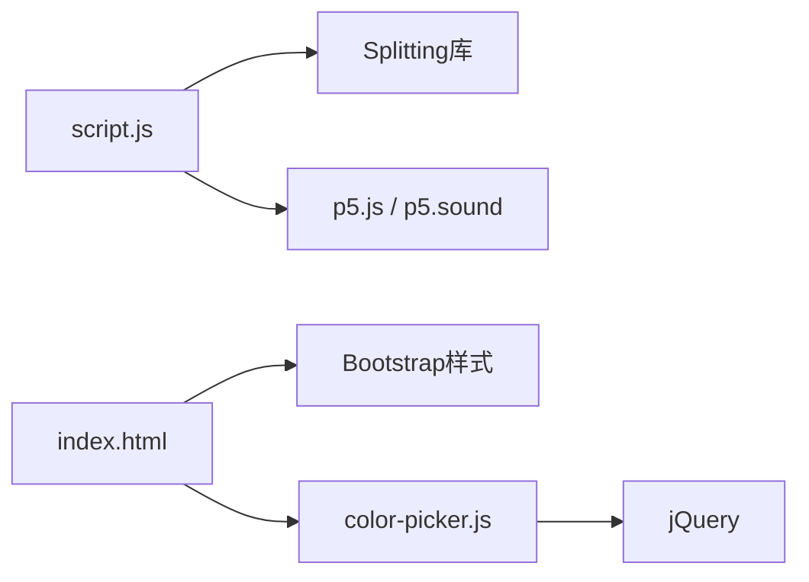

# 用户界面系统

<cite>
**本文档引用的文件**
- [index.html](file://index.html)
- [script.js](file://js/script.js)
- [color-picker.js](file://js/color-picker.js)
- [bootstrap.min.css](file://styles/bootstrap.min.css)
- [style.css](file://styles/style.css)
- [splitting.css](file://styles/splitting.css)
- [splitting-cells.css](file://styles/splitting-cells.css)
- [color-picker.css](file://styles/color-picker.css)
</cite>

## 目录
1. [简介](#简介)
2. [项目结构](#项目结构)
3. [核心组件](#核心组件)
4. [架构总览](#架构总览)
5. [详细组件分析](#详细组件分析)
6. [依赖关系分析](#依赖关系分析)
7. [性能考虑](#性能考虑)
8. [故障排除指南](#故障排除指南)
9. [结论](#结论)
10. [附录](#附录)

## 简介
本文件面向MySymphosizer的用户界面系统，提供从响应式设计到交互控制的完整技术文档。重点涵盖以下方面：
- 响应式设计与Bootstrap集成、媒体查询与移动端适配策略
- 工具栏控制面板：SVG图标系统、按钮交互逻辑与状态管理
- 模态对话框系统：教程引导界面、动态内容加载与用户交互流程
- 导航系统：标题栏布局、品牌标识展示与版权信息管理
- UI组件事件处理：点击、触摸与键盘快捷键响应
- UI状态管理：显示/隐藏控制、动画过渡与用户偏好存储
- 界面定制与主题切换：颜色选择器与样式变量应用

## 项目结构
项目采用“页面 + 脚本 + 样式”的模块化组织方式，核心入口为HTML页面，通过脚本实现动态文本渲染与音频可视化，通过样式定义视觉与交互行为。

**图表来源**
- [index.html](file://index.html)
- [script.js](file://js/script.js)
- [color-picker.js](file://js/color-picker.js)
- [style.css](file://styles/style.css)
- [bootstrap.min.css](file://styles/bootstrap.min.css)
- [splitting.css](file://styles/splitting.css)
- [splitting-cells.css](file://styles/splitting-cells.css)
- [color-picker.css](file://styles/color-picker.css)

**章节来源**
- [index.html](file://index.html)
- [style.css](file://styles/style.css)

## 核心组件
- 页面容器与布局
  - 全局背景与字体：统一的深色背景与自定义字体家族，确保高对比度与可读性
  - 容器布局：顶部导航、中部输入与显示区域、底部工具栏与滑杆
- 模态对话框（教程引导）
  - 引导加载屏与播放按钮，支持淡入淡出与字符级动画
- 工具栏控制面板
  - 九宫格按钮区，包含音量控制、颜色选择、随机配色、文本对齐等
  - SVG图标系统与悬停/激活状态样式
- 颜色选择器
  - 内置颜色列表与自定义颜色支持，实时更新UI主题色
- 文本渲染与可视化
  - Splitting库驱动的逐字符渲染，结合p5.js音频可视化

**章节来源**
- [index.html](file://index.html)
- [script.js](file://js/script.js)
- [color-picker.js](file://js/color-picker.js)
- [style.css](file://styles/style.css)

## 架构总览
整体架构以HTML页面为核心，通过脚本驱动动态内容与交互，样式层负责视觉表现与响应式布局，Bootstrap提供基础组件能力（如模态框）。

**图表来源**
- [index.html](file://index.html)
- [script.js](file://js/script.js)
- [color-picker.js](file://js/color-picker.js)
- [bootstrap.min.css](file://styles/bootstrap.min.css)
- [style.css](file://styles/style.css)
- [splitting.css](file://styles/splitting.css)
- [splitting-cells.css](file://styles/splitting-cells.css)

## 详细组件分析

### 响应式设计与Bootstrap集成
- 视口配置与媒体查询
  - 通过meta viewport实现移动端缩放控制；Bootstrap断点在样式中定义，覆盖xs/sm/md/lg/xl
- 组件响应式行为
  - 模态框在不同屏幕尺寸下居中与自适应高度
  - 工具栏按钮组在窄屏下自动换行与间距调整
- 移动端适配策略
  - 使用触摸事件替代鼠标事件，避免移动端延迟与误触
  - 在小屏设备上隐藏部分UI元素，优先保证核心功能可见

**章节来源**
- [index.html](file://index.html)
- [bootstrap.min.css](file://styles/bootstrap.min.css)
- [style.css](file://styles/style.css)

### 工具栏控制面板（SVG图标系统、按钮交互与状态管理）
- 结构组成
  - 九宫格菜单：包含显示/隐藏工具、启动/停止音频、颜色选择、背景色选择、随机配色、文本对齐、显示信息等
  - SVG图标：每个按钮内嵌矢量图形，支持填充与描边颜色随主题变化
- 交互逻辑
  - 桌面端：鼠标按下/抬起触发状态切换；点击执行具体操作
  - 移动端：触摸开始/结束判断滚动状态，仅在非滚动时触发按钮动作
- 状态管理
  - 当前激活按钮类名切换、滑杆显示/隐藏、颜色选择器显隐、信息面板显示/隐藏
  - 通过CSS类与内联样式实现即时视觉反馈

**图表来源**
- [script.js](file://js/script.js)
- [index.html](file://index.html)

**章节来源**
- [index.html](file://index.html)
- [script.js](file://js/script.js)
- [style.css](file://styles/style.css)

### 模态对话框系统（教程引导界面、动态内容与交互流程）
- 组件结构
  - 模态框包含加载屏与教程屏，使用淡入淡出动画与字符级弹跳动画
  - 加载屏通过Splitting库进行字符拆分与逐字动画
- 动态内容加载
  - 模态框显示/隐藏时根据窗口尺寸动态计算居中位置
  - 教程屏提供播放按钮，点击后关闭模态框并进入主界面
- 交互流程
  - 页面加载后自动显示模态框
  - 用户点击播放按钮后隐藏模态框并启用信息面板

**图表来源**
- [index.html](file://index.html)
- [script.js](file://js/script.js)
- [style.css](file://styles/style.css)

**章节来源**
- [index.html](file://index.html)
- [script.js](file://js/script.js)
- [style.css](file://styles/style.css)

### 导航系统（标题栏布局、品牌标识与版权信息）
- 布局结构
  - 顶部导航包含副标题、主标题与副标题，使用固定定位与透明度过渡
- 品牌标识
  - 主标题作为品牌标识，采用专用字体与字号
- 版权信息管理
  - 版权信息通过HTML文本节点维护，样式层控制字体与间距

**章节来源**
- [index.html](file://index.html)
- [style.css](file://styles/style.css)

### UI组件事件处理（点击、触摸与键盘快捷键）
- 点击事件
  - 输入框点击触发光标闪烁与字符拆分初始化
  - 按钮点击执行对应功能（启动/停止音频、切换颜色、显示信息等）
- 触摸事件
  - 移动端触摸开始/移动/结束事件用于区分滚动与点击
  - 触摸滑杆区域时显示音量滑杆，离开时隐藏
- 键盘快捷键
  - 文本输入通过键盘事件实时更新，支持删除与空格计数

**章节来源**
- [script.js](file://js/script.js)
- [index.html](file://index.html)

### UI状态管理（显示/隐藏控制、动画过渡与用户偏好存储）
- 显示/隐藏控制
  - 通过CSS类与内联样式控制元素显示/隐藏，如工具栏、滑杆、颜色选择器
- 动画过渡
  - 使用CSS keyframe动画实现淡入/淡出、字符弹跳等效果
  - 过渡属性统一设置，保证流畅体验
- 用户偏好存储
  - 当前实现未见持久化存储逻辑；建议扩展本地存储以保存主题与布局偏好

**章节来源**
- [style.css](file://styles/style.css)
- [script.js](file://js/script.js)

### 界面定制指南与主题切换机制
- 颜色体系
  - 内置多套颜色组合，支持一键随机切换
  - 颜色选择器支持预设颜色与自定义颜色，实时更新UI主题
- 样式变量与主题
  - CSS变量用于控制滑杆颜色等动态样式
  - SVG填充与描边颜色随主题变化，保持一致的视觉风格

**章节来源**
- [color-picker.js](file://js/color-picker.js)
- [style.css](file://styles/style.css)
- [color-picker.css](file://styles/color-picker.css)

## 依赖关系分析
- 外部库依赖
  - Bootstrap：提供模态框等组件的基础样式与行为
  - Splitting：文本拆分与逐字符渲染
  - p5.js/p5.sound：音频采集与频谱分析
- 内部依赖
  - script.js依赖Splitting与p5.js完成文本渲染与音频可视化
  - color-picker.js依赖jQuery与内置颜色列表实现主题切换

**图表来源**
- [script.js](file://js/script.js)
- [color-picker.js](file://js/color-picker.js)
- [index.html](file://index.html)
- [bootstrap.min.css](file://styles/bootstrap.min.css)

**章节来源**
- [script.js](file://js/script.js)
- [color-picker.js](file://js/color-picker.js)
- [index.html](file://index.html)

## 性能考虑
- 文本渲染优化
  - 使用Splitting进行字符级拆分，避免频繁DOM操作
  - 逐帧更新字符样式，结合CSS硬件加速减少重排
- 音频处理优化
  - 平滑处理频谱数据与音量，降低计算开销
  - 小屏设备提高阈值，减少不必要的渲染
- 动画与过渡
  - 使用CSS动画与过渡属性，避免JavaScript驱动的高频重绘
  - 合理设置动画时长与缓动函数，平衡视觉效果与性能

## 故障排除指南
- 模态框无法居中或遮罩异常
  - 检查窗口尺寸监听与模态框定位逻辑
  - 确认Bootstrap样式未被覆盖
- 颜色选择器不生效
  - 确认jQuery已正确加载且颜色选择器初始化完成
  - 检查CSS类名与样式是否匹配
- 文本渲染异常或卡顿
  - 检查Splitting初始化与目标元素是否存在
  - 减少一次性更新的字符数量，分批渲染
- 音频无响应或延迟
  - 确认浏览器允许麦克风访问
  - 检查音频上下文状态与设备权限

**章节来源**
- [script.js](file://js/script.js)
- [color-picker.js](file://js/color-picker.js)
- [style.css](file://styles/style.css)

## 结论
MySymphosizer的用户界面系统以HTML/CSS/JS为基础，结合Splitting与p5.js实现了动态文本渲染与音频可视化，配合Bootstrap提供了可靠的模态框与响应式布局。工具栏采用SVG图标与状态管理，实现直观的交互体验；颜色选择器支持主题切换，满足个性化需求。建议后续增强用户偏好的持久化存储与更完善的移动端手势支持，以进一步提升可用性与性能。

## 附录
- 快速参考
  - 页面入口：index.html
  - 主逻辑：js/script.js
  - 颜色选择器：js/color-picker.js
  - 样式文件：styles/*.css
- 扩展建议
  - 引入用户偏好存储（localStorage/sessionStorage）
  - 增加键盘快捷键与无障碍支持
  - 优化移动端手势识别与触摸反馈