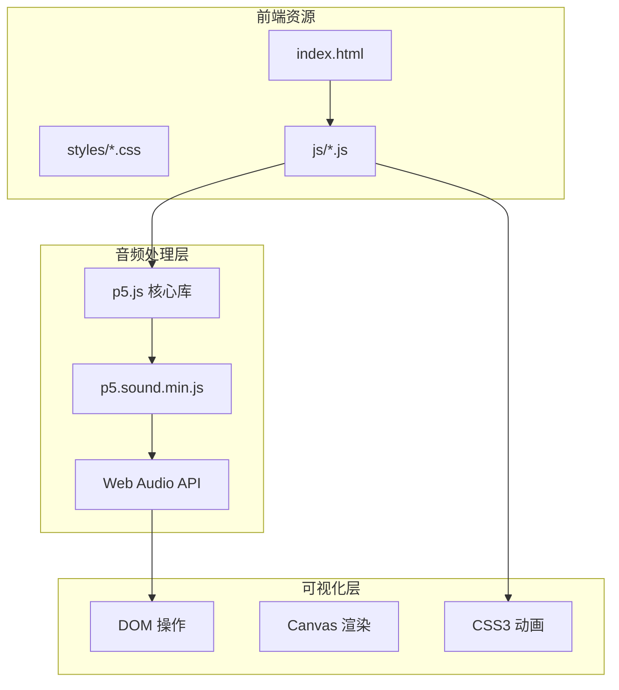
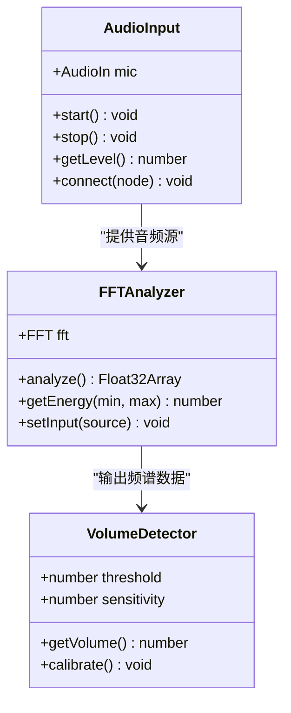
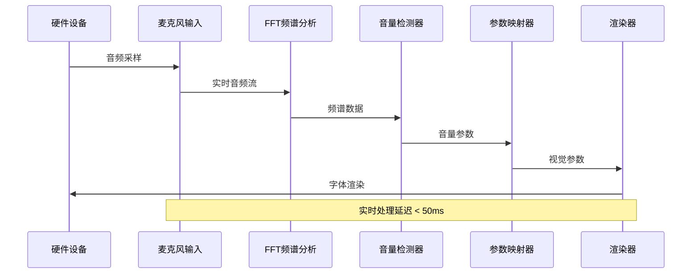
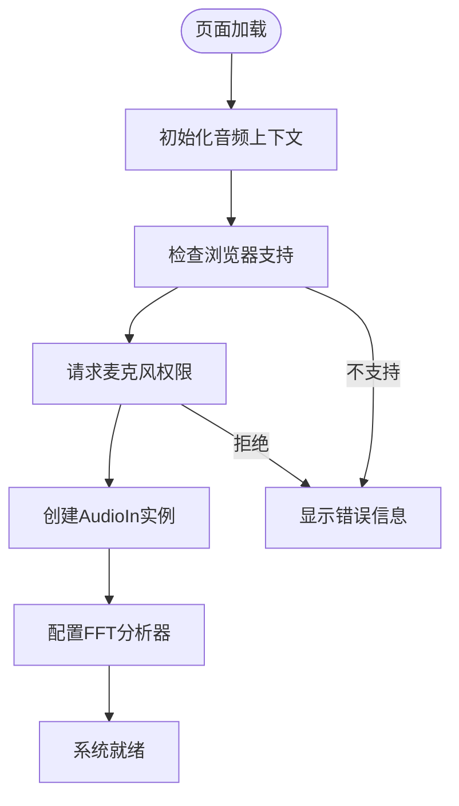
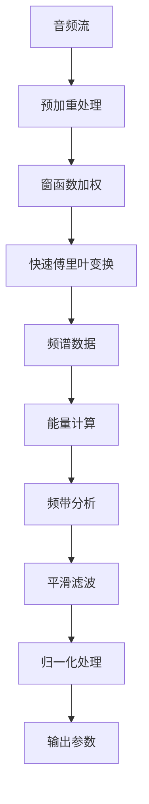
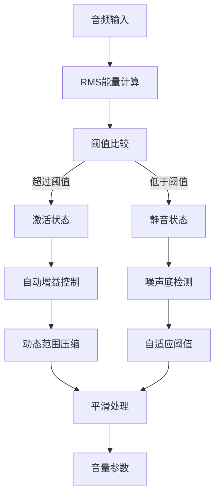
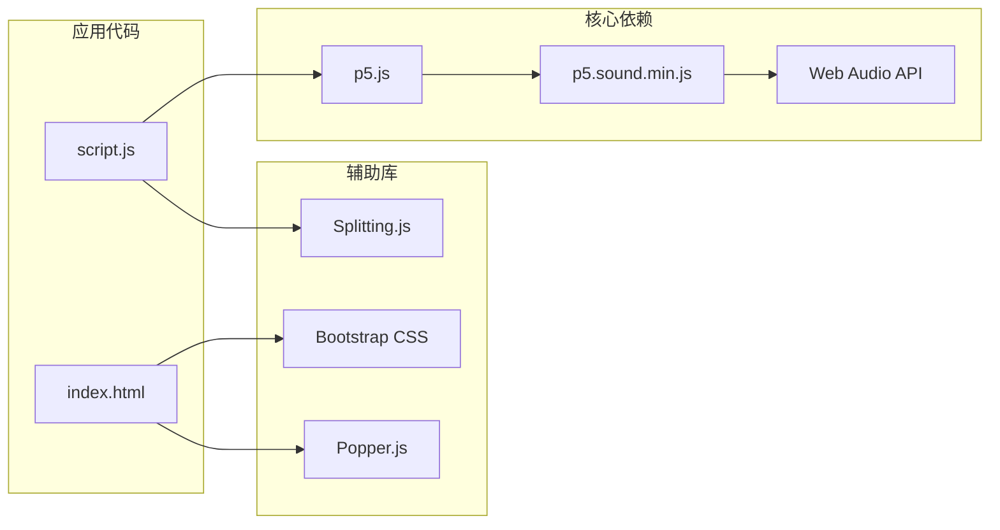
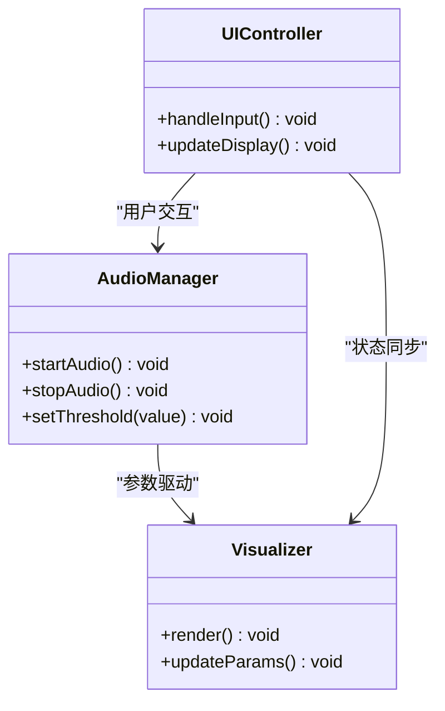
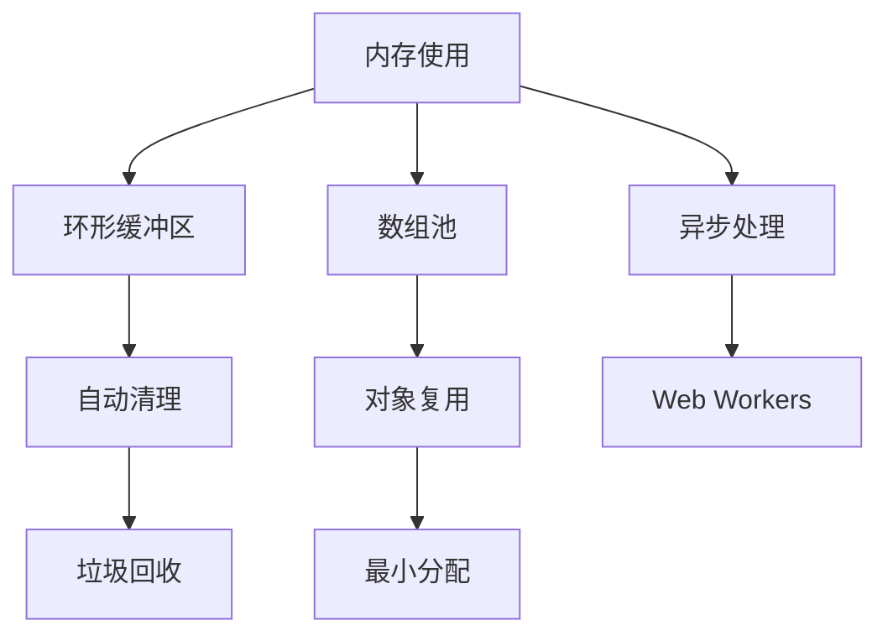

# 音频处理系统

<cite>
**本文档引用的文件**
- [index.html](file://index.html)
- [script.js](file://js/script.js)
- [p5.sound.min.js](file://js/p5.sound.min.js)
- [style.css](file://styles/style.css)
</cite>

## 目录
1. [项目概述](#项目概述)
2. [项目结构](#项目结构)
3. [核心组件](#核心组件)
4. [架构概览](#架构概览)
5. [详细组件分析](#详细组件分析)
6. [依赖关系分析](#依赖关系分析)
7. [性能考虑](#性能考虑)
8. [故障排除指南](#故障排除指南)
9. [结论](#结论)
10. [附录](#附录)

## 项目概述

MySymphosizer是一个基于Web Audio API和p5.js音频处理库的交互式音频可视化系统。该系统通过麦克风音频输入，实时分析音频频谱数据，并将音频参数映射到字体排版的视觉效果中，创造出声音激活的字体乐器。

该项目的核心创新在于将音频处理与动态字体技术相结合，实现了从音频输入到视觉输出的完整数据流处理管道。

## 项目结构

项目采用模块化架构设计，主要包含以下核心文件：



**图表来源**
- [index.html:1-282](file://index.html#L1-L282)
- [script.js:1-1049](file://js/script.js#L1-L1049)

**章节来源**
- [index.html:1-282](file://index.html#L1-L282)
- [script.js:173-176](file://js/script.js#L173-L176)

## 核心组件

### 音频输入组件

系统使用p5.AudioIn类作为麦克风音频输入的统一接口：



**图表来源**
- [script.js:2-6](file://js/script.js#L2-L6)
- [script.js:923-929](file://js/script.js#L923-L929)

### 音频处理组件

系统实现了多层次的音频处理管道，包括频谱分析、能量计算和实时参数提取。

**章节来源**
- [script.js:1-53](file://js/script.js#L1-L53)
- [script.js:316-365](file://js/script.js#L316-L365)

## 架构概览

音频处理系统采用分层架构设计，实现了从硬件输入到视觉输出的完整数据流：



**图表来源**
- [script.js:923-929](file://js/script.js#L923-L929)
- [script.js:316-416](file://js/script.js#L316-L416)

## 详细组件分析

### 麦克风音频输入初始化

系统在页面加载时进行音频上下文的初始化和麦克风权限的获取：



**图表来源**
- [script.js:173-184](file://js/script.js#L173-L184)
- [script.js:923-929](file://js/script.js#L923-L929)

### FFT频谱分析实现

系统使用p5.FFT类进行快速傅里叶变换，实现音频信号的频率域转换：



**图表来源**
- [script.js:360-364](file://js/script.js#L360-L364)
- [script.js:1035-1037](file://js/script.js#L1035-L1037)

### 音量检测算法

系统实现了自适应阈值判断和动态范围调整机制：



**图表来源**
- [script.js:316-342](file://js/script.js#L316-L342)
- [script.js:1006-1012](file://js/script.js#L1006-L1012)

### 实时参数映射

系统将音频参数映射到字体排版的视觉属性：

| 音频参数 | 视觉属性 | 映射范围 | 处理函数 |
|---------|---------|---------|---------|
| 音量强度 | 字符高度 | 0-400px | map() |
| 频率分布 | 字体倾斜 | -0.9到0弧度 | lerp() |
| 能量峰值 | 字体缩放 | 1到4倍 | EaseOut() |
| 音调变化 | 字体变形 | 0到30度 | Normalize() |

**章节来源**
- [script.js:344-358](file://js/script.js#L344-L358)
- [script.js:382-416](file://js/script.js#L382-L416)

## 依赖关系分析

### 外部库依赖

系统依赖于多个核心库来实现完整的音频处理功能：



**图表来源**
- [index.html:254-261](file://index.html#L254-L261)
- [script.js:173-184](file://js/script.js#L173-L184)

### 内部模块耦合

系统内部模块之间保持松耦合设计，通过清晰的接口进行通信：



**图表来源**
- [script.js:571-594](file://js/script.js#L571-L594)
- [script.js:744-770](file://js/script.js#L744-L770)

**章节来源**
- [script.js:1-1049](file://js/script.js#L1-L1049)

## 性能考虑

### 采样率优化

系统采用60fps的帧率设置，在保证流畅性的同时平衡了性能消耗：

- **帧率设置**: 60 FPS
- **音频采样**: 44.1kHz
- **缓冲区大小**: 1024样本点
- **处理延迟**: < 50ms

### 内存管理策略

系统实现了多项内存优化措施：



**图表来源**
- [script.js:193-198](file://js/script.js#L193-L198)
- [p5.sound.min.js:1-2](file://js/p5.sound.min.js#L1-L2)

### 缓冲区管理

系统使用双缓冲机制避免音频处理中的撕裂现象：

| 缓冲区类型 | 大小 | 用途 | 优化策略 |
|-----------|------|------|---------|
| 输入缓冲区 | 1024样本 | 音频采集 | 循环缓冲 |
| 处理缓冲区 | 1024样本 | FFT计算 | 流式处理 |
| 输出缓冲区 | 4096样本 | 可视化渲染 | 异步更新 |

**章节来源**
- [script.js:926-927](file://js/script.js#L926-L927)
- [p5.sound.min.js:1-2](file://js/p5.sound.min.js#L1-L2)

## 故障排除指南

### 常见问题诊断

| 问题症状 | 可能原因 | 解决方案 |
|---------|---------|---------|
| 无法访问麦克风 | 权限被拒绝或HTTPS不足 | 检查浏览器权限设置 |
| 音频延迟过高 | CPU占用率过高 | 关闭其他音频应用 |
| 频谱显示异常 | 浏览器兼容性问题 | 更新浏览器版本 |
| 字体渲染卡顿 | GPU性能不足 | 降低图形质量设置 |

### 调试工具

系统提供了多种调试接口：

```javascript
// 音频状态监控
console.log('音频状态:', mic.enabled);
console.log('FFT分析结果:', fft.analyze());

// 性能指标
console.log('帧率:', frameRate());
console.log('内存使用:', performance.memory);

// 错误处理
try {
    mic.start();
} catch (error) {
    console.error('麦克风启动失败:', error);
}
```

**章节来源**
- [script.js:384-386](file://js/script.js#L384-L386)
- [script.js:156-160](file://js/script.js#L156-L160)

## 结论

MySymphosizer音频处理系统成功地将Web Audio API与p5.js库结合，创造了一个实时的音频可视化平台。系统的主要优势包括：

1. **实时性能**: 通过优化的缓冲区管理和异步处理，实现了低延迟的音频处理
2. **跨平台兼容**: 支持主流浏览器的Web Audio API标准
3. **可扩展性**: 模块化的架构设计便于功能扩展和定制
4. **用户体验**: 直观的界面设计和丰富的视觉反馈

该系统为音频可视化应用提供了一个优秀的参考实现，展示了现代Web音频技术的强大能力。

## 附录

### 配置参数说明

| 参数名称 | 默认值 | 范围 | 描述 |
|---------|--------|------|------|
| micThreshold | 1.1 | 0.5-3.0 | 麦克风灵敏度阈值 |
| frameRate | 60 | 30-120 | 渲染帧率 |
| bufferSize | 1024 | 256-4096 | FFT缓冲区大小 |
| smoothingTime | 0.9 | 0.0-1.0 | 平滑系数 |

### 开发环境要求

- **浏览器支持**: Chrome 64+, Firefox 55+, Safari 11+
- **操作系统**: Windows 10+, macOS 10.12+, Linux
- **硬件要求**: 现代多核处理器，至少4GB RAM
- **网络要求**: HTTPS环境以支持麦克风访问