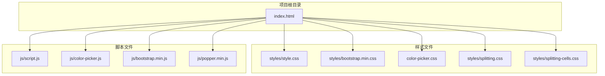
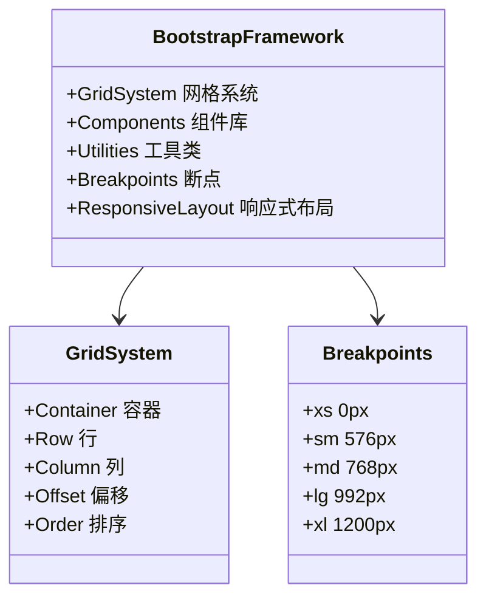
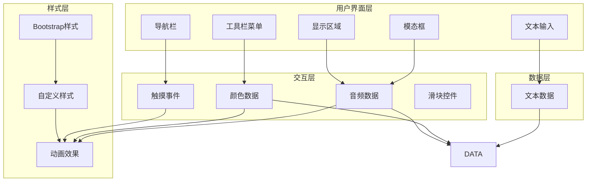
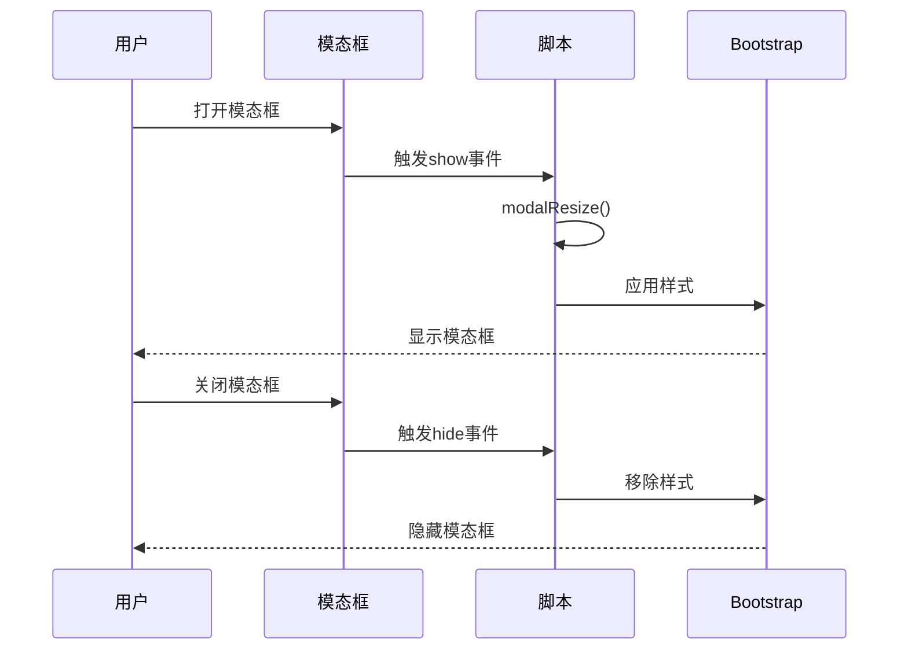
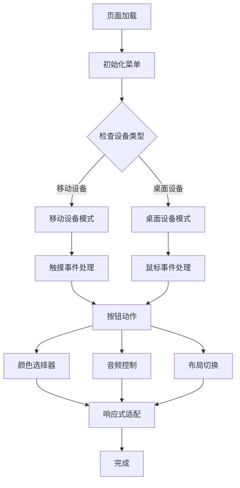
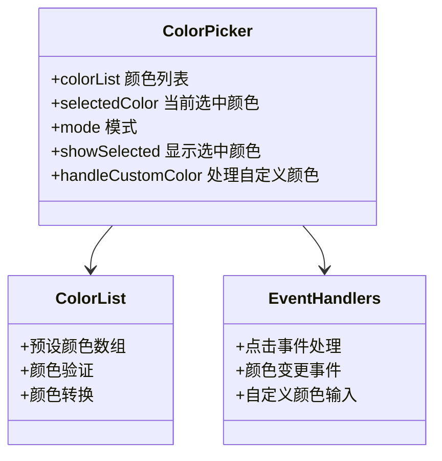
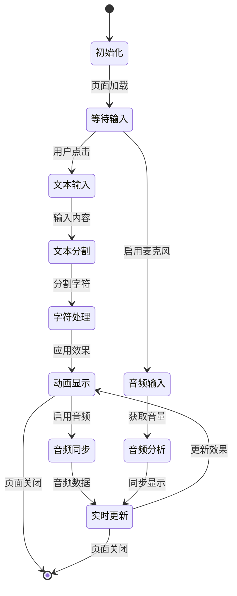
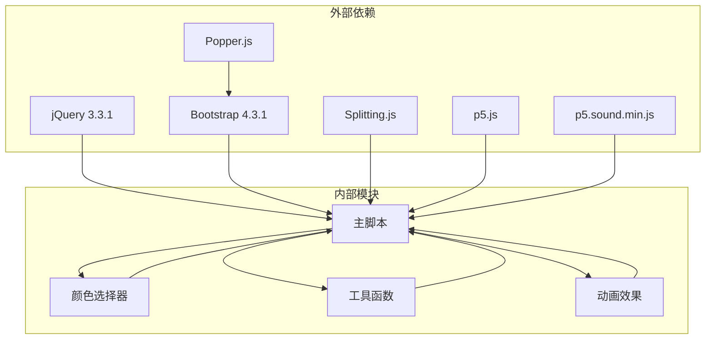
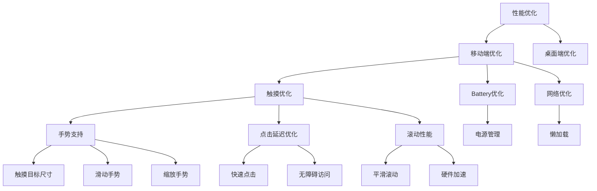

# 响应式布局设计

<cite>
**本文档引用的文件**
- [index.html](file://index.html)
- [style.css](file://styles/style.css)
- [bootstrap.min.css](file://styles/bootstrap.min.css)
- [color-picker.css](file://styles/color-picker.css)
- [script.js](file://js/script.js)
- [color-picker.js](file://js/color-picker.js)
- [splitting.css](file://styles/splitting.css)
- [splitting-cells.css](file://styles/splitting-cells.css)
</cite>

## 目录
1. [项目概述](#项目概述)
2. [项目结构](#项目结构)
3. [核心组件](#核心组件)
4. [架构概览](#架构概览)
5. [详细组件分析](#详细组件分析)
6. [依赖关系分析](#依赖关系分析)
7. [性能考虑](#性能考虑)
8. [故障排除指南](#故障排除指南)
9. [结论](#结论)

## 项目概述

这是一个基于Bootstrap框架的响应式布局设计项目，专注于音频可视化和交互式文本显示。项目实现了完整的响应式设计，支持桌面端、平板端和移动端的自适应布局。

## 项目结构

**图表来源**
- [index.html](file://index.html)
- [style.css](file://styles/style.css)
- [bootstrap.min.css](file://styles/bootstrap.min.css)

**章节来源**
- [index.html](file://index.html)
- [style.css](file://styles/style.css)

## 核心组件

### Bootstrap框架集成

项目集成了Bootstrap 4.3.1框架，提供了完整的响应式网格系统和组件库：

**图表来源**
- [bootstrap.min.css](file://styles/bootstrap.min.css)

### 响应式断点系统

项目定义了多个断点，支持不同屏幕尺寸的自适应布局：

| 断点 | 最小宽度 | 描述 |
|------|----------|------|
| xs | 0px | 超小屏幕（手机） |
| sm | 576px | 小屏幕（平板） |
| md | 768px | 中等屏幕（平板） |
| lg | 992px | 大屏幕（桌面） |
| xl | 1200px | 超大屏幕（大桌面） |

**章节来源**
- [bootstrap.min.css](file://styles/bootstrap.min.css)

## 架构概览

**图表来源**
- [index.html](file://index.html)
- [script.js](file://js/script.js)
- [style.css](file://styles/style.css)

## 详细组件分析

### 模态框组件

模态框是项目的核心组件之一，用于展示教程和加载界面：

**图表来源**
- [index.html](file://index.html)
- [script.js](file://js/script.js)

模态框的关键特性：
- 使用Bootstrap的模态框组件
- 自适应定位和尺寸调整
- 支持静态背景模式
- 响应式布局适配

**章节来源**
- [index.html](file://index.html)
- [script.js](file://js/script.js)

### 工具栏菜单系统

工具栏菜单提供了多种功能按钮，支持响应式布局：

**图表来源**
- [script.js](file://js/script.js)

**章节来源**
- [script.js](file://js/script.js)

### 颜色选择器组件

颜色选择器提供了丰富的颜色管理功能：

**图表来源**
- [color-picker.js](file://js/color-picker.js)
- [color-picker.css](file://styles/color-picker.css)

**章节来源**
- [color-picker.js](file://js/color-picker.js)
- [color-picker.css](file://styles/color-picker.css)

### 文本输入和显示系统

项目实现了动态文本处理和显示功能：

**图表来源**
- [script.js](file://js/script.js)
- [splitting.css](file://styles/splitting.css)
- [splitting-cells.css](file://styles/splitting-cells.css)

**章节来源**
- [script.js](file://js/script.js)
- [splitting.css](file://styles/splitting.css)
- [splitting-cells.css](file://styles/splitting-cells.css)

## 依赖关系分析

**图表来源**
- [index.html](file://index.html)
- [script.js](file://js/script.js)

**章节来源**
- [index.html](file://index.html)

## 性能考虑

### 响应式性能优化

项目采用了多项性能优化策略：

1. **CSS媒体查询优化**
   - 使用Bootstrap内置断点减少自定义媒体查询
   - 合理使用CSS变量减少重绘
   - 优化动画性能使用will-change属性

2. **JavaScript性能优化**
   - 使用requestAnimationFrame优化动画
   - 防抖和节流处理高频事件
   - 懒加载和按需加载资源

3. **内存管理**
   - 及时清理事件监听器
   - 合理使用DOM操作
   - 避免内存泄漏

### 移动端优化

**章节来源**
- [script.js](file://js/script.js)
- [style.css](file://styles/style.css)

## 故障排除指南

### 常见问题及解决方案

1. **模态框定位问题**
   - 检查modalResize函数的计算逻辑
   - 确认窗口尺寸变化事件绑定
   - 验证CSS定位属性设置

2. **颜色选择器不响应**
   - 检查jQuery事件绑定
   - 验证颜色列表数据格式
   - 确认CSS样式应用

3. **触摸事件冲突**
   - 检查preventDefault调用
   - 验证事件冒泡处理
   - 确认设备检测逻辑

4. **音频功能异常**
   - 检查浏览器兼容性
   - 验证音频权限请求
   - 确认音频上下文状态

**章节来源**
- [script.js](file://js/script.js)
- [color-picker.js](file://js/color-picker.js)

## 结论

该项目成功实现了基于Bootstrap框架的完整响应式布局设计，具有以下特点：

1. **完整的响应式系统**：支持从手机到超大桌面的各种设备
2. **丰富的交互功能**：包括音频处理、颜色管理、触摸控制等
3. **高性能优化**：采用多项性能优化策略确保流畅体验
4. **良好的可维护性**：模块化设计便于后续扩展和维护

通过合理使用Bootstrap的网格系统和组件库，结合自定义的样式和JavaScript逻辑，项目实现了优秀的跨设备兼容性和用户体验。