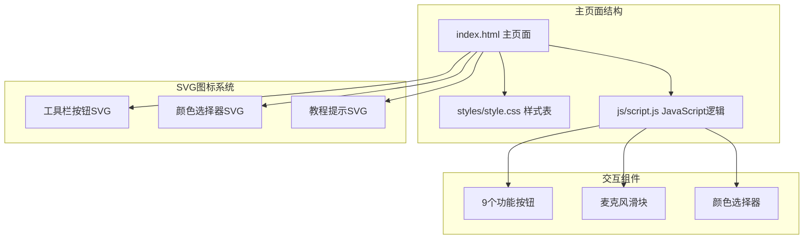
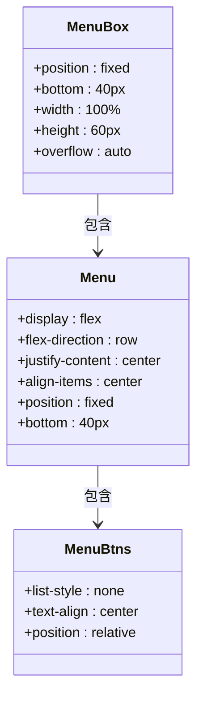
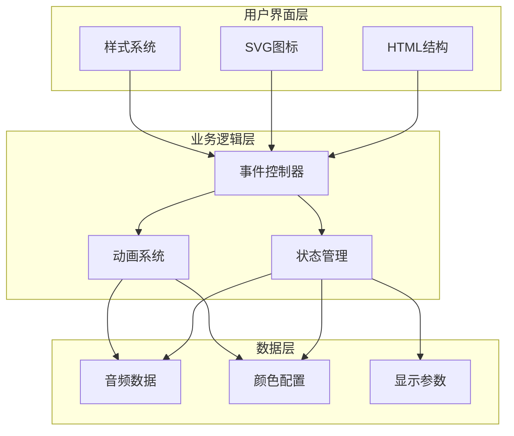
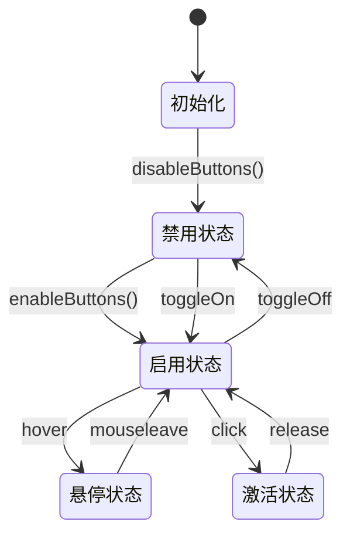
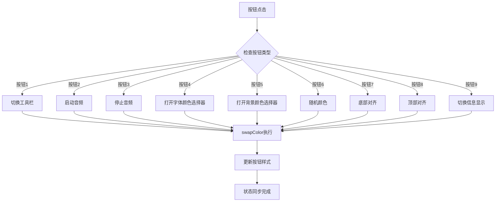
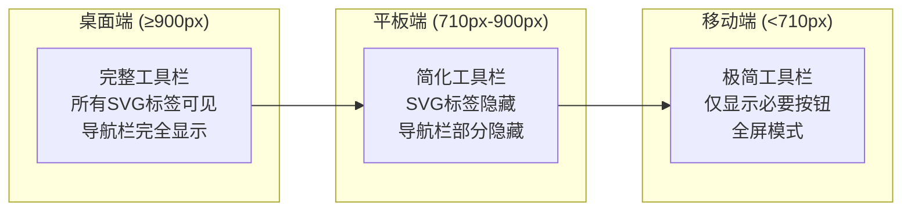
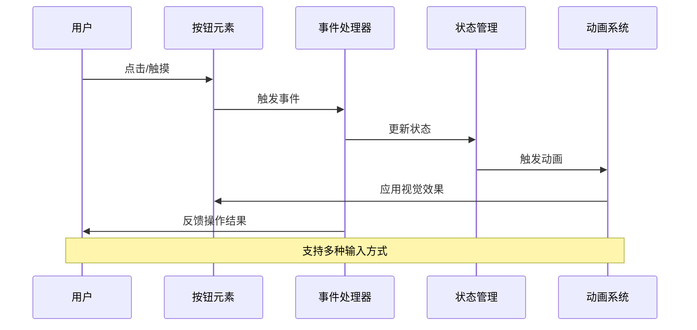
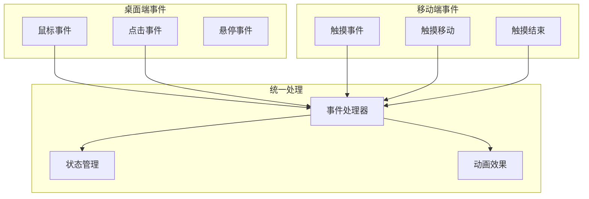
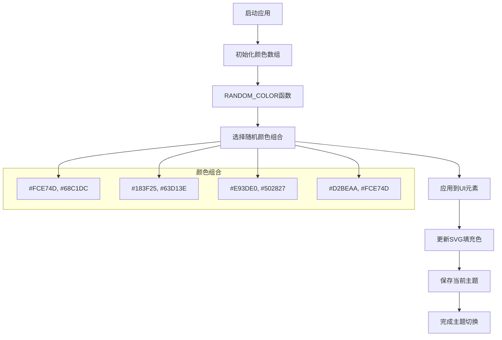
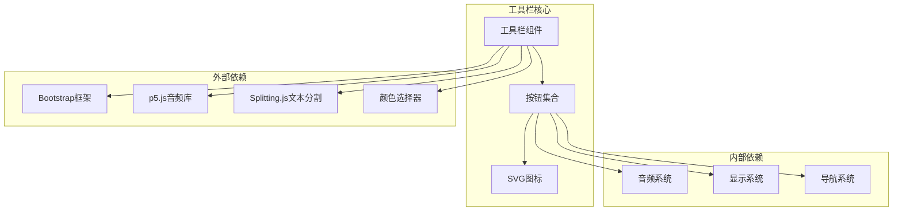

# 工具栏设计

<cite>
**本文档引用的文件**
- [index.html](file://index.html)
- [style.css](file://styles/style.css)
- [script.js](file://js/script.js)
- [splitting.css](file://styles/splitting.css)
- [color-picker.css](file://styles/color-picker.css)
</cite>

## 目录
1. [简介](#简介)
2. [项目结构](#项目结构)
3. [核心组件](#核心组件)
4. [架构概览](#架构概览)
5. [详细组件分析](#详细组件分析)
6. [依赖关系分析](#依赖关系分析)
7. [性能考虑](#性能考虑)
8. [故障排除指南](#故障排除指南)
9. [结论](#结论)

## 简介

MySymphosizer 是一个基于 Web 的动态字体生成器，具有复杂的工具栏设计系统。该工具栏采用 SVG 图标系统，提供了丰富的交互功能，包括音频控制、颜色选择、文本对齐等。本文档深入分析了工具栏的设计架构，包括 SVG 图标系统的实现、布局结构、状态管理和事件绑定系统。

## 项目结构

该项目采用模块化架构，主要包含以下关键组件：

**图表来源**
- [index.html:54-178](file://index.html#L54-L178)
- [style.css:643-813](file://styles/style.css#L643-L813)

**章节来源**
- [index.html:1-282](file://index.html#L1-L282)
- [style.css:1-1571](file://styles/style.css#L1-L1571)

## 核心组件

### 工具栏容器结构

工具栏采用 `menu-box` 容器，内部包含 `menu` 和 `menu-btns` 列表：

**图表来源**
- [index.html:54-56](file://index.html#L54-L56)
- [index.html:56-178](file://index.html#L56-L178)

### SVG图标系统

每个按钮都包含两个 SVG 元素：外层的装饰性 SVG 和内层的功能性 SVG。装饰性 SVG 提供视觉效果，功能性 SVG 包含实际的图标路径。

**章节来源**
- [index.html:67-176](file://index.html#L67-L176)
- [style.css:480-491](file://styles/style.css#L480-L491)

## 架构概览

工具栏系统采用分层架构设计，实现了清晰的关注点分离：

**图表来源**
- [script.js:112-121](file://js/script.js#L112-L121)
- [script.js:552-743](file://js/script.js#L552-L743)

## 详细组件分析

### 按钮状态管理系统

工具栏实现了复杂的状态管理机制，包括激活状态、禁用状态和悬停效果：

**图表来源**
- [script.js:122-145](file://js/script.js#L122-L145)
- [script.js:552-743](file://js/script.js#L552-L743)

#### 按钮激活机制

每个按钮都有独特的激活行为，通过 `swapColor()` 函数统一管理：

**图表来源**
- [script.js:552-743](file://js/script.js#L552-L743)
- [script.js:966-1003](file://js/script.js#L966-L1003)

**章节来源**
- [script.js:122-145](file://js/script.js#L122-L145)
- [script.js:552-743](file://js/script.js#L552-L743)

### 响应式布局系统

工具栏采用了多层次的响应式设计，针对不同屏幕尺寸提供优化的用户体验：

**图表来源**
- [style.css:981-1176](file://styles/style.css#L981-L1176)
- [style.css:1149-1340](file://styles/style.css#L1149-L1340)

#### 媒体查询策略

系统使用了多个断点来适应不同的设备：

| 断点 | 屏幕宽度 | 特性 |
|------|----------|------|
| 900px | ≥900px | 显示完整工具栏和导航栏 |
| 710px | 710px-900px | 隐藏SVG标签，显示简化版本 |
| 550px | 550px-710px | 移动端优化布局 |
| 550px以下 | <550px | 全屏模式，最大化可用空间 |

**章节来源**
- [style.css:981-1571](file://styles/style.css#L981-L1571)

### 事件绑定系统

工具栏实现了跨平台的事件处理机制，支持鼠标、触摸和键盘操作：

**图表来源**
- [script.js:466-538](file://js/script.js#L466-L538)
- [script.js:540-550](file://js/script.js#L540-L550)

#### 事件处理差异

**图表来源**
- [script.js:466-538](file://js/script.js#L466-L538)
- [script.js:540-550](file://js/script.js#L540-L550)

**章节来源**
- [script.js:466-538](file://js/script.js#L466-L538)
- [script.js:540-550](file://js/script.js#L540-L550)

### 颜色主题系统

工具栏支持动态颜色主题切换，提供了丰富的颜色组合选项：

**图表来源**
- [script.js:931-960](file://js/script.js#L931-L960)
- [script.js:63-106](file://js/script.js#L63-L106)

#### 颜色应用范围

系统会将选定的颜色应用到所有相关的 UI 元素：

| 应用范围 | 影响的元素 |
|----------|------------|
| 背景颜色 | HTML主体、按钮背景 |
| 文字颜色 | 导航文字、按钮文字 |
| SVG填充 | 所有SVG图标路径 |
| 边框颜色 | 按钮边框、滑块边框 |
| 选中效果 | 活跃状态的颜色对比 |

**章节来源**
- [script.js:931-960](file://js/script.js#L931-L960)
- [script.js:63-106](file://js/script.js#L63-L106)

## 依赖关系分析

工具栏系统与其他组件存在紧密的依赖关系：

**图表来源**
- [index.html:15-261](file://index.html#L15-L261)
- [script.js:1-1049](file://js/script.js#L1-L1049)

### 组件耦合度分析

工具栏系统在设计上保持了良好的模块化：

- **低耦合**：按钮功能相对独立，单个按钮的修改不会影响其他按钮
- **高内聚**：相关功能（如颜色选择）集中在特定的按钮组中
- **可扩展性**：新的按钮可以通过现有的架构轻松添加

**章节来源**
- [index.html:54-178](file://index.html#L54-L178)
- [script.js:112-121](file://js/script.js#L112-L121)

## 性能考虑

工具栏系统在性能方面采用了多项优化策略：

### 渲染优化

1. **CSS3硬件加速**：使用 `transform` 和 `opacity` 属性触发GPU加速
2. **减少重绘**：通过 `will-change` 属性提示浏览器优化
3. **虚拟滚动**：长列表采用虚拟滚动技术减少DOM节点数量

### 内存管理

1. **事件委托**：使用事件委托减少事件监听器数量
2. **对象池**：复用SVG元素和动画对象
3. **垃圾回收**：及时清理不再使用的DOM引用

### 网络优化

1. **SVG内联**：避免额外的HTTP请求
2. **懒加载**：非关键资源延迟加载
3. **缓存策略**：合理设置缓存头信息

## 故障排除指南

### 常见问题及解决方案

#### 按钮无响应问题

**症状**：点击按钮没有反应

**可能原因**：
1. JavaScript文件加载失败
2. 事件监听器未正确绑定
3. 按钮被禁用状态锁定

**解决步骤**：
1. 检查浏览器开发者工具中的错误日志
2. 验证 `script.js` 文件是否正确加载
3. 确认 `enableButtons()` 函数是否被调用

#### SVG图标显示异常

**症状**：SVG图标不显示或显示不完整

**可能原因**：
1. SVG路径定义错误
2. CSS样式冲突
3. 浏览器兼容性问题

**解决步骤**：
1. 检查SVG `viewBox` 属性是否正确设置
2. 验证CSS选择器优先级
3. 测试不同浏览器的兼容性

#### 响应式布局问题

**症状**：在某些设备上布局错乱

**可能原因**：
1. 媒体查询断点设置不当
2. CSS优先级冲突
3. 视口设置错误

**解决步骤**：
1. 检查 `viewport` meta标签设置
2. 验证媒体查询的断点值
3. 使用浏览器开发者工具测试不同尺寸

**章节来源**
- [script.js:122-145](file://js/script.js#L122-L145)
- [style.css:981-1571](file://styles/style.css#L981-L1571)

## 结论

MySymphosizer 的工具栏设计展现了现代Web应用的优秀实践。通过精心设计的SVG图标系统、灵活的响应式布局和完善的事件处理机制，创造了一个既美观又实用的用户界面。

### 设计亮点

1. **模块化架构**：清晰的组件分离和职责划分
2. **跨平台兼容**：统一的事件处理支持多种输入方式
3. **性能优化**：多层优化策略确保流畅的用户体验
4. **可扩展性**：灵活的设计便于功能扩展和定制

### 技术创新

1. **动态颜色系统**：实时的主题切换功能
2. **响应式SVG**：自适应的矢量图标系统
3. **硬件加速**：充分利用现代浏览器的性能优势
4. **渐进增强**：基础功能与高级特性的平衡

该工具栏设计为类似的Web应用提供了优秀的参考模板，展示了如何在保持代码质量的同时实现复杂的用户界面功能。